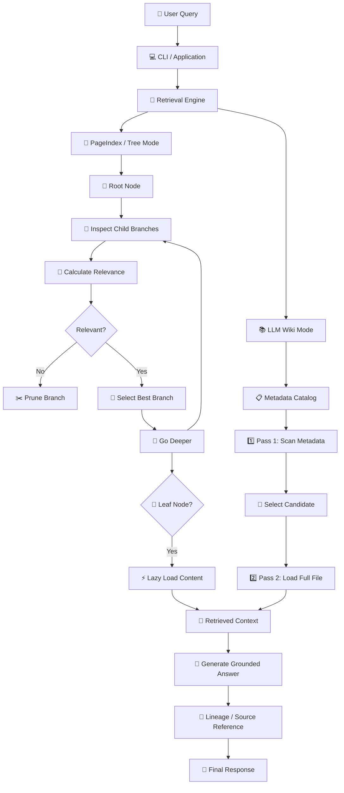
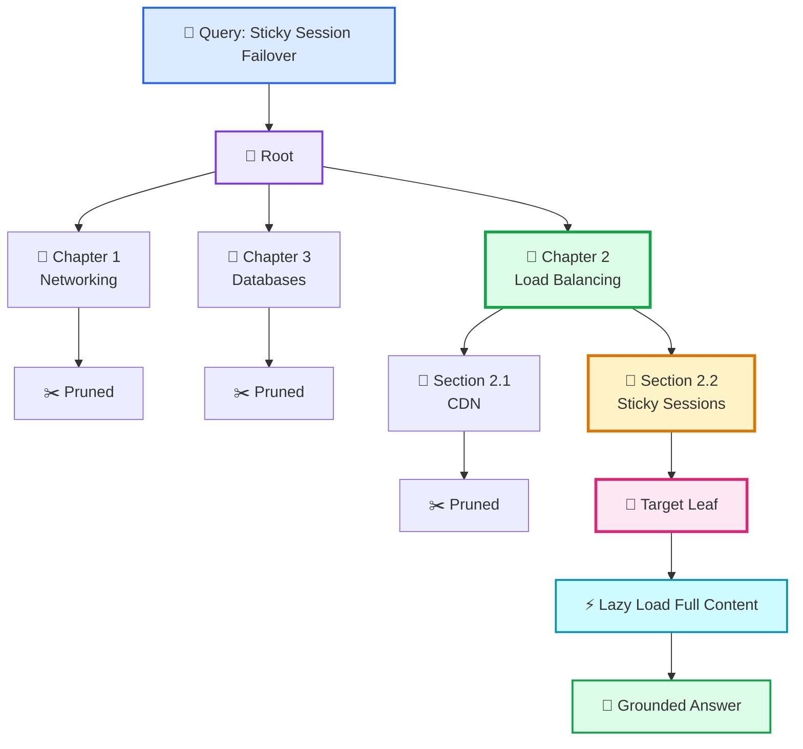
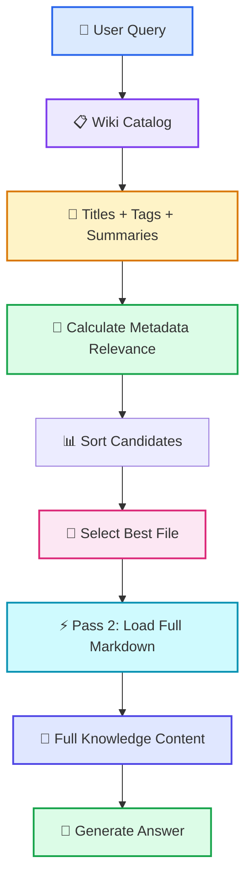
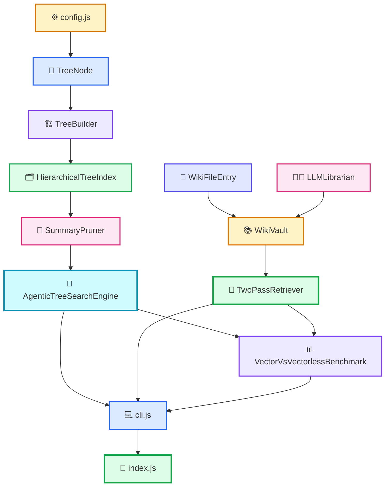
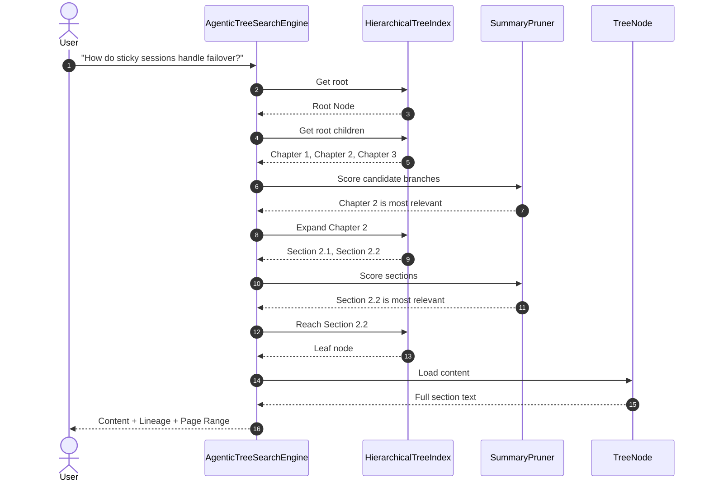
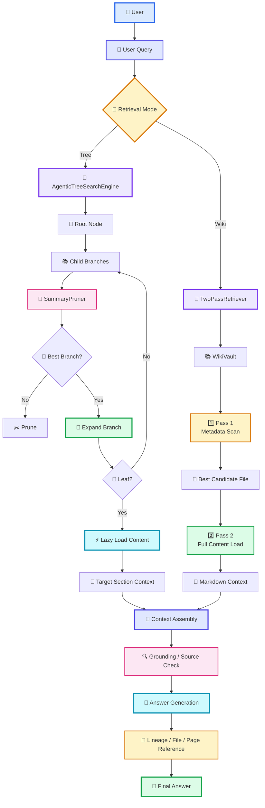

# 📖 Vectorless RAG (`vectorless-rag-01`) — Complete Code & Concept Walkthrough

Welcome to the complete implementation guide for **`vectorless-rag-01`** from:

`week03/learning/day06/code/vectorless-rag-01/`

This guide is written so that **a beginner can start from zero and understand the complete implementation**, including:

* What Vectorless RAG is
* Why traditional Vector RAG can struggle with structured documents
* How the **PageIndex-style hierarchical tree** works
* How tree indexing is implemented in JavaScript
* How agentic tree search works
* How relevance scoring and pruning work
* How lazy loading preserves context
* How the **LLM Wiki / two-pass retrieval** architecture works
* How the benchmark compares vector-style chunking with tree retrieval
* How the CLI and entry point connect everything
* How all classes communicate with each other
* How to modify and experiment with the implementation

> **Important:** This repository is an educational implementation/simulation of these architectures. It demonstrates the core ideas using JavaScript classes and local scoring rather than representing a complete production-scale document ingestion system.

---

# 📚 Table of Contents

1. [What Are We Building?](#1-what-are-we-building)
2. [Traditional Vector RAG vs Vectorless RAG](#2-traditional-vector-rag-vs-vectorless-rag)
3. [The Core Idea Behind Vectorless RAG](#3-the-core-idea-behind-vectorless-rag)
4. [Complete System Architecture](#4-complete-system-architecture)
5. [Project Structure](#5-project-structure)
6. [How Data Moves Through the System](#6-how-data-moves-through-the-system)
7. [Configuration Layer — `config.js`](#7-configuration-layer--configjs)
8. [TreeNode — The Basic Building Block](#8-treenode--the-basic-building-block)
9. [HierarchicalTreeIndex — Managing the Tree](#9-hierarchicaltreeindex--managing-the-tree)
10. [TreeBuilder — Creating the Knowledge Tree](#10-treebuilder--creating-the-knowledge-tree)
11. [SummaryPruner — Relevance Scoring](#11-summarypruner--relevance-scoring)
12. [AgenticTreeSearchEngine — Tree Traversal](#12-agentictreesearchengine--tree-traversal)
13. [Complete Tree Search Example](#13-complete-tree-search-example)
14. [Lazy Loading](#14-lazy-loading)
15. [Lineage and Explainability](#15-lineage-and-explainability)
16. [LLM Wiki Architecture](#16-llm-wiki-architecture)
17. [WikiFileEntry and WikiVault](#17-wikifileentry-and-wikivault)
18. [LLMLibrarian](#18-llmlibrarian)
19. [TwoPassRetriever](#19-twopassretriever)
20. [Complete Wiki Retrieval Example](#20-complete-wiki-retrieval-example)
21. [Vector vs Vectorless Benchmark](#21-vector-vs-vectorless-benchmark)
22. [CLI Layer](#22-cli-layer)
23. [Application Entry Point](#23-application-entry-point)
24. [Complete Class Relationship](#24-complete-class-relationship)
25. [Complete End-to-End Flow](#25-complete-end-to-end-flow)
26. [How to Run](#26-how-to-run)
27. [Beginner Experiments](#27-beginner-experiments)
28. [Key Takeaways](#28-key-takeaways)

---

# 1. What Are We Building?

The project demonstrates **two approaches to retrieving information from large collections of knowledge**.

### Approach 1 — PageIndex-style Vectorless RAG

Instead of:

```text
Document
   ↓
Fixed-size chunks
   ↓
Embeddings
   ↓
Vector Database
   ↓
Similarity Search
```

we build:

```text
Document
   ↓
Understand Structure
   ↓
Hierarchical Tree
   ↓
Search Tree Top → Down
   ↓
Find Exact Section
   ↓
Load Full Content
```

The important idea is:

> **Don't search isolated pieces of text when the document already contains a meaningful hierarchy.**

For example:

```text
Book
└── Chapter 2
    └── Section 2.2
        └── Subsection 2.2.2
            └── Pages 181–184
```

A query about sticky-session failover can navigate directly through this hierarchy.

---

# 2. Traditional Vector RAG vs Vectorless RAG

## Traditional Vector RAG

A simplified Vector RAG pipeline looks like this:

```text
PDF
 ↓
Chunk
 ↓
Chunk
 ↓
Chunk
 ↓
Embedding
 ↓
Vector Database
 ↓
Query Embedding
 ↓
Similarity Search
 ↓
Top-K Chunks
 ↓
LLM
```

The problem is that the chunk itself may not know where it came from.

For example:

```text
Chunk A:
"...Load balancing distributes traffic..."

Chunk B:
"...this mechanism uses encrypted cookies..."
```

The second chunk might have lost the information that:

```text
this mechanism
      ↓
Sticky Sessions
      ↓
ALB
      ↓
Load Balancing
```

---

# 3. The Core Idea Behind Vectorless RAG

Vectorless RAG keeps the **document structure**.

Instead of destroying the hierarchy:

```text
Document → random chunks
```

we preserve:

```text
Document
├── Chapter 1
├── Chapter 2
│   ├── Section 2.1
│   └── Section 2.2
│       ├── Subsection 2.2.1
│       └── Subsection 2.2.2
└── Chapter 3
```

Each node can contain:

```text
Node
├── ID
├── Title
├── Level
├── Page Range
├── Summary
├── Keywords
├── Entities
├── Parent
├── Children
└── Content
```

But importantly:

> **The heavy raw content does not need to be loaded while navigating the tree.**

The search engine first uses lightweight metadata and only loads the target content at the end.

---

# 4. Complete System Architecture



---

# 5. Project Structure

```text
vectorless-rag-01/
│
├── package.json
├── .env.example
├── implementation.md
│
└── src/
    │
    ├── config.js
    │
    ├── tree/
    │   ├── TreeNode.js
    │   ├── HierarchicalTreeIndex.js
    │   └── TreeBuilder.js
    │
    ├── search/
    │   ├── SummaryPruner.js
    │   └── AgenticTreeSearchEngine.js
    │
    ├── wiki/
    │   ├── WikiVault.js
    │   ├── LLMLibrarian.js
    │   └── TwoPassRetriever.js
    │
    ├── comparison/
    │   └── VectorVsVectorlessBenchmark.js
    │
    ├── cli.js
    └── index.js
```

The easiest way to understand the project is to follow this dependency direction:

```text
config
  ↓
tree
  ↓
search
  ↓
wiki
  ↓
comparison
  ↓
cli
  ↓
index
```

---

# 6. How Data Moves Through the System

There are essentially **two retrieval systems**.

## PageIndex-style Tree Retrieval

```text
User Query
    ↓
AgenticTreeSearchEngine
    ↓
HierarchicalTreeIndex
    ↓
TreeNode children
    ↓
SummaryPruner
    ↓
Best Branch
    ↓
Best Section
    ↓
Leaf Node
    ↓
Full Content
```

## LLM Wiki Retrieval

```text
User Query
    ↓
TwoPassRetriever
    ↓
WikiVault
    ↓
Metadata Catalog
    ↓
Pass 1
    ↓
Best File
    ↓
Pass 2
    ↓
Full Markdown Content
```

---

# 7. Configuration Layer — `config.js`

### File

```text
src/config.js
```

The configuration layer provides application-level settings.

For example:

```javascript
export const config = {
  env: process.env.NODE_ENV || "development",

  maxTreeDepth:
    Number(process.env.DEFAULT_MAX_TREE_DEPTH) || 3,

  pruningThreshold:
    Number(process.env.SUMMARY_PRUNING_THRESHOLD) || 1.5
};
```

## What is happening?

### `process.env`

Node.js exposes environment variables through:

```javascript
process.env
```

For example:

```text
DEFAULT_MAX_TREE_DEPTH=3
```

can be accessed using:

```javascript
process.env.DEFAULT_MAX_TREE_DEPTH
```

---

## Why convert it with `Number()`?

Environment variables are strings.

So:

```javascript
process.env.DEFAULT_MAX_TREE_DEPTH
```

might return:

```text
"3"
```

We convert it:

```javascript
Number("3")
```

which produces:

```text
3
```

---

## Why use `|| 3`?

```javascript
Number(value) || 3
```

means:

> If the environment value is missing or invalid, use `3`.

---

# 8. TreeNode — The Basic Building Block

### File

```text
src/tree/TreeNode.js
```

`TreeNode` is the most important data structure in the PageIndex-style implementation.

Think of every node as a **folder or section in a book**.

For example:

```text
Root
├── Chapter 1
├── Chapter 2
│   ├── Section 2.1
│   └── Section 2.2
└── Chapter 3
```

Each of these can be represented by a `TreeNode`.

---

## Node properties

A node can contain:

```javascript
nodeId
title
level
pageRange
summary
keywords
entities
children
parent
content
```

Example:

```javascript
const section = new TreeNode(
  "sec_2_2",
  "Section 2.2: Sticky Sessions",
  2,
  [161, 250],
  "Cookie-based sticky sessions and failover behavior."
);
```

Conceptually:

```text
sec_2_2
│
├── title
│   └── Section 2.2: Sticky Sessions
│
├── level
│   └── 2
│
├── pageRange
│   └── [161, 250]
│
├── summary
│   └── Cookie-based sticky sessions...
│
├── children
│   └── [...]
│
├── parent
│   └── Chapter 2
│
└── content
    └── Full section text
```

---

## `addChild()`

```javascript
addChild(childNode) {
  childNode.parent = this;
  this.children.push(childNode);
}
```

This does **two things**.

### 1. Add child

```javascript
this.children.push(childNode);
```

### 2. Set parent

```javascript
childNode.parent = this;
```

So:

```text
Chapter 2
    ↓ parent
Section 2.2
```

and:

```text
Chapter 2
    ↓
children[]
    ↓
Section 2.2
```

Both directions are available.

This becomes extremely useful later when generating lineage paths.

---

# 9. `isLeaf()` — Finding the Target Node

```javascript
isLeaf() {
  return this.children.length === 0;
}
```

A leaf is simply a node with no children.

Example:

```text
Chapter 2
├── Section 2.1
└── Section 2.2
    └── Subsection 2.2.1
```

Here:

```text
Chapter 2       ❌ not leaf
Section 2.2     ❌ not leaf
Subsection      ✅ leaf
```

The search engine eventually wants to reach this leaf.

---

# 10. `toMetadataJSON()` — Lightweight Tree Representation

One important optimization is separating:

```text
metadata
```

from:

```text
heavy content
```

For example:

```javascript
toMetadataJSON(includeContent = false) {
  return {
    nodeId: this.nodeId,
    title: this.title,
    level: this.level,
    pageRange: this.pageRange,
    summary: this.summary,
    keywords: this.keywords,
    entities: this.entities,
    childrenCount: this.children.length,

    ...(includeContent && {
      content: this.content
    })
  };
}
```

If:

```javascript
includeContent = false
```

the returned object does **not** contain raw content.

This allows the search process to work with lightweight information.

---

# 11. HierarchicalTreeIndex — Managing the Tree

### File

```text
src/tree/HierarchicalTreeIndex.js
```

`TreeNode` represents one node.

`HierarchicalTreeIndex` manages the **entire tree**.

Think:

```text
TreeNode
   ↓
one folder

HierarchicalTreeIndex
   ↓
entire file system
```

---

## Internal lookup Map

The class maintains something like:

```javascript
this.indexMap = new Map();
```

Then recursively indexes every node:

```javascript
_indexSubtree(node) {
  this.indexMap.set(node.nodeId, node);

  for (const child of node.children) {
    this._indexSubtree(child);
  }
}
```

For this tree:

```text
root
├── ch_1
├── ch_2
│   ├── sec_2_1
│   └── sec_2_2
└── ch_3
```

the Map becomes conceptually:

```text
"root"     → Root Node
"ch_1"     → Chapter 1
"ch_2"     → Chapter 2
"sec_2_1"  → Section 2.1
"sec_2_2"  → Section 2.2
"ch_3"     → Chapter 3
```

Therefore:

```javascript
tree.getNode("sec_2_2")
```

can directly retrieve the node.

---

# 12. Why `Map`?

JavaScript's `Map` provides efficient key-based lookup.

Instead of searching the entire tree every time:

```text
root
 ↓
chapter 1
 ↓
chapter 2
 ↓
section 2.1
 ↓
section 2.2
```

we can directly do:

```javascript
indexMap.get("sec_2_2")
```

This is especially useful when the tree becomes large.

---

# 13. Lineage Path

One of the strongest features of a hierarchical system is **traceability**.

Suppose the target is:

```text
sec_2_2
```

Its parent is:

```text
ch_2
```

whose parent is:

```text
root
```

The method:

```javascript
getLineagePath(nodeId) {
  const path = [];

  let current = this.getNode(nodeId);

  while (current) {
    path.unshift(current.nodeId);
    current = current.parent;
  }

  return path;
}
```

produces:

```text
root
  ↓
ch_2
  ↓
sec_2_2
```

or:

```javascript
[
  "root",
  "ch_2",
  "sec_2_2"
]
```

This gives us an explicit navigation trail.

---

# 14. Why `unshift()`?

Suppose we start here:

```text
sec_2_2
```

Then move upward:

```text
sec_2_2 → ch_2 → root
```

But we want:

```text
root → ch_2 → sec_2_2
```

Therefore:

```javascript
path.unshift(current.nodeId);
```

adds each parent to the beginning.

---

# 15. TreeBuilder — Creating the Knowledge Tree

### File

```text
src/tree/TreeBuilder.js
```

This module creates the document hierarchy.

For example:

```text
📚 Distributed Systems Architecture Manual

├── Chapter 1
│
├── Chapter 2: Load Balancing
│   ├── Section 2.1: CDN
│   └── Section 2.2: Sticky Sessions
│
└── Chapter 3: Database Replication
```

A simplified construction looks like:

```javascript
const root = new TreeNode(
  "root",
  "Distributed Systems Architecture Manual",
  0,
  [1, 500],
  "Complete distributed systems manual."
);

const ch2 = new TreeNode(
  "ch_2",
  "Chapter 2: Load Balancing",
  1,
  [121, 250],
  "Load balancing and traffic distribution."
);

const sec22 = new TreeNode(
  "sec_2_2",
  "Section 2.2: Sticky Sessions",
  2,
  [161, 250],
  "Session persistence and failover behavior."
);

ch2.addChild(sec22);
root.addChild(ch2);
```

The resulting structure is:

```text
root
└── ch_2
    └── sec_2_2
```

---

# 16. SummaryPruner — Relevance Scoring

### File

```text
src/search/SummaryPruner.js
```

This is where the system decides:

> **Which branch should I investigate?**

In the current implementation, the project uses a **local keyword-based scoring mechanism**.

It is important to distinguish this from an actual LLM-powered agent:

```text
Current vectorless-rag-01
        ↓
Local relevance scoring

Gemini version
        ↓
Gemini evaluates candidate summaries
```

---

# 17. How Relevance Scoring Works

The implementation normalizes the query:

```javascript
const normalizedQuery = query.toLowerCase();
```

Then splits it:

```javascript
const queryTerms =
  normalizedQuery
    .split(/\s+/)
    .filter(t => t.length > 2);
```

For:

```text
How do sticky sessions handle failover?
```

we get terms roughly like:

```text
sticky
sessions
handle
failover
```

---

# 18. Building Searchable Node Text

The node information is combined:

```javascript
const nodeText =
  `${node.title}
   ${node.summary}
   ${node.keywords.join(" ")}
   ${node.entities.join(" ")}`
   .toLowerCase();
```

So the system isn't checking only the title.

It searches:

```text
Title
+
Summary
+
Keywords
+
Entities
```

This gives the node more searchable context.

---

# 19. Scoring Rules

The implementation gives a basic score for matching terms.

### Summary / keywords / entities

```javascript
score += 2.0;
```

### Title match

```javascript
score += 3.0;
```

Therefore, title matches are considered stronger.

For example:

```text
Query:
sticky sessions failover

Node A:
"CDN Static Asset Caching"

Node B:
"Sticky Sessions and Failover"
```

Node B receives a stronger score because the important terms appear directly in its title and metadata.

---

# 20. Why Pruning?

Imagine the tree contains:

```text
Root
├── Chapter 1: Networking
├── Chapter 2: Load Balancing
├── Chapter 3: Databases
├── Chapter 4: Security
└── Chapter 5: Monitoring
```

For:

```text
How do sticky sessions handle failover?
```

we don't need to deeply inspect:

```text
Chapter 3
Chapter 4
Chapter 5
```

The search can eliminate irrelevant branches.

This is:

> **Branch pruning.**

---

# 21. AgenticTreeSearchEngine

### File

```text
src/search/AgenticTreeSearchEngine.js
```

This is the **orchestrator** of the PageIndex-style search.

It combines:

```text
Tree
+
SummaryPruner
+
Traversal logic
```

---

# 22. Tree Search Algorithm

The algorithm is:

```text
1. Start at root
2. Look at children
3. Score children
4. Select best branch
5. Move into branch
6. Repeat
7. Stop at leaf
8. Retrieve content
9. Return lineage
```

In pseudocode:

```javascript
currentNode = tree.root;

while (!currentNode.isLeaf()) {

  children = currentNode.children;

  selected =
    selectBestBranch(query, children);

  currentNode = selected;
}

return currentNode.content;
```

---

# 23. Complete Tree Traversal

Suppose the query is:

```text
How do sticky sessions handle failover?
```

The tree is:

```text
Root
│
├── Chapter 1: Networking
│
├── Chapter 2: Load Balancing
│   │
│   ├── Section 2.1: CDN
│   │
│   └── Section 2.2: Sticky Sessions
│
└── Chapter 3: Databases
```

### Step 1

Start:

```text
Root
```

Evaluate:

```text
Chapter 1
Chapter 2
Chapter 3
```

Best:

```text
Chapter 2
```

---

### Step 2

Now inspect:

```text
Chapter 2
```

Children:

```text
Section 2.1
Section 2.2
```

Best:

```text
Section 2.2
```

---

### Step 3

If it is a leaf:

```text
Section 2.2
```

stop searching.

---

### Step 4

Load:

```text
Section 2.2 content
```

---

# 24. Complete Traversal Diagram



---

# 25. Lazy Loading

One of the most important ideas in this architecture is:

> **Don't load everything just because you indexed everything.**

Suppose a document contains:

```text
500 pages
```

and the user asks about:

```text
Sticky session failover
```

The system doesn't need:

```text
500 pages
```

It needs the relevant section.

So:

```text
Tree metadata
     ↓
Navigate
     ↓
Find target
     ↓
Load content
```

instead of:

```text
Load entire document
     ↓
Send everything to LLM
```

---

# 26. Lineage and Explainability

After retrieval, the system knows exactly where the information came from.

For example:

```text
root
 ↓
ch_2
 ↓
sec_2_2
```

This can be displayed as:

```text
Distributed Systems Manual
→ Chapter 2: Load Balancing
→ Section 2.2: Sticky Sessions
→ Pages 161–250
```

This is one major advantage of hierarchical retrieval:

```text
Retrieval Result
+
Navigation Path
+
Page Range
```

rather than only:

```text
similarity = 0.82
```

---

# 27. LLM Wiki Architecture

The second major implementation is the **LLM Wiki model**, inspired by the idea of using an LLM as a knowledge organizer/librarian.

Instead of representing knowledge as vectors, the project represents it as:

```text
Markdown files
+
Metadata
+
Tags
+
Summaries
```

Example:

```text
docs/
│
├── architecture/
│   └── distributed-locking.md
│
├── caching/
│   └── redis-cluster-strategies.md
│
└── devops/
    └── kubernetes-ingress-setup.md
```

---

# 28. Why Markdown?

Markdown is:

* Human readable
* Easy to edit
* Easy to version-control
* Easy to inspect
* Easy for an LLM to consume
* Easy to organize into folders

Instead of:

```text
Vector ID: 19382
Embedding: [0.182, -0.093, ...]
```

we have:

```text
docs/caching/redis-cluster-strategies.md
```

with meaningful metadata.

---

# 29. WikiFileEntry

### File

```text
src/wiki/WikiVault.js
```

A `WikiFileEntry` represents one knowledge document.

Conceptually:

```text
WikiFileEntry
│
├── filePath
├── title
├── category
├── tags
├── summary
└── content
```

Example:

```javascript
new WikiFileEntry(
  "docs/caching/redis-cluster-strategies.md",
  "Redis Cluster Strategies",
  "caching",
  ["redis", "cluster", "sharding"],
  "Redis cluster architecture and scaling strategies.",
  "# Redis Cluster..."
);
```

---

# 30. WikiVault

`WikiVault` acts as the container for these files.

Think:

```text
WikiVault
    ↓
Knowledge Library
```

It provides two important operations.

### Metadata

```javascript
listCatalogMetadata()
```

returns lightweight information.

For example:

```json
{
  "filePath": "docs/caching/redis.md",
  "title": "Redis Cluster",
  "category": "caching",
  "tags": ["redis", "cluster"],
  "summary": "Redis cluster architecture..."
}
```

Notice:

```text
content
```

is not required.

---

### Full content

```javascript
readFileContent(filePath)
```

loads the actual Markdown content.

This creates the two-pass architecture.

---

# 31. Two-Pass Retrieval

### File

```text
src/wiki/TwoPassRetriever.js
```

The algorithm is extremely simple conceptually.

```text
PASS 1
↓
Search metadata

PASS 2
↓
Load selected document
```

---

# 32. Pass 1 — Metadata Scan

Suppose the vault contains:

```text
distributed-locking.md
redis-cluster.md
kubernetes-ingress.md
```

Query:

```text
How does Redis cluster sharding work?
```

Pass 1 examines:

```text
Titles
Summaries
Tags
Categories
```

It does **not** need to load every file's full content.

---

# 33. Pass 1 Scoring

The implementation builds searchable metadata:

```javascript
const metaText =
  `${meta.title}
   ${meta.summary}
   ${meta.tags.join(" ")}`
   .toLowerCase();
```

Then calculates a score.

Matching files are collected:

```javascript
candidateFiles.push({
  filePath: meta.filePath,
  score
});
```

Then:

```javascript
candidateFiles.sort(
  (a, b) => b.score - a.score
);
```

The highest-scoring file becomes the candidate.

---

# 34. Pass 2 — Selective Content Loading

Once the best file is identified:

```javascript
const selectedFile = candidateFiles[0];
```

the system loads:

```javascript
vault.readFileContent(
  selectedFile.filePath
);
```

So instead of reading:

```text
10 files
```

it might only read:

```text
1 selected file
```

---

# 35. Complete Two-Pass Diagram



---

# 36. LLMLibrarian

### File

```text
src/wiki/LLMLibrarian.js
```

This module represents the idea of a **background knowledge librarian**.

Its job in this educational project is to create/populate the WikiVault with structured knowledge entries.

For example:

```text
LLMLibrarian
      ↓
Create WikiFileEntry
      ↓
Add to WikiVault
      ↓
Create searchable catalog
```

In a more complete system, a background LLM could potentially help transform raw sources into:

```text
Raw Document
    ↓
Extract concepts
    ↓
Create summary
    ↓
Generate tags
    ↓
Organize folder
    ↓
Create Markdown
```

---

# 37. Benchmark Layer

### File

```text
src/comparison/VectorVsVectorlessBenchmark.js
```

The benchmark exists to make the conceptual difference easier to see.

It compares:

```text
Fixed-size chunking
```

against:

```text
Hierarchical retrieval
```

---

# 38. Fixed Chunking Simulation

The benchmark uses an arbitrary chunk size.

Conceptually:

```javascript
text.slice(0, 150)
text.slice(150, 300)
text.slice(300, 450)
```

This can produce:

```text
Chunk 1:
"...load balancing distributes traffic..."

Chunk 2:
"...this mechanism uses encrypted..."
```

The boundary can occur in the middle of an idea.

---

# 39. Tree-Based Retrieval

The Vectorless version instead preserves:

```text
Chapter
 ↓
Section
 ↓
Subsection
 ↓
Page
```

So the benchmark can show:

```text
Fixed Chunking
❌ Fragmented context

Tree Retrieval
✅ Structural context
```

---

# 40. CLI Layer

### File

```text
src/cli.js
```

The CLI provides a convenient way to execute different parts of the project.

For example:

```bash
npm run tree-search
```

runs tree retrieval.

```bash
npm run llm-wiki
```

runs Wiki retrieval.

```bash
npm run benchmark
```

runs the comparison.

The CLI is essentially the **user interface for the Node.js demo**.

---

# 41. Application Entry Point

### File

```text
src/index.js
```

`index.js` acts as the main program entry point.

It can coordinate the demonstrations:

```text
Tree Search
     ↓
Wiki Retrieval
     ↓
Benchmark
```

So the architecture becomes:

```text
index.js
   │
   ├── TreeBuilder
   │       ↓
   │   TreeIndex
   │       ↓
   │   SearchEngine
   │
   ├── LLMLibrarian
   │       ↓
   │   WikiVault
   │       ↓
   │   TwoPassRetriever
   │
   └── Benchmark
```

---

# 42. Complete Class Relationship

This is perhaps the most important diagram for understanding the codebase.



---

# 43. Complete Tree Search Sequence

Here is the complete runtime interaction.



---

# 44. Complete End-to-End Architecture

Putting everything together:



---

# 45. What Happens When a Query Arrives?

Let's follow one real example:

```text
How do sticky sessions handle failover?
```

### Step 1 — Query enters

```text
User
 ↓
Query
```

### Step 2 — Choose retrieval strategy

```text
Tree Mode
```

### Step 3 — Start at root

```text
root
```

### Step 4 — Inspect branches

```text
Chapter 1
Chapter 2
Chapter 3
```

### Step 5 — Score branches

```text
Chapter 1 → low
Chapter 2 → high
Chapter 3 → low
```

### Step 6 — Select Chapter 2

```text
root
 ↓
ch_2
```

### Step 7 — Inspect children

```text
Section 2.1
Section 2.2
```

### Step 8 — Select Section 2.2

```text
root
 ↓
ch_2
 ↓
sec_2_2
```

### Step 9 — Reach leaf

Now retrieve:

```text
sec_2_2.content
```

### Step 10 — Return result

The result can contain:

```text
Answer
+
Source
+
Page Range
+
Lineage
```

---

# 46. Why This Architecture Is Different

Traditional retrieval asks:

> **"Which text chunks are mathematically similar to this query?"**

This architecture asks:

> **"Where in the document hierarchy should I look?"**

That is a fundamental difference.

### Vector-style retrieval

```text
Query
 ↓
Embedding
 ↓
Similarity
 ↓
Chunks
```

### Tree retrieval

```text
Query
 ↓
Root
 ↓
Chapter
 ↓
Section
 ↓
Subsection
 ↓
Exact Content
```

---

# 47. Important Difference: This Repository vs Gemini Version

There are two related implementations from Day 06.

### `vectorless-rag-01`

Uses local relevance scoring:

```text
Query
 ↓
SummaryPruner
 ↓
Keyword / metadata score
 ↓
Best branch
```

### `vectorless-rag-gemini-01`

Adds Gemini into the decision process:

```text
Query
 ↓
Candidate summaries
 ↓
Gemini
 ↓
Structured decision
 ↓
Best branch
```

So don't confuse the two.

The architecture remains similar, but the **decision mechanism changes**.

---

# 48. Vectorless RAG Does Not Mean "No LLM"

The term **vectorless** means the retrieval mechanism does not depend on vector embeddings/vector similarity as its primary index.

It does **not** necessarily mean:

```text
No AI
```

A system can use an LLM for:

```text
Tree construction
Summary generation
Branch selection
Query understanding
Answer generation
```

For example:

```text
                    Vectorless RAG

                         │
          ┌──────────────┴──────────────┐
          ↓                             ↓
    Local Scoring                  LLM Reasoning
          │                             │
    vectorless-rag-01          vectorless-rag-gemini-01
```

---

# 49. How to Run the Project

From:

```bash
week03/learning/day06/code/vectorless-rag-01/
```

run:

### All demonstrations

```bash
npm start
```

### Interactive CLI

```bash
npm run cli
```

### Tree Search

```bash
npm run tree-search
```

### LLM Wiki

```bash
npm run llm-wiki
```

### Benchmark

```bash
npm run benchmark
```

---

# 50. Recommended Learning Order

If you are completely new to the project, **don't read the files randomly**.

Follow this order:

```text
1. config.js
      ↓
2. TreeNode.js
      ↓
3. TreeBuilder.js
      ↓
4. HierarchicalTreeIndex.js
      ↓
5. SummaryPruner.js
      ↓
6. AgenticTreeSearchEngine.js
      ↓
7. WikiVault.js
      ↓
8. LLMLibrarian.js
      ↓
9. TwoPassRetriever.js
      ↓
10. Benchmark
      ↓
11. CLI
      ↓
12. index.js
```

This order follows the actual conceptual dependency chain.

---

# 51. Beginner Experiment #1 — Add a New Tree Section

Open:

```text
src/tree/TreeBuilder.js
```

Add:

```text
Section 1.3:
DNS Resolution & Anycast Routing
```

under:

```text
Chapter 1
```

Your tree becomes:

```text
Root
├── Chapter 1
│   ├── Section 1.1
│   ├── Section 1.2
│   └── Section 1.3: DNS & Anycast
│
├── Chapter 2
│   ├── Section 2.1
│   └── Section 2.2
│
└── Chapter 3
```

Then run:

```bash
npm run tree-search
```

and query:

```text
How does DNS Anycast routing work?
```

Watch which branch the search selects.

---

# 52. Beginner Experiment #2 — Change the Pruning Threshold

Change:

```text
SUMMARY_PRUNING_THRESHOLD
```

For example:

```env
SUMMARY_PRUNING_THRESHOLD=5.0
```

A higher threshold means the system becomes more selective.

Conceptually:

```text
Low threshold
    ↓
More branches survive

High threshold
    ↓
More branches are pruned
```

This helps you understand how retrieval sensitivity changes.

---

# 53. Beginner Experiment #3 — Change Node Metadata

Try modifying:

```text
title
summary
keywords
entities
```

For example:

```text
Title:
Session Persistence & Failover

Summary:
Explains cookie-based persistence and recovery
when backend servers fail.

Keywords:
sticky sessions
failover
ALB
cookies
```

Then ask:

```text
How does ALB recover sessions?
```

Observe how the metadata affects the relevance score.

---

# 54. Beginner Experiment #4 — Compare Chunking vs Tree

Run:

```bash
npm run benchmark
```

Pay attention to:

```text
Fixed Chunk
```

versus:

```text
Tree Node
```

Ask yourself:

> Which representation preserves more information about where the text belongs?

The answer should become clear from the structure:

```text
Chunk:
"...encrypted cookies..."

Tree:
Root
 → Load Balancing
 → Session Persistence
 → Sticky Sessions
 → Page Range
```

---

# 55. The Most Important Classes to Remember

You don't need to memorize every line.

Understand these responsibilities:

| Class                         | Responsibility                         |
| ----------------------------- | -------------------------------------- |
| `TreeNode`                    | Represents one document node           |
| `HierarchicalTreeIndex`       | Manages the complete tree              |
| `TreeBuilder`                 | Creates the document hierarchy         |
| `SummaryPruner`               | Calculates branch relevance            |
| `AgenticTreeSearchEngine`     | Navigates the tree                     |
| `WikiFileEntry`               | Represents one Markdown knowledge file |
| `WikiVault`                   | Stores Wiki files                      |
| `LLMLibrarian`                | Builds/organizes Wiki knowledge        |
| `TwoPassRetriever`            | Performs metadata → content retrieval  |
| `VectorVsVectorlessBenchmark` | Compares retrieval approaches          |
| `cli.js`                      | Provides command-line interaction      |
| `index.js`                    | Main application entry point           |

---

# 56. The Entire Project in One Picture

```text
                         👤 USER
                            │
                            ▼
                     💬 USER QUERY
                            │
                            ▼
                       🔀 MODE
                      /       \
                     /         \
                    ▼           ▼
             🌳 TREE MODE    📚 WIKI MODE
                    │           │
                    ▼           ▼
              TreeIndex      WikiVault
                    │           │
                    ▼           ▼
              SummaryPruner   PASS 1
                    │        Metadata
                    ▼           │
              Best Branch       ▼
                    │        Candidate
                    ▼           │
              Tree Traversal    ▼
                    │        PASS 2
                    ▼           │
               Leaf Node        ▼
                    │       Full Markdown
                    │           │
                    └─────┬─────┘
                          ▼
                   🧩 CONTEXT
                          │
                          ▼
                    🤖 LLM / APP
                          │
                          ▼
                  📌 SOURCE / LINEAGE
                          │
                          ▼
                    💬 FINAL ANSWER
```

---

# 57. Final Mental Model

If you remember only **one thing**, remember this:

### Traditional Vector RAG

```text
Document
   ↓
Random Chunks
   ↓
Embeddings
   ↓
Vector Search
   ↓
Similar Chunks
```

### Vectorless Tree RAG

```text
Document
   ↓
Understand Structure
   ↓
Build Tree
   ↓
Search Root
   ↓
Choose Chapter
   ↓
Choose Section
   ↓
Choose Subsection
   ↓
Load Exact Content
```

### LLM Wiki

```text
Documents
   ↓
Organize as Markdown
   ↓
Create Metadata Catalog
   ↓
PASS 1 → Find Candidate
   ↓
PASS 2 → Load Full File
   ↓
Answer
```

And the central idea behind the whole Day 06 implementation is:

> **Instead of treating a document as a bag of disconnected chunks, preserve its structure and navigate that structure to find the information you actually need.**

This makes the codebase much easier to understand because every file has a clear responsibility: **build the knowledge structure → search the structure → retrieve the exact content → return an explainable result.**
