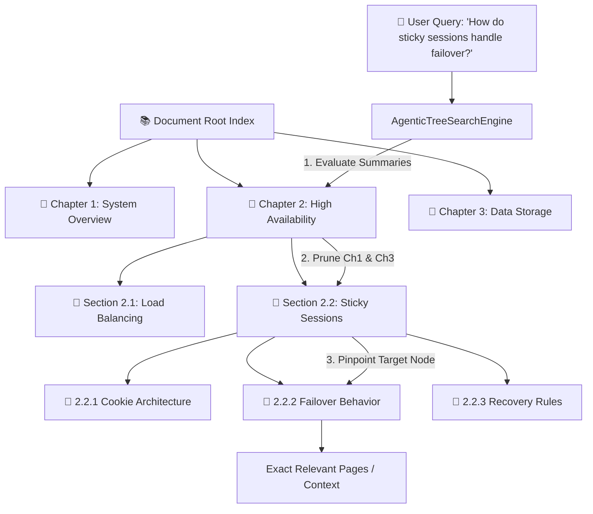
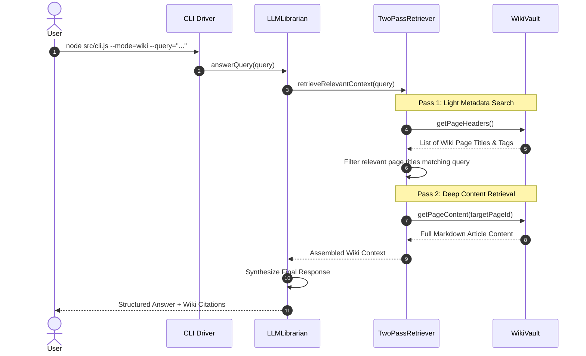

# Vectorless RAG & LLM Wiki Master Index

Welcome to the **Vectorless RAG & LLM Wiki Framework Guide**! This guide takes backend and AI engineers step-by-step through building a production-grade **Vectorless RAG (PageIndex Model / Tree RAG)** and **LLM Wiki Architecture (Karpathy Model)** from scratch.

Built with **Node.js (ESM)** and zero external vector database dependencies, this architecture solves the context fragmentation problems of traditional vector RAG by organizing documents into **Hierarchical Tree Indexes** and traversing them top-down using agentic reasoning, or organizing knowledge into an **LLM Wiki Vault** with two-pass retrieval.

---

## 📁 Project Folder Structure Map

All source code for this framework is located inside `week03/learning/day06/code/vectorless-rag-01/`:

```text
vectorless-rag-01/
├── package.json                   # NPM dependencies & scripts ("type": "module")
├── .env.example                   # Environment configuration template
├── CODE_EXPLANATION.md            # In-depth architectural explanation
├── implementation.md              # Original implementation notes
├── implementation guide/          # Step-by-step implementation chapters & documentation
│   ├── README.md                  # Master index & system architecture (this file)
│   ├── chapter-00-overview-setup.md
│   ├── chapter-01-tree-node-index.md
│   ├── chapter-02-tree-builder.md
│   ├── chapter-03-agentic-tree-search.md
│   ├── chapter-04-llm-wiki-vault.md
│   ├── chapter-05-twopass-librarian.md
│   └── chapter-06-benchmark-cli.md
└── src/
    ├── config.js                  # Central configuration & zero-dep env loader
    ├── cli.js                     # Multi-mode CLI driver (tree, wiki, benchmark)
    ├── index.js                   # Application entry point & SDK exports
    ├── tree/
    │   ├── TreeNode.js            # Hierarchical tree node model
    │   ├── HierarchicalTreeIndex.js # Tree index data structure & traversals
    │   └── TreeBuilder.js         # Automated document tree builder & summarizer
    ├── search/
    │   ├── SummaryPruner.js       # Summary relevancy evaluation & branch pruning
    │   └── AgenticTreeSearchEngine.js # Top-down hierarchical tree search engine
    ├── wiki/
    │   ├── WikiVault.js           # LLM Wiki markdown page vault manager
    │   ├── TwoPassRetriever.js    # Two-pass retrieval engine (Headers -> Content)
    │   └── LLMLibrarian.js        # Agentic wiki librarian & synthesizer
    └── comparison/
        └── VectorVsVectorlessBenchmark.js # Benchmark engine comparing Vector vs Vectorless
```

---

## 🏗 Hierarchical Tree Index & Search Architecture

Vectorless RAG preserves natural document structure (Book -> Chapter -> Section -> Subsection -> Page) instead of slicing text into arbitrary vector chunks:



---

## 🔄 Two-Pass LLM Wiki Retrieval Sequence



---

## 📚 Master Chapter Reference Table

| Chapter | Focus Area | Guide File | Key Topics Covered |
| :--- | :--- | :--- | :--- |
| **Ch 0** | **Overview & Setup** | [Chapter 00 Guide](chapter-00-overview-setup.md) | Node.js ESM setup, `package.json`, `.env.example`, zero-dependency `.env` loader (`src/config.js`). |
| **Ch 1** | **Tree Node & Index** | [Chapter 01 Guide](chapter-01-tree-node-index.md) | `TreeNode` model (`TreeNode.js`), parent-child pointers, `HierarchicalTreeIndex` (`HierarchicalTreeIndex.js`), DFS/BFS traversals. |
| **Ch 2** | **Tree Builder** | [Chapter 02 Guide](chapter-02-tree-builder.md) | `TreeBuilder` implementation (`TreeBuilder.js`), document section parsing, summary generation, page range calculations. |
| **Ch 3** | **Tree Search Engine**| [Chapter 03 Guide](chapter-03-agentic-tree-search.md) | `SummaryPruner` (`SummaryPruner.js`), branch pruning thresholds, top-down `AgenticTreeSearchEngine` (`AgenticTreeSearchEngine.js`). |
| **Ch 4** | **LLM Wiki Vault** | [Chapter 04 Guide](chapter-04-llm-wiki-vault.md) | Karpathy LLM Wiki model principles, `WikiVault` class (`WikiVault.js`), Markdown page indexing, tags, and internal links. |
| **Ch 5** | **Two-Pass & Librarian**| [Chapter 05 Guide](chapter-05-twopass-librarian.md) | `TwoPassRetriever` (`TwoPassRetriever.js` - Pass 1 Headers -> Pass 2 Content), `LLMLibrarian` (`LLMLibrarian.js`) wiki synthesis. |
| **Ch 6** | **Benchmark & CLI** | [Chapter 06 Guide](chapter-06-benchmark-cli.md) | `VectorVsVectorlessBenchmark` (`VectorVsVectorlessBenchmark.js`), multi-mode CLI (`cli.js`), `index.js`, execution workflows. |

---

## ⚡ Quick Start Sequence

### 1. Install Dependencies
Navigate to the project root directory and install dependencies:

```bash
cd week03/learning/day06/code/vectorless-rag-01
npm install
```

### 2. Configure Environment Variables (Optional)

```bash
cp .env.example .env
export OPENAI_API_KEY="your-openai-api-key-here"
```

### 3. Run Tree Search Demonstration

```bash
npm run tree-search
```

### 4. Run LLM Wiki Demonstration

```bash
npm run llm-wiki
```

### 5. Run Vector vs Vectorless Benchmark

```bash
npm run benchmark
```
