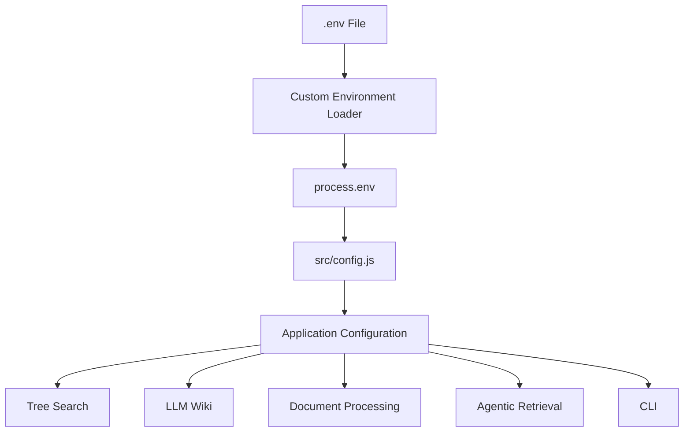
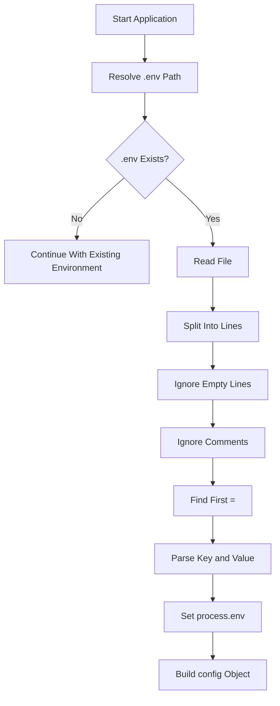
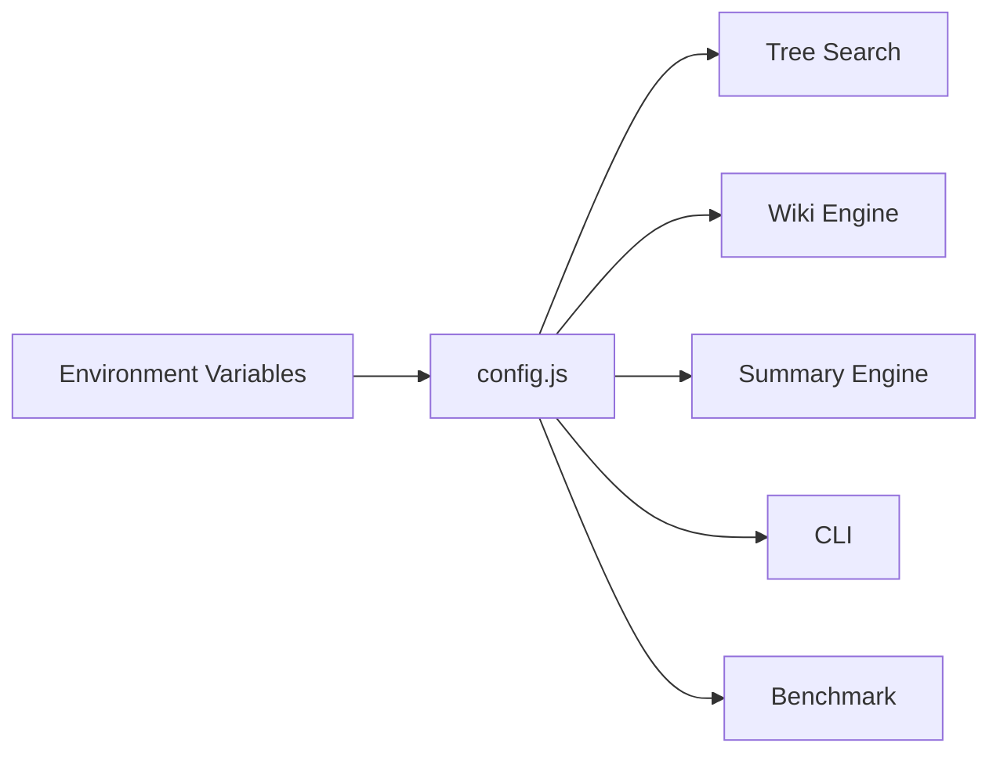
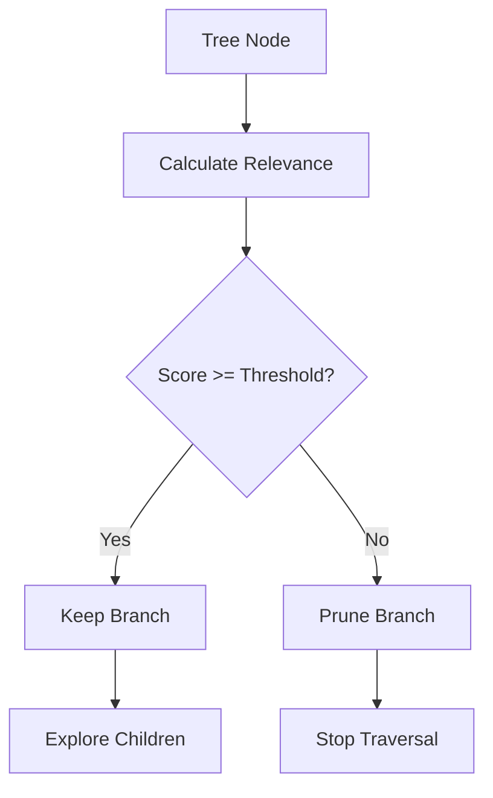
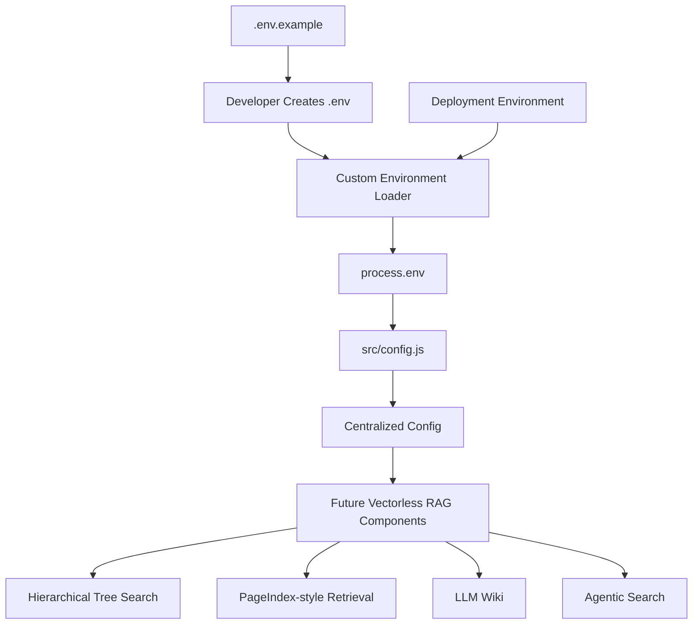

# Chapter 0 — Overview, Setup & Zero-Dependency Configuration

## 1. Chapter Goal

This chapter prepares the foundation for the **Vectorless RAG** architecture.

Unlike traditional RAG systems that depend on vector databases and embedding-based similarity search, this architecture focuses on **retrieval without a vector database**.

The system will progressively combine:

* Hierarchical tree-based document retrieval
* LLM-driven navigation
* Structured document summaries
* PageIndex-style tree search
* LLM Wiki-style knowledge organization
* Relevance-based branch pruning
* Agentic retrieval decisions

The first step is to create a lightweight and centralized configuration system.

Instead of using an external `.env` package, this project uses Node.js built-in modules to implement a small custom environment loader.

This gives us a **zero-NPM-dependency configuration layer**.

> **Important:** “Zero-dependency” here means zero additional npm dependencies for configuration. Node.js itself provides built-in modules such as `fs` and `path`.

### In this chapter, we will:

* Configure Node.js using native ES Modules
* Create the `.env.example` template
* Implement a custom `.env` loader
* Build the centralized `config` object
* Validate numeric configuration values
* Verify that configuration loading works correctly

---

## 2. Expected Project Structure

After completing this chapter, the relevant structure will be:

```text
vectorless-rag-01/
├── .env.example
├── package.json
└── src/
    └── config.js
```

The important file is:

```text
src/config.js
```

This module becomes the **single source of configuration** for the rest of the application.

Instead of reading `process.env` throughout the codebase, future modules can simply import:

```js
import { config } from "./config.js";
```

This keeps configuration centralized and easier to maintain.

---

# 3. Architecture Overview

The configuration layer sits underneath the rest of the Vectorless RAG system.



The important idea is:

**`.env` → loader → `process.env` → `config` → application modules**

Future modules should depend on `config`, rather than directly accessing environment variables.

---

# 4. Project Setup

Navigate to the project directory:

```bash
cd week03/learning/day06/code/vectorless-rag-01
```

If the project does not exist yet:

```bash
mkdir -p week03/learning/day06/code/vectorless-rag-01
cd week03/learning/day06/code/vectorless-rag-01
```

Initialize the Node.js project:

```bash
npm init -y
```

---

# 5. Configure Node.js for ES Modules

Open:

```text
package.json
```

Use:

```json
{
  "name": "vectorless-rag01",
  "version": "1.0.0",
  "description": "Production JavaScript implementation of Vectorless RAG, Hierarchical Tree Indexing (PageIndex Model), and LLM Wiki Architecture",
  "type": "module",
  "main": "src/index.js",
  "scripts": {
    "start": "node src/index.js",
    "cli": "node src/cli.js",
    "tree-search": "node src/cli.js --mode=tree",
    "llm-wiki": "node src/cli.js --mode=wiki",
    "benchmark": "node src/cli.js --mode=benchmark"
  },
  "keywords": [
    "vectorless-rag",
    "pageindex",
    "tree-search",
    "llm-wiki",
    "karpathy",
    "javascript",
    "nodejs"
  ],
  "author": "GenAI Cohort 2026",
  "license": "ISC"
}
```

### Why `"type": "module"`?

The project uses modern JavaScript ES Module syntax:

```js
import fs from "fs";
```

and:

```js
export const config = {};
```

Setting:

```json
"type": "module"
```

tells Node.js to interpret `.js` files as ES Modules.

Without it, Node.js may treat `.js` files as CommonJS modules.

---

# 6. Why There Is No `dotenv` Dependency

A typical Node.js project may use:

```bash
npm install dotenv
```

and then:

```js
import dotenv from "dotenv";

dotenv.config();
```

For this architecture, we intentionally avoid that dependency.

Node.js already provides everything required to implement a small environment loader:

```text
fs
```

for reading the `.env` file, and:

```text
path
```

for resolving its location.

Therefore, the configuration layer requires **no npm package**.

### Trade-off

A custom parser is useful for learning and lightweight projects, but it is **not a complete replacement for mature environment libraries**.

For production systems, you should consider whether you need features such as:

* complex quoting rules
* variable expansion
* schema validation
* secret management
* cloud secret stores
* environment-specific configuration

For this educational architecture, however, the custom loader keeps the foundation simple.

---

# 7. Create `.env.example`

Create:

```text
.env.example
```

Add:

```env
# Vectorless RAG & LLM Wiki Environment Configuration

# API Keys
# Optional during local development.
OPENAI_API_KEY=your_openai_api_key_here
GEMINI_API_KEY=your_gemini_api_key_here

# System Settings
NODE_ENV=development
LOG_LEVEL=info

# Default Search Parameters
DEFAULT_MAX_TREE_DEPTH=3
SUMMARY_PRUNING_THRESHOLD=1.5
```

### Why use `.env.example`?

`.env.example` documents the configuration required by the application without containing real secrets.

The actual local file should be:

```text
.env
```

For example:

```env
OPENAI_API_KEY=sk-your-real-key
GEMINI_API_KEY=your-real-key

NODE_ENV=development
LOG_LEVEL=info

DEFAULT_MAX_TREE_DEPTH=3
SUMMARY_PRUNING_THRESHOLD=1.5
```

The `.env` file should normally be excluded from Git:

```gitignore
.env
```

---

# 8. Configuration Variables

The current configuration contains five major groups.

| Variable                    | Purpose                      |       Default |
| --------------------------- | ---------------------------- | ------------: |
| `OPENAI_API_KEY`            | OpenAI API authentication    |        `null` |
| `GEMINI_API_KEY`            | Gemini API authentication    |        `null` |
| `NODE_ENV`                  | Application environment      | `development` |
| `LOG_LEVEL`                 | Logging verbosity            |        `info` |
| `DEFAULT_MAX_TREE_DEPTH`    | Maximum tree traversal depth |           `3` |
| `SUMMARY_PRUNING_THRESHOLD` | Minimum relevance threshold  |         `1.5` |

The final configuration object will expose these values using normal JavaScript property names.

For example:

```js
config.maxTreeDepth
```

instead of:

```js
process.env.DEFAULT_MAX_TREE_DEPTH
```

This makes the rest of the codebase cleaner.

---

# 9. Implement `src/config.js`

Create:

```text
src/config.js
```

Use the following implementation:

```javascript
import fs from "node:fs";
import path from "node:path";

/**
 * Parse a single environment value.
 *
 * Supports:
 * - plain values
 * - single-quoted values
 * - double-quoted values
 * - values containing "="
 */
function parseEnvValue(value) {
  const trimmed = value.trim();

  if (
    trimmed.length >= 2 &&
    (
      (trimmed.startsWith('"') && trimmed.endsWith('"')) ||
      (trimmed.startsWith("'") && trimmed.endsWith("'"))
    )
  ) {
    return trimmed.slice(1, -1);
  }

  return trimmed;
}

/**
 * Lightweight zero-dependency .env loader.
 *
 * This intentionally provides only the features required
 * by this project.
 */
function loadEnv() {
  const envPath = path.resolve(process.cwd(), ".env");

  if (!fs.existsSync(envPath)) {
    return;
  }

  try {
    const content = fs.readFileSync(envPath, "utf8");

    for (const rawLine of content.split(/\r?\n/)) {
      const line = rawLine.trim();

      // Ignore empty lines and comments.
      if (!line || line.startsWith("#")) {
        continue;
      }

      const separatorIndex = line.indexOf("=");

      // Ignore malformed lines.
      if (separatorIndex === -1) {
        continue;
      }

      const key = line
        .slice(0, separatorIndex)
        .trim();

      const value = parseEnvValue(
        line.slice(separatorIndex + 1)
      );

      if (!key) {
        continue;
      }

      // Do not overwrite an environment variable that
      // was already supplied by the operating system.
      if (process.env[key] === undefined) {
        process.env[key] = value;
      }
    }
  } catch (error) {
    console.warn(
      `[Config] Unable to load .env file: ${error.message}`
    );
  }
}

loadEnv();

/**
 * Parse a positive integer configuration value.
 */
function parsePositiveInteger(value, fallback) {
  const parsed = Number(value);

  if (
    Number.isInteger(parsed) &&
    parsed > 0
  ) {
    return parsed;
  }

  return fallback;
}

/**
 * Parse a numeric configuration value.
 */
function parseNumber(value, fallback) {
  const parsed = Number(value);

  return Number.isFinite(parsed)
    ? parsed
    : fallback;
}

/**
 * Centralized application configuration.
 */
export const config = {
  env:
    process.env.NODE_ENV ||
    "development",

  logLevel:
    process.env.LOG_LEVEL ||
    "info",

  openaiApiKey:
    process.env.OPENAI_API_KEY ||
    null,

  geminiApiKey:
    process.env.GEMINI_API_KEY ||
    null,

  maxTreeDepth:
    parsePositiveInteger(
      process.env.DEFAULT_MAX_TREE_DEPTH,
      3
    ),

  pruningThreshold:
    parseNumber(
      process.env.SUMMARY_PRUNING_THRESHOLD,
      1.5
    )
};
```

---

# 10. Understanding the Implementation

Rather than memorizing every line, understand the module as five logical blocks.

## Block 1 — Node.js Built-in Imports

```js
import fs from "node:fs";
import path from "node:path";
```

`fs` provides filesystem operations.

We use it to:

* check whether `.env` exists
* read `.env`

`path` provides safe filesystem path handling.

We use:

```js
path.resolve(process.cwd(), ".env");
```

to generate the absolute path to the project's `.env` file.

---

# 11. Block 2 — Environment Value Parsing

The helper:

```js
parseEnvValue()
```

converts the raw value into a usable JavaScript string.

For example:

```env
NODE_ENV=development
```

becomes:

```text
development
```

Quoted values are also supported:

```env
APP_NAME="Vectorless RAG"
```

becomes:

```text
Vectorless RAG
```

The parser also uses:

```js
line.indexOf("=")
```

instead of blindly splitting on every `=`.

This matters for values such as:

```env
TOKEN=abc=123=xyz
```

The entire value after the first `=` is preserved.

---

# 12. Block 3 — Loading `.env`

The main loader:

```js
loadEnv();
```

does the following:



This is intentionally a small parser.

It is not intended to implement every feature supported by mature `.env` libraries.

---

# 13. Block 4 — Safe Numeric Parsing

A common mistake is:

```js
Number(value) || 3
```

For example:

```js
Number("invalid") || 3
```

returns:

```text
3
```

This hides the fact that the configuration is invalid.

Instead, this implementation explicitly checks the parsed value.

For tree depth:

```js
parsePositiveInteger(
  process.env.DEFAULT_MAX_TREE_DEPTH,
  3
)
```

This ensures that the value is a valid positive integer.

For example:

```env
DEFAULT_MAX_TREE_DEPTH=5
```

produces:

```js
config.maxTreeDepth === 5
```

while:

```env
DEFAULT_MAX_TREE_DEPTH=hello
```

falls back to:

```js
3
```

---

# 14. Block 5 — Centralized Configuration Object

Finally, everything is exposed through:

```js
export const config = {
  ...
};
```

Other modules can now use:

```js
import { config } from "./config.js";
```

and access:

```js
config.maxTreeDepth
```

or:

```js
config.pruningThreshold
```

This creates a clean dependency boundary.

---

# 15. Why Centralized Configuration Matters

Imagine every module directly accesses environment variables:

```js
process.env.DEFAULT_MAX_TREE_DEPTH
```

You could end up with environment access scattered across:

```text
TreeSearch
DocumentParser
SummaryGenerator
WikiEngine
CLI
Benchmark
Agent
```

That makes the application harder to maintain.

Instead:



Now the rest of the application only needs to understand:

```js
config
```

This is especially useful when the project grows.

---

# 16. Understanding `maxTreeDepth`

The setting:

```js
maxTreeDepth
```

controls how deeply the retrieval engine is allowed to traverse the hierarchical document tree.

For example:

```text
Document
├── Chapter 1
│   ├── Section 1.1
│   └── Section 1.2
├── Chapter 2
│   ├── Section 2.1
│   └── Section 2.2
└── Chapter 3
```

A maximum depth prevents the retrieval agent from navigating indefinitely.

Later chapters will use this configuration during tree-based retrieval.

---

# 17. Understanding `pruningThreshold`

The:

```js
pruningThreshold
```

defines the minimum relevance score required for a branch to remain a candidate during retrieval.

Conceptually:



For example, if:

```env
SUMMARY_PRUNING_THRESHOLD=1.5
```

then branches scoring below `1.5` can eventually be removed from consideration.

The exact scoring mechanism will be implemented in later chapters.

---

# 18. Configuration Verification

Because this project uses ES Modules, use:

```bash
node --input-type=module -e "
import { config } from './src/config.js';

console.log('Environment:', config.env);
console.log('Log Level:', config.logLevel);
console.log('Max Tree Depth:', config.maxTreeDepth);
console.log('Pruning Threshold:', config.pruningThreshold);
"
```

Expected output:

```text
Environment: development
Log Level: info
Max Tree Depth: 3
Pruning Threshold: 1.5
```

If `.env` contains custom values:

```env
DEFAULT_MAX_TREE_DEPTH=5
SUMMARY_PRUNING_THRESHOLD=2.0
```

the output should become:

```text
Environment: development
Log Level: info
Max Tree Depth: 5
Pruning Threshold: 2
```

---

# 19. Test With an Invalid Configuration

You can also test the fallback behavior.

Set:

```env
DEFAULT_MAX_TREE_DEPTH=invalid
SUMMARY_PRUNING_THRESHOLD=invalid
```

Then run:

```bash
node --input-type=module -e "
import { config } from './src/config.js';

console.log('Max Tree Depth:', config.maxTreeDepth);
console.log('Pruning Threshold:', config.pruningThreshold);
"
```

Expected:

```text
Max Tree Depth: 3
Pruning Threshold: 1.5
```

This demonstrates why configuration validation is useful.

---

# 20. Important Production Considerations

This configuration module is intentionally lightweight, but a production deployment should consider additional safeguards.

### 20.1 Secrets

Do not commit:

```text
.env
```

to Git.

Use:

```text
.env.example
```

for documentation.

---

### 20.2 Environment Variables Have Priority

The loader does not overwrite an existing environment variable:

```js
if (process.env[key] === undefined) {
  process.env[key] = value;
}
```

This is important because deployment environments can inject secrets and configuration directly.

For example:

```text
Docker
CI/CD
Kubernetes
Cloud hosting
```

can provide environment variables without requiring a local `.env` file.

---

### 20.3 Configuration Schema Validation

As the project grows, configuration validation should become stricter.

For example:

```text
maxTreeDepth > 0
pruningThreshold >= 0
NODE_ENV ∈ development | test | production
LOG_LEVEL ∈ debug | info | warn | error
```

A larger production system may use a schema validation library or a dedicated configuration service.

---

### 20.4 Do Not Log API Keys

Never do:

```js
console.log(config);
```

in production if the object contains secrets.

This could expose:

```text
OPENAI_API_KEY
GEMINI_API_KEY
```

in logs.

Instead, log only safe configuration metadata.

---

# 21. Chapter 0 Checklist

Before moving forward, verify:

* [ ] Node.js project initialized
* [ ] `"type": "module"` added
* [ ] `.env.example` created
* [ ] `.env` created locally if required
* [ ] `.env` added to `.gitignore`
* [ ] No `dotenv` dependency is required
* [ ] `src/config.js` created
* [ ] Environment variables load correctly
* [ ] Numeric configuration values are validated
* [ ] `config.maxTreeDepth` works
* [ ] `config.pruningThreshold` works
* [ ] ESM verification command succeeds

---

# 22. Final Architecture After Chapter 0

At this point, the application has only the configuration foundation.



The key architectural principle is:

> **Environment-specific values enter the system once, through `config.js`, and the rest of the application consumes a normalized configuration object.**

This gives us a clean foundation for the retrieval architecture that follows.

---

# 23. What Comes Next

In **Chapter 1**, we will build the core hierarchical document structure.

The system will move from:

```text
Configuration
```

to:

```text
Document
   ↓
Hierarchical Tree
   ↓
Nodes
   ↓
Summaries
   ↓
Metadata
```

This tree becomes the foundation for the **PageIndex-style Vectorless RAG retrieval strategy**.

The next chapter will introduce the data structures required for navigating a large document without relying on vector embeddings or a vector database.

