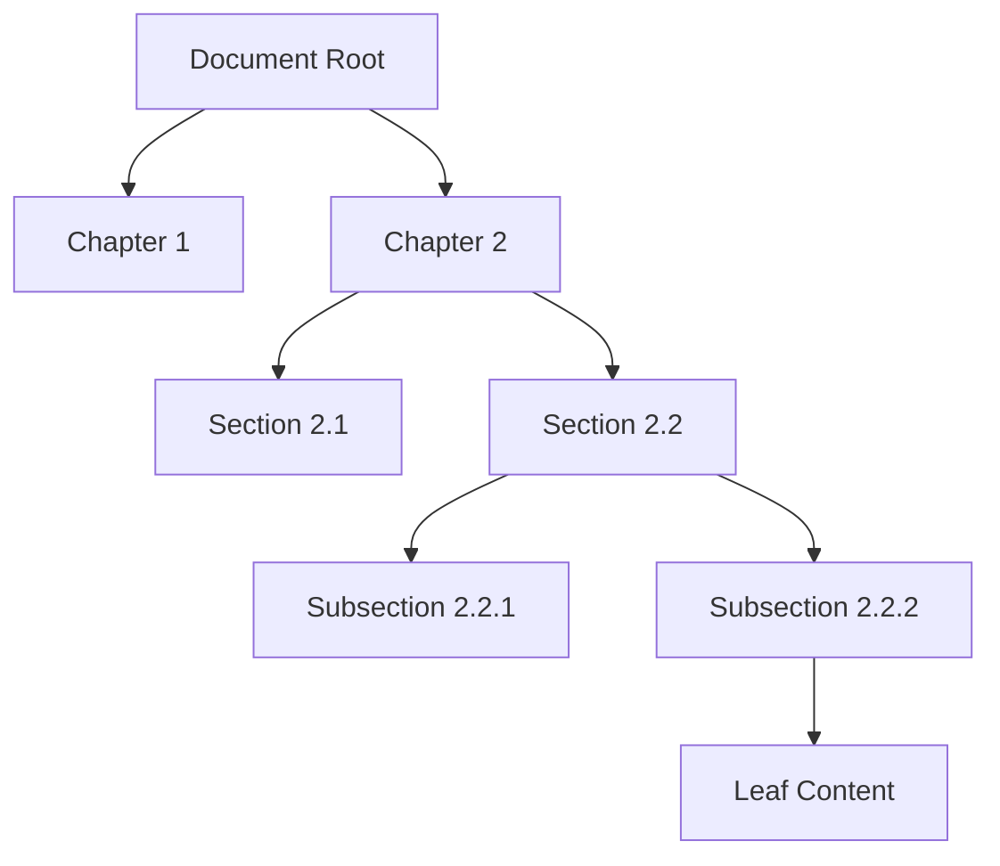
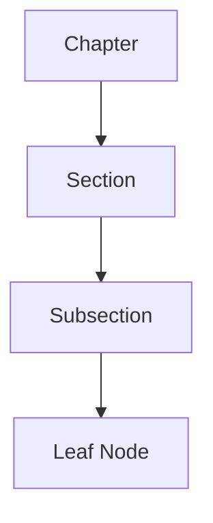
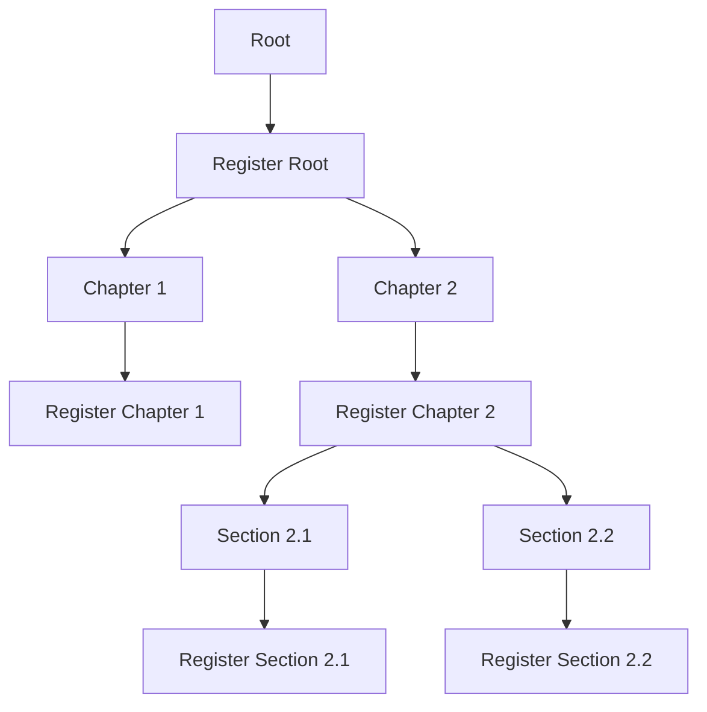
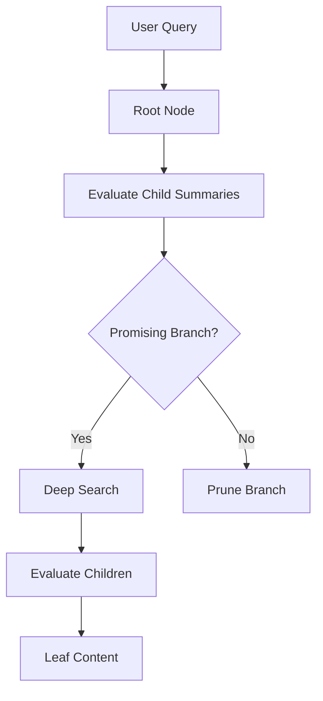
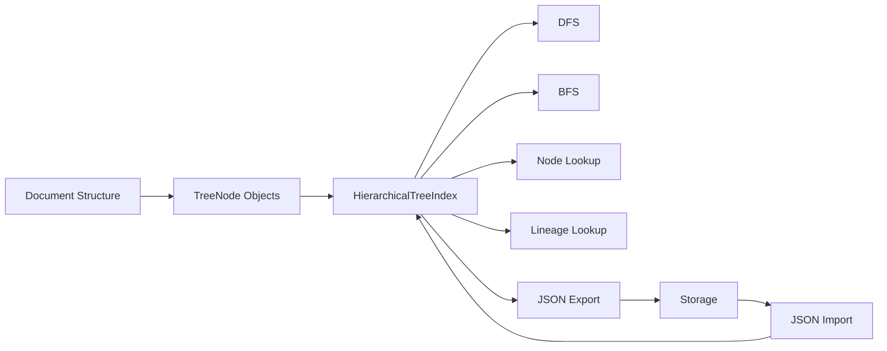
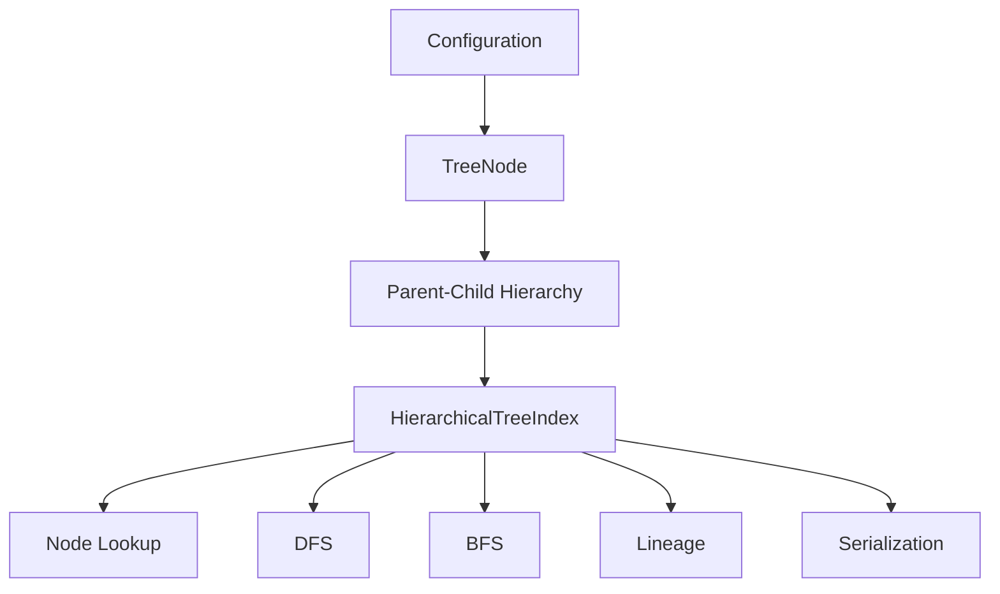

This chapter has a solid structure, but there are a few **important code mismatches** in the original version—especially `id` vs `nodeId`, `nodeLookupMap` vs `nodesById`, missing required constructor fields, and the fact that the chapter promises BFS/DFS but the implementation only provides recursive DFS-style traversal.

I’d use the following corrected version as the canonical Chapter 1.

# Chapter 1 — Hierarchical Tree Data Structure (TreeNode & Index)

## 1. Chapter Goal

The goal of this chapter is to build the core data structures for the **Vectorless RAG hierarchical document index**.

Traditional RAG commonly transforms a document into a flat collection of chunks:

```text
Document
 ├── Chunk 1
 ├── Chunk 2
 ├── Chunk 3
 └── Chunk 4
```

The chunks are then retrieved using techniques such as embedding similarity search.

Vectorless RAG takes a different approach.

Instead of treating the document as a flat collection, we represent its natural structure as a **hierarchical tree**:

```text
Document
├── Chapter
│   ├── Section
│   │   ├── Subsection
│   │   └── Subsection
│   └── Section
└── Chapter
```

This approach is inspired by **PageIndex-style hierarchical document indexing**, where the retrieval system can reason about the document structure and navigate from broad sections toward specific content.

Each `TreeNode` can contain:

* Unique node ID
* Title
* Hierarchy level
* Page range
* Summary
* Keywords
* Named entities
* Raw content
* Parent reference
* Child references

The `HierarchicalTreeIndex` then provides efficient operations over the complete tree.

### In this chapter, we will:

* Build the `TreeNode` model
* Build the `HierarchicalTreeIndex`
* Maintain parent-child relationships
* Provide O(1)-average node lookup using `Map`
* Implement lineage/path lookup
* Implement DFS traversal
* Implement BFS traversal
* Implement tree serialization
* Implement tree deserialization
* Verify the complete structure

---

# 2. Expected Outcome

By the end of this chapter, we will be able to represent a document like this:



For example:

```text
Document
├── Chapter 1
└── Chapter 2
    ├── Section 2.1
    └── Section 2.2
        ├── Subsection 2.2.1
        └── Subsection 2.2.2
```

This tree becomes the foundation for the retrieval engine implemented in later chapters.

---

# 3. Directory Structure

Create the following directory:

```bash
mkdir -p src/tree
```

The project structure becomes:

```text
vectorless-rag-01/
├── .env
├── .env.example
├── package.json
└── src/
    ├── config.js
    └── tree/
        ├── TreeNode.js
        └── HierarchicalTreeIndex.js
```

---

# 4. Why a Tree Instead of Flat Chunks?

Consider a large technical document.

A flat chunking strategy might produce:

```text
Chunk 001
Chunk 002
Chunk 003
Chunk 004
...
Chunk 500
```

The retrieval system knows the text, but it may lose important structural relationships.

For example, suppose the user asks:

> "What security considerations are discussed in the database chapter?"

A hierarchical index preserves the relationship:

```text
Document
   ↓
Database Chapter
   ↓
Security Section
   ↓
Security Subsection
   ↓
Relevant Content
```

This allows a retrieval agent to progressively narrow the search space.

The important distinction is:

> **Vectorless RAG retrieves through document structure and reasoning rather than requiring vector similarity as its primary retrieval mechanism.**

---

# 5. `TreeNode` Data Model

Create:

```text
src/tree/TreeNode.js
```

A `TreeNode` represents one structural unit of a document.

For example:

```text
Document
Chapter
Section
Subsection
Page
Content Block
```

Each node knows:

```text
Who am I?
Who is my parent?
Who are my children?
What pages do I represent?
What does this section contain?
```

---

# 6. Implementing `TreeNode`

Create:

```text
src/tree/TreeNode.js
```

Use:

```javascript id="v3m8qs"
export class TreeNode {
  /**
   * Represents a structural node within the document hierarchy.
   *
   * @param {Object} params
   * @param {string} params.nodeId - Unique node identifier.
   * @param {string} params.title - Human-readable title.
   * @param {number} params.level - Hierarchy depth.
   * @param {number[]} params.pageRange - [startPage, endPage].
   * @param {string} params.summary - High-density semantic summary.
   * @param {string[]} [params.keywords=[]] - Topic keywords.
   * @param {string[]} [params.entities=[]] - Named entities.
   * @param {string} [params.content=""] - Raw section content.
   * @param {string|null} [params.parentId=null] - Parent node ID.
   */
  constructor({
    nodeId,
    title,
    level,
    pageRange,
    summary,
    keywords = [],
    entities = [],
    content = "",
    parentId = null
  }) {
    if (
      typeof nodeId !== "string" ||
      !nodeId.trim()
    ) {
      throw new Error("nodeId must be a non-empty string.");
    }

    if (
      typeof title !== "string" ||
      !title.trim()
    ) {
      throw new Error("title must be a non-empty string.");
    }

    if (
      !Number.isInteger(level) ||
      level < 0
    ) {
      throw new Error(
        "level must be a non-negative integer."
      );
    }

    if (
      !Array.isArray(pageRange) ||
      pageRange.length !== 2 ||
      !pageRange.every(Number.isFinite)
    ) {
      throw new Error(
        "pageRange must contain [startPage, endPage]."
      );
    }

    if (pageRange[0] > pageRange[1]) {
      throw new Error(
        "pageRange start cannot be greater than end."
      );
    }

    this.nodeId = nodeId;
    this.title = title;
    this.level = level;
    this.pageRange = [...pageRange];
    this.summary =
      typeof summary === "string"
        ? summary
        : "";

    this.keywords = Array.isArray(keywords)
      ? [...keywords]
      : [];

    this.entities = Array.isArray(entities)
      ? [...entities]
      : [];

    this.content =
      typeof content === "string"
        ? content
        : "";

    this.parentId = parentId;

    /**
     * @type {TreeNode[]}
     */
    this.children = [];
  }

  /**
   * Attach a child node to the current node.
   *
   * @param {TreeNode} childNode
   */
  addChild(childNode) {
    if (!(childNode instanceof TreeNode)) {
      throw new TypeError(
        "childNode must be an instance of TreeNode."
      );
    }

    if (childNode === this) {
      throw new Error(
        "A node cannot be its own child."
      );
    }

    childNode.parentId = this.nodeId;

    this.children.push(childNode);

    return childNode;
  }

  /**
   * Check whether this node is a leaf.
   *
   * @returns {boolean}
   */
  isLeaf() {
    return this.children.length === 0;
  }

  /**
   * Return lightweight metadata for indexing.
   *
   * Raw content is excluded by default.
   *
   * @param {boolean} [includeContent=false]
   * @returns {Object}
   */
  toMetadataJSON(includeContent = false) {
    const json = {
      nodeId: this.nodeId,
      title: this.title,
      level: this.level,
      pageRange: [...this.pageRange],
      summary: this.summary,
      keywords: [...this.keywords],
      entities: [...this.entities],
      parentId: this.parentId,
      childrenIds: this.children.map(
        (child) => child.nodeId
      )
    };

    if (includeContent) {
      json.content = this.content;
    }

    return json;
  }
}
```

---

# 7. Understanding `TreeNode`

The class can be understood as four logical parts.

## 7.1 Identity and Structure

```javascript id="q1u6ws"
this.nodeId = nodeId;
this.title = title;
this.level = level;
this.parentId = parentId;
```

These fields describe where the node exists in the hierarchy.

For example:

```text
nodeId: "sec_2_2"
title: "Database Security"
level: 2
parentId: "ch_2"
```

This means:

```text
Chapter 2
   ↓
Database Security
```

---

# 8. Page Range

Each node stores:

```javascript id="z8j6tw"
this.pageRange = [...pageRange];
```

For example:

```text
[14, 16]
```

means the section covers pages 14–16.

This becomes useful when the system needs to locate the original source content.

For example:

```text
Section: Database Security
Pages: 14–16
```

The retrieval engine can use this information to understand exactly where the evidence originated.

---

# 9. Summary, Keywords and Entities

Each node can store semantic metadata:

```javascript id="y0z7q5"
this.summary
this.keywords
this.entities
```

Example:

```javascript id="7gq3ls"
{
  summary: "Explains authentication and authorization strategies.",
  keywords: [
    "authentication",
    "authorization",
    "RBAC"
  ],
  entities: [
    "OAuth",
    "JWT"
  ]
}
```

These fields are especially important for Vectorless RAG because later retrieval logic can reason over the node metadata before opening the full content.

---

# 10. Parent-Child Relationships

The most important structural property is:

```javascript id="f1qv4e"
this.parentId
```

combined with:

```javascript id="8d7u2s"
this.children
```

For example:

```text
Chapter 2
├── Section 2.1
└── Section 2.2
```

The relationship is represented as:

```text
Chapter 2
children → [Section 2.1, Section 2.2]

Section 2.1
parentId → Chapter 2

Section 2.2
parentId → Chapter 2
```

This creates a bidirectional logical relationship.

---

# 11. `addChild()`

The method:

```javascript id="j3f0aw"
addChild(childNode)
```

does two things.

First:

```javascript id="v6g0pr"
childNode.parentId = this.nodeId;
```

The child's parent is assigned automatically.

Then:

```javascript id="f7ml9w"
this.children.push(childNode);
```

The child is added to the parent's child list.

This prevents callers from having to manually maintain both sides of the relationship.

It also returns the child:

```javascript id="h9pr1z"
return childNode;
```

which allows:

```javascript id="1q7b9c"
const chapter1 = root.addChild(
  new TreeNode(...)
);
```

---

# 12. Leaf Nodes

A leaf is a node without children:

```javascript id="l3n6xw"
isLeaf() {
  return this.children.length === 0;
}
```

For example:



`D` is a leaf because it has no children.

In a document tree, leaf nodes may contain the most specific raw content.

For example:

```text
Chapter
  ↓
Section
  ↓
Subsection
  ↓
Leaf Content
```

---

# 13. Metadata Serialization

The method:

```javascript id="8f2d4n"
toMetadataJSON()
```

converts a node into a plain JavaScript object.

By default, raw content is excluded.

This is useful because structural retrieval often needs metadata without loading large amounts of text.

Example:

```javascript id="j2q9xk"
node.toMetadataJSON();
```

can produce:

```json
{
  "nodeId": "sec_2_2",
  "title": "Database Security",
  "level": 2,
  "pageRange": [14, 16],
  "summary": "Authentication and authorization strategies.",
  "keywords": [
    "authentication",
    "authorization"
  ],
  "entities": [
    "OAuth",
    "JWT"
  ],
  "parentId": "ch_2",
  "childrenIds": []
}
```

If raw content is required:

```javascript id="s8t1mh"
node.toMetadataJSON(true);
```

then `content` is included.

---

# 14. Implementing `HierarchicalTreeIndex`

Now create:

```text
src/tree/HierarchicalTreeIndex.js
```

Use:

```javascript id="m0x6vz"
import { TreeNode } from "./TreeNode.js";

export class HierarchicalTreeIndex {
  /**
   * Manage the complete document hierarchy.
   *
   * @param {TreeNode} rootNode
   * @param {string} [documentTitle="Document Index"]
   */
  constructor(
    rootNode,
    documentTitle = "Document Index"
  ) {
    if (!(rootNode instanceof TreeNode)) {
      throw new TypeError(
        "rootNode must be an instance of TreeNode."
      );
    }

    this.root = rootNode;
    this.documentTitle = documentTitle;

    /**
     * Fast node lookup table.
     *
     * @type {Map<string, TreeNode>}
     */
    this.nodesById = new Map();

    this._indexSubtree(rootNode);
  }

  /**
   * Register every node in the tree.
   *
   * @param {TreeNode} node
   * @private
   */
  _indexSubtree(node) {
    if (this.nodesById.has(node.nodeId)) {
      throw new Error(
        `Duplicate nodeId detected: ${node.nodeId}`
      );
    }

    this.nodesById.set(
      node.nodeId,
      node
    );

    for (const child of node.children) {
      this._indexSubtree(child);
    }
  }

  /**
   * Retrieve a node by ID.
   *
   * @param {string} nodeId
   * @returns {TreeNode|undefined}
   */
  getNode(nodeId) {
    return this.nodesById.get(nodeId);
  }

  /**
   * Return the path from root to the requested node.
   *
   * @param {string} nodeId
   * @returns {TreeNode[]}
   */
  getLineagePath(nodeId) {
    const path = [];

    let current = this.getNode(nodeId);

    while (current) {
      path.unshift(current);

      current = current.parentId
        ? this.getNode(current.parentId)
        : null;
    }

    return path;
  }

  /**
   * Depth-first traversal.
   *
   * @param {Function} visitor
   * @param {TreeNode} [startNode=this.root]
   */
  traverseDFS(
    visitor,
    startNode = this.root
  ) {
    if (typeof visitor !== "function") {
      throw new TypeError(
        "visitor must be a function."
      );
    }

    visitor(startNode);

    for (const child of startNode.children) {
      this.traverseDFS(
        visitor,
        child
      );
    }
  }

  /**
   * Breadth-first traversal.
   *
   * @param {Function} visitor
   * @param {TreeNode} [startNode=this.root]
   */
  traverseBFS(
    visitor,
    startNode = this.root
  ) {
    if (typeof visitor !== "function") {
      throw new TypeError(
        "visitor must be a function."
      );
    }

    const queue = [startNode];

    while (queue.length > 0) {
      const current = queue.shift();

      visitor(current);

      for (const child of current.children) {
        queue.push(child);
      }
    }
  }

  /**
   * Print the tree hierarchy.
   *
   * @param {TreeNode} [node=this.root]
   * @param {string} [prefix=""]
   */
  printTree(
    node = this.root,
    prefix = ""
  ) {
    console.log(
      `${prefix}[${node.nodeId}] ${node.title} ` +
      `(Pages: ${node.pageRange.join("-")})`
    );

    node.children.forEach(
      (child, index) => {
        const isLast =
          index === node.children.length - 1;

        const childPrefix =
          prefix +
          (isLast ? "    " : "│   ");

        console.log(
          `${prefix}${isLast ? "└── " : "├── "}` +
          `[${child.nodeId}] ${child.title} ` +
          `(Pages: ${child.pageRange.join("-")})`
        );

        this.printTree(
          child,
          childPrefix
        );
      }
    );
  }

  /**
   * Serialize the complete tree.
   *
   * @returns {Object}
   */
  exportToJSON() {
    const serializeNode = (node) => {
      const json =
        node.toMetadataJSON(true);

      json.children =
        node.children.map(
          serializeNode
        );

      return json;
    };

    return {
      documentTitle:
        this.documentTitle,

      tree: serializeNode(this.root)
    };
  }

  /**
   * Reconstruct a tree index from serialized JSON.
   *
   * @param {Object} json
   * @returns {HierarchicalTreeIndex}
   */
  static importFromJSON(json) {
    if (
      !json ||
      typeof json !== "object" ||
      !json.tree
    ) {
      throw new Error(
        "Invalid serialized tree."
      );
    }

    const deserializeNode = (
      data,
      parentId = null
    ) => {
      const node =
        new TreeNode({
          nodeId: data.nodeId,
          title: data.title,
          level: data.level,
          pageRange: data.pageRange,
          summary: data.summary,
          keywords: data.keywords,
          entities: data.entities,
          content: data.content,
          parentId
        });

      if (
        Array.isArray(data.children)
      ) {
        for (
          const childData
          of data.children
        ) {
          node.addChild(
            deserializeNode(
              childData,
              node.nodeId
            )
          );
        }
      }

      return node;
    };

    const rootNode =
      deserializeNode(
        json.tree,
        null
      );

    return new HierarchicalTreeIndex(
      rootNode,
      json.documentTitle ||
        "Document Index"
    );
  }
}
```

---

# 15. Why Do We Need `HierarchicalTreeIndex`?

The tree itself provides the hierarchy.

But the index provides efficient operations over that hierarchy.

The most important optimization is:

```javascript id="x9c4fj"
this.nodesById = new Map();
```

Without an index, finding:

```text
sec_2_2
```

could require traversing the tree every time.

With the `Map`:

```javascript id="3o0x3n"
this.nodesById.get("sec_2_2");
```

provides average **O(1)** lookup.

This becomes important when the document contains thousands of nodes.

---

# 16. Building the Lookup Map

During initialization:

```javascript id="q2o4m8"
this._indexSubtree(rootNode);
```

recursively visits every node.

Conceptually:



Every node is stored using:

```text
nodeId → TreeNode
```

For example:

```text
root   → Root Node
ch_1   → Chapter 1
ch_2   → Chapter 2
sec_2_1 → Section 2.1
sec_2_2 → Section 2.2
```

---

# 17. Duplicate Node IDs

Node IDs must be unique.

Therefore `_indexSubtree()` checks:

```javascript id="v6b9ek"
if (this.nodesById.has(node.nodeId)) {
  throw new Error(
    `Duplicate nodeId detected: ${node.nodeId}`
  );
}
```

Without this check, two nodes could silently overwrite each other in the `Map`.

For a retrieval index, that would create extremely difficult debugging problems.

---

# 18. Lineage Path

The method:

```javascript id="j0m4tc"
getLineagePath(nodeId)
```

returns the complete path from the root to a node.

Suppose:

```text
Document
└── Chapter 2
    └── Section 2.2
        └── Subsection 2.2.1
```

Calling:

```javascript id="q3l6p9"
index.getLineagePath(
  "subsec_2_2_1"
);
```

returns:

```text
Document
→ Chapter 2
→ Section 2.2
→ Subsection 2.2.1
```

This is extremely useful for retrieval.

Instead of returning only:

```text
"Authentication"
```

the system can understand its context:

```text
Document
→ Security
→ Authentication
→ OAuth
```

That contextual path can later be included in the LLM prompt.

---

# 19. Depth-First Search

DFS explores a branch as deeply as possible before moving to the next branch.

For:

```text
Root
├── A
│   ├── A1
│   └── A2
└── B
    ├── B1
    └── B2
```

DFS visits:

```text
Root
A
A1
A2
B
B1
B2
```

The implementation:

```javascript id="9e4s7x"
traverseDFS(visitor)
```

recursively walks each branch.

This is useful when:

* searching deeply nested structures
* processing a complete branch
* recursively evaluating child relevance
* performing tree transformations

---

# 20. Breadth-First Search

BFS explores the tree level by level.

For:

```text
Root
├── A
│   ├── A1
│   └── A2
└── B
    ├── B1
    └── B2
```

BFS visits:

```text
Root
A
B
A1
A2
B1
B2
```

The implementation uses a queue:

```javascript id="6f9d1s"
const queue = [startNode];
```

Then:

```javascript id="e0p6kc"
const current = queue.shift();
```

removes the next node.

Its children are appended:

```javascript id="u8v1aj"
queue.push(child);
```

This allows the algorithm to process the hierarchy one level at a time.

---

# 21. DFS vs BFS in Vectorless RAG

Both algorithms are useful, but they serve different purposes.

| Strategy   | Behavior                   | Potential RAG Use         |
| ---------- | -------------------------- | ------------------------- |
| DFS        | Deep branch exploration    | Follow a promising branch |
| BFS        | Level-by-level exploration | Broad structural search   |
| Lineage    | Root → target path         | Context reconstruction    |
| Map lookup | Direct node access         | Fast node retrieval       |

Later, the agentic retrieval engine can combine these ideas.

For example:



This is one of the core ideas behind hierarchical Vectorless RAG.

---

# 22. Tree Visualization

The `printTree()` method provides a human-readable representation.

For example:

```text
[root] Document (Pages: 1-30)
├── [ch_1] Introduction (Pages: 1-5)
└── [ch_2] Architecture (Pages: 6-30)
    ├── [sec_2_1] System Design (Pages: 6-15)
    └── [sec_2_2] Retrieval (Pages: 16-30)
        └── [sub_2_2_1] Tree Search (Pages: 20-24)
```

This is particularly useful while developing the tree builder.

---

# 23. Serialization

The index provides:

```javascript id="l1g4m8"
exportToJSON()
```

which converts the complete tree into a JSON-compatible object.

The resulting structure can be:

```json
{
  "documentTitle": "RAG Architecture",
  "tree": {
    "nodeId": "root",
    "title": "RAG Architecture",
    "level": 0,
    "pageRange": [1, 30],
    "summary": "Architecture documentation",
    "keywords": ["RAG", "AI"],
    "entities": ["OpenAI"],
    "parentId": null,
    "childrenIds": ["ch_1"],
    "content": "",
    "children": []
  }
}
```

This makes the tree portable.

It can later be:

* saved to disk
* stored in PostgreSQL
* cached
* transferred between processes
* loaded during application startup

---

# 24. Deserialization

The opposite operation is:

```javascript id="z5c0p7"
HierarchicalTreeIndex.importFromJSON(json)
```

This reconstructs:

```text
JSON
 ↓
TreeNode objects
 ↓
Parent-child relationships
 ↓
HierarchicalTreeIndex
```

During reconstruction, `addChild()` is used so the parent references are rebuilt consistently.

---

# 25. Complete Tree Lifecycle

The lifecycle now looks like:



This gives the project a reusable hierarchical indexing layer.

---

# 26. Verification & Testing

Create a temporary test directly from the terminal.

Use:

```bash id="v2y8ns"
node --input-type=module -e "
import { TreeNode } from './src/tree/TreeNode.js';
import { HierarchicalTreeIndex } from './src/tree/HierarchicalTreeIndex.js';

const root = new TreeNode({
  nodeId: 'root',
  title: 'Vectorless RAG',
  level: 0,
  pageRange: [1, 30],
  summary: 'Root document'
});

const ch1 = root.addChild(
  new TreeNode({
    nodeId: 'ch1',
    title: 'Introduction',
    level: 1,
    pageRange: [1, 5],
    summary: 'Introduction to Vectorless RAG'
  })
);

const ch2 = root.addChild(
  new TreeNode({
    nodeId: 'ch2',
    title: 'Architecture',
    level: 1,
    pageRange: [6, 30],
    summary: 'System architecture'
  })
);

const sec21 = ch2.addChild(
  new TreeNode({
    nodeId: 'sec2_1',
    title: 'Tree Search',
    level: 2,
    pageRange: [10, 18],
    summary: 'Hierarchical tree retrieval'
  })
);

const index =
  new HierarchicalTreeIndex(
    root,
    'Vectorless RAG'
  );

console.log('Indexed Nodes:', index.nodesById.size);

console.log('\\nDFS:');
index.traverseDFS(
  (node) => console.log(node.nodeId)
);

console.log('\\nBFS:');
index.traverseBFS(
  (node) => console.log(node.nodeId)
);

console.log('\\nLineage:');
console.log(
  index
    .getLineagePath('sec2_1')
    .map((node) => node.title)
    .join(' -> ')
);

console.log('\\nTree:');
index.printTree();
"
```

---

# 27. Expected Output

You should see approximately:

```text
Indexed Nodes: 4

DFS:
root
ch1
ch2
sec2_1

BFS:
root
ch1
ch2
sec2_1

Lineage:
Vectorless RAG -> Architecture -> Tree Search

Tree:
[root] Vectorless RAG (Pages: 1-30)
├── [ch1] Introduction (Pages: 1-5)
└── [ch2] Architecture (Pages: 6-30)
    └── [sec2_1] Tree Search (Pages: 10-18)
```

The exact formatting may vary slightly depending on terminal output.

---

# 28. Testing `getNode()`

Run:

```javascript id="2b9z3x"
const node = index.getNode("sec2_1");

console.log(node.title);
```

Expected:

```text
Tree Search
```

This demonstrates direct indexed lookup.

---

# 29. Testing Leaf Detection

Run:

```javascript id="f5k2ad"
console.log(
  index.getNode("sec2_1").isLeaf()
);
```

Expected:

```text
true
```

Because `sec2_1` currently has no children.

For `ch2`:

```javascript id="r7m1wc"
console.log(
  index.getNode("ch2").isLeaf()
);
```

Expected:

```text
false
```

because `ch2` contains `sec2_1`.

---

# 30. Testing Serialization

You can test:

```javascript id="n8j4qx"
const exported =
  index.exportToJSON();

console.log(
  JSON.stringify(
    exported,
    null,
    2
  )
);
```

The resulting JSON should contain the complete hierarchy.

Then reconstruct it:

```javascript id="e5t8vn"
const restored =
  HierarchicalTreeIndex
    .importFromJSON(exported);

console.log(
  restored.nodesById.size
);
```

Expected:

```text
4
```

---

# 31. Important Design Decisions

### 31.1 `nodeId` Must Be Unique

Every node needs a unique identifier.

Good:

```text
root
ch_1
ch_2
sec_2_1
sec_2_2
```

Bad:

```text
section
section
section
```

because duplicate IDs make indexed lookup ambiguous.

---

### 31.2 Parent References Use IDs

The child stores:

```javascript
parentId
```

rather than directly storing:

```javascript
parent
```

This keeps serialization simple and avoids circular object references.

The actual parent can be resolved through:

```javascript
index.getNode(parentId)
```

---

### 31.3 Raw Content Is Optional

Not every node needs a large content payload.

Higher-level nodes can primarily contain:

```text
Title
Summary
Keywords
Entities
Page Range
```

while leaf nodes can contain the actual raw text.

This supports a **coarse-to-fine retrieval strategy**.

---

# 32. Current Architecture Status

After this chapter, the architecture is:



The system still does **not** perform retrieval yet.

We have only created the data structure required for retrieval.

That distinction is important.

### Current status

| Component                  | Status              |
| -------------------------- | ------------------- |
| Node.js ESM                | Implemented         |
| Configuration              | Implemented         |
| TreeNode                   | Implemented         |
| Parent-child hierarchy     | Implemented         |
| Node lookup                | Implemented         |
| DFS                        | Implemented         |
| BFS                        | Implemented         |
| Lineage lookup             | Implemented         |
| Tree serialization         | Implemented         |
| Tree deserialization       | Implemented         |
| Automated document parsing | Not yet implemented |
| Tree-based retrieval       | Not yet implemented |
| LLM navigation             | Not yet implemented |

---

# 33. Important Production Considerations

The current implementation keeps the complete tree in memory.

That is excellent for:

* learning
* prototypes
* small documents
* local experimentation

For very large document collections, however, additional design will be required.

Potential production improvements include:

* persistent tree storage
* lazy loading of content
* database-backed node metadata
* subtree caching
* iterative traversal for extremely deep trees
* node versioning
* document version management
* access-control metadata
* concurrent document processing
* incremental tree updates

The key principle should remain:

> **Keep the document's semantic structure available to the retrieval system instead of immediately flattening everything into anonymous chunks.**

---

# 34. Chapter 1 Checklist

Before moving to Chapter 2, verify:

* [ ] `src/tree/` exists
* [ ] `TreeNode.js` created
* [ ] `HierarchicalTreeIndex.js` created
* [ ] Every node has a unique `nodeId`
* [ ] Parent-child relationships work
* [ ] `isLeaf()` works
* [ ] `nodesById` indexes all nodes
* [ ] `getNode()` works
* [ ] `getLineagePath()` works
* [ ] DFS traversal works
* [ ] BFS traversal works
* [ ] `printTree()` works
* [ ] `exportToJSON()` works
* [ ] `importFromJSON()` works
* [ ] ESM verification succeeds

---

# 35. What Comes Next

In **Chapter 2**, we will move from manually constructing the tree to **automatically building a hierarchical document tree**.

The next layer will transform something like:

```text
Raw Document
     ↓
Document Structure
     ↓
Chapters
     ↓
Sections
     ↓
Subsections
     ↓
TreeNode objects
     ↓
HierarchicalTreeIndex
```

This will be the beginning of the actual **document indexing pipeline**.

The ultimate goal is to enable a retrieval agent to ask:

> **Which branch of this document is most relevant to the user's question?**

instead of simply asking:

> **Which text chunk has the highest similarity score?**

**One important correction to keep from your original version:** the verification used `new TreeNode({ id: "root", ... })` and `index.nodeLookupMap.size`, but your class defines `nodeId` and `nodesById`. The revised verification now matches the actual implementation. Also, the original chapter promised both DFS and BFS, so I added both explicitly.
