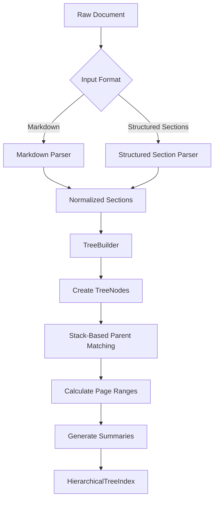
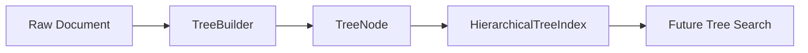
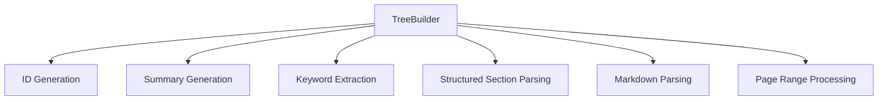
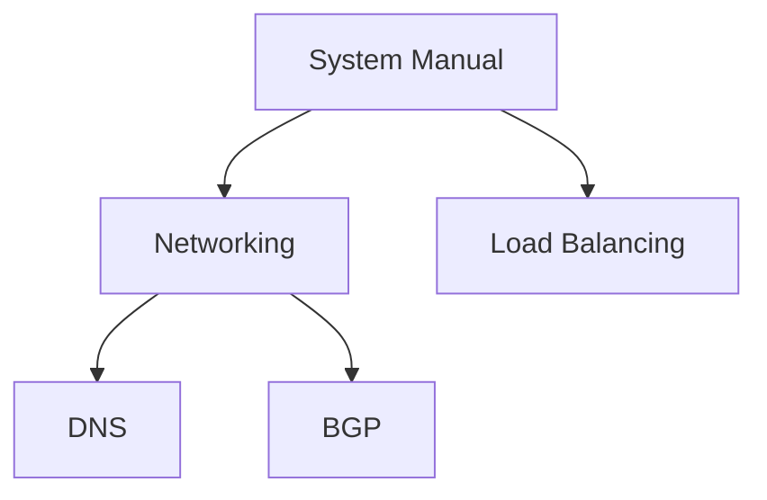
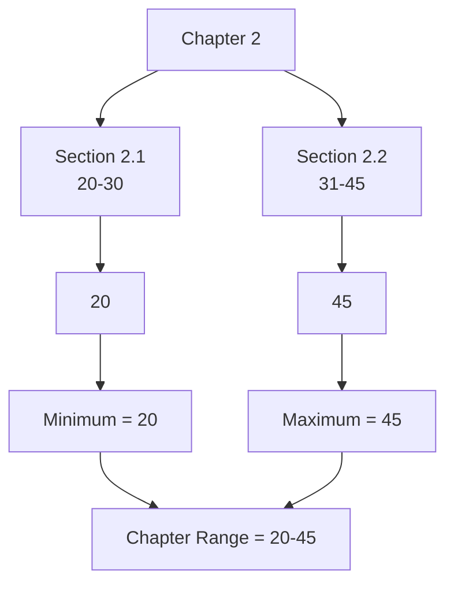
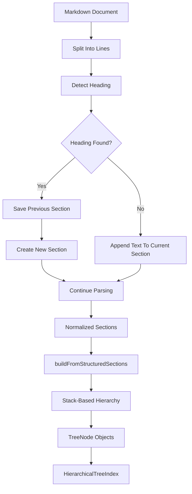
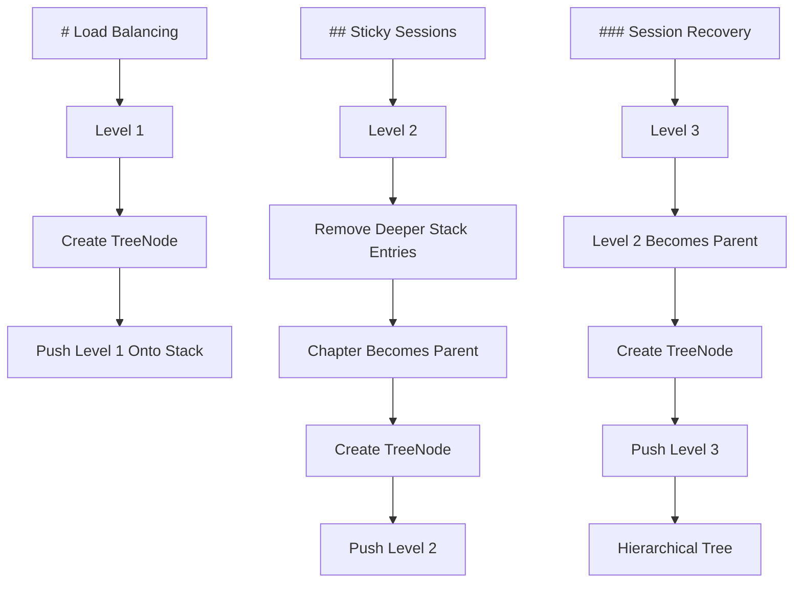
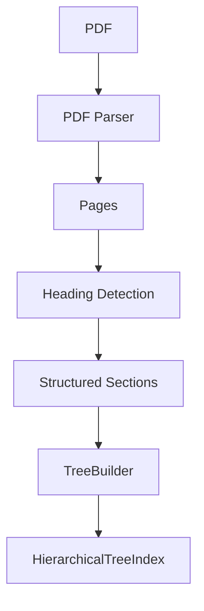
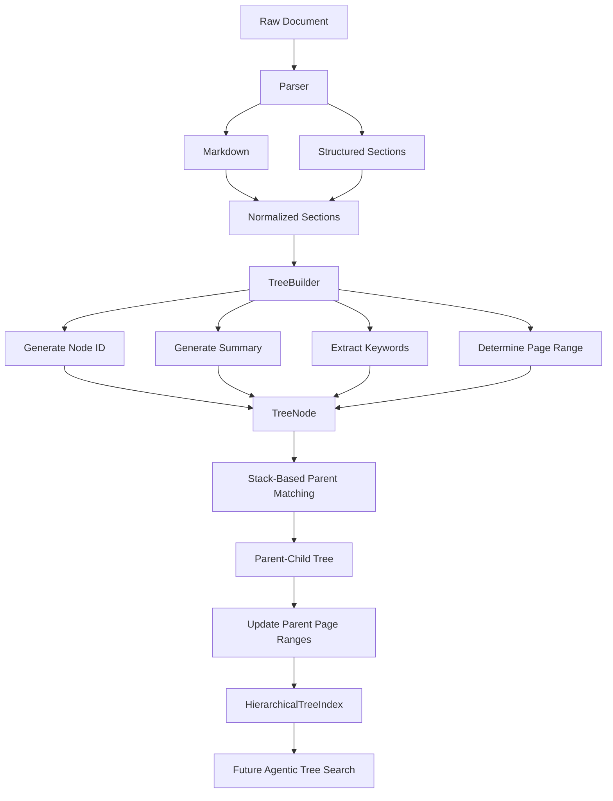

# Chapter 2 — Automatic Document Tree Builder & Parser

## 1. Chapter Goal

In Chapter 1, we manually created `TreeNode` objects and connected them together to form a hierarchical document tree.

That works for learning, but it does not scale.

Imagine a 500-page technical manual containing:

* 20 chapters
* 100+ sections
* hundreds of subsections
* thousands of pages of content

Creating every node manually would be impractical.

The purpose of this chapter is to build a **`TreeBuilder`** that can automatically transform structured document data into a `HierarchicalTreeIndex`.

The main pipeline becomes:

```text
Raw Structured Document
        ↓
    TreeBuilder
        ↓
  TreeNode objects
        ↓
Parent-child relationships
        ↓
HierarchicalTreeIndex
```

For Markdown documents, heading levels provide the hierarchy:

```text
# Chapter
## Section
### Subsection
#### Subsection
```

The builder uses these heading levels to determine where each node belongs.

---

## 2. What We Will Build

In this chapter we will implement:

* `src/tree/TreeBuilder.js`
* Markdown heading parsing
* Structured-section parsing
* Stack-based parent matching
* Automatic node IDs
* Automatic hierarchy levels
* Page-range calculation
* Basic summary generation
* Automatic `HierarchicalTreeIndex` creation
* Tree-building verification

We will **not** implement relevance pruning in this chapter.

That belongs to Chapter 3 because pruning is a retrieval concern, while this chapter is responsible for **document indexing**.

---

# 3. Overall Architecture

The document-building pipeline will look like this:



The important design principle is:

> **TreeBuilder is responsible for converting document structure into the tree. Retrieval logic comes later.**

---

# 4. Relationship With Chapter 1

Chapter 1 introduced:

```text
TreeNode
HierarchicalTreeIndex
```

Chapter 2 now uses those classes.

The dependency chain is:



So `TreeBuilder` does not replace `TreeNode`.

Instead:

```text
TreeBuilder
     ↓
creates
     ↓
TreeNode objects
     ↓
organizes them
     ↓
HierarchicalTreeIndex
```

---

# 5. Input Representation

There are two useful inputs for this chapter.

## 5.1 Markdown

Example:

```markdown
# Networking

Network architecture and protocols.

## DNS

DNS resolution and routing.

## BGP

Border Gateway Protocol.

# Load Balancing

Traffic distribution strategies.

## Sticky Sessions

Cookie-based session persistence.
```

The heading levels determine the hierarchy.

---

## 5.2 Structured Sections

Sometimes a document parser has already extracted the headings.

We can represent the document as:

```javascript
[
  {
    title: "Networking",
    level: 1,
    content: "Network architecture and protocols.",
    pageStart: 1,
    pageEnd: 20
  },
  {
    title: "DNS",
    level: 2,
    content: "DNS resolution and routing.",
    pageStart: 5,
    pageEnd: 10
  }
]
```

This is useful when the input comes from:

* PDF parsing
* HTML parsing
* OCR
* DOCX parsing
* another document extraction service

Therefore, we will support both Markdown and structured section input.

---

# 6. Create `TreeBuilder.js`

Create:

```text
src/tree/TreeBuilder.js
```

The implementation will be:

```javascript id="q5y1ps"
import { TreeNode } from "./TreeNode.js";
import { HierarchicalTreeIndex } from "./HierarchicalTreeIndex.js";

export class TreeBuilder {
  /**
   * Create a safe identifier from a title.
   *
   * Example:
   * "Load Balancing & Traffic"
   * becomes:
   * "load-balancing-traffic"
   *
   * @param {string} title
   * @returns {string}
   */
  static slugify(title) {
    return String(title)
      .toLowerCase()
      .trim()
      .replace(/[^a-z0-9\s-]/g, "")
      .replace(/\s+/g, "-")
      .replace(/-+/g, "-");
  }

  /**
   * Generate a unique node ID.
   *
   * @param {string} title
   * @param {number} level
   * @param {number} index
   * @returns {string}
   */
  static createNodeId(
    title,
    level,
    index
  ) {
    const slug =
      this.slugify(title) ||
      `node-${index}`;

    return `l${level}-${slug}-${index}`;
  }

  /**
   * Generate a lightweight summary from content.
   *
   * This is a deterministic development fallback.
   * A production implementation can replace this with
   * an LLM-generated summary.
   *
   * @param {string} title
   * @param {string} content
   * @returns {string}
   */
  static generateSummary(
    title,
    content
  ) {
    const cleanContent =
      String(content || "")
        .replace(/\s+/g, " ")
        .trim();

    if (!cleanContent) {
      return `${title} section.`;
    }

    const maxLength = 300;

    const summary =
      cleanContent.length > maxLength
        ? `${cleanContent.slice(0, maxLength)}...`
        : cleanContent;

    return summary;
  }

  /**
   * Extract simple keywords from text.
   *
   * This is intentionally lightweight.
   *
   * @param {string} text
   * @returns {string[]}
   */
  static extractKeywords(text) {
    const stopWords = new Set([
      "the",
      "and",
      "for",
      "with",
      "from",
      "this",
      "that",
      "into",
      "are",
      "was",
      "were",
      "has",
      "have",
      "will",
      "can",
      "using",
      "used"
    ]);

    const words = String(text || "")
      .toLowerCase()
      .replace(/[^a-z0-9\s]/g, " ")
      .split(/\s+/)
      .filter(
        (word) =>
          word.length > 3 &&
          !stopWords.has(word)
      );

    return [...new Set(words)].slice(0, 10);
  }

  /**
   * Build a tree from structured sections.
   *
   * Each section must contain:
   *
   * {
   *   title,
   *   level,
   *   content,
   *   pageStart,
   *   pageEnd
   * }
   *
   * @param {string} documentTitle
   * @param {Array<Object>} sections
   * @returns {HierarchicalTreeIndex}
   */
  static buildFromStructuredSections(
    documentTitle,
    sections
  ) {
    if (
      typeof documentTitle !== "string" ||
      !documentTitle.trim()
    ) {
      throw new Error(
        "documentTitle must be a non-empty string."
      );
    }

    if (!Array.isArray(sections)) {
      throw new TypeError(
        "sections must be an array."
      );
    }

    const root = new TreeNode({
      nodeId: "root",
      title: documentTitle.trim(),
      level: 0,
      pageRange: [1, 1],
      summary: `Root document: ${documentTitle.trim()}`,
      keywords: [],
      entities: []
    });

    const stack = [
      {
        level: 0,
        node: root
      }
    ];

    let maxPage = 1;

    sections.forEach(
      (section, index) => {
        if (
          !section ||
          typeof section.title !== "string" ||
          !section.title.trim()
        ) {
          throw new Error(
            `Invalid section at index ${index}.`
          );
        }

        const level =
          Number.isInteger(section.level) &&
          section.level > 0
            ? section.level
            : 1;

        const title =
          section.title.trim();

        const content =
          typeof section.content === "string"
            ? section.content.trim()
            : "";

        const pageStart =
          Number.isFinite(section.pageStart)
            ? section.pageStart
            : maxPage;

        const pageEnd =
          Number.isFinite(section.pageEnd)
            ? section.pageEnd
            : pageStart;

        if (pageStart > pageEnd) {
          throw new Error(
            `Invalid page range for "${title}".`
          );
        }

        /*
         * Remove nodes from deeper or equal levels.
         *
         * Example:
         *
         * Current stack:
         * level 0 -> root
         * level 1 -> Chapter 1
         * level 2 -> Section 1.1
         *
         * New level 2 node:
         * Section 1.2
         *
         * We remove Section 1.1 and keep Chapter 1
         * as the parent.
         */
        while (
          stack.length > 0 &&
          stack[stack.length - 1].level >= level
        ) {
          stack.pop();
        }

        const parentEntry =
          stack[stack.length - 1];

        if (!parentEntry) {
          throw new Error(
            `Unable to find parent for "${title}".`
          );
        }

        const node =
          new TreeNode({
            nodeId:
              this.createNodeId(
                title,
                level,
                index + 1
              ),
            title,
            level,
            pageRange: [
              pageStart,
              pageEnd
            ],
            summary:
              section.summary ||
              this.generateSummary(
                title,
                content
              ),
            keywords:
              Array.isArray(
                section.keywords
              )
                ? section.keywords
                : this.extractKeywords(
                    `${title} ${content}`
                  ),
            entities:
              Array.isArray(
                section.entities
              )
                ? section.entities
                : [],
            content
          });

        parentEntry.node.addChild(
          node
        );

        stack.push({
          level,
          node
        });

        maxPage =
          Math.max(
            maxPage,
            pageEnd
          );
      }
    );

    this.updatePageRanges(root);

    return new HierarchicalTreeIndex(
      root,
      documentTitle.trim()
    );
  }

  /**
   * Update parent page ranges based on descendants.
   *
   * @param {TreeNode} node
   * @returns {[number, number]}
   */
  static updatePageRanges(node) {
    if (node.isLeaf()) {
      return [
        node.pageRange[0],
        node.pageRange[1]
      ];
    }

    const childRanges =
      node.children.map(
        (child) =>
          this.updatePageRanges(child)
      );

    const starts =
      childRanges.map(
        ([start]) => start
      );

    const ends =
      childRanges.map(
        ([, end]) => end
      );

    const start =
      Math.min(
        node.pageRange[0],
        ...starts
      );

    const end =
      Math.max(
        node.pageRange[1],
        ...ends
      );

    node.pageRange = [
      start,
      end
    ];

    return node.pageRange;
  }

  /**
   * Build a tree directly from Markdown.
   *
   * Supported headings:
   *
   * # Chapter
   * ## Section
   * ### Subsection
   * #### Nested Section
   *
   * @param {string} documentTitle
   * @param {string} markdown
   * @returns {HierarchicalTreeIndex}
   */
  static buildFromMarkdown(
    documentTitle,
    markdown
  ) {
    if (
      typeof markdown !== "string" ||
      !markdown.trim()
    ) {
      throw new Error(
        "markdown must be a non-empty string."
      );
    }

    const lines =
      markdown.split(/\r?\n/);

    const sections = [];

    let currentSection = null;

    for (const line of lines) {
      const headingMatch =
        line.match(
          /^(#{1,6})\s+(.+?)\s*$/
        );

      if (headingMatch) {
        if (currentSection) {
          sections.push(
            currentSection
          );
        }

        const level =
          headingMatch[1].length;

        const title =
          headingMatch[2].trim();

        currentSection = {
          title,
          level,
          content: "",
          pageStart: sections.length + 1,
          pageEnd: sections.length + 1
        };

        continue;
      }

      if (currentSection) {
        currentSection.content +=
          `${line}\n`;
      }
    }

    if (currentSection) {
      sections.push(
        currentSection
      );
    }

    return this.buildFromStructuredSections(
      documentTitle,
      sections
    );
  }
}
```

---

# 7. Understanding `TreeBuilder`

The class contains several responsibilities.

Conceptually:



Each responsibility exists for a reason.

---

# 8. `slugify()` — Creating Safe IDs

The first helper is:

```javascript
static slugify(title) {
  return String(title)
    .toLowerCase()
    .trim()
    .replace(/[^a-z0-9\s-]/g, "")
    .replace(/\s+/g, "-")
    .replace(/-+/g, "-");
}
```

Suppose the title is:

```text
Load Balancing & Traffic Distribution
```

The method converts it approximately to:

```text
load-balancing-traffic-distribution
```

This gives us a readable identifier component.

---

# 9. Why Not Use the Title Directly?

Titles can contain:

```text
spaces
special characters
symbols
punctuation
```

For example:

```text
Chapter 2: Load Balancing & Traffic
```

would not be a convenient identifier.

Instead, we create:

```text
l1-chapter-2-load-balancing-traffic-2
```

using:

```javascript
createNodeId()
```

The numeric suffix makes the ID unique even if two sections have the same title.

For example:

```text
l2-security-5
l2-security-12
```

---

# 10. `generateSummary()`

Each tree node should contain a summary.

Why?

Because later the retrieval agent should not need to read every page of a document.

Instead, it can first inspect:

```text
Node title
Node summary
Node keywords
Node entities
```

and decide whether the branch is relevant.

The current implementation:

```javascript
static generateSummary(title, content)
```

creates a deterministic summary by taking the first portion of the section content.

For example:

```text
Title:
Database Replication

Content:
PostgreSQL supports streaming replication...
```

might produce:

```text
PostgreSQL supports streaming replication...
```

### Important

This is **not an LLM-generated semantic summary**.

It is a development fallback.

Later, we can replace:

```javascript
this.generateSummary(
  title,
  content
)
```

with something like:

```text
LLM → summarize section → store summary
```

without changing the overall tree architecture.

---

# 11. `extractKeywords()`

The builder also creates basic keywords.

For example:

```text
"PostgreSQL replication uses WAL and streaming replicas"
```

can produce keywords such as:

```text
postgresql
replication
streaming
replicas
```

The implementation removes:

* short words
* common stop words
* duplicates

This gives each node lightweight searchable metadata.

Again, this is a **development implementation**, not a semantic keyword extraction model.

---

# 12. The Most Important Part — `buildFromStructuredSections()`

This method is the core of Chapter 2.

Its job is:

```text
Structured sections
        ↓
TreeNode objects
        ↓
Parent-child hierarchy
        ↓
HierarchicalTreeIndex
```

For example:

```javascript
const sections = [
  {
    title: "Networking",
    level: 1
  },
  {
    title: "DNS",
    level: 2
  },
  {
    title: "BGP",
    level: 2
  },
  {
    title: "Load Balancing",
    level: 1
  }
];
```

should become:



---

# 13. Creating the Root Node

The builder starts with:

```javascript
const root = new TreeNode({
  nodeId: "root",
  title: documentTitle,
  level: 0,
  pageRange: [1, 1],
  summary: `Root document: ${documentTitle}`
});
```

The root represents the entire document.

For example:

```text
root
title = System Manual
level = 0
```

Every other section will eventually become a descendant of this root.

---

# 14. The Stack

The most important data structure in the builder is:

```javascript
const stack = [
  {
    level: 0,
    node: root
  }
];
```

The stack remembers the **currently active hierarchy**.

Imagine the document contains:

```text
# Chapter 1
## Section 1.1
### Subsection 1.1.1
### Subsection 1.1.2
## Section 1.2
# Chapter 2
```

When processing the document, the stack represents the current path.

For example:

```text
Root
 ↓
Chapter 1
 ↓
Section 1.1
 ↓
Subsection 1.1.1
```

The stack allows us to determine where the next node belongs.

---

# 15. Why a Stack Works

Consider:

```text
# Chapter 1
## Section 1.1
### Subsection 1.1.1
## Section 1.2
```

When we reach:

```text
## Section 1.2
```

the previous subsection:

```text
### Subsection 1.1.1
```

cannot be its parent.

We need to move back up to:

```text
## Section 1.1
```

and then find the level-1 parent:

```text
# Chapter 1
```

The stack allows us to remove deeper levels until the correct parent remains.

---

# 16. Stack-Based Parent Matching

The key code is:

```javascript
while (
  stack.length > 0 &&
  stack[stack.length - 1].level >= level
) {
  stack.pop();
}
```

Suppose the current stack is:

```text
Level 0 → Root
Level 1 → Chapter 1
Level 2 → Section 1.1
Level 3 → Subsection 1.1.1
```

Now we encounter:

```text
Level 2 → Section 1.2
```

The stack contains a level-3 node.

Since:

```text
3 >= 2
```

we pop it.

Then the top of the stack is level 2.

Since:

```text
2 >= 2
```

we pop that as well.

Now the top is:

```text
Level 1 → Chapter 1
```

That becomes the parent.

So:

```text
Chapter 1
├── Section 1.1
│   └── Subsection 1.1.1
└── Section 1.2
```

The stack is what makes this automatic.

---

# 17. Creating the Node

Once the correct parent is found, we create:

```javascript
const node = new TreeNode({
  nodeId: this.createNodeId(
    title,
    level,
    index + 1
  ),
  title,
  level,
  pageRange: [
    pageStart,
    pageEnd
  ],
  summary:
    section.summary ||
    this.generateSummary(
      title,
      content
    ),
  keywords:
    Array.isArray(section.keywords)
      ? section.keywords
      : this.extractKeywords(
          `${title} ${content}`
        ),
  entities:
    Array.isArray(section.entities)
      ? section.entities
      : [],
  content
});
```

There are several important decisions here.

### Node ID

Generated automatically:

```javascript
this.createNodeId(...)
```

### Summary

Use an existing summary if available:

```javascript
section.summary
```

Otherwise generate one:

```javascript
this.generateSummary(...)
```

### Keywords

Use supplied keywords if available.

Otherwise automatically extract them.

### Content

The original section content is preserved.

---

# 18. Attaching the Node

Once the node is created:

```javascript
parentEntry.node.addChild(node);
```

The `TreeNode.addChild()` method from Chapter 1 automatically sets:

```javascript
child.parentId
```

and adds the node to:

```javascript
parent.children
```

Therefore, the builder does not need to manually maintain both sides of the relationship.

---

# 19. Updating the Stack

After attaching the node:

```javascript
stack.push({
  level,
  node
});
```

The newly created node becomes the current active branch.

For example:

```text
# Chapter 1
```

creates:

```text
stack:
Root
Chapter 1
```

Then:

```text
## Section 1.1
```

creates:

```text
stack:
Root
Chapter 1
Section 1.1
```

Then:

```text
### Subsection 1.1.1
```

creates:

```text
stack:
Root
Chapter 1
Section 1.1
Subsection 1.1.1
```

This is the core mechanism behind automatic hierarchy construction.

---

# 20. Page Range Handling

Every node contains:

```javascript
pageRange: [
  pageStart,
  pageEnd
]
```

For structured input, the parser can provide real page information.

Example:

```javascript
{
  title: "Database Replication",
  level: 1,
  pageStart: 100,
  pageEnd: 180
}
```

The node then represents:

```text
Database Replication
Pages 100–180
```

For Markdown input, actual PDF page numbers are usually unavailable.

Therefore, this chapter uses generated logical positions as development placeholders.

A future PDF ingestion pipeline can provide real page numbers.

---

# 21. Updating Parent Page Ranges

After the complete hierarchy is created:

```javascript
this.updatePageRanges(root);
```

performs a bottom-up calculation.

Suppose:

```text
Chapter 2
├── Section 2.1 → pages 20–30
└── Section 2.2 → pages 31–45
```

The chapter should represent:

```text
Chapter 2 → pages 20–45
```

The recursive algorithm calculates this from its children.



This is a **post-order operation** because children are processed before their parent range is finalized.

---

# 22. Markdown Parsing

The method:

```javascript
buildFromMarkdown(
  documentTitle,
  markdown
)
```

allows us to provide raw Markdown directly.

For example:

```markdown
# Networking

Networking provides communication between systems.

## DNS

DNS resolves domain names.

## BGP

BGP manages routing between networks.

# Database

Database systems provide persistent storage.

## Replication

Replication keeps database copies synchronized.
```

The parser identifies headings using:

```javascript
/^(#{1,6})\s+(.+?)\s*$/
```

---

# 23. Understanding the Markdown Regex

The pattern:

```javascript
/^(#{1,6})\s+(.+?)\s*$/
```

can be understood as:

```text
^
```

Start of the line.

```text
(#{1,6})
```

One to six `#` characters.

```text
\s+
```

At least one whitespace character.

```text
(.+?)
```

The actual heading text.

```text
\s*$
```

Optional trailing whitespace until the end of the line.

Therefore:

```text
# Chapter
```

matches level:

```text
1
```

while:

```text
### Section
```

matches level:

```text
3
```

The number of `#` characters determines the tree depth.

---

# 24. Converting Markdown Into Sections

The Markdown parser does not directly create `TreeNode` objects.

Instead, it first creates normalized sections:

```javascript
{
  title: "DNS",
  level: 2,
  content: "DNS resolves domain names.",
  pageStart: 2,
  pageEnd: 2
}
```

This is an important architectural decision.

Instead of having two completely different tree-building algorithms:

```text
Markdown → Tree
Structured → Tree
```

we use:

```text
Markdown ────────┐
                 ↓
           Normalized Sections
                 ↓
            TreeBuilder
                 ↓
               Tree
```

This prevents duplicated tree-building logic.

---

# 25. Why Normalize Inputs?

Later, we may add:

```text
Markdown
PDF
HTML
DOCX
OCR
JSON
```

Instead of implementing tree construction separately for every format, each parser can produce:

```javascript
{
  title,
  level,
  content,
  pageStart,
  pageEnd,
  summary,
  keywords,
  entities
}
```

Then the same tree builder can process all of them.

This makes the architecture extensible.

---

# 26. Complete Markdown Flow

The complete flow is:



---

# 27. Example Input

Create a temporary test document:

```text
sample.md
```

with:

```markdown
# Networking

Network architecture connects distributed systems.

## DNS

DNS provides domain name resolution and routing.

## BGP

BGP manages routing between autonomous systems.

# Load Balancing

Load balancing distributes incoming traffic.

## Sticky Sessions

Sticky sessions keep a client associated with
a particular backend server.

### Session Recovery

Session state can be recovered from centralized storage.
```

---

# 28. Verification

Run:

```bash id="r8n4pw"
node --input-type=module -e "
import { TreeBuilder } from './src/tree/TreeBuilder.js';

const markdown = \`
# Networking

Network architecture connects distributed systems.

## DNS

DNS provides domain name resolution and routing.

## BGP

BGP manages routing between autonomous systems.

# Load Balancing

Load balancing distributes incoming traffic.

## Sticky Sessions

Sticky sessions keep a client associated with a particular backend server.

### Session Recovery

Session state can be recovered from centralized storage.
\`;

const index =
  TreeBuilder.buildFromMarkdown(
    'System Manual',
    markdown
  );

console.log(
  'Root:',
  index.root.title
);

console.log(
  'Indexed Nodes:',
  index.nodesById.size
);

console.log('\\nTree:');

index.printTree();
"
```

---

# 29. Expected Output

You should see a hierarchy similar to:

```text
Root: System Manual
Indexed Nodes: 7

Tree:
[root] System Manual (Pages: 1-7)
├── [l1-networking-1] Networking (Pages: 1-3)
│   ├── [l2-dns-2] DNS (Pages: 2-2)
│   └── [l2-bgp-3] BGP (Pages: 3-3)
└── [l1-load-balancing-4] Load Balancing (Pages: 4-7)
    └── [l2-sticky-sessions-5] Sticky Sessions (Pages: 5-7)
        └── [l3-session-recovery-6] Session Recovery (Pages: 6-6)
```

The exact generated IDs and page ranges depend on the input.

---

# 30. Testing Structured Sections

We can also bypass Markdown completely.

Run:

```bash id="d0x1kq"
node --input-type=module -e "
import { TreeBuilder } from './src/tree/TreeBuilder.js';

const sections = [
  {
    title: 'Networking',
    level: 1,
    content: 'Network protocols and infrastructure.',
    pageStart: 1,
    pageEnd: 20
  },
  {
    title: 'DNS',
    level: 2,
    content: 'DNS resolution and routing.',
    pageStart: 5,
    pageEnd: 10
  },
  {
    title: 'BGP',
    level: 2,
    content: 'Border Gateway Protocol routing.',
    pageStart: 11,
    pageEnd: 20
  },
  {
    title: 'Load Balancing',
    level: 1,
    content: 'Traffic distribution strategies.',
    pageStart: 21,
    pageEnd: 50
  },
  {
    title: 'Sticky Sessions',
    level: 2,
    content: 'Cookie-based session persistence.',
    pageStart: 30,
    pageEnd: 50
  }
];

const index =
  TreeBuilder.buildFromStructuredSections(
    'System Manual',
    sections
  );

console.log(
  'Tree Index Root Title:',
  index.root.title
);

console.log(
  'Children Count:',
  index.root.children.length
);

console.log(
  'Indexed Nodes:',
  index.nodesById.size
);

console.log('\\nTree:');
index.printTree();
"
```

Expected:

```text
Tree Index Root Title: System Manual
Children Count: 2
Indexed Nodes: 6
```

The root has two direct children:

```text
Networking
Load Balancing
```

---

# 31. Testing Lineage

The `TreeBuilder` works together with the `HierarchicalTreeIndex` from Chapter 1.

For example:

```javascript
const path =
  index.getLineagePath(
    "l2-sticky-sessions-5"
  );

console.log(
  path.map(
    (node) => node.title
  )
);
```

The result should conceptually be:

```text
System Manual
→ Load Balancing
→ Sticky Sessions
```

This will later become important when the retrieval engine needs to provide contextual information to the LLM.

---

# 32. Testing Leaf Nodes

We can also identify the most specific content:

```javascript
const node =
  index.getNode(
    "l3-session-recovery-6"
  );

console.log(
  "Is Leaf:",
  node.isLeaf()
);
```

Expected:

```text
Is Leaf: true
```

A leaf represents the deepest currently indexed section.

Later, the retrieval system can navigate:

```text
Chapter
 ↓
Section
 ↓
Subsection
 ↓
Leaf
```

and retrieve the most specific content.

---

# 33. What Happens Internally?

The complete processing of:

```text
# Load Balancing
## Sticky Sessions
### Session Recovery
```

looks like this:



The important part is that the builder does **not** need to know the document's complete hierarchy in advance.

It derives the hierarchy from the heading levels.

---

# 34. Complexity

For `N` structured sections, the tree-building process is approximately:

```text
O(N)
```

because every section is processed once, while stack operations are amortized constant time.

Index construction then recursively registers the nodes.

For `N` nodes:

```text
Tree construction: O(N)
Index construction: O(N)
```

The resulting `Map` provides average:

```text
getNode(id) → O(1)
```

lookup.

This is important for later retrieval operations.

---

# 35. Current Summary Generation vs Production Summary Generation

The current implementation uses:

```javascript
generateSummary()
```

to create a simple deterministic summary.

This is intentionally lightweight.

A production system could replace it with:


For example:

```text
Raw Section
     ↓
LLM
     ↓
High-density summary
     ↓
TreeNode
```

The important architectural decision is that the `TreeNode` already has a `summary` field, so replacing the development implementation later does not require changing the tree data structure.

---

# 36. Important Limitation — Markdown Is Not a PDF Parser

The Markdown parser can understand:

```text
#
##
###
####
```

but it cannot automatically determine real PDF page numbers.

Therefore:

```javascript
pageStart
pageEnd
```

in Markdown mode are only development placeholders.

A future ingestion pipeline should look like:



That future parser can provide accurate:

```text
pageStart
pageEnd
```

values.

---

# 37. Important Limitation — Summary Generation

The current summary generator is not true semantic summarization.

It essentially extracts the beginning of the section.

Therefore, do not describe it as:

> LLM-generated semantic summary

yet.

The correct description is:

> **Deterministic development summary fallback.**

Later, an LLM-based summary generator can replace it.

---

# 38. Important Limitation — Keyword Extraction

The current keyword extractor is also deterministic.

It does not understand concepts semantically.

For example:

```text
"authentication"
```

and:

```text
"identity verification"
```

may represent similar concepts but the current implementation does not know that.

A production system could later use:

* LLM extraction
* NLP keyword extraction
* taxonomy mapping
* ontology/entity extraction

The current implementation is intentionally simple.

---

# 39. Why This Architecture Is Useful for Vectorless RAG

At the end of Chapter 2, we have transformed:

```text
Raw Document
```

into:

```text
Hierarchical Tree
```

with:

```text
Title
Summary
Keywords
Entities
Page Range
Content
Parent
Children
```

That means the retrieval engine can now reason about the document structurally.

For example:

```text
User:
"How does sticky session recovery work?"

              ↓

Root
              ↓
Load Balancing
              ↓
Sticky Sessions
              ↓
Session Recovery
              ↓
Relevant Content
```

The system does not need to compare the question against every document chunk.

Instead, later chapters can progressively navigate the hierarchy.

---

# 40. Complete Chapter 2 Architecture



---

# 41. Chapter 2 Checklist

Before moving to Chapter 3, verify:

* [ ] `TreeBuilder.js` created
* [ ] Markdown parsing works
* [ ] Structured-section parsing works
* [ ] Node IDs are generated automatically
* [ ] Parent-child relationships are created automatically
* [ ] Stack-based hierarchy matching works
* [ ] Page ranges are stored
* [ ] Parent page ranges are calculated
* [ ] Development summaries are generated
* [ ] Development keywords are generated
* [ ] `HierarchicalTreeIndex` is returned
* [ ] Tree printing works
* [ ] Node lookup works
* [ ] Lineage lookup works
* [ ] Leaf detection works

---

# 42. Final Architecture Status

The project has now progressed from configuration to automatic document indexing:

```text
Chapter 0
Configuration
     ↓
Chapter 1
TreeNode + HierarchicalTreeIndex
     ↓
Chapter 2
Automatic TreeBuilder
     ↓
Structured Document Tree
```

We still have **not implemented retrieval**.

That comes next.

---

# 43. What Comes Next

In **Chapter 3**, we will build the retrieval intelligence on top of this tree.

The retrieval system will introduce:

```text
User Query
    ↓
Query Understanding
    ↓
Tree Navigation
    ↓
Summary Relevance Scoring
    ↓
Branch Pruning
    ↓
Deep Tree Search
    ↓
Relevant Leaf Nodes
```

This is where `SummaryPruner` belongs.

The tree builder answers:

> **"How do we construct the document hierarchy?"**

Chapter 3 will answer:

> **"How do we navigate that hierarchy to find the relevant information?"**

