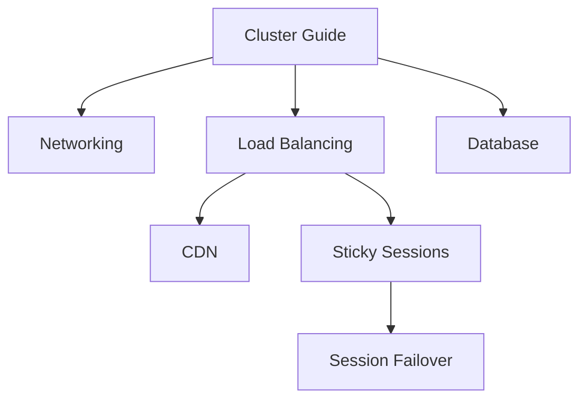
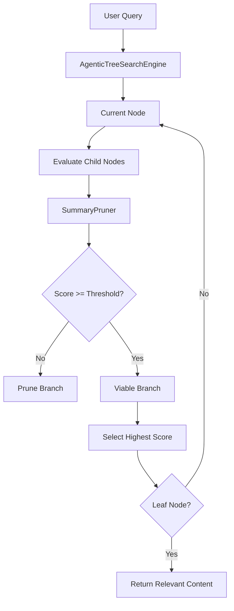
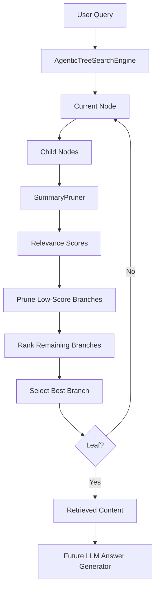
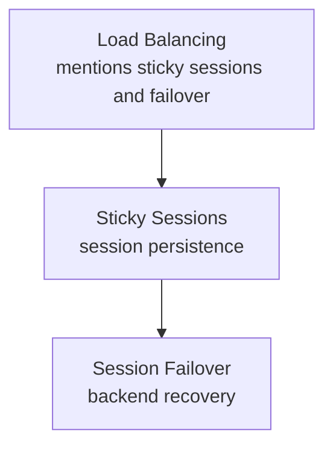
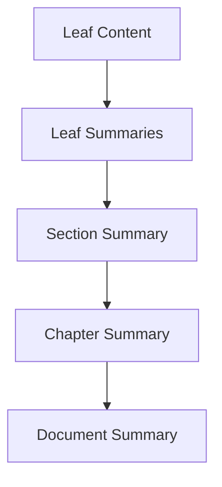
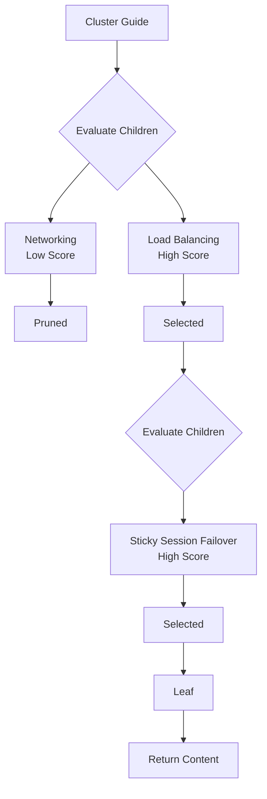
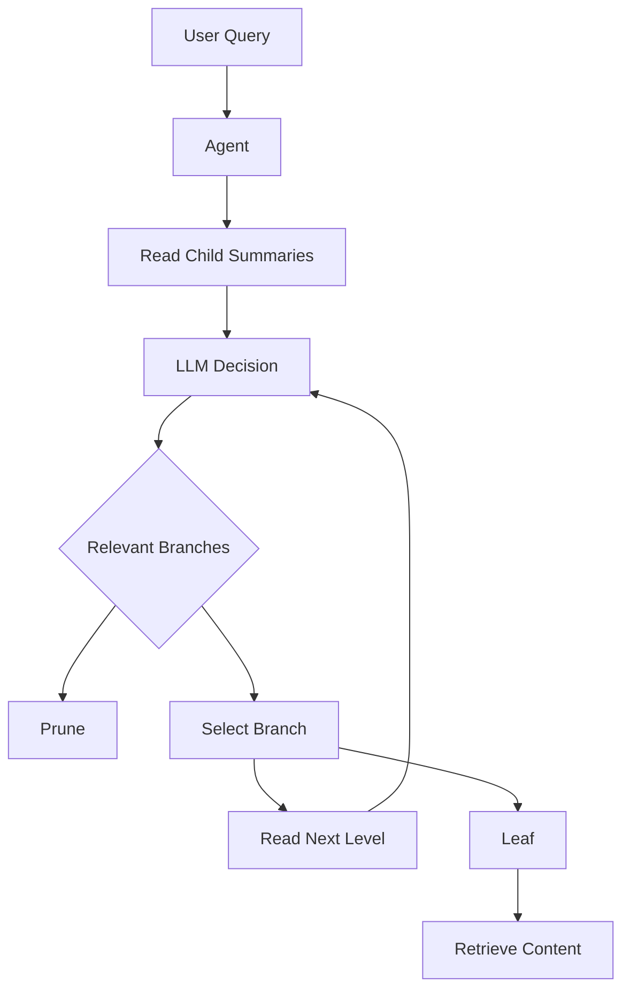
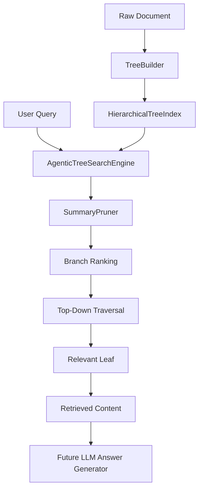

# Chapter 3 — Summary Pruner & Agentic Tree Search Engine

## 1. Chapter Goal

In Chapter 2, we built the `TreeBuilder` that converts structured documents into a hierarchical `HierarchicalTreeIndex`.

We now have a document tree such as:

```text
Document
├── Networking
│   ├── DNS
│   └── BGP
├── Load Balancing
│   ├── CDN
│   └── Sticky Sessions
│       └── Session Failover
└── Database
    ├── Replication
    └── Failover
```

The next problem is:

> **How do we find the relevant part of this tree for a user query?**

Traditional RAG commonly performs vector similarity search:

```text
Query
  ↓
Embedding
  ↓
Vector Database
  ↓
Similarity Search
  ↓
Top-K Chunks
```

Vectorless RAG takes a different approach.

Instead of searching all chunks using vector distance, we navigate the document hierarchy from the top down:

```text
Query
  ↓
Root
  ↓
Evaluate Chapters
  ↓
Prune Irrelevant Branches
  ↓
Select Relevant Chapter
  ↓
Evaluate Sections
  ↓
Select Relevant Section
  ↓
Continue
  ↓
Relevant Leaf
```

This chapter implements that process.

We will build:

* `src/search/SummaryPruner.js`
* `src/search/AgenticTreeSearchEngine.js`

The search engine will:

1. Start at the root.
2. Inspect child nodes.
3. Calculate relevance scores.
4. Remove branches below the pruning threshold.
5. Select the strongest remaining branch.
6. Record the traversal trajectory.
7. Continue until a leaf node is reached.
8. Return the selected node and its content.

---

# 2. Important Architecture Clarification

The name **Agentic Tree Search** describes the architecture we are building, but the current implementation is not a true LLM agent.

It is a deterministic decision engine.

Likewise, this implementation is **not Monte Carlo Tree Search (MCTS)**.

MCTS involves:

* selection
* expansion
* simulation
* backpropagation

Our implementation does none of those.

Instead, we use:

> **Top-down greedy hierarchical traversal with relevance-based branch pruning.**

Later, an LLM can replace or augment the branch-selection logic.

---

# 3. Expected Outcome

Given:

```text
Query:
"How do sticky sessions handle failover?"
```

and a tree:



the search should conceptually navigate:

```text
Cluster Guide
      ↓
Load Balancing
      ↓
Sticky Sessions
      ↓
Session Failover
```

while eliminating irrelevant branches.

---

# 4. Search Architecture

The complete retrieval flow is:



The two major components have different responsibilities.

### `SummaryPruner`

Answers:

> "Is this branch relevant enough to keep?"

### `AgenticTreeSearchEngine`

Answers:

> "Which surviving branch should I navigate into?"

---

# 5. SummaryPruner

Create:

```text
src/search/SummaryPruner.js
```

Use:

```javascript
import { config } from "../config.js";

export class SummaryPruner {
  /**
   * Normalize query text into searchable terms.
   *
   * @param {string} query
   * @returns {string[]}
   */
  static tokenize(query) {
    if (
      typeof query !== "string" ||
      !query.trim()
    ) {
      return [];
    }

    return [
      ...new Set(
        query
          .toLowerCase()
          .replace(/[^a-z0-9\s-]/g, " ")
          .split(/\s+/)
          .filter(
            (term) => term.length > 2
          )
      )
    ];
  }

  /**
   * Calculate a lightweight relevance score.
   *
   * Scoring:
   *
   * - title match       = +3
   * - summary match     = +2
   * - keyword match     = +2
   * - entity match      = +2
   *
   * @param {string} query
   * @param {import("../tree/TreeNode.js").TreeNode} node
   * @returns {number}
   */
  static calculateRelevanceScore(
    query,
    node
  ) {
    const queryTerms =
      this.tokenize(query);

    if (queryTerms.length === 0) {
      return 0;
    }

    const title =
      String(node.title || "")
        .toLowerCase();

    const summary =
      String(node.summary || "")
        .toLowerCase();

    const keywords =
      Array.isArray(node.keywords)
        ? node.keywords.join(" ").toLowerCase()
        : "";

    const entities =
      Array.isArray(node.entities)
        ? node.entities.join(" ").toLowerCase()
        : "";

    let score = 0;

    for (const term of queryTerms) {
      if (title.includes(term)) {
        score += 3;
      }

      if (summary.includes(term)) {
        score += 2;
      }

      if (keywords.includes(term)) {
        score += 2;
      }

      if (entities.includes(term)) {
        score += 2;
      }
    }

    return score;
  }

  /**
   * Score and sort candidate nodes.
   *
   * @param {string} query
   * @param {import("../tree/TreeNode.js").TreeNode[]} candidateNodes
   * @returns {Array<{node: import("../tree/TreeNode.js").TreeNode, score: number}>}
   */
  static rankNodes(
    query,
    candidateNodes
  ) {
    return candidateNodes
      .map((node) => ({
        node,
        score:
          this.calculateRelevanceScore(
            query,
            node
          )
      }))
      .sort(
        (a, b) =>
          b.score - a.score
      );
  }

  /**
   * Remove branches below the relevance threshold.
   *
   * @param {string} query
   * @param {import("../tree/TreeNode.js").TreeNode[]} candidateNodes
   * @param {number} threshold
   * @returns {import("../tree/TreeNode.js").TreeNode[]}
   */
  static pruneNodes(
    query,
    candidateNodes,
    threshold = config.pruningThreshold
  ) {
    if (
      !Array.isArray(candidateNodes)
    ) {
      throw new TypeError(
        "candidateNodes must be an array."
      );
    }

    return candidateNodes.filter(
      (node) =>
        this.calculateRelevanceScore(
          query,
          node
        ) >= threshold
    );
  }
}
```

---

# 6. Why `SummaryPruner` Exists

The tree may contain hundreds or thousands of nodes.

We do not want the search engine to explore every branch.

For example:

```text
Query:
"sticky session failover"
```

At the root:

```text
Cluster Guide
├── Networking
├── Load Balancing
├── Database
└── Security
```

Only one branch may be strongly relevant.

The pruner attempts to eliminate:

```text
Networking
Database
Security
```

and preserve:

```text
Load Balancing
```

This reduces the search space.

---

# 7. `tokenize()`

The first helper is:

```javascript
static tokenize(query) {
  return [
    ...new Set(
      query
        .toLowerCase()
        .replace(/[^a-z0-9\s-]/g, " ")
        .split(/\s+/)
        .filter(
          (term) => term.length > 2
        )
    )
  ];
}
```

For:

```text
"How do sticky sessions handle failover?"
```

we get approximately:

```text
[
  "how",
  "sticky",
  "sessions",
  "handle",
  "failover"
]
```

The `Set` removes duplicate terms.

The tokenizer is deliberately simple because this chapter is building the retrieval architecture rather than a full NLP pipeline.

---

# 8. Relevance Scoring

The current scoring model is:

| Match   | Score |
| ------- | ----: |
| Title   |    +3 |
| Summary |    +2 |
| Keyword |    +2 |
| Entity  |    +2 |

For example:

```text
Node title:
Sticky Session Failover
```

Query:

```text
sticky session failover
```

The title may match:

```text
sticky
session
failover
```

giving a strong score.

---

# 9. Why Title Matches Receive More Weight

Consider:

```text
Title:
Sticky Session Failover
```

versus:

```text
Summary:
This section discusses several application
server concepts and occasionally mentions sessions.
```

A title match is generally a stronger structural signal.

Therefore:

```text
Title match = +3
Summary match = +2
```

This is a heuristic rather than a semantic similarity model.

---

# 10. Important Correction: This Is Not Semantic Similarity

The original implementation described the score as a:

> semantic relevance score

That is inaccurate.

This implementation does not calculate:

* embeddings
* cosine similarity
* transformer representations
* semantic distance

It performs lexical matching.

Therefore, the correct description is:

> **lightweight lexical relevance score**

Later we can replace the scoring implementation with an LLM or another semantic method without changing the overall search-engine architecture.

---

# 11. `rankNodes()`

This method:

```javascript
static rankNodes(
  query,
  candidateNodes
)
```

produces:

```text
Node A → score 8
Node B → score 5
Node C → score 0
```

and sorts them:

```text
Node A → 8
Node B → 5
Node C → 0
```

This is useful because the search engine needs to know which surviving branch is strongest.

---

# 12. `pruneNodes()`

The pruning method:

```javascript
static pruneNodes(
  query,
  candidateNodes,
  threshold = config.pruningThreshold
)
```

keeps only nodes satisfying:

```text
score >= threshold
```

Our Chapter 0 configuration contains:

```env
SUMMARY_PRUNING_THRESHOLD=1.5
```

Therefore:

```text
score = 5
→ keep

score = 2
→ keep

score = 1
→ prune

score = 0
→ prune
```

---

# 13. AgenticTreeSearchEngine

Now create:

```text
src/search/AgenticTreeSearchEngine.js
```

Use:

```javascript
import { SummaryPruner } from "./SummaryPruner.js";

export class AgenticTreeSearchEngine {
  /**
   * Create a search engine over a hierarchical tree.
   *
   * @param {import("../tree/HierarchicalTreeIndex.js").HierarchicalTreeIndex} treeIndex
   */
  constructor(treeIndex) {
    if (!treeIndex) {
      throw new Error(
        "treeIndex is required."
      );
    }

    if (!treeIndex.root) {
      throw new Error(
        "treeIndex must contain a root node."
      );
    }

    this.treeIndex = treeIndex;
  }

  /**
   * Select the highest-scoring candidate.
   *
   * @param {string} query
   * @param {import("../tree/TreeNode.js").TreeNode[]} candidateNodes
   * @returns {{node: import("../tree/TreeNode.js").TreeNode, score: number}|null}
   */
  selectBestBranch(
    query,
    candidateNodes
  ) {
    if (
      !Array.isArray(candidateNodes) ||
      candidateNodes.length === 0
    ) {
      return null;
    }

    const ranked =
      SummaryPruner.rankNodes(
        query,
        candidateNodes
      );

    return ranked[0] || null;
  }

  /**
   * Search from the root toward the most relevant leaf.
   *
   * @param {string} query
   * @returns {Object}
   */
  search(query) {
    if (
      typeof query !== "string" ||
      !query.trim()
    ) {
      throw new Error(
        "query must be a non-empty string."
      );
    }

    let currentNode =
      this.treeIndex.root;

    const traversalPath = [
      currentNode.nodeId
    ];

    const reasoningLogs = [];

    const visitedNodes = [
      currentNode
    ];

    const prunedNodes = [];

    console.log(
      `\n🔍 [Agentic Tree Search] Query: "${query}"`
    );

    console.log(
      `🚀 Starting at root: ` +
      `[${currentNode.nodeId}] ` +
      `${currentNode.title}`
    );

    while (
      !currentNode.isLeaf()
    ) {
      const children =
        currentNode.children;

      console.log(
        `\n📂 Level ${currentNode.level + 1}: ` +
        `Evaluating ${children.length} candidate node(s)...`
      );

      const ranked =
        SummaryPruner.rankNodes(
          query,
          children
        );

      for (const item of ranked) {
        console.log(
          `   • [${item.node.nodeId}] ` +
          `${item.node.title} ` +
          `(Score: ${item.score.toFixed(1)})`
        );
      }

      const viableBranches =
        SummaryPruner.pruneNodes(
          query,
          children
        );

      for (const child of children) {
        if (
          !viableBranches.includes(child)
        ) {
          prunedNodes.push(child);
        }
      }

      console.log(
        `   ✂️ Pruned ` +
        `${children.length - viableBranches.length}/` +
        `${children.length} branch(es).`
      );

      if (
        viableBranches.length === 0
      ) {
        const logMessage =
          `No child branch passed the ` +
          `pruning threshold under ` +
          `"${currentNode.title}".`;

        reasoningLogs.push(
          logMessage
        );

        console.log(
          `   ❌ ${logMessage}`
        );

        return {
          query,
          documentTitle:
            this.treeIndex.documentTitle,
          matched: false,
          matchedLeavesCount: 0,
          targetNodeId: null,
          targetTitle: null,
          pageRange: null,
          traversalPath,
          reasoningLogs,
          prunedNodeIds:
            prunedNodes.map(
              (node) => node.nodeId
            ),
          retrievedContent: null
        };
      }

      const selected =
        this.selectBestBranch(
          query,
          viableBranches
        );

      if (!selected) {
        break;
      }

      const selectedChild =
        selected.node;

      const reasoningMessage =
        `Selected [${selectedChild.nodeId}] ` +
        `"${selectedChild.title}" ` +
        `with score ${selected.score.toFixed(1)}.`;

      reasoningLogs.push(
        reasoningMessage
      );

      console.log(
        `   🎯 ${reasoningMessage}`
      );

      currentNode =
        selectedChild;

      traversalPath.push(
        currentNode.nodeId
      );

      visitedNodes.push(
        currentNode
      );
    }

    const matched =
      currentNode.isLeaf();

    if (matched) {
      console.log(
        `\n✅ [Target Leaf Located] ` +
        `[${currentNode.nodeId}] ` +
        `${currentNode.title}`
      );

      console.log(
        `📍 Path: ` +
        `${traversalPath.join(" -> ")}`
      );

      console.log(
        `📖 Pages: ` +
        `pp. ${currentNode.pageRange.join("-")}`
      );
    }

    return {
      query,
      documentTitle:
        this.treeIndex.documentTitle,

      matched,
      matchedLeavesCount:
        matched ? 1 : 0,

      targetNodeId:
        matched
          ? currentNode.nodeId
          : null,

      targetTitle:
        matched
          ? currentNode.title
          : null,

      pageRange:
        matched
          ? [...currentNode.pageRange]
          : null,

      traversalPath,

      reasoningLogs,

      visitedNodeIds:
        visitedNodes.map(
          (node) => node.nodeId
        ),

      prunedNodeIds:
        prunedNodes.map(
          (node) => node.nodeId
        ),

      retrievedContent:
        matched
          ? currentNode.content
          : null
    };
  }
}
```

---

# 14. Constructor

The constructor receives the index created in Chapter 2:

```javascript
const engine =
  new AgenticTreeSearchEngine(index);
```

The engine stores:

```javascript
this.treeIndex = treeIndex;
```

It can now access:

```text
treeIndex.root
treeIndex.nodesById
treeIndex.documentTitle
```

---

# 15. `selectBestBranch()`

The search engine may have multiple viable children:

```text
Load Balancing → 8
Networking     → 2
Database       → 1
```

The pruner may first remove:

```text
Database
```

and leave:

```text
Load Balancing
Networking
```

`selectBestBranch()` then selects:

```text
Load Balancing → 8
```

The important separation is:

```text
SummaryPruner
    ↓
Which branches survive?

AgenticTreeSearchEngine
    ↓
Which surviving branch should we follow?
```

---

# 16. The Main Search Loop

The core algorithm is:

```javascript
while (!currentNode.isLeaf()) {
    ...
}
```

This means:

> Continue navigating until there are no children left.

For example:

```text
Root
 ↓
Chapter
 ↓
Section
 ↓
Subsection
 ↓
Leaf
```

At each level we repeat the same process.

---

# 17. Step 1 — Evaluate Children

The engine obtains:

```javascript
const children =
  currentNode.children;
```

Suppose the current node is:

```text
Load Balancing
```

and its children are:

```text
CDN
Sticky Sessions
Traffic Routing
```

The search engine scores all three.

---

# 18. Step 2 — Rank Candidates

The engine calls:

```javascript
const ranked =
  SummaryPruner.rankNodes(
    query,
    children
  );
```

Example:

```text
Sticky Sessions → 13
CDN             → 0
Traffic Routing → 2
```

The search engine now knows which branch appears most relevant.

---

# 19. Step 3 — Prune

Next:

```javascript
const viableBranches =
  SummaryPruner.pruneNodes(
    query,
    children
  );
```

With:

```text
threshold = 1.5
```

we get:

```text
Sticky Sessions → keep
Traffic Routing → keep
CDN             → prune
```

This is branch pruning.

---

# 20. Why We Must Not Automatically Select a Branch When Everything Is Pruned

The original implementation contained this pattern:

```javascript
viableBranches.length > 0
  ? selectBestBranch(...)
  : selectBestBranch(allChildren)
```

That creates an important retrieval bug.

Suppose:

```text
Query:
PostgreSQL replication
```

and all current children score:

```text
Networking → 0
Load Balancing → 0
Security → 0
```

If the engine automatically chooses the first child anyway, it might navigate:

```text
Networking
```

even though there is no evidence that Networking is relevant.

That creates a **false positive**.

Therefore, this implementation returns:

```text
matched: false
```

when no branch passes the threshold.

---

# 21. Step 4 — Select the Strongest Viable Branch

If viable branches exist:

```javascript
const selected =
  this.selectBestBranch(
    query,
    viableBranches
  );
```

Suppose:

```text
Sticky Sessions → 13
Traffic Routing → 2
```

The selected branch is:

```text
Sticky Sessions
```

---

# 22. Step 5 — Continue Traversal

The selected node becomes:

```javascript
currentNode =
  selectedChild;
```

Then:

```javascript
traversalPath.push(
  currentNode.nodeId
);
```

The search continues from the newly selected node.

---

# 23. Traversal Trajectory

One of the most useful outputs is:

```javascript
traversalPath
```

For example:

```text
[
  "root",
  "l1-load-balancing-2",
  "l2-sticky-sessions-5",
  "l3-session-failover-6"
]
```

This gives us an explicit explanation of where the search went.

That is particularly valuable in a vectorless architecture because the system can expose:

> "I selected this section because it was the strongest branch at each hierarchy level."

---

# 24. Reasoning Logs

The engine also stores:

```javascript
reasoningLogs
```

For example:

```text
Selected [l1-load-balancing-2]
"Load Balancing" with score 7.0.

Selected [l2-sticky-sessions-5]
"Sticky Sessions" with score 13.0.

Selected [l3-session-failover-6]
"Session Failover" with score 9.0.
```

These are **application decision logs**, not hidden LLM chain-of-thought.

That distinction is important.

We are recording observable search decisions:

```text
node
score
selection
pruning
trajectory
```

rather than attempting to expose private model reasoning.

---

# 25. Leaf Detection

The search stops when:

```javascript
currentNode.isLeaf()
```

returns:

```text
true
```

A leaf has no children:

```text
children.length === 0
```

The resulting node is treated as the target retrieval node.

---

# 26. Retrieval Response

A successful search returns:

```javascript
{
  query,
  documentTitle,
  matched,
  matchedLeavesCount,
  targetNodeId,
  targetTitle,
  pageRange,
  traversalPath,
  reasoningLogs,
  visitedNodeIds,
  prunedNodeIds,
  retrievedContent
}
```

For example:

```javascript
{
  matched: true,
  matchedLeavesCount: 1,
  targetTitle: "Session Failover",
  pageRange: [45, 52],
  retrievedContent: "..."
}
```

This response can later be passed into an answer-generation model.

---

# 27. Complete Retrieval Pipeline

At this stage our Vectorless RAG pipeline becomes:



---

# 28. Important Limitation: Parent Summaries Matter

There is an important architectural constraint with top-down retrieval.

Suppose the tree is:

```text
Load Balancing
└── Sticky Sessions
    └── Session Failover
```

and the query is:

```text
"How does sticky session failover work?"
```

If the `Load Balancing` node contains only:

```text
"Round robin traffic distribution."
```

then the parent may receive a score of:

```text
0
```

even though a descendant contains the answer.

This is a fundamental issue with strict local top-down routing.

Therefore, **parent-level summaries must provide enough information to route queries toward relevant descendants.**

---

# 29. How to Improve Parent Routing

A production document tree should ideally have high-level summaries such as:

```text
Load Balancing

Covers CDN routing, traffic distribution,
sticky sessions, session persistence,
and backend failover.
```

Now the query:

```text
sticky session failover
```

can match the parent.

The hierarchy becomes:



This is one reason hierarchical summarization is extremely important in Vectorless RAG.

---

# 30. Production Improvement: Hierarchical Summary Generation

A stronger Chapter 2/production pipeline would generate parent summaries from their descendants:



For example:

```text
Leaf:
Session Failover

↓ summary

Sticky Sessions:
Includes session persistence and backend failover.

↓ summary

Load Balancing:
Covers traffic distribution, sticky sessions,
session persistence, and backend failover.
```

This makes top-down routing much more reliable.

---

# 31. Verification Setup

Use structured sections whose parent metadata contains enough routing information.

Run:

```bash
node --input-type=module -e "
import { TreeBuilder } from './src/tree/TreeBuilder.js';
import { AgenticTreeSearchEngine } from './src/search/AgenticTreeSearchEngine.js';

const sections = [
  {
    title: 'Networking',
    level: 1,
    content: 'IP protocols and DNS routing.',
    summary: 'Networking protocols and DNS routing.',
    keywords: ['networking', 'dns', 'routing']
  },

  {
    title: 'Load Balancing',
    level: 1,
    content: 'Traffic distribution, sticky sessions and failover.',
    summary: 'Traffic distribution, sticky sessions, session persistence and failover.',
    keywords: [
      'load balancing',
      'sticky sessions',
      'session',
      'failover'
    ]
  },

  {
    title: 'Sticky Session Failover',
    level: 2,
    content: 'Cookie session recovery details during backend failure.',
    summary: 'Sticky session recovery and failover when backend servers fail.',
    keywords: [
      'sticky sessions',
      'session',
      'failover',
      'recovery'
    ]
  }
];

const index =
  TreeBuilder.buildFromStructuredSections(
    'Cluster Guide',
    sections
  );

const engine =
  new AgenticTreeSearchEngine(index);

const result =
  engine.search(
    'sticky session failover'
  );

console.log(
  '\\nMatched Leaves Count:',
  result.matchedLeavesCount
);

console.log(
  'Target:',
  result.targetTitle
);

console.log(
  'Path:',
  result.traversalPath.join(' -> ')
);
"
```

---

# 32. Expected Output

The exact node IDs may differ, but the important result is:

```text
🔍 [Agentic Tree Search] Query: "sticky session failover"

🚀 Starting at root: [root] Cluster Guide

📂 Level 1: Evaluating 2 candidate node(s)...
   • [l1-load-balancing-2] Load Balancing (Score: ...)
   • [l1-networking-1] Networking (Score: ...)
   ✂️ Pruned 1/2 branch(es).
   🎯 Selected [l1-load-balancing-2] "Load Balancing"

📂 Level 2: Evaluating 1 candidate node(s)...
   • [l2-sticky-session-failover-3] Sticky Session Failover (Score: ...)
   ✂️ Pruned 0/1 branch(es).
   🎯 Selected [l2-sticky-session-failover-3] "Sticky Session Failover"

✅ [Target Leaf Located] ...

Matched Leaves Count: 1
Target: Sticky Session Failover
```

---

# 33. Understanding the Complete Search

For:

```text
sticky session failover
```

the search behaves like:



The search does not need to inspect unrelated leaves individually.

---

# 34. Why This Is Different From Vector Search

Traditional vector retrieval may look like:

```text
Query
 ↓
Embedding
 ↓
Compare against chunk vectors
 ↓
Top-K chunks
```

Our current approach is:

```text
Query
 ↓
Root
 ↓
Chapter scoring
 ↓
Branch pruning
 ↓
Section scoring
 ↓
Branch pruning
 ↓
Leaf
```

The retrieval unit is therefore not simply a chunk.

It is a **hierarchical decision path**.

---

# 35. Search Complexity

Suppose a tree has:

```text
10 chapters
100 sections
1,000 leaf nodes
```

A naive flat search might inspect all 1,110 nodes.

Hierarchical traversal may inspect something closer to:

```text
10
 ↓
10
 ↓
10
 ↓
1
```

depending on the branching structure and pruning behavior.

The exact performance depends heavily on:

* branching factor
* pruning threshold
* summary quality
* query quality
* tree depth

Therefore, Vectorless RAG is not automatically faster than vector search.

Its major advantage is **structural retrieval and explainability**, not simply fewer computations.

---

# 36. Threshold Tuning

The pruning threshold comes from:

```javascript
config.pruningThreshold
```

which was defined in Chapter 0.

For example:

```env
SUMMARY_PRUNING_THRESHOLD=1.5
```

A low threshold:

```text
0.5
```

means:

```text
More branches survive
↓
Higher recall
↓
More search work
```

A high threshold:

```text
5.0
```

means:

```text
Fewer branches survive
↓
Lower search work
↓
Potentially lower recall
```

This is the classic retrieval trade-off:

```text
Recall ↔ Precision ↔ Search Cost
```

---

# 37. Why We Keep the Threshold in Configuration

Do not hard-code:

```javascript
const threshold = 1.5;
```

inside the search engine.

Instead:

```javascript
config.pruningThreshold
```

keeps the behavior configurable.

This allows different environments to use different settings without changing application code.

---

# 38. Search Failure Is a Valid Result

An important retrieval principle is:

> **Not finding a relevant branch is better than confidently selecting an irrelevant branch.**

The engine therefore returns:

```javascript
{
  matched: false,
  matchedLeavesCount: 0,
  targetNodeId: null,
  retrievedContent: null
}
```

when no branch passes the threshold.

Later, an LLM answer layer can respond appropriately instead of hallucinating from unrelated content.

---

# 39. Current Scoring Is Still a Prototype

The current implementation uses:

```text
Title
Summary
Keywords
Entities
```

with simple lexical matching.

It does **not** yet understand:

```text
"server crashed"
```

as being semantically related to:

```text
"backend failure"
```

That requires stronger semantic reasoning.

Future versions can replace:

```javascript
SummaryPruner.calculateRelevanceScore()
```

with:

```text
LLM-based branch evaluation
```

or another semantic ranking strategy.

---

# 40. Future LLM-Based Agent

The architecture can eventually evolve into:



The important point is that the current deterministic implementation establishes the infrastructure required for that future agent.

---

# 41. Why This Is "Agentic"

The current system performs repeated decisions:

```text
Evaluate
 ↓
Select
 ↓
Observe new context
 ↓
Evaluate again
 ↓
Select again
```

This creates a decision trajectory:

```text
Root
 ↓
Chapter
 ↓
Section
 ↓
Subsection
 ↓
Leaf
```

The system is therefore **agent-like in its navigation pattern**, even though the current branch-selection policy is deterministic.

An LLM can later become the decision-maker.

---

# 42. End-to-End Vectorless RAG Architecture

After Chapter 3, our architecture is:



---

# 43. Chapter 3 Checklist

Before moving forward, verify:

* [ ] `SummaryPruner.js` exists
* [ ] Query tokenization works
* [ ] Node relevance scoring works
* [ ] Title matches receive a boost
* [ ] Summary matches are scored
* [ ] Keywords are scored
* [ ] Entities are scored
* [ ] Candidate nodes can be ranked
* [ ] Low-score branches are pruned
* [ ] `AgenticTreeSearchEngine.js` exists
* [ ] Search starts from the root
* [ ] Child nodes are evaluated level by level
* [ ] Best viable branch is selected
* [ ] Traversal path is recorded
* [ ] Pruned node IDs are recorded
* [ ] Search stops at a leaf
* [ ] Retrieved content is returned
* [ ] `matchedLeavesCount` is returned
* [ ] Failed searches do not blindly select an unrelated branch

---

# 44. Current Project Progress

The project now has three important layers:

```text
Chapter 0
Configuration
      ↓
Chapter 1
TreeNode + HierarchicalTreeIndex
      ↓
Chapter 2
TreeBuilder
      ↓
Chapter 3
SummaryPruner + AgenticTreeSearchEngine
```

Conceptually:

```text
DOCUMENT
   ↓
STRUCTURE
   ↓
TREE
   ↓
NAVIGATION
   ↓
RELEVANT LEAF
```

This is the foundation of the Vectorless RAG retrieval architecture.

---

# 45. What Comes Next

In **Chapter 4**, we can build the **LLM Wiki Architecture & Vault Manager**.

That layer can take the hierarchical tree and turn it into a persistent knowledge representation:

```text
Document
   ↓
Hierarchical Tree
   ↓
Wiki-like Node Representation
   ↓
Vault
   ↓
Persistent Knowledge Base
```

The key progression is now:

> **Chapter 2 taught the system how to build the map.**

> **Chapter 3 taught the system how to navigate the map.**

> **Chapter 4 will teach the system how to persist and organize the knowledge represented by that map.**
