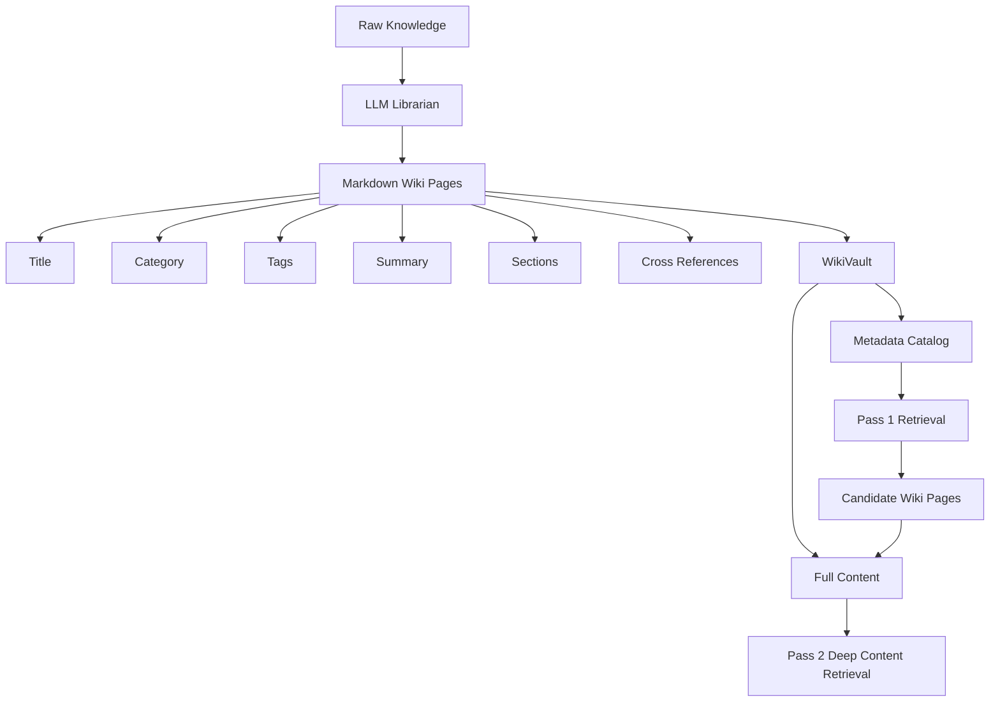
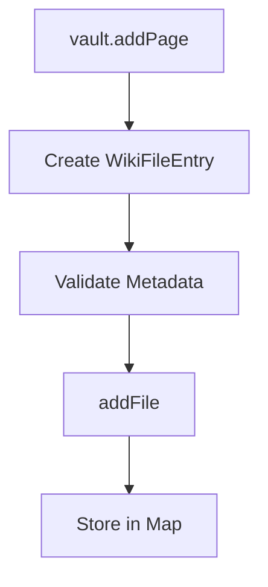
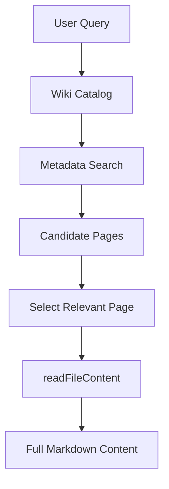
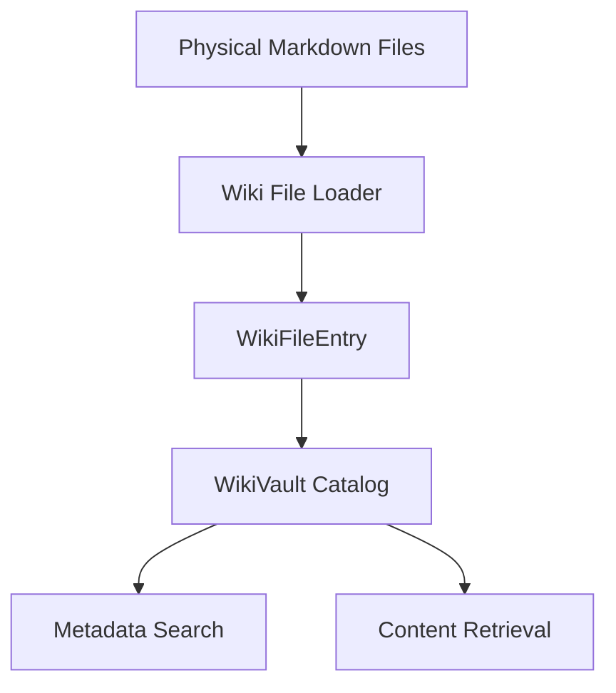
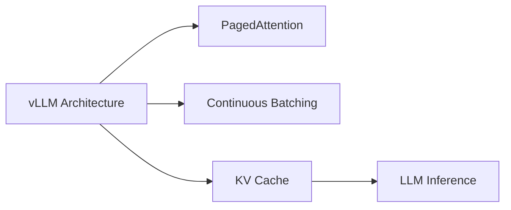
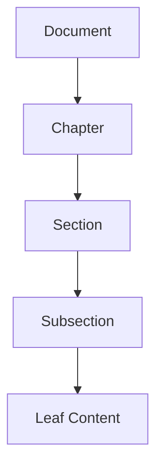
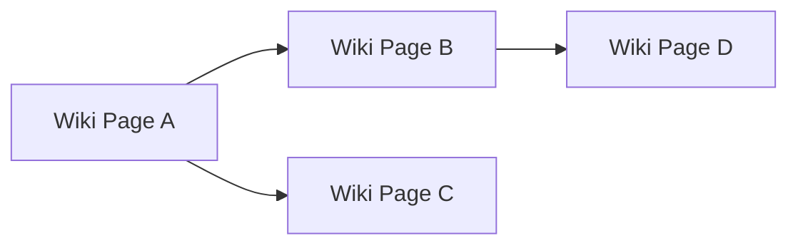
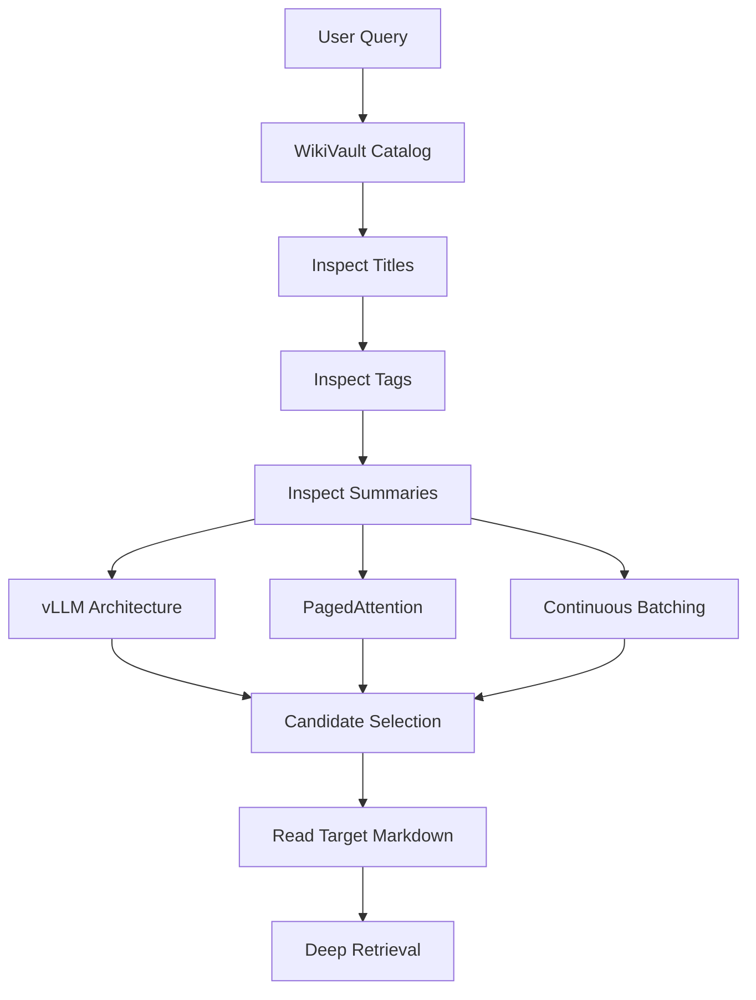
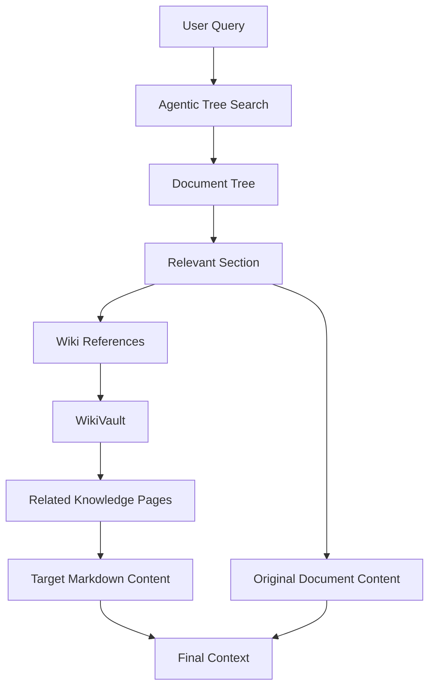
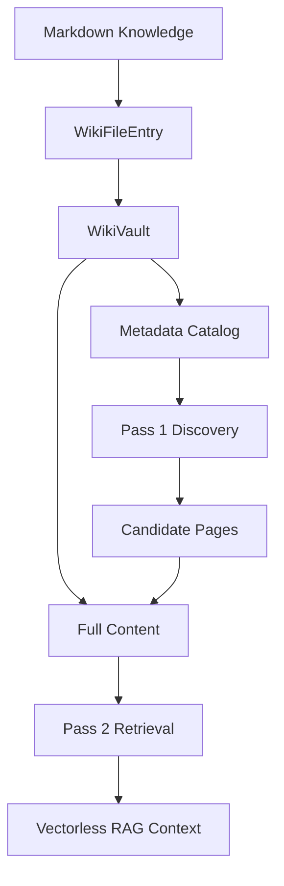

# Chapter 4 — LLM Wiki Architecture & Vault Manager

## 1. Chapter Goal

In the previous chapters, we built the foundation of our Vectorless RAG system:

* **Chapter 1:** Hierarchical document tree using `TreeNode` and `HierarchicalTreeIndex`
* **Chapter 2:** Automatic document tree construction
* **Chapter 3:** Top-down agentic tree search and summary pruning

Now we introduce another important architectural component: the **LLM Wiki**.

The goal of this chapter is to build the **`WikiVault`** class inside:

```text
src/wiki/WikiVault.js
```

The idea is inspired by the concept of an **LLM-maintained Wiki**: instead of hiding knowledge inside an opaque vector database, information can be represented as human-readable Markdown documents containing:

* titles
* categories
* tags
* summaries
* sections
* cross-references
* raw Markdown content

This makes the knowledge base:

* inspectable
* editable
* explainable
* version-controllable
* easy for humans and LLM agents to navigate

---

## 2. Why Do We Need an LLM Wiki?

A traditional vector RAG pipeline usually looks like:

```text
Document
   ↓
Chunks
   ↓
Embeddings
   ↓
Vector Database
   ↓
Similarity Search
   ↓
Relevant Chunks
```

The problem is that the retrieval representation is largely hidden inside numerical vectors.

A Vectorless RAG + Wiki architecture takes a different approach:

```text
Documents
   ↓
Structured Markdown
   ↓
Wiki Pages
   ↓
Headers + Tags + Summaries
   ↓
Tree / Metadata Search
   ↓
Targeted Content Retrieval
```

The important difference is **transparency**.

A developer can open a Markdown file and understand exactly what information exists.

---

## 3. LLM Wiki Architecture

A useful mental model is:



The architecture separates **discovery** from **content loading**.

### Pass 1 — Metadata Discovery

The system examines lightweight information such as:

* title
* category
* tags
* summary
* file path

It does **not** need to load the complete document content.

### Pass 2 — Targeted Content Retrieval

After identifying relevant pages, the system loads the actual Markdown content.

This gives us a simple form of **lazy retrieval**.

---

# 4. Wiki Page Data Model

Before implementing `WikiVault`, we need a representation for a single Wiki page.

We will call this model:

```text
WikiFileEntry
```

A `WikiFileEntry` contains:

| Field        | Purpose                      |
| ------------ | ---------------------------- |
| `filePath`   | Location of the Wiki page    |
| `title`      | Human-readable page title    |
| `category`   | Logical knowledge category   |
| `tags`       | Searchable metadata          |
| `summary`    | Compact semantic description |
| `rawContent` | Complete Markdown content    |

For example:

```text
infrastructure/
└── alb-sticky-sessions.md
```

could have:

```text
Title:
AWS ALB Sticky Sessions

Category:
infrastructure

Tags:
load-balancing
sticky-sessions
aws
session-management

Summary:
Explains how application load balancers maintain
session affinity using cookies and handle backend
failover.

Raw Content:
# AWS ALB Sticky Sessions

...
```

---

# 5. Implementing `WikiFileEntry`

## File Path

```text
src/wiki/WikiVault.js
```

The `WikiFileEntry` class and the `WikiVault` class can live in the same module because they form one small domain abstraction.

## Complete Implementation

```javascript
/**
 * Represents one Markdown document inside the Wiki catalog.
 */
export class WikiFileEntry {
  /**
   * @param {Object} params
   * @param {string} params.filePath
   * @param {string} params.title
   * @param {string} params.category
   * @param {string[]} [params.tags=[]]
   * @param {string} [params.summary=""]
   * @param {string} [params.rawContent=""]
   */
  constructor({
    filePath,
    title,
    category,
    tags = [],
    summary = "",
    rawContent = ""
  }) {
    if (
      typeof filePath !== "string" ||
      !filePath.trim()
    ) {
      throw new Error(
        "filePath must be a non-empty string."
      );
    }

    if (
      typeof title !== "string" ||
      !title.trim()
    ) {
      throw new Error(
        "title must be a non-empty string."
      );
    }

    if (
      typeof category !== "string" ||
      !category.trim()
    ) {
      throw new Error(
        "category must be a non-empty string."
      );
    }

    if (!Array.isArray(tags)) {
      throw new TypeError(
        "tags must be an array."
      );
    }

    this.filePath = filePath;
    this.title = title;
    this.category = category;
    this.tags = [...tags];

    this.summary =
      typeof summary === "string"
        ? summary
        : "";

    this.rawContent =
      typeof rawContent === "string"
        ? rawContent
        : "";
  }

  /**
   * Return lightweight metadata.
   *
   * Raw Markdown content is intentionally excluded.
   *
   * @returns {Object}
   */
  getMetadata() {
    return {
      filePath: this.filePath,
      title: this.title,
      category: this.category,
      tags: [...this.tags],
      summary: this.summary
    };
  }
}
```

---

# 6. Understanding `WikiFileEntry`

The class is deliberately simple.

It represents **one knowledge page**, not the entire Wiki.

## Constructor

```javascript
constructor({
  filePath,
  title,
  category,
  tags = [],
  summary = "",
  rawContent = ""
})
```

Instead of passing positional arguments:

```javascript
new WikiFileEntry(
  "file.md",
  "My Page",
  "ai",
  [...]
);
```

we use a named object:

```javascript
new WikiFileEntry({
  filePath: "ai/vllm.md",
  title: "vLLM Architecture",
  category: "ai",
  tags: ["llm", "inference"],
  summary: "LLM inference architecture",
  rawContent: "# vLLM..."
});
```

This is easier to understand and safer when the model gains more fields later.

---

## Validation

We validate important fields before storing them.

For example:

```javascript
if (
  typeof filePath !== "string" ||
  !filePath.trim()
) {
  throw new Error(
    "filePath must be a non-empty string."
  );
}
```

This prevents invalid entries such as:

```javascript
new WikiFileEntry({
  filePath: "",
  title: "",
  category: "ai"
});
```

Failing early is useful because invalid Wiki metadata can make retrieval difficult to debug later.

---

# 7. Why `tags` Are Copied

Notice:

```javascript
this.tags = [...tags];
```

instead of:

```javascript
this.tags = tags;
```

The spread operator creates a new array.

This prevents accidental modification through the original array:

```javascript
const tags = ["llm", "memory"];

const page = new WikiFileEntry({
  filePath: "llm/page.md",
  title: "LLM Memory",
  category: "llm",
  tags
});
```

Without copying, external code could modify the page's internal state by changing `tags`.

The same idea is used in:

```javascript
getMetadata() {
  return {
    ...
    tags: [...this.tags]
  };
}
```

The metadata consumer receives a copy rather than direct access to the internal array.

---

# 8. `getMetadata()`

The most important method for the two-pass architecture is:

```javascript
getMetadata() {
  return {
    filePath: this.filePath,
    title: this.title,
    category: this.category,
    tags: [...this.tags],
    summary: this.summary
  };
}
```

Notice what is missing:

```text
rawContent
```

This is intentional.

Suppose the Wiki contains 10,000 documents.

Loading all full Markdown content just to discover which documents might be relevant would be wasteful.

Instead, the system can inspect:

```text
title
category
tags
summary
filePath
```

and only later load the selected content.

---

# 9. Implementing `WikiVault`

Now we build the actual catalog manager.

```javascript
import { WikiFileEntry } from "./WikiVault.js";
```

The import above would create a circular/self-reference if placed in the same file, so we do **not** need it.

The complete module is:

```javascript
/**
 * Represents one Markdown document inside the Wiki catalog.
 */
export class WikiFileEntry {
  constructor({
    filePath,
    title,
    category,
    tags = [],
    summary = "",
    rawContent = ""
  }) {
    if (
      typeof filePath !== "string" ||
      !filePath.trim()
    ) {
      throw new Error(
        "filePath must be a non-empty string."
      );
    }

    if (
      typeof title !== "string" ||
      !title.trim()
    ) {
      throw new Error(
        "title must be a non-empty string."
      );
    }

    if (
      typeof category !== "string" ||
      !category.trim()
    ) {
      throw new Error(
        "category must be a non-empty string."
      );
    }

    if (!Array.isArray(tags)) {
      throw new TypeError(
        "tags must be an array."
      );
    }

    this.filePath = filePath;
    this.title = title;
    this.category = category;
    this.tags = [...tags];

    this.summary =
      typeof summary === "string"
        ? summary
        : "";

    this.rawContent =
      typeof rawContent === "string"
        ? rawContent
        : "";
  }

  getMetadata() {
    return {
      filePath: this.filePath,
      title: this.title,
      category: this.category,
      tags: [...this.tags],
      summary: this.summary
    };
  }
}

/**
 * In-memory catalog of Wiki pages.
 *
 * This class represents the Wiki catalog layer.
 * Physical disk persistence can be added later.
 */
export class WikiVault {
  constructor() {
    /**
     * @type {Map<string, WikiFileEntry>}
     */
    this.files = new Map();
  }

  /**
   * Add or replace a Wiki page.
   *
   * @param {WikiFileEntry} entry
   */
  addFile(entry) {
    if (!(entry instanceof WikiFileEntry)) {
      throw new TypeError(
        "entry must be an instance of WikiFileEntry."
      );
    }

    this.files.set(
      entry.filePath,
      entry
    );

    console.log(
      `[WikiVault] Indexed Wiki Page: "${entry.title}" ` +
      `[Path: ${entry.filePath}]`
    );

    return entry;
  }

  /**
   * Create and add a Wiki page.
   *
   * Convenience method for callers.
   *
   * @param {Object} params
   * @returns {WikiFileEntry}
   */
  addPage(params) {
    const entry =
      new WikiFileEntry(params);

    return this.addFile(entry);
  }

  /**
   * Return metadata for every Wiki page.
   *
   * Raw content is excluded.
   *
   * @returns {Object[]}
   */
  listCatalogMetadata() {
    return Array.from(
      this.files.values()
    ).map(
      (entry) => entry.getMetadata()
    );
  }

  /**
   * Search Wiki pages by tag.
   *
   * Matching is case-insensitive.
   *
   * @param {string} tag
   * @returns {WikiFileEntry[]}
   */
  searchByTag(tag) {
    if (
      typeof tag !== "string" ||
      !tag.trim()
    ) {
      return [];
    }

    const normalizedTag =
      tag.trim().toLowerCase();

    return Array.from(
      this.files.values()
    ).filter((entry) =>
      entry.tags.some(
        (entryTag) =>
          String(entryTag)
            .toLowerCase() ===
          normalizedTag
      )
    );
  }

  /**
   * Search Wiki pages by category.
   *
   * @param {string} category
   * @returns {WikiFileEntry[]}
   */
  searchByCategory(category) {
    if (
      typeof category !== "string" ||
      !category.trim()
    ) {
      return [];
    }

    const normalizedCategory =
      category.trim().toLowerCase();

    return Array.from(
      this.files.values()
    ).filter(
      (entry) =>
        entry.category
          .toLowerCase() ===
        normalizedCategory
    );
  }

  /**
   * Retrieve a Wiki page by its path.
   *
   * @param {string} filePath
   * @returns {WikiFileEntry|undefined}
   */
  getFile(filePath) {
    return this.files.get(filePath);
  }

  /**
   * Pass 2 retrieval:
   * return full Markdown content for one selected page.
   *
   * @param {string} filePath
   * @returns {string}
   */
  readFileContent(filePath) {
    const entry =
      this.files.get(filePath);

    if (!entry) {
      throw new Error(
        `File '${filePath}' not found in Wiki Vault catalog.`
      );
    }

    return entry.rawContent;
  }

  /**
   * Return number of indexed Wiki pages.
   *
   * @returns {number}
   */
  size() {
    return this.files.size;
  }
}
```

---

# 10. Understanding the `WikiVault` Internals

## 10.1 The `Map`

The constructor contains:

```javascript
this.files = new Map();
```

The key is the Wiki file path.

Conceptually:

```text
Map

"infrastructure/alb.md"
        ↓
WikiFileEntry

"llm/vllm.md"
        ↓
WikiFileEntry

"database/postgres.md"
        ↓
WikiFileEntry
```

This gives us direct lookup:

```javascript
vault.getFile(
  "llm/vllm.md"
);
```

instead of scanning every document.

---

# 11. `addFile()`

The main insertion method is:

```javascript
addFile(entry) {
  if (!(entry instanceof WikiFileEntry)) {
    throw new TypeError(
      "entry must be an instance of WikiFileEntry."
    );
  }

  this.files.set(
    entry.filePath,
    entry
  );

  return entry;
}
```

The important operation is:

```javascript
this.files.set(
  entry.filePath,
  entry
);
```

The file path becomes the unique key.

For example:

```text
llm/vllm.md
```

maps to:

```text
WikiFileEntry("vLLM Architecture")
```

If the same path is inserted again, the existing entry is replaced.

This is useful when an LLM librarian updates a Wiki page.

---

# 12. Why Add `addPage()`?

The original chapter's verification code used:

```javascript
vault.addPage(...)
```

but the original implementation only provided:

```javascript
addFile()
```

That is an API mismatch.

We fix it with:

```javascript
addPage(params) {
  const entry =
    new WikiFileEntry(params);

  return this.addFile(entry);
}
```

Now callers can conveniently write:

```javascript
vault.addPage({
  filePath: "llm/vllm.md",
  title: "vLLM Architecture",
  category: "inference",
  tags: ["llm", "inference", "memory"],
  summary: "High performance LLM serving",
  rawContent: "# vLLM Architecture\n..."
});
```

Internally:



This is a **convenience API**, not a second storage mechanism.

---

# 13. Pass 1 — Catalog Metadata

The method:

```javascript
listCatalogMetadata() {
  return Array.from(
    this.files.values()
  ).map(
    (entry) => entry.getMetadata()
  );
}
```

provides the lightweight catalog.

For example:

```javascript
const catalog =
  vault.listCatalogMetadata();
```

might return:

```javascript
[
  {
    filePath: "llm/vllm.md",
    title: "vLLM Architecture",
    category: "inference",
    tags: ["llm", "inference", "memory"],
    summary: "High performance LLM serving"
  },
  {
    filePath: "llm/paged-attention.md",
    title: "PagedAttention",
    category: "memory",
    tags: ["memory", "os", "kv-cache"],
    summary: "Memory management for LLM inference"
  }
]
```

Notice that the potentially large:

```text
rawContent
```

is absent.

---

# 14. Pass 2 — Full Content Retrieval

After finding the correct Wiki page:

```javascript
const content =
  vault.readFileContent(
    "llm/vllm.md"
  );
```

the system retrieves the full Markdown.

This creates the two-pass flow:



This is important for Vectorless RAG because retrieval can happen in stages instead of loading the entire knowledge base into the model context.

---

# 15. Tag Search

We also implement:

```javascript
searchByTag(tag)
```

The core logic is:

```javascript
return Array.from(
  this.files.values()
).filter((entry) =>
  entry.tags.some(
    (entryTag) =>
      String(entryTag)
        .toLowerCase() ===
      normalizedTag
  )
);
```

There are three important JavaScript operations here.

### `Array.from()`

Converts the `Map` values iterator into an array:

```javascript
Array.from(
  this.files.values()
)
```

### `filter()`

Keeps only matching Wiki pages:

```javascript
.filter(...)
```

### `some()`

Checks whether at least one tag matches:

```javascript
entry.tags.some(...)
```

So:

```text
Wiki Pages
    ↓
Check each page
    ↓
Check its tags
    ↓
Does "inference" exist?
    ↓
Yes → Keep page
No  → Ignore page
```

---

# 16. Case-Insensitive Tag Matching

The method normalizes the query:

```javascript
const normalizedTag =
  tag.trim().toLowerCase();
```

and each stored tag:

```javascript
String(entryTag)
  .toLowerCase()
```

Therefore:

```text
Inference
INFERENCE
inference
 Inference
```

can all match the same logical tag.

---

# 17. Category Search

We also support:

```javascript
searchByCategory(category)
```

This allows queries such as:

```javascript
vault.searchByCategory(
  "inference"
);
```

This is useful when the Wiki is organized into knowledge domains such as:

```text
llm/
database/
networking/
security/
infrastructure/
machine-learning/
```

Category search is not a replacement for semantic retrieval. It is a lightweight metadata filter that can reduce the candidate set before deeper retrieval.

---

# 18. Why This Is Not Yet a Physical File System

There is an important architectural distinction.

Our current implementation stores:

```javascript
new Map()
```

in memory.

Therefore, this version is an **in-memory Wiki catalog**.

It does not yet physically read:

```text
wiki/
├── llm/
│   ├── vllm.md
│   └── paged-attention.md
└── infrastructure/
    └── alb.md
```

from disk.

That functionality can be added later.

The current chapter intentionally focuses on the **Wiki data model and retrieval abstraction**.

A future production implementation could have:



This separation is useful because the search engine does not need to know whether content comes from:

* local Markdown files
* object storage
* a database
* Git
* another service

It only needs the `WikiVault` interface.

---

# 19. Wiki Cross-References

An important LLM Wiki concept is explicit linking between pages.

For example:

```markdown
# vLLM Architecture

vLLM uses [[PagedAttention]] to efficiently manage
the KV cache.

Related:

- [[Continuous Batching]]
- [[KV Cache]]
- [[LLM Inference]]
```

The syntax:

```text
[[PagedAttention]]
```

creates an explicit knowledge relationship.

Conceptually:



This is particularly interesting for Vectorless RAG because links provide another retrieval mechanism that does not require embeddings.

For example:

```text
Query
 ↓
Find Wiki Page
 ↓
Inspect related links
 ↓
Follow relevant Wiki references
 ↓
Retrieve connected knowledge
```

Cross-reference parsing will be expanded in a later chapter rather than mixing it into the basic vault implementation.

---

# 20. Complete Retrieval Architecture

At this point, our Vectorless RAG system has two important structures:

### Document Tree



### Wiki Knowledge Graph



The two structures solve different problems.

| Structure               | Main Purpose                        |
| ----------------------- | ----------------------------------- |
| `HierarchicalTreeIndex` | Navigate document structure         |
| `WikiVault`             | Organize persistent knowledge pages |
| Tree summaries          | Guide hierarchical search           |
| Wiki tags               | Lightweight metadata filtering      |
| Wiki links              | Explicit knowledge relationships    |
| Raw Markdown            | Human-readable source content       |

Together they form the basis of a transparent retrieval architecture.

---

# 21. Verification & Testing

Create a small test using:

```bash
node --input-type=module -e "
import { WikiVault } from './src/wiki/WikiVault.js';

const vault = new WikiVault();

vault.addPage({
  filePath: 'llm/vllm.md',
  title: 'vLLM Architecture',
  category: 'inference',
  tags: ['inference', 'memory'],
  summary: 'High performance LLM serving',
  rawContent: '# vLLM Architecture\n\nHigh performance serving.'
});

vault.addPage({
  filePath: 'llm/paged-attention.md',
  title: 'PagedAttention Mechanism',
  category: 'memory',
  tags: ['memory', 'os', 'kv-cache'],
  summary: 'Efficient KV cache memory management',
  rawContent: '# PagedAttention\n\nEfficient KV cache management.'
});

console.log(
  'Vault Size:',
  vault.size()
);

const results =
  vault.searchByTag('inference');

console.log(
  'Found Tag Matches:',
  results.length
);

console.log(
  'Matched Page:',
  results[0]?.title
);

console.log(
  'Metadata:',
  vault.listCatalogMetadata()
);

console.log(
  'Full Content:',
  vault.readFileContent(
    'llm/vllm.md'
  )
);
"
```

---

# 22. Expected Output

The exact formatting can vary slightly, but the important results should look like:

```text
[WikiVault] Indexed Wiki Page: "vLLM Architecture" [Path: llm/vllm.md]

[WikiVault] Indexed Wiki Page: "PagedAttention Mechanism" [Path: llm/paged-attention.md]

Vault Size: 2

Found Tag Matches: 1

Matched Page: vLLM Architecture

Metadata: [
  {
    filePath: 'llm/vllm.md',
    title: 'vLLM Architecture',
    category: 'inference',
    tags: [ 'inference', 'memory' ],
    summary: 'High performance LLM serving'
  },
  ...
]

Full Content: # vLLM Architecture

High performance serving.
```

---

# 23. Understanding the Complete Flow

Let's follow a real example.

Suppose the user asks:

```text
How does vLLM manage memory during inference?
```

The Wiki architecture could operate like this:



The important idea is that we don't immediately load every page.

First we discover.

Then we retrieve.

---

# 24. How This Connects to Agentic Tree Search

Chapter 3 introduced:

```text
AgenticTreeSearchEngine
```

which navigates:

```text
Root
 ↓
Chapter
 ↓
Section
 ↓
Leaf
```

The Wiki system provides another navigation layer.

We can eventually combine them:



This is where Vectorless RAG becomes more powerful.

Instead of relying on one retrieval mechanism, the system can reason across:

1. hierarchical document structure
2. summaries
3. metadata
4. tags
5. explicit Wiki links
6. document sections

---

# 25. Important Design Decision — Metadata vs Content

One of the most important principles in this chapter is:

> **Do not treat metadata and content as the same retrieval layer.**

Metadata answers:

```text
Which document might be relevant?
```

Content answers:

```text
What does that document actually say?
```

Therefore:

```text
Pass 1
Metadata
↓
Candidate selection

Pass 2
Full content
↓
Answer generation
```

This separation helps control context size and makes the retrieval process easier to inspect.

---

# 26. Important Production Considerations

The current implementation is intentionally lightweight.

For a production Wiki system, several components would eventually be added.

### 1. Physical Markdown Persistence

Instead of:

```javascript
new Map()
```

the vault could load Markdown files from disk or object storage.

### 2. Frontmatter Parsing

Wiki files could use:

```markdown
---
title: vLLM Architecture
category: inference
tags:
  - llm
  - inference
  - memory
---

# vLLM Architecture

...
```

A parser could automatically generate `WikiFileEntry` objects.

### 3. Cross-Reference Resolution

The system could detect:

```text
[[PagedAttention]]
```

and resolve it to the corresponding Wiki page.

### 4. Wiki Graph

Pages and references could be represented as a graph:

```text
Page A
 ├── references → Page B
 ├── references → Page C
 └── references → Page D
```

### 5. Incremental Indexing

When only one Markdown page changes, the system should update only that page's metadata rather than rebuilding the entire catalog.

### 6. Version Control

Because Wiki pages are plain Markdown, Git can provide:

* history
* diffs
* rollback
* collaboration
* auditing

### 7. LLM Librarian

A future agent could automatically:

```text
New Document
     ↓
Analyze Content
     ↓
Create / Update Wiki Page
     ↓
Generate Summary
     ↓
Generate Tags
     ↓
Add Cross References
     ↓
Update Vault
```

This will be the foundation for the **LLM Librarian** introduced in the upcoming retrieval architecture.

---

# 27. Chapter 4 Summary

We built the initial LLM Wiki layer for our Vectorless RAG system.

### We implemented:

```text
WikiFileEntry
```

for representing individual Wiki pages.

We also implemented:

```text
WikiVault
```

for managing the Wiki catalog.

### Important capabilities:

```text
addFile()
addPage()
listCatalogMetadata()
searchByTag()
searchByCategory()
getFile()
readFileContent()
size()
```

### Architecture:



The major architectural principle is:

> **Discover with lightweight metadata first, then retrieve full content only when needed.**

This makes the knowledge system transparent and provides a foundation for agentic retrieval without requiring vector embeddings for every retrieval decision.

---

# 28. Chapter Checklist

Before moving to the next chapter, verify that you understand:

* [x] Why an LLM Wiki can complement Vectorless RAG
* [x] What `WikiFileEntry` represents
* [x] Why metadata is separated from raw content
* [x] Why `Map` is used by `WikiVault`
* [x] How `addFile()` works
* [x] Why `addPage()` is a useful convenience API
* [x] How tag search works
* [x] How category search works
* [x] How Pass 1 metadata retrieval works
* [x] How Pass 2 full-content retrieval works
* [x] Why Markdown makes the knowledge base inspectable
* [x] How Wiki cross-references can support Vectorless retrieval
* [x] How the Wiki layer can connect with the document tree

---

# 29. What's Next?

In **Chapter 5**, we will combine these ideas into a more complete retrieval architecture:

```text
User Query
    ↓
Wiki Metadata Search
    ↓
Candidate Pages
    ↓
Document Tree Search
    ↓
Summary Pruning
    ↓
Target Sections
    ↓
Full Content Retrieval
    ↓
LLM Librarian / Synthesis
```

The next major component will be the **Two-Pass Retriever & LLM Librarian**, which will turn our separate tree and Wiki components into a coordinated Vectorless RAG retrieval pipeline.

The key fixes here are that **`addPage()` and `searchByTag()` now actually exist**, the verification command works with ESM, and the chapter clearly distinguishes the current **in-memory catalog** from a future physical Markdown-backed vault.
