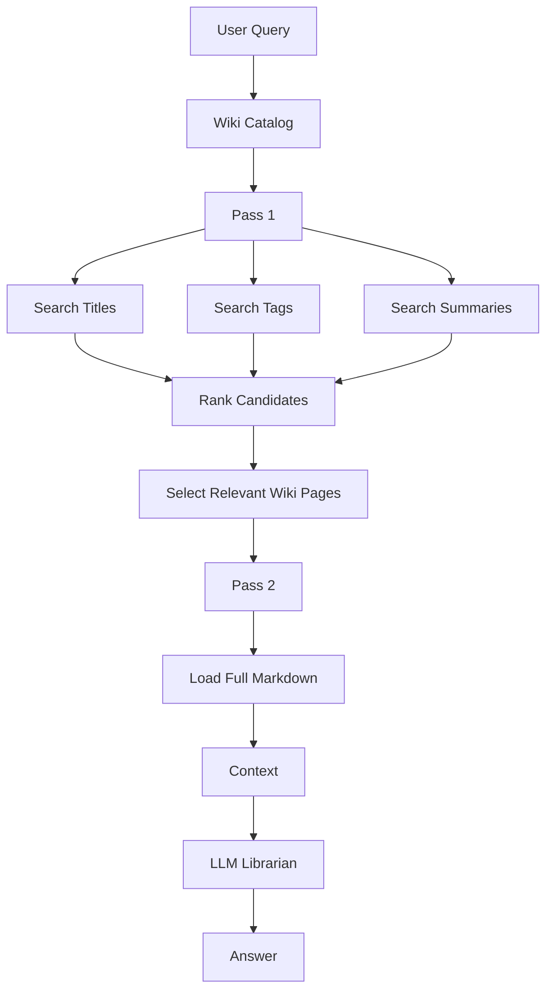
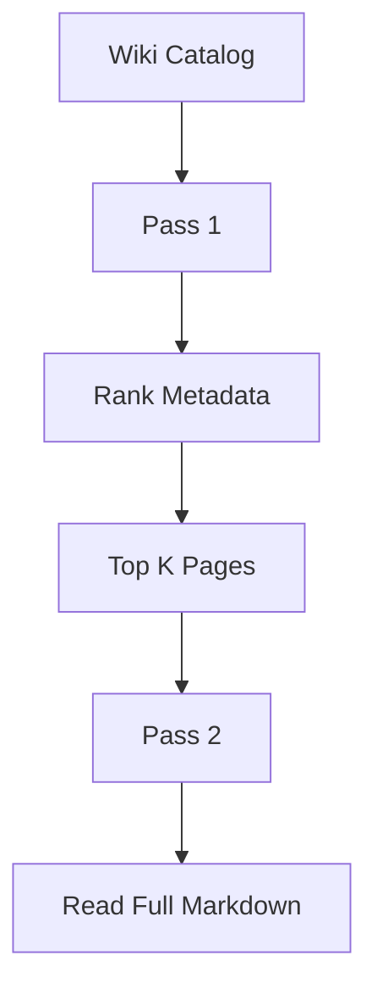
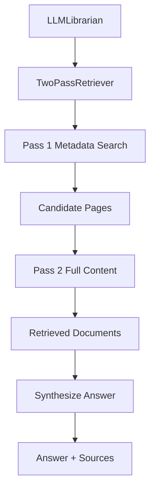
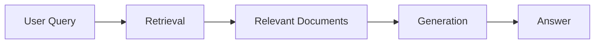
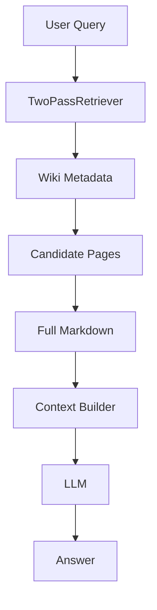
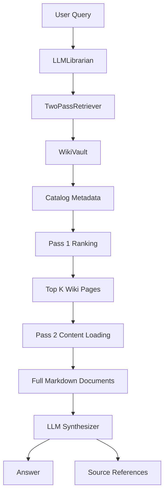
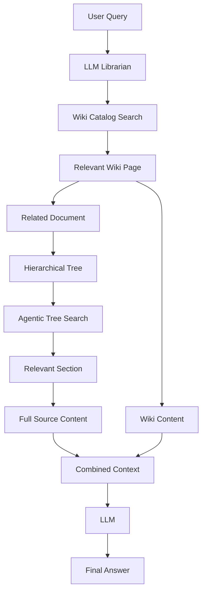
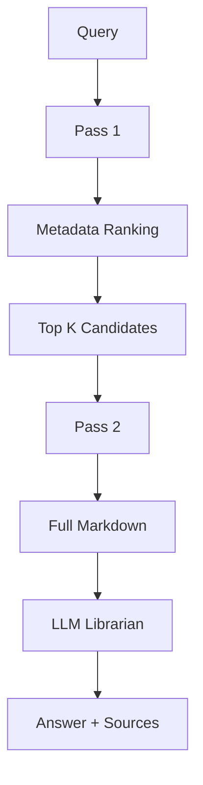

# Chapter 5 — Two-Pass Retrieval & LLM Librarian

## 1. Chapter Goal

In Chapter 4, we built the `WikiVault`, which provides a structured catalog of human-readable Wiki pages.

Now we build the retrieval layer that sits on top of that catalog.

This chapter introduces two components:

```text
src/wiki/TwoPassRetriever.js
src/wiki/LLMLibrarian.js
```

The main idea is simple:

> **Do not immediately read every Wiki document. First search the catalog, identify the most relevant pages, and only then load their full content.**

This resembles how a human librarian works.

If you ask:

> "How do sticky sessions handle backend failure?"

a librarian would not read every book in the library.

Instead, they would:

1. inspect the catalog
2. identify potentially relevant books
3. open the relevant book
4. read the necessary sections
5. provide an answer

Our Vectorless RAG system follows the same principle.

---

# 2. Traditional RAG vs Two-Pass Wiki Retrieval

A simplified vector RAG pipeline looks like:

```text
Document
   ↓
Chunk
   ↓
Embedding
   ↓
Vector Database
   ↓
Similarity Search
   ↓
Retrieved Chunks
   ↓
LLM
```

Our Wiki retrieval pipeline is:



The key difference is that **Pass 1 operates on lightweight metadata**.

Full content is only loaded after candidate selection.

---

# 3. What Does "Two-Pass" Mean?

## Pass 1 — Catalog Search

The system searches:

```text
title
summary
tags
category
```

For example:

```text
Query:
sticky session failover

Candidate:

ALB Sticky Sessions
Score: 8

PostgreSQL Replication
Score: 2

CDN Edge Caching
Score: 0
```

The system then selects the strongest candidate.

---

## Pass 2 — Content Retrieval

Only after selecting the candidate does the system execute:

```javascript
vault.readFileContent(filePath);
```

This retrieves the complete Markdown document.

---

# 4. Why This Architecture Is Useful

Suppose a Wiki contains:

```text
10,000 Markdown pages
```

and each page contains:

```text
5 KB
```

Reading everything would require roughly:

```text
10,000 × 5 KB
= 50 MB
```

of content before retrieval even starts.

Instead, Pass 1 can inspect compact metadata:

```text
title
tags
summary
category
```

and perhaps identify:

```text
3 relevant pages
```

Then Pass 2 loads only those pages.

Conceptually:

```text
10,000 metadata entries
        ↓
     Pass 1
        ↓
   3 candidates
        ↓
     Pass 2
        ↓
  3 full documents
```

This is not automatically equivalent to semantic vector retrieval, but it provides a **transparent, inspectable retrieval strategy**.

---

# 5. Implementing `TwoPassRetriever`

## File Path

```text
src/wiki/TwoPassRetriever.js
```

## Complete Code

```javascript id="8qz5rm"
import { SummaryPruner } from "../search/SummaryPruner.js";

/**
 * Performs two-stage retrieval over an LLM Wiki vault.
 *
 * Pass 1:
 *   Search lightweight Wiki metadata.
 *
 * Pass 2:
 *   Load full Markdown content for selected pages.
 */
export class TwoPassRetriever {
  /**
   * @param {import("./WikiVault.js").WikiVault} wikiVault
   * @param {Object} [options]
   * @param {number} [options.maxResults=3]
   */
  constructor(
    wikiVault,
    {
      maxResults = 3
    } = {}
  ) {
    if (!wikiVault) {
      throw new Error(
        "wikiVault is required."
      );
    }

    if (
      typeof wikiVault.listCatalogMetadata !==
      "function"
    ) {
      throw new TypeError(
        "wikiVault must provide listCatalogMetadata()."
      );
    }

    if (
      typeof wikiVault.readFileContent !==
      "function"
    ) {
      throw new TypeError(
        "wikiVault must provide readFileContent()."
      );
    }

    if (
      !Number.isInteger(maxResults) ||
      maxResults <= 0
    ) {
      throw new Error(
        "maxResults must be a positive integer."
      );
    }

    this.vault = wikiVault;
    this.maxResults = maxResults;
  }

  /**
   * Search the lightweight Wiki catalog.
   *
   * No raw Markdown content is loaded here.
   *
   * @param {string} query
   * @returns {Object[]}
   */
  searchCatalog(query) {
    const catalog =
      this.vault.listCatalogMetadata();

    const ranked =
      SummaryPruner.rankNodes(
        query,
        catalog.map((metadata) => ({
          nodeId: metadata.filePath,
          title: metadata.title,
          summary: metadata.summary,
          keywords: metadata.tags,
          entities: [metadata.category]
        }))
      );

    return ranked
      .filter(
        (item) => item.score > 0
      )
      .slice(
        0,
        this.maxResults
      )
      .map((item) => ({
        filePath:
          item.node.nodeId,
        title:
          item.node.title,
        score:
          item.score
      }));
  }

  /**
   * Execute the complete two-pass retrieval process.
   *
   * @param {string} query
   * @returns {Object}
   */
  searchAndRetrieve(query) {
    if (
      typeof query !== "string" ||
      !query.trim()
    ) {
      throw new Error(
        "query must be a non-empty string."
      );
    }

    const normalizedQuery =
      query.trim();

    console.log(
      `\n🔍 [Two-Pass Wiki Retrieval] ` +
      `Query: "${normalizedQuery}"`
    );

    // -------------------------------------------------------------
    // PASS 1 — Metadata discovery
    // -------------------------------------------------------------

    console.log(
      "\n⚡ [PASS 1] Searching Wiki catalog metadata..."
    );

    const candidates =
      this.searchCatalog(
        normalizedQuery
      );

    if (candidates.length === 0) {
      console.log(
        "❌ No matching Wiki pages found."
      );

      return {
        query: normalizedQuery,
        candidates: [],
        documents: [],
        matched: false
      };
    }

    for (const candidate of candidates) {
      console.log(
        `   • ${candidate.title} ` +
        `(Score: ${candidate.score.toFixed(1)})`
      );
    }

    // -------------------------------------------------------------
    // PASS 2 — Full content retrieval
    // -------------------------------------------------------------

    console.log(
      "\n📖 [PASS 2] Loading full Markdown content..."
    );

    const documents =
      candidates.map(
        (candidate) => ({
          filePath:
            candidate.filePath,

          title:
            candidate.title,

          score:
            candidate.score,

          content:
            this.vault.readFileContent(
              candidate.filePath
            )
        })
      );

    return {
      query: normalizedQuery,
      candidates,
      documents,
      matched: true
    };
  }
}
```

---

# 6. Understanding the `TwoPassRetriever`

The class has three major responsibilities:

```text
TwoPassRetriever
      │
      ├── searchCatalog()
      │
      └── searchAndRetrieve()
```

The first method performs Pass 1.

The second method coordinates both passes.

---

# 7. Constructor

The constructor receives a `WikiVault`:

```javascript id="7lsk1m"
constructor(
  wikiVault,
  {
    maxResults = 3
  } = {}
)
```

This follows an important design principle:

> **The retriever should depend on the vault interface, not on the physical storage implementation.**

The retriever doesn't care whether the vault eventually stores Wiki pages in:

* memory
* local Markdown files
* S3
* Cloudflare R2
* a database
* Git

It only needs:

```javascript
listCatalogMetadata()
readFileContent()
```

---

# 8. Why `maxResults` Exists

We don't necessarily want to load every matching page.

For example:

```text
Query
 ↓
20 matching pages
 ↓
Select top 3
 ↓
Read 3 documents
```

Therefore:

```javascript id="v4c4x9"
maxResults = 3
```

controls how many candidate pages enter Pass 2.

Later, this can become configurable based on:

* query complexity
* context-window size
* document size
* LLM model
* retrieval confidence

---

# 9. Pass 1 — `searchCatalog()`

The first important method is:

```javascript id="c0n0y5"
searchCatalog(query)
```

It retrieves:

```javascript
const catalog =
  this.vault.listCatalogMetadata();
```

Remember what Chapter 4 taught us.

This catalog contains:

```text
filePath
title
category
tags
summary
```

but not:

```text
rawContent
```

Therefore Pass 1 does not need to load the complete Wiki documents.

---

# 10. Reusing `SummaryPruner`

Rather than creating another scoring algorithm, we reuse the component built in Chapter 3:

```javascript id="6s6w7d"
SummaryPruner.rankNodes()
```

This is an important architectural decision.

We already have a lightweight metadata relevance scorer.

Instead of duplicating it, we adapt Wiki metadata into the structure expected by `SummaryPruner`.

```javascript id="e6j1yt"
{
  nodeId: metadata.filePath,
  title: metadata.title,
  summary: metadata.summary,
  keywords: metadata.tags,
  entities: [metadata.category]
}
```

This gives us:

```text
Wiki Metadata
     ↓
Adapter
     ↓
SummaryPruner
     ↓
Ranked Candidates
```

The `nodeId` field is simply being used as the identifier expected by `SummaryPruner`; it contains the Wiki file path.

---

# 11. Why Tags Become Keywords

Our Wiki model has:

```javascript
tags
```

while the tree search model has:

```javascript
keywords
```

These fields play similar retrieval roles.

Therefore:

```javascript
keywords: metadata.tags
```

lets the same scoring engine operate on both structures.

This is a small but useful example of **interface adaptation**.

---

# 12. Candidate Filtering

After ranking:

```javascript id="3s4j2v"
.filter(
  (item) => item.score > 0
)
```

removes documents with no lexical match.

Then:

```javascript id="7m7k8v"
.slice(
  0,
  this.maxResults
)
```

keeps only the strongest candidates.

For example:

```text
Candidate A → 10
Candidate B → 8
Candidate C → 5
Candidate D → 0
Candidate E → 0
```

with:

```text
maxResults = 3
```

becomes:

```text
A
B
C
```

---

# 13. Pass 2 — Loading Full Content

After candidate selection:

```javascript id="z9q0v2"
const documents =
  candidates.map(
    (candidate) => ({
      ...
      content:
        this.vault.readFileContent(
          candidate.filePath
        )
    })
  );
```

Now, and only now, full Markdown is loaded.

This is the central idea of the chapter.



---

# 14. The Retriever's Return Object

A successful retrieval returns:

```javascript
{
  query,
  candidates,
  documents,
  matched: true
}
```

For example:

```javascript
{
  query: "vllm pagedattention",

  candidates: [
    {
      filePath: "llm/paged-attention.md",
      title: "PagedAttention Mechanism",
      score: 10
    }
  ],

  documents: [
    {
      filePath: "llm/paged-attention.md",
      title: "PagedAttention Mechanism",
      score: 10,
      content: "# PagedAttention..."
    }
  ],

  matched: true
}
```

This makes the retrieval result easy for the next component to consume.

---

# 15. Implementing `LLMLibrarian`

The `LLMLibrarian` is the higher-level orchestration layer.

Its responsibility is not simply storing Wiki pages.

It coordinates:

```text
Query
 ↓
TwoPassRetriever
 ↓
Retrieved Documents
 ↓
Answer Synthesis
```

## File Path

```text
src/wiki/LLMLibrarian.js
```

## Complete Code

```javascript id="q8m4s1"
import { WikiFileEntry, WikiVault } from "./WikiVault.js";
import { TwoPassRetriever } from "./TwoPassRetriever.js";

/**
 * LLM Librarian.
 *
 * Coordinates Wiki retrieval and answer synthesis.
 *
 * The current implementation uses deterministic synthesis.
 * An actual LLM provider can be injected later.
 */
export class LLMLibrarian {
  /**
   * @param {WikiVault} vault
   * @param {Object} [options]
   * @param {Function|null} [options.synthesizer=null]
   * @param {number} [options.maxResults=3]
   */
  constructor(
    vault,
    {
      synthesizer = null,
      maxResults = 3
    } = {}
  ) {
    if (!(vault instanceof WikiVault)) {
      throw new TypeError(
        "vault must be an instance of WikiVault."
      );
    }

    if (
      synthesizer !== null &&
      typeof synthesizer !== "function"
    ) {
      throw new TypeError(
        "synthesizer must be a function or null."
      );
    }

    this.vault = vault;

    this.retriever =
      new TwoPassRetriever(
        vault,
        { maxResults }
      );

    this.synthesizer =
      synthesizer;
  }

  /**
   * Generate an answer from retrieved Wiki documents.
   *
   * If no LLM synthesizer is configured, a deterministic
   * fallback response is returned.
   *
   * @param {string} query
   * @param {Object} retrieval
   * @returns {Promise<Object>}
   */
  async synthesizeAnswer(
    query,
    retrieval
  ) {
    if (
      !retrieval.matched ||
      retrieval.documents.length === 0
    ) {
      return {
        answer:
          "No relevant Wiki information was found.",
        sources: []
      };
    }

    const sources =
      retrieval.documents.map(
        (document) => ({
          title:
            document.title,

          filePath:
            document.filePath
        })
      );

    // Use an injected LLM synthesizer when available.
    if (this.synthesizer) {
      const answer =
        await this.synthesizer({
          query,
          documents:
            retrieval.documents
        });

      return {
        answer,
        sources
      };
    }

    // Deterministic development fallback.
    const answer =
      retrieval.documents
        .map(
          (document) =>
            `## ${document.title}\n\n` +
            document.content.trim()
        )
        .join("\n\n");

    return {
      answer,
      sources
    };
  }

  /**
   * Execute retrieval and answer synthesis.
   *
   * @param {string} query
   * @returns {Promise<Object>}
   */
  async answerQuery(query) {
    const retrieval =
      this.retriever.searchAndRetrieve(
        query
      );

    const synthesis =
      await this.synthesizeAnswer(
        query,
        retrieval
      );

    return {
      query,
      matched:
        retrieval.matched,

      answer:
        synthesis.answer,

      sources:
        synthesis.sources,

      candidates:
        retrieval.candidates,

      documents:
        retrieval.documents
    };
  }

  /**
   * Create a sample Wiki vault for development/testing.
   *
   * @returns {WikiVault}
   */
  static buildSampleVault() {
    const vault =
      new WikiVault();

    vault.addFile(
      new WikiFileEntry({
        filePath:
          "vault/infrastructure/cdn-setup.md",

        title:
          "CDN Edge Caching & Distribution Guide",

        category:
          "infrastructure",

        tags: [
          "cdn",
          "cache",
          "edge",
          "cloudflare",
          "assets"
        ],

        summary:
          "Configuring CDN edge rules, TTL headers, " +
          "and static asset distribution.",

        rawContent:
          `# CDN Edge Caching Guide

Static asset distribution relies on CDN edge caching.

Cache-Control headers can define how long assets remain
cacheable at edge locations.

Asset purge requests can be dispatched asynchronously.`
      })
    );

    vault.addFile(
      new WikiFileEntry({
        filePath:
          "vault/infrastructure/alb-sticky-sessions.md",

        title:
          "Application Load Balancer (ALB) Sticky Sessions & Cookies",

        category:
          "infrastructure",

        tags: [
          "alb",
          "load-balancer",
          "sticky-sessions",
          "cookies",
          "aws",
          "failover"
        ],

        summary:
          "Explains AWS ALB sticky sessions, cookie expiration, " +
          "session persistence, and sticky routing failover behavior.",

        rawContent:
          `# ALB Sticky Sessions Architecture Guide

Sticky sessions allow a load balancer to maintain
session affinity between a client and a backend target.

When a sticky target becomes unhealthy, the load balancer
can route the client toward another healthy target.

Applications that require durable session state can
rehydrate session information from a shared store such as Redis.`
      })
    );

    vault.addFile(
      new WikiFileEntry({
        filePath:
          "vault/databases/postgres-replication.md",

        title:
          "PostgreSQL Primary-Replica Streaming Replication Mechanics",

        category:
          "databases",

        tags: [
          "postgres",
          "database",
          "replication",
          "failover",
          "wal"
        ],

        summary:
          "Primary-replica streaming replication, WAL log shipping, " +
          "and automatic failover orchestration.",

        rawContent:
          `# PostgreSQL Replication Guide

PostgreSQL replication uses write-ahead logging (WAL)
to replicate changes from a primary database to standby nodes.

Standby nodes continuously apply replicated WAL records.`
      })
    );

    return vault;
  }
}
```

---

# 16. Understanding `LLMLibrarian`

The architecture is:



The librarian is therefore an **orchestrator**.

It doesn't need to know the internal details of catalog ranking.

That responsibility belongs to:

```text
TwoPassRetriever
```

---

# 17. Why Inject a `synthesizer`?

The constructor accepts:

```javascript
synthesizer = null
```

This is an important design decision.

We don't want the Wiki architecture tightly coupled to one specific LLM provider.

Instead:

```text
LLMLibrarian
      ↓
synthesizer()
      ↓
OpenAI / Gemini / Local LLM
```

can be plugged in later.

For example:

```javascript
const librarian =
  new LLMLibrarian(
    vault,
    {
      synthesizer: async ({
        query,
        documents
      }) => {
        // Call an LLM here.
        return "...";
      }
    }
  );
```

This keeps retrieval independent from generation.

---

# 18. Retrieval vs Generation

This separation is extremely important.

### Retrieval

Answers:

> **Which information should the model see?**

Handled by:

```text
TwoPassRetriever
```

### Generation

Answers:

> **How should that information be turned into an answer?**

Handled by:

```text
LLMLibrarian.synthesizeAnswer()
```

Therefore:



Keeping these concerns separate makes the system easier to test and evolve.

---

# 19. Why the Fallback Synthesizer Exists

At this stage, we don't need to require an API key just to test the retrieval architecture.

If no LLM synthesizer is supplied, the librarian creates a deterministic response from the retrieved Markdown.

For example:

```text
## Application Load Balancer...

# ALB Sticky Sessions...

Sticky sessions allow...
```

This is **not LLM-generated synthesis**.

It is simply a development fallback.

This distinction is important because we should not describe deterministic string concatenation as AI reasoning or semantic synthesis.

---

# 20. The Real LLM Integration

Later, the synthesizer can call an LLM.

Conceptually:

```javascript
const synthesizer =
  async ({
    query,
    documents
  }) => {
    const context =
      documents
        .map(
          (document) =>
            `# ${document.title}\n` +
            document.content
        )
        .join("\n\n");

    // Send query + context to an LLM.
    // Return generated answer.
  };
```

The architecture becomes:



The retrieval architecture does not need to change when the model provider changes.

---

# 21. Verification & Testing

Now we can verify the complete Chapter 5 architecture.

Use:

```bash
node --input-type=module -e "
import { LLMLibrarian } from './src/wiki/LLMLibrarian.js';

const vault =
  LLMLibrarian.buildSampleVault();

const librarian =
  new LLMLibrarian(vault);

const result =
  await librarian.answerQuery(
    'sticky session failover'
  );

console.log(
  '\nMatched:',
  result.matched
);

console.log(
  'Sources Used:',
  result.sources
);

console.log(
  '\nAnswer:\n',
  result.answer
);
"
```

---

# 22. Expected Retrieval Behavior

Pass 1 should inspect the catalog.

Conceptually:

```text
⚡ [PASS 1] Searching Wiki catalog metadata...

   • Application Load Balancer (ALB) Sticky Sessions & Cookies
     (Score: high)

   • PostgreSQL Primary-Replica Streaming Replication Mechanics
     (Score: lower)

🎯 Candidate selected
```

Then Pass 2 loads the selected Wiki page.

```text
📖 [PASS 2] Loading full Markdown content...
```

The final result should contain:

```text
Matched: true

Sources Used:
[
  {
    title: "Application Load Balancer (ALB) Sticky Sessions & Cookies",
    filePath: "vault/infrastructure/alb-sticky-sessions.md"
  }
]
```

The exact numeric score can change if the scoring logic changes, so the important verification is that the ALB Wiki page is ranked as a relevant source.

---

# 23. Testing with an Injected Synthesizer

We can also test the LLM integration boundary without making an actual API request.

```bash
node --input-type=module -e "
import { LLMLibrarian } from './src/wiki/LLMLibrarian.js';

const vault =
  LLMLibrarian.buildSampleVault();

const librarian =
  new LLMLibrarian(
    vault,
    {
      synthesizer: async ({
        query,
        documents
      }) => {
        return (
          'Query: ' + query +
          '\\nRetrieved: ' +
          documents
            .map(
              (document) =>
                document.title
            )
            .join(', ')
        );
      }
    }
  );

const result =
  await librarian.answerQuery(
    'sticky session failover'
  );

console.log(result.answer);
"
```

Expected:

```text
Query: sticky session failover
Retrieved: Application Load Balancer (ALB) Sticky Sessions & Cookies
```

This proves that the librarian can retrieve documents and pass them into an external generation layer.

---

# 24. Complete Chapter 5 Architecture

At this point, the system looks like:



This is the first point in the project where the Wiki system behaves like a complete retrieval subsystem.

---

# 25. How Chapter 5 Connects to Previous Chapters

We now have a clear progression.

### Chapter 0

Configuration:

```text
.env
 ↓
config.js
```

### Chapter 1

Tree representation:

```text
TreeNode
 ↓
HierarchicalTreeIndex
```

### Chapter 2

Automatic tree construction:

```text
Document
 ↓
TreeBuilder
 ↓
Hierarchical Tree
```

### Chapter 3

Tree retrieval:

```text
Query
 ↓
SummaryPruner
 ↓
AgenticTreeSearchEngine
 ↓
Relevant Leaf
```

### Chapter 4

Wiki knowledge layer:

```text
Markdown
 ↓
WikiFileEntry
 ↓
WikiVault
```

### Chapter 5

Wiki retrieval and synthesis:

```text
Query
 ↓
TwoPassRetriever
 ↓
Wiki Pages
 ↓
LLMLibrarian
 ↓
Answer
```

---

# 26. Combining Tree Search + Wiki Retrieval

The next architectural step is particularly powerful.

We can combine the Chapter 3 tree search with the Chapter 5 Wiki retrieval.

For example:



This gives the system multiple transparent retrieval signals:

* Wiki metadata
* tags
* summaries
* document hierarchy
* tree navigation
* explicit Wiki references
* full Markdown content

---

# 27. Important Limitation — Lexical Retrieval

Our current implementation uses:

```text
keyword matching
```

through `SummaryPruner`.

Therefore, this is **not semantic retrieval**.

For example:

```text
Query:
"backend node failure"
```

may not strongly match:

```text
"server instance becomes unhealthy"
```

even though the concepts are related.

This is a deliberate limitation of the current chapter.

Later improvements can include:

* LLM-based catalog ranking
* query expansion
* synonym generation
* hierarchical summaries
* cross-reference traversal
* structured metadata
* hybrid lexical + semantic retrieval

without turning the entire architecture into a traditional vector RAG pipeline.

---

# 28. Important Limitation — Top-K Selection

Currently:

```javascript
maxResults = 3
```

means only the strongest three candidates are loaded.

This is useful for controlling context size, but it introduces a trade-off:

```text
Small K
 ↓
Lower context cost
 ↓
Higher risk of missing information
```

versus:

```text
Large K
 ↓
More context
 ↓
Higher processing cost
```

Production systems should make this configurable.

---

# 29. Important Production Considerations

## 29.1 Persistent Wiki Storage

The current `WikiVault` is in-memory.

A production version should load Markdown from persistent storage.

```text
Markdown Files
     ↓
Wiki Loader
     ↓
WikiVault
```

---

## 29.2 Incremental Catalog Updates

When one Wiki page changes:

```text
Changed page
     ↓
Re-index only that page
```

rather than rebuilding the entire catalog.

---

## 29.3 Better Metadata

A production Wiki entry could include:

```text
title
category
tags
summary
entities
authors
createdAt
updatedAt
references
sourceDocuments
pageRanges
```

---

## 29.4 LLM-Based Librarian

The future librarian could:

```text
New Document
      ↓
Understand Document
      ↓
Find Existing Wiki Pages
      ↓
Create / Update Page
      ↓
Generate Summary
      ↓
Generate Tags
      ↓
Add [[WikiLinks]]
      ↓
Update Catalog
```

This is where the term **LLM Librarian** becomes more literal.

---

# 30. A Note About the Term "Karpathy Two-Pass"

The two-pass pattern in this chapter is an architectural inspiration rather than a claim that the exact implementation reproduces a specific production algorithm.

Our implementation currently performs:

```text
Pass 1:
lightweight metadata ranking

Pass 2:
full content retrieval
```

That distinction matters.

The actual scoring logic is still deterministic lexical matching.

Later, an LLM can participate in candidate selection or answer synthesis.

---

# 31. Chapter 5 Summary

We built two major components.

### `TwoPassRetriever`

Responsible for:

```text
Catalog discovery
      ↓
Candidate ranking
      ↓
Full-content retrieval
```

### `LLMLibrarian`

Responsible for:

```text
User query
      ↓
TwoPassRetriever
      ↓
Retrieved Wiki documents
      ↓
Answer synthesis
      ↓
Sources
```

The architecture is:



The most important principle is:

> **Search the catalog first. Read the documents second. Generate the answer last.**

This keeps retrieval transparent and provides a clean separation between:

```text
Discovery
Retrieval
Generation
```

That separation will become extremely valuable as the project grows.

---

# 32. Chapter Checklist

Before moving to Chapter 6, you should understand:

* [x] Why two-pass retrieval is useful
* [x] What happens during Pass 1
* [x] What happens during Pass 2
* [x] Why full Markdown is not loaded during catalog search
* [x] How `TwoPassRetriever` uses `WikiVault`
* [x] How `SummaryPruner` can be reused for Wiki metadata
* [x] Why tags are adapted into keywords
* [x] Why `maxResults` controls context growth
* [x] What the `LLMLibrarian` orchestrator does
* [x] Why retrieval and generation are separated
* [x] Why the synthesizer is injectable
* [x] Why the current fallback is deterministic rather than an actual LLM
* [x] How an actual LLM can later be plugged in
* [x] How Wiki retrieval can eventually connect with tree search
* [x] Why the current implementation is lexical rather than semantic
* [x] The production limitations of the current prototype

---

# 33. What's Next?

In **Chapter 6**, we will build the **Benchmark Engine & Multi-Mode CLI Driver**.

The CLI will allow us to run different system modes such as:

```text
npm run tree-search
npm run llm-wiki
npm run benchmark
```

and compare the behavior of:

```text
Hierarchical Tree Search
        vs
Two-Pass Wiki Retrieval
        vs
Combined Retrieval
```

This will let us measure and debug our Vectorless RAG architecture rather than simply assuming that the retrieval system works.


