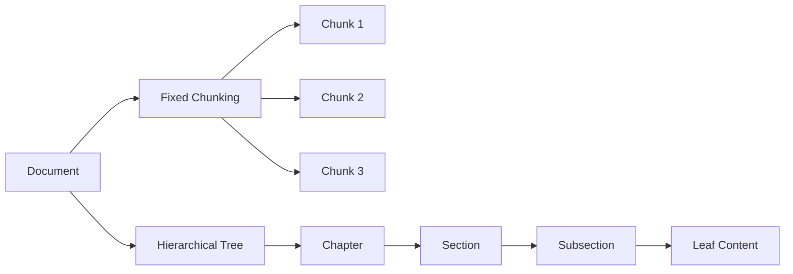
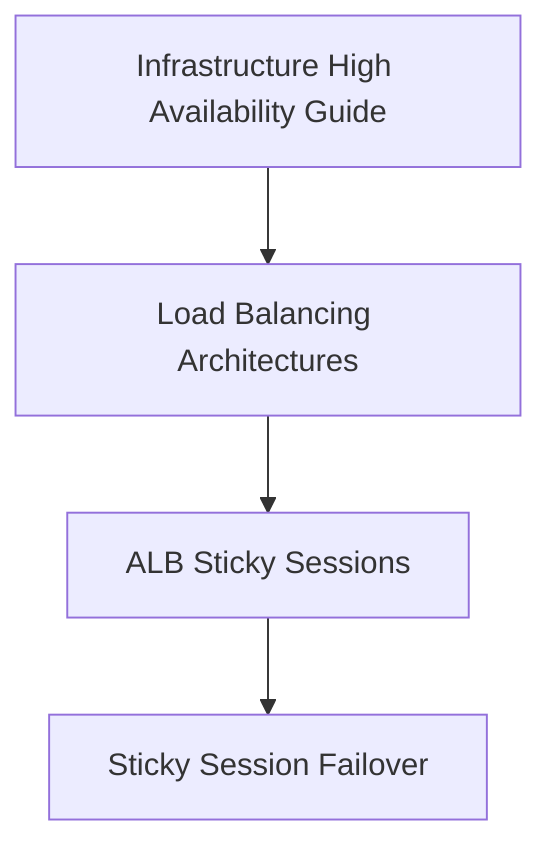
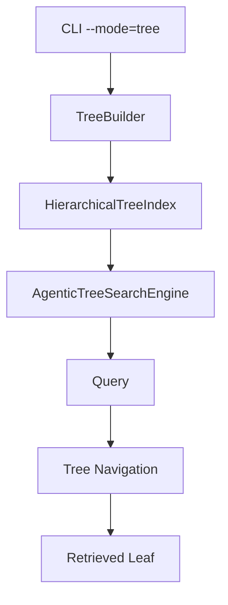
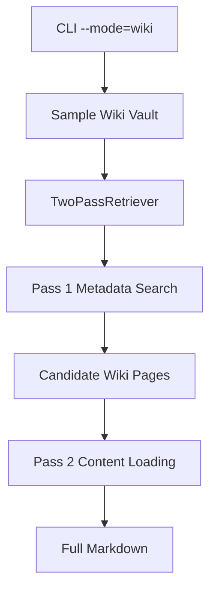
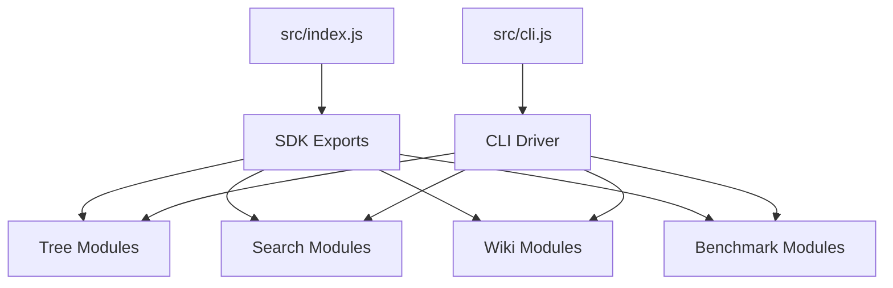
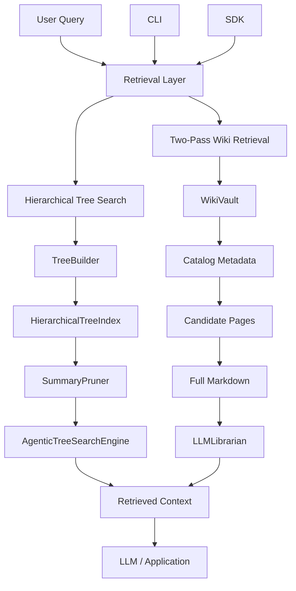
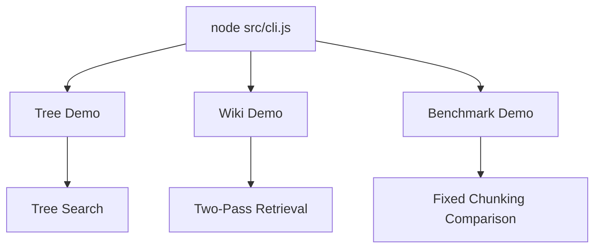
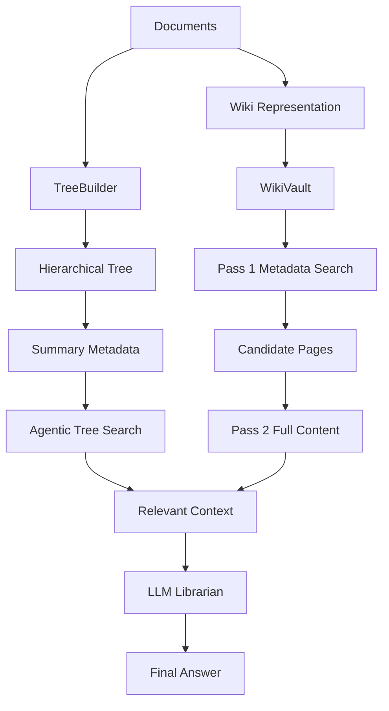
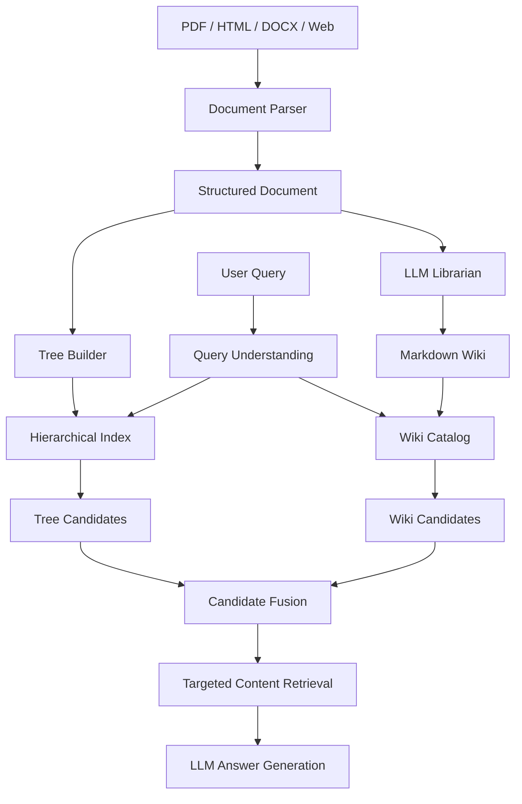
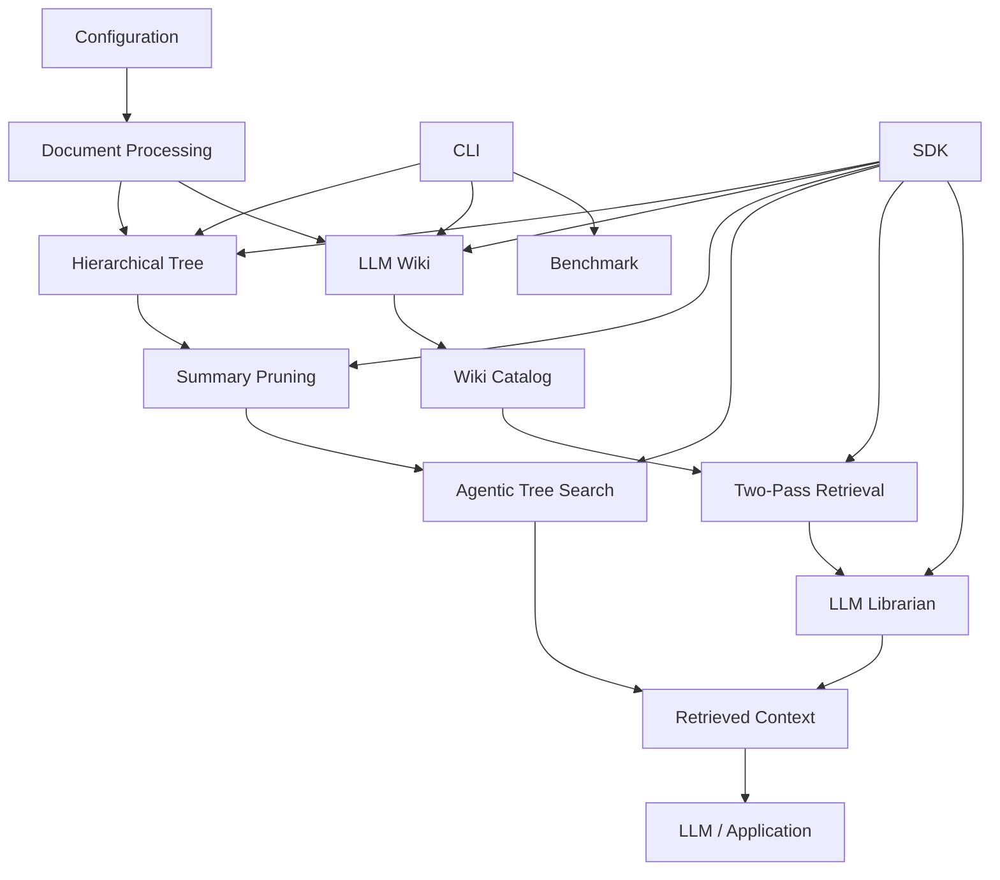

# Chapter 6 — Vector vs Vectorless Benchmark, CLI & SDK Exports

## 1. Chapter Goal

In the previous chapters, we built the major components of our Vectorless RAG architecture:

```text
Chapter 0
Configuration
    ↓
Chapter 1
Hierarchical Tree
    ↓
Chapter 2
Tree Builder
    ↓
Chapter 3
Tree Search
    ↓
Chapter 4
Wiki Vault
    ↓
Chapter 5
Two-Pass Retrieval
    ↓
LLM Librarian
```

Now we connect everything into a runnable application.

This chapter builds three final infrastructure components:

```text
src/comparison/VectorVsVectorlessBenchmark.js
src/cli.js
src/index.js
```

The goals are:

1. Build a benchmark comparing fixed chunking with hierarchical retrieval.
2. Build a multi-mode command-line interface.
3. Export the project as a reusable JavaScript SDK.
4. Perform end-to-end verification.

---

# 2. What Are We Benchmarking?

The benchmark compares two different retrieval representations.

### Fixed-Chunk Baseline

A simplified traditional RAG representation:

```text
Document
   ↓
Fixed-size chunks
   ↓
Independent chunks
   ↓
Potential retrieval
```

### Vectorless Tree Representation

Our hierarchical representation:

```text
Document
   ↓
Chapter
   ↓
Section
   ↓
Subsection
   ↓
Leaf content
```

The conceptual difference is:



The fixed-chunk approach prioritizes uniform chunk sizes.

The tree approach preserves the document's structural relationships.

---

# 3. Important Benchmark Disclaimer

This chapter does **not** implement a production vector database.

Instead, we create a controlled baseline using fixed-size character chunks.

Therefore:

```text
Vector RAG Benchmark
```

in this chapter really means:

> **A simplified fixed-chunk baseline representing the preprocessing style commonly used before embedding-based retrieval.**

We are not measuring:

* OpenAI embedding quality
* Qdrant similarity search
* Pinecone retrieval
* Weaviate retrieval
* ANN index performance
* embedding latency
* vector database throughput

Those would require a real vector retrieval implementation.

The goal here is to demonstrate the **structural difference between fixed chunks and hierarchical document navigation**.

---

# 4. Implementing the Benchmark Engine

## File Path

```text
src/comparison/VectorVsVectorlessBenchmark.js
```

The benchmark will:

1. create a sample document
2. split it into fixed-size character chunks
3. display the resulting fragmentation
4. build an equivalent hierarchical tree
5. perform tree search
6. display the navigation path and retrieved section

---

# 5. Complete Benchmark Implementation

```javascript id="w4k9x2"
import { TreeBuilder } from "../tree/TreeBuilder.js";
import { AgenticTreeSearchEngine } from "../search/AgenticTreeSearchEngine.js";

/**
 * Demonstrates the structural difference between:
 *
 * 1. Fixed-size chunking
 * 2. Hierarchical Vectorless RAG retrieval
 *
 * Note:
 * This is a conceptual benchmark, not a production
 * vector-database performance benchmark.
 */
export class VectorVsVectorlessBenchmark {
  /**
   * Split text into fixed-size character chunks.
   *
   * This intentionally simulates a simple chunking
   * baseline. It does NOT perform tokenization or
   * embedding generation.
   *
   * @param {string} rawText
   * @param {number} [chunkSize=150]
   * @returns {string[]}
   */
  static simulateFixedChunking(
    rawText,
    chunkSize = 150
  ) {
    if (
      typeof rawText !== "string"
    ) {
      throw new TypeError(
        "rawText must be a string."
      );
    }

    if (
      !Number.isInteger(chunkSize) ||
      chunkSize <= 0
    ) {
      throw new Error(
        "chunkSize must be a positive integer."
      );
    }

    const chunks = [];

    for (
      let i = 0;
      i < rawText.length;
      i += chunkSize
    ) {
      chunks.push(
        rawText.slice(
          i,
          i + chunkSize
        )
      );
    }

    return chunks;
  }

  /**
   * Build the sample hierarchical document
   * used by the Vectorless benchmark.
   *
   * @returns {import("../tree/HierarchicalTreeIndex.js").HierarchicalTreeIndex}
   */
  static buildSampleTree() {
    const sections = [
      {
        title:
          "Load Balancing Architectures",
        level: 1,
        pageStart: 1,
        pageEnd: 5,
        summary:
          "Load balancing architectures distribute traffic " +
          "across backend application instances and support " +
          "high availability.",
        keywords: [
          "load balancing",
          "high availability",
          "traffic",
          "backend"
        ],
        content:
          "The infrastructure uses content delivery " +
          "networks and application load balancers " +
          "to distribute traffic."
      },

      {
        title:
          "ALB Sticky Sessions",
        level: 2,
        pageStart: 3,
        pageEnd: 4,
        summary:
          "Application Load Balancers can use cookie-based " +
          "sticky sessions to maintain session affinity " +
          "between clients and backend targets.",
        keywords: [
          "alb",
          "sticky sessions",
          "cookies",
          "session"
        ],
        content:
          "The ALB employs cookie-based sticky sessions " +
          "for dynamic user session state preservation."
      },

      {
        title:
          "Sticky Session Failover",
        level: 3,
        pageStart: 4,
        pageEnd: 5,
        summary:
          "If the sticky target becomes unhealthy, traffic " +
          "can move to another healthy backend target and " +
          "the session can be re-established.",
        keywords: [
          "sticky sessions",
          "failover",
          "backend",
          "health",
          "session"
        ],
        content:
          "If session persistence fails or a target server " +
          "drops out, requests can be routed to another " +
          "healthy application instance."
      }
    ];

    return TreeBuilder
      .buildFromStructuredSections(
        "Infrastructure High Availability Guide",
        sections
      );
  }

  /**
   * Run the complete comparison.
   */
  static runBenchmark() {
    console.log(
      "\n" +
      "=".repeat(74)
    );

    console.log(
      "⚡ BENCHMARK: Fixed Chunking vs " +
      "Vectorless Hierarchical Tree Search"
    );

    console.log(
      "=".repeat(74)
    );

    const rawDocumentText =
      `Section 3.2: Load Balancing Architectures and High Availability.

The infrastructure employs two primary traffic distribution tiers: Content Delivery Networks (CDNs)
and Application Load Balancers (ALBs). High-volume static assets are served directly via edge node caching.

For dynamic user session state preservation across cluster nodes, the ALB employs cookie-based sticky sessions.
If session persistence fails or a target server drops out, requests automatically fallback to another healthy
application instance in the target group.`;

    // -------------------------------------------------------------
    // 1. Fixed-size chunking baseline
    // -------------------------------------------------------------

    console.log(
      "\n1️⃣ FIXED-CHUNK BASELINE " +
      "(150-character chunks):"
    );

    const chunks =
      this.simulateFixedChunking(
        rawDocumentText,
        150
      );

    chunks.forEach(
      (chunk, index) => {
        console.log(
          `\n--- [Chunk #${index + 1}] ---`
        );

        console.log(
          `"${chunk
            .trim()
            .replace(/\n/g, " ")}"`
        );
      }
    );

    console.log(
      "\n⚠️ Structural observation:"
    );

    console.log(
      "   • Fixed boundaries can split sentences."
    );

    console.log(
      "   • A chunk may lose its parent section context."
    );

    console.log(
      "   • The chunk itself does not explicitly encode " +
      "chapter → section → subsection lineage."
    );

    // -------------------------------------------------------------
    // 2. Vectorless hierarchical retrieval
    // -------------------------------------------------------------

    console.log(
      "\n2️⃣ VECTORLESS RAG " +
      "(Hierarchical Tree Navigation):"
    );

    const tree =
      this.buildSampleTree();

    console.log(
      "\n--- Document Tree ---"
    );

    tree.printTree();

    const searchEngine =
      new AgenticTreeSearchEngine(
        tree
      );

    const query =
      "What happens if sticky session persistence fails?";

    const result =
      searchEngine.search(
        query
      );

    console.log(
      "\n--- Vectorless Retrieval Result ---"
    );

    console.log(
      `Matched: ${result.matched}`
    );

    console.log(
      `Navigation Path: ` +
      `${result.traversalPath.join(" -> ")}`
    );

    console.log(
      `Target Section: ` +
      `${result.targetTitle}`
    );

    console.log(
      `Pages: ` +
      `${result.pageRange?.join("-")}`
    );

    console.log(
      "\n--- Retrieved Content ---"
    );

    console.log(
      result.retrievedContent
    );

    return {
      fixedChunkCount:
        chunks.length,

      vectorlessMatched:
        result.matched,

      vectorlessPath:
        result.traversalPath,

      vectorlessTarget:
        result.targetTitle,

      vectorlessPageRange:
        result.pageRange
    };
  }
}
```

---

# 6. Understanding the Benchmark Code

There are three major parts:

```text
VectorVsVectorlessBenchmark
        │
        ├── simulateFixedChunking()
        │
        ├── buildSampleTree()
        │
        └── runBenchmark()
```

Each has a different responsibility.

---

# 7. `simulateFixedChunking()`

The first method:

```javascript id="v0z5o3"
static simulateFixedChunking(
  rawText,
  chunkSize = 150
)
```

splits a document into fixed-size character ranges.

The important loop is:

```javascript id="l9w3u6"
for (
  let i = 0;
  i < rawText.length;
  i += chunkSize
) {
  chunks.push(
    rawText.slice(
      i,
      i + chunkSize
    )
  );
}
```

For example:

```text
Document = 450 characters
Chunk size = 150

       150        300        450
        ↓          ↓          ↓
| Chunk 1 | Chunk 2 | Chunk 3 |
```

The important point is that the boundaries are determined by character position rather than document structure.

---

# 8. Why This Can Cause Context Fragmentation

Suppose the source contains:

```text
Section 3.2: Load Balancing...

The ALB employs cookie-based sticky sessions.

If session persistence fails...
```

A fixed boundary might produce:

```text
Chunk 1:
Section 3.2: Load Balancing...

The ALB employs cookie-based

Chunk 2:
sticky sessions.

If session persistence fails...
```

The second chunk may still contain useful information, but the relationship to the parent section is no longer explicit.

This is one of the motivations for hierarchical indexing.

---

# 9. `buildSampleTree()`

The benchmark needs a document tree.

The original version attempted:

```javascript
TreeBuilder.buildSampleManualTree()
```

but our canonical `TreeBuilder` does not provide that method.

Instead, we use the API that Chapter 2 actually implemented:

```javascript
TreeBuilder.buildFromStructuredSections()
```

This is better because it demonstrates the real production path.

```text
Structured Sections
        ↓
TreeBuilder
        ↓
HierarchicalTreeIndex
```

---

# 10. The Hierarchical Structure

The benchmark creates:



Now the final content is not isolated.

The system knows:

```text
Document
 ↓
Load Balancing Architectures
 ↓
ALB Sticky Sessions
 ↓
Sticky Session Failover
```

That lineage is one of the central advantages of hierarchical retrieval.

---

# 11. Why Parent Summaries Matter

Notice the parent summaries:

```javascript id="l9k1y5"
summary:
  "Application Load Balancers can use cookie-based " +
  "sticky sessions..."
```

and:

```javascript id="f1g8d3"
keywords: [
  "alb",
  "sticky sessions",
  "cookies",
  "session"
]
```

This is important because Chapter 3's search engine performs top-down routing.

The system first evaluates:

```text
Root
 ↓
Load Balancing Architectures
 ↓
ALB Sticky Sessions
 ↓
Sticky Session Failover
```

Therefore high-level nodes need enough metadata to route the query toward the correct subtree.

---

# 12. Running the Vectorless Search

The benchmark creates:

```javascript id="q5g9de"
const searchEngine =
  new AgenticTreeSearchEngine(
    tree
  );
```

and searches:

```javascript id="j2o5vp"
const result =
  searchEngine.search(
    "What happens if sticky session persistence fails?"
  );
```

The result contains:

```javascript id="kq1p3a"
{
  matched,
  traversalPath,
  targetTitle,
  pageRange,
  retrievedContent
}
```

This gives us both the answer content and the navigation information used to reach it.

---

# 13. What We Actually Learn From This Benchmark

The benchmark should not claim:

> Vectorless RAG is always better than Vector RAG.

That would require a much larger controlled experiment.

Instead, this benchmark demonstrates a specific structural property:

### Fixed Chunking

```text
Text
 ↓
Fixed boundaries
 ↓
Independent chunks
```

### Hierarchical Retrieval

```text
Text
 ↓
Document structure
 ↓
Hierarchy
 ↓
Targeted navigation
```

Therefore the benchmark is primarily an **architecture demonstration**, not a statistical retrieval-quality benchmark.

---

# 14. Implementing the Multi-Mode CLI

## File Path

```text
src/cli.js
```

The CLI provides a simple way to execute different parts of the system.

We want:

```text
npm run tree-search
npm run llm-wiki
npm run benchmark
```

which map to:

```text
--mode=tree
--mode=wiki
--mode=benchmark
```

---

# 15. Complete `src/cli.js`

```javascript id="x6p2q9"
import { TreeBuilder } from "./tree/TreeBuilder.js";
import { AgenticTreeSearchEngine } from "./search/AgenticTreeSearchEngine.js";
import { LLMLibrarian } from "./wiki/LLMLibrarian.js";
import { TwoPassRetriever } from "./wiki/TwoPassRetriever.js";
import { VectorVsVectorlessBenchmark } from "./comparison/VectorVsVectorlessBenchmark.js";

/**
 * Parse --mode=<value> from command-line arguments.
 */
function getMode(args) {
  const modeArg =
    args.find(
      (argument) =>
        argument.startsWith("--mode=")
    );

  if (!modeArg) {
    return "all";
  }

  const [, mode] =
    modeArg.split("=");

  return mode || "all";
}

/**
 * Run the tree-search demonstration.
 */
function runTreeDemo() {
  console.log(
    "\n=== 🌳 DEMO 1: Vectorless RAG Tree Search ==="
  );

  const sections = [
    {
      title:
        "Load Balancing",
      level: 1,
      pageStart: 1,
      pageEnd: 5,
      summary:
        "Load balancing distributes traffic across " +
        "backend servers and supports sticky sessions.",
      keywords: [
        "load balancing",
        "backend",
        "sticky sessions"
      ],
      content:
        "Load balancers distribute requests across " +
        "healthy backend application servers."
    },

    {
      title:
        "Sticky Session Failover",
      level: 2,
      pageStart: 4,
      pageEnd: 5,
      summary:
        "Sticky sessions maintain client affinity and " +
        "can fail over to another healthy backend target.",
      keywords: [
        "sticky sessions",
        "failover",
        "backend",
        "session"
      ],
      content:
        "When a sticky backend target becomes unhealthy, " +
        "the request can be routed to another healthy target."
    }
  ];

  const tree =
    TreeBuilder
      .buildFromStructuredSections(
        "Infrastructure Guide",
        sections
      );

  console.log(
    "\n--- Document Tree ---"
  );

  tree.printTree();

  const searchEngine =
    new AgenticTreeSearchEngine(
      tree
    );

  const result =
    searchEngine.search(
      "How do sticky sessions handle backend failover?"
    );

  console.log(
    "\n--- Retrieved Content ---"
  );

  console.log(
    result.retrievedContent
  );
}

/**
 * Run the Wiki two-pass demonstration.
 */
async function runWikiDemo() {
  console.log(
    "\n=== 📚 DEMO 2: LLM Wiki Two-Pass Retrieval ==="
  );

  const vault =
    LLMLibrarian.buildSampleVault();

  const wikiRetriever =
    new TwoPassRetriever(
      vault
    );

  const result =
    wikiRetriever.searchAndRetrieve(
      "ALB sticky sessions cookies"
    );

  console.log(
    "\n--- Retrieved Wiki Documents ---"
  );

  for (
    const document
    of result.documents
  ) {
    console.log(
      `\n### ${document.title}`
    );

    console.log(
      document.content
    );
  }
}

/**
 * Run the benchmark demonstration.
 */
function runBenchmarkDemo() {
  console.log(
    "\n=== ⚡ DEMO 3: Fixed Chunking vs Vectorless Tree ==="
  );

  VectorVsVectorlessBenchmark
    .runBenchmark();
}

/**
 * Main CLI entry point.
 */
async function runCLI() {
  const args =
    process.argv.slice(2);

  const mode =
    getMode(args);

  const validModes = new Set([
    "all",
    "tree",
    "wiki",
    "benchmark"
  ]);

  if (!validModes.has(mode)) {
    console.error(
      `❌ Unknown mode: "${mode}".`
    );

    console.error(
      "Available modes: tree, wiki, benchmark, all."
    );

    process.exitCode = 1;

    return;
  }

  console.log(
    "=========================================================================="
  );

  console.log(
    "🚀 VECTORLESS RAG & LLM WIKI ENGINE"
  );

  console.log(
    "=========================================================================="
  );

  if (
    mode === "tree" ||
    mode === "all"
  ) {
    runTreeDemo();
  }

  if (
    mode === "wiki" ||
    mode === "all"
  ) {
    await runWikiDemo();
  }

  if (
    mode === "benchmark" ||
    mode === "all"
  ) {
    runBenchmarkDemo();
  }
}

runCLI().catch(
  (error) => {
    console.error(
      "\n❌ CLI Error:",
      error.message
    );

    process.exitCode = 1;
  }
);
```

---

# 16. Understanding the CLI

The CLI has four major responsibilities:

```text
CLI
 │
 ├── Parse mode
 │
 ├── Validate mode
 │
 ├── Run selected demo
 │
 └── Handle errors
```

This keeps the CLI separate from the underlying retrieval implementations.

---

# 17. Parsing `--mode`

The CLI receives arguments through:

```javascript id="y1t3s8"
process.argv.slice(2)
```

For:

```bash
node src/cli.js --mode=tree
```

Node gives us arguments similar to:

```text
[
  "--mode=tree"
]
```

We locate it with:

```javascript id="u8q2mz"
args.find(
  (argument) =>
    argument.startsWith("--mode=")
)
```

Then extract:

```text
tree
```

---

# 18. Why Validate the Mode?

Without validation, this command:

```bash
npm run tree-search -- --mode=abc
```

could silently do nothing.

Instead, we provide:

```text
❌ Unknown mode: "abc".

Available modes:
tree, wiki, benchmark, all.
```

This makes CLI errors easier to understand.

---

# 19. Why `runCLI()` Is Async

The function is:

```javascript id="a9j4v7"
async function runCLI()
```

because Wiki/LLM functionality may eventually require asynchronous operations.

For example:

```text
Wiki Retrieval
      ↓
OpenAI API
      ↓
LLM Synthesis
      ↓
Promise
```

Even though the current benchmark is mostly synchronous, designing the CLI around `async` prepares it for the actual LLM integration.

---

# 20. Running the Tree Demo

The tree mode:

```javascript id="o8m1z5"
runTreeDemo();
```

builds a document using:

```javascript id="n7y6e3"
TreeBuilder
```

then searches it using:

```javascript id="h5q0p4"
AgenticTreeSearchEngine
```

The flow is:



---

# 21. Running the Wiki Demo

The Wiki mode uses:

```javascript id="s0d8h3"
LLMLibrarian.buildSampleVault()
```

and:

```javascript id="c8r4v6"
new TwoPassRetriever(vault)
```

The flow is:



The CLI then prints the retrieved document content.

---

# 22. Running the Benchmark Demo

The benchmark mode simply delegates to:

```javascript id="d5y7s2"
VectorVsVectorlessBenchmark
  .runBenchmark();
```

This is good separation of responsibility.

The CLI should not contain benchmark logic.

It only decides:

> Which component should run?

---

# 23. Application Entry Point and SDK Exports

## File Path

```text
src/index.js
```

There are two different concepts we should keep separate:

### CLI

Used by humans:

```bash
npm run benchmark
```

### SDK

Used by JavaScript applications:

```javascript
import {
  TreeBuilder,
  WikiVault,
  TwoPassRetriever
} from "./src/index.js";
```

Therefore `src/index.js` should primarily be the **public API surface**.

---

# 24. Complete `src/index.js`

```javascript id="k2p8w4"
export { config } from "./config.js";

export {
  TreeNode
} from "./tree/TreeNode.js";

export {
  HierarchicalTreeIndex
} from "./tree/HierarchicalTreeIndex.js";

export {
  TreeBuilder
} from "./tree/TreeBuilder.js";

export {
  SummaryPruner
} from "./search/SummaryPruner.js";

export {
  AgenticTreeSearchEngine
} from "./search/AgenticTreeSearchEngine.js";

export {
  WikiFileEntry,
  WikiVault
} from "./wiki/WikiVault.js";

export {
  TwoPassRetriever
} from "./wiki/TwoPassRetriever.js";

export {
  LLMLibrarian
} from "./wiki/LLMLibrarian.js";

export {
  VectorVsVectorlessBenchmark
} from "./comparison/VectorVsVectorlessBenchmark.js";
```

---

# 25. Why We Don't Automatically Start the CLI From `index.js`

The earlier version contained:

```javascript
if (
  process.argv[1] &&
  process.argv[1].endsWith("index.js")
) {
  import("./cli.js");
}
```

This creates an unnecessary side effect.

Imagine another application does:

```javascript
import {
  TreeBuilder
} from "vectorless-rag";
```

It should receive the SDK exports.

It should **not accidentally start the CLI**.

Therefore:

```text
src/index.js
     ↓
Public SDK exports

src/cli.js
     ↓
Command-line application
```

are kept separate.

This is a cleaner package architecture.

---

# 26. SDK Usage

Once exported, another application can use the project like:

```javascript id="s3p9q1"
import {
  TreeBuilder,
  AgenticTreeSearchEngine
} from "./src/index.js";

const tree =
  TreeBuilder.buildFromStructuredSections(
    "System Guide",
    [
      {
        title: "Authentication",
        level: 1,
        pageStart: 1,
        pageEnd: 5,
        summary:
          "Authentication and session management.",
        keywords: [
          "authentication",
          "session"
        ],
        content:
          "Authentication uses secure sessions."
      }
    ]
  );

const engine =
  new AgenticTreeSearchEngine(
    tree
  );

const result =
  engine.search(
    "How does authentication work?"
  );

console.log(
  result.retrievedContent
);
```

This demonstrates that our project is no longer just a collection of scripts.

It now exposes reusable modules.

---

# 27. Package Architecture

The project now has a clean separation:



---

# 28. End-to-End Architecture

We can now visualize the complete project:



This represents the architecture we've built across Chapters 0–6.

---

# 29. Updating `package.json`

Our Chapter 0 scripts already map to the CLI:

```json
{
  "scripts": {
    "start": "node src/index.js",
    "cli": "node src/cli.js",
    "tree-search": "node src/cli.js --mode=tree",
    "llm-wiki": "node src/cli.js --mode=wiki",
    "benchmark": "node src/cli.js --mode=benchmark"
  }
}
```

However, because `src/index.js` is now an SDK entry point rather than an application runner, the `start` script should preferably point to the CLI:

```json id="z5n1c8"
{
  "scripts": {
    "start": "node src/cli.js",
    "cli": "node src/cli.js",
    "tree-search": "node src/cli.js --mode=tree",
    "llm-wiki": "node src/cli.js --mode=wiki",
    "benchmark": "node src/cli.js --mode=benchmark"
  }
}
```

This keeps the semantics clear:

```text
npm start
    ↓
CLI application

src/index.js
    ↓
SDK/public API
```

---

# 30. Verification

We should test each operational mode independently.

## Test 1 — Tree Search

```bash
npm run tree-search
```

Expected behavior:

```text
🚀 VECTORLESS RAG & LLM WIKI ENGINE

=== 🌳 DEMO 1: Vectorless RAG Tree Search ===

--- Document Tree ---

[root] Infrastructure Guide
└── [l1-load-balancing-...] Load Balancing
    └── [l2-sticky-session-...] Sticky Session Failover

...

--- Retrieved Content ---

When a sticky backend target becomes unhealthy...
```

The exact generated node IDs depend on `TreeBuilder.createNodeId()`.

---

# 31. Test 2 — Wiki Retrieval

Run:

```bash
npm run llm-wiki
```

Expected behavior:

```text
=== 📚 DEMO 2: LLM Wiki Two-Pass Retrieval ===

⚡ [PASS 1] Searching Wiki catalog metadata...

   • Application Load Balancer (ALB) Sticky Sessions & Cookies
     ...

📖 [PASS 2] Loading full Markdown content...

--- Retrieved Wiki Documents ---

### Application Load Balancer (ALB) Sticky Sessions & Cookies

# ALB Sticky Sessions Architecture Guide

...
```

This confirms that:

```text
Pass 1
 ↓
metadata

Pass 2
 ↓
full Markdown
```

is functioning.

---

# 32. Test 3 — Benchmark

Run:

```bash
npm run benchmark
```

The output should show both representations.

```text
=== ⚡ DEMO 3: Fixed Chunking vs Vectorless Tree ===

1️⃣ FIXED-CHUNK BASELINE
--- [Chunk #1] ---
...

--- [Chunk #2] ---
...

2️⃣ VECTORLESS RAG
--- Document Tree ---
...

--- Vectorless Retrieval Result ---
Matched: true
Navigation Path: ...
Target Section: Sticky Session Failover
Pages: 4-5
```

The important verification is that the tree search reaches the intended leaf.

---

# 33. Test 4 — SDK Exports

Run:

```bash
node --input-type=module -e "
import {
  TreeNode,
  HierarchicalTreeIndex,
  TreeBuilder,
  SummaryPruner,
  AgenticTreeSearchEngine,
  WikiFileEntry,
  WikiVault,
  TwoPassRetriever,
  LLMLibrarian,
  VectorVsVectorlessBenchmark
} from './src/index.js';

console.log('SDK exports loaded successfully.');
console.log('TreeNode:', typeof TreeNode);
console.log('TreeBuilder:', typeof TreeBuilder);
console.log('WikiVault:', typeof WikiVault);
console.log(
  'TwoPassRetriever:',
  typeof TwoPassRetriever
);
console.log(
  'LLMLibrarian:',
  typeof LLMLibrarian
);
console.log(
  'Benchmark:',
  typeof VectorVsVectorlessBenchmark
);
"
```

Expected:

```text
SDK exports loaded successfully.
TreeNode: function
TreeBuilder: function
WikiVault: function
TwoPassRetriever: function
LLMLibrarian: function
Benchmark: function
```

This verifies that the package-level API can be imported without starting the CLI.

---

# 34. Test 5 — Run Everything

To run all demonstrations:

```bash
node src/cli.js
```

Because the default mode is:

```text
all
```

the CLI executes:

```text
Tree Search
     ↓
Wiki Retrieval
     ↓
Benchmark
```

The architecture becomes:



---

# 35. What We Have Built

At this point, the project contains:

```text
src/
├── config.js
│
├── tree/
│   ├── TreeNode.js
│   ├── HierarchicalTreeIndex.js
│   └── TreeBuilder.js
│
├── search/
│   ├── SummaryPruner.js
│   └── AgenticTreeSearchEngine.js
│
├── wiki/
│   ├── WikiVault.js
│   ├── TwoPassRetriever.js
│   └── LLMLibrarian.js
│
├── comparison/
│   └── VectorVsVectorlessBenchmark.js
│
├── cli.js
└── index.js
```

Each module has a specific responsibility.

---

# 36. Responsibility Map

| Module                           | Responsibility                        |
| -------------------------------- | ------------------------------------- |
| `config.js`                      | Centralized configuration             |
| `TreeNode.js`                    | Individual hierarchy node             |
| `HierarchicalTreeIndex.js`       | Tree indexing and traversal           |
| `TreeBuilder.js`                 | Build trees from structured documents |
| `SummaryPruner.js`               | Lightweight relevance scoring         |
| `AgenticTreeSearchEngine.js`     | Top-down tree navigation              |
| `WikiFileEntry`                  | Individual Wiki page model            |
| `WikiVault.js`                   | Wiki catalog management               |
| `TwoPassRetriever.js`            | Metadata → content retrieval          |
| `LLMLibrarian.js`                | Retrieval orchestration and synthesis |
| `VectorVsVectorlessBenchmark.js` | Structural retrieval comparison       |
| `cli.js`                         | Command-line execution                |
| `index.js`                       | Public SDK exports                    |

This separation is important because each component can evolve independently.

---

# 37. Vectorless RAG Architecture We've Built

The complete retrieval pipeline can now be summarized as:



The key idea is that retrieval does not depend exclusively on vector similarity.

Instead, it can use:

```text
Hierarchy
Tags
Summaries
Keywords
Categories
Explicit Wiki links
Document paths
Page ranges
```

---

# 38. What "Vectorless" Means in This Project

Vectorless does **not** mean:

> "AI cannot use embeddings."

It means:

> **The primary retrieval architecture can operate using explicit structure and metadata without requiring vector similarity as its core navigation mechanism.**

This gives us a transparent retrieval path:

```text
Query
 ↓
Metadata
 ↓
Hierarchy
 ↓
Selected Section
 ↓
Source Content
```

Every step can be inspected.

---

# 39. Current System Limitations

This implementation is still a learning/prototype architecture.

Important limitations include:

### 1. Lexical Scoring

`SummaryPruner` currently uses text matching rather than deep semantic understanding.

### 2. In-Memory Wiki

`WikiVault` currently stores entries in a `Map`.

### 3. Deterministic Librarian

Without an injected synthesizer, `LLMLibrarian` returns deterministic content rather than generating a real LLM answer.

### 4. Simplified Benchmark

The benchmark uses fixed character chunks rather than a real embedding/vector database.

### 5. No Persistent Document Parser

PDF, DOCX, HTML and OCR ingestion are not yet implemented.

### 6. Limited Cross-Reference Handling

`[[WikiPage]]` references have been designed conceptually but are not yet fully resolved into a graph.

These are deliberate future extension points.

---

# 40. Production Evolution

A production-grade version could evolve toward:



At that point, the system could support much more sophisticated agentic retrieval while preserving the transparent architecture we've built.

---

# 41. Chapter 6 Summary

This chapter turned our individual components into a runnable system.

We built:

### Benchmark Engine

```text
VectorVsVectorlessBenchmark
```

which demonstrates the difference between fixed-size character chunking and hierarchical tree retrieval.

### Multi-Mode CLI

```text
src/cli.js
```

which provides:

```bash
npm run tree-search
npm run llm-wiki
npm run benchmark
```

### SDK Entry Point

```text
src/index.js
```

which exposes the project's reusable classes.

---

# 42. Final Architecture

The complete project can now be understood as:



---

# 43. What We Have Achieved

Across Chapters 0–6, we have implemented a complete educational Vectorless RAG framework containing:

* centralized configuration
* hierarchical document representation
* automatic tree construction
* metadata-based summary pruning
* top-down agentic tree search
* human-readable Wiki pages
* Wiki metadata catalog
* two-pass retrieval
* LLM Librarian orchestration
* fixed-chunk comparison baseline
* multi-mode CLI
* reusable SDK exports

The system is now runnable from the command line and reusable from another JavaScript application.

---

# 44. Final Project Commands

### Tree Search

```bash
npm run tree-search
```

### LLM Wiki

```bash
npm run llm-wiki
```

### Benchmark

```bash
npm run benchmark
```

### All demonstrations

```bash
npm run cli
```

### SDK

```javascript
import {
  TreeBuilder,
  AgenticTreeSearchEngine,
  WikiVault,
  TwoPassRetriever,
  LLMLibrarian
} from "./src/index.js";
```

---

# 45. Conclusion

🎉 **Congratulations!**

You have now built the core architecture of a **Vectorless RAG + LLM Wiki system** in Node.js.

The project demonstrates an alternative to treating documents as nothing more than independent embedding chunks.

Instead, knowledge can be represented through:

```text
Document Structure
        +
Metadata
        +
Hierarchical Navigation
        +
Human-Readable Wiki Pages
        +
Explicit References
```

The central philosophy is:

> **Structure the knowledge first, navigate it intelligently, and retrieve only the context that is actually needed.**

This gives us a transparent foundation for building more advanced retrieval systems.

The next stage is no longer simply adding another class. It is improving the intelligence of the system itself—especially:

```text
LLM-powered query understanding
        ↓
LLM-assisted tree navigation
        ↓
Wiki cross-reference traversal
        ↓
Multi-document reasoning
        ↓
Evidence-aware answer synthesis
        ↓
Evaluation and observability
```

That is where the prototype can begin evolving into a genuinely production-oriented **agentic Vectorless RAG system**.

One especially important correction is the benchmark terminology: **the current Chapter 6 does not prove that Vectorless RAG beats vector RAG**. It demonstrates why hierarchical structure preserves information differently from fixed character chunking. A real performance comparison would be a later evaluation chapter with a shared dataset, queries, ground-truth answers, retrieval metrics, latency, and—if desired—an actual embedding/vector baseline.
