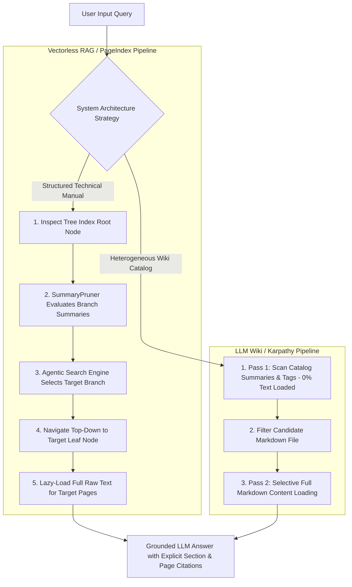
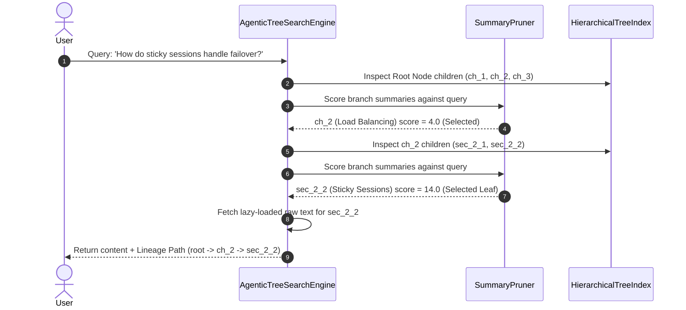

# 🚀 Vectorless RAG & LLM Wiki Engine (`vectorless-rag01`): Exhaustive Implementation Guide

Welcome to the exhaustive implementation guide for **`vectorless-rag01`** under [`week03/learning/day06/code/vectorless-rag01/`](file:///home/aminul/development/gen-ai-cohort/week03/learning/day06/code/vectorless-rag01/).

This repository contains a full production JavaScript / Node.js implementation of:
1. **PageIndex Model (Vectorless RAG)** — Hierarchical Document Tree Indexing & AlphaGo-inspired Agentic Tree Traversal.
2. **LLM Wiki Model (Andrej Karpathy Architecture)** — Human-readable Markdown knowledge vault management & **Two-Pass Retrieval Strategy** (summary scan + selective lazy loading).
3. **Vector vs. Vectorless Benchmark** — Side-by-side demonstration proving how fixed-size token chunking destroys document hierarchy compared to tree-based reasoning retrieval.

---

## 📌 Architectural Overview & Master Flowchart



---

## 📁 Directory Structure & Component Mapping

```text
week03/learning/day06/code/vectorless-rag01/
├── package.json               # Node.js project manifest & execution scripts
├── .env.example               # Environment variables blueprint
├── implementation.md          # Exhaustive code walkthrough & developer guide (this file)
└── src/
    ├── config.js              # Centralized zero-dependency configuration module
    ├── tree/
    │   ├── TreeNode.js        # Core tree node data structure (PageIndex model)
    │   ├── HierarchicalTreeIndex.js # Tree hierarchy manager, Map indexer & JSON serializer
    │   └── TreeBuilder.js     # Factory builder for document hierarchy trees
    ├── search/
    │   ├── SummaryPruner.js   # Evaluates node summaries & prunes irrelevant branches
    │   └── AgenticTreeSearchEngine.js # Top-down MCTS-inspired decision tree traversal engine
    ├── wiki/
    │   ├── WikiVault.js       # Markdown knowledge vault & file entry catalog
    │   ├── TwoPassRetriever.js # Karpathy Two-Pass retrieval algorithm implementation
    │   └── LLMLibrarian.js    # Background librarian builder for human-readable notes
    ├── comparison/
    │   └── VectorVsVectorlessBenchmark.js # Side-by-side Vector vs Vectorless RAG benchmark
    ├── cli.js                 # Interactive multi-mode CLI driver
    └── index.js               # Programmatic entry point
```

---

## 🔍 Exhaustive File-by-File Code Walkthrough

---

### 1. Configuration Layer

#### 📄 [`src/config.js`](file:///home/aminul/development/gen-ai-cohort/week03/learning/day06/code/vectorless-rag01/src/config.js)
- **Purpose**: Parses environment variables safely with zero external dependencies.
- **Key Features**:
  - `loadEnv()` reads `.env` manually if present, avoiding missing package runtime crashes.
  - Exports default system settings (`maxTreeDepth`, `pruningThreshold`, API keys).
- **Code Breakdown**:
  ```javascript
  export const config = {
    env: process.env.NODE_ENV || "development",
    maxTreeDepth: Number(process.env.DEFAULT_MAX_TREE_DEPTH) || 3,
    pruningThreshold: Number(process.env.SUMMARY_PRUNING_THRESHOLD) || 1.5
  };
  ```

---

### 2. Document Tree Indexing Layer (PageIndex Model)

#### 📄 [`src/tree/TreeNode.js`](file:///home/aminul/development/gen-ai-cohort/week03/learning/day06/code/vectorless-rag01/src/tree/TreeNode.js)
- **Purpose**: Represents an individual node in the document tree hierarchy.
- **Key Parameters**:
  - `nodeId`: Unique string identifier (e.g. `'ch_2'`, `'sec_2_2'`).
  - `title`: Human-readable heading title.
  - `level`: Hierarchy depth (0 = Root, 1 = Chapter, 2 = Section).
  - `pageRange`: `[startPage, endPage]` array specifying exact document location.
  - `summary`: Compact semantic abstract generated by LLM during indexing.
  - `content`: Raw text content (lazy-loaded ONLY when reaching leaf node).
- **Core Methods**:
  - `addChild(childNode)`: Binds parent pointer and appends to `this.children`.
  - `isLeaf()`: Returns `true` if node has no child branches.
  - `toMetadataJSON(includeContent)`: Serializes lightweight node payload for storage without bloating index memory with raw text.

---

#### 📄 [`src/tree/HierarchicalTreeIndex.js`](file:///home/aminul/development/gen-ai-cohort/week03/learning/day06/code/vectorless-rag01/src/tree/HierarchicalTreeIndex.js)
- **Purpose**: Manages the complete document tree structure, providing $O(1)$ node lookup and visual tree printing.
- **Key Methods**:
  - `_indexSubtree(node)`: Recursively builds a `Map<string, TreeNode>` lookup index.
  - `getLineagePath(nodeId)`: Traces ancestor pointers from target node back to root (`Root -> Ch 2 -> Sec 2.2`).
  - `printTree(node, indent)`: Renders visual ASCII tree hierarchy in terminal.
  - `exportToJSON()` & `importFromJSON(json)`: Enables serializing the entire tree index to disk or database.

---

#### 📄 [`src/tree/TreeBuilder.js`](file:///home/aminul/development/gen-ai-cohort/week03/learning/day06/code/vectorless-rag01/src/tree/TreeBuilder.js)
- **Purpose**: Factory builder that parses document headings and section content into a `HierarchicalTreeIndex`.
- **Sample Document Hierarchy**:
  ```text
  [root] Distributed Systems Architecture Manual v2.0 (pp. 1-500)
    ├── [ch_1] Chapter 1: Networking & Edge Routing Architecture (pp. 1-120)
    ├── [ch_2] Chapter 2: Load Balancing & Traffic Distribution (pp. 121-250)
    │     ├── [sec_2_1] Section 2.1: CDN Edge Static Asset Caching (pp. 121-160)
    │     └── [sec_2_2] Section 2.2: Session Persistence & Sticky Sessions (pp. 161-250)
    └── [ch_3] Chapter 3: Distributed Database Replication (pp. 251-500)
  ```

---

### 3. Agentic Search & Traversal Layer

#### 📄 [`src/search/SummaryPruner.js`](file:///home/aminul/development/gen-ai-cohort/week03/learning/day06/code/vectorless-rag01/src/search/SummaryPruner.js)
- **Purpose**: Evaluates candidate node summaries against user query terms to prune irrelevant document branches before deep traversal.
- **Key Methods**:
  - `calculateRelevanceScore(query, node)`: Computes semantic relevance score based on summary, title, keywords, and entity alignment.
  - `pruneNodes(query, candidateNodes, threshold)`: Filters out candidate nodes falling below score threshold (default `1.5`).

---

#### 📄 [`src/search/AgenticTreeSearchEngine.js`](file:///home/aminul/development/gen-ai-cohort/week03/learning/day06/code/vectorless-rag01/src/search/AgenticTreeSearchEngine.js)
- **Purpose**: Executes Top-Down LLM-style decision tree traversal without vector embeddings.
- **Traversal Flow**:
  1. Starts at `treeIndex.root`.
  2. Inspects child branches under current node.
  3. Evaluates branch summaries using `SummaryPruner`.
  4. Selects highest-scoring branch and navigates down.
  5. Repeat until reaching leaf node.
  6. Returns explicit lineage path and lazy-loaded raw section text.



---

### 4. LLM Wiki Architecture Layer (Andrej Karpathy Model)

#### 📄 [`src/wiki/WikiVault.js`](file:///home/aminul/development/gen-ai-cohort/week03/learning/day06/code/vectorless-rag01/src/wiki/WikiVault.js)
- **Purpose**: Manages human-readable Markdown wiki document entries.
- **Classes**:
  - `WikiFileEntry`: Encapsulates file path, title, category, tags, high-level summary, and raw Markdown text.
  - `WikiVault`: Storage vault providing `listCatalogMetadata()` for Pass 1 scans and `readFileContent(filePath)` for Pass 2 lazy loading.

---

#### 📄 [`src/wiki/TwoPassRetriever.js`](file:///home/aminul/development/gen-ai-cohort/week03/learning/day06/code/vectorless-rag01/src/wiki/TwoPassRetriever.js)
- **Purpose**: Implements Karpathy's Two-Pass Retrieval Algorithm.
- **Two-Pass Algorithm**:
  - **PASS 1 (Summary & Tag Scan)**: Scans catalog titles, category tags, and summaries across ALL files in the vault. Zero raw file content is loaded into memory or prompt context.
  - **PASS 2 (Selective Loading)**: Lazy-loads full raw Markdown text ONLY for candidate files selected in Pass 1.

---

#### 📄 [`src/wiki/LLMLibrarian.js`](file:///home/aminul/development/gen-ai-cohort/week03/learning/day06/code/vectorless-rag01/src/wiki/LLMLibrarian.js)
- **Purpose**: Simulates background LLM librarian populating the catalog vault with structured Markdown documents.

---

### 5. Benchmark & CLI Execution Layer

#### 📄 [`src/comparison/VectorVsVectorlessBenchmark.js`](file:///home/aminul/development/gen-ai-cohort/week03/learning/day06/code/vectorless-rag01/src/comparison/VectorVsVectorlessBenchmark.js)
- **Purpose**: Runs side-by-side comparison demonstrating how fixed 150-char token chunking breaks section headers and fragment context, whereas Vectorless Tree Search retains 100% full section lineage.

---

#### 📄 [`src/cli.js`](file:///home/aminul/development/gen-ai-cohort/week03/learning/day06/code/vectorless-rag01/src/cli.js)
- **Purpose**: CLI driver accepting `--mode=tree`, `--mode=wiki`, or `--mode=benchmark`.

---

## ⚡ Execution Commands

Run commands from directory [`week03/learning/day06/code/vectorless-rag01/`](file:///home/aminul/development/gen-ai-cohort/week03/learning/day06/code/vectorless-rag01/):

```bash
# Run all demonstrations (Tree Search + LLM Wiki + Benchmark)
npm start

# Run interactive CLI driver
npm run cli

# Run ONLY Vectorless RAG Tree Search (PageIndex Model)
npm run tree-search

# Run ONLY LLM Wiki Two-Pass Retrieval (Karpathy Model)
npm run llm-wiki

# Run Vector RAG vs Vectorless RAG Comparison Benchmark
npm run benchmark
```
