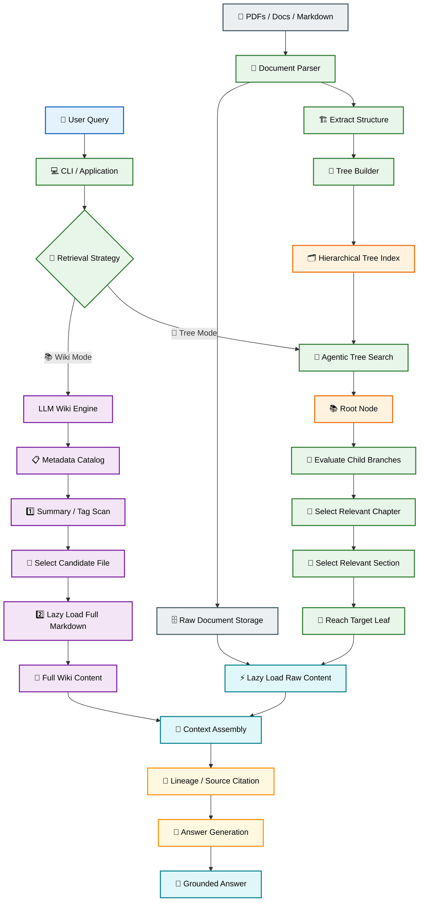
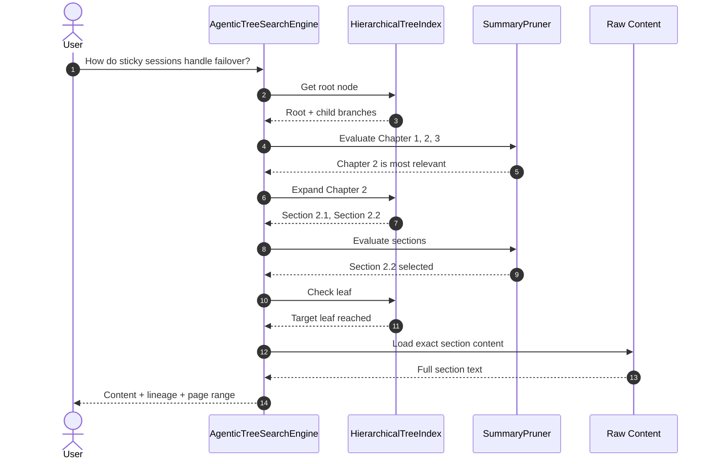
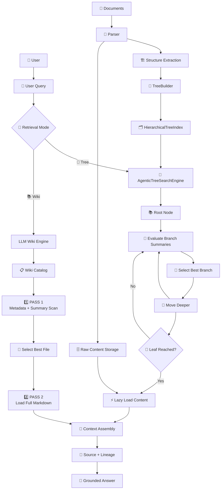

# 🚀 Vectorless RAG & LLM Wiki Engine (`vectorless-rag01`)

## Complete Code Explanation & Implementation Guide

Welcome to the **complete implementation guide** for `vectorless-rag01`.

This guide is written so that **even someone seeing the project for the first time can understand the architecture, data flow, every important file, class, method, and how the complete system works together**.

The project demonstrates three important ideas:

1. 🌳 **Vectorless RAG / PageIndex** — hierarchical document indexing + agentic tree traversal.
2. 📚 **LLM Wiki / Karpathy-style architecture** — structured Markdown knowledge + two-pass retrieval.
3. ⚖️ **Vector RAG vs Vectorless RAG** — a practical comparison showing why document structure can matter during retrieval.

---

# 📑 Table of Contents

1. [What Are We Building?](#1-what-are-we-building)
2. [The Core Problem With Traditional Vector RAG](#2-the-core-problem-with-traditional-vector-rag)
3. [How Vectorless RAG Solves It](#3-how-vectorless-rag-solves-it)
4. [Complete System Architecture](#4-complete-system-architecture)
5. [Project Structure](#5-project-structure)
6. [Configuration Layer](#6-configuration-layer)
7. [Document Tree Layer](#7-document-tree-layer)
8. [Tree Node](#8-tree-node)
9. [Hierarchical Tree Index](#9-hierarchical-tree-index)
10. [Tree Builder](#10-tree-builder)
11. [Agentic Search Layer](#11-agentic-search-layer)
12. [Summary Pruner](#12-summary-pruner)
13. [Agentic Tree Search Engine](#13-agentic-tree-search-engine)
14. [Complete Tree Search Flow](#14-complete-tree-search-flow)
15. [LLM Wiki Architecture](#15-llm-wiki-architecture)
16. [WikiVault](#16-wikivault)
17. [Two-Pass Retrieval](#17-two-pass-retrieval)
18. [LLM Librarian](#18-llm-librarian)
19. [Vector vs Vectorless Benchmark](#19-vector-vs-vectorless-benchmark)
20. [CLI Layer](#20-cli-layer)
21. [Application Entry Point](#21-application-entry-point)
22. [Complete End-to-End Flow](#22-complete-end-to-end-flow)
23. [Execution Commands](#23-execution-commands)
24. [What Happens Internally](#24-what-happens-internally)
25. [Important Design Decisions](#25-important-design-decisions)
26. [Key Takeaways](#26-key-takeaways)

---

# 1. 🎯 What Are We Building?

Traditional RAG usually looks like:

```text
Document
   ↓
Chunk
   ↓
Embedding
   ↓
Vector Database
   ↓
Similarity Search
   ↓
Top-K Chunks
   ↓
LLM
   ↓
Answer
```

This project explores a different approach.

Instead of asking:

> "Which chunks are mathematically closest to my query?"

we ask:

> "Where in the document hierarchy should I look?"

For example:

```text
📚 Distributed Systems Manual
│
├── 📖 Chapter 1: Networking
│
├── 📖 Chapter 2: Load Balancing
│   │
│   ├── 📑 Section 2.1: CDN
│   │
│   └── 📑 Section 2.2: Sticky Sessions
│       │
│       ├── 📄 2.2.1 Cookie Architecture
│       ├── 📄 2.2.2 Failover
│       └── 📄 2.2.3 Recovery
│
└── 📖 Chapter 3: Databases
```

If the user asks:

> **"How do sticky sessions handle failover?"**

the system can navigate:

```text
Root
 ↓
Chapter 2
 ↓
Section 2.2
 ↓
Subsection 2.2.2
 ↓
Target Pages
```

rather than searching thousands of independent chunks.

---

# 2. ⚠️ The Core Problem With Traditional Vector RAG

A traditional Vector RAG pipeline often breaks documents into arbitrary pieces:

```text
Document
    ↓
500-token chunk
    ↓
500-token chunk
    ↓
500-token chunk
    ↓
...
```

The problem is that document structure may be destroyed.

For example:

```text
Chapter 2
  ↓
Section 2.2
  ↓
Sticky Sessions
  ↓
Failover Behavior
```

could become:

```text
Chunk A:
"Sticky sessions use encrypted cookies..."

Chunk B:
"This mechanism is used during failover..."

Chunk C:
"During server failure..."
```

The retrieved chunk may no longer know:

* Which chapter it belongs to
* Which section it belongs to
* What "this mechanism" refers to
* Whether the statement is a requirement, exception, or conclusion

Vectorless RAG keeps that hierarchy.

---

# 3. 🌳 How Vectorless RAG Solves It

The document becomes a tree.

```text
                    📚 Document
                        │
          ┌─────────────┼─────────────┐
          ↓             ↓             ↓
      Chapter 1     Chapter 2     Chapter 3
                        │
                  ┌─────┴─────┐
                  ↓           ↓
              Section 2.1  Section 2.2
                                │
                         ┌──────┼──────┐
                         ↓      ↓      ↓
                       2.2.1  2.2.2  2.2.3
                                │
                                ↓
                           Target Pages
```

The search engine then navigates the tree.

---

# 4. 🏗️ Complete System Architecture



---

# 5. 📁 Project Structure

```text
vectorless-rag01/
│
├── package.json
├── .env.example
├── implementation.md
│
└── src/
    │
    ├── config.js
    │
    ├── tree/
    │   ├── TreeNode.js
    │   ├── HierarchicalTreeIndex.js
    │   └── TreeBuilder.js
    │
    ├── search/
    │   ├── SummaryPruner.js
    │   └── AgenticTreeSearchEngine.js
    │
    ├── wiki/
    │   ├── WikiVault.js
    │   ├── TwoPassRetriever.js
    │   └── LLMLibrarian.js
    │
    ├── comparison/
    │   └── VectorVsVectorlessBenchmark.js
    │
    ├── cli.js
    └── index.js
```

Think of the project as six layers:

```text
Configuration
     ↓
Tree / Knowledge Representation
     ↓
Retrieval
     ↓
Wiki Retrieval
     ↓
Benchmark
     ↓
CLI / Application
```

---

# 6. ⚙️ Configuration Layer

## `src/config.js`

This file contains application configuration.

Its job is to provide a single place for settings such as:

```javascript
export const config = {
    env: process.env.NODE_ENV || "development",

    maxTreeDepth:
        Number(process.env.DEFAULT_MAX_TREE_DEPTH) || 3,

    pruningThreshold:
        Number(process.env.SUMMARY_PRUNING_THRESHOLD) || 1.5
};
```

### Why have a configuration layer?

Instead of writing:

```javascript
if (depth > 3)
```

throughout the application, we can write:

```javascript
if (depth > config.maxTreeDepth)
```

Now the value can be changed from the environment.

Example:

```env
DEFAULT_MAX_TREE_DEPTH=4
SUMMARY_PRUNING_THRESHOLD=2
```

---

# 7. 🌳 Document Tree Layer

The tree layer is the foundation of Vectorless RAG.

It consists of:

```text
TreeNode
    ↓
HierarchicalTreeIndex
    ↓
TreeBuilder
```

Each component has a different responsibility.

| Component               | Responsibility                 |
| ----------------------- | ------------------------------ |
| `TreeNode`              | Represents one document node   |
| `HierarchicalTreeIndex` | Manages the complete tree      |
| `TreeBuilder`           | Creates the document hierarchy |

---

# 8. 🌿 TreeNode

## `src/tree/TreeNode.js`

A `TreeNode` represents one part of a document.

For example:

```text
Chapter 2
```

or:

```text
Section 2.2: Sticky Sessions
```

A node contains information such as:

```javascript
{
    nodeId,
    title,
    level,
    pageRange,
    summary,
    keywords,
    entities,
    content,
    children,
    parent
}
```

### Important properties

#### `nodeId`

Unique identifier.

```text
root
ch_1
ch_2
sec_2_2
```

#### `title`

Human-readable name.

```text
Chapter 2: Load Balancing
```

#### `level`

Represents hierarchy depth.

```text
0 → Root
1 → Chapter
2 → Section
3 → Subsection
```

#### `pageRange`

Tells us where the content exists.

```javascript
[161, 250]
```

#### `summary`

A lightweight description used during retrieval.

Example:

```text
Explains cookie-based sticky sessions and failover behavior.
```

#### `content`

The actual raw document content.

This is deliberately kept separate from lightweight metadata because the search process should not load everything unnecessarily.

---

## `addChild()`

When we write:

```javascript
ch2.addChild(sec22);
```

the relationship becomes:

```text
Chapter 2
    ↓
Section 2.2
```

The parent-child relationship is therefore preserved.

---

## `isLeaf()`

A leaf is a node that has no children.

```text
Section
   ↓
Subsection
   ↓
📄 Leaf
```

The leaf is usually where we finally fetch the actual content.

---

## `toMetadataJSON()`

This converts a node into lightweight metadata.

For example:

```json
{
  "nodeId": "sec_2_2",
  "title": "Sticky Sessions",
  "pageRange": [161, 250],
  "summary": "Cookie-based session persistence..."
}
```

The important idea is:

> **Search metadata first, load heavy content later.**

---

# 9. 🗂️ HierarchicalTreeIndex

## `src/tree/HierarchicalTreeIndex.js`

This class manages the entire document tree.

It provides operations such as:

```text
Add / index nodes
Find nodes
Trace lineage
Print tree
Export tree
Import tree
```

---

## Internal Map

The index can maintain something like:

```javascript
Map<string, TreeNode>
```

Conceptually:

```text
"root"      → Root Node
"ch_1"      → Chapter 1
"ch_2"      → Chapter 2
"sec_2_1"   → Section 2.1
"sec_2_2"   → Section 2.2
```

This allows direct node lookup.

---

## `_indexSubtree()`

This method recursively walks through:

```text
Root
 ↓
Children
 ↓
Grandchildren
 ↓
...
```

and puts every node into the lookup map.

---

## `getLineagePath()`

This is one of the most useful methods.

Suppose we search for:

```text
sec_2_2
```

The method can return:

```text
Root
 → Chapter 2
 → Section 2.2
```

This gives us **explainability**.

Instead of saying:

```text
Similarity score: 0.82
```

we can say:

```text
Source:
Distributed Systems Manual
→ Chapter 2
→ Section 2.2
→ Pages 161–250
```

---

## `printTree()`

Useful for debugging.

It can display:

```text
📚 Root
├── 📖 Chapter 1
├── 📖 Chapter 2
│   ├── 📑 Section 2.1
│   └── 📑 Section 2.2
└── 📖 Chapter 3
```

---

# 10. 🏗️ TreeBuilder

## `src/tree/TreeBuilder.js`

`TreeBuilder` creates the document hierarchy.

For this demonstration, imagine the document:

```text
Distributed Systems Architecture Manual
│
├── Chapter 1: Networking
│
├── Chapter 2: Load Balancing
│   │
│   ├── Section 2.1: CDN
│   │
│   └── Section 2.2: Sticky Sessions
│
└── Chapter 3: Database Replication
```

The builder converts that structure into actual JavaScript objects.

Conceptually:

```javascript
const root = new TreeNode(...);

const chapter2 = new TreeNode(...);

const section22 = new TreeNode(...);

chapter2.addChild(section22);
root.addChild(chapter2);
```

The final result is:

```text
root
 └── chapter2
      └── section22
```

---

# 11. 🤖 Agentic Search Layer

The retrieval layer consists mainly of:

```text
User Query
    ↓
AgenticTreeSearchEngine
    ↓
SummaryPruner
    ↓
Select Branch
    ↓
Go Deeper
    ↓
Leaf
    ↓
Load Content
```

There are two main files:

```text
SummaryPruner.js
AgenticTreeSearchEngine.js
```

---

# 12. 🔎 SummaryPruner

## `src/search/SummaryPruner.js`

The purpose of this class is simple:

> **Determine which branches are relevant and eliminate irrelevant ones.**

Suppose the query is:

```text
How do sticky sessions handle failover?
```

The current node has:

```text
Chapter 1: Networking
Chapter 2: Load Balancing
Chapter 3: Database Replication
```

The pruner evaluates these candidates.

Conceptually:

```text
Networking
     ❌

Load Balancing
     ✅

Database Replication
     ❌
```

Only the relevant branch needs to be explored deeply.

---

## `calculateRelevanceScore()`

This method calculates a local relevance score using information such as:

```text
Query
 ↓
Title
 ↓
Summary
 ↓
Keywords
 ↓
Entities
```

For example:

```text
Query:
sticky sessions failover
```

Node:

```text
Title:
Session Persistence & Sticky Sessions

Summary:
Cookie-based sticky sessions and failover behavior

Keywords:
sticky sessions
ALB
session persistence
```

This produces a high relevance score.

---

## `pruneNodes()`

After scoring nodes:

```text
Chapter 1 → 0.5
Chapter 2 → 4.0
Chapter 3 → 0.2
```

and assuming:

```text
threshold = 1.5
```

the result becomes:

```text
Chapter 1 → ❌
Chapter 2 → ✅
Chapter 3 → ❌
```

This is the **pruning step**.

---

# 13. 🌳 AgenticTreeSearchEngine

## `src/search/AgenticTreeSearchEngine.js`

This is the main retrieval engine.

Its responsibility is to navigate the document tree.

The basic algorithm is:

```text
START
  ↓
Root
  ↓
Inspect children
  ↓
Evaluate relevance
  ↓
Select best branch
  ↓
Move deeper
  ↓
Repeat
  ↓
Reach leaf
  ↓
Load content
  ↓
Return result
```

---

# 14. 🔬 Complete Tree Search Flow

Suppose the user asks:

> **How do sticky sessions handle failover?**

The search begins at:

```text
📚 Root
```

The root contains:

```text
Chapter 1
Chapter 2
Chapter 3
```

The engine evaluates them.

```text
Chapter 1: Networking
       ↓
      ❌

Chapter 2: Load Balancing
       ↓
      ✅

Chapter 3: Database Replication
       ↓
      ❌
```

Now it moves into Chapter 2.

```text
Chapter 2
   │
   ├── Section 2.1: CDN
   │        ❌
   │
   └── Section 2.2: Sticky Sessions
            ✅
```

Now it reaches the target.

```text
Root
 ↓
Chapter 2
 ↓
Section 2.2
```

Only now does it fetch the raw content.

---

## Complete sequence



---

# 15. 📚 LLM Wiki Architecture

The second retrieval architecture is the **LLM Wiki model**.

Instead of building a tree from one large document, we organize knowledge as human-readable Markdown files.

For example:

```text
knowledge/
│
├── infrastructure/
│   ├── load-balancing.md
│   ├── sticky-sessions.md
│   └── cdn.md
│
├── databases/
│   ├── replication.md
│   └── sharding.md
│
└── networking/
    ├── routing.md
    └── dns.md
```

Each file also has metadata.

---

# 16. 🗃️ WikiVault

## `src/wiki/WikiVault.js`

`WikiVault` manages the knowledge files.

A file entry may contain:

```javascript
{
    filePath,
    title,
    category,
    tags,
    summary,
    content
}
```

For example:

```text
Path:
infrastructure/sticky-sessions.md

Title:
Application Load Balancer Sticky Sessions

Category:
infrastructure

Tags:
alb, sticky-sessions, cookies

Summary:
Explains sticky session persistence and failover.

Content:
Full Markdown document...
```

The important distinction is:

```text
Metadata → cheap to inspect
Content  → expensive to load
```

---

# 17. 🔄 Two-Pass Retrieval

## `src/wiki/TwoPassRetriever.js`

The retrieval algorithm has two stages.

### PASS 1 — Metadata Scan

The system looks at:

```text
File name
Title
Category
Tags
Summary
```

It does **not** need to load the complete Markdown files.

Example:

```text
Query:
ALB sticky sessions cookies
```

Catalog:

```text
load-balancing.md
summary: Load balancing algorithms

sticky-sessions.md
summary: ALB cookies and session persistence

cdn.md
summary: Static content delivery
```

The system chooses:

```text
sticky-sessions.md
```

---

### PASS 2 — Full Content Loading

Only after selecting the file does the system load:

```text
sticky-sessions.md
```

Now the LLM receives the actual content.

So the flow is:

```text
                Query
                  ↓
          Metadata Catalog
                  ↓
          PASS 1: Selection
                  ↓
       sticky-sessions.md
                  ↓
          PASS 2: Load Content
                  ↓
            LLM Context
```

This prevents unnecessary full-document loading.

---

# 18. 🧑‍💼 LLM Librarian

## `src/wiki/LLMLibrarian.js`

This component represents the idea of a background AI librarian.

Imagine continuously adding:

```text
PDF
Website
Documentation
Notes
Books
Research Papers
```

Instead of throwing everything into a vector database, a background LLM can organize it into:

```text
Folders
 ↓
Markdown files
 ↓
Metadata
 ↓
Summaries
 ↓
Tags
```

The result is a knowledge base that is:

* Human-readable
* Editable
* Searchable
* Structured
* Easy to inspect

---

# 19. ⚖️ Vector vs Vectorless Benchmark

## `src/comparison/VectorVsVectorlessBenchmark.js`

This component demonstrates the difference between:

```text
Traditional Vector RAG
        VS
Vectorless RAG
```

### Vector approach

```text
Document
 ↓
Fixed-size chunks
 ↓
Embeddings
 ↓
Similarity search
```

### Vectorless approach

```text
Document
 ↓
Structure extraction
 ↓
Hierarchy
 ↓
Tree traversal
 ↓
Exact section
```

The benchmark is useful because it makes the architectural difference concrete.

---

# 20. 💻 CLI Layer

## `src/cli.js`

The CLI allows us to interact with different modes.

Conceptually:

```text
--mode=tree
--mode=wiki
--mode=benchmark
```

### Tree mode

Runs:

```text
Vectorless RAG
```

### Wiki mode

Runs:

```text
Two-Pass LLM Wiki Retrieval
```

### Benchmark mode

Runs:

```text
Vector RAG vs Vectorless comparison
```

---

# 21. 🚀 Application Entry Point

## `src/index.js`

This is the main program entry point.

It connects the individual components:

```text
TreeBuilder
      ↓
TreeIndex
      ↓
SearchEngine

WikiLibrarian
      ↓
WikiVault
      ↓
TwoPassRetriever

Benchmark
      ↓
Comparison
```

Instead of every class knowing about every other class, `index.js` acts as the orchestration layer.

---

# 22. 🔥 Complete End-to-End Flow

Now let's connect **everything**.



---

# 23. ⚡ Execution Commands

Run these commands from:

```text
week03/learning/day06/code/vectorless-rag01/
```

### Run everything

```bash
npm start
```

Runs the complete demonstration.

---

### Interactive CLI

```bash
npm run cli
```

Allows you to choose the retrieval mode interactively.

---

### Tree Search

```bash
npm run tree-search
```

Runs the:

```text
🌳 Vectorless RAG / PageIndex
```

implementation.

---

### LLM Wiki

```bash
npm run llm-wiki
```

Runs:

```text
📚 Two-Pass Wiki Retrieval
```

---

### Benchmark

```bash
npm run benchmark
```

Runs:

```text
⚖️ Vector RAG vs Vectorless RAG
```

---

# 24. 🧠 What Happens Internally?

Let's follow one complete query.

### User asks:

```text
How do sticky sessions handle failover?
```

### Step 1 — Query enters search engine

```text
User
 ↓
AgenticTreeSearchEngine
```

### Step 2 — Start at root

```text
Root
```

### Step 3 — Inspect branches

```text
Chapter 1
Chapter 2
Chapter 3
```

### Step 4 — Calculate relevance

```text
Chapter 1 → Low
Chapter 2 → High
Chapter 3 → Low
```

### Step 5 — Select Chapter 2

```text
Chapter 2: Load Balancing
```

### Step 6 — Inspect children

```text
Section 2.1 → CDN
Section 2.2 → Sticky Sessions
```

### Step 7 — Select Section 2.2

```text
Section 2.2: Sticky Sessions
```

### Step 8 — Reach leaf

```text
Target leaf
```

### Step 9 — Load actual content

```text
Raw section content
```

### Step 10 — Return lineage

```text
Root
 ↓
Chapter 2
 ↓
Section 2.2
 ↓
Target Pages
```

### Step 11 — Generate answer

The application now has:

```text
Query
+
Relevant content
+
Document lineage
+
Page information
```

The final answer can therefore be grounded in the exact document location.

---

# 25. 🏛️ Important Design Decisions

## 1. Why summaries?

Because the search engine shouldn't read every document page.

Instead:

```text
Summary → Decide
Content → Read
```

---

## 2. Why hierarchical navigation?

Because professional documents already contain useful structure:

```text
Book
 ↓
Chapter
 ↓
Section
 ↓
Subsection
 ↓
Page
```

The system uses that structure instead of destroying it.

---

## 3. Why lazy loading?

Imagine a 1,000-page document.

We don't want:

```text
1,000 pages
 ↓
LLM context
```

Instead:

```text
1,000-page index
       ↓
Relevant chapter
       ↓
Relevant section
       ↓
Relevant pages
       ↓
LLM
```

This keeps the final context focused.

---

## 4. Why keep metadata separate from content?

Because metadata is lightweight.

For example:

```json
{
  "title": "Sticky Sessions",
  "summary": "Session persistence and failover",
  "pageRange": [161, 250]
}
```

is much cheaper to inspect than loading the entire section.

---

## 5. Why maintain lineage?

Lineage provides explainability.

Instead of:

```text
Result score: 0.82
```

we can provide:

```text
Document
 → Chapter 2
 → Section 2.2
 → Pages 161–250
```

This makes retrieval easier to debug and audit.

---

# 26. 🎯 Key Takeaways

The most important concept from this implementation is:

> **Vectorless RAG doesn't treat a document as a bag of independent chunks. It treats the document as a structured knowledge hierarchy.**

### Traditional Vector RAG

```text
Document
   ↓
Chunks
   ↓
Embeddings
   ↓
Vector Search
   ↓
Top-K
```

### Vectorless RAG

```text
Document
   ↓
Structure
   ↓
Hierarchy
   ↓
Branch Selection
   ↓
Tree Traversal
   ↓
Exact Section
   ↓
Full Context
```

### LLM Wiki

```text
Documents
   ↓
LLM Librarian
   ↓
Markdown Knowledge Base
   ↓
Metadata Catalog
   ↓
PASS 1: Select File
   ↓
PASS 2: Load Content
   ↓
Answer
```

And the complete project can be remembered as:

```text
                    🚀 VECTORLESS KNOWLEDGE ENGINE

                             User Query
                                  │
                         ┌────────┴────────┐
                         ↓                 ↓
                    🌳 Tree RAG       📚 LLM Wiki
                         │                 │
                  Branch Selection     Metadata Scan
                         │                 │
                  Tree Traversal       Select File
                         │                 │
                    Leaf Node         Load Content
                         │                 │
                         └────────┬────────┘
                                  ↓
                           🧩 Context
                                  ↓
                           📌 Lineage
                                  ↓
                           🤖 LLM Answer
```

**In short:**

**Tree RAG = navigate the document structure.**

**LLM Wiki = navigate a structured knowledge base.**

**Lazy Loading = only load what you actually need.**

**Lineage = know exactly where the answer came from.**

**Together, these ideas form the core of the `vectorless-rag01` implementation.**
