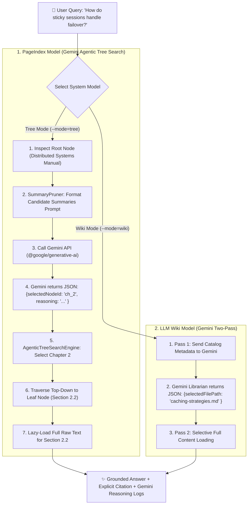

# 💎 Vectorless RAG with Google Gemini (`vectorless-rag-gemini-01`): Complete Code & Concept Walkthrough

Welcome! This guide is designed for **anyone** (even complete beginners) to fully understand how **Google Gemini API** (`@google/generative-ai`) powers **Vectorless RAG** (PageIndex Model) and the **Andrej Karpathy LLM Wiki Architecture**.

---

## 💡 What Makes the Gemini Implementation Special?

In standard Vectorless RAG, branch selection and catalog filtering use local keyword matching.
In **`vectorless-rag-gemini-01`**, **Google Gemini** is integrated directly into the decision loops!

### Key Enhancements over Standard Vectorless RAG:
1. **AI Agent Branch Selection**: Instead of counting matching words, the system sends child node summaries to Gemini. Gemini performs **deep semantic reasoning** to choose the best branch (e.g., recognizing that "sticky sessions" relates to "load balancing" even if exact words don't match).
2. **AI Wiki Librarian**: Gemini reads catalog tags and summaries to pick the single best Markdown document file in Pass 1.
3. **Structured JSON Output**: Gemini is prompted to return strict JSON responses containing both the selected item ID and its chain-of-thought **reasoning**.
4. **Graceful Fallbacks**: If `GEMINI_API_KEY` is missing or an API error occurs, the system automatically falls back to local scoring—so the app never crashes!

---

## 🏗️ Architectural Overview & Gemini Decision Flow



---

## 📁 Directory Structure & File Map

Here is the role of every file in the `src/` directory:

| File Path | Role / Description |
| :--- | :--- |
| [`src/config.js`](file:///home/aminul/development/gen-ai-cohort/week03/learning/day06/code/vectorless-rag-gemini-01/src/config.js) | Centralized configuration loader for environment settings and `GEMINI_API_KEY`. |
| [`src/search/geminiClient.js`](file:///home/aminul/development/gen-ai-cohort/week03/learning/day06/code/vectorless-rag-gemini-01/src/search/geminiClient.js) | **[Gemini Core]** SDK initialization (`@google/generative-ai`) and prompt dispatcher. |
| [`src/search/SummaryPruner.js`](file:///home/aminul/development/gen-ai-cohort/week03/learning/day06/code/vectorless-rag-gemini-01/src/search/SummaryPruner.js) | **[Gemini Agent]** Evaluates branch nodes using Gemini reasoning with fallback scoring. |
| [`src/search/AgenticTreeSearchEngine.js`](file:///home/aminul/development/gen-ai-cohort/week03/learning/day06/code/vectorless-rag-gemini-01/src/search/AgenticTreeSearchEngine.js) | Top-down decision tree engine powered by async Gemini decision loops. |
| [`src/tree/TreeNode.js`](file:///home/aminul/development/gen-ai-cohort/week03/learning/day06/code/vectorless-rag-gemini-01/src/tree/TreeNode.js) | Core data structure representing nodes in the document tree hierarchy. |
| [`src/tree/HierarchicalTreeIndex.js`](file:///home/aminul/development/gen-ai-cohort/week03/learning/day06/code/vectorless-rag-gemini-01/src/tree/HierarchicalTreeIndex.js) | Tree index manager, lineage path tracer, and ASCII visualizer. |
| [`src/tree/TreeBuilder.js`](file:///home/aminul/development/gen-ai-cohort/week03/learning/day06/code/vectorless-rag-gemini-01/src/tree/TreeBuilder.js) | Factory building a sample 3-level document hierarchy tree. |
| [`src/wiki/WikiVault.js`](file:///home/aminul/development/gen-ai-cohort/week03/learning/day06/code/vectorless-rag-gemini-01/src/wiki/WikiVault.js) | Markdown knowledge vault catalog and file entry models. |
| [`src/wiki/LLMLibrarian.js`](file:///home/aminul/development/gen-ai-cohort/week03/learning/day06/code/vectorless-rag-gemini-01/src/wiki/LLMLibrarian.js) | Factory builder populating sample Markdown vault notes. |
| [`src/wiki/TwoPassRetriever.js`](file:///home/aminul/development/gen-ai-cohort/week03/learning/day06/code/vectorless-rag-gemini-01/src/wiki/TwoPassRetriever.js) | **[Gemini Librarian]** Karpathy Two-Pass algorithm powered by Gemini catalog scans. |
| [`src/comparison/VectorVsVectorlessBenchmark.js`](file:///home/aminul/development/gen-ai-cohort/week03/learning/day06/code/vectorless-rag-gemini-01/src/comparison/VectorVsVectorlessBenchmark.js) | Side-by-side comparison benchmark. |
| [`src/cli.js`](file:///home/aminul/development/gen-ai-cohort/week03/learning/day06/code/vectorless-rag-gemini-01/src/cli.js) | Interactive terminal CLI driver. |
| [`src/index.js`](file:///home/aminul/development/gen-ai-cohort/week03/learning/day06/code/vectorless-rag-gemini-01/src/index.js) | Entry point executing full feature set. |

---

## 🔬 In-Depth Code & Class Walkthrough

---

### 1. Google Gemini SDK Helper (`src/search/geminiClient.js`)

This file manages connection to Google Gemini API.

```javascript
import { config } from "../config.js";

let genAI = null;

// Initialize GoogleGenerativeAI SDK if GEMINI_API_KEY is provided
if (config.geminiApiKey && config.geminiApiKey !== "your_gemini_api_key_here") {
  try {
    const { GoogleGenerativeAI } = await import("@google/generative-ai");
    genAI = new GoogleGenerativeAI(config.geminiApiKey);
    console.log(`[Gemini Client] Initialized GoogleGenerativeAI SDK with model: ${config.geminiModel}`);
  } catch (err) {
    console.warn(`[Gemini Client Warning] Could not load SDK (${err.message}). Using local fallbacks.`);
  }
}

/**
 * Unified Helper Function to Dispatch Prompts to Gemini
 */
export async function callGemini({ systemInstruction, prompt }) {
  if (genAI) {
    try {
      const model = genAI.getGenerativeModel({
        model: config.geminiModel, // e.g. "gemini-2.5-flash"
        systemInstruction
      });

      const result = await model.generateContent(prompt);
      return result.response.text().trim();
    } catch (err) {
      console.warn(`[Gemini Warning] Gemini API call failed (${err.message}). Using local fallback.`);
    }
  }
  return null; // Triggers local heuristic fallback if API key isn't configured
}
```

---

### 2. Gemini Agent Branch Evaluation (`src/search/SummaryPruner.js`)

`SummaryPruner` features the `evaluateWithGemini()` method, which sends candidate options to Gemini for selection:

```javascript
static async evaluateWithGemini(query, candidateNodes) {
  // 1. Format candidate document branches for Gemini prompt
  const candidatesText = candidateNodes.map((n, i) => 
    `Option ${i + 1} [ID: ${n.nodeId}]: ${n.title}\nSummary: ${n.summary}\nKeywords: ${n.keywords.join(", ")}`
  ).join("\n\n");

  // 2. System Instruction enforcing JSON response format
  const systemInstruction = 
    'You are an expert AI retrieval agent navigating a hierarchical document index. ' +
    'Evaluate candidate options and respond ONLY with a JSON object format: ' +
    '{"selectedNodeId": "<node_id>", "reasoning": "<short_explanation>"}';

  const prompt = `User Query: "${query}"\n\nCandidate Document Branches:\n${candidatesText}`;

  // 3. Call Gemini
  const rawResponse = await callGemini({ systemInstruction, prompt });

  if (rawResponse) {
    try {
      const cleaned = rawResponse.replace(/```json|```/g, "").trim();
      const parsed = JSON.parse(cleaned);
      const selected = candidateNodes.find((n) => n.nodeId === parsed.selectedNodeId);
      
      if (selected) {
        console.log(`✨ [Gemini Reasoning Agent]: Selected [${selected.nodeId}] -> Reason: ${parsed.reasoning}`);
        return selected;
      }
    } catch (err) {
      // If parsing fails, code silently falls back to local scoring
    }
  }
  return null;
}
```

---

### 3. Agentic Tree Search Traversal Loop (`src/search/AgenticTreeSearchEngine.js`)

`AgenticTreeSearchEngine` coordinates the traversal:

```javascript
async selectBestBranch(query, candidateNodes) {
  // Step A: Try Gemini AI evaluation first
  const geminiChoice = await SummaryPruner.evaluateWithGemini(query, candidateNodes);
  if (geminiChoice) {
    return geminiChoice;
  }

  // Step B: Fallback to local keyword scoring if Gemini is unavailable
  let bestNode = candidateNodes[0];
  let maxScore = -1;

  for (const node of candidateNodes) {
    const score = SummaryPruner.calculateRelevanceScore(query, node);
    if (score > maxScore) {
      maxScore = score;
      bestNode = node;
    }
  }

  return bestNode;
}
```

---

### 4. Gemini LLM Wiki Two-Pass Retrieval (`src/wiki/TwoPassRetriever.js`)

Implements Karpathy's Two-Pass Retrieval Algorithm where Pass 1 is evaluated by Gemini:

```javascript
async evaluateCatalogWithGemini(query, catalog) {
  const catalogPrompt = catalog
    .map((c) => `File: ${c.filePath}\nTitle: ${c.title}\nCategory: ${c.category}\nTags: ${c.tags.join(", ")}\nSummary: ${c.summary}`)
    .join("\n\n---\n\n");

  const systemInstruction = 
    "You are an AI Wiki Librarian. Given a user query and catalog file summaries, select the single best file path. " +
    'Respond ONLY with JSON format: {"selectedFilePath": "<path>", "reasoning": "<short_explanation>"}';

  const prompt = `User Query: "${query}"\n\nWiki Catalog Files:\n${catalogPrompt}`;

  const rawResponse = await callGemini({ systemInstruction, prompt });
  if (rawResponse) {
    try {
      const cleaned = rawResponse.replace(/```json|```/g, "").trim();
      const parsed = JSON.parse(cleaned);
      if (parsed.selectedFilePath) {
        console.log(`✨ [Gemini Librarian Selection]: '${parsed.selectedFilePath}' -> Reason: ${parsed.reasoning}`);
        return parsed.selectedFilePath;
      }
    } catch (err) {}
  }
  return null;
}
```

---

## ⚡ How to Configure & Run

### 1. Set Up Environment Variables
Create or edit `.env` in directory [`week03/learning/day06/code/vectorless-rag-gemini-01/`](file:///home/aminul/development/gen-ai-cohort/week03/learning/day06/code/vectorless-rag-gemini-01/):

```env
GEMINI_API_KEY=your_actual_gemini_api_key_here
GEMINI_MODEL=gemini-2.5-flash
DEFAULT_MAX_TREE_DEPTH=3
SUMMARY_PRUNING_THRESHOLD=1.5
```

> 💡 **Note**: If you don't provide a `GEMINI_API_KEY`, the project will automatically fall back to local keyword evaluation without throwing errors!

### 2. Execution Commands

Run these commands from directory [`week03/learning/day06/code/vectorless-rag-gemini-01/`](file:///home/aminul/development/gen-ai-cohort/week03/learning/day06/code/vectorless-rag-gemini-01/):

```bash
# 1. Run all demonstrations with Gemini API integration
npm start

# 2. Run interactive CLI driver
npm run cli

# 3. Run ONLY Gemini Tree Search (PageIndex Model)
npm run tree-search

# 4. Run ONLY Gemini LLM Wiki Retrieval (Karpathy Model)
npm run llm-wiki

# 5. Run Comparison Benchmark
npm run benchmark
```

---

## 🧪 Try It Yourself! (Beginner Experiments)

1. **Test Gemini Reasoning vs Keyword Fallback**:
   * Run `npm run tree-search` with `GEMINI_API_KEY` set to see `✨ [Gemini Reasoning Agent]` outputs in terminal.
   * Then unset `GEMINI_API_KEY` in `.env` and run it again. Observe how the system smoothly falls back to local scoring!

2. **Customize the Gemini System Prompt**:
   * Open [`src/search/SummaryPruner.js`](file:///home/aminul/development/gen-ai-cohort/week03/learning/day06/code/vectorless-rag-gemini-01/src/search/SummaryPruner.js).
   * Modify `systemInstruction` to adjust Gemini's decision-making persona or reasoning detail level.

```mermaid
flowchart TD

    %% ================================
    %% USER QUERY
    %% ================================
    U["👤 User Query"] --> API["🌐 API Gateway"]
    API --> GuardIn["🛡️ Input Guardrails"]
    GuardIn --> Query["🔎 Query Understanding"]
    Query --> Router{"🧭 Retrieval Router"}

    %% ================================
    %% OFFLINE INDEXING
    %% ================================
    subgraph INDEX["📥 OFFLINE / BACKGROUND INDEXING"]

        Sources["📄 PDFs / Docs / HTML / Markdown / Books"]

        Sources --> Parser["📑 Document Parser"]
        Parser --> Structure["🏗️ Structural Analysis"]

        Structure --> TOC["📚 Headings / TOC"]
        Structure --> Pages["📃 Pages / Page Ranges"]
        Structure --> Sections["📑 Sections / Subsections"]
        Structure --> Tables["📊 Tables / Figures"]

        TOC --> Builder["🌳 Hierarchical Tree Builder"]
        Pages --> Builder
        Sections --> Builder
        Tables --> Builder

        Builder --> Enrich["🧠 Gemini Node Enrichment"]

        Enrich --> Summary["📝 Node Summary"]
        Enrich --> Keywords["🏷️ Keywords"]
        Enrich --> Entities["🔗 Entities"]
        Enrich --> Metadata["📌 Page / Parent / Children Metadata"]

        Summary --> TreeDB[("🌳 Tree Index")]
        Keywords --> TreeDB
        Entities --> TreeDB
        Metadata --> TreeDB

        Parser --> RawDB[("🗄️ Raw Document Storage")]
    end

    %% ================================
    %% HIERARCHICAL TREE
    %% ================================
    subgraph TREE["🌳 HIERARCHICAL KNOWLEDGE TREE"]

        Root["📚 Document Root"]
        Root --> Ch1["📖 Chapter 1"]
        Root --> Ch2["📖 Chapter 2"]
        Root --> Ch3["📖 Chapter 3"]

        Ch2 --> Sec1["📑 Section 2.1"]
        Ch2 --> Sec2["📑 Section 2.2"]
        Ch2 --> Sec3["📑 Section 2.3"]

        Sec2 --> Sub1["📄 Subsection 2.2.1"]
        Sec2 --> Sub2["📄 Subsection 2.2.2"]
        Sec2 --> Sub3["📄 Subsection 2.2.3"]

        Sub2 --> Target["🎯 Target Pages"]
    end

    TreeDB --> Root

    %% ================================
    %% GEMINI VECTORLESS SEARCH
    %% ================================
    Router -->|"🌳 Vectorless / Tree Mode"| TreeEngine["🤖 Gemini Agentic Tree Search"]

    subgraph GEMINI["🤖 GEMINI-POWERED AGENTIC TREE SEARCH"]

        TreeEngine --> RootLoad["📚 Load Root + Level-1 Summaries"]

        RootLoad --> Prompt1["📝 Build Branch Selection Prompt"]
        Prompt1 --> Gemini1["✨ Gemini API"]
        Gemini1 --> JSON1["📦 Structured JSON Decision"]

        JSON1 --> Branch{"🎯 Relevant Branch?"}

        Branch -->|"❌ No"| Prune["✂️ Prune Branch"]
        Branch -->|"✅ Yes"| Expand["🔽 Expand Branch"]

        Expand --> ChildLoad["📑 Load Child Summaries"]
        ChildLoad --> Prompt2["📝 Build Relevance Prompt"]

        Prompt2 --> Gemini2["✨ Gemini API"]
        Gemini2 --> JSON2["📦 Structured JSON Decision"]

        JSON2 --> Section{"🎯 Relevant Section?"}

        Section -->|"❌ No"| PruneChild["✂️ Prune"]
        Section -->|"✅ Yes"| Continue["🔽 Continue Traversal"]

        Continue --> Leaf{"🍃 Target Leaf?"}

        Leaf -->|"❌ No"| ChildLoad
        Leaf -->|"✅ Yes"| Lazy["⚡ Lazy Load Exact Pages"]

    end

    %% ================================
    %% FALLBACK
    %% ================================
    Gemini1 -. "❌ API Error / No Key" .-> Fallback["🔤 Local Keyword Scoring"]
    Gemini2 -. "❌ API Error / No Key" .-> Fallback
    Fallback --> Branch
    Fallback --> Section

    %% ================================
    %% RAW CONTENT
    %% ================================
    Lazy --> RawDB
    RawDB --> FullContext["📄 Full Section / Page Context"]

    %% ================================
    %% LLM WIKI
    %% ================================
    Router -->|"📚 Wiki Mode"| Wiki["📚 LLM Wiki Engine"]

    subgraph WIKI["📚 KARPATHY LLM WIKI"]

        Wiki --> Catalog["📋 Metadata Catalog"]

        Catalog --> Pass1["1️⃣ PASS 1: Metadata + Summary Scan"]
        Pass1 --> GeminiWiki["✨ Gemini AI Librarian"]

        GeminiWiki --> WikiJSON["📦 JSON: selectedFilePath"]

        WikiJSON --> Candidate["🎯 Selected Markdown File"]

        Candidate --> Pass2["2️⃣ PASS 2: Selective Full-Text Load"]

        Pass2 --> Vault[("📝 Markdown / Obsidian Vault")]
        Vault --> WikiContext["📄 Selected Knowledge Context"]

    end

    %% ================================
    %% HYBRID
    %% ================================
    Router -->|"⚡ Hybrid Mode"| Hybrid["⚡ Hybrid Retrieval"]

    subgraph HYBRID["⚡ VECTOR + VECTORLESS HYBRID"]

        Hybrid --> Vector["🔢 Fast Vector Pre-Filter"]
        Vector --> Candidates["🎯 Top-N Candidate Documents"]
        Candidates --> TreeSearch["🌳 Gemini Tree Search"]
        TreeSearch --> Exact["🎯 Exact Section / Page"]

    end

    Exact --> Lazy

    %% ================================
    %% CONTEXT ASSEMBLY
    %% ================================
    FullContext --> Context["🧩 Context Builder"]
    WikiContext --> Context

    Context --> Validation["🔍 Context Validation"]
    Validation --> Citation["📌 Citation + Lineage Builder"]

    %% ================================
    %% GENERATION
    %% ================================
    Citation --> Prompt["📝 Grounded Prompt"]
    Prompt --> LLM["🤖 Generation LLM"]

    LLM --> AnswerCheck["🔍 Answer Validation"]
    AnswerCheck --> Grounding["🛡️ Grounding / Hallucination Check"]
    Grounding --> OutputGuard["🛡️ Output Guardrails"]
    OutputGuard --> Response["💬 Final Answer"]

    %% ================================
    %% TRACEABILITY
    %% ================================
    Citation --> Trace["📍 Explicit Traceability"]

    Trace --> Path["🌳 Root → Chapter → Section → Subsection"]
    Trace --> PageRef["📃 Page / Section Reference"]
    Trace --> Source["📄 Source Document"]

    Path --> Response
    PageRef --> Response
    Source --> Response

    %% ================================
    %% OBSERVABILITY
    %% ================================
    Response --> Feedback["📊 Retrieval & Answer Evaluation"]

    Feedback --> Metrics["📈 Production Observability"]
    Metrics --> Latency["⏱️ Latency"]
    Metrics --> Tokens["🪙 Token Usage"]
    Metrics --> Retrieval["🎯 Retrieval Quality"]
    Metrics --> GroundScore["📊 Grounding Score"]

    %% ================================
    %% CACHE
    %% ================================
    ChildLoad --> Cache{"⚡ Tree Cache?"}

    Cache -->|"✅ Hit"| Redis[("⚡ Redis / Memory Cache")]
    Cache -->|"❌ Miss"| TreeDB

    Redis --> ChildLoad

    %% ================================
    %% INDEX MAINTENANCE
    %% ================================
    Feedback --> Maintenance["🔄 Index Maintenance"]
    Maintenance --> Parser

    %% ================================
    %% STORAGE
    %% ================================
    subgraph STORAGE["🗄️ PRODUCTION STORAGE"]

        TreeDB
        RawDB
        Redis
        Vault
        MetadataDB[("📋 Metadata DB")]
        ObjectStore[("☁️ Object Storage")]

    end

    Parser --> MetadataDB
    Parser --> ObjectStore

    %% ================================
    %% SECURITY
    %% ================================
    subgraph SECURITY["🔐 SECURITY & GOVERNANCE"]

        RBAC["🔑 RBAC / ACL"]
        PII["🔒 PII Detection"]
        Audit["📜 Audit Logs"]
        Tenant["🏢 Tenant Isolation"]

    end

    API --> RBAC
    RBAC --> GuardIn
    Context --> PII
    Response --> Audit
    TreeDB --> Tenant

    %% ================================
    %% COLOR STYLING
    %% ================================

    classDef user fill:#4F46E5,stroke:#312E81,color:#fff,stroke-width:3px
    classDef api fill:#0EA5E9,stroke:#0369A1,color:#fff,stroke-width:2px
    classDef ai fill:#A855F7,stroke:#7E22CE,color:#fff,stroke-width:3px
    classDef tree fill:#22C55E,stroke:#15803D,color:#fff,stroke-width:2px
    classDef storage fill:#64748B,stroke:#334155,color:#fff,stroke-width:2px
    classDef process fill:#F59E0B,stroke:#B45309,color:#fff,stroke-width:2px
    classDef security fill:#EF4444,stroke:#B91C1C,color:#fff,stroke-width:2px
    classDef output fill:#14B8A6,stroke:#0F766E,color:#fff,stroke-width:3px
    classDef decision fill:#F97316,stroke:#C2410C,color:#fff,stroke-width:2px

    class U user
    class API,GuardIn,Query,Router api
    class Gemini1,Gemini2,GeminiWiki,LLM,Enrich ai
    class Root,Ch1,Ch2,Ch3,Sec1,Sec2,Sec3,Sub1,Sub2,Sub3,Target,TreeDB,TreeEngine,TreeSearch,Exact tree
    class RawDB,Redis,Vault,MetadataDB,ObjectStore storage
    class Parser,Structure,TOC,Pages,Sections,Tables,Builder,Summary,Keywords,Entities,Metadata,Context,Validation,Citation,Prompt,Feedback,Metrics,Maintenance,Lazy,FullContext,Pass1,Pass2,Catalog,Candidate,Vector,Candidates ai
    class RBAC,PII,Audit,Tenant security
    class Response,Trace,Path,PageRef,Source output
    class Branch,Section,Leaf,Cache decision
```



