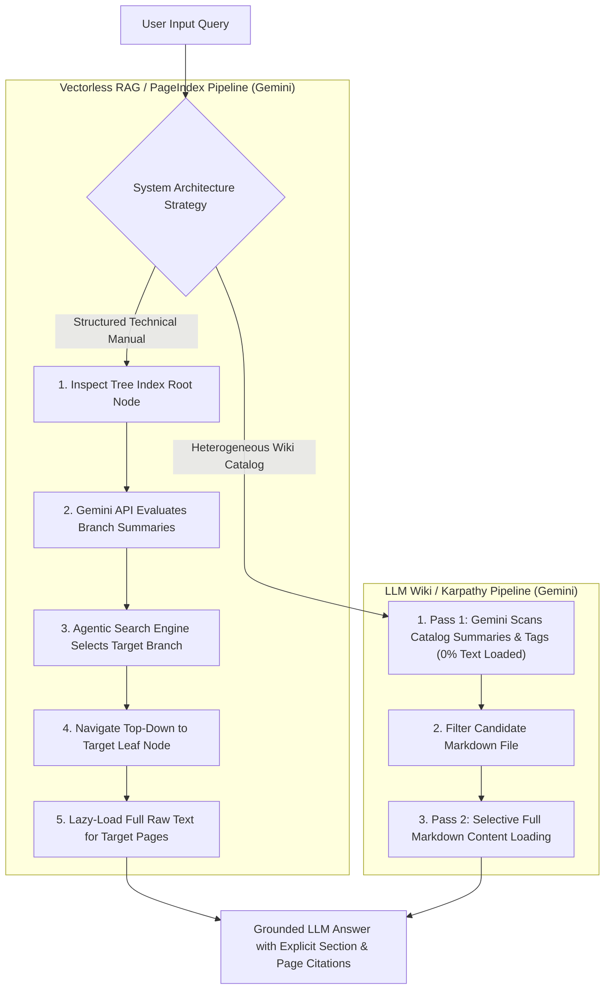

# 🚀 Vectorless RAG & LLM Wiki Engine (`vectorless-rag-gemini-01`): Gemini Implementation Guide

Welcome to the implementation guide for **`vectorless-rag-gemini-01`** under [`week03/learning/day06/code/vectorless-rag-gemini-01/`](file:///home/aminul/development/gen-ai-cohort/week03/learning/day06/code/vectorless-rag-gemini-01/).

This repository contains a full production JavaScript / Node.js implementation powered by **Google Gemini API** (`@google/generative-ai`):
1. **PageIndex Model (Vectorless RAG)** — Hierarchical Document Tree Indexing & Gemini-driven Agentic Tree Traversal.
2. **LLM Wiki Model (Andrej Karpathy Architecture)** — Human-readable Markdown knowledge vault management & **Two-Pass Retrieval Strategy** (summary scan via Gemini + selective lazy loading).
3. **Vector vs. Vectorless Benchmark** — Side-by-side demonstration proving how fixed-size token chunking destroys document hierarchy compared to tree-based reasoning retrieval.

---

## 📌 Architectural Overview & Master Flowchart



---

## 📁 Directory Structure & Component Mapping

```text
week03/learning/day06/code/vectorless-rag-gemini-01/
├── package.json               # Node.js project manifest & Gemini dependencies (@google/generative-ai)
├── .env.example               # Environment variables blueprint (GEMINI_API_KEY)
├── implementation.md          # Gemini implementation guide (this file)
└── src/
    ├── config.js              # Centralized configuration module with Gemini env settings
    ├── tree/
    │   ├── TreeNode.js        # Core tree node data structure (PageIndex model)
    │   ├── HierarchicalTreeIndex.js # Tree hierarchy manager, Map indexer & JSON serializer
    │   └── TreeBuilder.js     # Factory builder for document hierarchy trees
    ├── search/
    │   ├── geminiClient.js    # Google Gemini API SDK helper & prompt dispatcher
    │   ├── SummaryPruner.js   # Gemini API summary evaluator & branch pruner
    │   └── AgenticTreeSearchEngine.js # Top-down decision tree traversal engine with Gemini reasoning
    ├── wiki/
    │   ├── WikiVault.js       # Markdown knowledge vault & file entry catalog
    │   ├── TwoPassRetriever.js # Karpathy Two-Pass retrieval algorithm powered by Gemini
    │   └── LLMLibrarian.js    # Background librarian builder for human-readable notes
    ├── comparison/
    │   └── VectorVsVectorlessBenchmark.js # Side-by-side Vector vs Vectorless RAG benchmark
    ├── cli.js                 # Interactive multi-mode CLI driver
    └── index.js               # Programmatic entry point
```

---

## ⚡ Execution Commands

Run commands from directory [`week03/learning/day06/code/vectorless-rag-gemini-01/`](file:///home/aminul/development/gen-ai-cohort/week03/learning/day06/code/vectorless-rag-gemini-01/):

```bash
# Run all demonstrations (Tree Search + LLM Wiki + Benchmark)
npm start

# Run interactive CLI driver
npm run cli

# Run ONLY Vectorless RAG Tree Search (PageIndex Model with Gemini)
npm run tree-search

# Run ONLY LLM Wiki Two-Pass Retrieval (Karpathy Model with Gemini)
npm run llm-wiki

# Run Vector RAG vs Vectorless RAG Comparison Benchmark
npm run benchmark
```
