# Day 06 — Vectorless RAG & Hierarchical Knowledge Engines

## 01. The Fundamental Problems with Vector RAG & Abrupt Chunking

---

## 1. What Is Vector-Based RAG?

**Retrieval-Augmented Generation (RAG)** improves an LLM by retrieving relevant information from an external knowledge base before generating an answer.

In traditional **Vector RAG**, documents are converted into embeddings and stored in a vector database. When a user asks a question, the query is also converted into an embedding, and the system searches for the most similar chunks.

### Standard Vector RAG Pipeline

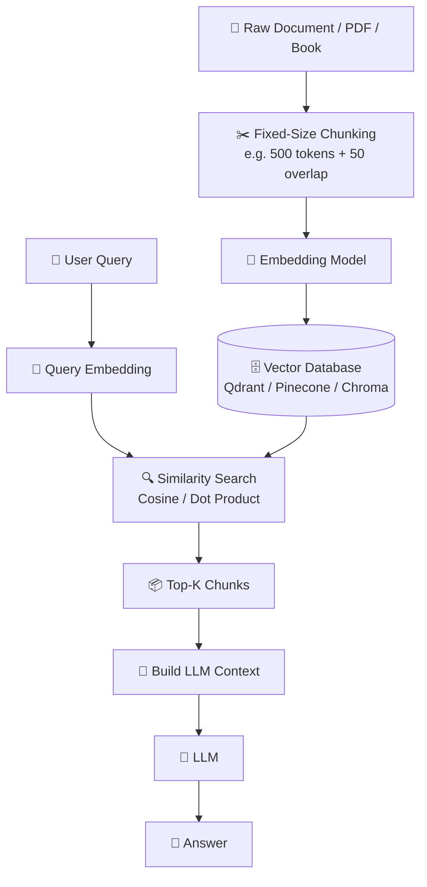

### The basic idea

```text
Document
   ↓
Split into chunks
   ↓
Create embeddings
   ↓
Store in Vector DB

User Query
   ↓
Create query embedding
   ↓
Find similar chunks
   ↓
Send chunks to LLM
   ↓
Generate answer
```

This works well for **simple questions over relatively simple documents**.

However, problems become more obvious when we work with large, structured documents such as:

* 📊 Financial reports and 10-K filings
* ⚖️ Legal contracts
* 🏗️ Engineering manuals
* 🏥 Medical literature
* 📚 Textbooks
* 🏢 Enterprise documentation

The biggest problem starts with **how we split the document**.

---

# 2. The Abrupt Chunking Problem

Traditional Vector RAG commonly uses **fixed-size chunking**.

For example:

```text
Chunk size: 500 tokens
Overlap:    50 tokens
```

The system doesn't necessarily care where a paragraph, section, table, or logical argument ends.

It simply cuts the document into windows.

### Example

Suppose the original document says:

```text
Section 3.2: Load Balancing Architectures

The system utilizes two distinct distribution tiers:
Content Delivery Networks (CDNs) and Application Load
Balancers (ALBs).

High-volume static assets are served directly via the
CDN edge nodes.

---------------- CHUNK BOUNDARY ----------------

For dynamic user session state preservation, the ALB
employs sticky sessions based on an encrypted browser
cookie.

If session persistence fails, requests fallback to
round-robin routing across downstream application servers.
```

The chunk boundary has separated two pieces of the same idea.

The second chunk may now look like:

```text
For dynamic user session state preservation, the ALB
employs sticky sessions...
```

But the model may no longer know that this belongs to:

```text
Section 3.2
   ↓
Load Balancing Architectures
   ↓
Application Load Balancers
   ↓
Session Persistence
```

---

# 3. Why Abrupt Chunking Is a Problem

There are three major problems.

## 3.1 Loss of Global & Chapter Context

Each chunk becomes an almost independent piece of text.

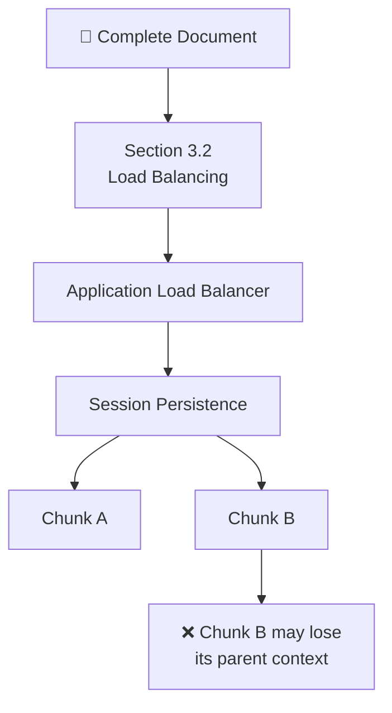

For example, Chunk B may contain:

> "The ALB employs sticky sessions..."

But without the surrounding headings, the LLM may not know:

* What document is this from?
* Which section?
* What architecture is being discussed?
* What problem are sticky sessions solving?
* What came before this statement?

### Key idea

> **A chunk contains text, but not necessarily the full meaning of that text.**

---

# 4. Semantic Boundary Fragmentation

Real documents don't naturally follow fixed token boundaries.

A logical unit might be:

```text
Heading
   ↓
Paragraph
   ↓
Example
   ↓
Table
   ↓
Explanation
```

But fixed chunking might produce:

```text
Heading + half paragraph
        ↓
-----------------
Chunk Boundary
-----------------
half paragraph + table
        ↓
-----------------
Chunk Boundary
-----------------
table + explanation
```

This can break the relationship between different pieces of information.

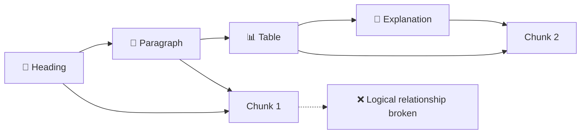

The result can be **incomplete or misleading retrieval**.

---

# 5. Dangling References & Anaphora Problems

Documents frequently use references such as:

* "This mechanism..."
* "As discussed above..."
* "It requires..."
* "The previous method..."
* "This approach..."
* "The following configuration..."

These statements depend on previous context.

### Example

```text
Paragraph 1:
The ALB uses encrypted cookies to maintain session state.

Paragraph 2:
This mechanism prevents users from being redirected
between different backend servers.
```

If the second paragraph is retrieved alone:

```text
"This mechanism prevents users..."
```

What does **"this mechanism"** refer to?

The LLM has to guess.

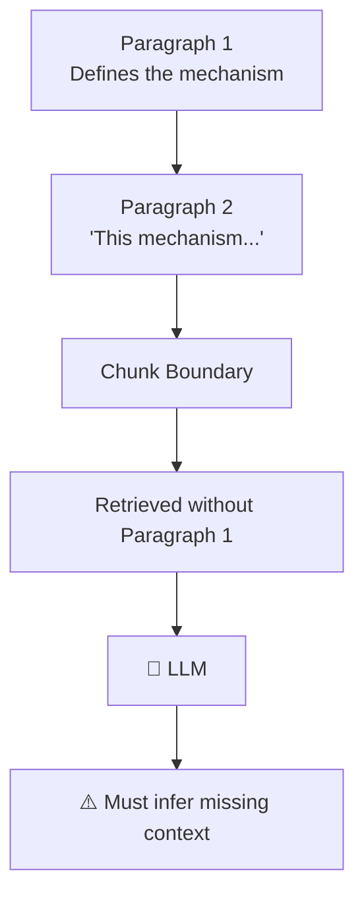

This increases the risk of:

* Misinterpretation
* Hallucination
* Incorrect reasoning
* Incomplete answers

---

# 6. Similarity ≠ Relevance

This is one of the most important concepts in Vector RAG.

Traditional vector search assumes that:

[
\text{Semantic Similarity} \approx \text{Relevance}
]

But in real-world retrieval:

[
\boxed{\text{Similarity} \neq \text{Contextual Relevance}}
]

A chunk can be **similar to the query** without actually answering it.

---

## Similarity Search vs Relevance Search

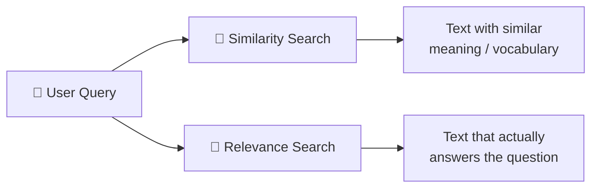

### Example

User asks:

> "How does ALB sticky-session failure recovery work?"

Vector search might retrieve:

```text
CDN traffic distribution
Load balancing
Static asset caching
HTTP traffic routing
```

These topics are semantically related to the query.

But the actual answer may exist in a section titled:

```text
Fault Tolerance & Recovery
```

which may not contain the exact words **"sticky session failure recovery."**

---

# 7. Common Similarity Search Failure Modes

| Failure Mode                 | What Happens                                                      | Example                                                                     |
| ---------------------------- | ----------------------------------------------------------------- | --------------------------------------------------------------------------- |
| **Similar but Irrelevant**   | Retrieved text is related but doesn't answer the question         | CDN caching retrieved for an ALB session question                           |
| **Relevant but Not Similar** | Correct information uses different terminology                    | "Fault Tolerance" contains the answer to a "session recovery" query         |
| **Contextual Inversion**     | Retrieved chunk contains the right keywords but the wrong meaning | "Feature is deprecated and disabled" retrieved for "How to enable feature?" |

---

## 7.1 Similar but Irrelevant

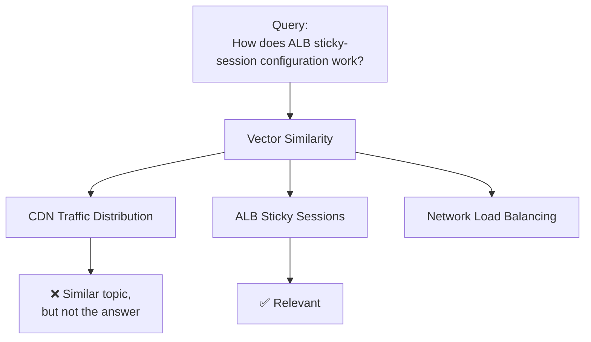

The vector database doesn't inherently understand:

> "This chunk discusses the same general topic, but it doesn't answer the user's actual question."

---

# 8. Relevant but Not Similar

Sometimes the correct information doesn't use the same terminology as the query.

### User Query

> "How is session persistence recovered after failure?"

### Relevant section

```text
Section 4: Fault Tolerance
```

The section might explain retry mechanisms and recovery policies without ever mentioning **"session persistence"**.

A pure similarity search can rank it too low.

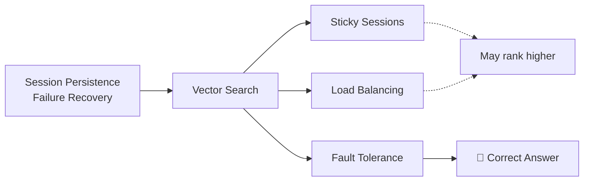

---

# 9. Contextual Inversion

This happens when a chunk contains exactly the words we're searching for but gives the **opposite meaning**.

### Document

```text
The feature was previously available.

However, this feature is deprecated
and disabled in version 2.
```

### Query

> "How do I enable the feature in version 2?"

The chunk contains:

```text
feature
version 2
```

So it may rank highly.

But the actual answer is:

> The feature is disabled in version 2.

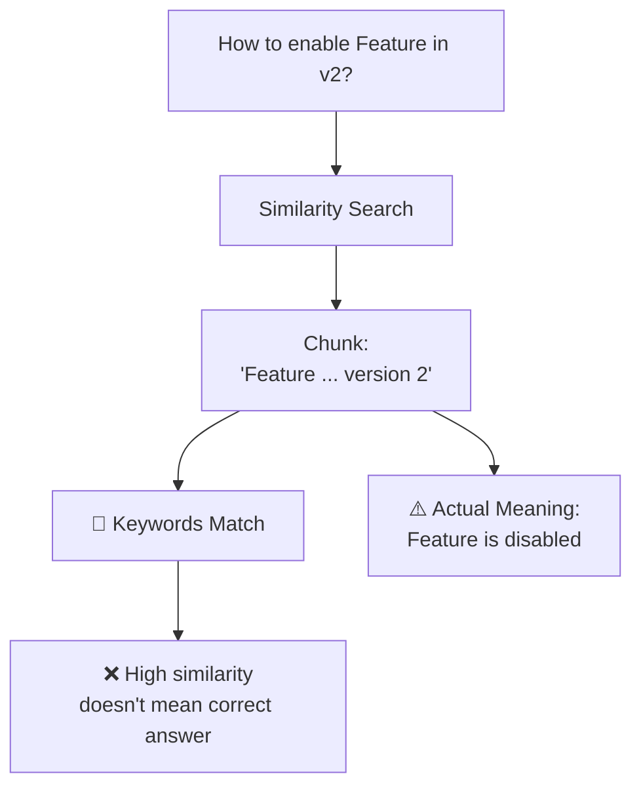

---

# 10. Vibe Retrieval & Opaque Scoring

Vector databases commonly use mathematical distance metrics such as:

* Cosine similarity
* Euclidean distance
* Dot product

For example, cosine similarity is:

[
\text{Cosine Similarity}(u,v)
=============================

\frac{u \cdot v}
{|u||v|}
]

The important problem isn't the mathematics itself.

The problem is **what the score actually tells us**.

---

## Example

Suppose the database returns:

```text
Chunk #47 → 0.82
Chunk #12 → 0.79
Chunk #31 → 0.75
```

We know that Chunk #47 is mathematically closer.

But we don't automatically know:

* Why is it more relevant?
* Does it actually answer the question?
* Is important context missing?
* Is the information complete?
* Does the chunk contradict another section?
* Is the chunk from the correct section?

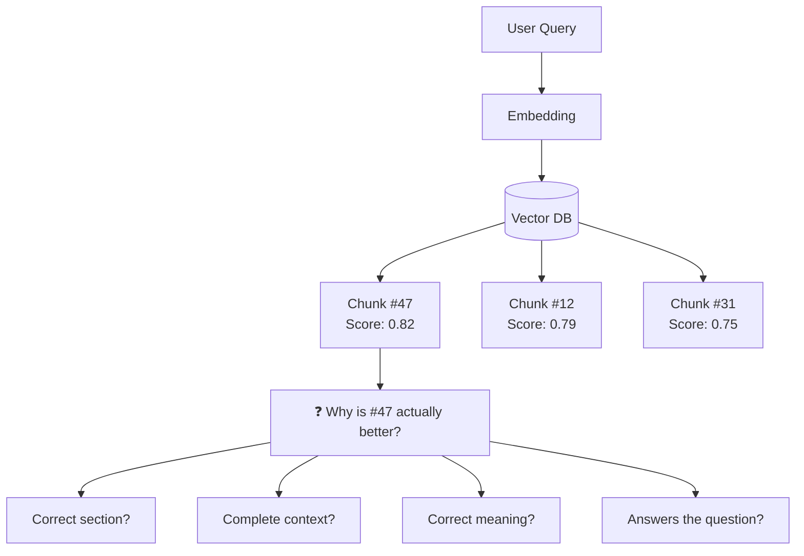

---

# 11. What Is "Vibe Retrieval"?

**Vibe Retrieval** is a useful way to describe retrieval where the system effectively says:

> "This text looks similar to what you're asking about, so I'll retrieve it."

The vector model is excellent at representing semantic relationships, but the similarity score itself does not provide a complete explanation of **logical relevance**.

### The problem

```text
Similarity Score
       ↓
"Looks related"
       ↓
Retrieved
       ↓
LLM assumes relevance
```

But what we really want is:

```text
User Query
     ↓
Understand intent
     ↓
Understand document structure
     ↓
Identify relevant section
     ↓
Verify relevance
     ↓
Retrieve complete context
```

---

# 12. Why Vector Retrieval Is Difficult to Audit

When debugging a retrieval system, engineers may ask:

> "Why did this chunk get retrieved?"

With vector similarity, the direct answer is often:

> "Because its embedding was closer."

That doesn't explain the **business or logical reason**.

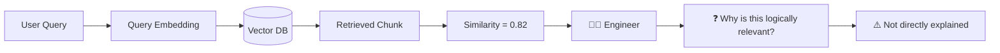

This makes retrieval failures harder to debug and audit.

---

# 13. Why This Matters in Professional Documents

These problems become much more serious when the source material is mission-critical.

### 📊 Financial Documents

A financial table could be split in the middle of a row:

```text
Revenue | 2024 | 2025
--------|------|------
Product | 100  | 120
Services| 80   |
---------------- CHUNK ----------------
         | 90
```

The retrieved context may no longer represent the complete table.

---

### ⚖️ Legal Documents

A contract clause may depend on definitions introduced earlier:

```text
Definitions
    ↓
"Liability"
    ↓
"Covered Loss"
    ↓
Liability Cap
```

Retrieving only the liability-cap clause without its definitions can change its interpretation.

---

### 🏗️ Technical Documentation

A setup instruction might depend on prerequisites:

```text
Prerequisites
    ↓
Environment Variables
    ↓
Installation
    ↓
Configuration
    ↓
Deployment
```

If retrieval returns only:

```text
Deployment Configuration
```

without the prerequisites, the generated recommendation may be incorrect.

---

# 14. The Bigger Problem

The two major weaknesses can be summarized as:

### Problem 1 — Fragmented Context

Fixed-size chunking can destroy the original document's structure.

### Problem 2 — Opaque Retrieval

Vector similarity can retrieve text that is mathematically similar but not logically relevant.

Together:

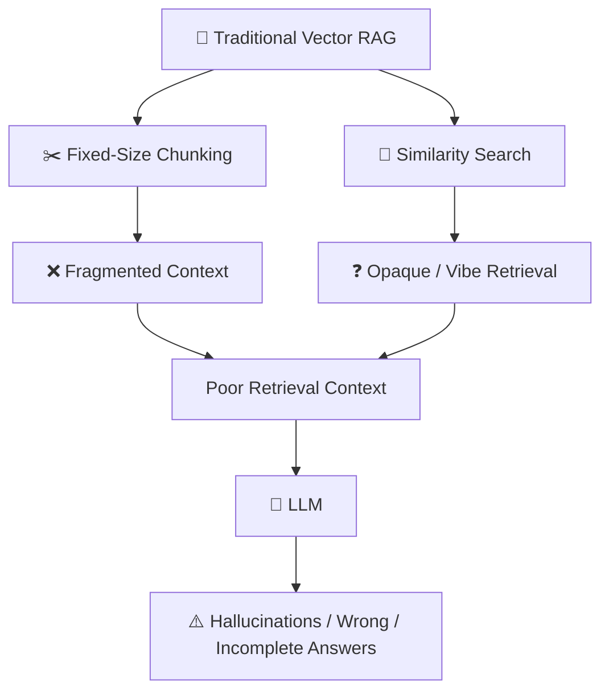

---

# 15. Why Vectorless RAG?

The limitations above lead to a different question:

> **What if we preserve the document's structure instead of destroying it during chunking?**

Instead of:

```text
Document
   ↓
Fixed Chunks
   ↓
Embeddings
   ↓
Similarity Search
```

we can build:

```text
Document
   ↓
Understand Structure
   ↓
Build Hierarchical Tree
   ↓
Navigate Relevant Branch
   ↓
Retrieve Complete Context
```

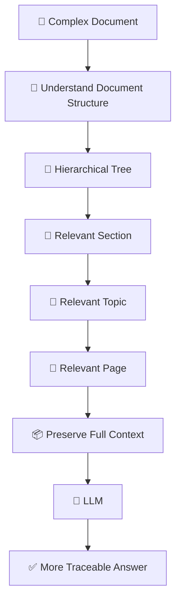

This is the foundation for the next topic:

> **Vectorless RAG & Hierarchical Tree-Based Indexing.**
