# Day 06 — Vectorless RAG & Hierarchical Knowledge Engines

## 02. Vectorless RAG Architecture & Tree-Structured Indexing

---

## 1. What Is Vectorless RAG?

**Vectorless RAG** is a retrieval approach that does not depend primarily on:

* ❌ Vector embeddings
* ❌ Vector databases
* ❌ Fixed-size token chunks
* ❌ Pure similarity search

Instead, it builds a **hierarchical tree representation of the document** and uses an LLM to navigate that tree.

The main idea is simple:

> **Instead of searching through random chunks, understand the document's structure and navigate to the relevant section.**

Systems such as **PageIndex** follow this general tree-based approach.

### Traditional Vector RAG

```text id="v2rag"
Document
   ↓
Fixed-size chunks
   ↓
Embeddings
   ↓
Vector Database
   ↓
Similarity Search
```

### Vectorless RAG

```text id="vlrag"
Document
   ↓
Understand structure
   ↓
Build hierarchical tree
   ↓
Navigate relevant branches
   ↓
Retrieve exact section/page
```

### Architecture Comparison

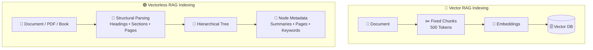

---

# 2. The Core Paradigm Shift

The biggest difference is **how the system thinks about a document**.

Imagine a lawyer working with a 500-page contract.

They don't:

```text
Cut document into 5,000 random pieces
        ↓
Shuffle them
        ↓
Find pieces that look similar
```

Instead, they naturally navigate:

```text
Contract
   ↓
Table of Contents
   ↓
Relevant Chapter
   ↓
Relevant Section
   ↓
Specific Clause
   ↓
Read surrounding context
```

Vectorless RAG tries to reproduce this **structured navigation process**.

### Human Expert vs Vectorless RAG

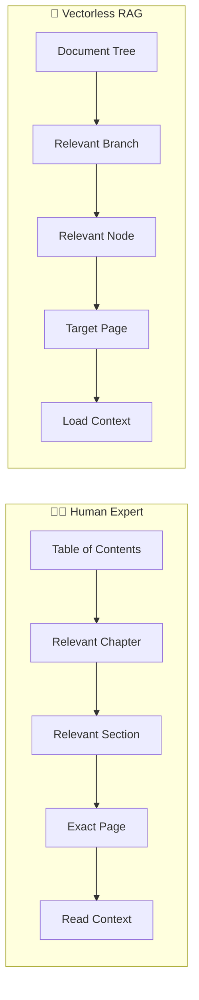

The key idea is:

> **Search the structure first, then retrieve the content.**

---

# 3. Vector RAG vs Vectorless RAG

| Feature            | 🔵 Vector RAG          | 🟢 Vectorless RAG         |
| ------------------ | ---------------------- | ------------------------- |
| **Index**          | Flat vector space      | Hierarchical tree         |
| **Representation** | Dense embeddings       | Structural metadata       |
| **Chunking**       | Fixed token windows    | Natural document units    |
| **Indexing**       | Embedding model        | Structural parsing + LLM  |
| **Retrieval**      | k-NN similarity search | LLM tree navigation       |
| **Database**       | Vector DB              | JSON / SQLite / Graph DB  |
| **Explainability** | Similarity score       | Explicit navigation path  |
| **Context**        | Often isolated chunks  | Hierarchical context      |
| **Page tracing**   | Not always natural     | Built into tree structure |

### Example

Vector RAG might tell you:

```text id="5y4a8p"
Result #1
Similarity: 0.814
Chunk: #472
```

Vectorless RAG can tell you:

```text id="v9f3ke"
Root
 ↓
Chapter 2
 ↓
Section 2.2
 ↓
Subsection 2.2.2
 ↓
Pages 181–200
```

The second approach provides a much more understandable retrieval path.

---

# 4. Hierarchical Document Tree

The heart of Vectorless RAG is the **document tree**.

Instead of treating a 500-page document as thousands of independent chunks, we preserve its natural hierarchy.

For example:

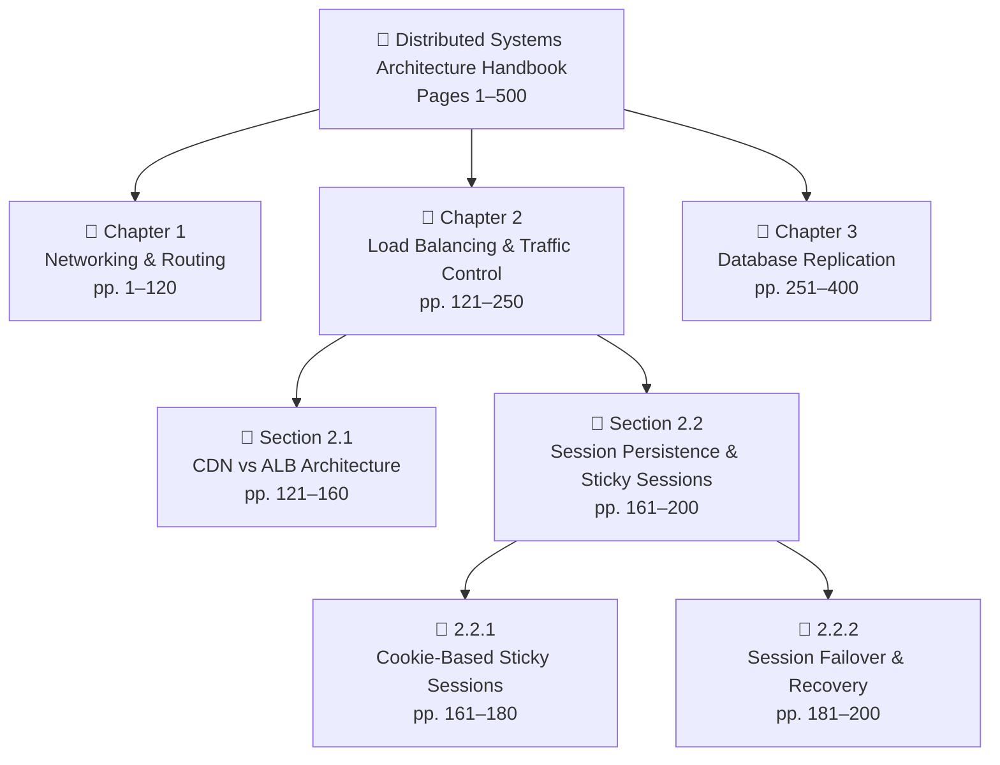

This structure gives every piece of information a **place inside the document**.

---

# 5. Why Hierarchy Matters

Consider this question:

> **"How does session failover work when an ALB server crashes?"**

A vector search might look for:

```text
session
failover
ALB
server
crash
```

But Vectorless RAG can reason through the document:

```text id="bkmv1f"
Distributed Systems Handbook
        ↓
Chapter 2: Load Balancing
        ↓
Section 2.2: Session Persistence
        ↓
Subsection 2.2.2: Session Failover
        ↓
Pages 181–200
```

The retrieval path itself provides useful context.

---

# 6. Anatomy of a Tree Node

A tree node isn't just a title.

It contains metadata that helps the LLM understand what exists at that location.

Example:

```json
{
  "node_id": "sec_2_2",
  "title": "Session Persistence & Sticky Sessions",
  "level": 2,
  "page_range": [161, 200],
  "parent_id": "ch_2",
  "children_ids": [
    "sub_2_2_1",
    "sub_2_2_2"
  ],
  "summary": "Covers session state management across distributed load balancers, including cookie-based sticky sessions, timeout thresholds, and failover behavior.",
  "keywords": [
    "sticky sessions",
    "ALB",
    "session persistence",
    "cookie routing",
    "failover"
  ],
  "entities": [
    "Application Load Balancer",
    "Browser Cookies",
    "Memcached"
  ],
  "source_file": "distributed_systems_v2.pdf"
}
```

Think of the node as a **map marker**, not necessarily the complete content.

---

# 7. What Information Does a Node Contain?

A useful node can contain:

### 1. Node ID

Uniquely identifies the node.

```text id="n1"
sec_2_2
```

### 2. Title

Tells the LLM what the node represents.

```text id="q7"
Session Persistence & Sticky Sessions
```

### 3. Level

Shows where the node exists in the hierarchy.

```text id="u2"
Level 0 → Document
Level 1 → Chapter
Level 2 → Section
Level 3 → Subsection
```

### 4. Page Range

Connects the node to the original document.

```text id="x4"
Pages 161–200
```

### 5. Parent & Children

Defines the node's lineage.

```text id="j8"
Parent → Chapter 2
Children → 2.2.1, 2.2.2
```

### 6. Summary

Provides a compressed understanding of the section.

### 7. Keywords / Entities

Help the LLM identify what the section is about.

---

# 8. Explicit Lineage

One of the biggest advantages of a tree index is **lineage**.

Every node knows where it belongs.

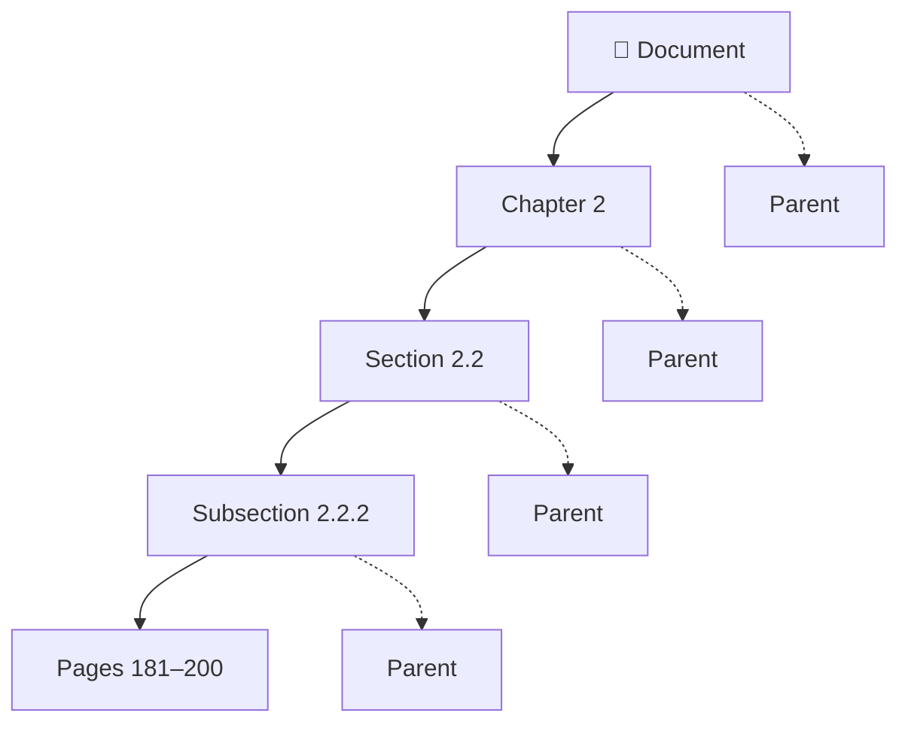

So when the system retrieves:

```text id="m5v7j1"
Subsection 2.2.2
```

it also knows:

```text id="a2t4h8"
Document
 → Chapter 2
 → Section 2.2
 → Subsection 2.2.2
```

This makes the retrieval path **traceable**.

---

# 9. Lazy Loading

A very important concept is **lazy loading**.

The active tree doesn't necessarily need to contain every page of raw document text.

Instead:

```text id="9j4r0a"
Tree Node
 ├── Title
 ├── Summary
 ├── Keywords
 ├── Page Range
 └── Relationships
```

The actual content can remain in the original document.

When the system finds the correct node:

```text id="5z4r5b"
Tree Node
     ↓
Page Range
     ↓
Load Original Pages
     ↓
Full Context
```

### Why?

Because the system doesn't need to load the entire 500-page document into the active retrieval context.

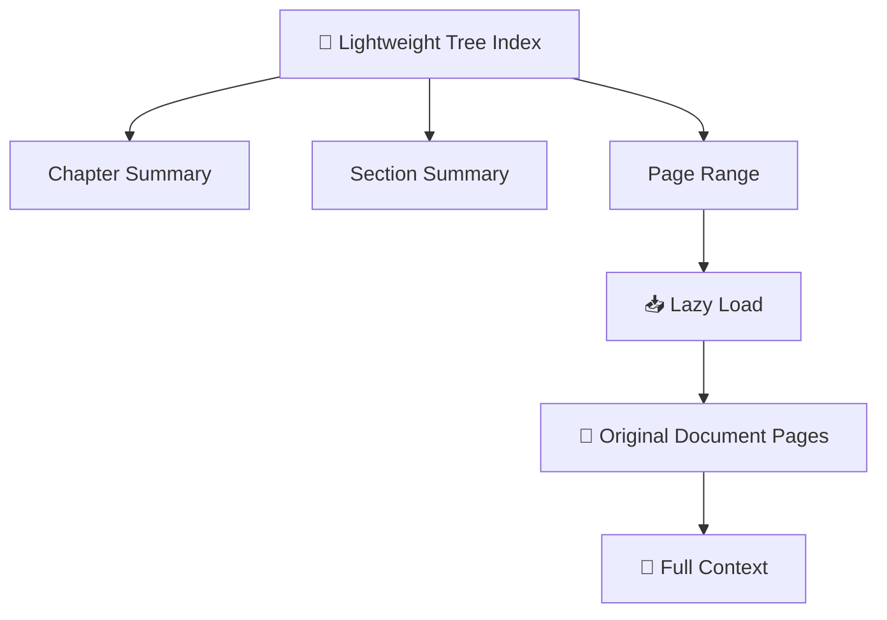

This makes the tree act like a **map** to the actual knowledge.

---

# 10. Zero Vector Storage

Vectorless RAG does not require embeddings for its primary index.

The tree can be stored using ordinary data structures.

For example:

```text id="q9a8kl"
JSON
SQLite
PostgreSQL
Graph Database
Document Database
```

A simplified structure could look like:

```text id="5f0e6k"
Root
├── Chapter 1
│   ├── Section 1.1
│   └── Section 1.2
│
├── Chapter 2
│   ├── Section 2.1
│   └── Section 2.2
│       ├── Subsection 2.2.1
│       └── Subsection 2.2.2
│
└── Chapter 3
    ├── Section 3.1
    └── Section 3.2
```

The important point is:

> **The index is based on document structure rather than vector distance.**

---

# 11. Step-by-Step Indexing Workflow

Before the system can search the tree, it first needs to **build the tree**.

The process looks like this:

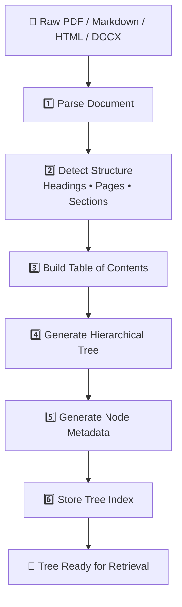

Let's break this down.

---

# 12. Step 1 — Document Ingestion

First, the system reads the original document.

Possible sources include:

* PDF
* Markdown
* HTML
* DOCX
* Books
* Technical manuals

The parser tries to identify structural information such as:

```text id="y3c9j5"
# Chapter
## Section
### Subsection
Page breaks
PDF bookmarks
Tables
Headings
```

---

# 13. Step 2 — Structure Detection

The system identifies the natural hierarchy.

For example:

```text id="8h9p0m"
Chapter 2
   ↓
Section 2.2
   ↓
Subsection 2.2.1
   ↓
Subsection 2.2.2
```

Instead of asking:

> "Where should I cut every 500 tokens?"

we ask:

> **"How is this document naturally organized?"**

---

# 14. Step 3 — Build the Table of Contents

The detected structure becomes a **Table of Contents tree**.

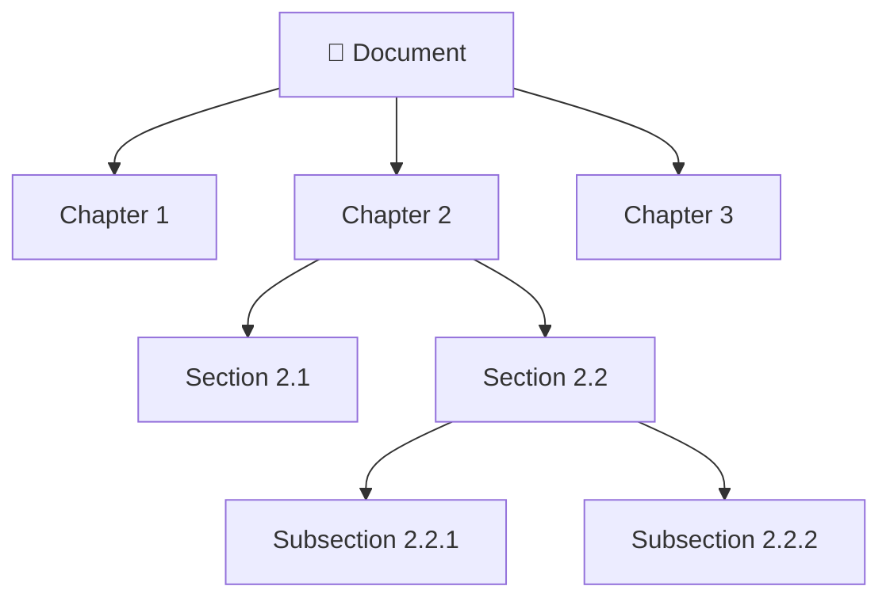

This becomes the skeleton of the knowledge index.

---

# 15. Step 4 — Generate Node Summaries

The LLM then creates a short summary for each important node.

For example:

```text id="q3k8r7"
Section:
Session Persistence & Sticky Sessions

Summary:
Explains how distributed load balancers maintain
user session state using cookie-based routing,
timeouts, and failover mechanisms.
```

The summary allows the retrieval agent to understand the section **without loading all of its raw content**.

---

# 16. Step 5 — Add Metadata

The system enriches each node with information such as:

```text id="k0xv7h"
Title
Summary
Keywords
Entities
Page Range
Parent
Children
Source File
```

This gives the tree enough information for intelligent navigation.

---

# 17. Step 6 — Store the Tree

Finally, the hierarchical index is persisted.

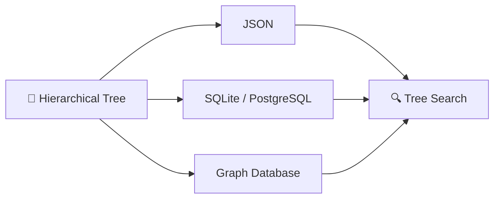

The important point is that you don't need a specialized vector database just to represent the hierarchy.

---

# 18. Complete Indexing Architecture

Putting everything together:

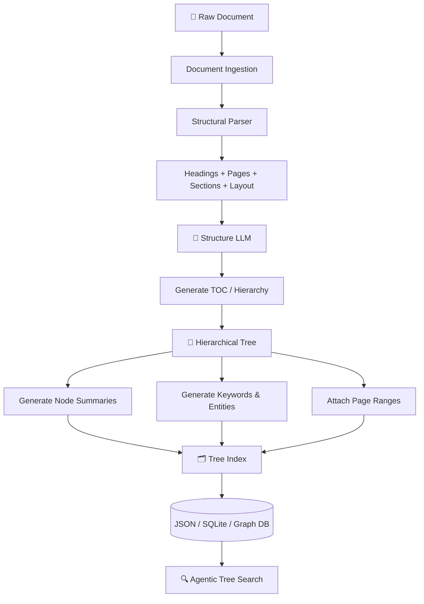

---

# 19. Indexing Sequence

The entire process can also be represented as a sequence:

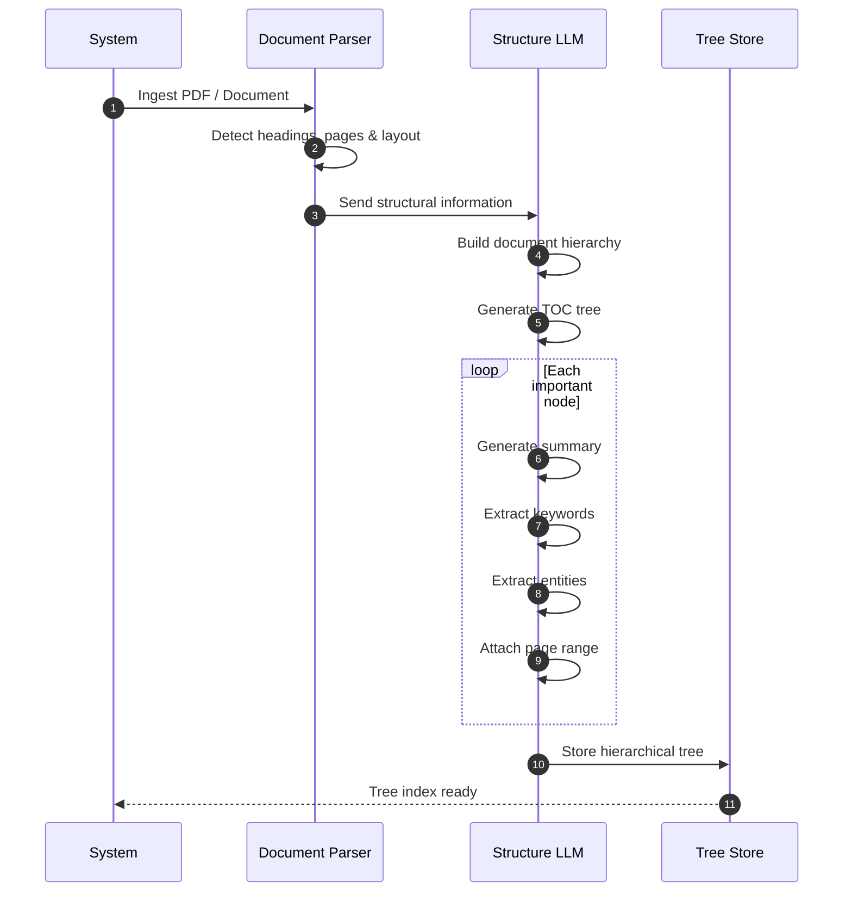

---

# 20. Traditional Index vs Tree Index

The difference becomes very clear here:

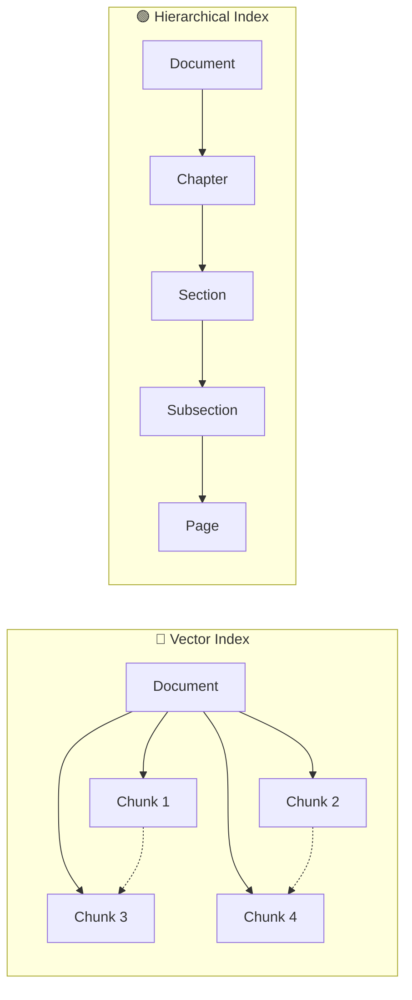

### Mental model

**Vector RAG:**

> "Find something that looks similar."

**Vectorless RAG:**

> "Navigate to the part of the document where the answer should exist."

---

# 21. Key Advantages of the Tree Index

### 🌳 1. Preserves Structure

The relationship between:

```text
Document → Chapter → Section → Page
```

remains intact.

### 🔗 2. Explicit Lineage

Every node knows its parent and children.

### 📄 3. Precise Page Tracing

The system can identify the exact page range containing the information.

### 🧠 4. Better Context

The LLM can understand the surrounding hierarchy before reading the actual content.

### 🔍 5. More Explainable Retrieval

Instead of:

```text
Similarity = 0.814
```

we can explain:

```text
Document
 → Chapter 2
 → Section 2.2
 → Subsection 2.2.2
 → Pages 181–200
```

### 📦 6. Efficient Context Loading

Only the required content needs to be loaded after the relevant branch is identified.

---

# 22. The Big Picture

The fundamental architecture shift is:

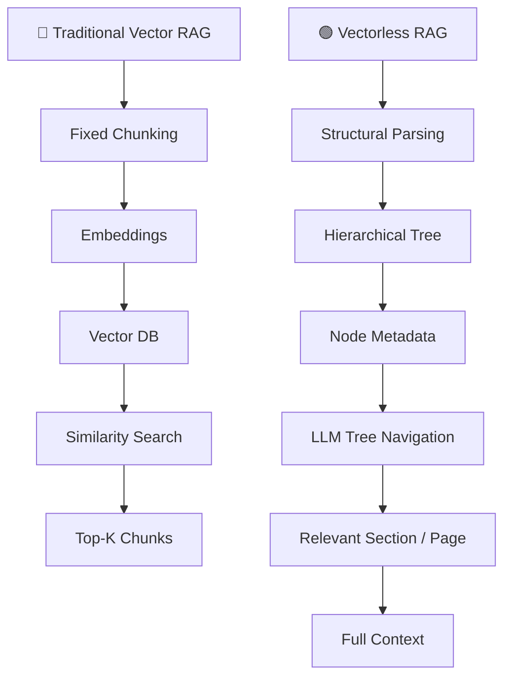

## 🎯 Key Takeaways

Remember these **7 points**:

1. **Vectorless RAG replaces similarity-first retrieval with structure-first retrieval.**
2. **Documents are represented as hierarchical trees instead of flat chunks.**
3. **Natural units such as chapters, sections, subsections, and pages are preserved.**
4. **Each tree node can contain summaries, keywords, entities, page ranges, and parent/child relationships.**
5. **Raw content can be lazy-loaded only after the relevant branch is identified.**
6. **Retrieval becomes more explainable because the system can show the exact navigation path.**
7. **The tree is the map; the original document is the source of truth.**

> **Mental Model:**
> **Vector RAG searches the embedding space. Vectorless RAG navigates the document tree.**
