# Day 06 — Vectorless RAG & Hierarchical Knowledge Engines

## 03. Agentic Tree Search & LLM Relevance-Based Retrieval

---

## 1. The Retrieval Philosophy: Search the Tree, Not the Chunks

In traditional Vector RAG, retrieval usually works like this:

```text
User Query
   ↓
Query Embedding
   ↓
Search ALL vector chunks
   ↓
Calculate similarity
   ↓
Return Top-K chunks
```

The system asks:

> **"Which chunks are mathematically closest to this query?"**

Vectorless RAG takes a different approach.

It asks:

> **"Which part of the document structure is most likely to contain the answer?"**

The LLM acts as a **navigation agent** that moves through the document tree step by step.

This idea is conceptually similar to tree-search strategies used in systems such as **AlphaGo**: rather than treating every possibility equally, the system progressively explores promising branches.

---

# 2. Vector Search vs Agentic Tree Search

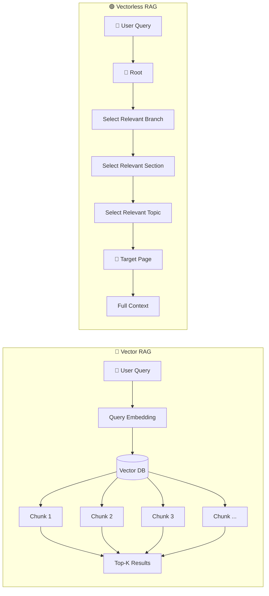

### Mental model

**Vector RAG:**

> Search everywhere and rank by similarity.

**Vectorless RAG:**

> Navigate intelligently and progressively narrow the search.

---

# 3. Example Query

Consider this question:

> **"How do sticky sessions behave during ALB failure?"**

Suppose our document contains:

```text id="y3v6gr"
Distributed Systems Architecture Manual

├── Chapter 1: Networking
│
├── Chapter 2: Load Balancing
│   ├── Section 2.1: CDN Architecture
│   ├── Section 2.2: Session Persistence
│   │   ├── 2.2.1 Cookie-Based Sticky Sessions
│   │   └── 2.2.2 Session Failover & Recovery
│   └── Section 2.3: Traffic Routing
│
└── Chapter 3: Database Replication
```

The correct answer is probably somewhere inside:

```text id="1f9q1p"
Chapter 2
   ↓
Section 2.2
   ↓
Subsection 2.2.2
```

The agent should not need to inspect every page.

---

# 4. Step-by-Step Agentic Tree Traversal

## Step 1 — Evaluate the Root

The LLM first sees the top-level structure.

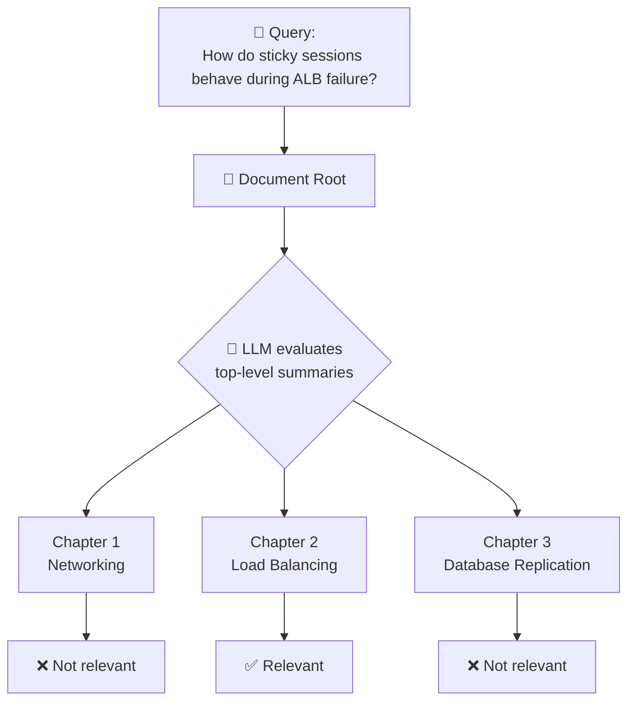

The agent reasons:

```text id="b7r5a1"
Sticky sessions + ALB failure
        ↓
Load Balancing
        ↓
Chapter 2 is relevant
```

So it **prunes** Chapters 1 and 3.

---

# 5. Step 2 — Expand the Relevant Branch

The agent now looks inside Chapter 2.

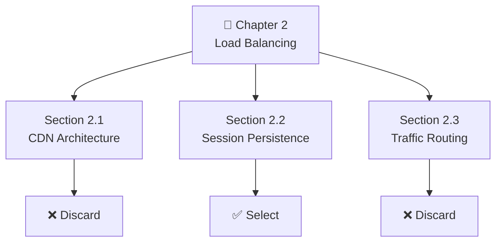

The LLM sees summaries such as:

```text id="v4g5q7"
2.1 CDN Architecture
→ Static asset distribution and edge caching.

2.2 Session Persistence
→ Cookie-based sticky sessions and failover
   behavior during server failures.

2.3 Traffic Routing
→ General request routing and traffic policies.
```

Section 2.2 clearly matches the query.

---

# 6. Step 3 — Continue Down the Tree

The agent expands Section 2.2.

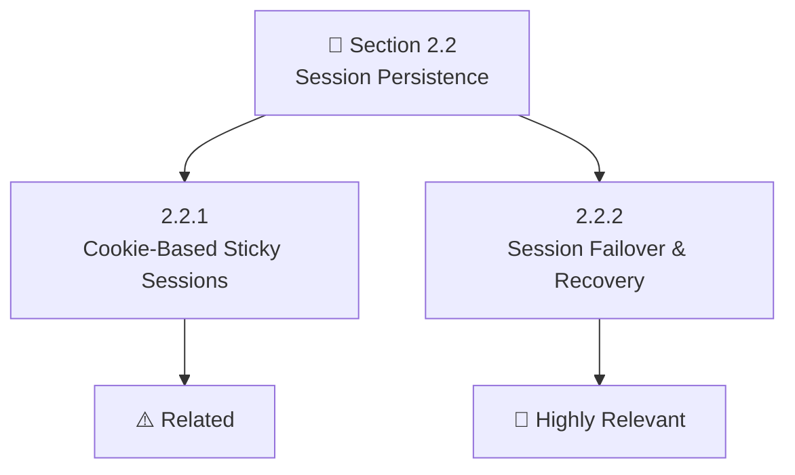

The agent identifies:

```text id="h6q9x3"
2.2.2 Session Failover & Recovery
        ↓
Pages 181–200
```

Now we have reached the target area.

---

# 7. Step 4 — Lazy Load the Actual Content

This is where **lazy loading** becomes important.

The system did **not** load the entire 500-page document into the LLM.

Instead, it first used lightweight metadata:

```text id="2nj5rz"
Chapter summaries
Section summaries
Page ranges
Keywords
Node relationships
```

Only after finding the relevant branch does it load the actual pages.

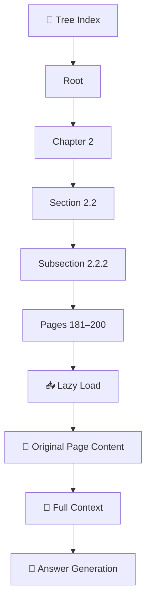

### Traditional approach

```text
Search
 ↓
10 fragmented chunks
 ↓
LLM
```

### Tree approach

```text
Navigate
 ↓
Relevant section
 ↓
1–2 targeted pages
 ↓
Full surrounding context
 ↓
LLM
```

---

# 8. Complete Agentic Tree Search

Putting all steps together:

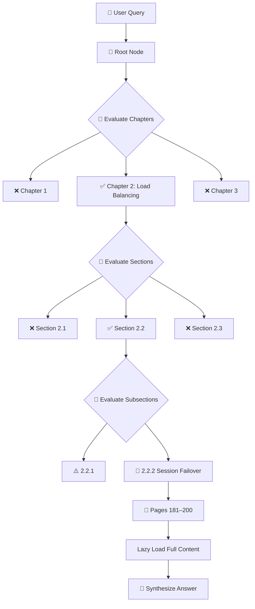

This is **agentic retrieval** because the LLM is actively making retrieval decisions.

---

# 9. Why This Is More Traceable

One major problem with Vector RAG is that the retrieval process can be difficult to explain.

You might get:

```text id="f8s4g2"
Chunk #472
Similarity: 0.814
```

But Vectorless RAG can provide an explicit path:

```text id="0b8j6w"
Document
  ↓
Chapter 2: Load Balancing
  ↓
Section 2.2: Session Persistence
  ↓
Subsection 2.2.2: Session Failover
  ↓
Pages 181–184
```

The retrieval decision becomes much easier to inspect.

---

# 10. Traceable Answer Generation

A Vectorless RAG system can produce an answer together with its navigation path.

### Example

```text id="h3w9z2"
Answer:

When an ALB node fails, session traffic is redirected
according to the documented failover mechanism.

Source:
Distributed Systems Architecture Manual v2

Navigation Path:
Root
 → Chapter 2: Load Balancing
 → Section 2.2: Session Persistence
 → Subsection 2.2.2: Session Failover & Recovery

Pages:
181–184

Node:
sub_2_2_2
```

The important part isn't simply the citation.

It's that the system can explain **how it reached that source**.

---

# 11. Why Hierarchical Context Helps

Consider a query:

> "How does it handle state persistence?"

The word **"it"** is ambiguous.

But if the previous conversation was:

> "How does the ALB maintain user sessions?"

Then the LLM can resolve:

```text id="c8r3m5"
"it"
 ↓
ALB
 ↓
Load Balancing
 ↓
Session Persistence
```

The tree gives the agent a natural place to continue searching.

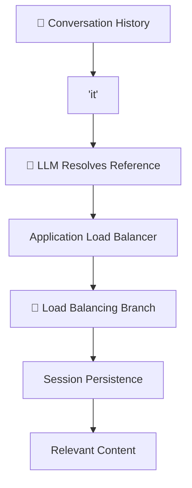

---

# 12. Complex Query: Global Context

Vectorless RAG becomes especially interesting when the query isn't asking about one small piece of information.

### Query

> **"Summarize all high-availability strategies across the entire system."**

A simple vector search might return:

```text id="m0j4k7"
Chunk 12 → High availability
Chunk 89 → High availability
Chunk 203 → HA architecture
Chunk 401 → Availability
Chunk 512 → Failover
```

These are isolated pieces.

The system may miss the **global architecture**.

---

# 13. Tree-Based Global Search

A tree-based system can inspect high-level summaries first.

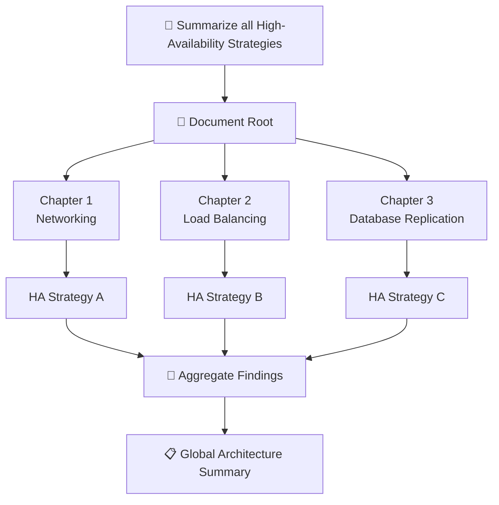

The agent can inspect multiple branches and combine their findings.

---

# 14. Agentic Retrieval Is Not Just "Search"

The important difference is that retrieval becomes a **reasoning process**.

```text id="q6y2r8"
Query
 ↓
Understand intent
 ↓
Inspect root
 ↓
Select branch
 ↓
Inspect children
 ↓
Select section
 ↓
Inspect deeper nodes
 ↓
Find target
 ↓
Load content
 ↓
Reason over content
 ↓
Generate answer
```

So:

> **Retrieval itself becomes an intelligent navigation task.**

---

# 15. The Cost of Agentic Tree Search

There is an important tradeoff.

Vector search can retrieve results with a relatively small number of database operations.

Tree search may require multiple LLM decisions:

```text id="2x7p9k"
Root evaluation
      ↓
Chapter evaluation
      ↓
Section evaluation
      ↓
Subsection evaluation
      ↓
Content evaluation
```

That means:

### More reasoning

but potentially:

### Better retrieval quality and context

Therefore, Vectorless RAG needs **token and latency optimization**.

---

# 16. Optimization #1 — Summary-First Pruning

Don't send the entire content of every node to the LLM.

Instead, send a small summary.

```text id="r3k6m8"
❌ Expensive:

5,000-token section
       ↓
LLM evaluation

✅ Efficient:

50–100 token summary
       ↓
LLM evaluation
```

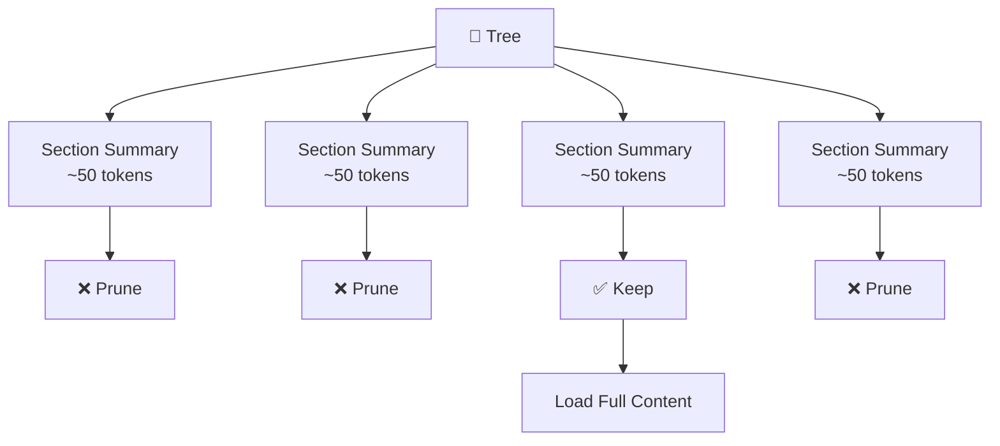

This means the LLM first asks:

> "Is this branch worth exploring?"

Only promising branches are expanded.

---

# 17. Optimization #2 — Parallel Subtree Evaluation

Sibling nodes can often be evaluated concurrently.

Instead of:

```text id="j6p4a8"
Section 1
   ↓
wait

Section 2
   ↓
wait

Section 3
   ↓
wait
```

we can evaluate them in parallel:

```text id="r8m1q4"
Section 1 ──┐
Section 2 ──┼──→ LLM Evaluation
Section 3 ──┘
```

### Architecture

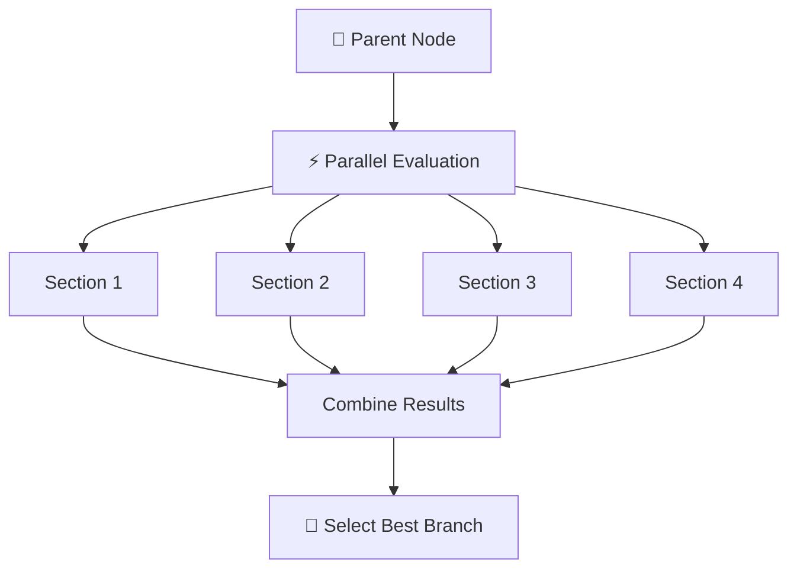

In JavaScript/TypeScript, this can be implemented using concurrency patterns such as:

```text
Promise.all(...)
```

The goal is to reduce **wall-clock latency**.

---

# 18. Optimization #3 — Tree Structure Caching

The document tree usually doesn't need to be generated every time a user asks a question.

It can be created once during indexing.

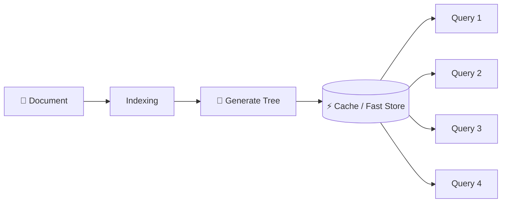

Possible storage options include:

* In-memory cache
* Redis
* SQLite
* PostgreSQL
* JSON files

The important idea:

> **Build the tree once, reuse it for many queries.**

---

# 19. Combined Optimization Strategy

The three techniques work together:

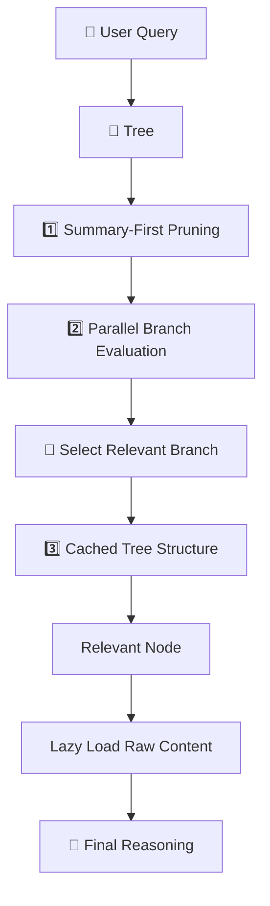

---

# 20. End-to-End Agentic Tree Search

Now we can combine everything:

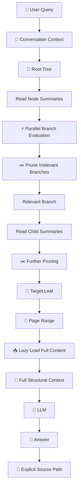

---

# 21. Vector RAG vs Agentic Tree Search

| Aspect           | 🔵 Vector RAG     | 🟢 Agentic Tree Search         |
| ---------------- | ----------------- | ------------------------------ |
| Retrieval method | Similarity search | Hierarchical navigation        |
| Search space     | Flat chunks       | Document tree                  |
| Decision maker   | Similarity metric | LLM                            |
| Context          | Chunk-based       | Structure-aware                |
| Search path      | Often opaque      | Explicit                       |
| Citations        | Retrieved chunks  | Section/page lineage           |
| Complex queries  | Can struggle      | Better suited                  |
| Global queries   | Difficult         | Can traverse multiple branches |
| Cost             | Usually lower     | More LLM calls                 |
| Latency          | Usually lower     | Requires optimization          |
| Explainability   | Moderate          | High                           |

---

# 22. Important Trade-Off

Vectorless RAG is **not automatically better for every use case**.

The trade-off is:

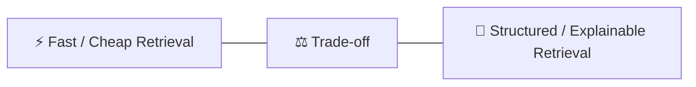

### Vector RAG can be preferable when:

* Documents are relatively simple
* Semantic search is enough
* Very low latency is important
* The knowledge base is highly unstructured

### Vectorless RAG can be preferable when:

* Documents are highly structured
* Exact sections matter
* Page-level traceability matters
* Context preservation is important
* Documents are long and complex
* Explainability is important

---

# 23. The Complete Mental Model

Think of the two systems like two people searching a book.

### 🔵 Vector RAG

```text id="j5p2q9"
Question
   ↓
Search every page for similar language
   ↓
Pick the closest passages
   ↓
Answer
```

### 🟢 Vectorless RAG

```text id="v8k3m6"
Question
   ↓
Open Table of Contents
   ↓
Choose Chapter
   ↓
Choose Section
   ↓
Choose Subsection
   ↓
Open Relevant Pages
   ↓
Read Full Context
   ↓
Answer
```

---

# 🎯 Key Takeaways

Remember these **8 points**:

1. **Agentic Tree Search turns retrieval into a navigation problem.**
2. **The LLM evaluates node summaries and chooses which branches to explore.**
3. **Irrelevant branches can be pruned before loading their raw content.**
4. **Lazy loading retrieves full text only after reaching a relevant node or page range.**
5. **Tree traversal provides an explicit and traceable retrieval path.**
6. **Hierarchical retrieval is particularly useful for long, structured documents and complex queries.**
7. **Summary-first pruning, parallel evaluation, and caching help control token usage and latency.**
8. **Vectorless RAG trades some retrieval simplicity and latency for better structural reasoning, context preservation, and explainability.**

> **Mental Model:**
> **Vector RAG asks, "Which text is similar?"**
> **Agentic Tree Search asks, "Which branch of the knowledge structure should I explore next?"**
