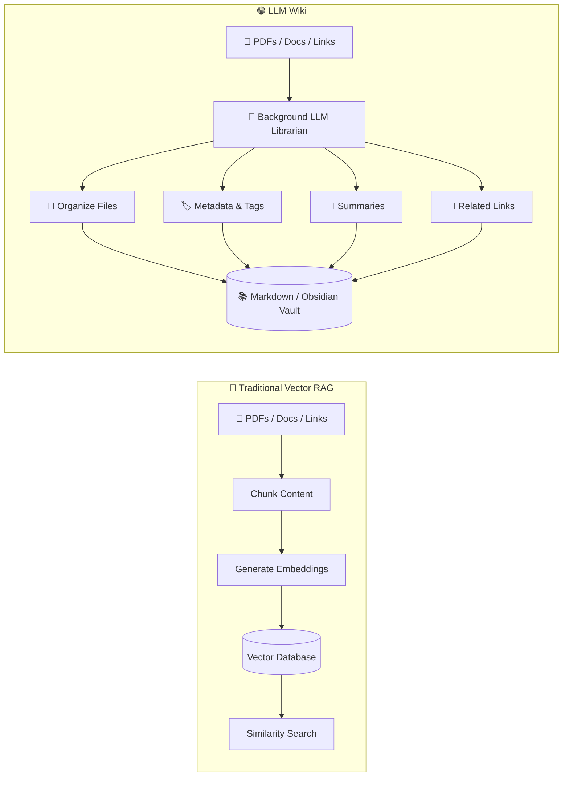
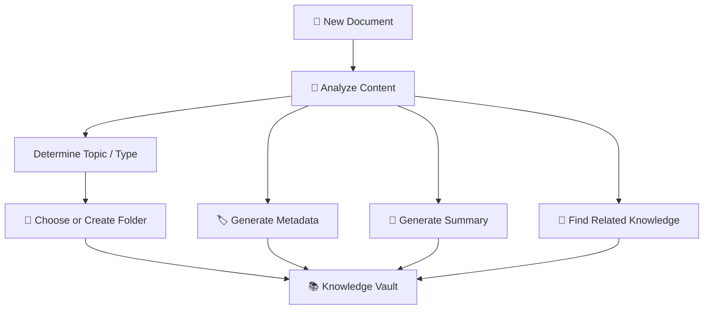
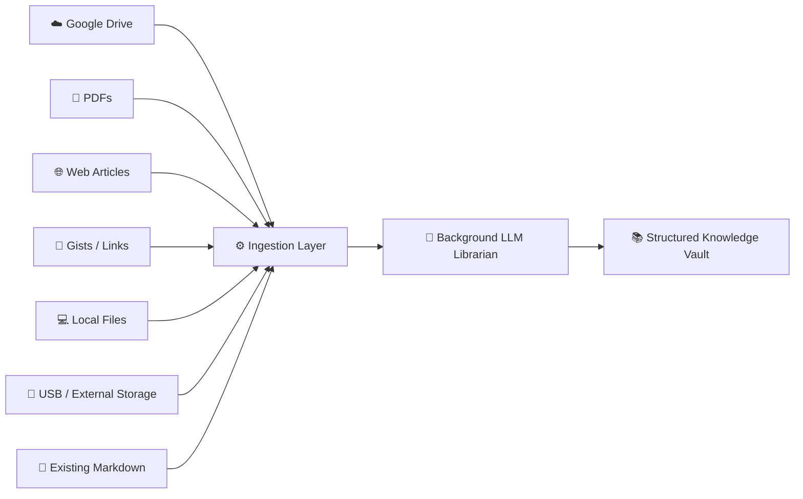
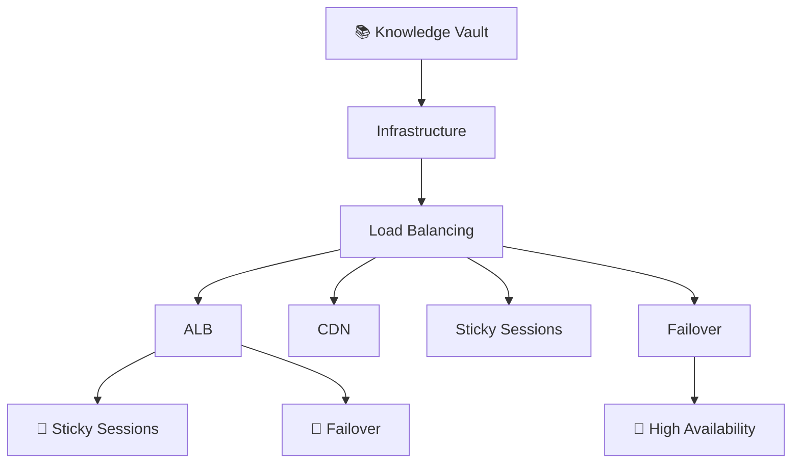
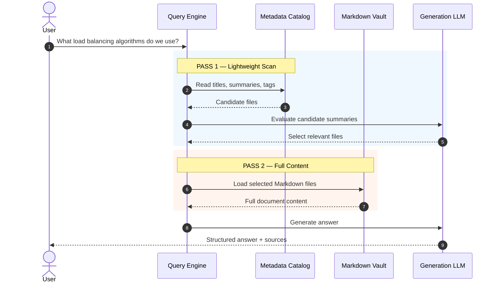
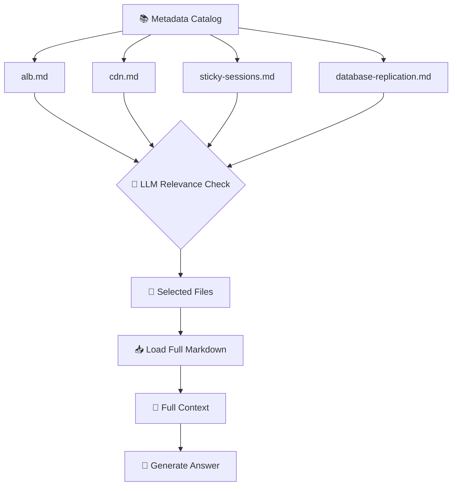
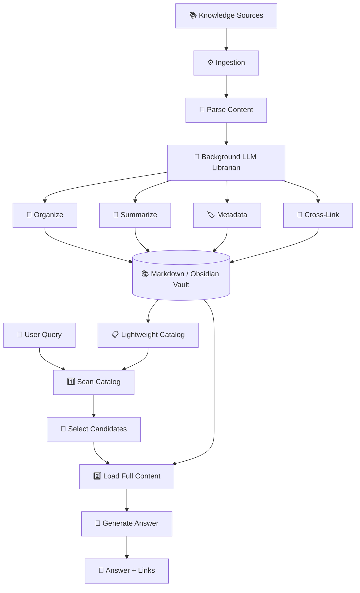
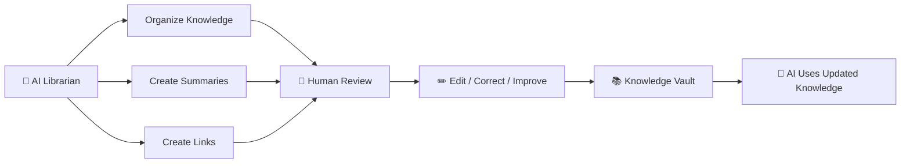

# Day 06 — Vectorless RAG & Hierarchical Knowledge Engines

## 04. LLM Wiki Architecture: Andrej Karpathy's Personal Knowledge Engine

---

## 1. What Is an LLM Wiki?

The **LLM Wiki** concept, discussed by **Andrej Karpathy**, rethinks how we store and retrieve personal or organizational knowledge.

Instead of simply taking documents, converting them into embeddings, and putting those embeddings into a vector database, an **LLM acts like a background librarian**.

Its job is to:

* Read incoming information
* Organize it
* Create summaries
* Add metadata and tags
* Connect related documents
* Maintain a human-readable knowledge base

The result can be a collection of **Markdown files, folders, metadata, and links** that both humans and LLMs can understand.

### Simple Mental Model

> **Vector RAG:** Store content for search.
> **LLM Wiki:** Organize knowledge so it can be understood and maintained.

---

# 2. Vector RAG vs LLM Wiki

The difference can be visualized as:



The key difference is **what happens after the content arrives**.

---

# 3. "Push Content" vs "Update Knowledge"

This is one of the most important ideas.

### 🔵 Vector RAG — Push Content

The typical workflow is:

```text
Document
   ↓
Chunk
   ↓
Embedding
   ↓
Vector Database
```

The system mainly asks:

> **"How can I store this content so I can retrieve similar content later?"**

---

### 🟢 LLM Wiki — Update Knowledge

The workflow becomes:

```text
Document
   ↓
Understand
   ↓
Organize
   ↓
Summarize
   ↓
Tag
   ↓
Link with existing knowledge
   ↓
Update Wiki
```

The system asks:

> **"Where does this information belong in my existing knowledge?"**

---

# 4. A Simple Example

Imagine you download a PDF about **Load Balancing**.

A traditional vector system might create:

```text
PDF
 ↓
500-token chunks
 ↓
Embeddings
 ↓
Vector DB
```

You might end up with something conceptually like:

```text
[0.124, -0.821, 0.442, ...]
[0.731,  0.112, -0.391, ...]
[0.218, -0.552, 0.891, ...]
```

The stored representation is useful for machines but difficult for humans to inspect.

---

An LLM Wiki could instead create:

```text
vault/
│
├── infrastructure/
│   │
│   ├── load-balancing/
│   │   ├── alb.md
│   │   ├── cdn.md
│   │   ├── sticky-sessions.md
│   │   └── failover.md
│   │
│   └── networking/
│       ├── routing.md
│       └── dns.md
│
└── index.md
```

Now the knowledge is:

* Human-readable
* Editable
* Searchable
* Version-controllable
* Easy to inspect

---

# 5. LLM as a Background Librarian

Think of the LLM as a **digital librarian**.

When a new document arrives, the librarian performs several tasks:



For example:

```text
New file:
load-balancing-guide.pdf

        ↓

Topic:
Infrastructure / Load Balancing

        ↓

Target folder:
vault/infrastructure/load-balancing/

        ↓

Generated:
- Title
- Summary
- Tags
- Metadata
- Related documents
```

---

# 6. Heterogeneous Data Ingestion

An LLM Wiki doesn't have to depend on one source.

It can collect knowledge from many places:



This makes the system more like a **personal knowledge operating system** rather than simply a search database.

---

# 7. What Happens When a New File Arrives?

Suppose you add:

```text
alb-failover.pdf
```

The background LLM might process it like this:

### Step 1 — Understand

```text
Topic:
Application Load Balancing
```

### Step 2 — Organize

```text
vault/
└── infrastructure/
    └── load-balancing/
        └── alb-failover.md
```

### Step 3 — Generate Metadata

```yaml
title: ALB Failover
category: infrastructure
tags:
  - load-balancing
  - alb
  - failover
  - high-availability
```

### Step 4 — Generate Summary

```text
Describes ALB failure detection,
traffic redistribution, session persistence,
and recovery mechanisms.
```

### Step 5 — Create Relationships

```text
Related:
→ sticky-sessions.md
→ high-availability.md
→ traffic-routing.md
```

---

# 8. The Knowledge Vault

The resulting structure could look like:



Notice that the structure itself contains useful information.

The **folder hierarchy + metadata + links** become part of the retrieval system.

---

# 9. Two-Pass Retrieval Strategy

One of the most useful ideas is **Two-Pass Retrieval**.

Instead of immediately opening every file, the system first looks at lightweight metadata.

### Pass 1

```text
Search summaries
       ↓
Find candidate files
```

### Pass 2

```text
Open only selected files
       ↓
Read full content
       ↓
Generate answer
```

---

# 10. Two-Pass Retrieval Architecture



---

# 11. Pass 1 — Lightweight Catalog Scan

The first pass should be cheap.

Instead of loading entire files, the system reads:

* File names
* Titles
* Summaries
* Tags
* Categories
* YAML metadata
* Folder paths
* Relationships

For example:

```text
📄 alb.md
Summary: Application Load Balancer architecture...
Tags: alb, load-balancing, routing

📄 cdn.md
Summary: CDN edge caching and static assets...
Tags: cdn, caching

📄 sticky-sessions.md
Summary: Session persistence using cookies...
Tags: sessions, alb, persistence

📄 database-replication.md
Summary: Primary-replica database replication...
Tags: database, replication
```

The LLM can quickly identify:

```text
alb.md
sticky-sessions.md
```

as likely candidates.

---

# 12. Pass 2 — Selective Full-Content Loading

Only after selecting candidates does the system load their complete contents.



This avoids wasting tokens on irrelevant documents.

---

# 13. Why Two-Pass Retrieval Is Efficient

Imagine you have:

```text
1,000 Markdown files
```

Each file contains:

```text
5,000 tokens
```

Loading everything would be extremely expensive.

Instead:

### Pass 1

Read:

```text
1,000 summaries
≈ small amount of text
```

Then identify:

```text
3 relevant files
```

### Pass 2

Load:

```text
3 × full documents
```

So the LLM doesn't need to process the entire knowledge base for every query.

---

# 14. Complete LLM Wiki Workflow



---

# 15. Why Markdown and Obsidian Are Important

A major advantage of this architecture is that the knowledge isn't trapped inside a proprietary database.

The underlying data can simply be:

```text
📁 folders
📄 Markdown files
🏷️ YAML metadata
🔗 Markdown links
```

For example:

```markdown
---
title: ALB Sticky Sessions
tags:
  - load-balancing
  - alb
  - sessions
---

# ALB Sticky Sessions

Sticky sessions allow requests from the same
client to be routed to the same backend instance.

## Related Knowledge

- [[ALB Failover]]
- [[Session Persistence]]
- [[High Availability]]
```

A human can read this.

An LLM can read this.

An IDE can read this.

Git can version it.

---

# 16. Human + AI Collaboration

This creates an interesting workflow:



The human isn't locked out of the system.

You can manually fix:

```text
Wrong summary
Wrong tag
Wrong folder
Missing relationship
Incorrect information
```

and the LLM can use the corrected version later.

---

# 17. Major Benefits

## 1. 💰 Token & Cost Efficiency

The system doesn't repeatedly load every document.

Instead:

```text
Metadata → Filter → Full Content
```

Only relevant information reaches the final LLM context.

---

## 2. 👀 Human Readability

Unlike raw embeddings:

```text
[0.124, -0.82, 0.31, ...]
```

you get:

```text
infrastructure/
└── load-balancing/
    ├── alb.md
    ├── failover.md
    └── sticky-sessions.md
```

Humans can understand and modify the system.

---

## 3. ✏️ Easy Maintenance

Need to correct one fact?

With Markdown:

```text
Open file
   ↓
Edit text
   ↓
Save
```

No need to think about a proprietary vector-store schema.

---

## 4. 🔓 No Vendor Lock-In

The knowledge can live in standard formats:

```text
Markdown
YAML
JSON
Folders
Git
```

You can move the vault between tools without rebuilding your entire knowledge base from scratch.

---

## 5. 🔗 Knowledge Relationships

Because documents can contain explicit links:

```text
ALB
 ↓
Sticky Sessions
 ↓
Session Persistence
 ↓
Failover
 ↓
High Availability
```

the system can build a much richer knowledge structure.

---

# 18. LLM Wiki vs Vector RAG

| Feature          | 🔵 Vector RAG               | 🟢 LLM Wiki                              |
| ---------------- | --------------------------- | ---------------------------------------- |
| Main idea        | Search stored embeddings    | Maintain organized knowledge             |
| Storage          | Vector DB                   | Markdown / Files / Wiki                  |
| Representation   | Embeddings                  | Human-readable documents                 |
| Organization     | Usually external to vectors | Built into folders + metadata            |
| Retrieval        | Similarity search           | Catalog → selective loading              |
| Maintenance      | Re-index / re-embed often   | Edit files directly                      |
| Human-readable   | ❌                           | ✅                                        |
| Cross-links      | Usually additional logic    | Native Markdown links                    |
| Vendor lock-in   | Potentially higher          | Low                                      |
| Token efficiency | Depends on retrieval        | Strong with two-pass retrieval           |
| Best suited for  | Semantic search             | Structured personal/enterprise knowledge |

---

# 19. The Bigger Idea

The LLM Wiki isn't simply another RAG implementation.

It's a different philosophy:

```text
Traditional RAG
      ↓
Store information
      ↓
Search information
      ↓
Generate answer
```

Whereas:

```text
LLM Wiki
      ↓
Understand information
      ↓
Organize information
      ↓
Connect information
      ↓
Maintain knowledge
      ↓
Retrieve relevant knowledge
      ↓
Generate answer
```

The LLM becomes more than a **retrieval component**.

It becomes a **knowledge librarian**.

---

# 🎯 Key Takeaways

Remember these **7 points**:

1. **LLM Wiki treats the LLM as a background librarian that organizes knowledge.**
2. **Instead of only pushing content into a vector database, the system continuously updates a structured knowledge base.**
3. **Markdown, folders, metadata, and links make the knowledge human-readable and editable.**
4. **Heterogeneous sources such as PDFs, Drive documents, web pages, and local files can be unified into one vault.**
5. **Two-Pass Retrieval first scans lightweight metadata and summaries, then loads only the relevant full documents.**
6. **This can significantly reduce unnecessary context, token usage, and retrieval overhead.**
7. **The biggest advantage is that the knowledge remains understandable and maintainable by both humans and AI.**

> **Mental Model:**
> 📦 **Vector RAG:** *Store content → Search similar chunks → Answer*
>
> 📚 **LLM Wiki:** *Understand → Organize → Connect → Maintain → Retrieve → Answer*
