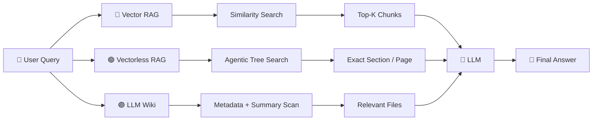
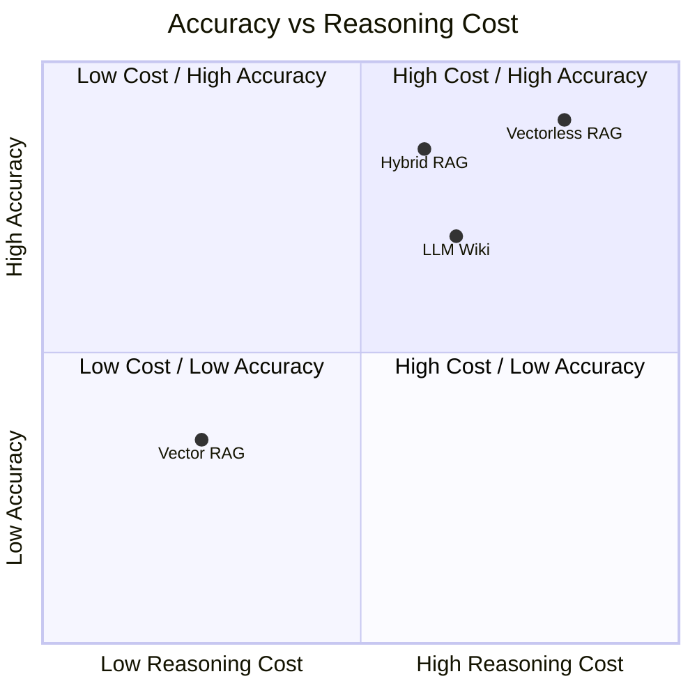
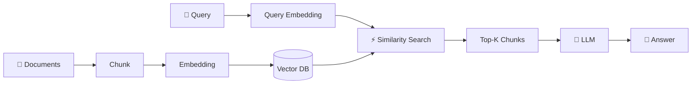
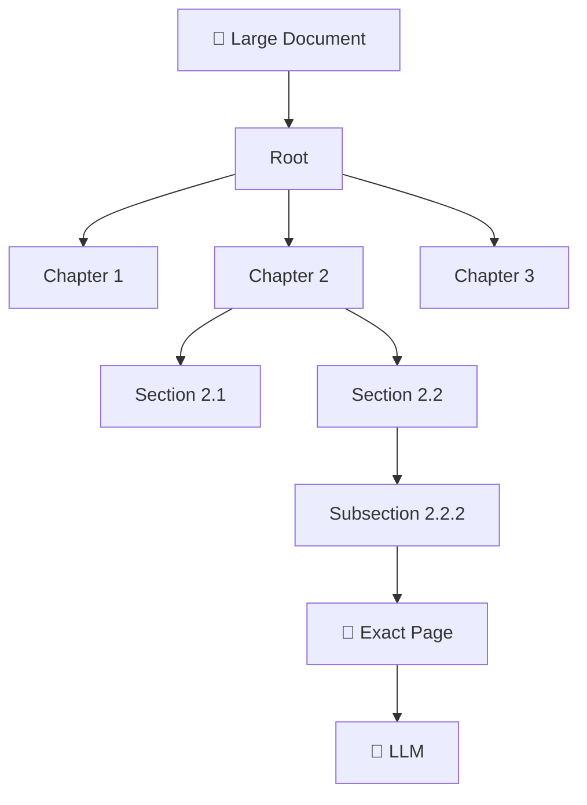
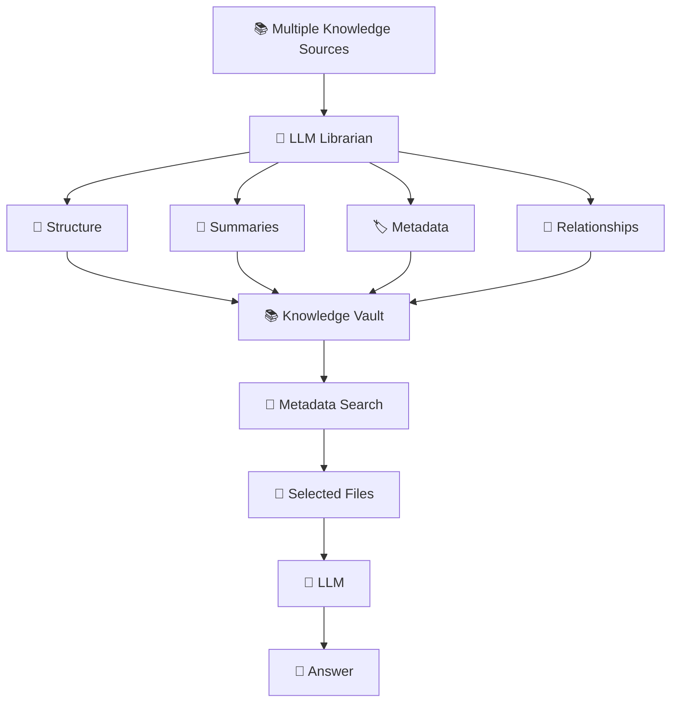
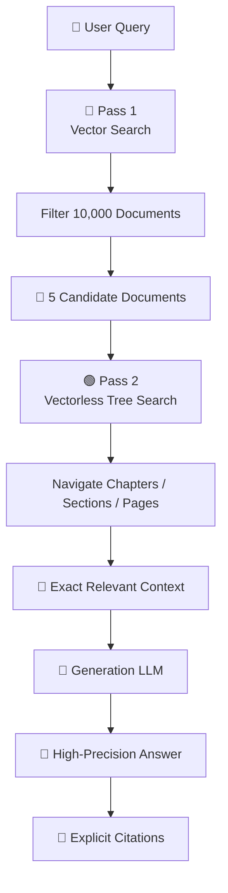
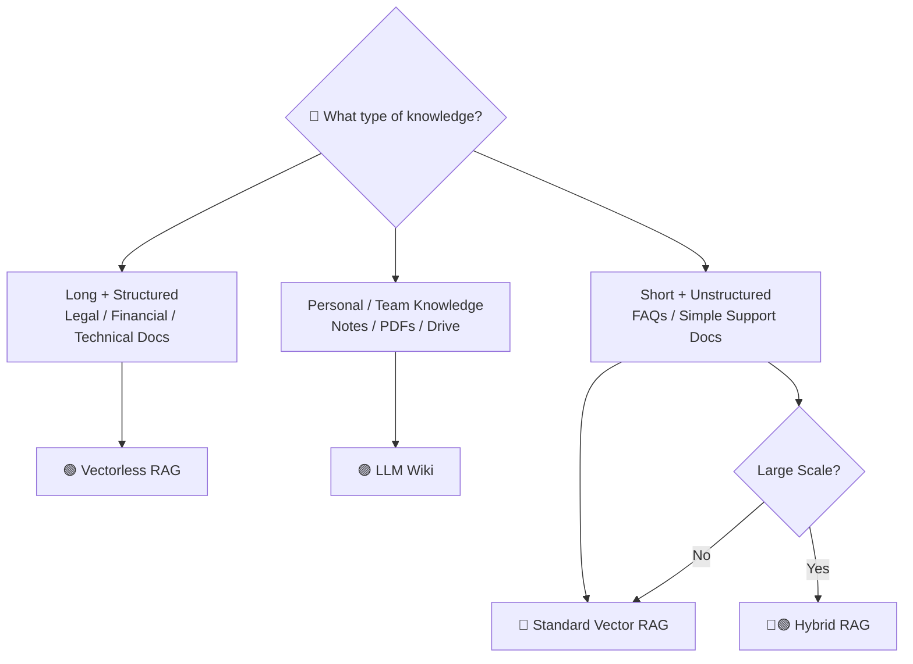
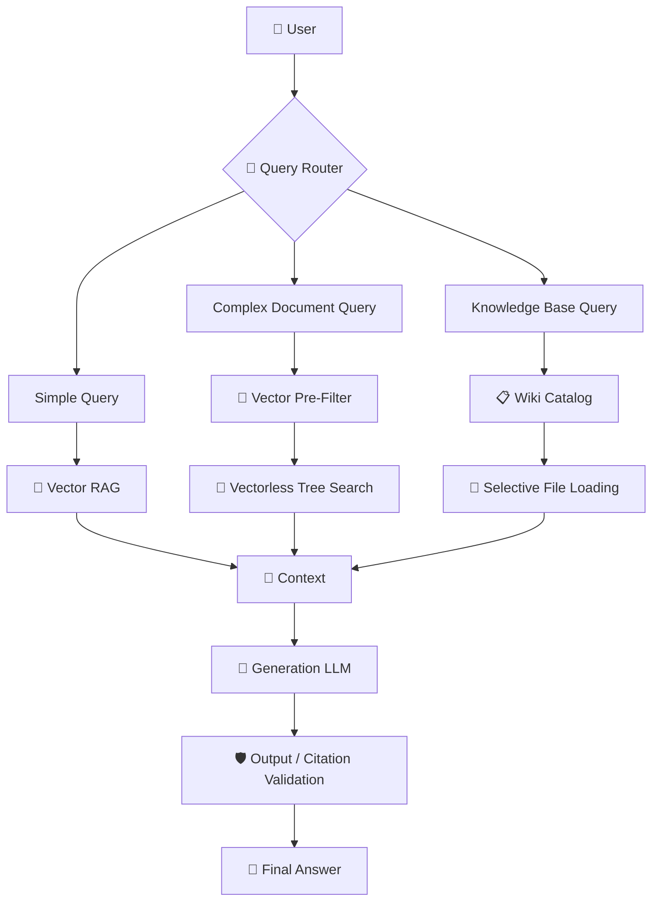
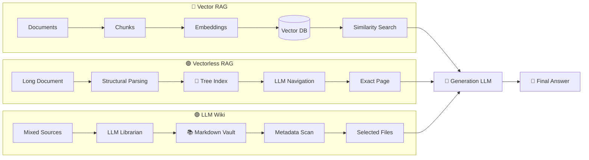

# Day 06 — Vectorless RAG & Hierarchical Knowledge Engines

## 05. Vector RAG vs. Vectorless RAG: Comparative Matrix & System Design

After understanding **Vector RAG, Vectorless RAG, Agentic Tree Search, and LLM Wiki**, the final step is knowing **when to use each architecture**.

There is no single RAG architecture that is best for every problem.

The right choice depends on:

* Document structure
* Retrieval accuracy requirements
* Latency
* Token budget
* Explainability
* Maintenance requirements

---

# 1. Architecture Comparison

At a high level:



Each architecture solves a slightly different problem.

---

# 2. Detailed Comparison Matrix

| Evaluation Axis    | 🔵 Vector RAG              | 🟢 Vectorless RAG          | 🟣 LLM Wiki                  |
| ------------------ | -------------------------- | -------------------------- | ---------------------------- |
| **Data Structure** | Flat vector space          | Hierarchical tree          | Files + folders + metadata   |
| **Indexing Unit**  | Fixed token chunks         | Sections, chapters, pages  | Files & knowledge nodes      |
| **Retrieval**      | Vector similarity          | LLM tree navigation        | Metadata → selective loading |
| **Search Logic**   | Mathematical similarity    | Reasoning-based navigation | Catalog-based filtering      |
| **Context**        | Chunk-level                | Hierarchical               | Full selected file           |
| **Explainability** | Similarity score           | Tree path                  | File path / links            |
| **Indexing Cost**  | Low                        | Medium                     | Medium                       |
| **Query Cost**     | Low                        | Medium–High                | Low–Medium                   |
| **Maintenance**    | Re-embedding may be needed | Update tree metadata       | Edit Markdown directly       |
| **Best For**       | Simple / unstructured data | Long structured documents  | Personal / team knowledge    |

---

# 3. The Three Architectures as Mental Models

### 🔵 Vector RAG

> **"Find text that is semantically similar to my question."**

```text id="w5p8q1"
Query
 ↓
Embedding
 ↓
Vector Search
 ↓
Top-K Chunks
 ↓
LLM
```

---

### 🟢 Vectorless RAG

> **"Navigate the document structure until I find the exact information."**

```text id="m8k2r6"
Query
 ↓
Root
 ↓
Chapter
 ↓
Section
 ↓
Subsection
 ↓
Page
 ↓
LLM
```

---

### 🟣 LLM Wiki

> **"Organize my knowledge first, then retrieve from the organized knowledge base."**

```text id="a4n7v2"
Sources
 ↓
LLM Librarian
 ↓
Folders + Markdown + Metadata
 ↓
Summary Search
 ↓
Selected Files
 ↓
LLM
```

---

# 4. Cost vs. Accuracy Trade-Off

Different architectures make different trade-offs.



The exact position depends heavily on the implementation, model, corpus, and workload, but the conceptual trade-off is important:

> **More reasoning can improve retrieval quality, but reasoning costs tokens and latency.**

---

# 5. 🔵 Vector RAG — Low-Cost Retrieval

Vector RAG is attractive because retrieval is relatively fast.

The general pipeline is:



### Strengths

* Fast retrieval
* Relatively low query cost
* Easy to implement
* Excellent for semantic search
* Works well with large numbers of relatively simple documents

### Weaknesses

* Chunking can destroy context
* Similarity doesn't always mean relevance
* Structural relationships can be lost
* Complex multi-hop queries can be difficult
* Retrieval reasoning can be difficult to explain

---

# 6. 🟢 Vectorless RAG — Structure-Aware Retrieval

Vectorless RAG replaces the flat vector search space with a structured tree.



### Strengths

* Preserves document hierarchy
* Better context preservation
* Explicit navigation path
* Useful page/section citations
* Strong for complex professional documents

### Weaknesses

* Requires more LLM reasoning
* Can increase token usage
* Can increase query latency
* Tree construction requires additional indexing work

---

# 7. 🟣 LLM Wiki — Knowledge Organization First

LLM Wiki takes the idea one step further.

Instead of thinking only about retrieval, it focuses on **maintaining an organized knowledge system**.



### Strengths

* Human-readable
* Easy to edit
* Easy to inspect
* Excellent for personal knowledge bases
* Works well with heterogeneous sources
* Low vendor lock-in

### Weaknesses

* Requires an organization/indexing layer
* Background LLM processing can cost tokens
* Maintaining relationships and metadata can become complex at scale

---

# 8. Why Hybrid RAG Can Be Powerful

In large enterprise systems, you don't necessarily need to choose **only one** technique.

You can combine them.

For example:

> **Vector RAG for broad filtering + Vectorless RAG for precise navigation.**

This gives you the benefits of both approaches.

---

# 9. Hybrid RAG Architecture

Imagine an enterprise has:

```text
10,000 documents
```

Searching every document using expensive LLM tree traversal would be inefficient.

Instead:

### Pass 1 — Vector Filtering

Use vector search to quickly reduce:

```text
10,000 documents
       ↓
5 candidate documents
```

### Pass 2 — Tree Search

Use Vectorless RAG to deeply inspect those 5 documents.



---

# 10. Why Hybrid RAG Works

The two systems have different strengths.

### Vector RAG is good at:

```text
10,000 documents
       ↓
Fast broad filtering
```

### Vectorless RAG is good at:

```text
5 documents
       ↓
Deep structural reasoning
       ↓
Exact section
       ↓
Exact page
```

So instead of asking the expensive tree search to inspect everything:

> **Use cheap retrieval to narrow the search space first.**

---

# 11. Hybrid RAG: End-to-End Example

Suppose the user asks:

> **"What is our session failover strategy for Application Load Balancers?"**

The enterprise knowledge base contains 10,000 documents.

### Step 1

Vector search finds:

```text
1. Load Balancing Architecture.pdf
2. ALB Configuration Manual.pdf
3. Session Management Guide.pdf
4. Infrastructure HA.pdf
5. Traffic Routing Handbook.pdf
```

### Step 2

The Vectorless engine creates a tree view of these documents.

### Step 3

The agent navigates:

```text
Load Balancing Architecture
        ↓
Chapter 2: Load Balancing
        ↓
Section 2.2: Session Persistence
        ↓
Section 2.2.2: Failover
        ↓
Pages 181–184
```

### Step 4

The LLM answers using the exact context.

---

# 12. Decision Matrix

The easiest way to select an architecture is to ask:

> **"What type of knowledge am I working with?"**



---

# 13. When Should You Choose Vector RAG?

Choose **Vector RAG** when:

* Documents are relatively short
* Content is mostly unstructured
* Semantic similarity works well
* Very low latency is important
* Query volume is extremely high
* Token budget is limited
* Exact document hierarchy isn't critical

### Examples

```text
Customer FAQs
Product descriptions
Simple documentation
Support tickets
Short knowledge articles
```

---

# 14. When Should You Choose Vectorless RAG?

Choose **Vectorless RAG / PageIndex-style retrieval** when:

* Documents are long
* Documents have strong hierarchy
* Section context matters
* Exact page references matter
* Structural relationships are important
* You need highly traceable retrieval
* You're working with professional documents

### Examples

```text
📑 Legal contracts
💰 Financial reports / 10-Ks
🏗️ Engineering manuals
💻 Architecture documentation
📚 Technical books
🏥 Medical literature
```

---

# 15. When Should You Choose an LLM Wiki?

Choose an **LLM Wiki architecture** when your primary goal is to build a **living knowledge base**.

It works especially well for:

```text
👤 Personal Knowledge Management
👥 Team Knowledge Bases
📚 Research Notes
📝 Documentation
💻 Engineering Wikis
📂 Mixed Local + Cloud Knowledge
```

For example:

```text
Google Drive
      +
PDFs
      +
Markdown
      +
Web Articles
      +
Personal Notes
      ↓
🤖 LLM Librarian
      ↓
📚 Organized Knowledge Vault
```

---

# 16. Quick Decision Table

| Your Requirement                   | Recommended Architecture |
| ---------------------------------- | ------------------------ |
| Simple semantic search             | 🔵 Vector RAG            |
| Very low latency                   | 🔵 Vector RAG            |
| Huge query volume                  | 🔵 Vector RAG            |
| Long structured manuals            | 🟢 Vectorless RAG        |
| Legal / financial documents        | 🟢 Vectorless RAG        |
| Exact page/section citations       | 🟢 Vectorless RAG        |
| Personal knowledge base            | 🟣 LLM Wiki              |
| Team documentation                 | 🟣 LLM Wiki              |
| Mixed Drive/PDF/Markdown knowledge | 🟣 LLM Wiki              |
| Large enterprise + high accuracy   | 🔵🟢 Hybrid RAG          |

---

# 17. The Bigger Architecture: Production RAG

In real production systems, you don't necessarily have to choose a single technique.

A sophisticated system could look like:



This is closer to how a **production-grade knowledge engine** can be designed: use the cheapest suitable retrieval mechanism first, and escalate to deeper reasoning only when needed.

---

# 18. One Important Correction to the "Zero Hallucination" Idea

Vectorless RAG can **reduce retrieval-related errors**, but it does **not guarantee zero hallucinations**.

Even if the system retrieves the perfect page:

```text
Perfect Retrieval
       ↓
      LLM
       ↓
Possible Hallucination
```

The LLM can still misunderstand or invent information.

So a production system should combine good retrieval with:

* Source citations
* Grounded generation
* Output validation
* Confidence checks
* Guardrails
* Human review for high-risk domains

The goal is therefore:

> **Better retrieval ≠ guaranteed truthful generation.**

---

# 19. Final Architecture Comparison



---

# 🎯 Final Takeaways

Remember these **10 points**:

1. **Vector RAG is optimized for fast semantic retrieval.**
2. **Vectorless RAG is optimized for structural and context-aware retrieval.**
3. **LLM Wiki focuses on organizing and maintaining knowledge rather than only searching it.**
4. **Vector RAG works well for short, relatively unstructured content.**
5. **Vectorless RAG is particularly useful for long, highly structured professional documents.**
6. **LLM Wiki is useful for personal and team knowledge systems.**
7. **Hybrid RAG can combine vector search for broad filtering with tree search for precise retrieval.**
8. **More LLM reasoning can improve retrieval quality but increases token usage and latency.**
9. **Better retrieval reduces hallucination risk but does not eliminate hallucinations.**
10. **Production systems should choose or combine retrieval strategies based on the actual workload rather than assuming one RAG architecture fits everything.**

> ### 🧠 The Ultimate Mental Model
>
> **🔵 Vector RAG:**
> **"Find similar content."**
>
> **🟢 Vectorless RAG:**
> **"Navigate to the right place."**
>
> **🟣 LLM Wiki:**
> **"Organize knowledge so the right information is easier to find."**
>
> **🔵🟢 Hybrid RAG:**
> **"Search broadly first, then reason deeply where it matters."**
