# 📚 Week 03 Day 06 — Vectorless RAG & Hierarchical Knowledge Engines

> **Core idea:** Traditional Vector RAG searches *chunks by similarity*. Vectorless RAG searches *document structure by reasoning*. LLM Wiki systems go one step further by treating your knowledge base like an organized, continuously maintained library.

---

## 🧭 What You Will Learn

1. **Why Vector RAG struggles with complex documents**
2. **How Vectorless RAG uses hierarchical tree indexing**
3. **How an LLM performs agentic tree search**
4. **How the LLM Wiki concept organizes knowledge**
5. **Vector RAG vs Vectorless RAG vs LLM Wiki**
6. **How to implement these ideas using JavaScript / Node.js**

---

# 01. 🚧 Limitations of Vector RAG & Abrupt Chunking

## 1. How Traditional Vector RAG Works

Traditional RAG converts documents into embeddings and stores those embeddings in a vector database.

### Basic Architecture

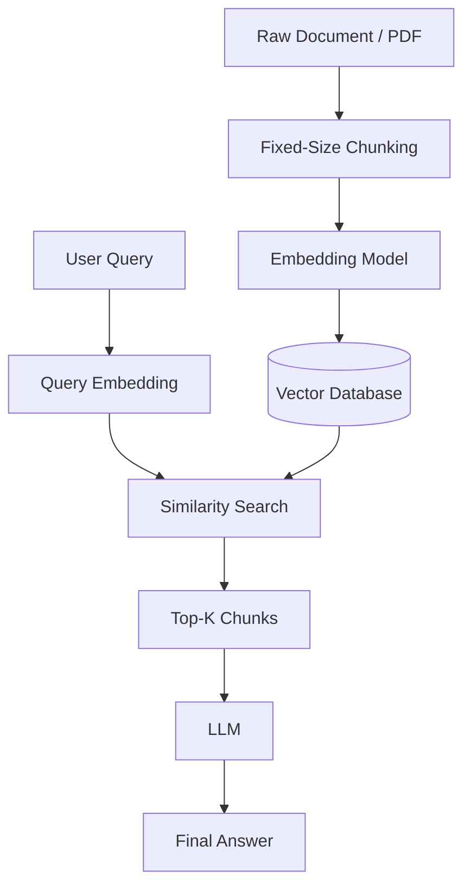

For example:

```text
PDF
 ↓
500-token chunks
 ↓
Embeddings
 ↓
Vector DB
 ↓
Similarity Search
 ↓
Top-K chunks
 ↓
LLM
```

This works well for **small and relatively simple documents**.

But problems appear when documents are:

* 📚 Very long
* 🏛️ Highly structured
* ⚖️ Legal
* 💰 Financial
* 🏗️ Technical
* 🩺 Medical
* 📖 Textbooks

---

## 2. The Abrupt Chunking Problem

A common strategy is:

```text
Chunk Size = 500 tokens
Overlap   = 50 tokens
```

The problem is that **documents are not naturally organized into 500-token blocks**.

For example:

```text
Section 3.2 — Load Balancing

The system uses two distribution tiers:
CDNs and Application Load Balancers.

High-volume static assets are served by
CDN edge nodes.

---------- CHUNK BOUNDARY ----------

For dynamic user sessions, the ALB uses
sticky sessions based on encrypted cookies.

If session persistence fails, requests
fallback to round-robin routing...
```

The chunk boundary can split a logical idea.

### ❌ What gets lost?

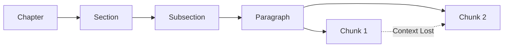

The second chunk may contain:

> "The ALB uses sticky sessions..."

But the chunk may no longer tell the LLM:

* Which chapter?
* Which section?
* What is the ALB?
* What problem is being discussed?
* What was explained previously?

---

## 3. Three Major Problems with Chunking

### ① Loss of Hierarchical Context

A chunk becomes an isolated piece of text.

```text
Original:

Chapter 2
 └── Load Balancing
      └── Session Persistence
           └── Sticky Sessions
                └── Failover
```

Vector RAG may retrieve only:

```text
"Sticky sessions use encrypted cookies..."
```

The parent hierarchy is missing.

---

### ② Semantic Boundary Fragmentation

Logical units don't necessarily fit into fixed token windows.

A chunk can split:

* Sentences
* Paragraphs
* Tables
* Arguments
* Procedures
* Code examples

This can make the retrieved content incomplete.

---

### ③ Dangling References

Technical documents frequently use:

```text
"This mechanism..."
"It..."
"As discussed above..."
"This configuration..."
"The previous method..."
```

If the previous context is in another chunk, the retrieved chunk may not explain what **"it"**, **"this mechanism"**, or **"previous method"** refers to.

---

# 4. Similarity ≠ Relevance

This is one of the most important concepts.

> **Semantic similarity does not always mean contextual relevance.**

```text
Vector Similarity ≠ Contextual Relevance
```

### Example

User asks:

```text
How does ALB sticky-session failover work?
```

Vector search might retrieve:

```text
CDN caching
Load balancing
Traffic distribution
HTTP routing
```

These topics are **similar**, but they may not actually answer the question.

### Comparison

| Problem                  | What Happens                                                             |
| ------------------------ | ------------------------------------------------------------------------ |
| Similar but irrelevant   | Similar terminology, wrong answer                                        |
| Relevant but not similar | Correct information uses different terminology                           |
| Contextual inversion     | Retrieved text contains keywords but gives opposite/negative information |

---

# 5. "Vibe Retrieval" & Opaque Scores

Vector databases typically return similarity scores such as:

```text
Chunk #47 → 0.82
Chunk #12 → 0.79
Chunk #31 → 0.76
```

But what does `0.82` actually mean?

It doesn't directly tell us:

* Why was this chunk selected?
* Which section does it belong to?
* Is the information complete?
* Is the answer supported by surrounding context?
* Why was chunk #47 better than #12?

This creates what can be called **"vibe retrieval"**:

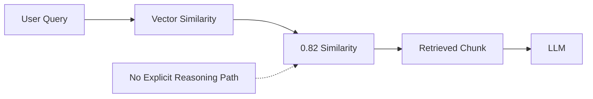

---

# 6. Why This Matters in Professional Documents

The consequences can be serious.

### 💰 Financial Documents

A table split incorrectly could separate:

```text
Revenue | Expenses | Liabilities
```

and lead to incorrect interpretation.

### ⚖️ Legal Documents

A contract clause may depend on definitions several pages earlier.

### 🏗️ Technical Manuals

A configuration step may depend on prerequisites described in another section.

---

# 02. 🌳 Vectorless RAG & Tree-Structured Indexing

## 1. What is Vectorless RAG?

**Vectorless RAG** changes the retrieval strategy.

Instead of:

```text
Document
 ↓
Chunks
 ↓
Embeddings
 ↓
Vector DB
 ↓
Similarity Search
```

we create:

```text
Document
 ↓
Structural Parsing
 ↓
Hierarchical Tree
 ↓
LLM Navigation
 ↓
Exact Content
```

Systems such as **PageIndex** follow this general idea.

[PageIndex](https://vectify.ai/pageindex?utm_source=chatgpt.com)

---

## 2. The Paradigm Shift

Think about how a human searches a 500-page technical book.

They don't:

> Randomly shuffle 5,000 pieces of the book and search for similar pieces.

Instead:

```text
Table of Contents
      ↓
Chapter
      ↓
Section
      ↓
Subsection
      ↓
Page
      ↓
Relevant paragraph
```

Vectorless RAG follows a similar approach.

---

## 3. Vector RAG vs Vectorless RAG

| Feature        | Vector RAG               | Vectorless RAG            |
| -------------- | ------------------------ | ------------------------- |
| Index          | Vector space             | Tree                      |
| Unit           | Fixed chunks             | Sections/pages            |
| Retrieval      | Similarity               | LLM reasoning             |
| Context        | Chunk-based              | Hierarchical              |
| Explainability | Similarity score         | Navigation path           |
| Storage        | Vector DB                | JSON / SQLite / Graph     |
| Best for       | Simple/unstructured data | Long structured documents |

---

# 4. Hierarchical Document Tree

Suppose we have a 500-page systems manual.

We can represent it as:

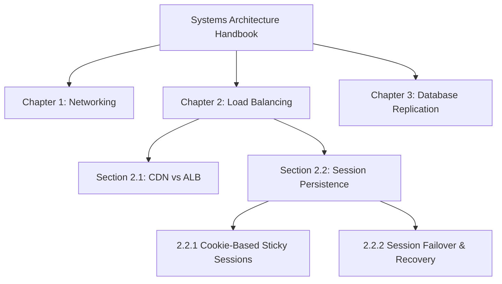

Now the system understands **where information lives**.

---

# 5. Anatomy of a Tree Node

Each node can contain metadata like:

```json
{
  "node_id": "sec_2_2",
  "title": "Session Persistence & Sticky Sessions",
  "level": 2,
  "page_range": [161, 200],
  "parent_id": "ch_2",
  "children_ids": [
    "sub_2_2_1",
    "sub_2_2_2"
  ],
  "summary": "Covers sticky sessions, session persistence and failover behavior.",
  "keywords": [
    "sticky sessions",
    "ALB",
    "session persistence",
    "failover"
  ],
  "source_file": "systems_manual.pdf"
}
```

### Important Metadata

* `node_id` → Unique identifier
* `title` → Section title
* `parent_id` → Parent location
* `children_ids` → Child sections
* `page_range` → Exact location
* `summary` → Compact explanation
* `keywords` → Important concepts
* `source_file` → Original document

---

# 6. Indexing Workflow

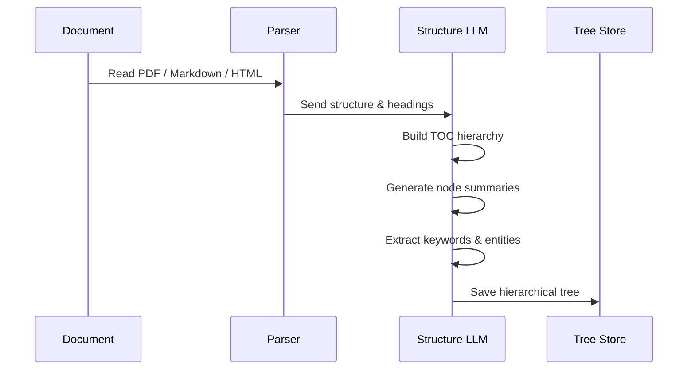

### In Simple Terms

```text
Document
   ↓
Understand structure
   ↓
Build TOC
   ↓
Create tree
   ↓
Generate summaries
   ↓
Store metadata
```

The important point is:

> **Raw content does not need to be loaded during every retrieval step.**

It can be **lazy-loaded** only when needed.

---

# 03. 🤖 Agentic Tree Search & LLM Relevance Retrieval

## 1. How Does Retrieval Work?

Instead of asking:

> "Which chunks are mathematically closest?"

we ask the LLM:

> "Which branch of the document is most relevant to this question?"

This resembles decision-tree traversal and is conceptually related to tree-search ideas such as MCTS.

---

## 2. Example Query

```text
How do sticky sessions behave during ALB failure?
```

The LLM can navigate:

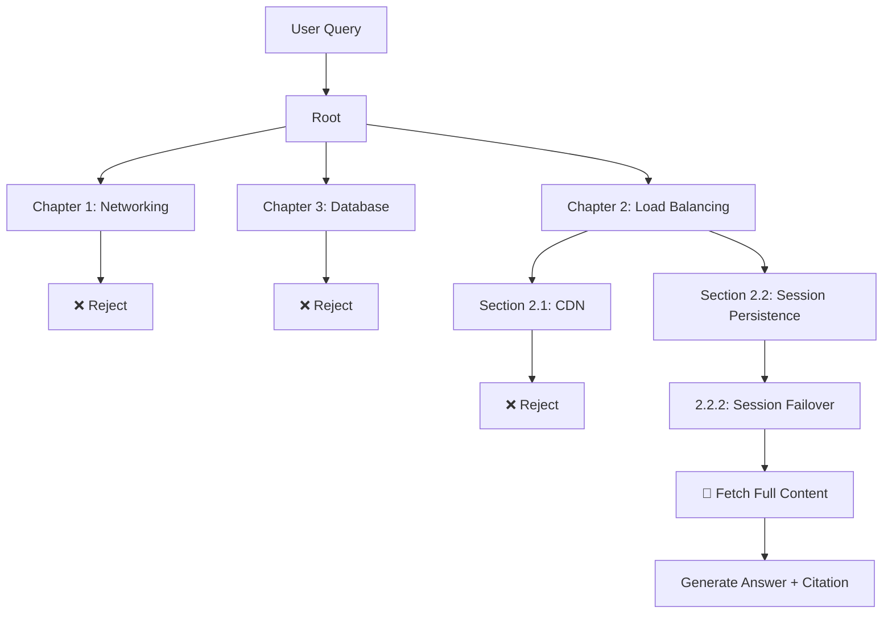

---

# 3. Three-Step Tree Traversal

### Step 1 — Inspect the Root

The LLM sees:

```text
Chapter 1 → Networking
Chapter 2 → Load Balancing
Chapter 3 → Database
```

It decides:

```text
Chapter 2 is relevant.
```

---

### Step 2 — Expand the Relevant Branch

Now it sees:

```text
2.1 CDN vs ALB
2.2 Session Persistence
2.3 Traffic Control
```

It chooses:

```text
2.2 Session Persistence
```

---

### Step 3 — Fetch the Exact Content

Finally:

```text
2.2.2 Session Failover
Pages 181–184
```

Only now is the actual page content loaded.

This is **lazy loading**.

---

# 4. Why Lazy Loading Matters

Instead of sending:

```text
10,000 chunks
```

or an entire 500-page document to the LLM, the system can do:

```text
Tree summaries
     ↓
Select branch
     ↓
Select section
     ↓
Load 2–4 relevant pages
```

This preserves context while avoiding unnecessary raw-text loading.

---

# 5. Traceable Retrieval

One major advantage is explainability.

Instead of:

```text
Similarity Score: 0.82
```

the system can say:

```text
Source:
Systems Architecture Manual

Path:
Root
 → Chapter 2: Load Balancing
 → Section 2.2: Session Persistence
 → Subsection 2.2.2: Session Failover

Pages:
181–184
```

The retrieval process becomes much easier to inspect and debug.

---

# 6. Token Optimization

Tree-based retrieval introduces additional LLM reasoning, so optimization matters.

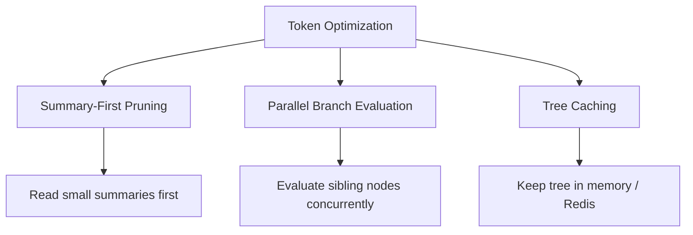

### Summary-First Pruning

Instead of reading:

```text
5,000 tokens
```

the LLM first reads:

```text
50–100 token summary
```

and decides whether the branch is worth exploring.

### Parallel Evaluation

Multiple sibling nodes can potentially be evaluated concurrently.

In JavaScript:

```javascript
await Promise.all([
  evaluateNode(chapter1),
  evaluateNode(chapter2),
  evaluateNode(chapter3)
]);
```

### Tree Caching

The tree is created during indexing and can be cached so every query doesn't rebuild it.

---

# 04. 📖 LLM Wiki Architecture — Karpathy Model

## 1. What is an LLM Wiki?

The **LLM Wiki** concept, associated with Andrej Karpathy, treats an LLM like a **background librarian**.

Instead of simply pushing information into a vector database, the LLM continuously organizes knowledge into human-readable files.

[Karpathy's LLM Wiki concept](https://gist.github.com/karpathy/442a6bf555914893e9891c11519de94f?utm_source=chatgpt.com)

---

## 2. Push Content vs Maintain Knowledge

### Traditional Vector RAG

```text
PDF
 ↓
Chunks
 ↓
Embeddings
 ↓
Vector DB
```

### LLM Wiki

```text
PDF / Drive / Web / USB
          ↓
   Background LLM
          ↓
 Organize Knowledge
          ↓
 Markdown / Obsidian
          ↓
 Metadata + Links
```

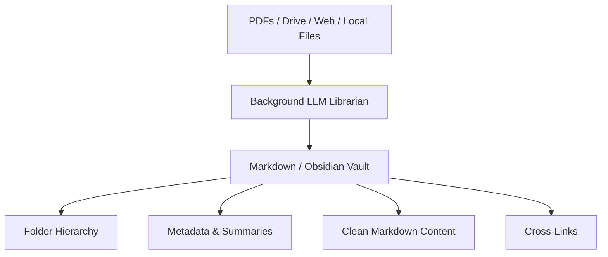

---

# 3. Heterogeneous Data Sources

An LLM Wiki can combine:

* Google Drive documents
* PDFs
* Web articles
* Git repositories
* Markdown files
* Local files
* Notes

The librarian can:

1. Understand the content
2. Decide where it belongs
3. Generate metadata
4. Create summaries
5. Add tags
6. Create links to related knowledge

---

# 4. Two-Pass Retrieval

This is one of the most important ideas.

Instead of opening every file, the system works in two passes.

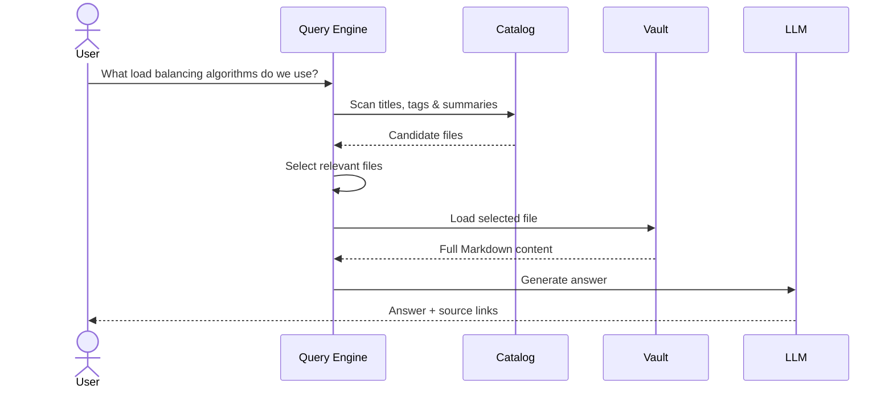

### Pass 1 — Lightweight Scan

Read only:

```text
Filename
Title
Tags
Summary
Metadata
```

No heavy document loading.

### Pass 2 — Selective Loading

Open only the selected files.

```text
100 files
 ↓
Metadata scan
 ↓
2 relevant files
 ↓
Load full content of 2 files
 ↓
LLM
```

This can significantly reduce unnecessary context.

---

# 05. ⚔️ Vector RAG vs Vectorless RAG vs LLM Wiki

| Feature        | Vector RAG                | Vectorless RAG        | LLM Wiki                |
| -------------- | ------------------------- | --------------------- | ----------------------- |
| Index          | Vector space              | Hierarchical tree     | Markdown/files          |
| Indexing unit  | Fixed chunks              | Sections/pages        | Documents/files         |
| Retrieval      | k-NN similarity           | LLM tree traversal    | Metadata scan           |
| Context        | Chunk-based               | Hierarchical          | Full selected file      |
| Explainability | Similarity score          | Tree path             | File path               |
| Storage        | Vector DB                 | JSON/SQLite/Graph     | File system             |
| Maintenance    | Re-embedding often needed | Update summaries/tree | Edit Markdown           |
| Best for       | Short/unstructured data   | Long structured docs  | Personal/team knowledge |

---

# 06. 🏢 Production Architecture: Hybrid RAG

Vectorless RAG doesn't necessarily mean **"never use vectors."**

A powerful production architecture can combine both approaches.

### Hybrid RAG

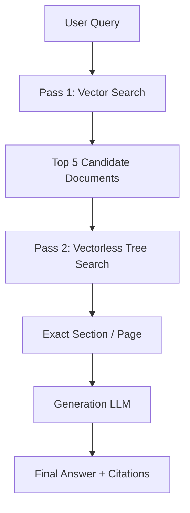

### Why combine them?

Imagine:

```text
10,000 documents
        ↓
   Vector Search
        ↓
    5 documents
        ↓
 Vectorless Tree Search
        ↓
 Exact section
        ↓
      LLM
```

Vector search provides **fast broad filtering**.

Vectorless search provides **precise structural retrieval**.

> **Best of both worlds: fast filtering + contextual reasoning.**

---

# 07. 🧠 Which Approach Should You Choose?

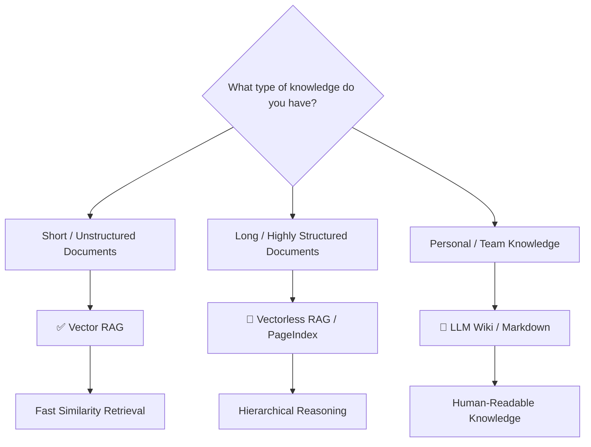

### ✅ Use Vector RAG when:

* Documents are short
* Data is mostly unstructured
* You need very fast retrieval
* Query volume is extremely high
* Token budget is tight

### 🌳 Use Vectorless RAG when:

* Documents are very long
* Documents have strong hierarchy
* Context is critical
* You need section/page traceability
* Working with legal, financial, or technical documents

### 📖 Use LLM Wiki when:

* Building a personal knowledge base
* Building a team wiki
* Using Markdown/Obsidian
* Data comes from many different sources
* Human editing and transparency are important

---

# 08. 💻 Production JavaScript / Node.js Implementation

The concepts can be implemented in JavaScript using two main components:

```text
Vectorless RAG
     ↓
Tree Index
     ↓
Agentic Search

LLM Wiki
     ↓
Metadata Catalog
     ↓
Two-Pass Retrieval
```

---

## 1. Vectorless RAG Tree Search

### `vectorless-rag-tree-indexer.js`

```javascript
import {
  TreeNode,
  HierarchicalTreeIndex,
  AgenticTreeSearchEngine
} from "./code/vectorless-rag-tree-indexer.js";

// Create root node
const root = new TreeNode(
  "root",
  "Systems Manual v2",
  0,
  [1, 500],
  "Master systems manual."
);

// Create chapter
const ch2 = new TreeNode(
  "ch_2",
  "Chapter 2: Load Balancing",
  1,
  [121, 250],
  "ALB and sticky sessions."
);

// Create section
const sec22 = new TreeNode(
  "sec_2_2",
  "Section 2.2: Sticky Sessions",
  2,
  [161, 250],
  "Cookie-based sticky sessions and ALB failover.",
  [],
  "Full section text..."
);

// Build hierarchy
ch2.addChild(sec22);
root.addChild(ch2);

// Create tree index
const tree = new HierarchicalTreeIndex(root);

// Create search engine
const searchEngine = new AgenticTreeSearchEngine(tree);

// Search without a vector database
const result = searchEngine.search(
  "How do sticky sessions handle failover?"
);

console.log(
  "Lineage Path:",
  result.traversalPath.join(" -> ")
);
```

### Conceptually:

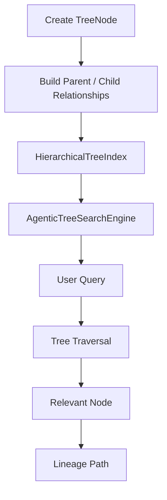

---

# 2. LLM Wiki Two-Pass Retrieval

### `llm-wiki-two-pass-engine.js`

```javascript
import {
  WikiFileEntry,
  LLMWikiVault,
  TwoPassWikiRetriever
} from "./code/llm-wiki-two-pass-engine.js";

const vault = new LLMWikiVault();

vault.addFile(
  new WikiFileEntry(
    "vault/infrastructure/alb-sticky-sessions.md",
    "Application Load Balancer Sticky Sessions",
    "infrastructure",
    [
      "alb",
      "sticky-sessions",
      "cookies"
    ],
    "AWS ALB sticky sessions, encrypted cookies, and failover behavior.",
    "Full raw Markdown content here..."
  )
);

const retriever = new TwoPassWikiRetriever(vault);

// Pass 1:
// Scan metadata and summaries
//
// Pass 2:
// Load full content of selected files
const result = retriever.searchAndRetrieve(
  "ALB sticky sessions cookies"
);

console.log(
  "Retrieved file:",
  result.selectedFile
);
```

### Architecture

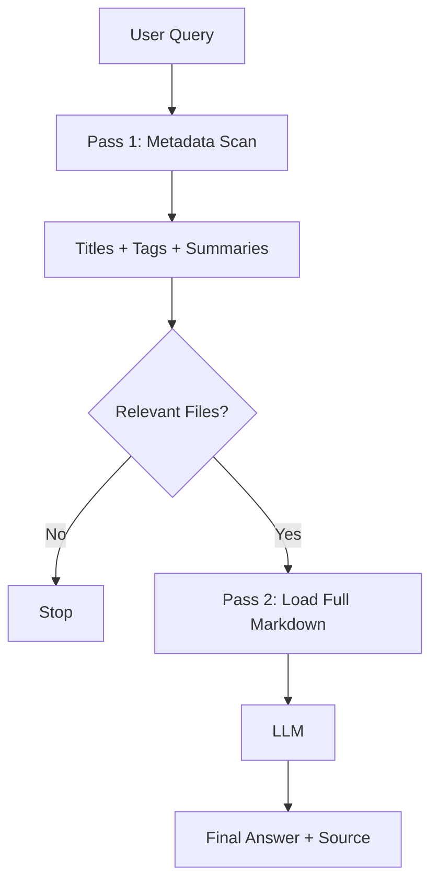

---

# 🎯 Final Mental Model

The easiest way to remember the entire Day 06 lesson is:

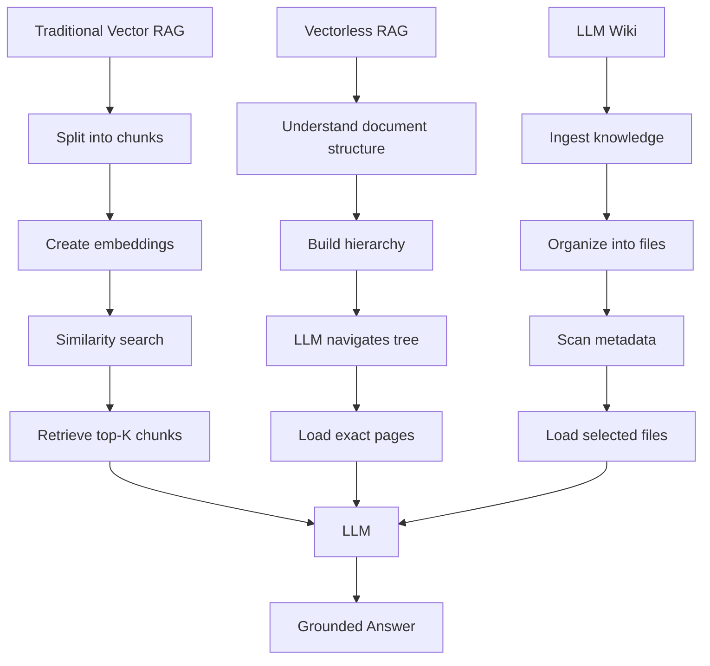

### 🔑 Remember These 6 Ideas

1. **Vector RAG searches chunks.**
2. **Fixed chunking can destroy document context.**
3. **Similarity does not always mean relevance.**
4. **Vectorless RAG searches the document hierarchy.**
5. **LLM Wiki treats the LLM as a knowledge librarian.**
6. **Hybrid RAG can combine fast vector filtering with precise tree-based retrieval.**

> **The biggest shift in Day 06 is this:**
> **Don't always ask, "Which chunk is most similar?"**
> **For complex knowledge, ask, "Where in the document structure should I look, and why?"**
