# 📚 Week 03 — Day 06

# Vectorless RAG & Hierarchical Knowledge Engines

> **Core idea:** Traditional Vector RAG asks **“Which chunks are similar to my query?”**
> Vectorless RAG asks **“Where in the document structure should I look?”**
> LLM Wiki asks **“How can I organize my knowledge so it is easier to find and maintain?”**

---

## 📑 Table of Contents

1. [Module 01 — Problems with Vector RAG & Abrupt Chunking](#1-module-01--problems-with-vector-rag--abrupt-chunking)
2. [Module 02 — Vectorless RAG & Tree Indexing](#2-module-02--vectorless-rag--tree-indexing)
3. [Module 03 — Agentic Tree Search](#3-module-03--agentic-tree-search)
4. [Module 04 — LLM Wiki Architecture](#4-module-04--llm-wiki-architecture)
5. [Module 05 — Vector RAG vs Vectorless RAG](#5-module-05--vector-rag-vs-vectorless-rag)
6. [Production Hybrid RAG](#6-production-hybrid-rag)
7. [Final Mental Model](#7-final-mental-model)

---

# 1. Module 01 — Problems with Vector RAG & Abrupt Chunking

## 1.1 What is Vector RAG?

Traditional RAG usually converts documents into embeddings and stores them in a vector database.

The basic pipeline looks like this:

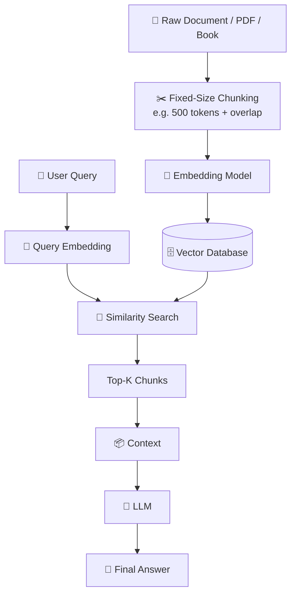

This approach works well for many applications, especially when the documents are relatively short and unstructured.

However, problems appear when working with **large, highly structured documents**, such as:

* Financial reports
* Legal contracts
* Technical manuals
* Engineering documentation
* Medical literature
* Large textbooks

---

## 1.2 The Abrupt Chunking Problem

One of the biggest weaknesses is **fixed-size chunking**.

For example:

```text
Document
│
├── Chunk 1 → 500 tokens
├── Chunk 2 → 500 tokens
├── Chunk 3 → 500 tokens
├── Chunk 4 → 500 tokens
└── ...
```

The problem is that **document structure does not follow token boundaries**.

For example:

```text
Section 3.2 — Load Balancing

The system uses two distribution tiers:

CDN → handles static assets

ALB → handles dynamic sessions

---------------- CHUNK BOUNDARY ----------------

The ALB uses sticky sessions based on
encrypted browser cookies...
```

The second chunk contains the important information about **sticky sessions**, but may no longer contain the context explaining:

> This belongs to **Section 3.2 → Load Balancing → ALB**.

---

## 1.3 Three Major Problems

### ① Loss of Global Context

A chunk becomes an isolated piece of information.

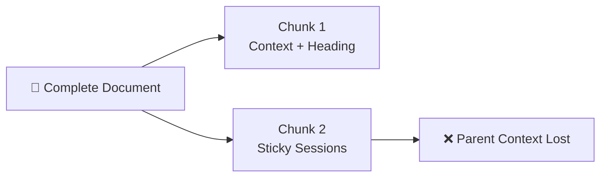

The LLM may see *what* something does without knowing **where it belongs**.

---

### ② Semantic Boundary Fragmentation

A logical paragraph, table, or argument can be split in the middle.

```text
Paragraph
    ↓
Sentence 1
Sentence 2
----------------
CHUNK BOUNDARY
----------------
Sentence 3
Sentence 4
```

The retrieved chunk may therefore be incomplete.

---

### ③ Dangling References

Technical documents frequently contain references such as:

```text
"This mechanism..."
"It requires..."
"As discussed above..."
"This configuration..."
```

If the previous context is missing:

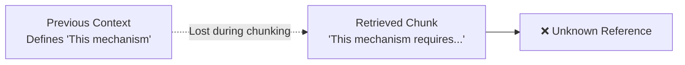

The LLM may misunderstand what **“this mechanism”** refers to.

---

# 1.4 Similarity ≠ Relevance

A vector database searches for mathematically similar vectors.

But:

> **Semantic similarity does not always mean contextual relevance.**

```text
Vector Similarity ≠ Contextual Relevance
```

### Example

Query:

> **“How do ALB sticky sessions recover after failure?”**

A vector search might retrieve:

```text
1. CDN traffic distribution
2. ALB traffic routing
3. Sticky sessions
4. General network load balancing
```

Some results may be **similar**, but not actually answer the question.

---

## 1.5 Common Retrieval Failures

| Failure                      | What Happens                                                       |
| ---------------------------- | ------------------------------------------------------------------ |
| **Similar but irrelevant**   | Similar terminology but wrong answer                               |
| **Relevant but not similar** | Correct information uses different terminology                     |
| **Contextual inversion**     | Retrieved text contains the keyword but gives the opposite meaning |
| **Missing hierarchy**        | Section/chapter relationship is lost                               |
| **Missing references**       | Pronouns or references become ambiguous                            |

---

# 1.6 The "Vibe Retrieval" Problem

Vector search typically gives a score such as:

```text
Chunk #47 → 0.82
Chunk #12 → 0.79
Chunk #91 → 0.75
```

But what does **0.82** actually mean?

It doesn't directly tell us:

* Why the chunk is relevant
* Whether the answer is complete
* Whether the correct section was selected
* Whether important parent context is missing
* Whether the chunk contradicts another section

This creates what can be called **opaque or "vibe-based" retrieval**.

---

# 2. Module 02 — Vectorless RAG & Tree Indexing

## 2.1 What is Vectorless RAG?

**Vectorless RAG** takes a different approach.

Instead of:

```text
Document
 ↓
Chunks
 ↓
Embeddings
 ↓
Vector DB
```

it creates:

```text
Document
 ↓
Structure
 ↓
Hierarchical Tree
 ↓
LLM Navigation
 ↓
Exact Content
```

Systems such as **PageIndex** use this general idea of hierarchical document indexing.

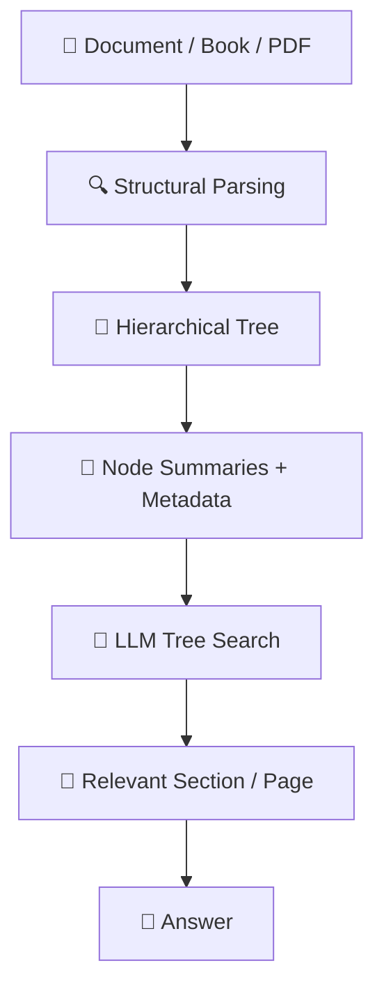

---

# 2.2 The Core Paradigm Shift

Think about how a human expert reads a 500-page technical manual.

They don't:

```text
Cut manual into 5,000 random pieces
        ↓
Shuffle the pieces
        ↓
Find pieces that look similar
```

Instead:

```text
Table of Contents
       ↓
Relevant Chapter
       ↓
Relevant Section
       ↓
Relevant Subsection
       ↓
Exact Page
       ↓
Read Full Context
```

Vectorless RAG tries to make retrieval behave more like this.

---

# 2.3 Vector RAG vs Vectorless RAG

| Feature        | 🔵 Vector RAG            | 🟢 Vectorless RAG         |
| -------------- | ------------------------ | ------------------------- |
| Index          | Vector space             | Tree                      |
| Unit           | Token chunks             | Sections/pages            |
| Search         | Similarity               | Logical navigation        |
| Context        | Chunk                    | Hierarchical context      |
| Explainability | Similarity score         | Navigation path           |
| Structure      | Mostly flattened         | Preserved                 |
| Best for       | Simple/unstructured data | Long structured documents |

---

# 2.4 Building the Document Tree

Suppose we have a 500-page book:

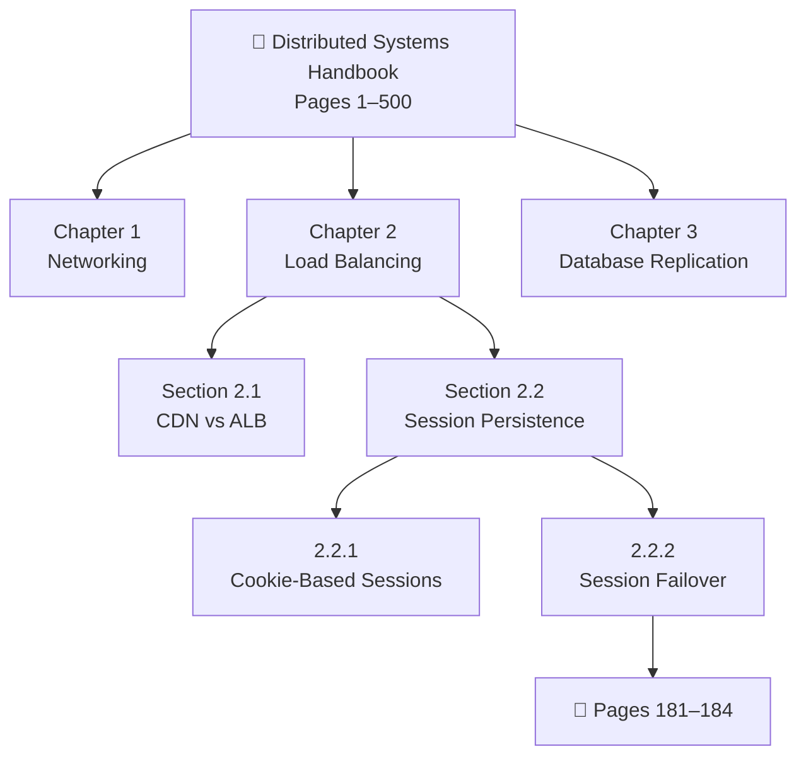

Now the system knows the **relationship between every part of the document**.

---

# 2.5 Tree Node Metadata

Each node can contain useful metadata:

```json
{
  "node_id": "sec_2_2",
  "title": "Session Persistence & Sticky Sessions",
  "level": 2,
  "page_range": [161, 200],
  "parent_id": "ch_2",
  "children_ids": [
    "sub_2_2_1",
    "sub_2_2_2"
  ],
  "summary": "Covers session state management, sticky sessions and failover behavior.",
  "keywords": [
    "sticky sessions",
    "ALB",
    "session persistence"
  ],
  "entities": [
    "Application Load Balancer",
    "Browser Cookies"
  ],
  "source_file": "distributed_systems_v2.pdf"
}
```

The important idea is:

> **The tree stores lightweight structural information first. Raw document content can be loaded only when needed.**

---

# 2.6 Indexing Workflow

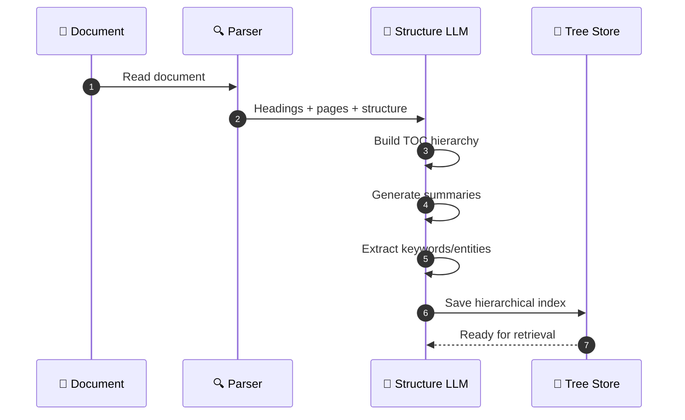

### Main steps

1. **Ingest document**
2. **Detect structure**
3. **Build Table of Contents**
4. **Create hierarchical nodes**
5. **Generate summaries**
6. **Store metadata**
7. **Keep raw content available for lazy loading**

---

# 3. Module 03 — Agentic Tree Search

## 3.1 From Similarity Search to Reasoning

Traditional vector search:

```text
Query
 ↓
Embedding
 ↓
Similarity
 ↓
Top-K
```

Vectorless retrieval:

```text
Query
 ↓
Understand Query
 ↓
Inspect Tree
 ↓
Choose Branch
 ↓
Inspect Subtree
 ↓
Choose Section
 ↓
Load Exact Content
```

The LLM becomes the **navigator**.

---

# 3.2 AlphaGo-Inspired Tree Traversal

The idea is conceptually similar to decision-tree exploration:

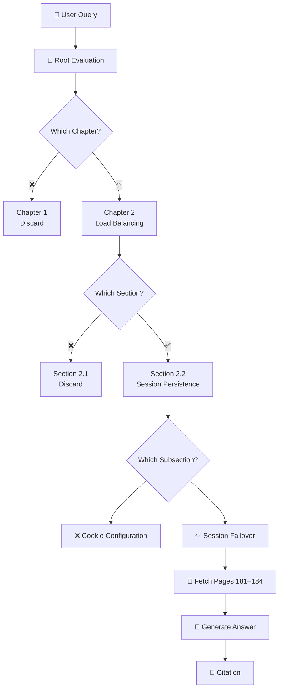

---

# 3.3 Three-Step Retrieval Process

### Step 1 — Root Inspection

The agent sees the top-level sections.

```text
Chapter 1 — Networking
Chapter 2 — Load Balancing
Chapter 3 — Databases
```

For:

> “How do sticky sessions behave during ALB failure?”

it selects:

```text
Chapter 2 ✅
```

---

### Step 2 — Subtree Expansion

The agent explores Chapter 2:

```text
Chapter 2
│
├── 2.1 CDN vs ALB
├── 2.2 Session Persistence  ← ✅
└── 2.3 Traffic Routing
```

It chooses **2.2**.

---

### Step 3 — Lazy Content Loading

The system continues:

```text
2.2 Session Persistence
        ↓
2.2.2 Session Failover
        ↓
Pages 181–184
        ↓
Load full content
```

The system doesn't need to load the entire 500-page document.

---

# 3.4 Traceable Retrieval

Instead of:

```text
Similarity Score: 0.82
```

we can get:

```text
Document:
Distributed Systems Architecture Manual

Navigation:
Root
 → Chapter 2
 → Section 2.2
 → Subsection 2.2.2

Pages:
181–184
```

This makes the retrieval process much easier to understand and audit.

---

# 3.5 Important Limitation

Vectorless RAG provides **better retrieval traceability**, but it does **not guarantee deterministic or hallucination-free answers**.

The LLM can still:

* Misinterpret retrieved content
* Choose the wrong branch
* Miss relevant information
* Generate unsupported claims

So production systems still need grounding and validation.

---

# 4. Module 04 — LLM Wiki Architecture

## 4.1 The LLM Wiki Idea

Another approach is to use an LLM as a **background librarian**.

Instead of simply storing content as embeddings:

```text
PDF
 ↓
Embedding
 ↓
Vector DB
```

the system organizes knowledge into human-readable files.

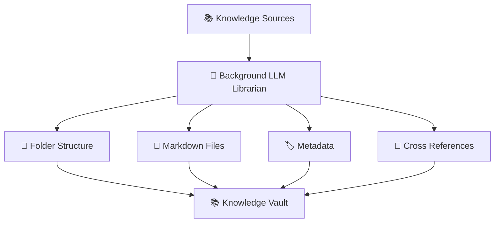

This can be implemented with tools such as Markdown-based repositories or an Obsidian-style vault.

---

# 4.2 Push Content vs Update Knowledge

### Traditional Vector RAG

```text
New Content
   ↓
Chunk
   ↓
Embed
   ↓
Store
```

### LLM Wiki

```text
New Content
   ↓
Analyze
   ↓
Categorize
   ↓
Summarize
   ↓
Link
   ↓
Update Knowledge Base
```

The key difference is:

> **Vector RAG primarily stores representations of content. LLM Wiki focuses on organizing knowledge.**

---

# 4.3 Heterogeneous Data Sources

An LLM Wiki can combine:

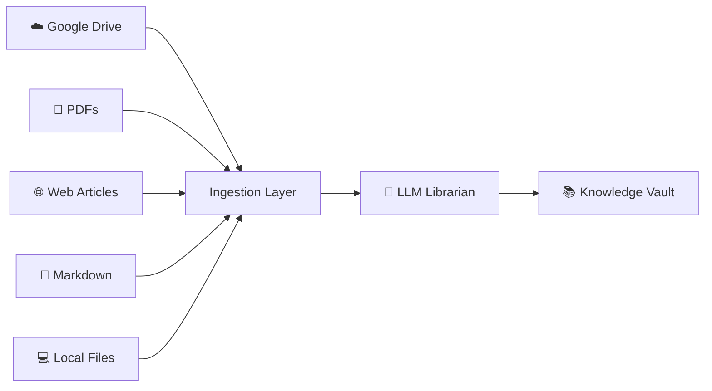

The librarian can:

1. Identify the document topic
2. Choose a folder
3. Generate a title
4. Create a summary
5. Add metadata/tags
6. Create relationships with existing documents

---

# 4.4 Two-Pass Retrieval

The LLM Wiki approach can avoid loading every file.

### Pass 1 — Metadata Scan

Read:

```text
Filename
Title
Summary
Tags
Metadata
```

### Pass 2 — Selective Loading

Load only the relevant files.

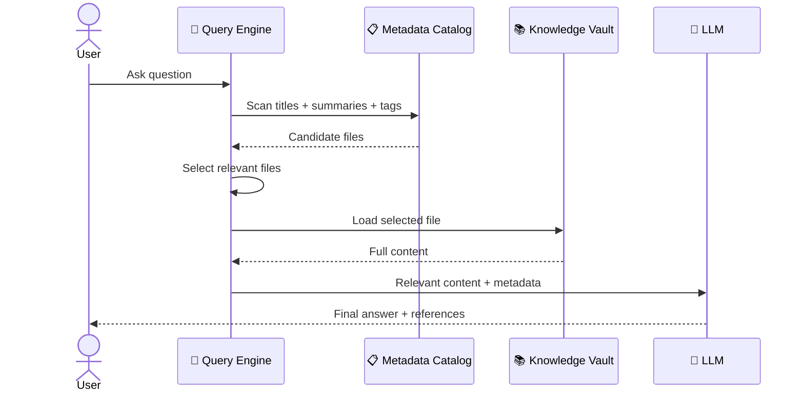

This is:

> **Search the catalog first → load content second.**

---

# 5. Module 05 — Vector RAG vs Vectorless RAG

## 5.1 Complete Comparison

| Feature            | 🔵 Vector RAG              | 🟢 Vectorless RAG       | 🟣 LLM Wiki          |
| ------------------ | -------------------------- | ----------------------- | -------------------- |
| **Data Structure** | Vector space               | Hierarchical tree       | Files + folders      |
| **Indexing Unit**  | Token chunks               | Sections/pages          | Documents/files      |
| **Retrieval**      | Similarity                 | LLM navigation          | Metadata scan        |
| **Context**        | Chunk-level                | Hierarchical            | Selected file        |
| **Explainability** | Similarity score           | Tree path               | File path            |
| **Indexing Cost**  | Low                        | Medium                  | Medium               |
| **Query Cost**     | Low                        | Medium–High             | Low–Medium           |
| **Maintenance**    | Re-embedding may be needed | Update node metadata    | Edit files directly  |
| **Best Use Case**  | Simple semantic search     | Complex structured docs | Knowledge management |

---

# 5.2 Quick Mental Model

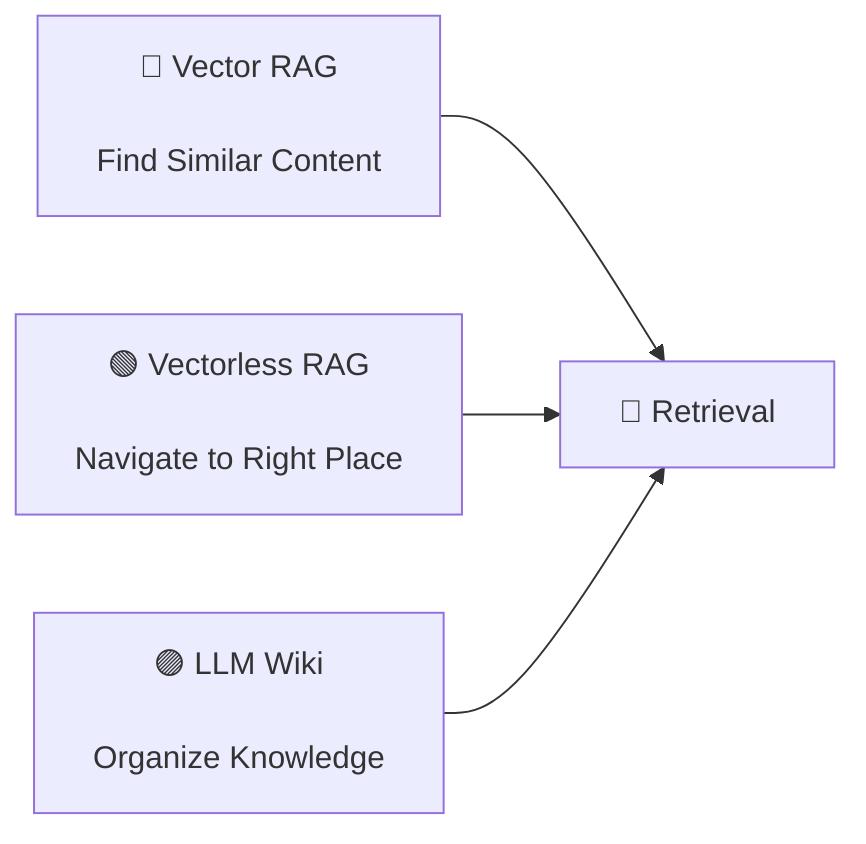

---

# 6. Production Hybrid RAG

The best production architecture isn't always:

> **Vector OR Vectorless**

It can be:

> **Vector AND Vectorless**

For example, imagine an enterprise has **10,000 documents**.

Running deep LLM tree search over all 10,000 documents would be expensive.

Instead:

### Pass 1

Use Vector RAG:

```text
10,000 documents
       ↓
Vector Search
       ↓
5 candidate documents
```

### Pass 2

Use Vectorless RAG:

```text
5 documents
       ↓
Tree Navigation
       ↓
Exact Section
       ↓
Exact Page
```

### Pass 3

Generate the answer.

---

## 6.1 Hybrid Architecture

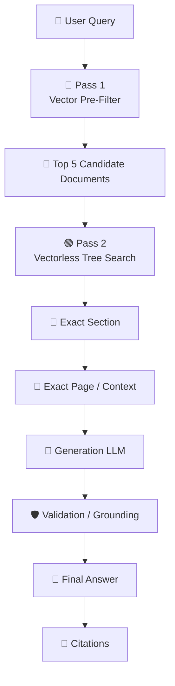

---

# 6.2 Why Hybrid RAG?

Each method handles a different part of the problem.

```text
Vector RAG
     ↓
Fast broad search
     ↓
Reduce search space
     ↓
Vectorless RAG
     ↓
Deep structural reasoning
     ↓
Exact context
     ↓
LLM
```

### In one sentence:

> **Use Vector RAG to find the right documents and Vectorless RAG to find the right place inside those documents.**

---

# 6.3 Choosing the Right Architecture

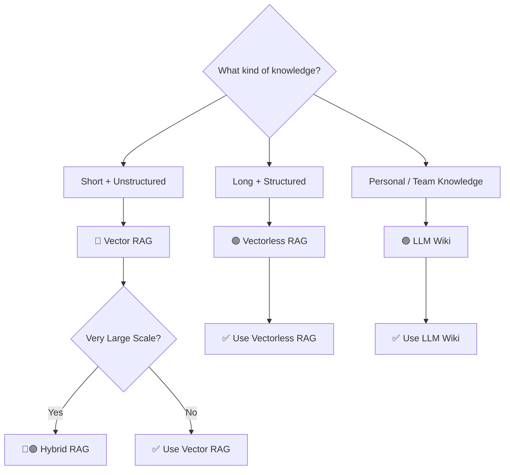

---

# 6.4 When to Use Vector RAG

Choose **Vector RAG** when:

* Documents are short
* Data is relatively unstructured
* Semantic similarity is sufficient
* Low latency is important
* Query volume is very high
* Token budget is limited

### Examples

* FAQs
* Support tickets
* Product descriptions
* Short documentation
* Simple knowledge articles

---

# 6.5 When to Use Vectorless RAG

Choose **Vectorless RAG** when:

* Documents are very long
* Document hierarchy matters
* Exact sections/pages matter
* Context preservation is important
* Documents contain complex relationships
* Traceable retrieval is required

### Examples

* Legal contracts
* Financial filings
* Technical manuals
* Engineering documentation
* Large textbooks
* Complex reports

---

# 6.6 When to Use LLM Wiki

Choose an **LLM Wiki** when:

* You are building a personal knowledge system
* You need a team knowledge base
* Data comes from many different sources
* Human editing is important
* You want human-readable Markdown files
* Long-term knowledge organization matters

### Examples

```text
Google Drive
PDFs
Markdown
Web Articles
Research Notes
Local Files
        ↓
   LLM Librarian
        ↓
Knowledge Vault
```

---

# 7. Production Architecture

A more advanced production system can combine all three approaches.

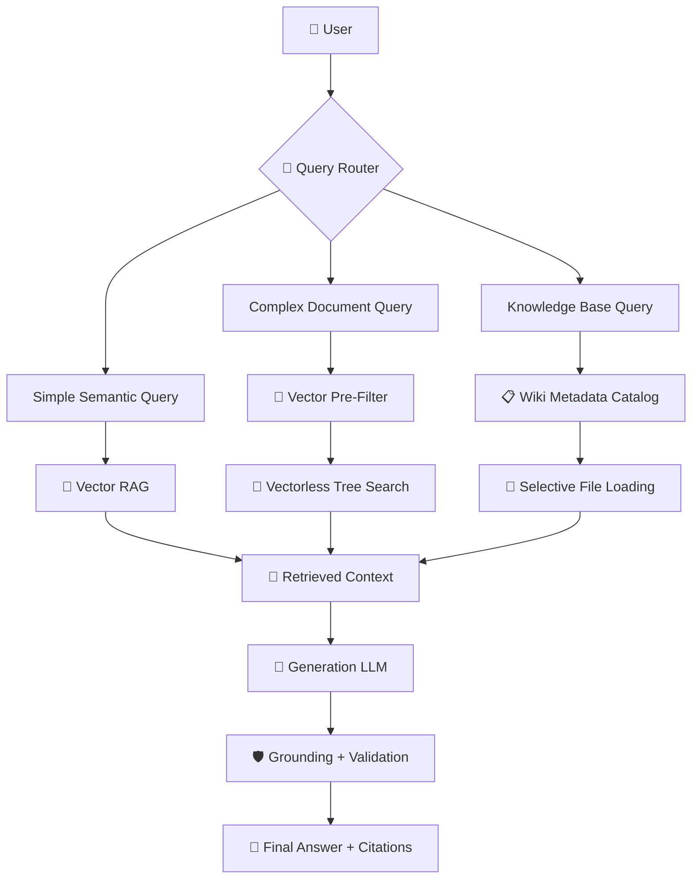

This gives the system the ability to **route different queries to different retrieval strategies**.

---

# 🎯 Final Takeaways

### The most important concepts from Day 06:

1. **Vector RAG uses embeddings and similarity search.**
2. **Fixed-size chunking can destroy document structure and context.**
3. **Similarity does not always equal relevance.**
4. **Vectorless RAG uses hierarchical document structures instead of relying solely on vectors.**
5. **Tree indexing preserves relationships between documents, chapters, sections, and pages.**
6. **Agentic tree search allows an LLM to navigate the document structure step by step.**
7. **Lazy loading prevents unnecessary full-document context from entering the prompt.**
8. **Tree-based retrieval provides an explicit navigation path for better traceability.**
9. **LLM Wiki treats the LLM as a knowledge librarian that organizes and maintains information.**
10. **Two-pass retrieval scans lightweight metadata first and loads full content only when needed.**
11. **Vector RAG is generally better for fast semantic retrieval over simpler content.**
12. **Vectorless RAG is especially useful for long, structured, context-heavy documents.**
13. **LLM Wiki is useful for personal and team knowledge management.**
14. **Hybrid RAG combines vector filtering with structural tree search.**
15. **Better retrieval reduces hallucination risk but does not guarantee hallucination-free generation.**

---

# 🧠 The Ultimate Mental Model

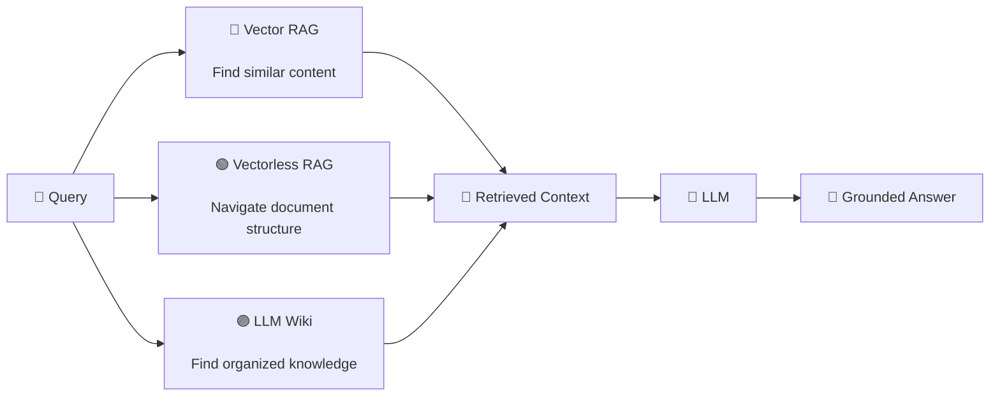

> ### 🔵 Vector RAG
>
> **Find similar content.**
>
> ### 🟢 Vectorless RAG
>
> **Navigate to the right place.**
>
> ### 🟣 LLM Wiki
>
> **Organize knowledge so it becomes easier to find.**
>
> ### 🔵 + 🟢 Hybrid RAG
>
> **Search broadly first, then reason deeply where it matters.**

That is the core of **Day 06: Vectorless RAG & Hierarchical Knowledge Engines**.


Absolutely — here is the same production Vectorless RAG architecture with **colorful sections, nodes, decision points, storage, security, and retrieval paths**.

```mermaid
flowchart TD

    %% =========================================================
    %% GLOBAL COLOR STYLES
    %% =========================================================

    classDef user fill:#E3F2FD,stroke:#1565C0,stroke-width:3px,color:#0D47A1
    classDef api fill:#E8EAF6,stroke:#3949AB,stroke-width:2px,color:#1A237E
    classDef security fill:#FFEBEE,stroke:#C62828,stroke-width:2px,color:#B71C1C
    classDef query fill:#E0F7FA,stroke:#00838F,stroke-width:2px,color:#006064
    classDef router fill:#FFF3E0,stroke:#EF6C00,stroke-width:3px,color:#E65100

    classDef indexing fill:#E8F5E9,stroke:#2E7D32,stroke-width:2px,color:#1B5E20
    classDef structure fill:#F1F8E9,stroke:#558B2F,stroke-width:2px,color:#33691E
    classDef tree fill:#EDE7F6,stroke:#6A1B9A,stroke-width:2px,color:#4A148C
    classDef metadata fill:#FFF8E1,stroke:#F9A825,stroke-width:2px,color:#F57F17

    classDef search fill:#E0F2F1,stroke:#00695C,stroke-width:2px,color:#004D40
    classDef decision fill:#FFF3E0,stroke:#FB8C00,stroke-width:3px,color:#E65100
    classDef prune fill:#FFEBEE,stroke:#D32F2F,stroke-width:2px,color:#B71C1C
    classDef lazy fill:#E8F5E9,stroke:#43A047,stroke-width:3px,color:#1B5E20

    classDef hybrid fill:#FCE4EC,stroke:#C2185B,stroke-width:2px,color:#880E4F
    classDef wiki fill:#E8EAF6,stroke:#5E35B1,stroke-width:2px,color:#311B92

    classDef context fill:#FFF8E1,stroke:#FF8F00,stroke-width:2px,color:#E65100
    classDef llm fill:#F3E5F5,stroke:#8E24AA,stroke-width:3px,color:#4A148C
    classDef validation fill:#E0F7FA,stroke:#0097A7,stroke-width:2px,color:#006064
    classDef response fill:#E8F5E9,stroke:#2E7D32,stroke-width:3px,color:#1B5E20

    classDef storage fill:#ECEFF1,stroke:#455A64,stroke-width:2px,color:#263238
    classDef observability fill:#FFF3E0,stroke:#FB8C00,stroke-width:2px,color:#E65100


    %% =========================================================
    %% USER QUERY
    %% =========================================================

    U[👤 User Query]:::user
    U --> API[🌐 API Gateway]:::api
    API --> GuardIn[🛡️ Input Guardrails]:::security
    GuardIn --> Query[🔎 Query Understanding]:::query


    %% =========================================================
    %% QUERY PROCESSING
    %% =========================================================

    Query --> Intent[🧠 Intent & Context Analysis]:::query
    Intent --> QueryRewrite[✏️ Query Rewrite / Decomposition]:::query
    QueryRewrite --> Router{🚦 Query Router}:::router


    %% =========================================================
    %% KNOWLEDGE SOURCES
    %% =========================================================

    Router -->|Structured Documents| TreeEngine[🌳 Vectorless RAG Engine]:::tree
    Router -->|Personal / Team Knowledge| WikiEngine[📚 LLM Wiki Engine]:::wiki
    Router -->|Hybrid Search| Hybrid[⚡ Hybrid Retrieval]:::hybrid


    %% =========================================================
    %% OFFLINE INDEXING PIPELINE
    %% =========================================================

    subgraph INDEXING["📥 OFFLINE INDEXING PIPELINE"]

        Sources[📄 PDFs / Docs / HTML / Markdown / Books]:::indexing

        Sources --> Parser[📑 Document Parser]:::indexing
        Parser --> Structure[🏗️ Structural Analysis]:::structure

        Structure --> Headings[📑 Headings / TOC]:::structure
        Structure --> Pages[📃 Pages / Page Ranges]:::structure
        Structure --> Tables[📊 Tables / Figures]:::structure
        Structure --> Sections[📚 Sections / Subsections]:::structure

        Headings --> TreeBuilder[🌳 Hierarchical Tree Builder]:::tree
        Pages --> TreeBuilder
        Tables --> TreeBuilder
        Sections --> TreeBuilder

        TreeBuilder --> NodeEnrich[🧠 LLM Node Enrichment]:::llm

        NodeEnrich --> Summary[📝 Section Summary]:::metadata
        NodeEnrich --> Keywords[🏷️ Keywords / Topics]:::metadata
        NodeEnrich --> Entities[🔗 Entities]:::metadata
        NodeEnrich --> Metadata[📌 Page Range / Parent / Children]:::metadata

        Summary --> TreeStore[(🌳 Tree Index)]:::storage
        Keywords --> TreeStore
        Entities --> TreeStore
        Metadata --> TreeStore

        Parser --> RawStore[(🗄️ Raw Document Storage)]:::storage
    end


    %% =========================================================
    %% HIERARCHICAL KNOWLEDGE TREE
    %% =========================================================

    subgraph TREE["🌳 HIERARCHICAL KNOWLEDGE TREE"]

        Root[📚 Document Root]:::tree

        Root --> Ch1[📖 Chapter 1]:::tree
        Root --> Ch2[📖 Chapter 2]:::tree
        Root --> Ch3[📖 Chapter 3]:::tree

        Ch2 --> Sec1[📑 Section 2.1]:::tree
        Ch2 --> Sec2[📑 Section 2.2]:::tree
        Ch2 --> Sec3[📑 Section 2.3]:::tree

        Sec2 --> Sub1[📄 Subsection 2.2.1]:::tree
        Sec2 --> Sub2[📄 Subsection 2.2.2]:::tree
        Sec2 --> Sub3[📄 Subsection 2.2.3]:::tree

        Sub2 --> Pages2[📃 Target Pages]:::lazy
    end

    TreeStore --> Root


    %% =========================================================
    %% AGENTIC TREE SEARCH
    %% =========================================================

    subgraph SEARCH["🤖 PRODUCTION AGENTIC TREE SEARCH"]

        TreeEngine --> LoadRoot[📚 Load Root + Level-1 Summaries]:::search

        LoadRoot --> RootEval[🧠 LLM Evaluates Branch Relevance]:::llm

        RootEval --> BranchDecision{🎯 Relevant Branch?}:::decision

        BranchDecision -->|No| Prune[✂️ Prune Branch]:::prune
        BranchDecision -->|Yes| Expand[🔽 Expand Selected Branch]:::search

        Expand --> ChildSummary[📋 Load Child Node Summaries]:::search

        ChildSummary --> ChildEval[🧠 LLM Relevance Evaluation]:::llm

        ChildEval --> ChildDecision{🎯 Relevant Section?}:::decision

        ChildDecision -->|No| PruneChild[✂️ Prune]:::prune
        ChildDecision -->|Yes| ExpandChild[🔽 Continue Traversal]:::search

        ExpandChild --> LeafCheck{🍃 Target Leaf Reached?}:::decision

        LeafCheck -->|No| ChildSummary
        LeafCheck -->|Yes| LazyLoad[⚡ Lazy Load Exact Pages]:::lazy

    end


    %% =========================================================
    %% LAZY LOADING
    %% =========================================================

    LazyLoad --> RawStore
    RawStore --> FullContext[📄 Full Section / Page Context]:::context


    %% =========================================================
    %% MULTI-BRANCH OPTIMIZATION
    %% =========================================================

    ChildSummary --> Parallel[⚡ Parallel Branch Evaluation]:::search
    Parallel --> CacheCheck{💾 Tree Cache?}:::decision

    CacheCheck -->|Hit| CachedTree[(⚡ Redis / Memory Cache)]:::storage
    CacheCheck -->|Miss| TreeStore


    %% =========================================================
    %% HYBRID RAG
    %% =========================================================

    subgraph HYBRID["⚡ HYBRID VECTOR + VECTORLESS RAG"]

        Hybrid --> VectorFilter[🔢 Vector Pre-Filter]:::hybrid
        VectorFilter --> CandidateDocs[📚 Top-N Candidate Documents]:::hybrid
        CandidateDocs --> PageIndex[🌳 Vectorless Tree Search]:::tree
        PageIndex --> ExactSection[🎯 Exact Section / Page]:::lazy

    end

    ExactSection --> FullContext


    %% =========================================================
    %% LLM WIKI
    %% =========================================================

    subgraph WIKI["📚 LLM WIKI / KNOWLEDGE ENGINE"]

        WikiEngine --> Catalog[📋 Metadata Catalog]:::wiki

        Catalog --> Pass1[1️⃣ PASS 1: Summary / Tag Scan]:::wiki
        Pass1 --> Candidates[🎯 Candidate Files]:::wiki

        Candidates --> Pass2[2️⃣ PASS 2: Selective Full-Text Load]:::wiki

        Pass2 --> MarkdownVault[(📝 Markdown / Obsidian Vault)]:::storage
        MarkdownVault --> WikiContext[📄 Selected Knowledge Context]:::context

    end


    %% =========================================================
    %% CONTEXT ASSEMBLY
    %% =========================================================

    FullContext --> ContextBuilder[🧩 Context Builder]:::context
    WikiContext --> ContextBuilder
    ExactSection --> ContextBuilder

    ContextBuilder --> ContextValidation[🔍 Context Validation]:::validation

    ContextValidation --> CitationBuilder[📌 Citation & Lineage Builder]:::validation


    %% =========================================================
    %% GENERATION
    %% =========================================================

    CitationBuilder --> Prompt[📝 Grounded Prompt]:::context
    Prompt --> LLM[🤖 Generation LLM]:::llm

    LLM --> AnswerCheck[🔍 Answer Validation]:::validation

    AnswerCheck --> Hallucination[🛡️ Hallucination / Grounding Check]:::security
    Hallucination --> OutputGuard[🛡️ Output Guardrails]:::security

    OutputGuard --> Response[💬 Final Grounded Answer]:::response


    %% =========================================================
    %% TRACEABILITY
    %% =========================================================

    CitationBuilder --> Trace[📍 Explicit Traceability]:::validation

    Trace --> Path[🧭 Root → Chapter → Section → Subsection → Page]:::validation
    Trace --> Source[📄 Source Document]:::validation
    Trace --> PageRef[📃 Page / Section Reference]:::validation

    Path --> Response
    Source --> Response
    PageRef --> Response


    %% =========================================================
    %% FEEDBACK & OBSERVABILITY
    %% =========================================================

    Response --> Feedback[📊 Retrieval & Answer Evaluation]:::observability

    Feedback --> Metrics[📈 Observability]:::observability

    Metrics --> Latency[⏱️ Latency]:::observability
    Metrics --> Tokens[🪙 Token Usage]:::observability
    Metrics --> RetrievalQuality[🎯 Retrieval Quality]:::observability
    Metrics --> Grounding[✅ Grounding Score]:::observability

    Feedback --> CacheUpdate[⚡ Update Retrieval Cache]:::storage
    Feedback --> IndexUpdate[🔄 Index Maintenance]:::indexing

    IndexUpdate --> Parser


    %% =========================================================
    %% PRODUCTION STORAGE
    %% =========================================================

    subgraph STORAGE["🗄️ PRODUCTION STORAGE"]

        RawStore
        TreeStore
        CachedTree
        MarkdownVault

        MetadataDB[(🗃️ Metadata / Document DB)]:::storage
        ObjectStore[(☁️ Object Storage)]:::storage

    end

    Parser --> MetadataDB
    Parser --> ObjectStore


    %% =========================================================
    %% SECURITY & GOVERNANCE
    %% =========================================================

    subgraph SECURITY["🔐 SECURITY & GOVERNANCE"]

        Access[🔑 RBAC / ACL]:::security
        PII[🔒 PII Detection]:::security
        Audit[📜 Audit Logs]:::security
        Tenant[🏢 Tenant Isolation]:::security

    end

    API --> Access
    Access --> GuardIn

    ContextBuilder --> PII
    Response --> Audit
    TreeStore --> Tenant


    %% =========================================================
    %% SUBGRAPH COLORS
    %% =========================================================

    style INDEXING fill:#E8F5E9,stroke:#2E7D32,stroke-width:3px
    style TREE fill:#F3E5F5,stroke:#7B1FA2,stroke-width:3px
    style SEARCH fill:#E0F2F1,stroke:#00796B,stroke-width:3px
    style HYBRID fill:#FCE4EC,stroke:#C2185B,stroke-width:3px
    style WIKI fill:#E8EAF6,stroke:#3949AB,stroke-width:3px
    style STORAGE fill:#ECEFF1,stroke:#455A64,stroke-width:3px
    style SECURITY fill:#FFEBEE,stroke:#C62828,stroke-width:3px
```

This version separates the architecture visually into **green = indexing**, **purple = knowledge tree**, **teal = agentic search**, **pink = hybrid RAG**, **blue = LLM Wiki**, **gray = storage**, and **red = security**.
