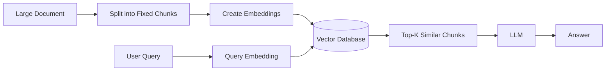
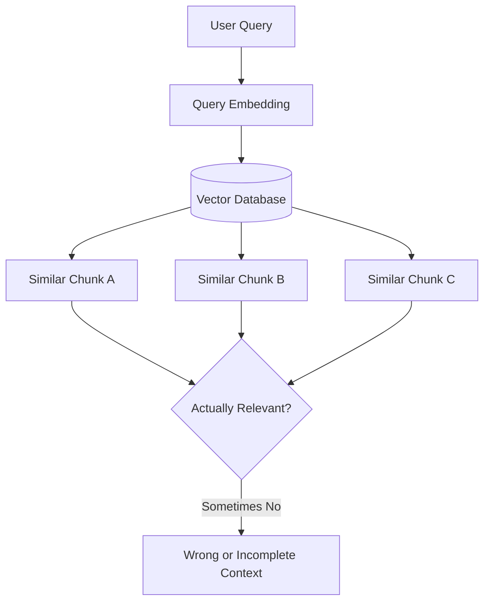
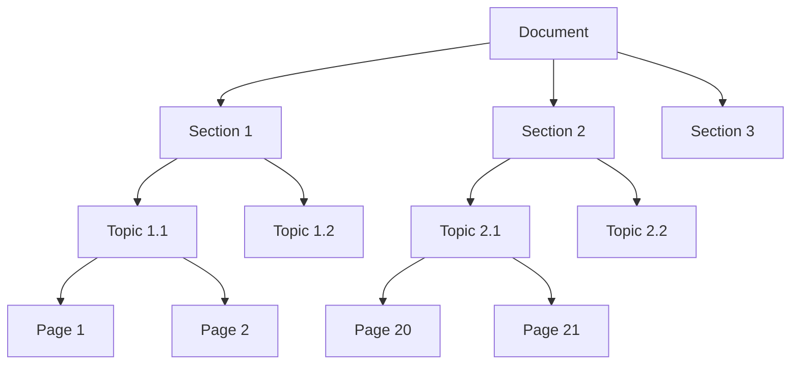
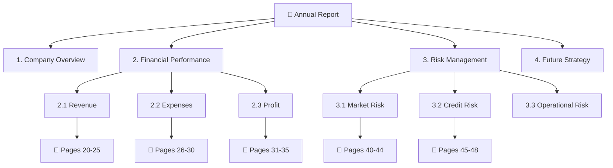
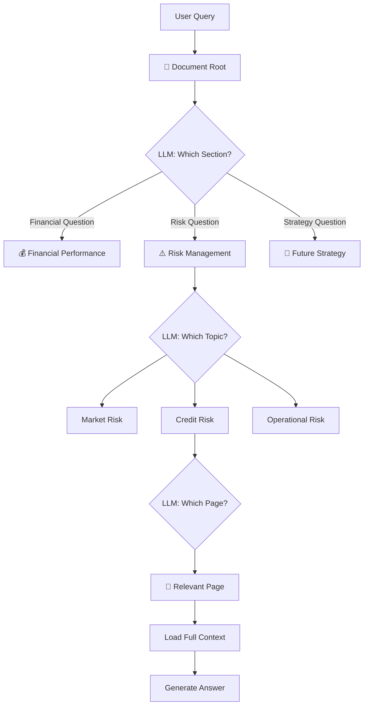
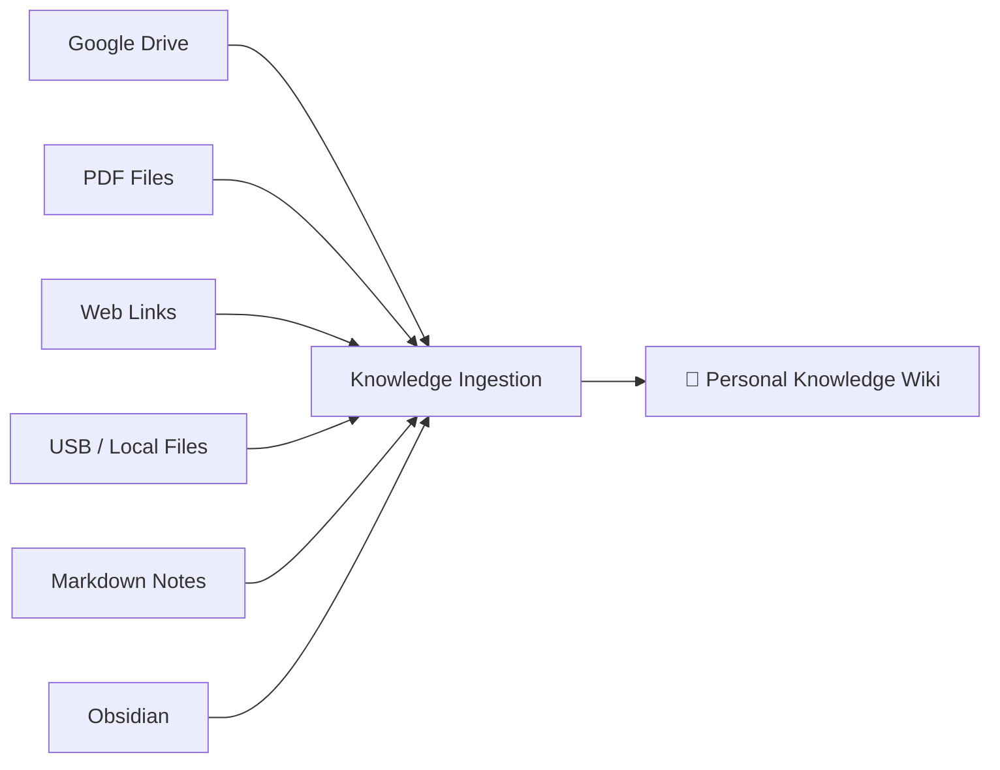
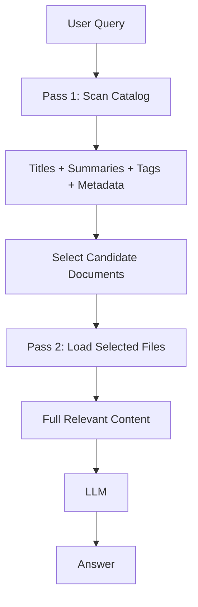
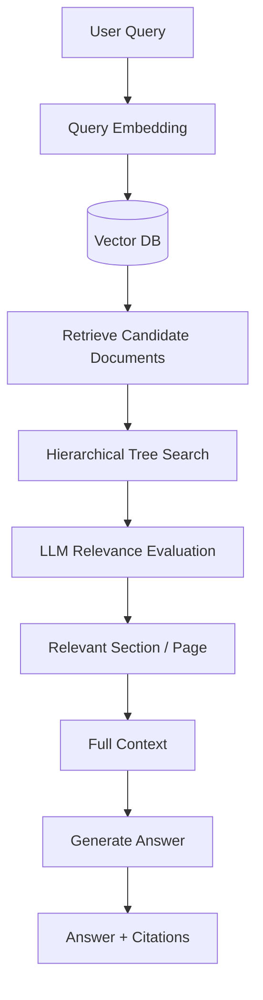
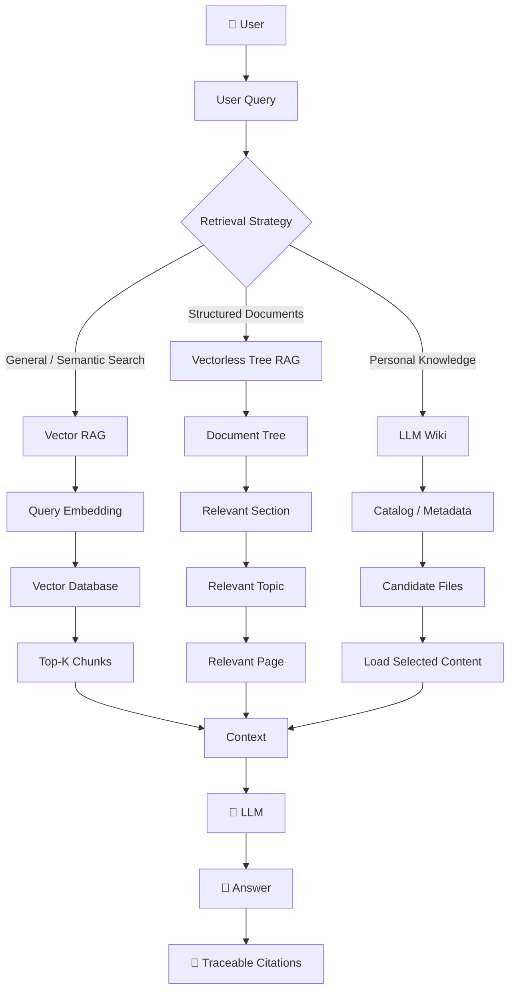
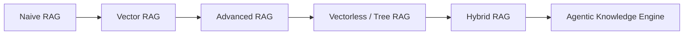

### 📚 Week 03 — Day 06: Vectorless RAG & Hierarchical Knowledge Engines

**Main idea:**
Traditional RAG usually asks:

> “Which chunks are semantically similar to my query?”

Vectorless RAG asks:

> “Which part of the document structure is relevant to my query?”

That small change leads to a very different retrieval architecture.

---

## 1. What We Learn Today

Day 06 focuses on four major ideas:

1. **Why traditional Vector RAG can fail**
2. **Vectorless RAG with hierarchical tree indexing**
3. **Agentic Tree Search using an LLM**
4. **LLM Wiki / Knowledge Engine architecture**

At the end, we compare **Vector RAG vs Vectorless RAG** and understand when to use each.

---

# 2. Why Traditional Vector RAG Has Problems

A typical Vector RAG pipeline looks like this:



The problem starts with **chunking**.

Imagine a 200-page financial report.

Instead of understanding the document structure, we might simply split it:

```text
Page 1-5   → Chunk 1
Page 6-10  → Chunk 2
Page 11-15 → Chunk 3
...
```

This can break important relationships.

### Example

A document may have:

```text
Annual Report
│
├── Financial Performance
│   ├── Revenue
│   ├── Expenses
│   └── Profit
│
├── Risk Factors
│   ├── Market Risk
│   ├── Credit Risk
│   └── Operational Risk
│
└── Future Strategy
```

Fixed-size chunking doesn't naturally understand this hierarchy.

---

## 3. Similarity ≠ Relevance

This is one of the most important concepts.

A vector database finds text that is **semantically similar** to the query.

But the most similar text isn't always the most useful text.



This becomes especially problematic for:

* Financial reports
* Legal documents
* Technical manuals
* Research papers
* Large enterprise documentation
* Documents with complex hierarchies

---

# 4. Vectorless RAG

Vectorless RAG takes a different approach.

Instead of converting everything into vectors and searching by distance, we first understand the **structure of the document**.

The document becomes a tree.



Now the system knows:

> Document → Section → Topic → Page

rather than simply:

> Document → Chunk 1 → Chunk 2 → Chunk 3

---

# 5. PageIndex / Hierarchical Tree Indexing

The core idea behind **PageIndex-style retrieval** is to create a structured representation of a document.

### Traditional approach

```text
Document
   ↓
Fixed-size chunks
   ↓
Embeddings
   ↓
Vector DB
   ↓
Similarity Search
```

### Hierarchical approach

```text
Document
   ↓
Understand structure
   ↓
Build tree
   ↓
Navigate relevant branches
   ↓
Reach relevant page
   ↓
Load full context
```


---

# 6. Tree Index Structure

A more complete tree might look like:



Each node can also contain metadata such as:

* Title
* Summary
* Page numbers
* Parent section
* Child sections
* Keywords
* Document location

---

# 7. Agentic Tree Search

Now comes the interesting part.

Instead of performing vector similarity search, an **LLM acts as a navigation agent**.

The LLM starts at the root and decides which branch is relevant.



This is **agentic retrieval**.

The LLM isn't simply selecting chunks.

It is **navigating the knowledge structure**.

---

# 8. Why Tree Search Can Preserve Context

Suppose the user asks:

> "Why did the company's profit decrease in 2025?"

A vector search might return a few isolated chunks mentioning:

```text
profit
revenue
2025
expenses
```

Tree search can instead navigate:

```text
Annual Report
   ↓
Financial Performance
   ↓
Profit
   ↓
2025 Results
   ↓
Relevant Pages
```

The system can then load the surrounding content instead of only one small chunk.

This helps preserve:

* Section context
* Chapter context
* Page relationships
* Headings
* Tables
* Explanations
* References

---

# 9. LLM Wiki / Knowledge Engine

The second major concept is the **LLM Wiki**.

The basic idea is:

> Instead of asking an LLM to search your entire knowledge base every time, first create an organized catalog of your knowledge.

Your knowledge might come from many sources:



---

# 10. Two-Pass Retrieval

One of the important ideas is **Two-Pass Retrieval**.

Instead of loading every file completely:

### Pass 1 — Scan

Look at lightweight information:

* File name
* Title
* Summary
* Tags
* Metadata
* Headings

### Pass 2 — Load

Only open the files that appear relevant.



This can significantly reduce unnecessary context loading.

---

# 11. Vector RAG vs Vectorless RAG

The two approaches solve the same broad problem differently.

| Feature         | Vector RAG              | Vectorless RAG            |
| --------------- | ----------------------- | ------------------------- |
| Retrieval       | Similarity search       | Tree/structure search     |
| Main index      | Vector DB               | Hierarchical tree         |
| Embeddings      | Required                | Not necessarily required  |
| Chunking        | Usually required        | Structure-aware           |
| Context         | Can be fragmented       | Better structural context |
| Retrieval logic | Similarity              | Relevance + navigation    |
| Best for        | General semantic search | Structured documents      |
| Explainability  | Moderate                | High                      |
| Citations       | Chunk-based             | Section/page-based        |

---

# 12. Hybrid RAG

In production systems, we don't always have to choose one.

We can combine both.

For example:



This gives us:

**Vector Search → Candidate Filtering → Tree Navigation → Precise Retrieval**

This can be useful when working with large enterprise knowledge bases.

---

# 13. Complete Day 06 Architecture

Putting everything together:



---

# 14. The Big Picture

The evolution can be understood like this:



### Naive RAG

```text
Chunk → Embed → Search → Generate
```

### Advanced Vector RAG

```text
Query
 ↓
Rewrite / Decompose
 ↓
Retrieve
 ↓
Rerank
 ↓
Generate
```

### Vectorless RAG

```text
Query
 ↓
Understand Document Structure
 ↓
Navigate Tree
 ↓
Select Section
 ↓
Select Page
 ↓
Load Context
 ↓
Generate
```

### Agentic Knowledge Engine

```text
Query
 ↓
Choose Retrieval Strategy
 ↓
Navigate / Search
 ↓
Evaluate Relevance
 ↓
Load Only Required Knowledge
 ↓
Generate Traceable Answer
```

---

## 🎯 Key Takeaways

Remember these **6 points** from Day 06:

1. **Vector similarity does not always mean true relevance.**
2. **Fixed-size chunking can destroy document structure and context.**
3. **Vectorless RAG uses hierarchical document structures instead of relying only on embeddings.**
4. **PageIndex-style retrieval lets an LLM navigate a document tree from high-level sections to specific pages.**
5. **LLM Wiki systems use catalogs and two-pass retrieval to avoid loading unnecessary knowledge.**
6. **Hybrid RAG can combine vector search with tree-based retrieval for large production systems.**

### One-line mental model

> **Vector RAG searches for similar text; Vectorless RAG navigates the structure of knowledge.**
