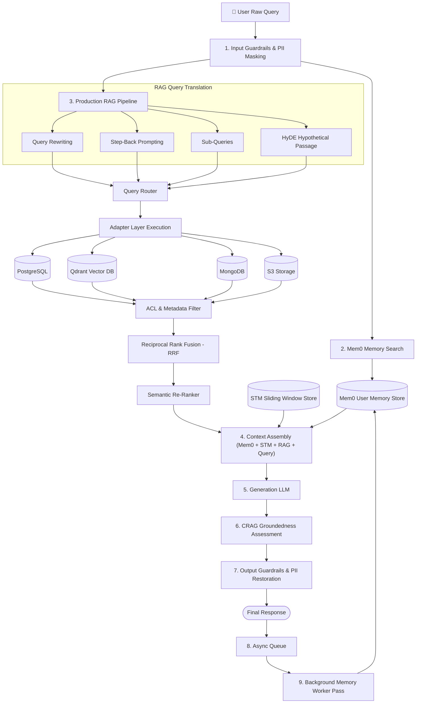

# 🚀 Production RAG + Mem0 Memory Architecture: Exhaustive Step-by-Step Code Guide

This document provides a deep, line-by-line technical breakdown of every single file in the **Production RAG + Mem0 Memory System** under [`week04/learning/day07/code/adv-rag-memory/`](file:///home/aminul/development/gen-ai-cohort/week04/learning/day07/code/adv-rag-memory/).

---

## 📌 Architectural Overview & Master Flowchart

Production AI applications require two complementary retrieval systems:
1. **Mem0 Memory Layer**: Answers *"Who is the user and what are their long-term preferences, facts, and past decisions?"*
2. **Production RAG Layer**: Answers *"What does the external knowledge base, documentation, and database say?"*

---

## 📁 Comprehensive File-by-File Technical Deep Dive

---

### 1. Project Setup & Configuration

#### 📄 [`package.json`](file:///home/aminul/development/gen-ai-cohort/week04/learning/day07/code/adv-rag-memory/package.json)
- **Purpose**: Manifest defining dependencies (`openai`, `@google/genai`, `express`, `dotenv`) and execution scripts (`npm start`, `npm run cli`, `npm run worker`). Uses standard ES Modules (`"type": "module"`).

#### 📄 [`.env.example`](file:///home/aminul/development/gen-ai-cohort/week04/learning/day07/code/adv-rag-memory/.env.example)
- **Purpose**: Template for environment keys (`OPENAI_API_KEY`, `LLM_PROVIDER`, `MEM0_TOP_K`, `RAG_TOP_K`, `RRF_K`).

#### 📄 [`src/config.js`](file:///home/aminul/development/gen-ai-cohort/week04/learning/day07/code/adv-rag-memory/src/config.js)
- **Purpose**: Centralized application configuration manager parsing environment variables with safe defaults.

---

### 2. Infrastructure Connectors (`src/infrastructure/`)

#### 📄 [`src/infrastructure/postgres.js`](file:///home/aminul/development/gen-ai-cohort/week04/learning/day07/code/adv-rag-memory/src/infrastructure/postgres.js)
- **Purpose**: Mock & connection pool connector to relational PostgreSQL database storing user project metadata.

#### 📄 [`src/infrastructure/redis.js`](file:///home/aminul/development/gen-ai-cohort/week04/learning/day07/code/adv-rag-memory/src/infrastructure/redis.js)
- **Purpose**: Redis connector managing background memory job queues (`lpush`/`rpop`).

#### 📄 [`src/infrastructure/qdrant.js`](file:///home/aminul/development/gen-ai-cohort/week04/learning/day07/code/adv-rag-memory/src/infrastructure/qdrant.js)
- **Purpose**: Qdrant vector database connector executing vector similarity search.

---

### 3. Guardrails Subsystem (`src/guardrails/`)

#### 📄 [`src/guardrails/pii.js`](file:///home/aminul/development/gen-ai-cohort/week04/learning/day07/code/adv-rag-memory/src/guardrails/pii.js)
- **Purpose**: Sanitizes text by replacing emails, phone numbers, and API keys with placeholders (`[PII_EMAIL_1]`). Unmasks values in final responses.

#### 📄 [`src/guardrails/injection.js`](file:///home/aminul/development/gen-ai-cohort/week04/learning/day07/code/adv-rag-memory/src/guardrails/injection.js)
- **Purpose**: Detects prompt injection attempts (e.g. *"ignore previous instructions"*).

#### 📄 [`src/guardrails/input.js`](file:///home/aminul/development/gen-ai-cohort/week04/learning/day07/code/adv-rag-memory/src/guardrails/input.js)
- **Purpose**: Master input processor combining Auth checks, Injection checks, and PII masking.

#### 📄 [`src/guardrails/output.js`](file:///home/aminul/development/gen-ai-cohort/week04/learning/day07/code/adv-rag-memory/src/guardrails/output.js)
- **Purpose**: Restores PII values and verifies output safety before responding to the user.

---

### 4. Mem0 Memory Subsystem (`src/memory/`)

#### 📄 [`src/memory/mem0.js`](file:///home/aminul/development/gen-ai-cohort/week04/learning/day07/code/adv-rag-memory/src/memory/mem0.js)
- **Purpose**: Mem0 client storing structured long-term semantic user memories.

#### 📄 [`src/memory/memorySearch.js`](file:///home/aminul/development/gen-ai-cohort/week04/learning/day07/code/adv-rag-memory/src/memory/memorySearch.js)
- **Purpose**: Searches query-relevant facts from Mem0 store for inclusion in context assembly.

#### 📄 [`src/memory/memoryWriter.js`](file:///home/aminul/development/gen-ai-cohort/week04/learning/day07/code/adv-rag-memory/src/memory/memoryWriter.js)
- **Purpose**: Evaluates conversation turns, decides whether facts are worth long-term persistence, and writes to Mem0.

#### 📄 [`src/queues/memoryQueue.js`](file:///home/aminul/development/gen-ai-cohort/week04/learning/day07/code/adv-rag-memory/src/queues/memoryQueue.js)
- **Purpose**: Pushes conversation interaction logs to Redis buffer for async processing.

#### 📄 [`src/memory/memoryWorker.js`](file:///home/aminul/development/gen-ai-cohort/week04/learning/day07/code/adv-rag-memory/src/memory/memoryWorker.js)
- **Purpose**: Background daemon worker executing memory consolidation offline without slowing user responses.

---

### 5. Short-Term Memory & Conversation Store (`src/chat/`)

#### 📄 [`src/chat/stm.js`](file:///home/aminul/development/gen-ai-cohort/week04/learning/day07/code/adv-rag-memory/src/chat/stm.js)
- **Purpose**: Sliding window Short-Term Memory buffer maintaining recent $N$ messages per session.

#### 📄 [`src/chat/conversationStore.js`](file:///home/aminul/development/gen-ai-cohort/week04/learning/day07/code/adv-rag-memory/src/chat/conversationStore.js)
- **Purpose**: Stores immutable conversation logs.

---

### 6. Production RAG Subsystem (`src/rag/`)

- **`src/rag/query/rewrite.js`**: Query Rewriter.
- **`src/rag/query/stepBack.js`**: Step-Back Prompting generator.
- **`src/rag/query/subQueries.js`**: Sub-query decomposition.
- **`src/rag/query/hyde.js`**: HyDE hypothetical document generator.
- **`src/rag/routing/queryRouter.js`**: Directs queries to backend adapters based on keywords.
- **`src/rag/adapters/`**: Adapters for PostgreSQL, Qdrant, MongoDB, and S3.
- **`src/rag/retrieval/filtering.js`**: Metadata & ACL permission filter.
- **`src/rag/retrieval/rrf.js`**: Reciprocal Rank Fusion ($k=60$).
- **`src/rag/retrieval/reranker.js`**: Semantic Re-Ranker.
- **`src/rag/retrieval/search.js`**: Parallel multi-source search orchestrator.
- **`src/rag/generation/contextBuilder.js`**: Context Assembly module combining System Instructions + Mem0 + STM + RAG Evidence + Query.
- **`src/rag/generation/generate.js`**: LLM generation caller with vLLM & OpenAI support.
- **`src/rag/evaluation/crag.js`**: Corrective RAG (CRAG) evaluator.
- **`src/rag/pipeline.js`**: RAG subsystem pipeline.

---

### 7. Orchestration & REST Gateway

#### 📄 [`src/api/server.js`](file:///home/aminul/development/gen-ai-cohort/week04/learning/day07/code/adv-rag-memory/src/api/server.js)
- **Purpose**: Express REST API endpoint (`POST /chat`).

#### 📄 [`index.js`](file:///home/aminul/development/gen-ai-cohort/week04/learning/day07/code/adv-rag-memory/index.js)
- **Purpose**: End-to-end multi-turn CLI demonstration runner.
