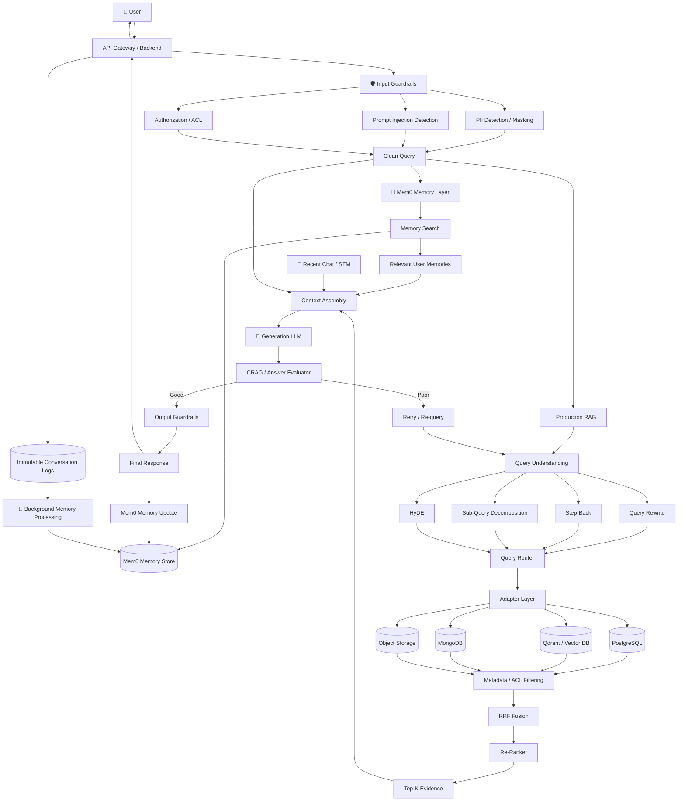
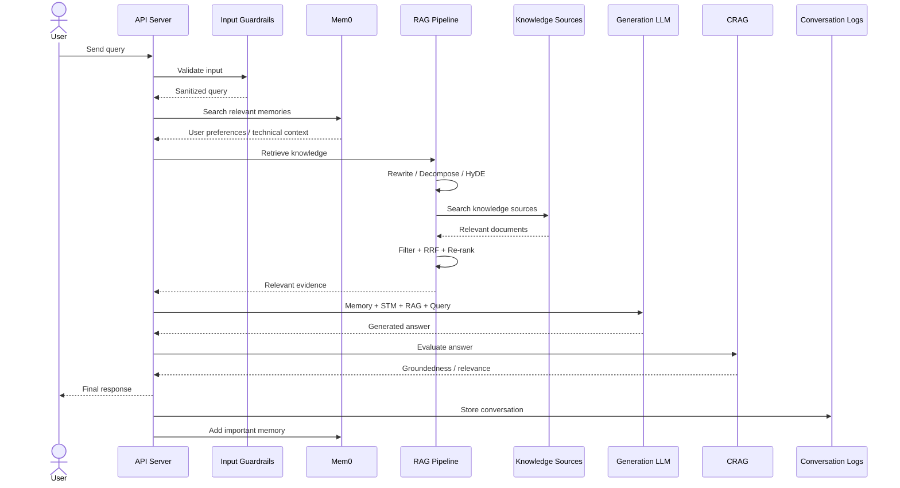
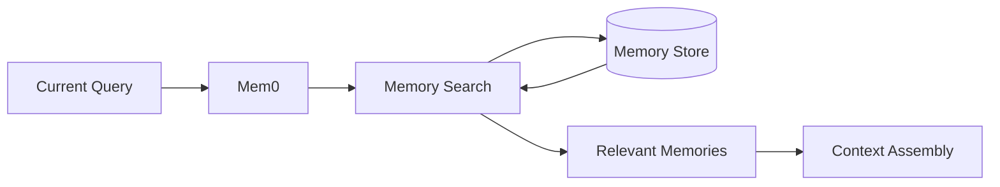
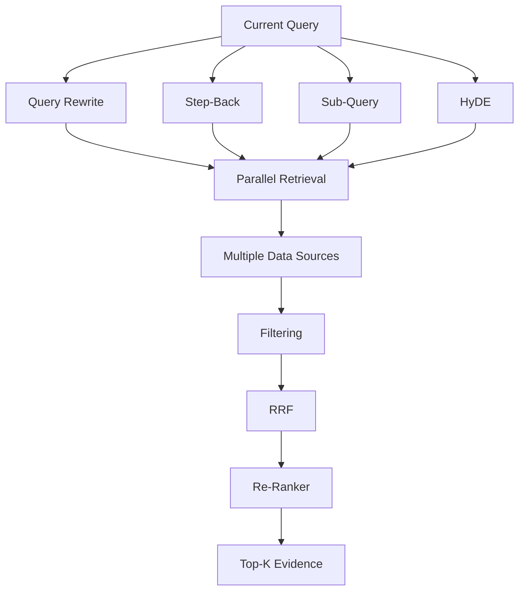
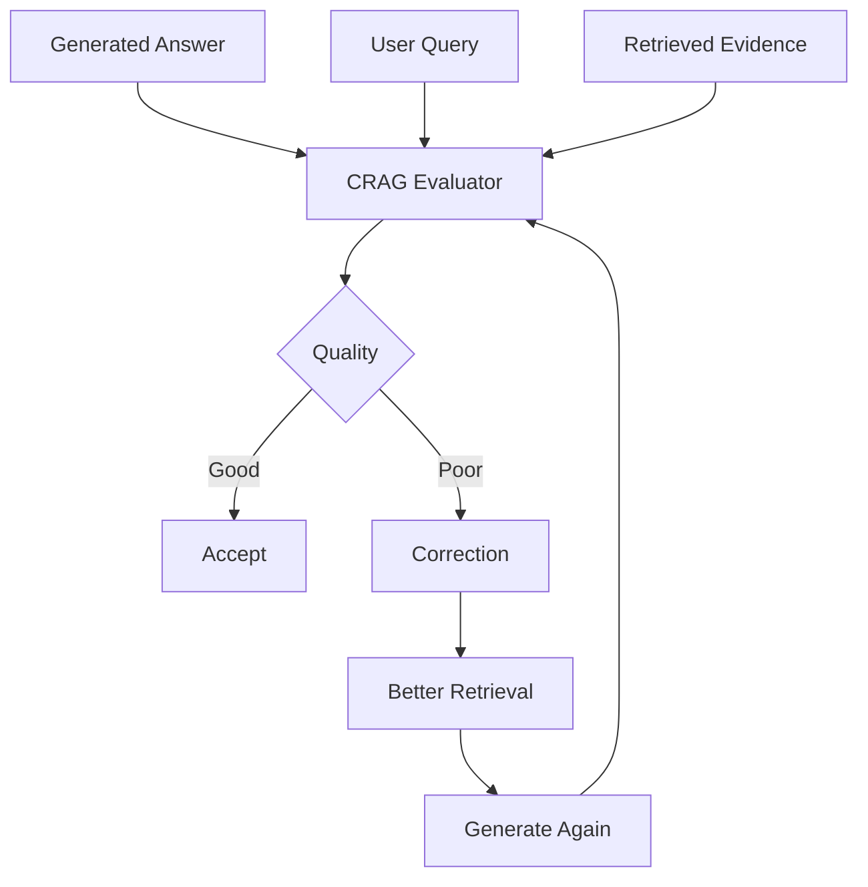
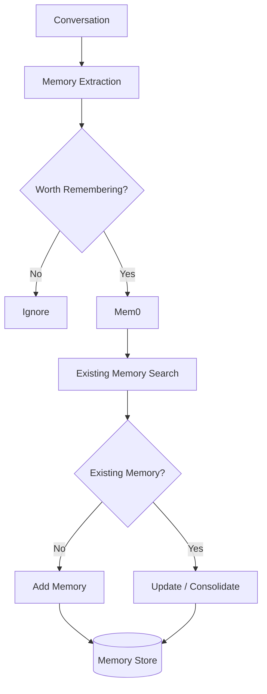
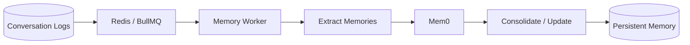
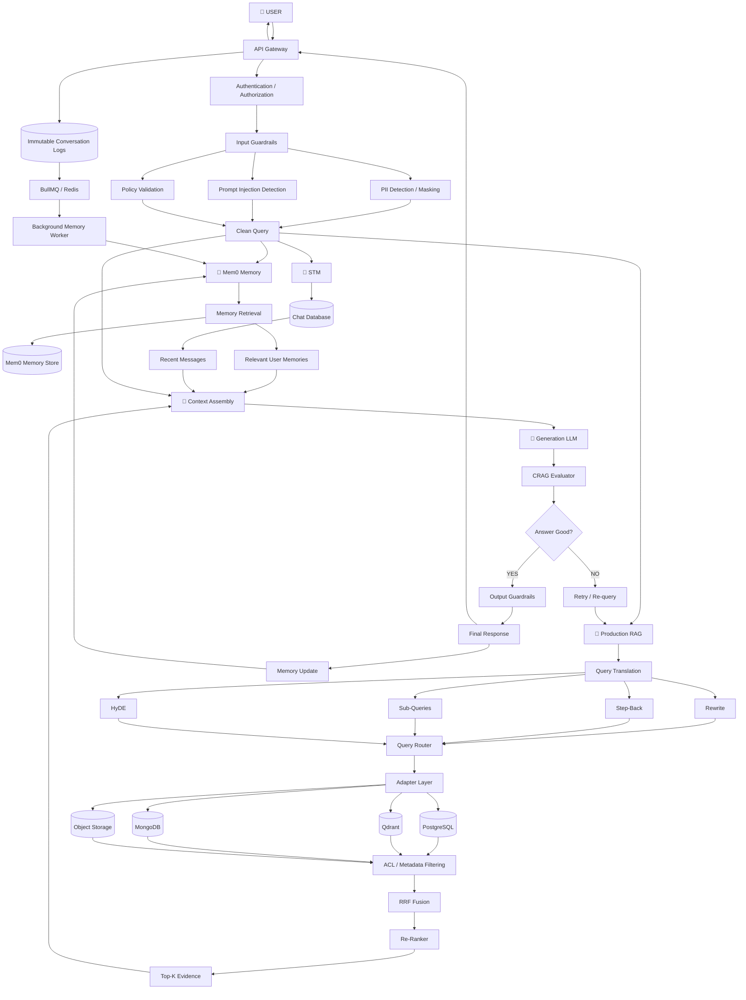
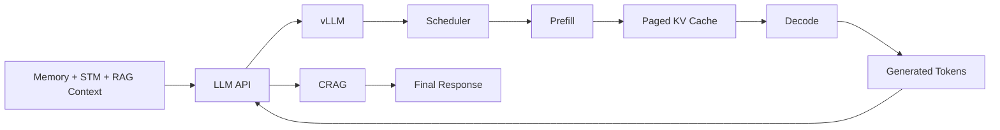

# 🚀 Production RAG + Mem0 Memory Architecture

The next evolution of the Production RAG architecture is to add **persistent agent memory** using **mem0**.

The key idea is:

> **RAG answers questions from external knowledge, while Mem0 remembers important information about the user and previous interactions.**

Instead of treating RAG and memory as the same system, keep them as two complementary layers.

---

# 1. 🧠 High-Level Architecture



---

# 2. 🔥 The Most Important Concept

A production AI application now has **two retrieval systems**:

```text
                    USER QUERY
                        │
             ┌──────────┴──────────┐
             ↓                     ↓
      🧠 MEMORY RETRIEVAL     🔎 KNOWLEDGE RETRIEVAL
           Mem0                    RAG
             │                     │
             ↓                     ↓
      User-specific facts     External knowledge
      Preferences             Company documents
      Past decisions          PDFs
      Important history       Database records
             │                     │
             └──────────┬──────────┘
                        ↓
                 CONTEXT ASSEMBLY
                        ↓
                       LLM
                        ↓
                    RESPONSE
```

### Mem0 answers:

```text
"What does the system know about this user?"
```

### RAG answers:

```text
"What does the external knowledge base say?"
```

Together:

```text
Personal Memory + External Knowledge + Recent Conversation
                         ↓
                        LLM
```

---

# 3. 🧠 Mem0 as the Long-Term Memory Layer

Without Mem0:

```text
User
 ↓
RAG
 ↓
Documents
 ↓
LLM
```

With Mem0:

```text
User
 ↓
API
 ├──→ Mem0
 │      ↓
 │   User Memories
 │
 └──→ Production RAG
        ↓
     Knowledge
        ↓
     Context
        ↓
       LLM
```

Mem0 should therefore be treated as a **memory subsystem**, not as a replacement for your knowledge-base RAG.

---

# 4. 💬 Short-Term Memory + Mem0 + RAG

The complete context can contain three different sources:

```text
┌──────────────────────────────────────┐
│          FINAL LLM CONTEXT            │
├──────────────────────────────────────┤
│                                      │
│ System Instructions                  │
│                                      │
│ Relevant Mem0 Memories               │
│                                      │
│ Recent Conversation / STM            │
│                                      │
│ Retrieved RAG Evidence               │
│                                      │
│ Current User Query                   │
│                                      │
└──────────────────────────────────────┘
```

Conceptually:

```text
Final Context =
System Prompt
+
Relevant Mem0 Memories
+
Recent STM
+
Retrieved RAG Context
+
Current Query
```

The important part is **relevance**.

Do not send the entire memory database or entire chat history to the LLM.

---

# 5. 🔄 Complete Request Flow

Suppose the user asks:

```text
"Which database should I use for my new project?"
```

The request can flow through the system like this:



---

# 6. 🧩 Step-by-Step Production Flow

## Step 1 — User Request

```text
User
 ↓
"Recommend a database for my project"
```

---

## Step 2 — Input Guardrails

Before doing anything:

```text
PII Detection
Prompt Injection
Jailbreak Detection
Authorization
Policy Validation
```

If invalid:

```text
Request
 ↓
Guardrail
 ↓
BLOCK
```

Otherwise:

```text
Guardrail
 ↓
Clean Query
```

---

# 7. Step 3 — Retrieve Memory from Mem0

Now search the user's long-term memory.

For example, Mem0 may return:

```text
Memory 1:
User frequently works with TypeScript.

Memory 2:
User prefers JavaScript/Node.js.

Memory 3:
User is building GenAI applications.

Memory 4:
User previously used PostgreSQL.
```

The important point:

> Only memories relevant to the current query should be included.

Architecture:



---

# 8. Step 4 — STM Retrieval

At the same time, retrieve recent conversation history.

```text
Chat Database
     ↓
Latest N Messages
     ↓
STM
```

For example:

```text
User:
I am starting a new backend project.

Assistant:
What stack are you considering?

User:
Probably Node.js.

Current Query:
Which database should I use?
```

STM provides immediate conversational context.

---

# 9. Step 5 — Production RAG

Now the knowledge retrieval pipeline starts.



---

# 10. Step 6 — Context Assembly

Now combine the three major context sources:

```text
                    ┌───────────────┐
                    │ Mem0 Memories │
                    └───────┬───────┘
                            │
                            ↓
┌────────────┐      ┌───────────────┐      ┌──────────────┐
│    STM     │ ───→ │    CONTEXT    │ ←─── │  RAG Top-K   │
└────────────┘      └───────┬───────┘      └──────────────┘
                            │
                            ↓
                       Generation LLM
```

Example:

```text
SYSTEM:
You are a helpful AI assistant.

USER MEMORY:
- User prefers TypeScript.
- User frequently builds Node.js applications.
- User is learning GenAI.

RECENT CHAT:
- User is building a new backend project.
- User plans to use Node.js.

KNOWLEDGE:
- PostgreSQL documentation...
- MongoDB documentation...
- Redis documentation...

CURRENT QUESTION:
Which database should I use?
```

Now the LLM can give a **personalized and grounded** answer.

---

# 11. Step 7 — Generation

The LLM receives:

```text
System
+
Mem0
+
STM
+
RAG
+
Query
```

and produces:

```text
Generated Answer
```

The important distinction:

```text
Mem0 → personalization
RAG  → factual grounding
STM  → conversational continuity
LLM  → reasoning + generation
```

---

# 12. Step 8 — CRAG Evaluation

After generation:



Evaluate:

```text
Groundedness
Relevance
Completeness
Hallucination
```

---

# 13. Step 9 — Output Guardrails

Before returning the answer:

```text
Generated Answer
       ↓
Output Guardrails
       ↓
PII Check
       ↓
Safety Check
       ↓
Groundedness
       ↓
Final Response
```

This creates a second security boundary.

---

# 14. Step 10 — Store Conversation

After responding, persist the interaction.

```text
User Query
     +
Assistant Response
     ↓
Conversation Database
```

Keep the raw conversation logs immutable.

```text
Immutable Logs
      ↓
Future Analysis
      ↓
Memory Extraction
      ↓
Mem0
```

---

# 15. Step 11 — Update Mem0

This is where the system decides:

> **Should anything from this conversation become long-term memory?**

For example:

```text
User:
"I prefer PostgreSQL for most of my projects."
```

This may become:

```text
Memory:
User prefers PostgreSQL for most projects.
```

But:

```text
User:
"I am using PostgreSQL today."
```

does not necessarily need to become permanent memory.

The application should avoid storing every conversation message as memory.

---

# 16. 🧠 Memory Write Pipeline



This is much better than:

```text
Every message → Permanent memory
```

---

# 17. 🌙 Background Memory Processing

Memory maintenance should not slow down the user's request.

Use asynchronous workers:



This allows:

```text
User Request
     ↓
Fast Response
```

while memory maintenance happens:

```text
Asynchronously
```

---

# 18. 🔥 Complete Production RAG + Mem0 Architecture



---

# 19. 🧠 Where Mem0 Fits

The most important architectural distinction is:

```text
                    AI APPLICATION
                         │
          ┌──────────────┴──────────────┐
          │                             │
          ↓                             ↓
     MEMORY LAYER                  KNOWLEDGE LAYER
       Mem0                           RAG
          │                             │
          ↓                             ↓
   User-specific data            External knowledge
          │                             │
          └──────────────┬──────────────┘
                         ↓
                  Context Assembly
                         ↓
                        LLM
```

### Mem0

```text
Who is the user?
What does the user prefer?
What has the user previously decided?
What important facts should persist?
```

### RAG

```text
What does our documentation say?
What does the database contain?
What does this PDF say?
What does the knowledge base say?
```

---

# 20. 🏗️ Production Components

A realistic stack could look like:

```text
Frontend
   ↓
Node.js / Express API
   ↓
────────────────────────────────
│
├── Authentication
├── Input Guardrails
├── PII Protection
│
├── Mem0
│   └── Long-Term User Memory
│
├── STM
│   └── PostgreSQL / Redis
│
├── Production RAG
│   ├── Query Rewrite
│   ├── Step-Back
│   ├── Sub-Queries
│   ├── HyDE
│   ├── Query Router
│   ├── Adapters
│   ├── Vector Search
│   ├── Metadata Filtering
│   ├── RRF
│   └── Re-Ranker
│
├── Generation LLM
│
├── CRAG
│
├── Output Guardrails
│
└── Background Workers
```

Possible infrastructure:

```text
PostgreSQL
Qdrant
Redis
BullMQ
Object Storage
Mem0
LLM Provider / vLLM
```

---

# 21. 📁 Recommended Folder Structure

```text
src/
│
├── api/
│   ├── server.js
│   └── routes/
│
├── memory/
│   ├── mem0.js
│   ├── memorySearch.js
│   ├── memoryWriter.js
│   └── memoryWorker.js
│
├── chat/
│   ├── stm.js
│   └── conversationStore.js
│
├── rag/
│   ├── pipeline.js
│   │
│   ├── query/
│   │   ├── rewrite.js
│   │   ├── stepBack.js
│   │   ├── subQueries.js
│   │   └── hyde.js
│   │
│   ├── routing/
│   │   └── queryRouter.js
│   │
│   ├── adapters/
│   │   ├── postgres.js
│   │   ├── qdrant.js
│   │   ├── mongodb.js
│   │   └── storage.js
│   │
│   ├── retrieval/
│   │   ├── search.js
│   │   ├── filtering.js
│   │   ├── rrf.js
│   │   └── reranker.js
│   │
│   ├── generation/
│   │   ├── contextBuilder.js
│   │   └── generate.js
│   │
│   └── evaluation/
│       └── crag.js
│
├── guardrails/
│   ├── input.js
│   ├── pii.js
│   ├── injection.js
│   └── output.js
│
├── queues/
│   ├── indexingQueue.js
│   └── memoryQueue.js
│
└── infrastructure/
    ├── postgres.js
    ├── redis.js
    └── qdrant.js
```

---

# 22. 🔄 End-to-End Flow in One View

```text
USER
 │
 ↓
API
 │
 ↓
AUTH
 │
 ↓
INPUT GUARDRAILS
 │
 ├── PII
 ├── Injection
 └── Authorization
 │
 ↓
CLEAN QUERY
 │
 ├─────────────────────────────┐
 ↓                             ↓
MEM0                         RAG
 │                             │
 ↓                             ↓
Relevant Memory           Query Translation
 │                             │
 │                    ┌────────┼────────┐
 │                    ↓        ↓        ↓
 │                  Rewrite  HyDE   Sub-Query
 │                    └────────┼────────┘
 │                             ↓
 │                         Router
 │                             ↓
 │                       Data Sources
 │                             ↓
 │                       Filtering
 │                             ↓
 │                           RRF
 │                             ↓
 │                         Re-Rank
 │                             ↓
 │                           Top-K
 │                             │
 └──────────────┬──────────────┘
                ↓
        CONTEXT ASSEMBLY
                ↑
                │
              STM
                │
                ↓
              LLM
                ↓
             CRAG
                │
        ┌───────┴────────┐
        ↓                ↓
      GOOD              BAD
        ↓                ↓
 Output Guard       Re-query / Retry
        ↓                │
      FINAL ←─────────────┘
        │
        ↓
      USER

        │
        ↓
Conversation Logs
        │
        ↓
Background Worker
        │
        ↓
      Mem0
```

---

# 23. ⚡ If vLLM Is Also Used

If you self-host the generation model with vLLM, the final generation layer becomes:



So the complete system has **two independent optimization dimensions**:

```text
🧠 Memory + Retrieval Optimization

        +

⚡ LLM Inference Optimization
```

---

# 24. 🎯 Final Mental Model

Remember the architecture as:

```text
GUARD
  ↓
UNDERSTAND
  ↓
MEMORY + STM
  ↓
TRANSLATE QUERY
  ↓
ROUTE
  ↓
RETRIEVE
  ↓
FILTER
  ↓
RRF
  ↓
RE-RANK
  ↓
ASSEMBLE CONTEXT
  ↓
LLM
  ↓
CRAG
  ↓
OUTPUT GUARD
  ↓
ANSWER
  ↓
MEM0 UPDATE
```

### The simplest way to remember it:

> **Mem0 remembers the user.**

> **STM remembers the current conversation.**

> **RAG remembers the external knowledge.**

> **Retrieval decides what information the LLM needs.**

> **CRAG checks whether the answer is trustworthy.**

> **Background workers keep memory and indexing healthy.**

> **vLLM makes the actual LLM inference efficient.**

And the complete production architecture becomes:

```text
             🧠 USER MEMORY
                  Mem0
                    │
                    ↓
USER → GUARD → QUERY → RAG → CONTEXT → LLM → CRAG → ANSWER
                    ↑       ↑
                    │       │
                  STM     Knowledge
                           Base
                    │
                    ↓
              Background Jobs
                    │
                    ↓
              Memory Updates
```

### 🚀 One-line architecture

> **Guard → Understand → Retrieve Memory → Translate Query → Retrieve Knowledge → Filter → Fuse → Re-rank → Assemble Context → Generate → Evaluate → Guard → Answer → Update Mem0**
