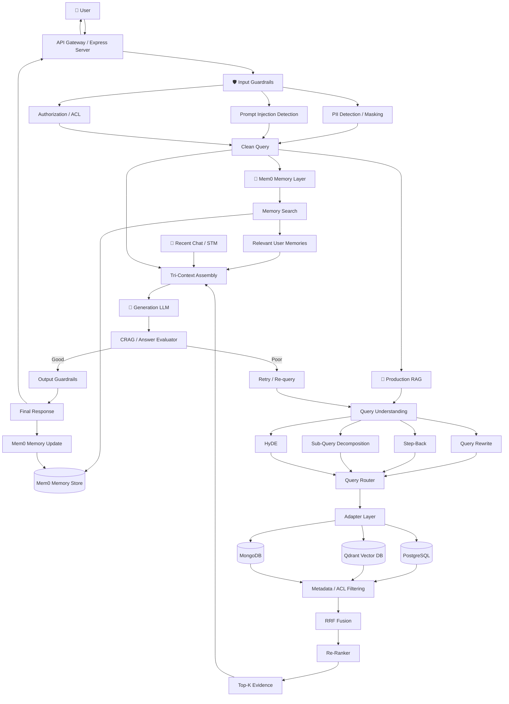
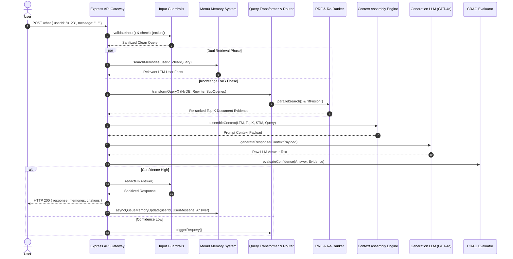

# Production Advanced RAG + Mem0 Memory Master Index

Welcome to the **Advanced RAG + Mem0 Memory Guide**! This guide takes backend and AI engineers step-by-step through building a production-grade **Retrieval-Augmented Generation (RAG) system integrated with Mem0 Long-Term User Memory**.

Built with **Node.js (ESM)**, **Express**, **OpenAI / Google Gemini**, **Mem0**, **Qdrant Vector DB**, **PostgreSQL**, and **Redis**, this architecture separates knowledge retrieval into two complementary layers: **Knowledge RAG** (answering questions from external documents) and **Mem0 Long-Term Memory** (remembering facts, preferences, and decisions about specific users).

---

## 📁 Project Folder Structure Map

All source code for this system is located inside `week04/learning/day07/code/adv-rag-memory/`:

```text
adv-rag-memory/
├── package.json                   # NPM dependencies & scripts ("type": "module")
├── .env.example                   # API keys & server configuration template
├── README.md                      # Architecture summary & system prerequisites
├── index.js                       # Interactive CLI entry point
├── implementation guide/          # Step-by-step implementation chapters & documentation
│   ├── README.md                  # Master index & system architecture (this file)
│   ├── chapter-00-overview-setup.md
│   ├── chapter-01-guardrails-stm.md
│   ├── chapter-02-mem0-ltm.md
│   ├── chapter-03-query-understanding.md
│   ├── chapter-04-retrieval-rrf-rerank.md
│   ├── chapter-05-context-crag-pipeline.md
│   └── chapter-06-api-server-cli.md
└── src/
    ├── config.js                  # Central environment configuration loader
    ├── api/
    │   └── server.js              # Express REST API Gateway (/chat, /ingest, /memories)
    ├── chat/
    │   ├── stm.js                 # Sliding window Short-Term Memory (STM)
    │   └── conversationStore.js   # Immutable chat log store
    ├── guardrails/
    │   ├── input.js               # Input schema validation & length checks
    │   ├── injection.js           # Prompt injection detection
    │   ├── pii.js                 # PII detection & masking (SSN, Email, API Keys)
    │   └── output.js              # Hallucination & output quality validation
    ├── infrastructure/
    │   ├── postgres.js            # PostgreSQL database client
    │   ├── qdrant.js              # Qdrant Vector DB client
    │   └── redis.js               # Redis client & event queue driver
    ├── memory/
    │   ├── mem0.js                # Mem0 SDK integration & memory manager
    │   ├── memorySearch.js        # High-level memory retrieval interface
    │   ├── memoryWriter.js        # Non-blocking memory extraction writer
    │   └── memoryWorker.js        # Background memory synthesis worker
    ├── queues/
    │   └── memoryQueue.js         # Redis/Async event queue driver
    └── rag/
        ├── query/                 # Query Transformation Subsystem
        │   ├── hyde.js            # Hypothetical Document Embeddings (HyDE)
        │   ├── rewrite.js         # Query Rewriter
        │   ├── stepBack.js        # Step-Back Prompting
        │   └── subQueries.js      # Sub-query Decomposition
        ├── routing/
        │   └── queryRouter.js     # Intent & Target Store Router
        ├── adapters/              # Data Storage Adapters
        │   ├── storage.js         # Unified Storage Adapter Interface
        │   ├── qdrant.js          # Qdrant Vector Adapter
        │   ├── postgres.js        # PostgreSQL Relational Adapter
        │   └── mongodb.js         # MongoDB Document Adapter
        ├── retrieval/             # Advanced Retrieval Engine
        │   ├── filtering.js       # Metadata & ACL Security Filtering
        │   ├── search.js          # Multi-query parallel retrieval
        │   ├── rrf.js             # Reciprocal Rank Fusion (RRF)
        │   └── reranker.js        # Cross-Encoder Re-ranking
        ├── generation/            # Context Assembly & LLM Generation
        │   ├── contextBuilder.js  # Tri-Context Assembly (LTM + RAG Evidence + STM)
        │   └── generate.js        # LLM Completion Generator
        ├── evaluation/
        │   └── crag.js            # Corrective RAG (CRAG) Evaluator
        └── pipeline.js            # Main RAG + Mem0 Orchestration Engine
```

---

## 🏗 Dual Retrieval System Architecture

The core design principle separates **Memory Retrieval** from **Knowledge Retrieval**:



---

## 🔄 End-to-End Query Execution Sequence



---

## 📚 Master Chapter Reference Table

| Chapter | Focus Area | Guide File | Key Topics Covered |
| :--- | :--- | :--- | :--- |
| **Ch 0** | **Overview & Setup** | [Chapter 00 Guide](chapter-00-overview-setup.md) | Node.js ESM setup, `package.json`, environment config (`src/config.js`), infrastructure connectors (`postgres.js`, `qdrant.js`, `redis.js`). |
| **Ch 1** | **Guardrails & STM** | [Chapter 01 Guide](chapter-01-guardrails-stm.md) | Input validation, prompt injection checks (`injection.js`), PII redaction (`pii.js`), output guardrails (`output.js`), Short-Term Memory sliding window (`stm.js`). |
| **Ch 2** | **Mem0 & LTM** | [Chapter 02 Guide](chapter-02-mem0-ltm.md) | Mem0 client SDK (`mem0.js`), memory search (`memorySearch.js`), Redis queue driver (`memoryQueue.js`), async memory writer (`memoryWriter.js`), background worker (`memoryWorker.js`). |
| **Ch 3** | **Query Processing** | [Chapter 03 Guide](chapter-03-query-understanding.md) | Query transformations: HyDE (`hyde.js`), Query Rewriting (`rewrite.js`), Step-Back (`stepBack.js`), Sub-query decomposition (`subQueries.js`), Intent Router (`queryRouter.js`). |
| **Ch 4** | **Retrieval & RRF** | [Chapter 04 Guide](chapter-04-retrieval-rrf-rerank.md) | Storage adapters (`qdrant.js`, `postgres.js`, `mongodb.js`), metadata & ACL filtering (`filtering.js`), Reciprocal Rank Fusion (`rrf.js`), Cross-Encoder Re-ranker (`reranker.js`). |
| **Ch 5** | **Context & CRAG** | [Chapter 05 Guide](chapter-05-context-crag-pipeline.md) | Tri-Context Assembly (`contextBuilder.js`), LLM generation (`generate.js`), Corrective RAG evaluator (`crag.js`), Master Pipeline Orchestrator (`pipeline.js`). |
| **Ch 6** | **API & CLI Gateway** | [Chapter 06 Guide](chapter-06-api-server-cli.md) | Express REST API Gateway (`server.js`), endpoints (`/chat`, `/ingest`, `/memories`), CLI entry point (`index.js`), end-to-end verification. |

---

## ⚡ Quick Start Sequence

### 1. Install Dependencies
Navigate to the project root and install dependencies:

```bash
cd week04/learning/day07/code/adv-rag-memory
npm install
```

### 2. Configure Environment Variables
Copy `.env.example` to `.env` and set your API keys:

```bash
cp .env.example .env
```

### 3. Run the REST API Gateway

```bash
npm start
```

### 4. Run the Interactive CLI Demo

```bash
npm run cli
```
