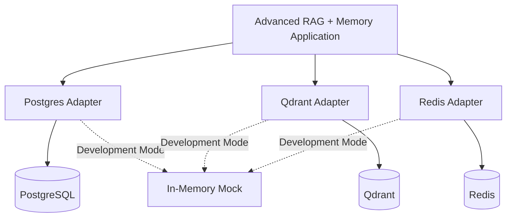
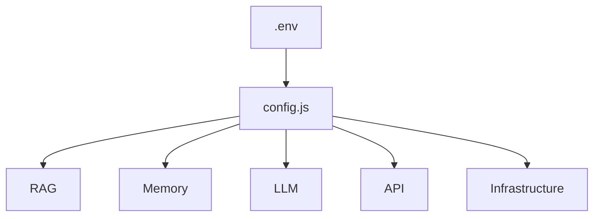
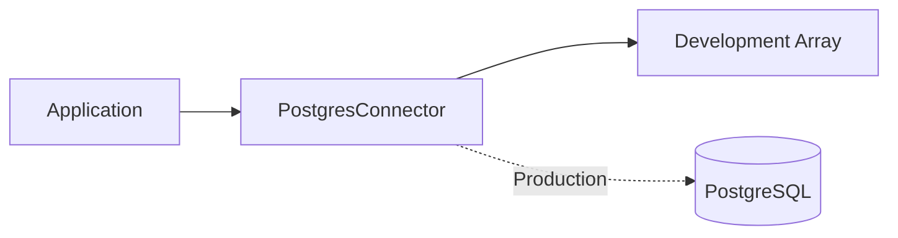
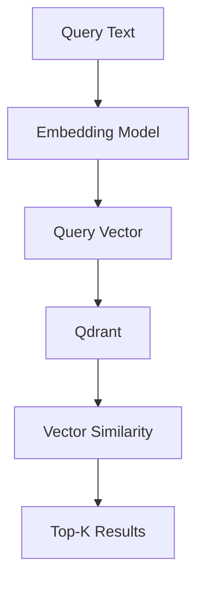
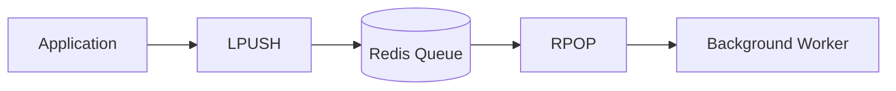
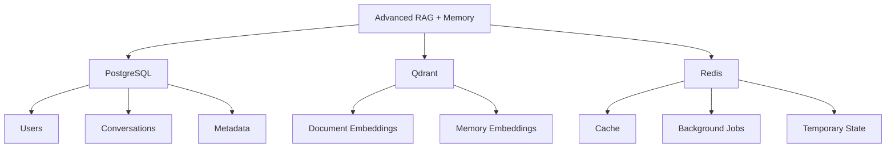
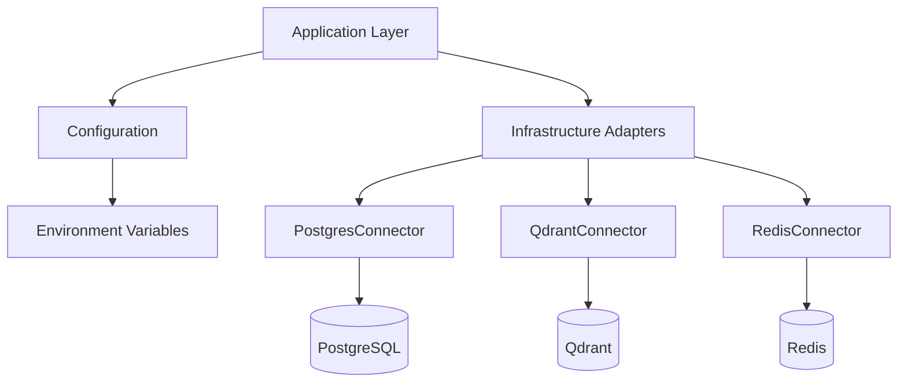
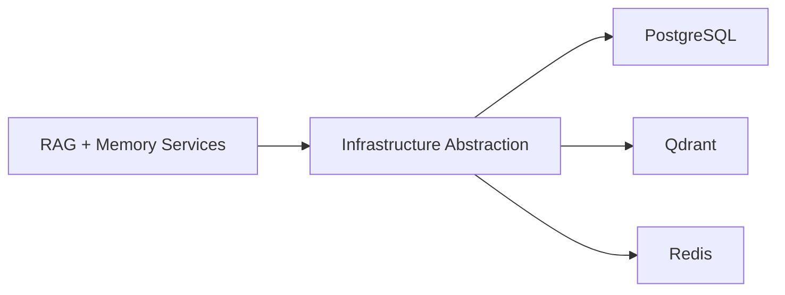

# Chapter 0 — Overview, Environment & Infrastructure Adapters

## 1. Chapter Goal

The goal of this chapter is to prepare the **Node.js ESM runtime** and establish the infrastructure abstraction layer for the Advanced RAG + Mem0 memory system.

A production-grade RAG + Memory architecture typically separates application logic from its underlying data infrastructure.

This project uses three primary infrastructure categories:

| Infrastructure | Responsibility                                                      |
| -------------- | ------------------------------------------------------------------- |
| **Qdrant**     | Dense vector storage and similarity retrieval                       |
| **PostgreSQL** | Relational metadata, users, conversations, and application records  |
| **Redis**      | Caching, queues, temporary state, and asynchronous job coordination |

The important architectural principle is:

```text
Application Logic
       ↓
Infrastructure Abstraction
       ↓
External Data Services
```

This allows the application layer to remain independent from the specific database implementation.

---

## 🎯 Expected Outcome

By the end of this chapter, the project will have a centralized configuration module and infrastructure adapters:

```text
src/
├── config.js
│
└── infrastructure/
    ├── postgres.js
    ├── qdrant.js
    └── redis.js
```

The initial adapters are intentionally lightweight and can operate without external database servers.

> **Important:** The implementations in this chapter are **development/mock adapters**, not actual PostgreSQL, Qdrant, or Redis network clients. The interfaces are designed so that real clients can be introduced later without changing the higher-level architecture.

---

# 2. Infrastructure Architecture

The overall infrastructure relationship is:



During development, the mock implementations allow the rest of the application to be developed without requiring three running infrastructure services.

In production, these adapters can be replaced or upgraded to communicate with the actual services.

---

# 3. Project Setup

Navigate to the project directory:

```bash id="j6f2za"
cd week04/learning/day07/code/adv-rag-memory
```

The project should use native ES Modules.

---

# 4. `package.json`

Create or update:

```text id="e9k2mr"
package.json
```

```json id="h4q8vz"
{
  "name": "adv-rag-memory",
  "version": "1.0.0",
  "description": "Production Advanced RAG + Mem0 Long-Term Memory Architecture",
  "main": "index.js",
  "type": "module",
  "scripts": {
    "start": "node src/api/server.js",
    "cli": "node index.js",
    "dev": "node --watch index.js",
    "worker": "node --input-type=module -e \"import { runMemoryWorkerPass } from './src/memory/memoryWorker.js'; runMemoryWorkerPass();\""
  },
  "keywords": [
    "adv-rag",
    "mem0",
    "rag",
    "memory",
    "vllm",
    "rrf",
    "crag",
    "hyde"
  ],
  "author": "GenAI Cohort",
  "license": "ISC",
  "dependencies": {
    "@google/genai": "^0.13.0",
    "dotenv": "^16.4.7",
    "express": "^4.21.2",
    "openai": "^4.52.7"
  }
}
```

Run:

```bash id="d8o0hz"
npm install
```

### Why `"type": "module"`?

The project uses:

```javascript id="b5n3tu"
import { config } from "./src/config.js";
```

instead of CommonJS:

```javascript id="r8q1hx"
const config = require("./src/config.js");
```

The following enables native ESM:

```json id="0gqjvk"
"type": "module"
```

---

# 5. Environment Configuration

Create:

```text id="u6s8pr"
.env.example
```

```env id="d4f6wk"
PORT=8000

LLM_PROVIDER=openai
EMBEDDING_PROVIDER=openai

OPENAI_API_KEY=your-openai-api-key
GEMINI_API_KEY=your-gemini-api-key

MEM0_TOP_K=3
STM_MAX_TURNS=6

RAG_TOP_K=5
RRF_K=60
CRAG_THRESHOLD=6.0
```

For local development, copy it:

```bash id="a9k4qs"
cp .env.example .env
```

Then replace placeholder API keys with actual values when required.

### Security Rule

Never commit `.env` to Git.

Add:

```text id="w2j8nv"
.env
```

to `.gitignore`.

---

# 6. Configuration Loader

## File Path

```text id="e2c9vz"
src/config.js
```

## Implementation

```javascript id="p7x3mc"
import dotenv from "dotenv";

dotenv.config();

export const config = {
  port: parseInt(
    process.env.PORT || "8000",
    10
  ),

  llmProvider:
    process.env.LLM_PROVIDER || "openai",

  embeddingProvider:
    process.env.EMBEDDING_PROVIDER || "openai",

  openaiApiKey:
    process.env.OPENAI_API_KEY || "",

  geminiApiKey:
    process.env.GEMINI_API_KEY || "",

  memory: {
    mem0TopK: parseInt(
      process.env.MEM0_TOP_K || "3",
      10
    ),

    stmMaxTurns: parseInt(
      process.env.STM_MAX_TURNS || "6",
      10
    ),
  },

  rag: {
    topK: parseInt(
      process.env.RAG_TOP_K || "5",
      10
    ),

    rrfK: parseInt(
      process.env.RRF_K || "60",
      10
    ),

    cragThreshold: parseFloat(
      process.env.CRAG_THRESHOLD || "6.0"
    ),
  },
};
```

---

# 7. Why Centralized Configuration Matters

Instead of reading environment variables throughout the application:

```javascript id="7t9m6d"
process.env.RAG_TOP_K
process.env.RRF_K
process.env.OPENAI_API_KEY
```

every module can consume:

```javascript id="x8m2kp"
import { config } from "../config.js";
```

For example:

```javascript id="r7f1mw"
config.rag.topK
```

This creates a single configuration boundary.



---

# 8. PostgreSQL Adapter

## File Path

```text id="p4w8zs"
src/infrastructure/postgres.js
```

PostgreSQL is intended to handle relational application data such as:

* users,
* projects,
* conversation metadata,
* message records,
* document metadata,
* memory metadata,
* application configuration.

The current implementation provides a development abstraction.

## Implementation

```javascript id="x3m7qa"
/**
 * Infrastructure Connector: PostgreSQL Data Access Layer
 *
 * Development/mock implementation.
 *
 * Production:
 * Replace the in-memory records with a real
 * PostgreSQL connection pool.
 */

export class PostgresConnector {
  constructor() {
    this.records = [
      {
        id: "proj_101",
        userId: "user_demo_001",
        title: "GenAI Production Stack",
        dbType: "PostgreSQL",
        tech: "TypeScript & Node.js",
      },

      {
        id: "proj_102",
        userId: "user_demo_001",
        title: "Vector Search Engine",
        dbType: "Qdrant",
        tech: "Python & vLLM",
      },
    ];
  }

  async queryUserProjects(userId) {
    if (!userId) {
      throw new Error("userId is required");
    }

    return this.records.filter(
      (record) =>
        record.userId === userId
    );
  }
}

export const postgresDb =
  new PostgresConnector();
```

---

# 9. Understanding the PostgreSQL Adapter

The higher-level application does not need to know whether the data comes from:

```text
JavaScript Array
```

or:

```text
PostgreSQL Database
```

It simply calls:

```javascript id="j8v2sp"
await postgresDb.queryUserProjects(
  userId
);
```

This abstraction is valuable because the implementation can later change.



---

# 10. Production PostgreSQL Evolution

The mock:

```javascript id="x6r1tc"
this.records = [];
```

would eventually be replaced with a real connection pool.

A production adapter might expose methods such as:

```text id="s7x3hm"
createUser()
getUser()
createConversation()
saveMessage()
getConversationHistory()
createDocumentMetadata()
getDocumentMetadata()
```

The rest of the application should communicate through these adapter methods rather than directly accessing the database.

---

# 11. Qdrant Vector Store Adapter

## File Path

```text id="g5z2cn"
src/infrastructure/qdrant.js
```

Qdrant is intended to store vector embeddings and perform similarity search.

The current adapter simulates this behavior using an in-memory collection.

## Implementation

```javascript id="k9w4xp"
/**
 * Infrastructure Connector: Qdrant Vector DB Layer
 *
 * Development/mock implementation.
 *
 * Production:
 * Replace the in-memory collection with
 * a real Qdrant client.
 */

export class QdrantConnector {
  constructor() {
    this.collection = [];
  }

  async upsert(points) {
    if (!Array.isArray(points)) {
      throw new Error(
        "points must be an array"
      );
    }

    this.collection.push(
      ...points
    );

    return {
      status: "completed",
      count: points.length,
    };
  }

  async search(vector, topK = 5) {
    if (!Array.isArray(vector)) {
      throw new Error(
        "vector must be an array"
      );
    }

    if (topK <= 0) {
      throw new Error(
        "topK must be greater than 0"
      );
    }

    const scored =
      this.collection.map((point) => {
        let similarity = 0;

        if (
          Array.isArray(point.vector) &&
          point.vector.length ===
            vector.length
        ) {
          similarity =
            point.vector.reduce(
              (sum, value, index) =>
                sum +
                value * vector[index],
              0
            );
        }

        return {
          ...point,
          score: similarity,
        };
      });

    scored.sort(
      (a, b) =>
        b.score - a.score
    );

    return scored.slice(
      0,
      topK
    );
  }
}

export const qdrantClient =
  new QdrantConnector();
```

---

# 12. Understanding Qdrant Search

The adapter receives:

```javascript id="o3n5yf"
await qdrantClient.search(
  queryVector,
  5
);
```

Conceptually:



The current mock uses a dot product.

For normalized vectors, dot product corresponds to cosine similarity.

However, the production vector database should be configured with an explicit distance metric and consistent embedding dimensions.

---

# 13. Important Embedding Dimension Rule

All vectors stored in the same collection must have compatible dimensions.

For example:

```text id="8q0x5a"
Embedding Model
      ↓
1536 dimensions
      ↓
Qdrant Collection
      ↓
1536 dimensions
```

Do not mix:

```text id="v4n7ds"
16-dimensional mock vectors
```

with:

```text id="x6r2pk"
1536-dimensional OpenAI vectors
```

inside the same vector collection.

This becomes particularly important when moving from the development mock implementation to real Qdrant.

---

# 14. Redis Adapter

## File Path

```text id="c8v5mr"
src/infrastructure/redis.js
```

Redis is intended for high-speed temporary state and asynchronous processing.

Typical uses include:

* caching,
* rate limiting,
* session state,
* queue buffers,
* background jobs,
* distributed locks.

The current adapter provides a small in-memory simulation.

## Implementation

```javascript id="f2m8qx"
/**
 * Infrastructure Connector: Redis Layer
 *
 * Development/mock implementation.
 *
 * Production:
 * Replace the Map with a real Redis client.
 */

export class RedisConnector {
  constructor() {
    this.store = new Map();
  }

  async get(key) {
    if (!key) {
      throw new Error(
        "key is required"
      );
    }

    return (
      this.store.get(key) ??
      null
    );
  }

  async set(key, value) {
    if (!key) {
      throw new Error(
        "key is required"
      );
    }

    this.store.set(
      key,
      value
    );

    return "OK";
  }

  async lpush(
    queueName,
    payload
  ) {
    if (!queueName) {
      throw new Error(
        "queueName is required"
      );
    }

    if (
      !this.store.has(
        queueName
      )
    ) {
      this.store.set(
        queueName,
        []
      );
    }

    this.store
      .get(queueName)
      .unshift(payload);

    return this.store
      .get(queueName)
      .length;
  }

  async rpop(queueName) {
    if (!queueName) {
      throw new Error(
        "queueName is required"
      );
    }

    if (
      !this.store.has(
        queueName
      )
    ) {
      return null;
    }

    const list =
      this.store.get(
        queueName
      );

    return list.pop() ?? null;
  }
}

export const redisCache =
  new RedisConnector();
```

---

# 15. Understanding Redis Queue Operations

The adapter implements two basic list operations:

```text id="s4t1we"
LPUSH
  ↓
Queue

RPOP
  ↓
Worker
```

For example:

```javascript id="b7y5qn"
await redisCache.lpush(
  "memory_jobs",
  {
    userId: "user_demo_001",
    type: "reflection",
  }
);
```

The worker can later retrieve it:

```javascript id="w6k3pr"
const job =
  await redisCache.rpop(
    "memory_jobs"
  );
```

Conceptually:



---

# 16. Infrastructure Layer Summary

The three adapters have different responsibilities:

```text id="r8y4kc"
PostgreSQL
    ↓
Relational Data

Qdrant
    ↓
Vector Data

Redis
    ↓
Fast Temporary Data + Queues
```

Together:



---

# 17. Why Use Infrastructure Adapters?

Without an adapter, application code might directly depend on a database SDK:

```javascript id="e5q9va"
await qdrantClient.upsert(...);
```

throughout dozens of modules.

That creates strong coupling.

Instead:

```text id="r2k6wm"
RAG Service
    ↓
VectorStore Interface
    ↓
Qdrant Adapter
    ↓
Qdrant
```

This makes it easier to:

* replace infrastructure,
* mock dependencies during tests,
* isolate database logic,
* centralize error handling,
* implement retries,
* add observability,
* support different environments.

---

# 18. Development vs Production

At this stage:

| Component      | Current Implementation   | Production Target                  |
| -------------- | ------------------------ | ---------------------------------- |
| PostgreSQL     | In-memory records        | PostgreSQL connection pool         |
| Qdrant         | In-memory array          | Qdrant client/API                  |
| Redis          | JavaScript `Map`         | Redis server                       |
| LTM            | In-memory memory records | Persistent memory/vector storage   |
| STM            | In-memory session map    | Redis/database-backed state        |
| Document Store | In-memory chunks         | Persistent document + vector store |

This distinction is important.

The current chapter establishes the **interfaces and architecture**, not the final production database deployment.

---

# 19. Verification — Configuration

Verify that the configuration loader works:

```bash id="m7c3xz"
node --input-type=module -e "
import { config } from './src/config.js';

console.log(
  'Loaded Config Port:',
  config.port
);
"
```

With:

```env id="g4x8qn"
PORT=8000
```

the expected output is:

```text id="t2w5mr"
Loaded Config Port: 8000
```

If `.env` is not configured, the default is also:

```text id="k8v3pd"
Loaded Config Port: 8000
```

So the original expectation of `3000` should be corrected.

---

# 20. Verification — PostgreSQL Adapter

Run:

```bash id="c7n2mv"
node --input-type=module -e "
import { postgresDb } from './src/infrastructure/postgres.js';

const projects =
  await postgresDb.queryUserProjects(
    'user_demo_001'
  );

console.log(
  'Projects:',
  projects
);
"
```

Expected structure:

```text id="v5m8ra"
Projects: [
  {
    id: 'proj_101',
    ...
  },
  {
    id: 'proj_102',
    ...
  }
]
```

---

# 21. Verification — Qdrant Adapter

Run:

```bash id="x9f2ck"
node --input-type=module -e "
import { qdrantClient } from './src/infrastructure/qdrant.js';

await qdrantClient.upsert([
  {
    id: 'point_1',
    vector: [1, 0, 0],
    payload: {
      title: 'RAG'
    }
  },
  {
    id: 'point_2',
    vector: [0, 1, 0],
    payload: {
      title: 'Memory'
    }
  }
]);

const results =
  await qdrantClient.search(
    [1, 0, 0],
    2
  );

console.log(
  'Top Vector Result:',
  results[0]
);
"
```

The first point should rank highest because:

```text id="n4v7sb"
[1,0,0] · [1,0,0] = 1
```

while:

```text id="p6z1wx"
[0,1,0] · [1,0,0] = 0
```

---

# 22. Verification — Redis Adapter

Run:

```bash id="q3x8km"
node --input-type=module -e "
import { redisCache } from './src/infrastructure/redis.js';

await redisCache.set(
  'test:key',
  'hello'
);

console.log(
  'Cached Value:',
  await redisCache.get('test:key')
);

await redisCache.lpush(
  'jobs',
  {
    type: 'memory-reflection'
  }
);

console.log(
  'Queue Job:',
  await redisCache.rpop('jobs')
);
"
```

Expected structure:

```text id="j8m4qv"
Cached Value: hello

Queue Job: {
  type: 'memory-reflection'
}
```

---

# 23. Complete Infrastructure Verification

A single smoke test can verify all three adapters:

```bash id="f8x2mc"
node --input-type=module -e "
import { postgresDb } from './src/infrastructure/postgres.js';
import { qdrantClient } from './src/infrastructure/qdrant.js';
import { redisCache } from './src/infrastructure/redis.js';

const projects =
  await postgresDb.queryUserProjects(
    'user_demo_001'
  );

await qdrantClient.upsert([
  {
    id: 'test_point',
    vector: [1, 0, 0]
  }
]);

const vectorResults =
  await qdrantClient.search(
    [1, 0, 0],
    1
  );

await redisCache.set(
  'health',
  'ok'
);

console.log({
  postgres: projects.length > 0,
  qdrant: vectorResults.length > 0,
  redis:
    (await redisCache.get(
      'health'
    )) === 'ok'
});
"
```

Expected:

```text id="s4c6pz"
{
  postgres: true,
  qdrant: true,
  redis: true
}
```

---

# 24. Chapter Architecture

At the end of this chapter:



The application now has a clean infrastructure boundary.

---

# 25. Important Production Considerations

Before deploying this architecture, several areas must be upgraded.

### Persistent Connections

The mock adapters must be replaced with real database clients.

### Connection Pooling

PostgreSQL should use a connection pool rather than creating a new database connection for every query.

### Vector Indexing

Qdrant should handle vector indexing rather than performing an O(N) JavaScript array scan.

### Redis Reliability

Production queue processing needs:

* retries,
* visibility/lease handling,
* failure queues,
* idempotency,
* job status tracking.

### Validation

Configuration values should be validated during application startup.

For example:

```text id="g9c3wv"
RAG_TOP_K > 0
RRF_K > 0
STM_MAX_TURNS > 0
CRAG_THRESHOLD between 0 and 10
PORT between 1 and 65535
```

### Secrets

API keys and database credentials should never be hard-coded into source files.

---

# 26. Chapter Summary

Chapter 0 establishes the infrastructure foundation for the Advanced RAG + Mem0 architecture.

We created:

```text id="k6r2mz"
src/
├── config.js
└── infrastructure/
    ├── postgres.js
    ├── qdrant.js
    └── redis.js
```

The responsibilities are:

```text id="n3w8qc"
PostgreSQL
→ Relational and metadata storage

Qdrant
→ Vector storage and retrieval

Redis
→ Cache and asynchronous job infrastructure
```

The most important architectural principle is **separation of concerns**.

The RAG and memory layers should not need to know whether data is being stored in an in-memory mock, PostgreSQL, Qdrant, or Redis.



This abstraction becomes especially valuable as the project moves from an educational prototype toward a production architecture.

---

# 27. Chapter Checklist

Before moving to Chapter 1, verify:

* [ ] Node.js ESM is enabled.
* [ ] `package.json` is configured.
* [ ] Dependencies are installed.
* [ ] `.env.example` exists.
* [ ] `.env` is excluded from Git.
* [ ] `config.js` loads environment variables.
* [ ] Configuration defaults work.
* [ ] PostgreSQL adapter initializes.
* [ ] PostgreSQL project lookup works.
* [ ] Qdrant adapter initializes.
* [ ] Vector upsert works.
* [ ] Vector search works.
* [ ] Redis adapter initializes.
* [ ] Redis key-value operations work.
* [ ] Redis queue operations work.
* [ ] All three infrastructure adapters pass the smoke test.
* [ ] You understand the difference between the current mock adapters and production services.

---

# 28. Next Chapter

The infrastructure layer is now established.

Next, the application can begin using these infrastructure primitives to build the actual RAG + Memory execution pipeline.

## Chapter 1 — Guardrails, Short-Term Memory & Request State

The next chapter will introduce the request-level safety and conversational memory layer:

```text
User Request
     ↓
Guardrails
     ↓
PII / Security Processing
     ↓
Short-Term Memory
     ↓
Conversation Context
```

From there, the system will progressively connect:

```text
Guardrails
    +
STM
    +
LTM / Mem0
    +
RAG
    +
RRF
    +
CRAG
    +
LLM
```

until the complete production-oriented orchestration layer is assembled.

### Key corrections I made

* **`PORT` is 8000**, so the verification no longer incorrectly expects `3000`.
* The three connectors are explicitly described as **mock/in-memory adapters**, rather than falsely presenting them as actual PostgreSQL/Qdrant/Redis clients.
* The Qdrant mock now validates inputs and reports the number of upserted points.
* Redis `get()` uses `?? null`, so stored falsy values aren't accidentally converted to `null`.
* The worker command uses `--input-type=module`, making the inline ESM command reliable.
* The chapter now clearly explains the **development → production migration path**.
* All diagrams use **Mermaid**, consistent with your preference.
* The verification commands use `node --input-type=module -e`, which is safer for one-off ESM execution.
