# Chapter 2 — Mem0 Long-Term User Memory & Async Worker Engine

## 1. Chapter Goal

In Chapter 1, we built:

* Input Guardrails
* Prompt Injection Detection
* PII Masking
* Output Guardrails
* Short-Term Memory
* Conversation Logging

However, Short-Term Memory only answers:

> **"What was discussed recently?"**

An AI agent also needs to remember useful information across conversations:

* user preferences;
* identity information;
* professional context;
* technical interests;
* important decisions;
* recurring requirements;
* long-term user facts.

This is the responsibility of **Long-Term Memory (LTM)**.

In this chapter, we introduce a **Mem0-style memory abstraction** and an asynchronous memory-processing pipeline.

The architecture is:

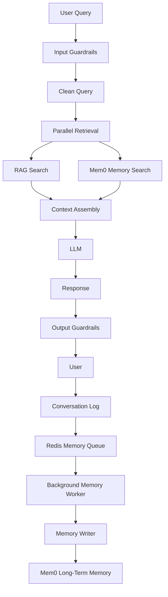

### 🎯 Expected Outcome

The user-facing request path should remain fast:

```text
User Query
    │
    ├──► RAG Retrieval
    │
    └──► Memory Retrieval
             │
             ▼
       Context Assembly
             │
             ▼
            LLM
             │
             ▼
          Response
```

Memory writing happens separately:

```text
Conversation
     │
     ▼
Redis Queue
     │
     ▼
Background Worker
     │
     ▼
Memory Extraction
     │
     ▼
Mem0 LTM
```

This separation is important because **reading memory and writing memory have different latency requirements**.

---

# 2. Important Architecture Note: Mem0 vs Mem0 Adapter

The implementation in this chapter intentionally uses an in-memory class:

```javascript
class Mem0Store
```

It behaves like a simplified Mem0 interface, but it is **not the official Mem0 service or SDK**.

Therefore:

```text
Development
    ↓
Mem0-style in-memory adapter
```

can later become:

```text
Production
    ↓
Actual Mem0 integration
```

without changing the rest of the application significantly if we keep the interface stable.

This is the same adapter philosophy used in Chapter 0 for PostgreSQL, Qdrant, and Redis.

---

# 3. Project Structure

Create:

```text
src/
├── memory/
│   ├── mem0.js
│   ├── memorySearch.js
│   ├── memoryWriter.js
│   └── memoryWorker.js
│
└── queues/
    └── memoryQueue.js
```

Responsibilities:

| File              | Responsibility                                             |
| ----------------- | ---------------------------------------------------------- |
| `mem0.js`         | Long-term memory storage abstraction                       |
| `memorySearch.js` | Query-facing memory retrieval interface                    |
| `memoryWriter.js` | Decide which conversation information should become memory |
| `memoryWorker.js` | Background memory processing                               |
| `memoryQueue.js`  | Queue memory jobs through Redis                            |

---

# 4. Mem0 Long-Term Memory Store

## `src/memory/mem0.js`

Our first implementation provides a small Mem0-style interface.

It supports:

* adding memories;
* duplicate prevention;
* searching memories;
* retrieving all user memories.

```javascript id="3q4z7n"
/**
 * Mem0-style Long-Term Memory Store
 *
 * Development adapter.
 *
 * Production:
 * Replace the internal array with the actual
 * Mem0 service/API while keeping the public interface stable.
 */
export class Mem0Store {
  constructor() {
    this.memories = [];
  }

  async addMemory(
    userId,
    memoryText,
    category = "preference"
  ) {
    if (!userId) {
      throw new Error("userId is required.");
    }

    if (
      typeof memoryText !== "string" ||
      !memoryText.trim()
    ) {
      throw new Error("memoryText must be non-empty.");
    }

    const normalizedMemory =
      memoryText.trim().toLowerCase();

    const existing = this.memories.find(
      (memory) =>
        memory.userId === userId &&
        memory.memory.trim().toLowerCase() ===
          normalizedMemory
    );

    if (existing) {
      return existing;
    }

    const record = {
      id:
        `mem_${Date.now()}_` +
        Math.random()
          .toString(36)
          .substring(2, 8),

      userId,
      memory: memoryText.trim(),
      category,
      timestamp: new Date().toISOString(),
    };

    this.memories.push(record);

    return record;
  }

  async searchMemories(
    userId,
    query,
    topK = 3
  ) {
    if (!userId || !query) {
      return [];
    }

    if (!Number.isInteger(topK) || topK <= 0) {
      throw new Error("topK must be a positive integer.");
    }

    const userMemories = this.memories.filter(
      (memory) => memory.userId === userId
    );

    if (userMemories.length === 0) {
      return [];
    }

    const queryTokens = query
      .toLowerCase()
      .replace(/[^a-z0-9\s]/g, "")
      .split(/\s+/)
      .filter(Boolean);

    if (queryTokens.length === 0) {
      return [];
    }

    const scored = userMemories.map((item) => {
      const memoryText =
        item.memory.toLowerCase();

      let matches = 0;

      for (const token of queryTokens) {
        if (memoryText.includes(token)) {
          matches++;
        }
      }

      return {
        ...item,
        score:
          matches / queryTokens.length,
      };
    });

    scored.sort(
      (a, b) => b.score - a.score
    );

    return scored
      .filter((item) => item.score > 0)
      .slice(0, topK);
  }

  async getAllMemories(userId) {
    return this.memories.filter(
      (memory) => memory.userId === userId
    );
  }
}

export const mem0Client = new Mem0Store();
```

---

# 5. How Memory Storage Works

Suppose a user says:

```text
I prefer concise technical explanations.
```

The memory layer can store:

```json
{
  "userId": "user_001",
  "memory": "User prefers concise technical explanations.",
  "category": "preference"
}
```

Later, the user asks:

```text
Explain RAG to me.
```

Memory search can identify the relevant preference.

The context assembly layer can then tell the LLM:

```text
User preference:
The user prefers concise technical explanations.
```

This allows the response style to become personalized.

---

# 6. Memory Search Interface

## `src/memory/memorySearch.js`

The rest of the application should not directly depend on the internal implementation of `Mem0Store`.

Instead, create a small abstraction:

```javascript id="6n2w8x"
import { mem0Client } from "./mem0.js";

/**
 * High-Level Memory Search Interface
 *
 * Provides a stable interface for retrieving
 * user-specific long-term memories.
 */
export class MemorySearch {
  static async searchRelevantUserMemories(
    userId,
    cleanQuery,
    topK = 3
  ) {
    if (!userId) {
      return [];
    }

    if (
      typeof cleanQuery !== "string" ||
      !cleanQuery.trim()
    ) {
      return [];
    }

    return mem0Client.searchMemories(
      userId,
      cleanQuery,
      topK
    );
  }
}
```

This creates an important abstraction:


If the underlying memory provider changes later, the agent does not need to know how the provider works.

---

# 7. Redis Memory Queue

## `src/queues/memoryQueue.js`

Memory writing does not need to block the user's request.

Instead, we create a background job:

```text
Conversation
      │
      ▼
Memory Queue
      │
      ▼
Worker
```

Use the Redis adapter created in Chapter 0:

```javascript id="c8x4v1"
import { redisCache } from "../infrastructure/redis.js";

/**
 * Memory Queue
 *
 * Development queue backed by the Redis adapter.
 */
export class MemoryQueue {
  static queueName = "memory_jobs_queue";

  static async enqueueJob(jobData) {
    if (!jobData || typeof jobData !== "object") {
      throw new Error("jobData must be an object.");
    }

    const job = {
      id:
        `job_${Date.now()}_` +
        Math.random()
          .toString(36)
          .substring(2, 8),

      timestamp: new Date().toISOString(),

      data: jobData,
    };

    await redisCache.lpush(
      this.queueName,
      JSON.stringify(job)
    );

    return job;
  }

  static async dequeueJob() {
    const raw =
      await redisCache.rpop(this.queueName);

    if (!raw) {
      return null;
    }

    try {
      return JSON.parse(raw);
    } catch (error) {
      console.error(
        "[MemoryQueue] Invalid queued payload:",
        error.message
      );

      return null;
    }
  }
}
```

### Queue behavior

The queue uses:

```text
LPUSH → Add job
RPOP  → Remove oldest job
```

Therefore, jobs behave approximately like a FIFO queue.

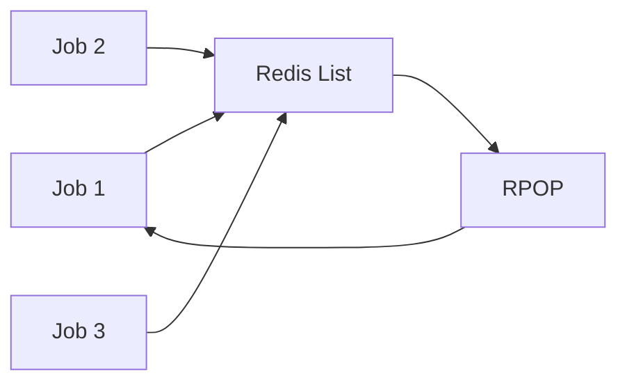

---

# 8. Why Use an Async Queue?

Without a queue:

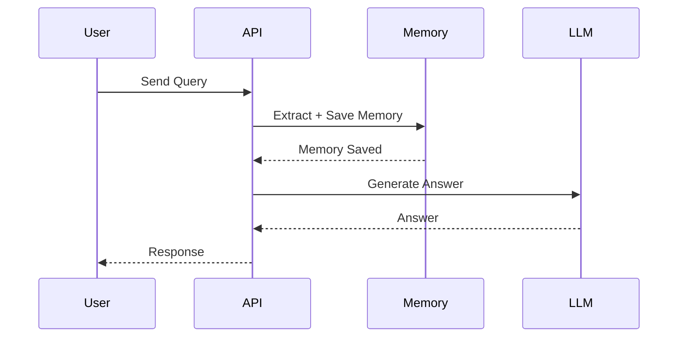

The user waits for memory processing.

With a queue:

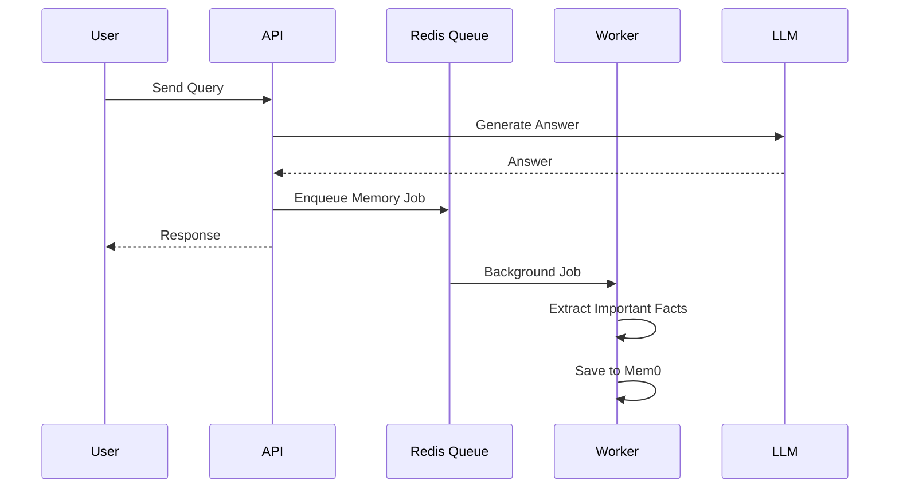

The user receives the response without waiting for memory persistence.

---

# 9. Async Memory Writer

## `src/memory/memoryWriter.js`

The Memory Writer decides whether information from a conversation is worth remembering.

For this chapter, we use simple deterministic rules.

Later, this component can be upgraded to an LLM-based memory extraction engine.

```javascript id="h2r7q9"
import { mem0Client } from "./mem0.js";

/**
 * Memory Writer
 *
 * Development implementation using deterministic rules.
 *
 * Production:
 * Replace rule-based extraction with an LLM or
 * dedicated memory extraction pipeline.
 */
export class MemoryWriter {
  static async evaluateAndUpdateMemory(
    userId,
    userQuery,
    assistantResponse
  ) {
    if (!userId) {
      throw new Error("userId is required.");
    }

    if (
      typeof userQuery !== "string" ||
      !userQuery.trim()
    ) {
      return [];
    }

    const qLower =
      userQuery.toLowerCase();

    const memories = [];

    // User preferences
    if (
      qLower.includes("i prefer") ||
      qLower.includes("i like") ||
      qLower.includes("i love") ||
      qLower.includes("my favorite")
    ) {
      memories.push({
        fact: `User preference: ${userQuery.trim()}`,
        category: "preference",
      });
    }

    // User identity
    const nameMatch = userQuery.match(
      /my\s+name\s+is\s+([a-zA-Z][a-zA-Z\s'-]{1,50})/i
    );

    if (nameMatch) {
      memories.push({
        fact: `User name is ${nameMatch[1].trim()}`,
        category: "identity",
      });
    }

    // Professional context
    if (
      qLower.includes("i work at") ||
      qLower.includes("working on") ||
      qLower.includes("my stack") ||
      qLower.includes("i am working")
    ) {
      memories.push({
        fact:
          `User work/stack context: ${userQuery.trim()}`,
        category: "professional",
      });
    }

    const saved = [];

    for (const item of memories) {
      const record =
        await mem0Client.addMemory(
          userId,
          item.fact,
          item.category
        );

      saved.push(record);
    }

    return saved;
  }
}
```

### Important note

The `assistantResponse` argument is currently included in the method interface but not used by the rule-based extractor.

This is intentional.

A future LLM-based implementation can analyze:

```text
User Query
+
Assistant Response
```

to determine whether something meaningful should become a long-term memory.

---

# 10. Why Selective Memory Matters

We should **not remember everything**.

For example:

```text
User: What is Qdrant?
```

does not necessarily mean:

```text
User permanently likes Qdrant.
```

But:

```text
User: I prefer PostgreSQL for relational data.
```

contains potentially persistent information.

Therefore:

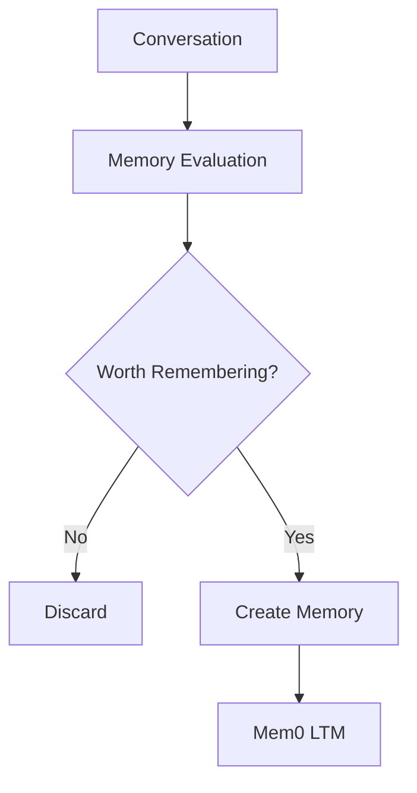

This is an important principle:

> **Conversation history and long-term memory are not the same thing.**

---

# 11. Background Memory Worker

## `src/memory/memoryWorker.js`

The worker continuously consumes memory jobs.

```javascript id="v7j1x4"
import { MemoryQueue } from "../queues/memoryQueue.js";
import { MemoryWriter } from "./memoryWriter.js";

/**
 * Background Memory Worker
 *
 * Processes queued conversation jobs and writes
 * useful long-term memories asynchronously.
 */
export async function runMemoryWorkerPass() {
  console.log(
    "🌙 [Memory Worker] Checking memory_jobs_queue..."
  );

  let processedCount = 0;
  let failedCount = 0;

  let job;

  while (
    (job = await MemoryQueue.dequeueJob())
  ) {
    processedCount++;

    const {
      userId,
      userQuery,
      assistantResponse,
    } = job.data || {};

    console.log(
      `└─ Processing Job ${job.id} for UserId: ${userId}`
    );

    try {
      const saved =
        await MemoryWriter.evaluateAndUpdateMemory(
          userId,
          userQuery,
          assistantResponse
        );

      console.log(
        `   └─ Persisted ${saved.length} memory item(s).`
      );
    } catch (error) {
      failedCount++;

      console.error(
        `   └─ Job failed: ${error.message}`
      );
    }
  }

  return {
    processedCount,
    failedCount,
    status: "Worker pass finished",
  };
}
```

---

# 12. Worker Architecture

The complete asynchronous pipeline is:

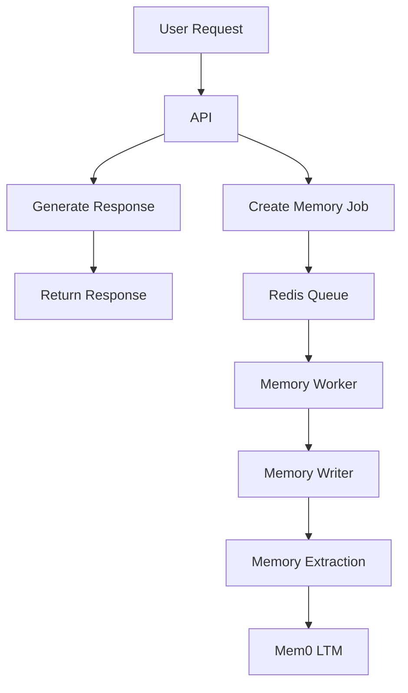

This is a fundamental production architecture pattern:

> **Keep user-facing latency separate from background processing.**

---

# 13. Important Queue Reliability Limitation

The current queue implementation is intentionally simple.

Consider this sequence:

```text
RPOP
  ↓
Worker starts processing
  ↓
Worker crashes
```

The job has already been removed from the queue.

Therefore, the job can be lost.

A production queue should provide:

* acknowledgements;
* retries;
* dead-letter queues;
* visibility timeouts;
* job status;
* backoff;
* idempotency;
* monitoring.

For example:

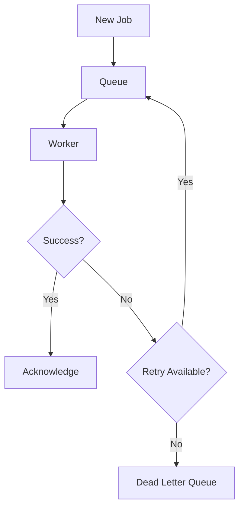

The Redis adapter from Chapter 0 is therefore a **development abstraction**, not a production-grade job queue.

A production implementation can later use a dedicated queue library such as BullMQ.

---

# 14. Critical Architecture Limitation: In-Memory Mem0 + Separate Worker

There is another important issue to understand.

Currently:

```javascript
export const mem0Client = new Mem0Store();
```

stores memories inside the Node.js process.

If you run:

```bash
npm run cli
```

and then start another process:

```bash
npm run worker
```

they do **not share the same `mem0Client.memories` array**.

Each process gets its own memory.

Therefore:

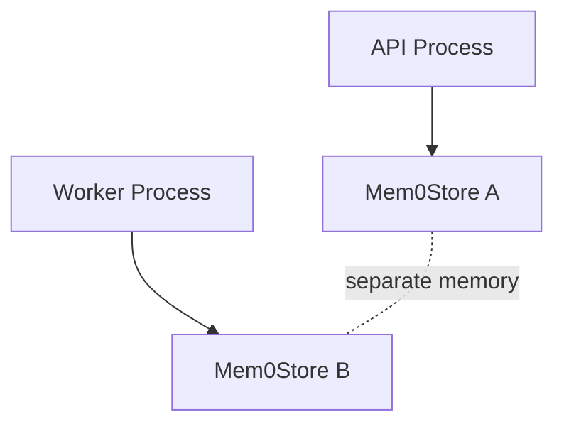

This means the standalone worker cannot process the API process's in-memory memory store correctly.

In a real production architecture, memory must live in shared persistent infrastructure:

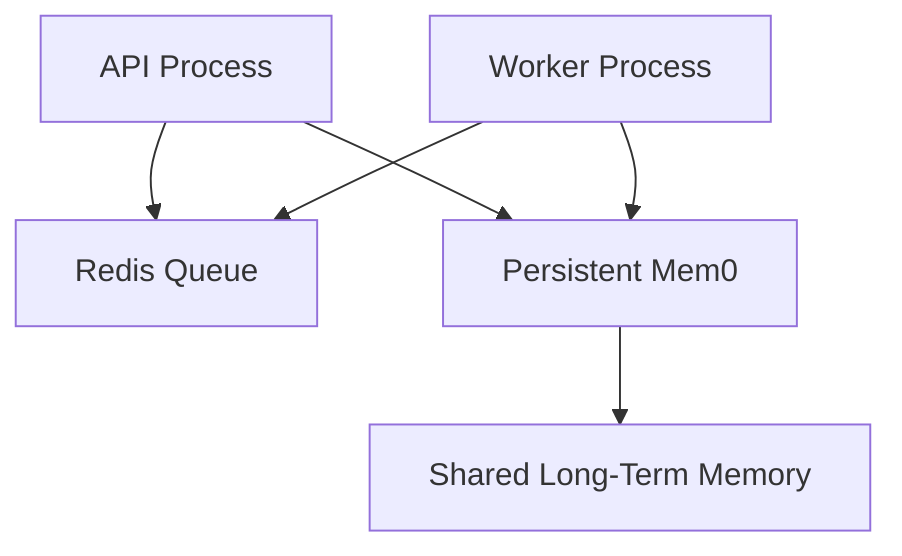

For this chapter's development demo, keep the worker pass in the **same process** when demonstrating the in-memory adapter.

---

# 15. End-to-End Memory Flow

The complete lifecycle is:

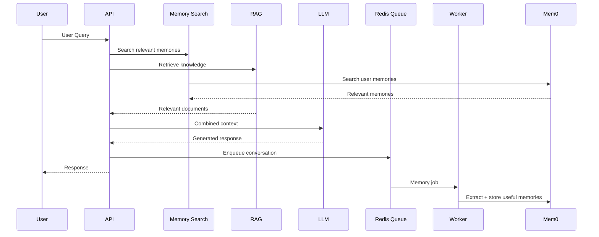

This gives us two separate paths.

### Synchronous path

```text
User
 ↓
Guardrails
 ↓
Memory Search + RAG
 ↓
LLM
 ↓
Output Guardrails
 ↓
User
```

### Asynchronous path

```text
Conversation
 ↓
Redis Queue
 ↓
Memory Worker
 ↓
Memory Writer
 ↓
Mem0
```

---

# 16. Verification

The original verification command imports:

```javascript
searchUserMemories()
```

but the implementation actually exposes:

```javascript
MemorySearch.searchRelevantUserMemories()
```

Therefore, use the following verification.

## Step 1 — Add Test Memories

```bash id="4x1q7c"
node --input-type=module -e "
import { mem0Client } from './src/memory/mem0.js';

await mem0Client.addMemory(
  'u1',
  'User prefers concise technical responses.',
  'preference'
);

await mem0Client.addMemory(
  'u1',
  'User works with Node.js and PostgreSQL.',
  'professional'
);

console.log(
  await mem0Client.getAllMemories('u1')
);
"
```

---

## Step 2 — Search Memories

```bash id="f5r8d2"
node --input-type=module -e "
import { mem0Client } from './src/memory/mem0.js';
import { MemorySearch } from './src/memory/memorySearch.js';

await mem0Client.addMemory(
  'u1',
  'User prefers concise technical responses.',
  'preference'
);

await mem0Client.addMemory(
  'u1',
  'User works with Node.js and PostgreSQL.',
  'professional'
);

const results =
  await MemorySearch.searchRelevantUserMemories(
    'u1',
    'technical responses Node.js',
    3
  );

console.dir(results, { depth: null });
"
```

The returned records should contain memories relevant to the query.

Exact ordering and scores depend on the simple lexical matching implementation.

---

# 17. Test the Memory Writer

```bash id="m8z2q1"
node --input-type=module -e "
import { MemoryWriter } from './src/memory/memoryWriter.js';
import { mem0Client } from './src/memory/mem0.js';

const saved =
  await MemoryWriter.evaluateAndUpdateMemory(
    'u1',
    'I prefer concise technical explanations.',
    'Understood.'
  );

console.log('Saved:', saved);

console.log(
  'All Memories:',
  await mem0Client.getAllMemories('u1')
);
"
```

You should see a preference memory being created.

---

# 18. Test the Queue

```bash id="q2k8m4"
node --input-type=module -e "
import { MemoryQueue } from './src/queues/memoryQueue.js';

const job = await MemoryQueue.enqueueJob({
  userId: 'u1',
  userQuery: 'I prefer TypeScript.',
  assistantResponse: 'Got it.'
});

console.log('Queued:', job);

const dequeued =
  await MemoryQueue.dequeueJob();

console.log('Dequeued:', dequeued);
"
```

The same job should be returned after dequeueing.

---

# 19. Test the Complete Worker

Because the queue and memory adapter are currently in-memory, run the worker in the **same Node.js process** as the test.

```bash id="b9x4t6"
node --input-type=module -e "
import { MemoryQueue } from './src/queues/memoryQueue.js';
import { runMemoryWorkerPass } from './src/memory/memoryWorker.js';
import { mem0Client } from './src/memory/mem0.js';

await MemoryQueue.enqueueJob({
  userId: 'u1',
  userQuery: 'I prefer TypeScript and concise explanations.',
  assistantResponse: 'Understood.'
});

const result =
  await runMemoryWorkerPass();

console.log('Worker Result:', result);

console.log(
  'Memories:',
  await mem0Client.getAllMemories('u1')
);
"
```

Expected behavior:

```text
Job added
   ↓
Worker consumes job
   ↓
MemoryWriter evaluates conversation
   ↓
Memory saved
```

The exact number of memories depends on the extraction rules.

---

# 20. Chapter Architecture Summary

We now have:

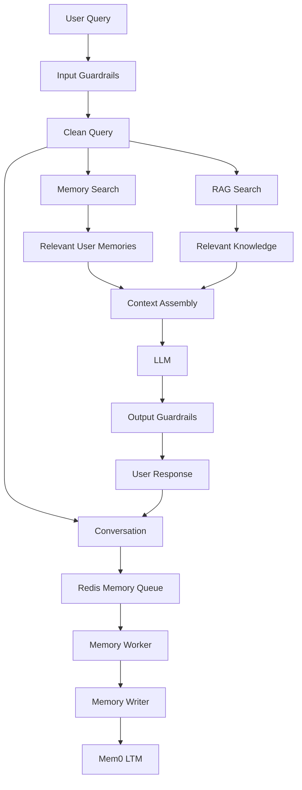

The important separation is:

### RAG

```text
External / domain knowledge
```

### STM

```text
Recent conversation
```

### Conversation Store

```text
Complete interaction history
```

### Mem0 LTM

```text
Persistent user-specific knowledge
```

---

# 21. Production Considerations

### 1. Replace the in-memory Mem0 adapter

The current:

```javascript
this.memories = [];
```

is only for development.

Production requires persistent storage.

### 2. Use semantic memory retrieval

The current search uses simple token matching:

```text
query token → substring match
```

A production memory layer should support semantic retrieval.

### 3. Add memory lifecycle management

A mature memory system should support:

* creation;
* update;
* deduplication;
* contradiction resolution;
* expiration;
* importance;
* confidence;
* deletion;
* user-controlled forgetting.

### 4. Do not store secrets

Memory extraction should explicitly avoid storing:

* passwords;
* API keys;
* access tokens;
* payment credentials;
* private security information.

### 5. Use persistent queues

The current Redis adapter is a development mock.

Production should provide:

* durable jobs;
* retries;
* acknowledgements;
* dead-letter handling;
* worker concurrency;
* observability.

### 6. Make memory writes idempotent

The same job may be retried.

Therefore, processing it twice should not create duplicate memories.

### 7. Separate tenant/user data

Every memory lookup must be scoped to the correct user or tenant.

Never perform:

```javascript
searchMemories(query)
```

without enforcing ownership boundaries.

Prefer:

```javascript
searchMemories(userId, query)
```

### 8. Keep the synchronous path small

Memory search should run alongside RAG rather than after RAG completes:

```javascript
const [ragResults, memoryResults] =
  await Promise.all([
    retrieveKnowledge(query),
    MemorySearch.searchRelevantUserMemories(
      userId,
      query
    ),
  ]);
```

This is the direction we will use in the orchestrator.

---

# 22. Chapter Checklist

Before moving to Chapter 3:

* [ ] `src/memory/mem0.js` exists
* [ ] `src/memory/memorySearch.js` exists
* [ ] `src/memory/memoryWriter.js` exists
* [ ] `src/memory/memoryWorker.js` exists
* [ ] `src/queues/memoryQueue.js` exists
* [ ] Memory records are scoped by `userId`
* [ ] Duplicate memories are prevented
* [ ] Relevant memories can be searched
* [ ] Memory jobs can be queued
* [ ] Jobs can be dequeued
* [ ] Background worker processes jobs
* [ ] MemoryWriter selectively creates memories
* [ ] Worker failures are handled
* [ ] You understand that the current adapters are in-memory development implementations
* [ ] You understand that a separate worker process requires shared persistent storage

---

# 23. What We Have Built

The system now has a real memory lifecycle:

```text
                 USER
                   │
                   ▼
             Input Guardrails
                   │
                   ▼
             Clean Query
                   │
          ┌────────┴────────┐
          ▼                 ▼
     RAG Retrieval     Memory Search
          │                 │
          │                 ▼
          │             Mem0 LTM
          │
          └────────┬────────┘
                   ▼
              Context
                   │
                   ▼
                  LLM
                   │
                   ▼
           Output Guardrails
                   │
                   ▼
               RESPONSE
                   │
                   ▼
            Memory Queue
                   │
                   ▼
             Background
               Worker
                   │
                   ▼
            Memory Writer
                   │
                   ▼
               Mem0 LTM
```

The critical design principle is:

> **Read memory synchronously for personalization; write memory asynchronously for performance.**

---

# Next Chapter

**Chapter 3 — Advanced RAG Query Transformations & Intent Routing**

In the next chapter, we will build the intelligence that happens **before retrieval**:

* Query Rewriting
* Step-Back Prompting
* Sub-Query Decomposition
* HyDE
* Intent Classification
* Query Routing
* Retrieval strategy selection
* Parallel retrieval

This will transform the architecture from:

```text
User Query
    ↓
Search
```

into:

```text
User Query
    ↓
Understand Intent
    ↓
Transform Query
    ↓
Select Retrieval Strategy
    ↓
Parallel Retrieval
    ↓
Hybrid Ranking
    ↓
CRAG
```

That becomes the foundation for the advanced RAG orchestrator in the following chapters.

