# Chapter 3 — Advanced RAG Query Transformations & Dynamic Routing

## 1. Chapter Goal

In the previous chapters, we built:

* Input and Output Guardrails
* Short-Term Memory
* Conversation Storage
* Mem0-style Long-Term Memory
* Redis-based asynchronous memory processing

The next problem is **retrieval quality**.

A naïve RAG pipeline looks like:

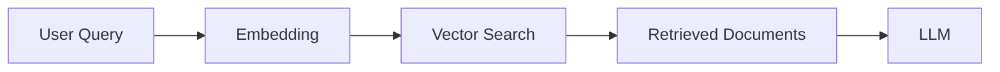

This works well when the user's query is already clear and aligned with the knowledge base.

But real users ask questions such as:

```text
How does that thing we discussed earlier actually improve performance?
```

or:

```text
What is the difference between HNSW and IVFFlat and when should I use each one in production?
```

A single vector search may not capture all the required concepts.

Advanced RAG therefore transforms the original query into multiple retrieval representations.

In this chapter, we build:

* **HyDE** — Hypothetical Document Embeddings
* **Query Rewriting**
* **Step-Back Prompting**
* **Sub-Query Decomposition**
* **Dynamic Query Routing**

The resulting architecture is:

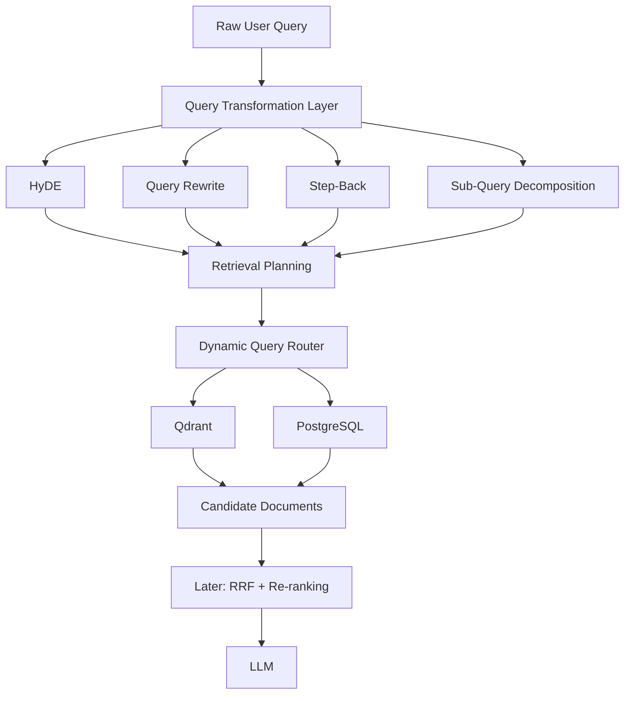

---

# 2. Why Query Transformation Matters

Consider:

```text
User Query:
How does PostgreSQL make vector search faster?
```

Different retrieval strategies can interpret this differently.

### Original query

```text
How does PostgreSQL make vector search faster?
```

### Rewritten query

```text
PostgreSQL pgvector vector indexing HNSW IVFFlat performance
```

### Step-back query

```text
Database indexing mechanisms for high-dimensional vector similarity search
```

### Sub-queries

```text
1. How does pgvector perform vector indexing?
2. HNSW vs IVFFlat performance characteristics
```

Each representation may retrieve different documents.

The goal is **not to replace the original query**.

The goal is to create additional retrieval signals.

---

# 3. Query Transformation Architecture

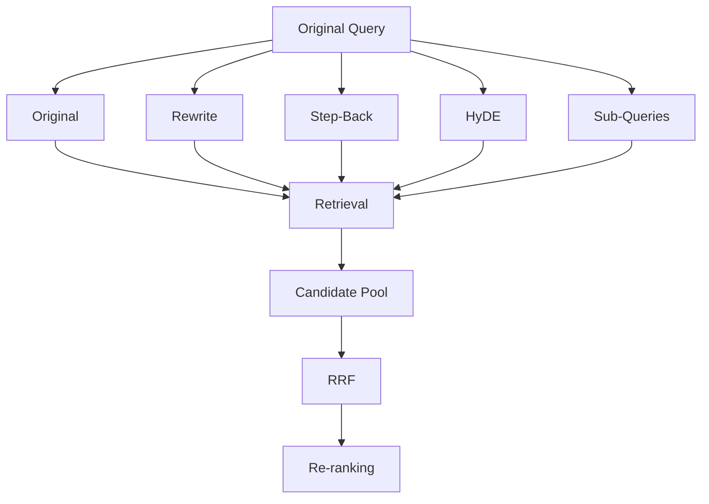

Each technique solves a different problem.

| Technique      | Main Purpose                               |
| -------------- | ------------------------------------------ |
| Original Query | Preserve user's exact intent               |
| Query Rewrite  | Improve lexical/semantic search            |
| Step-Back      | Retrieve broader conceptual context        |
| HyDE           | Bridge query-to-document semantic mismatch |
| Sub-Queries    | Handle multi-part questions                |

---

# 4. Hypothetical Document Embeddings — HyDE

## `src/rag/query/hyde.js`

### What is HyDE?

HyDE stands for:

> **Hypothetical Document Embeddings**

Instead of embedding only the question:

```text
What is HNSW indexing?
```

we generate a hypothetical answer-like passage:

```text
HNSW is a graph-based approximate nearest-neighbor indexing
algorithm commonly used for high-dimensional vector search...
```

We then embed that hypothetical passage.

The idea is that the generated passage may be **closer in semantic space to actual documents** than the short question itself.

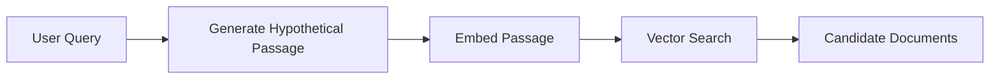

---

# 5. HyDE Generator

For a learning implementation, we can start with a deterministic generator.

```javascript id="6g3x2m"
/**
 * HyDE Generator
 *
 * Development implementation.
 *
 * Production:
 * Generate the hypothetical passage using an LLM,
 * then embed that passage before vector retrieval.
 */
export class HyDEGenerator {
  static generatePassage(query) {
    if (
      typeof query !== "string" ||
      !query.trim()
    ) {
      throw new Error("query must be non-empty.");
    }

    return (
      `Technical documentation about "${query.trim()}". ` +
      `The document explains relevant concepts, implementation ` +
      `details, architecture, trade-offs, and production considerations.`
    );
  }
}
```

### Important

This implementation is **HyDE-shaped**, but it is not a full LLM-based HyDE implementation.

A production version should look conceptually like:

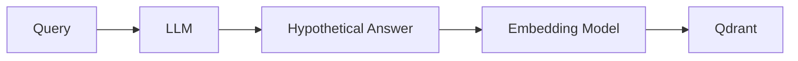

The actual hypothetical passage should contain meaningful technical content generated from the query.

---

# 6. Query Rewriting

## `src/rag/query/rewrite.js`

Query rewriting transforms conversational or verbose input into a more retrieval-friendly representation.

For example:

```text
Can you please tell me how I can configure HNSW in PostgreSQL?
```

can become:

```text
PostgreSQL pgvector HNSW configuration indexing
```

The important point is that rewriting should **preserve intent**.

A bad rewrite can actually make retrieval worse.

---

# 7. Query Rewriter Implementation

```javascript id="p4r8x1"
/**
 * Query Rewriter
 *
 * Development implementation using deterministic normalization.
 *
 * Production:
 * Replace or augment this with an LLM-based query rewriting step.
 */
export class QueryRewriter {
  static rewrite(query) {
    if (
      typeof query !== "string" ||
      !query.trim()
    ) {
      throw new Error("query must be non-empty.");
    }

    let cleaned = query
      .trim()
      .replace(
        /^(please|can you|could you|tell me|i want to know)\s+/i,
        ""
      )
      .replace(
        /^(what is|what are|how to|how do i)\s+/i,
        ""
      )
      .replace(/\s+/g, " ")
      .trim();

    if (!cleaned) {
      return query.trim();
    }

    return `${cleaned} technical implementation specification`;
  }
}
```

### Example

```text
Input:
Can you tell me how to configure HNSW?

Output:
configure HNSW technical implementation specification
```

For production, an LLM-based rewriter should be instructed to:

* preserve entities;
* preserve important technical terms;
* remove conversational filler;
* avoid inventing facts;
* keep the query concise;
* return structured output.

---

# 8. Step-Back Prompting

## `src/rag/query/stepBack.js`

Sometimes the user asks a highly specific question.

For example:

```text
Why does HNSW use more memory than IVFFlat in pgvector?
```

Searching only for that exact question may miss useful background documents.

Step-back prompting creates a broader conceptual question:

```text
How do approximate nearest-neighbor indexing methods
trade memory usage against vector search performance?
```

The architecture becomes:

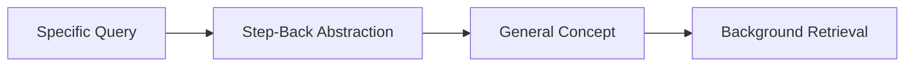

---

# 9. Step-Back Generator

```javascript id="c6p9r3"
/**
 * Step-Back Prompting Generator
 *
 * Produces a broader conceptual retrieval query.
 */
export class StepBackGenerator {
  static generateStepBack(query) {
    if (
      typeof query !== "string" ||
      !query.trim()
    ) {
      throw new Error("query must be non-empty.");
    }

    return (
      `Core architectural concepts, design patterns, ` +
      `trade-offs, and principles behind ${query.trim()}`
    );
  }
}
```

Again, this is a deterministic development implementation.

A production implementation can use an LLM to reason about the appropriate abstraction level.

---

# 10. Sub-Query Decomposition

## `src/rag/query/subQueries.js`

Complex queries often contain multiple independent information needs.

For example:

```text
Compare HNSW and IVFFlat, explain their memory requirements,
and tell me which one is better for a large production database.
```

This is really several questions:

```text
1. How does HNSW work?
2. How does IVFFlat work?
3. What are their memory requirements?
4. How do they compare in production?
```

Sub-query decomposition lets the retrieval system handle each part separately.

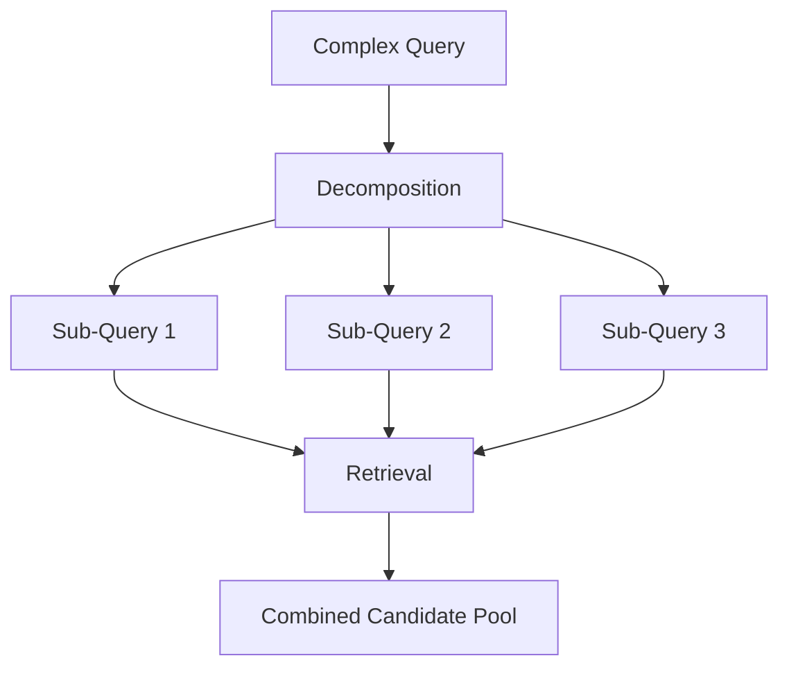

---

# 11. Sub-Query Decomposer

```javascript id="k8w4s7"
/**
 * Sub-Query Decomposer
 *
 * Development implementation.
 *
 * Production:
 * Use an LLM with structured output to identify
 * genuinely independent information needs.
 */
export class SubQueryDecomposer {
  static decompose(query) {
    if (
      typeof query !== "string" ||
      !query.trim()
    ) {
      throw new Error("query must be non-empty.");
    }

    const normalized = query
      .trim()
      .replace(/\s+/g, " ");

    const parts = normalized
      .split(/\s+(?:and|also|then)\s+/i)
      .map((part) => part.trim())
      .filter(Boolean);

    // If the query does not contain multiple parts,
    // return the original query rather than creating
    // artificial questions.
    if (parts.length <= 1) {
      return [normalized];
    }

    return parts.slice(0, 4);
  }
}
```

### Why cap the number?

Suppose an LLM generates 50 sub-queries.

That could result in:

```text
50 × embedding calls
50 × vector searches
50 × database operations
```

Retrieval cost can grow rapidly.

Therefore, production systems should impose a maximum.

A reasonable development limit is:

```text
Maximum sub-queries = 4
```

The exact limit should be configurable.

---

# 12. Dynamic Query Routing

## `src/rag/routing/queryRouter.js`

Query transformation determines:

> **What should we search for?**

Routing determines:

> **Where should we search?**

Our Chapter 0 infrastructure established:

* Qdrant;
* PostgreSQL;
* Redis.

Therefore, the router should not introduce MongoDB or S3 as active stores unless those adapters are actually added to the architecture.

For this project:

```text
Qdrant → semantic/vector retrieval
PostgreSQL → structured relational data
Redis → cache/queue infrastructure
```

Redis should generally **not** be treated as a knowledge retrieval target.

---

# 13. Query Router Implementation

```javascript id="w2p6q9"
/**
 * Dynamic Query Router
 *
 * Determines which application data source should
 * participate in retrieval.
 *
 * Development implementation using deterministic rules.
 */
export class QueryRouter {
  static routeQuery(query) {
    if (
      typeof query !== "string" ||
      !query.trim()
    ) {
      throw new Error("query must be non-empty.");
    }

    const qLower = query.toLowerCase();

    const targets = new Set();

    // Semantic/document retrieval is the default.
    targets.add("qdrant");

    // Structured relational data.
    if (
      /\b(user|account|project|profile|subscription|order)\b/i.test(
        qLower
      )
    ) {
      targets.add("postgres");
    }

    return {
      targets: [...targets],
      strategy:
        targets.has("postgres")
          ? "hybrid"
          : "semantic",
    };
  }
}
```

---

# 14. Routing Examples

### Technical knowledge query

```text
How does HNSW indexing work?
```

Result:

```json id="p7y3w5"
{
  "targets": ["qdrant"],
  "strategy": "semantic"
}
```

### User/project query

```text
Show me my projects using PostgreSQL.
```

Result:

```json id="m2x8r4"
{
  "targets": ["qdrant", "postgres"],
  "strategy": "hybrid"
}
```

The exact routing rules should eventually become more sophisticated.

---

# 15. Why Qdrant Is the Default

The system's primary knowledge retrieval engine is semantic search.

Therefore:

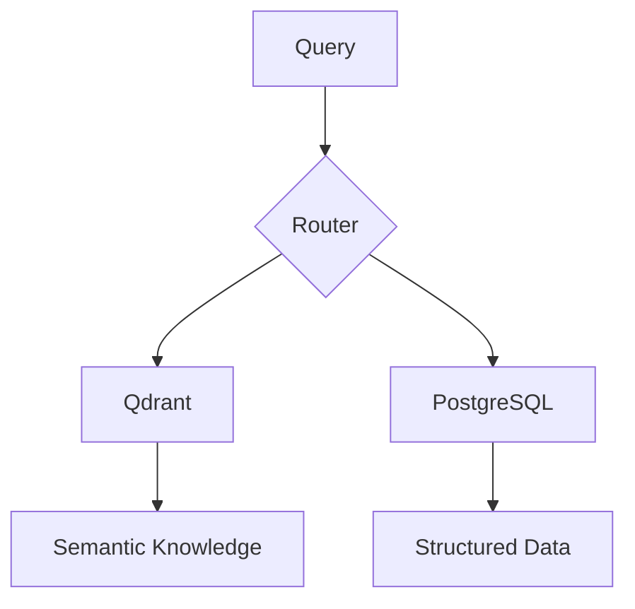

Qdrant handles:

* embeddings;
* semantic similarity;
* vector filtering;
* document/chunk retrieval.

PostgreSQL handles:

* relational entities;
* users;
* projects;
* structured metadata;
* transactional application data.

---

# 16. Transformation Orchestration

The four transformations are largely independent.

Therefore, they should not unnecessarily run sequentially.

Instead of:

```javascript id="6v4b9q"
const rewrite = QueryRewriter.rewrite(query);

const stepBack =
  StepBackGenerator.generateStepBack(query);

const hyde =
  HyDEGenerator.generatePassage(query);

const subQueries =
  SubQueryDecomposer.decompose(query);
```

we can expose a unified transformation layer.

## `src/rag/query/index.js`

```javascript id="z8c2n5"
import { HyDEGenerator } from "./hyde.js";
import { QueryRewriter } from "./rewrite.js";
import { StepBackGenerator } from "./stepBack.js";
import { SubQueryDecomposer } from "./subQueries.js";

export class QueryTransformationPipeline {
  static transform(query) {
    if (
      typeof query !== "string" ||
      !query.trim()
    ) {
      throw new Error("query must be non-empty.");
    }

    return {
      original: query.trim(),

      rewritten:
        QueryRewriter.rewrite(query),

      stepBack:
        StepBackGenerator.generateStepBack(query),

      hydeDocument:
        HyDEGenerator.generatePassage(query),

      subQueries:
        SubQueryDecomposer.decompose(query),
    };
  }
}
```

For deterministic local transformations, this is synchronous.

Once HyDE and rewriting use an LLM, the method should become asynchronous:

```javascript id="b7f3w2"
const [
  rewritten,
  stepBack,
  hydeDocument,
  subQueries,
] = await Promise.all([
  rewriteWithLLM(query),
  generateStepBackWithLLM(query),
  generateHyDEWithLLM(query),
  decomposeWithLLM(query),
]);
```

This prevents independent model calls from unnecessarily waiting for each other.

---

# 17. Complete Query Transformation Flow

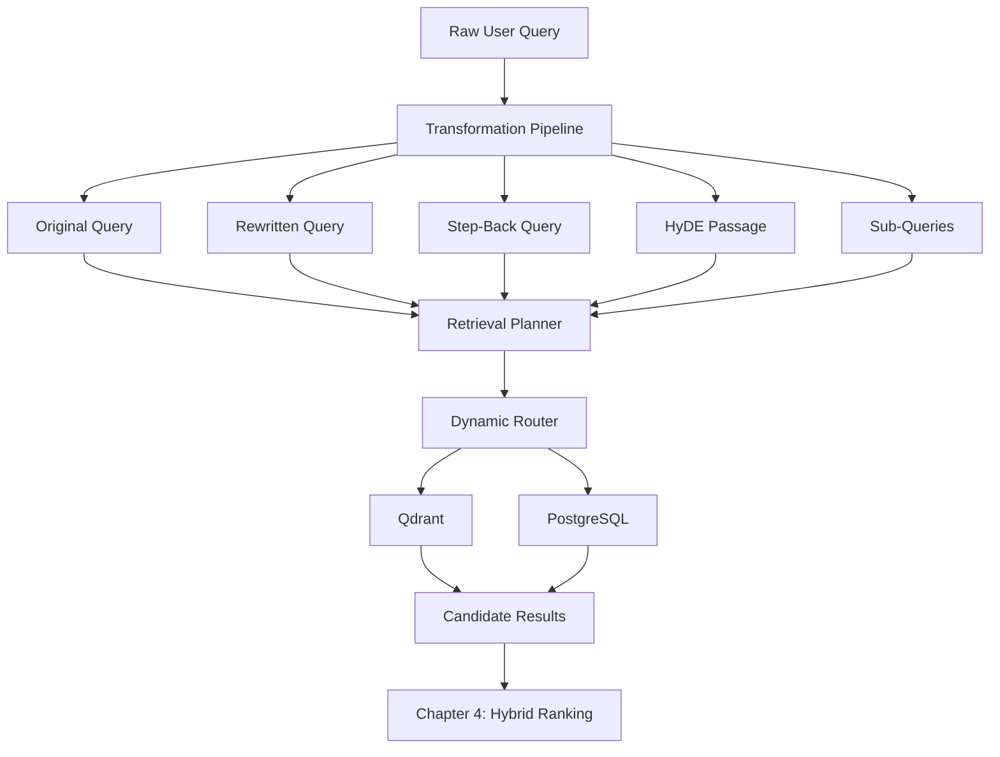

---

# 18. Retrieval Strategy Selection

Different query representations can use different retrieval methods.

| Representation | Suggested Retrieval |
| -------------- | ------------------- |
| Original       | Dense + sparse      |
| Rewrite        | Dense + sparse      |
| Step-Back      | Dense               |
| HyDE           | Dense               |
| Sub-Queries    | Dense + sparse      |

For example:

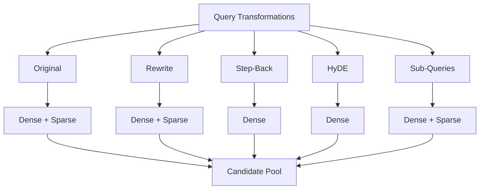

The candidate pool can then be processed by:

```text
RRF → Re-ranking → CRAG
```

which we will build in later chapters.

---

# 19. Verification

The original verification code imports:

```javascript id="2g0d6k"
rewriteQuery()
routeQuery()
```

but our implementation exposes:

```javascript id="q7n3b1"
QueryRewriter.rewrite()
QueryRouter.routeQuery()
```

Therefore, use:

```bash id="m6r2k8"
node --input-type=module -e "
import { QueryRewriter } from './src/rag/query/rewrite.js';
import { QueryRouter } from './src/rag/routing/queryRouter.js';

const query = 'How do I setup a vector index?';

console.log(
  'Rewritten:',
  QueryRewriter.rewrite(query)
);

console.log(
  'Route:',
  QueryRouter.routeQuery(
    'show my user account projects'
  )
);
"
```

---

# 20. Verify All Transformations

```bash id="u4p7c2"
node --input-type=module -e "
import { HyDEGenerator } from './src/rag/query/hyde.js';
import { QueryRewriter } from './src/rag/query/rewrite.js';
import { StepBackGenerator } from './src/rag/query/stepBack.js';
import { SubQueryDecomposer } from './src/rag/query/subQueries.js';

const query =
  'Compare HNSW and IVFFlat and explain their production performance';

console.log('\\nOriginal:');
console.log(query);

console.log('\\nHyDE:');
console.log(
  HyDEGenerator.generatePassage(query)
);

console.log('\\nRewrite:');
console.log(
  QueryRewriter.rewrite(query)
);

console.log('\\nStep-Back:');
console.log(
  StepBackGenerator.generateStepBack(query)
);

console.log('\\nSub-Queries:');
console.log(
  SubQueryDecomposer.decompose(query)
);
"
```

---

# 21. Verify the Complete Transformation Pipeline

```bash id="r8w5m1"
node --input-type=module -e "
import { QueryTransformationPipeline } from './src/rag/query/index.js';

const result =
  QueryTransformationPipeline.transform(
    'Compare HNSW and IVFFlat for production vector search'
  );

console.dir(result, {
  depth: null
});
"
```

You should receive an object containing:

```text
original
rewritten
stepBack
hydeDocument
subQueries
```

The exact generated text is deterministic in this development implementation.

---

# 22. Verify Dynamic Routing

```bash id="y3q8n4"
node --input-type=module -e "
import { QueryRouter } from './src/rag/routing/queryRouter.js';

const technicalQuery =
  QueryRouter.routeQuery(
    'How does HNSW indexing work?'
  );

const userQuery =
  QueryRouter.routeQuery(
    'Show my account projects'
  );

console.log('Technical:', technicalQuery);
console.log('User:', userQuery);
"
```

Expected structure:

```text
Technical:
{
  targets: [ 'qdrant' ],
  strategy: 'semantic'
}

User:
{
  targets: [ 'qdrant', 'postgres' ],
  strategy: 'hybrid'
}
```

---

# 23. Important Production Considerations

## 1. Deterministic transformations are development implementations

The current implementations are intentionally simple.

True advanced RAG generally benefits from an LLM for:

* query rewriting;
* step-back generation;
* sub-query decomposition;
* HyDE generation.

However, deterministic transformations are useful for the first implementation because they make the architecture easy to understand and test.

---

## 2. Validate LLM-generated transformations

When an LLM generates:

```json
{
  "rewritten": "...",
  "subQueries": [...]
}
```

do not blindly trust it.

Validate:

* required fields;
* string types;
* maximum length;
* maximum number of sub-queries;
* duplicate queries;
* empty values.

---

## 3. Limit query expansion

Without limits:

```text
1 query
 ↓
10 rewrites
 ↓
20 sub-queries
 ↓
200 retrieval operations
```

This can dramatically increase:

* latency;
* API cost;
* database load;
* token usage.

Use strict limits.

---

## 4. Preserve the original query

Never throw away the original user query.

Always maintain:

```javascript id="k5n3x9"
{
  original,
  rewritten,
  stepBack,
  hydeDocument,
  subQueries
}
```

The original query represents the user's actual intent and is valuable for:

* retrieval;
* logging;
* debugging;
* evaluation;
* answer generation.

---

## 5. HyDE can hallucinate

A hypothetical document is intentionally synthetic.

It should be used as a **retrieval signal**, not as authoritative knowledge.

Never tell the LLM:

```text
The HyDE document is factual.
```

Instead:

```text
The HyDE passage is only a retrieval aid.
Use retrieved source documents as evidence.
```

---

## 6. Routing should not rely only on keywords

The current router uses simple keyword rules.

For example:

```text
"project"
```

does not necessarily mean PostgreSQL is required.

A production router may consider:

* intent classification;
* entity detection;
* query metadata;
* user permissions;
* available data sources;
* schema-aware routing.

---

## 7. Authorization belongs to routing too

Even if the router decides:

```text
targets = ["postgres"]
```

the user should only access records they are authorized to see.

Routing is **not authorization**.

The architecture should remain:

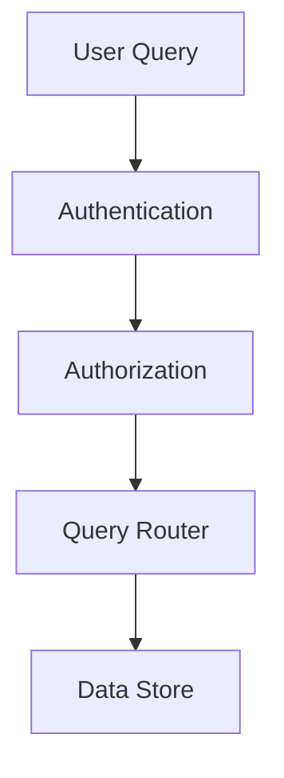

---

## 8. Redis is infrastructure, not knowledge retrieval

In this architecture:

```text
Qdrant     → semantic retrieval
PostgreSQL → structured data
Redis      → cache + queues
```

Redis should not automatically become another retrieval target simply because it exists in the infrastructure layer.

---

# 24. Final Architecture

At the end of this chapter, the RAG request begins to look like a real advanced retrieval system:

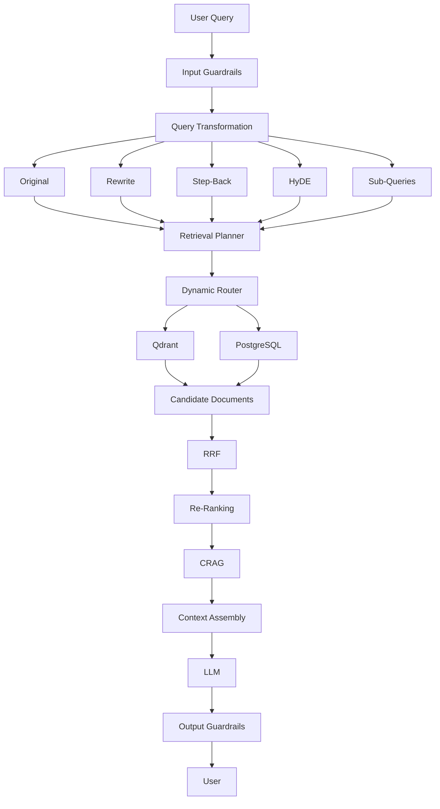

---

# 25. What We Have Built

We can now answer two important questions before retrieval:

### Question 1 — What should we search for?

Handled by:

```text
HyDE
Query Rewriting
Step-Back
Sub-Queries
```

### Question 2 — Where should we search?

Handled by:

```text
Dynamic Query Router
```

The pipeline has evolved from:

```text
User Query
   ↓
Vector Search
```

into:

```text
User Query
   ↓
Query Understanding
   ↓
Query Transformation
   ├── Original
   ├── Rewrite
   ├── Step-Back
   ├── HyDE
   └── Sub-Queries
   ↓
Dynamic Routing
   ↓
Qdrant / PostgreSQL
   ↓
Candidate Pool
```

This gives the next chapter a much stronger foundation.

---

# Next Chapter

**Chapter 4 — Multi-Storage Retrieval, Metadata Filtering, RRF & Cross-Encoder Re-Ranking**

In the next chapter, we will take the candidates generated here and build the **retrieval and ranking layer**:

* Qdrant vector retrieval;
* PostgreSQL structured retrieval;
* metadata filtering;
* dense retrieval;
* sparse retrieval;
* Reciprocal Rank Fusion (RRF);
* duplicate elimination;
* candidate scoring;
* Cross-Encoder re-ranking;
* final top-K selection.

The retrieval pipeline will become:

```text
Query Transformations
        ↓
Dynamic Router
        ↓
Multi-Source Retrieval
        ↓
Dense + Sparse Candidates
        ↓
RRF Fusion
        ↓
Cross-Encoder Re-Ranking
        ↓
Final Evidence
        ↓
CRAG / Context Assembly
```

That is where the architecture starts moving from **query processing** into a production-grade **retrieval engine**.
