# Chapter 4 — Multi-Storage Retrieval Adapters, RRF & Re-Ranking

## 1. Chapter Goal

In Chapter 3, we built the query understanding layer:

* Query Rewriting
* Step-Back Prompting
* HyDE
* Sub-Query Decomposition
* Dynamic Query Routing

Now we need to actually **retrieve and rank evidence**.

A production RAG system should not depend on a single retrieval call.

Different information may live in different stores:

```text
Qdrant      → semantic/vector knowledge
PostgreSQL  → structured application data
Redis       → cache and asynchronous queues
```

The retrieval engine therefore needs to:

1. route transformed queries to the correct data source;
2. retrieve candidates from multiple sources;
3. enforce authorization and metadata filters;
4. combine multiple ranked lists;
5. remove duplicate candidates;
6. apply a more precise semantic ranking stage;
7. return the final evidence set.

The final pipeline becomes:

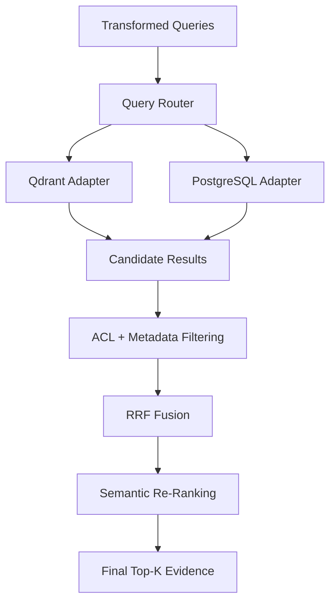

---

# 2. Why Multi-Source Retrieval?

Consider:

```text
Show me my GenAI projects and explain which vector
database technology they use.
```

This question contains two different information requirements.

### PostgreSQL

The user's projects may exist as structured records:

```text
Project
├── userId
├── title
├── database
└── technology
```

### Qdrant

Technical documentation about the database may exist as vectorized knowledge:

```text
Qdrant
├── Vector indexing
├── HNSW
├── Similarity search
└── Production optimization
```

Therefore, a single vector search may not be enough.

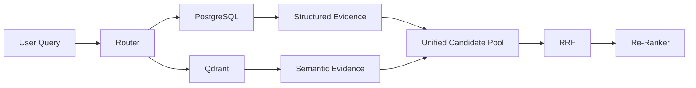

---

# 3. Storage Adapter Architecture

The adapter layer provides a consistent interface between the retrieval engine and individual storage systems.

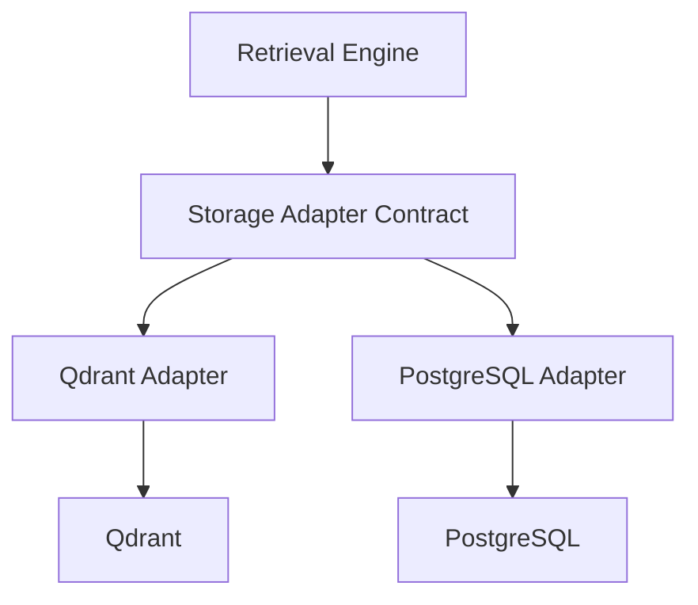

This gives us an important architectural benefit:

> The retrieval engine does not need to know how each database works internally.

It only needs to know how to call:

```javascript
search(query, userContext)
```

---

# 4. Storage Adapter Contract

## `src/rag/adapters/storage.js`

The original chapter called this an S3 adapter, but that conflicts with the architecture established in Chapter 0.

At this stage, `storage.js` should define the **common adapter contract**.

```javascript id="c8v2m6"
/**
 * Storage Adapter Contract
 *
 * Every retrieval adapter should expose a search()
 * method returning a normalized document structure.
 */
export class StorageAdapter {
  async search(_query, _userContext = {}) {
    throw new Error(
      "StorageAdapter.search() must be implemented."
    );
  }
}
```

The normalized result should look like:

```javascript id="p3r7x1"
{
  id: "unique-document-id",
  source: "qdrant",
  title: "Document title",
  content: "Document content",
  score: 0.87,
  acl: "public",
  metadata: {}
}
```

This normalization is important because RRF should not need to understand whether a result came from Qdrant or PostgreSQL.

---

# 5. Qdrant Adapter

## `src/rag/adapters/qdrant.js`

Qdrant is the primary semantic retrieval system.

In this development implementation, we use an in-memory collection to simulate Qdrant.

The production version will call the actual Qdrant client.

```javascript id="n5k8q2"
/**
 * Qdrant Vector Retrieval Adapter
 *
 * Development implementation.
 *
 * Production:
 * Replace the in-memory search with a real Qdrant
 * similarity search.
 */
export class QdrantAdapter {
  constructor() {
    this.knowledgeDocs = [
      {
        id: "vllm_doc_1",
        title: "vLLM High Performance Serving Engine",
        content:
          "vLLM is an open-source LLM serving engine using PagedAttention to reduce KV cache fragmentation and improve inference throughput.",
        acl: "public",
      },
      {
        id: "mem0_doc_1",
        title: "Mem0 Persistent Agent Memory Layer",
        content:
          "Mem0 provides long-term user memory for AI applications and stores personalized facts, preferences, and past decisions.",
        acl: "public",
      },
      {
        id: "rag_doc_1",
        title: "Production RAG Pipeline Architecture",
        content:
          "Production RAG can combine query rewriting, Step-Back prompting, HyDE, sub-query decomposition, RRF, re-ranking, and CRAG.",
        acl: "public",
      },
    ];
  }

  async search(query) {
    if (
      typeof query !== "string" ||
      !query.trim()
    ) {
      throw new Error("query must be non-empty.");
    }

    const qLower = query.toLowerCase();

    return this.knowledgeDocs.map((doc) => {
      const title =
        doc.title.toLowerCase();

      const content =
        doc.content.toLowerCase();

      let score = 0;

      if (title.includes(qLower)) {
        score += 0.5;
      }

      if (content.includes(qLower)) {
        score += 0.5;
      }

      return {
        id: `qdrant_${doc.id}`,
        source: "qdrant",
        title: doc.title,
        content: doc.content,
        score,
        acl: doc.acl,
        metadata: {},
      };
    });
  }
}

export const qdrantAdapter =
  new QdrantAdapter();
```

### Important

This is **not yet real vector search**.

It is a development adapter that allows the rest of the retrieval architecture to be built before connecting the actual Qdrant SDK.

A production implementation should use:

```text
Query
 ↓
Embedding Model
 ↓
Qdrant similarity search
 ↓
Top-N vector candidates
```

---

# 6. PostgreSQL Adapter

## `src/rag/adapters/postgres.js`

PostgreSQL is useful for structured application information.

```javascript id="v6m1q8"
import { postgresDb } from "../../infrastructure/postgres.js";

/**
 * PostgreSQL Retrieval Adapter
 *
 * Retrieves structured user-specific records.
 */
export class PostgresAdapter {
  static async search(
    query,
    userContext = {}
  ) {
    if (!userContext.userId) {
      return [];
    }

    if (
      typeof query !== "string" ||
      !query.trim()
    ) {
      throw new Error("query must be non-empty.");
    }

    const projects =
      await postgresDb.queryUserProjects(
        userContext.userId
      );

    return projects.map((project) => ({
      id: `postgres_${project.id}`,
      source: "postgresql",
      title: project.title,
      content:
        `Project ${project.title} uses ` +
        `${project.dbType} and ` +
        `technology stack ${project.tech}.`,
      score: 1,
      acl: "user_private",
      metadata: {
        userId: project.userId,
        dbType: project.dbType,
      },
    }));
  }
}
```

Notice that we do **not** use a hard-coded fallback user ID.

That is important for security.

```text
Bad:
userContext.userId || "user_demo_001"

Good:
missing userId → no private results
```

---

# 7. Future Storage Adapters

MongoDB and S3 can certainly be added later.

For example:

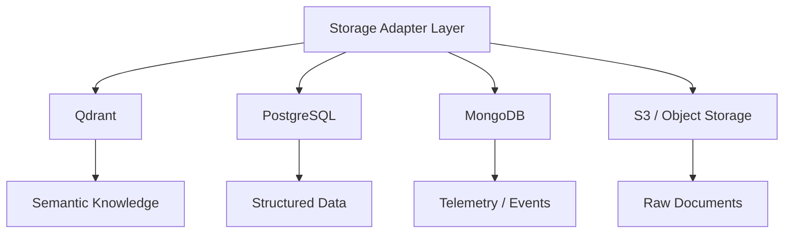

However, they should only be added to the active router after their infrastructure clients and authorization rules are implemented.

Otherwise the architecture claims capabilities that do not actually exist.

---

# 8. ACL & Metadata Filtering

## `src/rag/retrieval/filtering.js`

Retrieval is not authorization.

A database may return a document, but that does **not** mean the current user is allowed to see it.

Therefore:

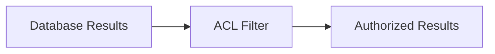

The previous implementation contained:

```javascript
return true;
```

as the fallback.

That is dangerous.

An unknown ACL should fail closed.

---

# 9. Secure ACL Filter

```javascript id="m5r8n2"
/**
 * ACL + Metadata Filter
 *
 * Unknown or unsupported ACL values are rejected.
 */
export class ACLMetadataFilter {
  static filterDocuments(
    documents,
    userContext = {}
  ) {
    if (!Array.isArray(documents)) {
      return [];
    }

    return documents.filter((doc) => {
      if (!doc || !doc.acl) {
        return false;
      }

      if (doc.acl === "public") {
        return true;
      }

      if (
        doc.acl === "user_private"
      ) {
        return Boolean(
          userContext.userId &&
          doc.metadata?.userId ===
            userContext.userId
        );
      }

      if (
        doc.acl === "internal"
      ) {
        return Boolean(
          userContext.isInternal === true
        );
      }

      // Fail closed.
      return false;
    });
  }
}
```

### Why check `metadata.userId`?

This is stronger than simply checking:

```javascript
userContext.userId
```

Otherwise any authenticated user could potentially retrieve another user's private document.

The actual authorization rule should be:

```text
Document owner == Authenticated user
```

---

# 10. Metadata Filtering

ACL is only one type of filter.

Production retrieval may also filter using:

```text
tenantId
userId
documentType
department
region
createdAt
projectId
classification
```

For example:

```javascript id="w7c4p9"
{
  tenantId: "tenant_123",
  userId: "user_42",
  documentType: "technical",
  classification: "internal"
}
```

This becomes particularly important in multi-tenant SaaS applications.

---

# 11. Multi-Query Parallel Search

## `src/rag/retrieval/search.js`

Chapter 3 produces multiple query representations:

```text
Original
Rewrite
Step-Back
HyDE
Sub-Queries
```

Each can produce a separate retrieval stream.

Instead of:

```text
Query 1 → wait
Query 2 → wait
Query 3 → wait
```

we should execute independent retrieval operations concurrently.

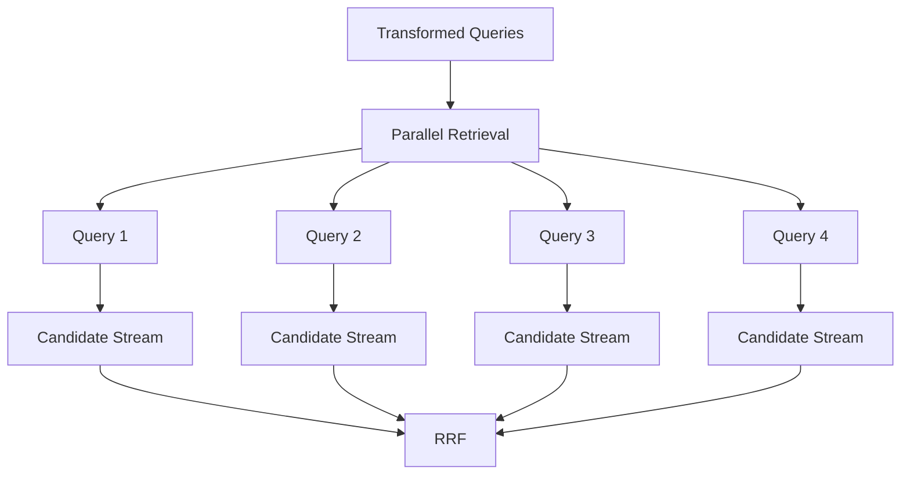

---

# 12. Parallel Search Implementation

```javascript id="q8m3v6"
import { QueryRouter } from "../routing/queryRouter.js";
import { PostgresAdapter } from "../adapters/postgres.js";
import { qdrantAdapter } from "../adapters/qdrant.js";
import { ACLMetadataFilter } from "./filtering.js";
import { ReciprocalRankFusion } from "./rrf.js";
import { SemanticReRanker } from "./reranker.js";

async function searchTarget(
  target,
  query,
  userContext
) {
  let documents = [];

  switch (target) {
    case "qdrant":
      documents =
        await qdrantAdapter.search(query);
      break;

    case "postgres":
      documents =
        await PostgresAdapter.search(
          query,
          userContext
        );
      break;

    default:
      throw new Error(
        `Unsupported retrieval target: ${target}`
      );
  }

  return ACLMetadataFilter.filterDocuments(
    documents,
    userContext
  );
}

export class ParallelSearch {
  static async searchAll(
    queries,
    userContext = {}
  ) {
    if (!Array.isArray(queries)) {
      throw new Error(
        "queries must be an array."
      );
    }

    const validQueries = queries
      .filter(
        (query) =>
          typeof query === "string" &&
          query.trim()
      )
      .slice(0, 10);

    if (validQueries.length === 0) {
      return [];
    }

    const retrievalTasks = [];

    for (const query of validQueries) {
      const route =
        QueryRouter.routeQuery(query);

      for (const target of route.targets) {
        retrievalTasks.push(
          searchTarget(
            target,
            query,
            userContext
          )
        );
      }
    }

    const streams =
      await Promise.all(
        retrievalTasks
      );

    const nonEmptyStreams =
      streams.filter(
        (stream) =>
          stream.length > 0
      );

    if (
      nonEmptyStreams.length === 0
    ) {
      return [];
    }

    const fused =
      ReciprocalRankFusion.fuse(
        nonEmptyStreams
      );

    return SemanticReRanker.reRank(
      validQueries[0],
      fused
    );
  }
}
```

---

# 13. Why `Promise.all()`?

Suppose there are four independent retrieval operations.

Sequential execution:

```text
Q1: █████
Q2:      █████
Q3:           █████
Q4:                █████
```

Parallel execution:

```text
Q1: █████
Q2: █████
Q3: █████
Q4: █████
```

The total latency can therefore approach the slowest operation instead of the sum of all operations.

Actual production latency will still depend on:

* database latency;
* network latency;
* embedding latency;
* concurrency limits;
* model latency.

---

# 14. Reciprocal Rank Fusion

## `src/rag/retrieval/rrf.js`

Multiple retrieval systems produce different ranking signals.

For example:

```text
Dense Search:
A
B
C

Sparse Search:
B
C
A
```

Which document is best?

RRF combines their rankings.

The formula is:

$$
RRF(d) =
\sum_{m \in M}
\frac{1}{k + r_m(d)}
$$

where:

* `d` = document;
* `M` = retrieval streams;
* `k` = smoothing constant;
* `r_m(d)` = document rank in stream `m`.

A common value is:

```text
k = 60
```

---

# 15. RRF Implementation

```javascript id="b6q2m9"
import { config } from "../../config.js";

/**
 * Reciprocal Rank Fusion
 *
 * Combines multiple ranked result lists
 * without requiring their raw scores to be
 * directly comparable.
 */
export class ReciprocalRankFusion {
  static fuse(
    searchLists,
    rrfK = config.rag.rrfK,
    topK = config.rag.topK
  ) {
    if (!Array.isArray(searchLists)) {
      throw new Error(
        "searchLists must be an array."
      );
    }

    if (
      !Number.isFinite(rrfK) ||
      rrfK <= 0
    ) {
      throw new Error(
        "rrfK must be greater than zero."
      );
    }

    if (
      !Number.isInteger(topK) ||
      topK <= 0
    ) {
      throw new Error(
        "topK must be a positive integer."
      );
    }

    const scoreMap = new Map();

    for (const stream of searchLists) {
      if (!Array.isArray(stream)) {
        continue;
      }

      // Protect against duplicate IDs
      // within the same retrieval stream.
      const seen = new Set();

      stream.forEach((doc, index) => {
        if (
          !doc?.id ||
          seen.has(doc.id)
        ) {
          return;
        }

        seen.add(doc.id);

        const rank = index + 1;

        const contribution =
          1 / (rrfK + rank);

        if (!scoreMap.has(doc.id)) {
          scoreMap.set(doc.id, {
            doc,
            score: contribution,
          });
        } else {
          scoreMap.get(doc.id).score +=
            contribution;
        }
      });
    }

    return Array.from(
      scoreMap.values()
    )
      .sort(
        (a, b) =>
          b.score - a.score
      )
      .slice(0, topK)
      .map(
        ({ doc, score }) => ({
          ...doc,
          rrfScore: score,
        })
      );
  }
}
```

---

# 16. RRF Example

Suppose:

```text
List 1:
A → rank 1
B → rank 2

List 2:
B → rank 1
A → rank 2
```

With:

```text
k = 60
```

Document A:

$$
\frac{1}{61}+\frac{1}{62}
$$

Document B:

$$
\frac{1}{62}+\frac{1}{61}
$$

Therefore both receive the same score.

The important property is that RRF rewards documents that consistently appear near the top across multiple retrieval streams.

---

# 17. Cross-Encoder Re-Ranking

## `src/rag/retrieval/reranker.js`

RRF is useful for candidate fusion, but it is not the final semantic judge.

A common architecture is:

```text
Large candidate set
       ↓
RRF
       ↓
Small candidate set
       ↓
Cross-Encoder
       ↓
Final ranking
```

A cross-encoder receives both:

```text
(query, document)
```

and directly estimates their relevance.

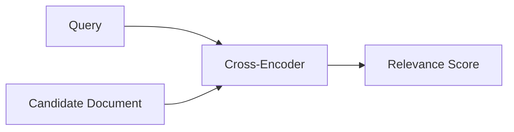

---

# 18. Important Correction: Current Re-Ranker Is Not a Cross-Encoder

The original implementation checks:

```javascript
title.includes(query)
content.includes(query)
```

That is a **keyword heuristic**, not a cross-encoder.

It is useful as a development fallback, but it should not be described as an actual cross-encoder.

Therefore, we call it:

```text
SemanticReRanker
```

until a real model is connected.

---

# 19. Development Re-Ranker

```javascript id="n7q4x5"
/**
 * Development Semantic Re-Ranker
 *
 * This is a lightweight lexical fallback.
 *
 * Production:
 * Replace this with a real cross-encoder model
 * or hosted re-ranking service.
 */
export class SemanticReRanker {
  static reRank(
    query,
    candidateDocs
  ) {
    if (
      typeof query !== "string" ||
      !Array.isArray(candidateDocs)
    ) {
      return [];
    }

    const queryTokens =
      query
        .toLowerCase()
        .split(/\s+/)
        .filter(Boolean);

    const scored =
      candidateDocs.map((doc) => {
        const text =
          `${doc.title || ""} ` +
          `${doc.content || ""}`
            .toLowerCase();

        let matches = 0;

        for (const token of queryTokens) {
          if (text.includes(token)) {
            matches++;
          }
        }

        const lexicalScore =
          queryTokens.length > 0
            ? matches /
              queryTokens.length
            : 0;

        return {
          ...doc,
          reRankScore:
            lexicalScore +
            (doc.rrfScore || 0),
        };
      });

    return scored.sort(
      (a, b) =>
        b.reRankScore -
        a.reRankScore
    );
  }
}
```

---

# 20. Production Cross-Encoder

The eventual architecture should be:

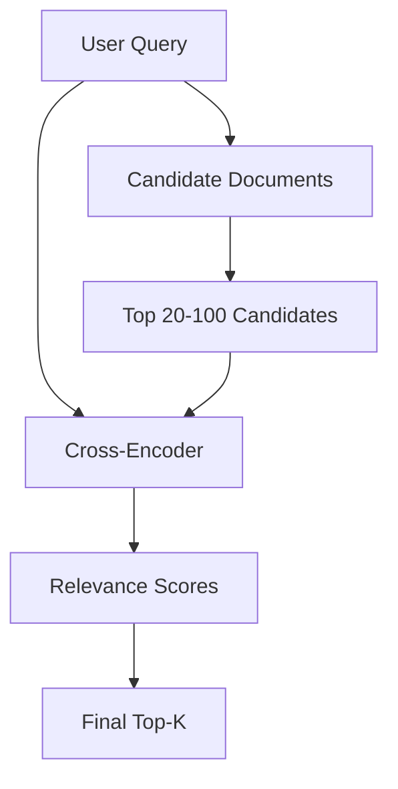

The cross-encoder should only run on a relatively small candidate set because it is more computationally expensive than initial retrieval.

For example:

```text
Qdrant → Top 50
PostgreSQL → Top 20
RRF → Top 20
Cross-Encoder → Top 5
```

The exact numbers should be tuned through evaluation.

---

# 21. Complete Retrieval Pipeline

At this point, our retrieval architecture is:

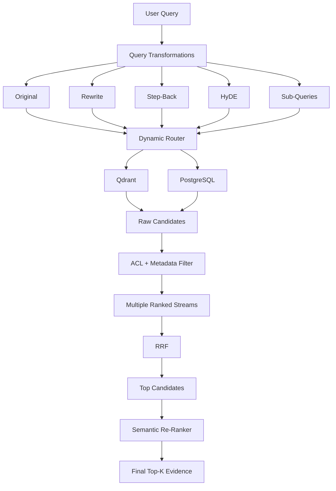

---

# 22. Why RRF Comes Before Re-Ranking

The system should not immediately run an expensive semantic model over every retrieved document.

Instead:

```text
1000 documents
      ↓
Initial retrieval
      ↓
100 candidates
      ↓
RRF
      ↓
20 candidates
      ↓
Cross-Encoder
      ↓
5 final documents
```

This creates a two-stage retrieval architecture:

### Stage 1 — Recall

Retrieve enough potentially useful documents.

### Stage 2 — Precision

Use stronger ranking to select the most relevant evidence.

This is commonly called:

```text
Recall → Re-Rank
```

---

# 23. Verification — RRF

The original verification imported:

```javascript
computeRrfFusion()
```

but our implementation exposes:

```javascript
ReciprocalRankFusion.fuse()
```

Use:

```bash id="v5n8c3"
node --input-type=module -e "
import { ReciprocalRankFusion } from './src/rag/retrieval/rrf.js';

const list1 = [
  { id: 'a', text: 'doc A' },
  { id: 'b', text: 'doc B' }
];

const list2 = [
  { id: 'b', text: 'doc B' },
  { id: 'a', text: 'doc A' }
];

console.dir(
  ReciprocalRankFusion.fuse(
    [list1, list2],
    60,
    2
  ),
  { depth: null }
);
"
```

The two documents should receive equal RRF scores because they have identical combined rank positions.

---

# 24. Verification — ACL Filtering

```bash id="q3m7w9"
node --input-type=module -e "
import { ACLMetadataFilter } from './src/rag/retrieval/filtering.js';

const docs = [
  {
    id: 'public_1',
    acl: 'public'
  },
  {
    id: 'private_1',
    acl: 'user_private',
    metadata: {
      userId: 'u1'
    }
  },
  {
    id: 'private_2',
    acl: 'user_private',
    metadata: {
      userId: 'u2'
    }
  }
];

console.log(
  ACLMetadataFilter.filterDocuments(
    docs,
    { userId: 'u1' }
  )
);
"
```

Expected behavior:

```text
public_1  → allowed
private_1 → allowed
private_2 → rejected
```

This test is important because authorization failures are security failures, not merely retrieval-quality problems.

---

# 25. Verification — Query Router + Retrieval

```bash id="c7k2p4"
node --input-type=module -e "
import { ParallelSearch } from './src/rag/retrieval/search.js';

const results =
  await ParallelSearch.searchAll(
    [
      'How does vLLM use PagedAttention?',
      'show my projects'
    ],
    {
      userId: 'user_demo_001'
    }
  );

console.dir(results, {
  depth: null
});
"
```

The exact ranking can change as the retrieval adapters evolve.

The important verification points are:

```text
✓ Query transformations are accepted
✓ Router selects Qdrant/PostgreSQL
✓ Results are retrieved
✓ ACL filtering occurs
✓ Streams are fused with RRF
✓ Candidates are re-ranked
```

---

# 26. Important Production Considerations

## 1. Real Qdrant integration

The current adapter is intentionally in-memory.

Production should replace:

```javascript
this.knowledgeDocs
```

with the real Qdrant client.

The retrieval path should become:

```text
Query
 ↓
Embedding
 ↓
Qdrant Search
 ↓
Metadata Filter
 ↓
Top-N Results
```

---

## 2. Embedding consistency

Every vector stored in Qdrant must use a compatible embedding model and dimension.

For example:

```text
Embedding model
      ↓
1536 dimensions
      ↓
Qdrant collection
```

Do not mix incompatible vector dimensions in the same collection.

---

## 3. ACL must happen as early as possible

Where supported, authorization filters should be pushed into the database query itself.

For example:

```text
Qdrant filter:
tenantId = currentTenant
AND userId = currentUser
```

Filtering only after retrieval can leak sensitive information through:

* ranking behavior;
* logs;
* metrics;
* timing;
* intermediate caches.

The safest architecture is:

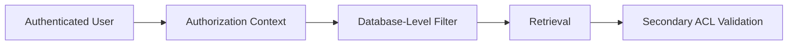

---

## 4. Never fail open

Avoid:

```javascript
return true;
```

for unknown security conditions.

Use:

```javascript
return false;
```

unless there is an explicitly defined policy.

---

## 5. Deduplicate before expensive re-ranking

The same document may appear through:

```text
Original query
Rewrite
Step-Back
HyDE
Sub-query
```

RRF naturally merges documents by ID.

This reduces unnecessary downstream re-ranking work.

---

## 6. Use stable document IDs

A document ID must remain stable across retrieval operations.

For example:

```text
qdrant_vllm_doc_1
```

should consistently identify the same logical document.

If every retrieval creates a new ID, RRF cannot recognize duplicates.

---

## 7. Re-ranking should be bounded

Do not send hundreds or thousands of documents to a cross-encoder.

Use a staged pipeline:

```text
Initial retrieval → larger candidate pool
RRF              → smaller candidate pool
Re-ranker        → final Top-K
```

---

## 8. RRF is rank-based

RRF does not care whether one system reports:

```text
0.91
```

and another reports:

```text
0.32
```

It only cares about their ranks.

This makes RRF useful when combining heterogeneous retrieval systems whose raw scores are not directly comparable.

---

## 9. Retrieval failure policy

In production, one backend may fail.

For example:

```text
Qdrant       → success
PostgreSQL   → timeout
```

The system should decide whether to:

* continue with Qdrant;
* retry PostgreSQL;
* return degraded results;
* fail the request.

A single backend failure should not accidentally crash the entire retrieval pipeline unless that backend is mandatory for the request.

---

# 27. Current Architecture After Chapter 4

We now have four major layers:

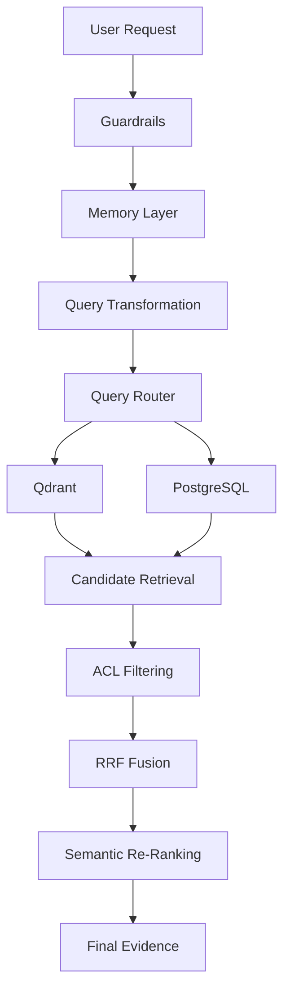

This is the core retrieval foundation for the system.

---

# 28. What We Have Built

### Storage abstraction

```text
StorageAdapter
```

### Semantic retrieval

```text
QdrantAdapter
```

### Structured retrieval

```text
PostgresAdapter
```

### Security

```text
ACLMetadataFilter
```

### Parallel retrieval

```text
ParallelSearch
```

### Multi-stream ranking

```text
ReciprocalRankFusion
```

### Final ranking

```text
SemanticReRanker
```

Together:

```text
Query
 ↓
Transform
 ↓
Route
 ↓
Retrieve
 ↓
Authorize
 ↓
Fuse
 ↓
Re-rank
 ↓
Evidence
```

---

# Next Chapter

**Chapter 5 — Context Assembly, LLM Generation & Corrective RAG (CRAG)**

The next chapter will take the final evidence generated here and build the answer-generation layer:

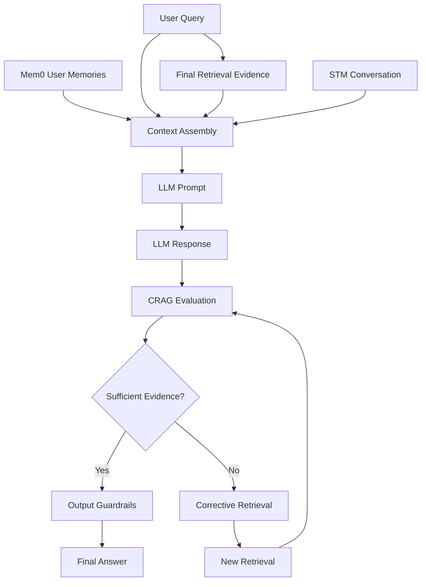

The major focus will be making the LLM answer **grounded in retrieved evidence rather than simply generating a plausible answer**.

