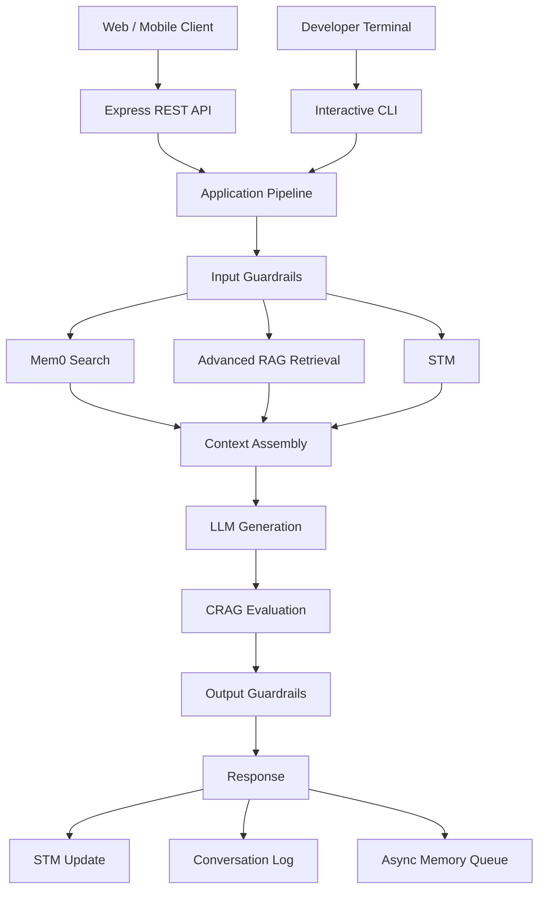
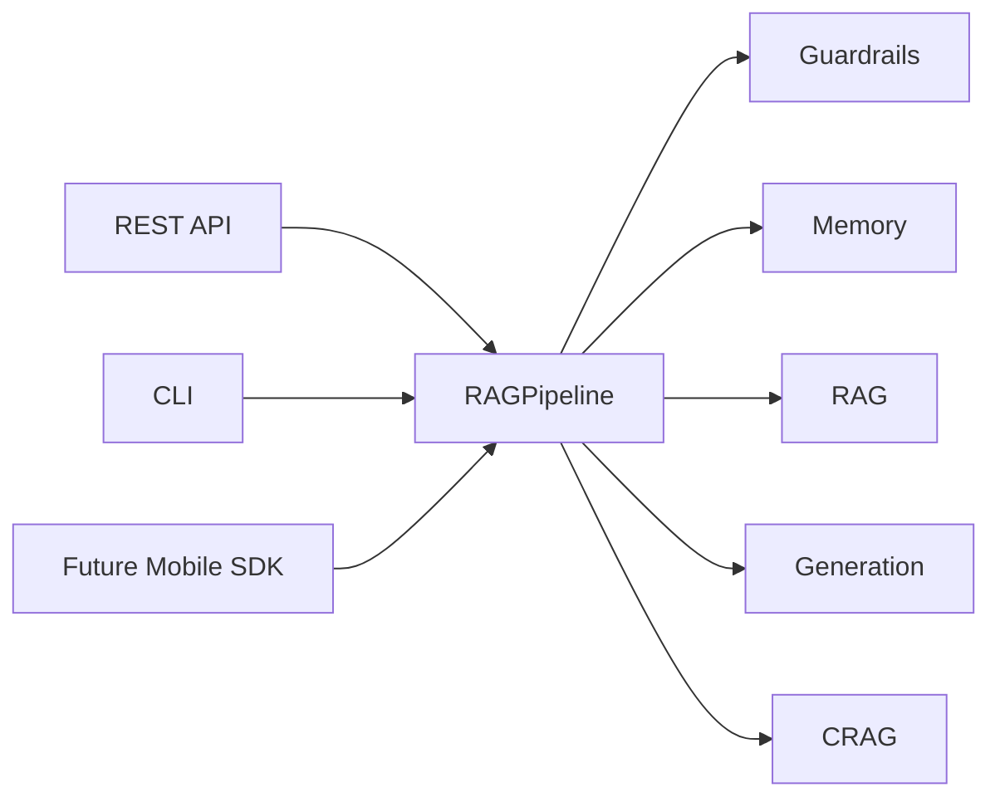
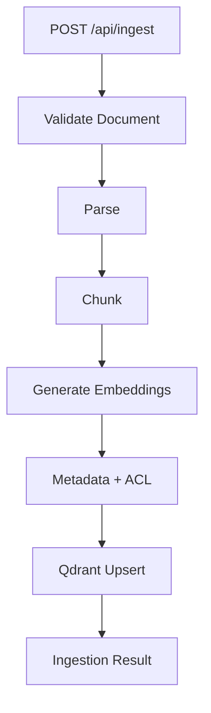
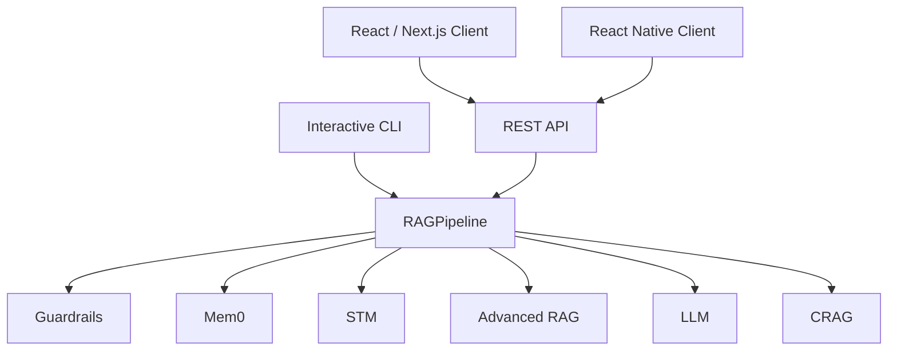
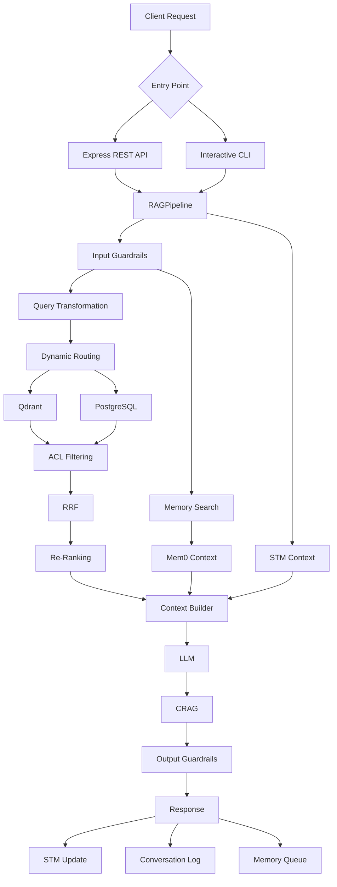
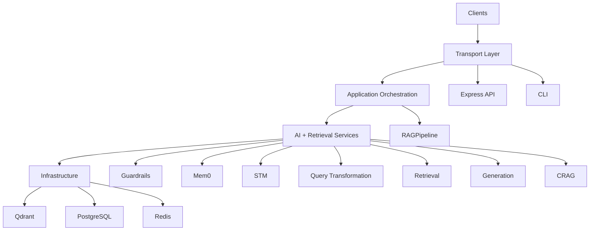
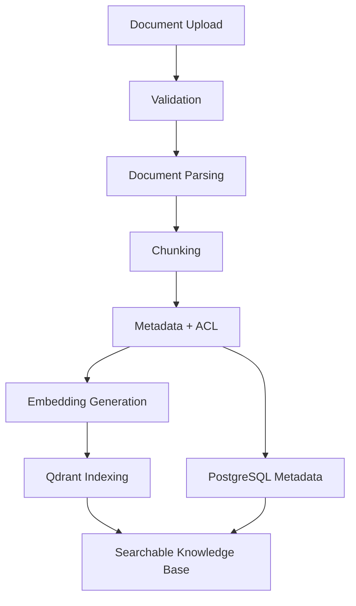

# Chapter 6 — Express REST API Gateway & Interactive CLI Runner

## 1. Chapter Goal

The goal of this chapter is to expose the Advanced RAG + Mem0 architecture through an HTTP API and provide a reusable terminal-based CLI.

We will build:

* **Express REST API Gateway** — `src/api/server.js`
* **Interactive CLI Runner** — `index.js`
* **Chat endpoint** — `POST /api/chat`
* **Document ingestion endpoint** — `POST /api/ingest`
* **Memory endpoint** — `GET /api/memories`
* **Health endpoint** — `GET /api/health`
* End-to-end API verification using `curl`

The important architectural principle is:

> **The API and CLI should both call the same RAG pipeline instead of implementing their own copies of the orchestration logic.**

This prevents the API and CLI from gradually behaving differently.

---

# 2. Chapter 6 Architecture

The system now has two entry points:



The API and CLI are therefore **transport layers**.

They should not contain database, retrieval, generation, or memory business logic.

---

# 3. REST API Design

The API will expose the following endpoints:

| Method | Endpoint        | Purpose                                    |
| ------ | --------------- | ------------------------------------------ |
| `GET`  | `/api/health`   | Check service status                       |
| `POST` | `/api/chat`     | Execute RAG + memory conversation          |
| `POST` | `/api/ingest`   | Ingest a document into the retrieval layer |
| `GET`  | `/api/memories` | Retrieve user memories                     |

The API listens on the port defined in Chapter 0:

```env
PORT=8000
```

Therefore the development server is:

```text
http://localhost:8000
```

---

# 4. Express REST API Gateway

## File

```text
adv-rag-memory/src/api/server.js
```

The API layer should remain thin.

Its responsibilities are:

1. Validate the HTTP request.
2. Build the request context.
3. Call the application pipeline.
4. Return a consistent JSON response.
5. Handle errors safely.

It should **not** manually perform:

```text
Memory Search
STM Search
RAG Retrieval
Context Building
LLM Generation
CRAG Evaluation
```

Those responsibilities already belong to the pipeline.

---

# 5. API Server Implementation

```javascript
import express from "express";

import { config } from "../config.js";
import { RAGPipeline } from "../rag/pipeline.js";
import { mem0Client } from "../memory/mem0.js";

const app = express();

app.use(express.json({ limit: "1mb" }));

// --------------------------------------------------
// Health Check
// --------------------------------------------------

app.get("/api/health", (_req, res) => {
  res.json({
    success: true,
    status: "ok",
    service: "advanced-rag-memory"
  });
});

// --------------------------------------------------
// Chat Endpoint
// --------------------------------------------------

app.post("/api/chat", async (req, res) => {
  try {
    const {
      userId,
      sessionId,
      query
    } = req.body || {};

    if (
      typeof userId !== "string" ||
      !userId.trim()
    ) {
      return res.status(400).json({
        success: false,
        error: "userId is required."
      });
    }

    if (
      typeof query !== "string" ||
      !query.trim()
    ) {
      return res.status(400).json({
        success: false,
        error: "query is required."
      });
    }

    const currentSession =
      typeof sessionId === "string" &&
      sessionId.trim()
        ? sessionId.trim()
        : `session_${Date.now()}`;

    /*
     * Authorization should normally happen before this point.
     *
     * Do not derive privileged fields such as isInternal=true
     * directly from arbitrary client input.
     *
     * This example represents a normal authenticated user.
     */

    const userContext = {
      userId: userId.trim(),
      sessionId: currentSession,
      isInternal: false
    };

    const result =
      await RAGPipeline.executeRAG(
        query.trim(),
        userContext
      );

    return res.status(200).json({
      success: true,
      sessionId: currentSession,
      response: result.response,
      evaluation: result.crag,
      memoriesUsedCount:
        result.memories?.length || 0,
      ragEvidenceCount:
        result.evidence?.length || 0
    });
  } catch (error) {
    console.error(
      "[API /chat Error]",
      error.message
    );

    return res.status(500).json({
      success: false,
      error: "Failed to process chat request."
    });
  }
});

// --------------------------------------------------
// Memories Endpoint
// --------------------------------------------------

app.get("/api/memories", async (req, res) => {
  try {
    const { userId } = req.query;

    if (
      typeof userId !== "string" ||
      !userId.trim()
    ) {
      return res.status(400).json({
        success: false,
        error: "userId query parameter is required."
      });
    }

    const memories =
      await mem0Client.getAllMemories(
        userId.trim()
      );

    return res.status(200).json({
      success: true,
      userId: userId.trim(),
      memories
    });
  } catch (error) {
    console.error(
      "[API /memories Error]",
      error.message
    );

    return res.status(500).json({
      success: false,
      error: "Failed to retrieve memories."
    });
  }
});

// --------------------------------------------------
// Document Ingestion Endpoint
// --------------------------------------------------

app.post("/api/ingest", async (req, res) => {
  try {
    const {
      document
    } = req.body || {};

    if (
      !document ||
      typeof document !== "object"
    ) {
      return res.status(400).json({
        success: false,
        error: "document object is required."
      });
    }

    /*
     * The actual indexing service will be introduced
     * in the ingestion/indexing chapter.
     *
     * For now we validate the request shape and
     * explicitly report that ingestion is not wired
     * to a persistent indexing backend yet.
     */

    return res.status(501).json({
      success: false,
      error:
        "Document ingestion service is not connected yet."
    });
  } catch (error) {
    console.error(
      "[API /ingest Error]",
      error.message
    );

    return res.status(500).json({
      success: false,
      error: "Failed to process ingestion request."
    });
  }
});

// --------------------------------------------------
// Global Error Handler
// --------------------------------------------------

app.use((error, _req, res, _next) => {
  console.error(
    "[API Global Error]",
    error
  );

  return res.status(500).json({
    success: false,
    error: "Internal server error."
  });
});

// --------------------------------------------------
// Start Server Only When Executed Directly
// --------------------------------------------------

const isMainModule =
  process.argv[1] &&
  process.argv[1].endsWith("server.js");

if (isMainModule) {
  app.listen(config.port, () => {
    console.log(
      `🚀 Advanced RAG + Mem0 API running at http://localhost:${config.port}`
    );
  });
}

export { app };
```

---

# 6. Why the API Does Not Implement the Full Pipeline

The original API manually performed:

```text
Input Guardrails
↓
Mem0 Search
↓
STM Search
↓
RAG
↓
Context Builder
↓
LLM
↓
CRAG
↓
Output Guardrails
↓
STM
↓
Conversation Store
↓
Memory Queue
```

This duplicates the logic already implemented in Chapter 5.

That creates a dangerous situation:

```text
API Pipeline ≠ CLI Pipeline ≠ Future Mobile Pipeline
```

Instead, we want:



There should be one source of truth for application orchestration.

---

# 7. Important Authorization Rule

The original implementation used:

```javascript
const userContext = {
  userId,
  isInternal: true
};
```

This is unsafe.

It effectively tells the retrieval system:

> Every API caller is an internal user.

That can bypass the ACL behavior introduced in Chapter 4.

In production, authorization should come from:

```text
Authentication
       ↓
Verified User Identity
       ↓
Authorization / Role Check
       ↓
userContext
```

For example:

```javascript
const userContext = {
  userId: authenticatedUser.id,
  isInternal: authenticatedUser.role === "internal"
};
```

The client should never be allowed to simply send:

```json
{
  "isInternal": true
}
```

and obtain privileged access.

---

# 8. Chat Request

A client sends:

```http
POST /api/chat
Content-Type: application/json
```

with:

```json
{
  "userId": "user_demo_01",
  "sessionId": "session_demo_01",
  "query": "What is the recommended architecture for RAG memory?"
}
```

The API passes the request into the master RAG pipeline.

---

# 9. Chat Response

A successful response should have a stable structure:

```json
{
  "success": true,
  "sessionId": "session_demo_01",
  "response": "...",
  "evaluation": {
    "score": 8.2,
    "isGood": true,
    "reasoning": "..."
  },
  "memoriesUsedCount": 2,
  "ragEvidenceCount": 4
}
```

The exact values will vary because retrieval and LLM generation are dynamic.

---

# 10. Memory Endpoint

The memory endpoint allows development tools and future user interfaces to inspect the long-term memory associated with a user.

```http
GET /api/memories?userId=user_demo_01
```

Example:

```json
{
  "success": true,
  "userId": "user_demo_01",
  "memories": [
    {
      "id": "mem_123",
      "userId": "user_demo_01",
      "memory": "User prefers TypeScript.",
      "category": "preference"
    }
  ]
}
```

## Production Security

A production implementation should **not** allow arbitrary users to request another user's memories.

Instead:

```text
Authenticated User
       ↓
Authenticated userId
       ↓
Authorization Check
       ↓
Memory Retrieval
```

The user ID should generally come from the authenticated identity rather than trusting a query parameter.

The current endpoint is primarily a development/demo interface.

---

# 11. Document Ingestion Endpoint

The chapter originally promised:

```http
POST /ingest
```

but did not provide an ingestion implementation.

We should not pretend that ingestion exists when Chapter 0 currently contains only a mock Qdrant adapter.

Therefore the endpoint is intentionally returned as:

```http
501 Not Implemented
```

until the indexing pipeline is connected.

A future implementation will look conceptually like:



This keeps the current chapter honest.

When a real ingestion service is added, `/api/ingest` can call something such as:

```javascript
await ingestionService.ingest(document);
```

instead of putting indexing logic inside `server.js`.

---

# 12. Interactive CLI Runner

## File

```text
adv-rag-memory/index.js
```

The CLI should act as another application entry point.

It should **not duplicate the REST API pipeline**.

The CLI will:

1. Create a demo user/session.
2. Optionally seed development memory.
3. Read terminal input.
4. Execute the same `RAGPipeline`.
5. Display the response.
6. Allow multiple turns.
7. Exit cleanly.

---

# 13. CLI Implementation

Node.js provides the `readline/promises` API for interactive terminal input.

```javascript
import readline from "node:readline/promises";
import { stdin as input, stdout as output } from "node:process";

import { RAGPipeline } from "./src/rag/pipeline.js";
import { mem0Client } from "./src/memory/mem0.js";

const rl = readline.createInterface({
  input,
  output
});

async function runDemo() {
  console.log(
    "\n=========================================================="
  );

  console.log(
    "🚀 ADVANCED RAG + MEM0 INTERACTIVE CLI"
  );

  console.log(
    "==========================================================\n"
  );

  const userId = "user_demo_cli";
  const sessionId = "session_cli_001";

  /*
   * Development-only memory seed.
   *
   * Real applications should populate memory
   * through actual user interactions.
   */

  await mem0Client.addMemory(
    userId,
    "User prefers TypeScript and Node.js for backend projects.",
    "preference"
  );

  await mem0Client.addMemory(
    userId,
    "User is interested in production RAG systems.",
    "professional"
  );

  console.log(
    "🧠 Demo Mem0 memories initialized."
  );

  console.log(
    'Type "exit" or "quit" to stop.\n'
  );

  while (true) {
    const query = (
      await rl.question("You: ")
    ).trim();

    if (!query) {
      continue;
    }

    if (
      query.toLowerCase() === "exit" ||
      query.toLowerCase() === "quit"
    ) {
      break;
    }

    try {
      const result =
        await RAGPipeline.executeRAG(
          query,
          {
            userId,
            sessionId,
            isInternal: false
          }
        );

      console.log("\nAssistant:");
      console.log(result.response);

      console.log(
        `\n[CRAG] ${result.crag.score.toFixed(2)}/10`
      );

      console.log(
        `[RAG] ${result.evidence.length} evidence document(s)`
      );

      console.log(
        `[Mem0] ${result.memories.length} memory item(s) used`
      );

      console.log(
        "\n----------------------------------------------------------\n"
      );
    } catch (error) {
      console.error(
        "\n❌ Request failed:",
        error.message
      );
    }
  }

  rl.close();

  console.log(
    "\n👋 CLI session ended."
  );
}

runDemo().catch((error) => {
  console.error(
    "Fatal CLI Error:",
    error
  );

  rl.close();
});
```

---

# 14. Why the CLI Is Better This Way

The previous CLI manually implemented the same steps as the API.

That created unnecessary duplication.

Now:

```text
CLI
 ↓
RAGPipeline
```

and:

```text
REST API
 ↓
RAGPipeline
```

Both use exactly the same application logic.

This becomes especially important when a mobile application is added later.

The architecture becomes:



---

# 15. Package Scripts

The `package.json` from Chapter 0 currently contains:

```json
{
  "scripts": {
    "start": "node src/api/server.js",
    "cli": "node index.js",
    "dev": "node --watch index.js",
    "worker": "node -e \"import { runMemoryWorkerPass } from './src/memory/memoryWorker.js'; runMemoryWorkerPass();\""
  }
}
```

The `dev` command should be aligned with the API development workflow.

Use:

```json
{
  "scripts": {
    "start": "node src/api/server.js",
    "cli": "node index.js",
    "dev": "node --watch src/api/server.js",
    "worker": "node -e \"import { runMemoryWorkerPass } from './src/memory/memoryWorker.js'; runMemoryWorkerPass();\""
  }
}
```

Now:

```bash
npm start
```

runs the API.

```bash
npm run dev
```

runs the API with Node's watch mode.

```bash
npm run cli
```

runs the interactive terminal.

```bash
npm run worker
```

runs one memory-worker pass.

Remember that the current worker and memory infrastructure are still in-memory mocks. A separate worker process cannot share those in-memory objects with the API process.

---

# 16. API Verification

## 16.1 Start the API

```bash
npm start
```

Expected:

```text
🚀 Advanced RAG + Mem0 API running at http://localhost:8000
```

---

# 17. Health Check

Run:

```bash
curl http://localhost:8000/api/health
```

Expected:

```json
{
  "success": true,
  "status": "ok",
  "service": "advanced-rag-memory"
}
```

This endpoint is useful for:

* Docker health checks
* load balancers
* Kubernetes probes
* deployment monitoring
* uptime checks

---

# 18. Test `/api/chat`

Run:

```bash
curl -X POST http://localhost:8000/api/chat \
  -H "Content-Type: application/json" \
  -d '{
    "userId": "user_demo_01",
    "sessionId": "session_demo_01",
    "query": "What is the recommended architecture for RAG memory?"
  }'
```

A successful response should resemble:

```json
{
  "success": true,
  "sessionId": "session_demo_01",
  "response": "...",
  "evaluation": {
    "score": 7.5,
    "isGood": true,
    "reasoning": "..."
  },
  "memoriesUsedCount": 0,
  "ragEvidenceCount": 3
}
```

The exact response depends on:

* available memories
* retrieved documents
* query transformations
* LLM availability
* CRAG evaluation

Therefore, do not hard-code an exact answer or score in tests.

---

# 19. Test Validation

Send an invalid request:

```bash
curl -X POST http://localhost:8000/api/chat \
  -H "Content-Type: application/json" \
  -d '{}'
```

Expected:

```json
{
  "success": false,
  "error": "userId is required."
}
```

This verifies that invalid requests are rejected before entering the expensive RAG pipeline.

---

# 20. Test `/api/memories`

Run:

```bash
curl \
  "http://localhost:8000/api/memories?userId=user_demo_01"
```

Expected structure:

```json
{
  "success": true,
  "userId": "user_demo_01",
  "memories": []
}
```

The actual list depends on whether memory has already been created for the user.

---

# 21. Test `/api/ingest`

Currently:

```bash
curl -X POST http://localhost:8000/api/ingest \
  -H "Content-Type: application/json" \
  -d '{
    "document": {
      "title": "RAG Architecture",
      "content": "Retrieval augmented generation combines retrieval and generation."
    }
  }'
```

The current development architecture should return:

```json
{
  "success": false,
  "error": "Document ingestion service is not connected yet."
}
```

with HTTP status:

```text
501 Not Implemented
```

This is intentional.

It is better to expose an explicit `501` than falsely report:

```json
{
  "status": "ingested"
}
```

when nothing was actually indexed.

---

# 22. Test the Interactive CLI

Run:

```bash
npm run cli
```

You should see:

```text
==========================================================
🚀 ADVANCED RAG + MEM0 INTERACTIVE CLI
==========================================================

🧠 Demo Mem0 memories initialized.
Type "exit" or "quit" to stop.

You:
```

Then enter:

```text
What database should I use for an AI backend?
```

The query will travel through the same master pipeline used by the API.

---

# 23. API + CLI Request Flow

The final application flow is:



---

# 24. Error Handling

API errors should not expose internal implementation details to clients.

Avoid returning:

```json
{
  "error": "Cannot read properties of undefined at src/rag/retrieval/search.js:81"
}
```

Instead, return:

```json
{
  "success": false,
  "error": "Failed to process chat request."
}
```

The detailed error can be logged internally.

In production, add:

```text
requestId
timestamp
error category
internal stack trace
```

to structured logs.

---

# 25. Request IDs

A future middleware should assign every request a unique ID.

For example:

```text
req_8f72a1
```

Then the same ID can appear in:

```text
API log
→ RAG retrieval log
→ LLM log
→ CRAG log
→ error log
```

This makes debugging distributed RAG systems significantly easier.

A future middleware could look like:

```javascript
import crypto from "node:crypto";

app.use((req, res, next) => {
  req.requestId =
    crypto.randomUUID();

  res.setHeader(
    "X-Request-ID",
    req.requestId
  );

  next();
});
```

---

# 26. Security Considerations

The API is an entry point into the entire RAG system, so security becomes especially important.

## Authentication

Production endpoints should require authentication.

```text
Client
 ↓
Authentication
 ↓
Verified Identity
 ↓
Authorization
 ↓
RAG Pipeline
```

## Authorization

ACL filtering from Chapter 4 must remain active.

Never trust:

```json
{
  "isInternal": true
}
```

from the client.

## Input Limits

Limit:

* JSON body size
* query length
* document size
* number of requests
* query variants

## Rate Limiting

Production APIs should protect expensive LLM endpoints from abuse.

## PII

Do not log:

* emails
* phone numbers
* access tokens
* API keys
* passwords
* private user content unnecessarily

---

# 27. Important Production Limitation

At the end of Chapter 6, the application has a production-oriented **architecture**, but it is not yet a fully production-deployed system.

Several components are still development implementations:

```text
Qdrant adapter     → mock/in-memory
PostgreSQL adapter → mock/in-memory
Redis              → mock/in-memory
Mem0               → mock/in-memory
CRAG               → lexical development evaluator
Ingestion          → not connected
Authentication     → not implemented
Rate limiting      → not implemented
Persistent logging → not implemented
```

This distinction is important.

The correct terminology is:

> **Production-oriented architecture with development adapters**

rather than:

> Fully production-ready infrastructure.

---

# 28. Current Architecture Status

After Chapter 6:

| Component               | Status                        |
| ----------------------- | ----------------------------- |
| Node.js ESM             | Implemented                   |
| Express API             | Implemented                   |
| Interactive CLI         | Implemented                   |
| Input Guardrails        | Development implementation    |
| Output Guardrails       | Development implementation    |
| STM                     | Development/in-memory         |
| Mem0                    | Mock adapter                  |
| Qdrant                  | Mock adapter                  |
| PostgreSQL              | Mock adapter                  |
| Redis                   | Mock adapter                  |
| Query Rewriting         | Development implementation    |
| Step-Back               | Development implementation    |
| HyDE                    | Development implementation    |
| Sub-query decomposition | Development implementation    |
| Dynamic routing         | Development implementation    |
| ACL filtering           | Implemented development logic |
| RRF                     | Implemented                   |
| Re-ranking              | Development lexical fallback  |
| Context Assembly        | Implemented                   |
| LLM Generation          | OpenAI + offline fallback     |
| CRAG                    | Development evaluator         |
| `/api/chat`             | Implemented                   |
| `/api/memories`         | Implemented                   |
| `/api/health`           | Implemented                   |
| `/api/ingest`           | Placeholder                   |
| Authentication          | Future                        |
| Rate limiting           | Future                        |
| Persistent storage      | Future                        |

---

# 29. Final Mental Model

The application can now be viewed as four layers:



This separation is one of the most important architectural decisions in the project.

The API is not the RAG system.

The CLI is not the RAG system.

They are simply interfaces into the RAG system.

---

# 30. Chapter 6 Checklist

Before moving forward, verify:

* [x] Express server created
* [x] `/api/health` implemented
* [x] `/api/chat` implemented
* [x] `/api/memories` implemented
* [x] `/api/ingest` explicitly marked unavailable until indexing exists
* [x] API uses `config.port`
* [x] Port aligned with Chapter 0 (`8000`)
* [x] API does not duplicate the RAG pipeline
* [x] CLI uses the same `RAGPipeline`
* [x] Request validation added
* [x] API error handling added
* [x] Authorization boundary documented
* [x] `isInternal` is not trusted from client input
* [x] CLI supports multiple turns
* [x] ESM-compatible commands maintained
* [x] `npm run dev` aligned with the API
* [x] `curl` verification provided
* [x] Development/mock infrastructure clearly identified
* [x] Mermaid architecture diagrams used

---

# 31. Next Chapter

The next logical step is **Chapter 7 — Document Ingestion, Chunking, Embeddings & Indexing**.

The `/api/ingest` endpoint currently stops at the API boundary because the actual ingestion pipeline has not been implemented.

Chapter 7 should build:



That chapter will turn `/api/ingest` from a placeholder into a real indexing workflow and complete the ingestion side of the RAG architecture.

