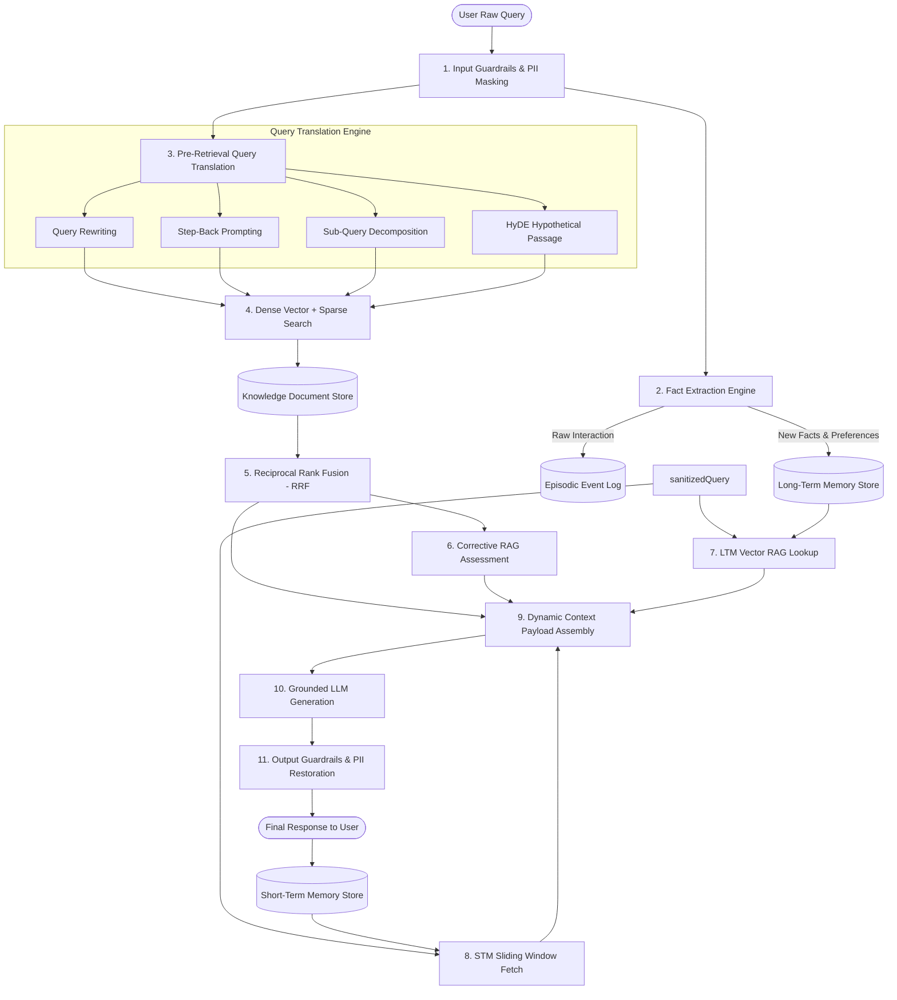

# 🚀 Production-Grade Advanced RAG with Agent Memory System

> **Comprehensive Integration of Week 03 Day 05 (Advanced RAG) and Week 04 Day 07 (Agent Memory Systems)**

This folder contains a complete, production-grade, modular implementation combining **Advanced Retrieval-Augmented Generation (RAG)** and **Application-Level Agent Memory Systems (STM + LTM + Memory Reflection)** built in Node.js (ES Modules).

---

## 📑 Table of Contents
1. [Architectural Overview & Flowchart](#-architectural-overview--flowchart)
2. [Folder Structure](#-folder-structure)
3. [Exhaustive File-by-File Deep Dive](#-exhaustive-file-by-file-deep-dive)
   - [Core Utilities & Config](#1-core-utilities--config)
   - [Advanced RAG Subsystem (Day 05)](#2-advanced-rag-subsystem-day-05)
   - [Agent Memory Subsystem (Day 07)](#3-agent-memory-subsystem-day-07)
   - [Master Orchestrator Agent](#4-master-orchestrator-agent)
4. [Context Payload Assembly Model](#-context-payload-assembly-model)
5. [Getting Started & Execution Guide](#-getting-started--execution-guide)

---

## 🏛️ Architectural Overview & Flowchart

In standard naive RAG, user queries pass directly to vector lookup (`User Query ➡️ Vector DB ➡️ LLM`). In production, this fails due to query vagueness, missing user context, memory limits, and lack of guardrails.

This system combines:
1. **Day 05 Advanced RAG**: Input PII Guardrails, Query Translation (Query Rewrite, Step-Back Prompting, Sub-Query Decomposition, HyDE Passage Generation), Multi-Source Hybrid Search, Reciprocal Rank Fusion (RRF), and Corrective RAG (CRAG) evaluation.
2. **Day 07 Agent Memory**: Short-Term Memory (STM) sliding window buffer, Long-Term Memory (LTM) Semantic Facts & Episodic Events, Vector RAG for query-relevant user memory, Automatic Fact Extraction, and Offline Memory Dreaming/Reflection for deduplication and contradiction resolution.



---

## 📁 Folder Structure

```text
week04/learning/day07/code/rag+memory/
├── package.json               # Package metadata and dependencies
├── .env.example               # Configuration environment template
├── README.md                  # Detailed code and architectural explanation
├── index.js                   # Interactive multi-turn demonstration script
└── src/
    ├── config.js              # Application configuration manager
    ├── utils/
    │   ├── embeddings.js      # Embeddings generator & Cosine similarity helper
    │   └── llm.js             # LLM caller & JSON completion helper
    ├── rag/
    │   ├── Guardrails.js      # Input PII masking & output restoration
    │   ├── QueryTranslator.js # Query rewrite, step-back, sub-queries & HyDE
    │   ├── DocumentStore.js   # Dense & sparse knowledge document search
    │   ├── HybridRanker.js    # Reciprocal Rank Fusion (RRF) ranker
    │   └── CRAG.js            # Corrective RAG evaluator
    ├── memory/
    │   ├── ShortTermMemory.js # Sliding window session context store
    │   ├── LongTermMemory.js  # Semantic facts & episodic vector memory
    │   ├── MemoryExtractor.js # Fact extraction engine from user turns
    │   └── MemoryReflection.js# Memory dreaming, contradiction resolution & eviction
    └── agent/
        └── RAGMemoryAgent.js  # Master orchestrator combining Advanced RAG + Agent Memory
```

---

## 🔍 Exhaustive File-by-File Deep Dive

### 1. Core Utilities & Config

#### 📄 [`src/config.js`](file:///home/aminul/development/gen-ai-cohort/week04/learning/day07/code/rag+memory/src/config.js)
- **Purpose**: Centralized application configuration. Loads API keys (`OPENAI_API_KEY`, `GEMINI_API_KEY`), memory parameters (`STM_MAX_TURNS=6`, `LTM_TOP_K=3`), and RAG parameters (`RAG_TOP_K=4`, `RRF_K=60`, `CRAG_THRESHOLD=6.0`).

#### 📄 [`src/utils/embeddings.js`](file:///home/aminul/development/gen-ai-cohort/week04/learning/day07/code/rag+memory/src/utils/embeddings.js)
- **Purpose**: Generates vector embeddings for text chunks and queries.
- **Key Functions**:
  - `getEmbedding(text)`: Calls OpenAI `text-embedding-3-small` if API key exists; otherwise uses a 16-dimensional normalized trigonometric semantic hash fallback function.
  - `cosineSimilarity(vecA, vecB)`: Computes normalized vector dot product:
    $$\text{CosineSimilarity}(\vec{A}, \vec{B}) = \frac{\vec{A} \cdot \vec{B}}{\|\vec{A}\| \|\vec{B}\|}$$

#### 📄 [`src/utils/llm.js`](file:///home/aminul/development/gen-ai-cohort/week04/learning/day07/code/rag+memory/src/utils/llm.js)
- **Purpose**: Standardized LLM interface supporting text and structured JSON responses (`callLLM` and `generateJSON`). Automatically provides context-aware fallbacks for offline testing.

---

### 2. Advanced RAG Subsystem (Day 05)

#### 📄 [`src/rag/Guardrails.js`](file:///home/aminul/development/gen-ai-cohort/week04/learning/day07/code/rag+memory/src/rag/Guardrails.js)
- **Purpose**: Security and privacy shield.
- **Input Pipeline**: Replaces emails (`alex@example.com`), phone numbers, and secrets with masked tokens (`[PII_EMAIL_1]`). Checks for prompt injection attempts.
- **Output Pipeline**: Restores original values in the final assistant answer before sending to user.

#### 📄 [`src/rag/QueryTranslator.js`](file:///home/aminul/development/gen-ai-cohort/week04/learning/day07/code/rag+memory/src/rag/QueryTranslator.js)
- **Purpose**: Solves vague or informal user query failure modes.
- **Generates**:
  1. **Rewritten Query**: Optimized keyword representation.
  2. **Step-Back Query**: High-level abstract background query.
  3. **Sub-Queries**: Decomposed specific sub-questions.
  4. **HyDE Passage**: Synthetic hypothetical document passage generated by LLM for dense similarity retrieval.

#### 📄 [`src/rag/DocumentStore.js`](file:///home/aminul/development/gen-ai-cohort/week04/learning/day07/code/rag+memory/src/rag/DocumentStore.js)
- **Purpose**: Knowledge document repository.
- **Methods**:
  - `addDocument(docId, title, content)`: Chunks text, computes embeddings, and indexes keywords.
  - `searchDense(vector, topK)`: Similarity search against vector embeddings.
  - `searchSparse(query, topK)`: Keyword intersection match.

#### 📄 [`src/rag/HybridRanker.js`](file:///home/aminul/development/gen-ai-cohort/week04/learning/day07/code/rag+memory/src/rag/HybridRanker.js)
- **Purpose**: Reciprocal Rank Fusion (RRF) engine combining multiple retrieval streams into a unified candidate list.
- **Formula**:
  $$RRF(d) = \sum_{m \in M} \frac{1}{k + r_m(d)}$$
  where $k = 60$ and $r_m(d)$ is the rank of document $d$ in result stream $m$.

#### 📄 [`src/rag/CRAG.js`](file:///home/aminul/development/gen-ai-cohort/week04/learning/day07/code/rag+memory/src/rag/CRAG.js)
- **Purpose**: Corrective RAG context evaluator.
- **Function**: Evaluates context relevance score (0–10). If score < threshold (6.0), flags retrieval context as insufficient.

---

### 3. Agent Memory Subsystem (Day 07)

#### 📄 [`src/memory/ShortTermMemory.js`](file:///home/aminul/development/gen-ai-cohort/week04/learning/day07/code/rag+memory/src/memory/ShortTermMemory.js)
- **Purpose**: Sliding window Short-Term Memory (STM) store.
- **Function**: Retains the last $N$ turns (e.g. 6 turns) per session. Prevents context window overflows and token cost explosions.

#### 📄 [`src/memory/LongTermMemory.js`](file:///home/aminul/development/gen-ai-cohort/week04/learning/day07/code/rag+memory/src/memory/LongTermMemory.js)
- **Purpose**: Dual-store Long-Term Memory (LTM).
- **Components**:
  - **Semantic Memory**: Persistent user facts and preferences with embeddings, creation timestamps, and hit scores (`hitCount`).
  - **Episodic Memory**: Time-series log of raw interaction events.
  - **Vector RAG**: Performs vector search over semantic facts, updating hit counts and `lastAccessedAt` timestamps upon match.

#### 📄 [`src/memory/MemoryExtractor.js`](file:///home/aminul/development/gen-ai-cohort/week04/learning/day07/code/rag+memory/src/memory/MemoryExtractor.js)
- **Purpose**: Real-time Fact Extraction Engine. Automatically extracts user attributes, preferences, and key entities from incoming messages using LLM completions.

#### 📄 [`src/memory/MemoryReflection.js`](file:///home/aminul/development/gen-ai-cohort/week04/learning/day07/code/rag+memory/src/memory/MemoryReflection.js)
- **Purpose**: Claude-style Memory Dreaming and Reflection background process.
- **Functions**:
  - Identifies duplicate facts and merges them.
  - Resolves memory contradictions (e.g. location updates).
  - Evicts stale or low hit-score facts.

---

### 4. Master Orchestrator Agent

#### 📄 [`src/agent/RAGMemoryAgent.js`](file:///home/aminul/development/gen-ai-cohort/week04/learning/day07/code/rag+memory/src/agent/RAGMemoryAgent.js)
- **Purpose**: Master production workflow orchestrator.
- **Workflow**:
  1. Mask PII via Input Guardrails.
  2. Extract new facts into LTM.
  3. Execute Query Translation.
  4. Perform multi-source retrieval & RRF fusion.
  5. Evaluate groundedness with CRAG.
  6. Perform Vector RAG over user LTM.
  7. Retrieve recent STM sliding window.
  8. Assemble dynamic context payload.
  9. Generate response via LLM.
  10. Restore PII via Output Guardrails.
  11. Update STM sliding window.

---

## 🧩 Context Payload Assembly Model

The orchestrator builds a single unified context payload sent to the LLM:

```text
================ SYSTEM PROMPT ================
You are an advanced AI assistant equipped with RAG knowledge lookup and long-term user memory.

=== USER LONG-TERM MEMORY (FACTS) ===
- User name is Alex (Hit count: 2)
- User works on vLLM inference engines (Hit count: 3)

=== RETRIEVED KNOWLEDGE DOCUMENTS (RAG) ===
[Doc 1] Title: vLLM High Performance Inference Engine
Content: vLLM utilizes PagedAttention to eliminate KV cache fragmentation...

=== RECENT CONVERSATION HISTORY (STM SLIDING WINDOW) ===
USER: Hi, my name is Alex.
ASSISTANT: Hello Alex!

=== CURRENT USER QUESTION ===
How does vLLM handle KV cache fragmentation?
```

---

## 🚀 Getting Started & Execution Guide

### 1. Installation
Navigate to the directory and link or install dependencies:
```bash
cd week04/learning/day07/code/rag+memory
node index.js
```

### 2. Environment Configuration
Copy `.env.example` to `.env` to supply API keys if desired:
```bash
cp .env.example .env
```
*(Note: If no API keys are provided, the system automatically uses smart deterministic fallback models for embeddings and LLM completions.)*

### 3. Run Memory Dreaming Reflection Pass
To test the offline background memory consolidation pass:
```bash
npm run dream
```
