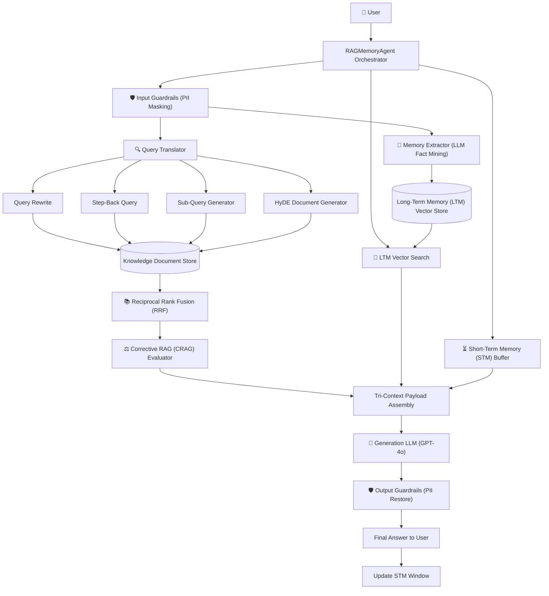
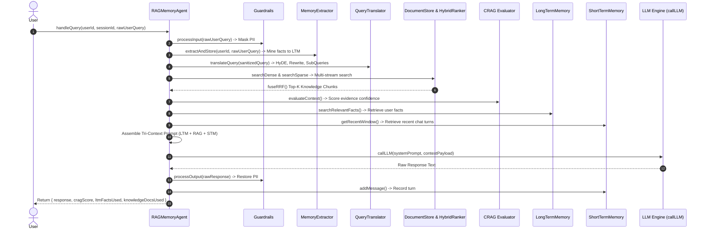

# Advanced RAG + Agent Memory Master Index

Welcome to the **Advanced RAG + Agent Memory Framework Guide**! This guide takes backend and AI developers step-by-step through building a production-grade **Autonomous RAG Agent integrated with Short-Term (STM) and Long-Term (LTM) User Memory**.

Built with **Node.js (ESM)**, **OpenAI (GPT-4o)**, **Google Gemini API**, and **dotenv**, this system implements an 11-step cognitive pipeline combining knowledge retrieval (**Advanced RAG**) with user-centric memory management (**Mem0-style LTM, Fact Extraction, and Background Memory Reflection**).

---

## 📁 Project Folder Structure Map

All source code for this framework is located inside `week04/learning/day07/code/rag+memory/`:

```text
rag+memory/
├── package.json                   # NPM dependencies & scripts ("type": "module")
├── .env.example                   # Environment configuration template
├── README.md                      # Architecture overview & setup instructions
├── EXPLANATION.md                 # Concepts & design decisions
├── index.js                       # Interactive CLI entry point & demonstration suite
├── implementation guide/          # Step-by-step implementation chapters & documentation
│   ├── README.md                  # Master index & system architecture (this file)
│   ├── chapter-00-overview-setup.md
│   ├── chapter-01-rag-foundation.md
│   ├── chapter-02-query-transformation-crag.md
│   ├── chapter-03-agent-memory-architecture.md
│   ├── chapter-04-memory-extraction-reflection.md
│   ├── chapter-05-master-orchestrator-agent.md
│   └── chapter-06-cli-runner-verification.md
└── src/
    ├── config.js                  # Central configuration parameters
    ├── agent/
    │   └── RAGMemoryAgent.js      # Master 11-step Orchestrator Agent
    ├── memory/
    │   ├── ShortTermMemory.js     # Sliding window chat turn history
    │   ├── LongTermMemory.js      # Semantic/Episodic vector memory & hit counter
    │   ├── MemoryExtractor.js     # LLM-driven structured fact extraction
    │   └── MemoryReflection.js    # Memory dreaming, deduplication & decay eviction
    ├── rag/
    │   ├── DocumentStore.js       # Dense vector & Sparse keyword knowledge store
    │   ├── HybridRanker.js        # Reciprocal Rank Fusion (RRF) algorithm
    │   ├── Guardrails.js          # PII masking & restoration
    │   ├── QueryTranslator.js     # HyDE, Query Rewrite, Step-Back, Sub-Queries
    │   └── CRAG.js                # Corrective RAG (CRAG) confidence evaluator
    └── utils/
        ├── embeddings.js          # Vector embeddings generator (OpenAI / Gemini)
        └── llm.js                 # LLM completion engine (GPT-4o / Gemini fallback)
```

---

## 🏗 Dual Memory & RAG Architecture

The architecture decouples **Knowledge RAG** from **User Memory Retrieval**:



---

## 🔄 11-Step Pipeline Execution Flow



---

## 📚 Master Chapter Reference Table

| Chapter | Focus Area | Guide File | Key Topics Covered |
| :--- | :--- | :--- | :--- |
| **Ch 0** | **Overview & Setup** | [Chapter 00 Guide](chapter-00-overview-setup.md) | Project setup, ESM configuration, `package.json`, `.env.example`, `config.js`, embeddings (`embeddings.js`), LLM calls (`llm.js`). |
| **Ch 1** | **RAG Foundation** | [Chapter 01 Guide](chapter-01-rag-foundation.md) | Knowledge Document Store (`DocumentStore.js`), Reciprocal Rank Fusion (`HybridRanker.js`), Input/Output PII Guardrails (`Guardrails.js`). |
| **Ch 2** | **Query & CRAG** | [Chapter 02 Guide](chapter-02-query-transformation-crag.md) | Query Translator (`QueryTranslator.js` - HyDE, Rewrite, Step-Back, Sub-Queries), Corrective RAG evaluator (`CRAG.js`). |
| **Ch 3** | **Memory Systems** | [Chapter 03 Guide](chapter-03-agent-memory-architecture.md) | Short-Term Memory sliding window (`ShortTermMemory.js`), Long-Term Memory vector store & hit counter (`LongTermMemory.js`). |
| **Ch 4** | **Extraction & Reflection**| [Chapter 04 Guide](chapter-04-memory-extraction-reflection.md) | Structured LLM fact extraction (`MemoryExtractor.js`), Memory reflection dreaming, deduplication & decay eviction (`MemoryReflection.js`). |
| **Ch 5** | **Master Orchestrator** | [Chapter 05 Guide](chapter-05-master-orchestrator-agent.md) | Master `RAGMemoryAgent` implementation, 11-step pipeline integration, context assembly payload. |
| **Ch 6** | **CLI & Verification** | [Chapter 06 Guide](chapter-06-cli-runner-verification.md) | Main CLI runner (`index.js`), 4 scenario passes (preferences, technical queries, follow-up, memory reflection pass), verification. |

---

## ⚡ Quick Start Sequence

### 1. Install Dependencies
Navigate to the project root directory and install dependencies:

```bash
cd week04/learning/day07/code/rag+memory
npm install
```

### 2. Configure Environment Variables
Create a `.env` file or export your API keys:

```bash
cp .env.example .env
export OPENAI_API_KEY="your-openai-api-key-here"
```

### 3. Run the Demonstration Suite

```bash
npm start
```

### 4. Run Memory Reflection Dreaming Pass

```bash
npm run dream
```
