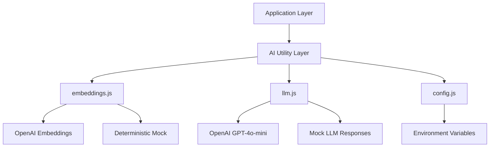
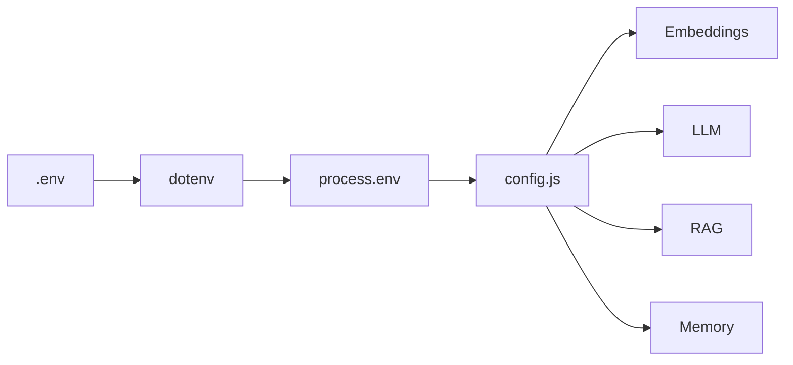
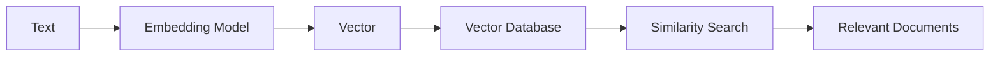
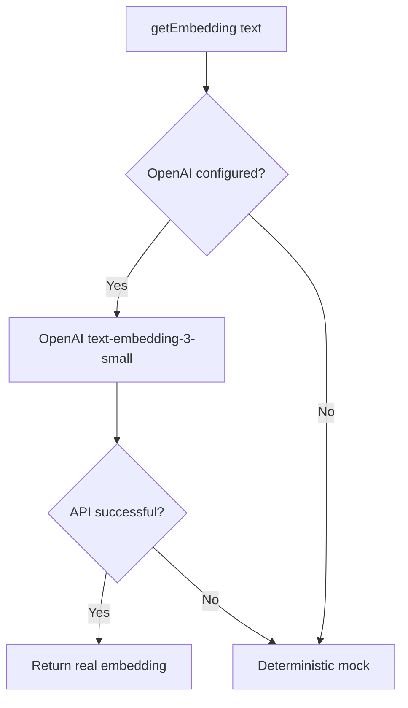
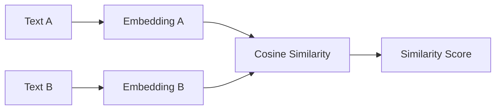
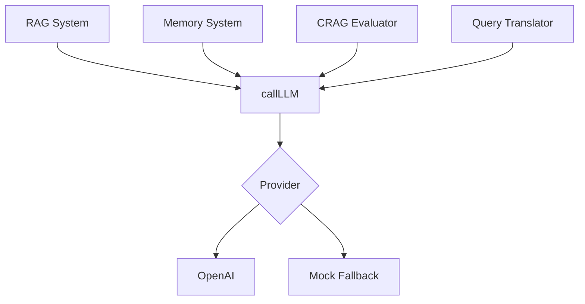
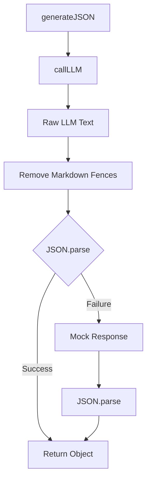
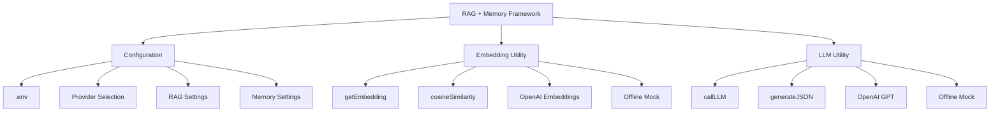
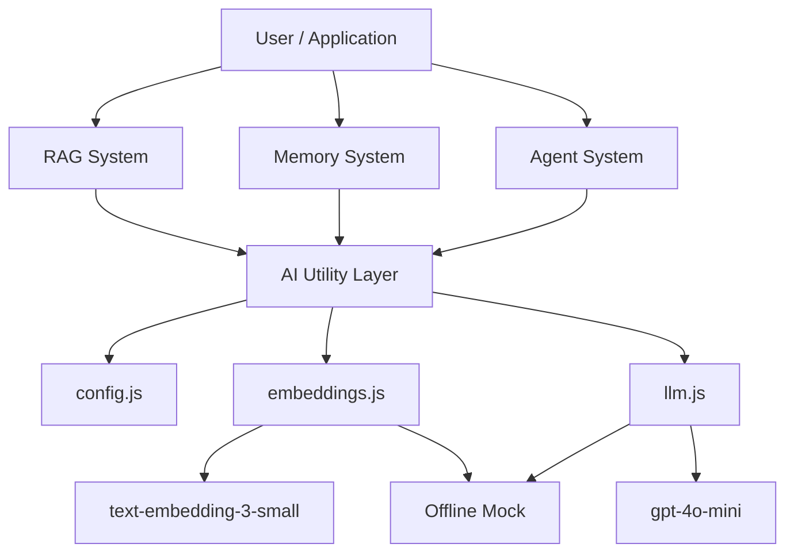

# Chapter 0 — Overview, Setup & AI Utility Modules

## 1. Chapter Goal

The goal of this chapter is to prepare the **Node.js ESM environment**, central configuration, and reusable AI utility modules for our **RAG + Memory Framework**.

Before building RAG, memory, retrieval, reflection, or agent workflows, we need a reliable foundation for communicating with AI models.

Instead of calling OpenAI or Gemini directly from every part of the application, we create a small **utility layer**.

This gives the rest of the system simple functions such as:

```js
getEmbedding(text)
```

and:

```js
callLLM(systemPrompt, userPrompt)
```

The rest of the application does not need to know how the underlying provider works.

### What we build

In this chapter we will:

1. Configure Node.js with native **ES Modules**.
2. Load environment variables using `dotenv`.
3. Create a centralized configuration object.
4. Build an **embedding utility**.
5. Add deterministic offline embedding fallback.
6. Implement cosine similarity.
7. Build an **LLM completion utility**.
8. Add structured JSON generation.
9. Add offline mock responses for development.
10. Verify that the AI utility layer works.

---

## 🎯 Expected Outcome

At the end of this chapter, our project will contain:

```text
src/
├── config.js
└── utils/
    ├── embeddings.js
    └── llm.js
```

The responsibilities are:

| Module          | Responsibility                            |
| --------------- | ----------------------------------------- |
| `config.js`     | Centralized environment/configuration     |
| `embeddings.js` | Generate vectors and calculate similarity |
| `llm.js`        | Generate text and structured JSON         |

The architecture looks like this:



The important idea is **separation of concerns**.

The RAG system should not contain OpenAI initialization code everywhere.

Instead:

```text
RAG / Memory / Agents
        ↓
    AI Utilities
        ↓
  Provider APIs
```

---

# 2. Package & Configuration Setup

Navigate to the project root:

```bash
cd week04/learning/day07/code/rag+memory
```

---

## 2.1 `package.json`

Create or update `package.json`:

```json
{
  "name": "rag-with-memory",
  "version": "1.0.0",
  "description": "Production-Grade Advanced RAG with Agent Short-Term & Long-Term Memory System",
  "main": "index.js",
  "type": "module",
  "scripts": {
    "start": "node index.js",
    "dev": "node --watch index.js",
    "dream": "node -e \"import { MemoryReflection } from './src/memory/MemoryReflection.js'; console.log('Running Memory Dreaming offline background job...');\""
  },
  "keywords": [
    "rag",
    "vector-search",
    "memory",
    "short-term-memory",
    "long-term-memory",
    "crag",
    "rrf",
    "hyde",
    "llm-agent"
  ],
  "author": "GenAI Cohort",
  "license": "ISC",
  "dependencies": {
    "@google/genai": "^0.13.0",
    "dotenv": "^16.4.7",
    "openai": "^4.52.7"
  }
}
```

---

## 2.2 Why `"type": "module"`?

This line:

```json
"type": "module"
```

tells Node.js to use **ES Modules**.

That allows us to write:

```js
import OpenAI from "openai";
```

instead of CommonJS:

```js
const OpenAI = require("openai");
```

We can also use:

```js
export function getEmbedding() {}
```

and:

```js
import { getEmbedding } from "./utils/embeddings.js";
```

This project therefore follows the modern Node.js ESM style.

### Important ESM rule

When importing local JavaScript modules, include the `.js` extension:

```js
import { config } from "../config.js";
```

rather than:

```js
import { config } from "../config";
```

---

# 3. Environment Variables

Create a `.env` file in the project root.

For example:

```env
LLM_PROVIDER=openai
EMBEDDING_PROVIDER=openai

OPENAI_API_KEY=your_openai_api_key
GEMINI_API_KEY=your_gemini_api_key
GROQ_API_KEY=your_groq_api_key

STM_MAX_TURNS=6
LTM_TOP_K=3

RAG_TOP_K=4
RRF_K=60
CRAG_THRESHOLD=6.0
```

### What these variables control

| Variable             | Purpose                             |
| -------------------- | ----------------------------------- |
| `LLM_PROVIDER`       | Selects the LLM provider            |
| `EMBEDDING_PROVIDER` | Selects the embedding provider      |
| `OPENAI_API_KEY`     | OpenAI authentication               |
| `GEMINI_API_KEY`     | Gemini authentication               |
| `GROQ_API_KEY`       | Groq authentication                 |
| `STM_MAX_TURNS`      | Short-term memory limit             |
| `LTM_TOP_K`          | Number of long-term memory results  |
| `RAG_TOP_K`          | Number of RAG candidates            |
| `RRF_K`              | Reciprocal Rank Fusion constant     |
| `CRAG_THRESHOLD`     | Corrective RAG evaluation threshold |

### Security rule

Never commit `.env` to Git.

Add:

```text
.env
```

to `.gitignore`.

---

# 4. Central Configuration — `src/config.js`

Create:

```text
src/config.js
```

with:

```js
import dotenv from "dotenv";

dotenv.config();

export const config = {
  llmProvider: process.env.LLM_PROVIDER || "openai",

  embeddingProvider:
    process.env.EMBEDDING_PROVIDER || "openai",

  openaiApiKey:
    process.env.OPENAI_API_KEY || "",

  geminiApiKey:
    process.env.GEMINI_API_KEY || "",

  groqApiKey:
    process.env.GROQ_API_KEY || "",

  memory: {
    stmMaxTurns: parseInt(
      process.env.STM_MAX_TURNS || "6",
      10
    ),

    ltmTopK: parseInt(
      process.env.LTM_TOP_K || "3",
      10
    ),
  },

  rag: {
    topK: parseInt(
      process.env.RAG_TOP_K || "4",
      10
    ),

    rrfK: parseInt(
      process.env.RRF_K || "60",
      10
    ),

    cragThreshold: parseFloat(
      process.env.CRAG_THRESHOLD || "6.0"
    ),
  },
};
```

---

## 4.1 Loading environment variables

The first line:

```js
import dotenv from "dotenv";
```

imports the `dotenv` package.

Then:

```js
dotenv.config();
```

loads variables from `.env` into:

```js
process.env
```

For example:

```env
OPENAI_API_KEY=abc123
```

becomes accessible through:

```js
process.env.OPENAI_API_KEY
```

---

## 4.2 Why centralize configuration?

Without a central configuration module, different files might contain:

```js
process.env.OPENAI_API_KEY
```

```js
process.env.RAG_TOP_K
```

```js
process.env.STM_MAX_TURNS
```

all over the project.

That quickly becomes difficult to maintain.

Instead, we create one configuration object:

```js
config
```

and import it wherever required:

```js
import { config } from "../config.js";
```

The architecture becomes:



This gives us a single configuration boundary.

---

# 5. Vector Embeddings Utility

Create:

```text
src/utils/embeddings.js
```

The purpose of this module is to convert text into numerical vectors.

For example:

```text
"Node.js is a JavaScript runtime"
```

might become conceptually:

```text
[0.12, -0.04, 0.83, ...]
```

These vectors allow us to perform **semantic similarity search**.

---

## 5.1 Why do we need embeddings?

Traditional keyword search asks:

> Does this document contain the same words?

Embedding search asks:

> Is this document semantically similar to the query?

For example:

```text
Query:
"How do I create a server with Node?"

Document:
"Express can be used to build HTTP servers in JavaScript."
```

The words are different, but their meaning is related.

Embeddings allow us to represent both pieces of text in vector space.



---

# 6. OpenAI Embedding Client

Start the file with:

```js
import OpenAI from "openai";
import { config } from "../config.js";

let openaiClient = null;

if (config.openaiApiKey) {
  openaiClient = new OpenAI({
    apiKey: config.openaiApiKey,
  });
}
```

### Why is the client initialized conditionally?

We don't want the application to immediately fail when an API key is missing.

Instead:

```js
let openaiClient = null;
```

means:

> No OpenAI client is available yet.

Then:

```js
if (config.openaiApiKey)
```

checks whether an API key exists.

If it does, we create the client.

This enables both:

```text
Online mode
    ↓
OpenAI API
```

and:

```text
Offline mode
    ↓
Deterministic mock
```

---

# 7. Deterministic Mock Embeddings

For development and testing, we create a deterministic fallback:

```js
function getDeterministicMockEmbedding(
  text,
  dimension = 16
) {
  const normText = text.toLowerCase().trim();

  const vector = new Array(dimension).fill(0);

  for (let i = 0; i < normText.length; i++) {
    const charCode = normText.charCodeAt(i);
    const index = i % dimension;

    vector[index] += Math.sin(
      charCode * (i + 1)
    );
  }

  const magnitude = Math.sqrt(
    vector.reduce(
      (sum, val) => sum + val * val,
      0
    )
  );

  return magnitude === 0
    ? vector
    : vector.map((v) => v / magnitude);
}
```

---

## 7.1 What is this function doing?

It converts a string into a deterministic vector.

The important word is:

**deterministic**

The same input produces the same vector.

For example:

```js
getDeterministicMockEmbedding("node.js")
```

will produce the same vector every time.

This is useful for:

* offline development
* unit tests
* demos
* API-key-free environments

However, this is **not a replacement for a real embedding model**.

It does not understand language semantics.

---

## 7.2 Step-by-step flow

The function first normalizes the input:

```js
const normText = text.toLowerCase().trim();
```

Then creates a vector:

```js
const vector = new Array(dimension).fill(0);
```

For the default dimension:

```text
dimension = 16
```

we get:

```text
[0, 0, 0, 0, ..., 0]
```

The function then iterates through each character:

```js
for (let i = 0; i < normText.length; i++)
```

and converts it into a numerical signal using:

```js
Math.sin(...)
```

Finally, it normalizes the vector to approximately unit length.

---

# 8. `getEmbedding()` Function

Now expose the main embedding function:

```js
export async function getEmbedding(text) {
  if (!text || typeof text !== "string") {
    return new Array(16).fill(0);
  }

  if (
    openaiClient &&
    config.embeddingProvider === "openai"
  ) {
    try {
      const response =
        await openaiClient.embeddings.create({
          model: "text-embedding-3-small",
          input: text,
        });

      return response.data[0].embedding;
    } catch (err) {
      console.warn(
        `[Embedding Warning] OpenAI API call failed, falling back to mock: ${err.message}`
      );
    }
  }

  return getDeterministicMockEmbedding(text);
}
```

---

## 8.1 Input validation

First:

```js
if (!text || typeof text !== "string")
```

protects against invalid input.

For example:

```js
getEmbedding(null)
```

or:

```js
getEmbedding(123)
```

will not cause an API request.

The function returns a zero vector instead.

---

## 8.2 Provider selection

Next:

```js
if (
  openaiClient &&
  config.embeddingProvider === "openai"
)
```

means:

> Use OpenAI only when the client exists and OpenAI is the selected embedding provider.

This gives us a provider abstraction.

Conceptually:



---

# 9. OpenAI Embedding Request

The actual request is:

```js
const response =
  await openaiClient.embeddings.create({
    model: "text-embedding-3-small",
    input: text,
  });
```

The model:

```text
text-embedding-3-small
```

generates an embedding vector for the input text.

Then:

```js
return response.data[0].embedding;
```

extracts the vector.

### Important dimension detail

When using the real OpenAI embedding model, the returned vector has the model's configured/default dimensionality.

Your verification example expects:

```text
1536
```

which is the standard dimensionality associated with `text-embedding-3-small` when no reduced dimensions are requested.

However, when the application is running offline, our fallback uses:

```js
dimension = 16
```

Therefore:

```text
OpenAI mode  → typically 1536 dimensions
Mock mode    → 16 dimensions
```

Do not treat the mock vector as compatible with a production vector database that was indexed using 1536-dimensional OpenAI vectors.

---

# 10. Error Fallback

The API request is wrapped in:

```js
try {
  ...
} catch (err) {
  console.warn(...);
}
```

If OpenAI fails, we don't crash the entire application.

Instead:

```js
return getDeterministicMockEmbedding(text);
```

is used.

This makes local development much easier.

### Production consideration

For production systems, silently switching from real embeddings to fake embeddings can be dangerous.

Imagine your vector database contains:

```text
1536-dimensional OpenAI vectors
```

but a runtime failure suddenly causes:

```text
16-dimensional mock vectors
```

A vector database will normally reject the dimension mismatch.

Even if dimensions were compatible, the semantic behavior would not be equivalent.

Therefore, a production system should usually make fallback behavior explicit and observable.

---

# 11. Cosine Similarity

Add:

```js
export function cosineSimilarity(vecA, vecB) {
  if (
    !vecA ||
    !vecB ||
    vecA.length !== vecB.length
  ) {
    return 0;
  }

  let dotProduct = 0;
  let magA = 0;
  let magB = 0;

  for (let i = 0; i < vecA.length; i++) {
    dotProduct += vecA[i] * vecB[i];

    magA += vecA[i] * vecA[i];

    magB += vecB[i] * vecB[i];
  }

  magA = Math.sqrt(magA);
  magB = Math.sqrt(magB);

  return magA && magB
    ? dotProduct / (magA * magB)
    : 0;
}
```

---

## 11.1 What is cosine similarity?

Cosine similarity measures how similar the direction of two vectors is.

The formula is:

```text
             A · B
similarity = -------
             |A||B|
```

Where:

* `A · B` = dot product
* `|A|` = magnitude of vector A
* `|B|` = magnitude of vector B

Conceptually:



A score closer to `1` generally indicates stronger directional similarity.

A score closer to `0` indicates little directional similarity.

The exact interpretation depends on the embedding model and dataset.

---

# 12. LLM Completion Utility

Now create:

```text
src/utils/llm.js
```

This module provides a unified interface for text generation.

The main API will be:

```js
callLLM(systemPrompt, userPrompt)
```

and:

```js
generateJSON(systemPrompt, userPrompt)
```

---

# 13. Initialize OpenAI

Start with:

```js
import OpenAI from "openai";
import { config } from "../config.js";

let openaiClient = null;

if (config.openaiApiKey) {
  openaiClient = new OpenAI({
    apiKey: config.openaiApiKey,
  });
}
```

This follows the same pattern as the embeddings utility.

Both modules use:

```text
config.js
```

as their configuration source.

---

# 14. Offline Mock LLM

One of the most useful parts of this module is the mock response system.

```js
function getMockLLMResponse(
  systemPrompt,
  userPrompt
) {
  const sysLower = systemPrompt.toLowerCase();
  const userLower = userPrompt.toLowerCase();

  // ...
}
```

The function examines the system prompt and determines what kind of operation is being requested.

This allows the rest of the RAG + Memory system to execute even when no LLM API key is available.

---

# 15. Query Translator Mock

The first branch detects query translation:

```js
if (
  sysLower.includes("query translator") ||
  sysLower.includes("query translation")
) {
  return JSON.stringify({
    rewritten:
      userPrompt
        .replace(
          /(please|can you|tell me|i want to know)/gi,
          ""
        )
        .trim() + " detailed architecture",

    stepBack:
      "What are the core concepts and fundamental mechanics related to this query?",

    subQueries: [
      `What is the primary definition of ${userPrompt.slice(0, 25)}?`,

      `What are the production best practices for ${userPrompt.slice(0, 25)}?`
    ],

    hydeDocument:
      `Comprehensive technical documentation explaining ${userPrompt}. Key concepts include design patterns, state management, latency tuning, and fault tolerance.`
  });
}
```

This simulates the output of an advanced retrieval pipeline.

It provides:

* rewritten query
* step-back question
* sub-queries
* hypothetical document

These correspond to techniques such as:

```text
Query Rewriting
Step-Back Prompting
Sub-Query Decomposition
HyDE
```

---

# 16. Fact Extraction Mock

The second branch handles memory extraction:

```js
if (
  sysLower.includes("fact extraction") ||
  sysLower.includes("extract facts")
) {
  const facts = [];

  // ...
}
```

The goal is to extract potentially useful facts from conversation.

For example:

```text
"My name is Aminul."
```

can produce:

```json
{
  "fact": "User's name is Aminul",
  "category": "personal"
}
```

---

## 16.1 Personal facts

The mock checks:

```js
if (userLower.includes("my name is")) {
```

and extracts the name using a regular expression.

---

## 16.2 Preferences

It also checks for phrases such as:

```text
prefer
love
like
favorite
```

and generates a preference fact.

For example:

```text
"I prefer TypeScript."
```

could produce:

```json
{
  "fact": "User preference: I prefer TypeScript.",
  "category": "preference"
}
```

---

## 16.3 Professional context

The mock detects:

```text
work at
working on
developer
```

and categorizes those as:

```text
professional
```

This is useful for demonstrating long-term memory extraction.

---

# 17. CRAG Evaluator Mock

The next branch:

```js
if (
  sysLower.includes("crag") ||
  sysLower.includes("evaluator")
) {
  return JSON.stringify({
    score: 8.5,
    isSufficient: true,
    reasoning:
      "Retrieved context directly addresses the key technical entities and queries."
  });
}
```

simulates a **Corrective RAG evaluator**.

The evaluator returns:

```text
score
isSufficient
reasoning
```

The later CRAG layer can use this information to decide whether retrieved context is good enough.

---

# 18. Memory Reflection Mock

The next branch:

```js
if (
  sysLower.includes("reflection") ||
  sysLower.includes("dreaming")
) {
  return JSON.stringify({
    mergedFacts: [],
    contradictionsResolved: [],
    evictIds: []
  });
}
```

simulates the background memory reflection process.

This gives us a structure for future operations such as:

```text
Memory A + Memory B
       ↓
   Reflection
       ↓
 ┌─────┼──────────────┐
 ↓     ↓              ↓
Merge  Resolve     Evict
facts  conflicts   stale data
```

This will become important when we implement long-term memory management.

---

# 19. General LLM Mock

If none of the specialized conditions match, the function returns a general response:

```js
return `Based on your query "${userPrompt}" and the retrieved knowledge context, here is a synthesized answer:

The system integrates Short-Term Memory, Long-Term Fact Memory (Vector RAG), and Knowledge Base Document RAG to deliver accurate, personalized, and context-aware responses.`;
```

This gives the application something usable even without a real model.

---

# 20. `callLLM()`

Now expose the main LLM function:

```js
export async function callLLM(
  systemPrompt,
  userPrompt,
  temperature = 0.2
) {
  if (
    openaiClient &&
    config.llmProvider === "openai"
  ) {
    try {
      const response =
        await openaiClient.chat.completions.create({
          model: "gpt-4o-mini",

          messages: [
            {
              role: "system",
              content: systemPrompt,
            },
            {
              role: "user",
              content: userPrompt,
            },
          ],

          temperature,
        });

      return response.choices[0]?.message?.content;
    } catch (err) {
      console.warn(
        `[LLM Warning] OpenAI API call failed, using mock response: ${err.message}`
      );
    }
  }

  return getMockLLMResponse(
    systemPrompt,
    userPrompt
  );
}
```

---

# 21. Understanding the LLM Request

The function receives:

```js
systemPrompt
```

and:

```js
userPrompt
```

The system prompt describes the model's role.

The user prompt contains the actual task.

They are sent as:

```js
messages: [
  {
    role: "system",
    content: systemPrompt
  },
  {
    role: "user",
    content: userPrompt
  }
]
```

The model used here is:

```text
gpt-4o-mini
```

The temperature defaults to:

```text
0.2
```

A lower temperature is generally useful for structured and deterministic operations such as:

* query transformation
* fact extraction
* evaluation
* classification

---

# 22. Why Have `callLLM()`?

Without a wrapper, every module might directly call:

```js
openaiClient.chat.completions.create(...)
```

That creates duplicated logic.

Instead:



Now the higher-level modules only need to know:

```js
const result = await callLLM(
  systemPrompt,
  userPrompt
);
```

This is a much cleaner architecture.

---

# 23. `generateJSON()`

Many AI operations in this project require structured output.

For example:

```json
{
  "score": 8.5,
  "isSufficient": true
}
```

Instead of manually parsing JSON everywhere, we create:

````js
export async function generateJSON(
  systemPrompt,
  userPrompt
) {
  const rawText = await callLLM(
    systemPrompt,
    userPrompt,
    0.1
  );

  try {
    const cleaned = rawText
      .replace(/```json/g, "")
      .replace(/```/g, "")
      .trim();

    return JSON.parse(cleaned);
  } catch (err) {
    console.warn(
      `[JSON Parse Warning] Failed to parse JSON response, attempting fallback parse.`
    );

    return JSON.parse(
      getMockLLMResponse(
        systemPrompt,
        userPrompt
      )
    );
  }
}
````

---

# 24. Why Clean Markdown Fences?

LLMs sometimes return:

````text
```json
{
  "score": 8.5
}
````

````

But:

```js
JSON.parse(...)
````

cannot parse the Markdown fences.

Therefore:

````js
.replace(/```json/g, "")
.replace(/```/g, "")
.trim()
````

converts it into:

```json
{
  "score": 8.5
}
```

which can then be passed to:

```js
JSON.parse()
```

---

# 25. JSON Utility Flow

The complete flow is:



This gives the rest of the application a simple contract:

```js
const result = await generateJSON(
  systemPrompt,
  userPrompt
);
```

and receives a JavaScript object.

---

# 26. Complete Embedding Utility

The complete `src/utils/embeddings.js` becomes:

```js
import OpenAI from "openai";
import { config } from "../config.js";

let openaiClient = null;

if (config.openaiApiKey) {
  openaiClient = new OpenAI({
    apiKey: config.openaiApiKey,
  });
}

function getDeterministicMockEmbedding(
  text,
  dimension = 16
) {
  const normText = text.toLowerCase().trim();

  const vector = new Array(dimension).fill(0);

  for (let i = 0; i < normText.length; i++) {
    const charCode = normText.charCodeAt(i);
    const index = i % dimension;

    vector[index] += Math.sin(
      charCode * (i + 1)
    );
  }

  const magnitude = Math.sqrt(
    vector.reduce(
      (sum, val) => sum + val * val,
      0
    )
  );

  return magnitude === 0
    ? vector
    : vector.map((v) => v / magnitude);
}

export async function getEmbedding(text) {
  if (!text || typeof text !== "string") {
    return new Array(16).fill(0);
  }

  if (
    openaiClient &&
    config.embeddingProvider === "openai"
  ) {
    try {
      const response =
        await openaiClient.embeddings.create({
          model: "text-embedding-3-small",
          input: text,
        });

      return response.data[0].embedding;
    } catch (err) {
      console.warn(
        `[Embedding Warning] OpenAI API call failed, falling back to mock: ${err.message}`
      );
    }
  }

  return getDeterministicMockEmbedding(text);
}

export function cosineSimilarity(vecA, vecB) {
  if (
    !vecA ||
    !vecB ||
    vecA.length !== vecB.length
  ) {
    return 0;
  }

  let dotProduct = 0;
  let magA = 0;
  let magB = 0;

  for (let i = 0; i < vecA.length; i++) {
    dotProduct += vecA[i] * vecB[i];

    magA += vecA[i] * vecA[i];

    magB += vecB[i] * vecB[i];
  }

  magA = Math.sqrt(magA);
  magB = Math.sqrt(magB);

  return magA && magB
    ? dotProduct / (magA * magB)
    : 0;
}
```

---

# 27. Complete LLM Utility

The complete `src/utils/llm.js` becomes:

````js
import OpenAI from "openai";
import { config } from "../config.js";

let openaiClient = null;

if (config.openaiApiKey) {
  openaiClient = new OpenAI({
    apiKey: config.openaiApiKey,
  });
}

function getMockLLMResponse(
  systemPrompt,
  userPrompt
) {
  const sysLower = systemPrompt.toLowerCase();
  const userLower = userPrompt.toLowerCase();

  if (
    sysLower.includes("query translator") ||
    sysLower.includes("query translation")
  ) {
    return JSON.stringify({
      rewritten:
        userPrompt
          .replace(
            /(please|can you|tell me|i want to know)/gi,
            ""
          )
          .trim() + " detailed architecture",

      stepBack:
        "What are the core concepts and fundamental mechanics related to this query?",

      subQueries: [
        `What is the primary definition of ${userPrompt.slice(0, 25)}?`,
        `What are the production best practices for ${userPrompt.slice(0, 25)}?`
      ],

      hydeDocument:
        `Comprehensive technical documentation explaining ${userPrompt}. Key concepts include design patterns, state management, latency tuning, and fault tolerance.`
    });
  }

  if (
    sysLower.includes("fact extraction") ||
    sysLower.includes("extract facts")
  ) {
    const facts = [];

    if (userLower.includes("my name is")) {
      const match = userPrompt.match(
        /my name is ([a-zA-Z ]+)/i
      );

      if (match) {
        facts.push({
          fact: `User's name is ${match[1].trim()}`,
          category: "personal"
        });
      }
    }

    if (
      userLower.includes("prefer") ||
      userLower.includes("love") ||
      userLower.includes("like") ||
      userLower.includes("favorite")
    ) {
      facts.push({
        fact: `User preference: ${userPrompt}`,
        category: "preference"
      });
    }

    if (
      userLower.includes("work at") ||
      userLower.includes("working on") ||
      userLower.includes("developer")
    ) {
      facts.push({
        fact: `User work/context: ${userPrompt}`,
        category: "professional"
      });
    }

    if (facts.length === 0) {
      facts.push({
        fact: `User discussed: ${userPrompt.slice(0, 40)}`,
        category: "general"
      });
    }

    return JSON.stringify({
      extractedFacts: facts
    });
  }

  if (
    sysLower.includes("crag") ||
    sysLower.includes("evaluator")
  ) {
    return JSON.stringify({
      score: 8.5,
      isSufficient: true,
      reasoning:
        "Retrieved context directly addresses the key technical entities and queries."
    });
  }

  if (
    sysLower.includes("reflection") ||
    sysLower.includes("dreaming")
  ) {
    return JSON.stringify({
      mergedFacts: [],
      contradictionsResolved: [],
      evictIds: []
    });
  }

  return `Based on your query "${userPrompt}" and the retrieved knowledge context, here is a synthesized answer:

The system integrates Short-Term Memory, Long-Term Fact Memory (Vector RAG), and Knowledge Base Document RAG to deliver accurate, personalized, and context-aware responses.`;
}

export async function callLLM(
  systemPrompt,
  userPrompt,
  temperature = 0.2
) {
  if (
    openaiClient &&
    config.llmProvider === "openai"
  ) {
    try {
      const response =
        await openaiClient.chat.completions.create({
          model: "gpt-4o-mini",

          messages: [
            {
              role: "system",
              content: systemPrompt
            },
            {
              role: "user",
              content: userPrompt
            }
          ],

          temperature
        });

      return (
        response.choices[0]?.message?.content || ""
      );
    } catch (err) {
      console.warn(
        `[LLM Warning] OpenAI API call failed, using mock response: ${err.message}`
      );
    }
  }

  return getMockLLMResponse(
    systemPrompt,
    userPrompt
  );
}

export async function generateJSON(
  systemPrompt,
  userPrompt
) {
  const rawText = await callLLM(
    systemPrompt,
    userPrompt,
    0.1
  );

  try {
    const cleaned = rawText
      .replace(/```json/g, "")
      .replace(/```/g, "")
      .trim();

    return JSON.parse(cleaned);
  } catch {
    console.warn(
      "[JSON Parse Warning] Failed to parse JSON response, attempting fallback parse."
    );

    return JSON.parse(
      getMockLLMResponse(
        systemPrompt,
        userPrompt
      )
    );
  }
}
````

---

# 28. Overall AI Utility Architecture

At this point, our foundation looks like:



This gives us three important abstraction layers:

```text
Configuration
      ↓
AI Utilities
      ↓
RAG / Memory / Agent Systems
```

---

# 29. Verification & Setup Validation

Now verify the embedding system.

Run:

```bash
node -e "
import { getEmbedding, cosineSimilarity } from './src/utils/embeddings.js';

Promise.all([
  getEmbedding('node.js'),
  getEmbedding('express.js')
]).then(([v1, v2]) => {
  console.log('Vector Length:', v1.length);
  console.log('Similarity Score:', cosineSimilarity(v1, v2));
});
"
```

---

## 29.1 With OpenAI configured

When:

```env
OPENAI_API_KEY=...
EMBEDDING_PROVIDER=openai
```

is configured successfully, the expected vector length for the standard `text-embedding-3-small` configuration is:

```text
Vector Length: 1536
```

The similarity score will depend on the actual model output and should **not** be hardcoded to an exact value.

For example, you may see:

```text
Vector Length: 1536
Similarity Score: 0.8...
```

The exact number can vary.

---

## 29.2 Without an API key

If no OpenAI key is available, the utility uses the deterministic mock:

```text
Vector Length: 16
Similarity Score: <deterministic mock score>
```

This is expected.

It proves that the utility layer can operate offline.

---

# 30. Verify the LLM Utility

You can also test `callLLM()`:

```bash
node -e "
import { callLLM } from './src/utils/llm.js';

callLLM(
  'You are a helpful technical assistant.',
  'Explain what RAG is.'
).then(console.log);
"
```

Without an API key, you should receive the mock response.

With OpenAI configured, the request will use the configured OpenAI model.

---

# 31. Verify Structured JSON Generation

Test:

```bash
node -e "
import { generateJSON } from './src/utils/llm.js';

generateJSON(
  'You are a fact extraction system.',
  'My name is Aminul.'
).then(result => {
  console.log(JSON.stringify(result, null, 2));
});
"
```

The offline mock should produce a structure similar to:

```json
{
  "extractedFacts": [
    {
      "fact": "User's name is Aminul.",
      "category": "personal"
    }
  ]
}
```

---

# 32. Important Production Considerations

The utilities in this chapter are designed to make the learning project resilient and easy to run locally.

However, some parts should be strengthened before production.

## 32.1 Mock embeddings are not production embeddings

The deterministic fallback:

```js
getDeterministicMockEmbedding()
```

is useful for testing.

It does **not** provide semantic understanding.

Never mix mock vectors with real production embeddings in the same vector index.

---

## 32.2 Fallback behavior should be observable

This:

```js
catch {
  return mockResponse;
}
```

is convenient for development.

In production, you generally want to know whether:

```text
OpenAI succeeded
```

or:

```text
OpenAI failed → fallback used
```

Consider logging, metrics, tracing, or explicit fallback status.

---

## 32.3 Provider abstraction is only partially implemented

The configuration contains:

```js
llmProvider
embeddingProvider
```

and credentials for Gemini/Groq.

However, the current utility implementations only actually call OpenAI.

So:

```env
LLM_PROVIDER=gemini
```

does **not yet mean that Gemini will be used**.

The provider abstraction is currently a foundation for future implementation.

Later, we can create adapters such as:

```text
LLM Provider Interface
        │
        ├── OpenAI Adapter
        ├── Gemini Adapter
        └── Groq Adapter
```

---

## 32.4 JSON parsing can be improved

The current implementation does:

```js
JSON.parse(cleaned)
```

and then falls back to the mock response.

A production implementation should ideally use:

* structured model output
* JSON schema validation
* runtime validation with a library such as Zod
* explicit error handling

This prevents malformed AI responses from silently becoming fake data.

---

# 33. Why This Utility Layer Matters

We have now created the foundation required by the rest of the project.

Later components can simply call:

```js
const vector = await getEmbedding(text);
```

instead of worrying about:

* API keys
* OpenAI client creation
* embedding model selection
* fallback behavior

Similarly:

```js
const answer = await callLLM(
  systemPrompt,
  userPrompt
);
```

hides:

* provider initialization
* model invocation
* temperature configuration
* API failures
* development fallback

This is the main architectural benefit of the utility layer:

> **Higher-level AI systems should depend on simple interfaces, not provider-specific implementation details.**

---

# 34. Chapter Summary

In this chapter we built the foundation for the RAG + Memory Framework.

### Configuration

Created:

```text
src/config.js
```

Responsibilities:

* environment loading
* provider configuration
* memory settings
* RAG settings

### Embeddings

Created:

```text
src/utils/embeddings.js
```

Implemented:

```js
getEmbedding()
```

and:

```js
cosineSimilarity()
```

with:

* OpenAI embeddings
* deterministic offline fallback
* vector normalization
* similarity calculation

### LLM

Created:

```text
src/utils/llm.js
```

Implemented:

```js
callLLM()
```

and:

```js
generateJSON()
```

with:

* OpenAI GPT-based generation
* mock responses
* query translation simulation
* fact extraction simulation
* CRAG evaluation simulation
* memory reflection simulation
* JSON parsing

---

# 35. Final Architecture

Our foundation now looks like:



The important design principle is:

```text
Application
     ↓
Domain Systems
     ↓
AI Utility Layer
     ↓
AI Providers
```

This separation will make the later RAG and memory components much easier to build and maintain.

---

# ✅ Chapter 0 Checklist

Before moving forward, verify:

* [ ] `package.json` uses `"type": "module"`
* [ ] Dependencies are installed
* [ ] `.env` is configured
* [ ] `.env` is ignored by Git
* [ ] `src/config.js` exists
* [ ] `src/utils/embeddings.js` exists
* [ ] `src/utils/llm.js` exists
* [ ] `getEmbedding()` works
* [ ] `cosineSimilarity()` works
* [ ] `callLLM()` works
* [ ] `generateJSON()` works
* [ ] Offline fallback works without an API key
* [ ] Real OpenAI embedding returns the expected dimensionality when configured

---

# 🚀 Next Chapter

Move to **Chapter 1 — RAG Core Foundation**.

There we will start building the actual retrieval system:


The utility layer created in this chapter becomes the AI foundation underneath that entire RAG pipeline.

This version also makes the **online vs offline behavior** explicit, which will prevent confusion later when testing the framework without API keys.
