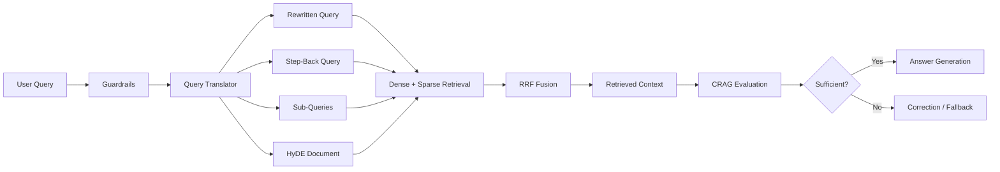
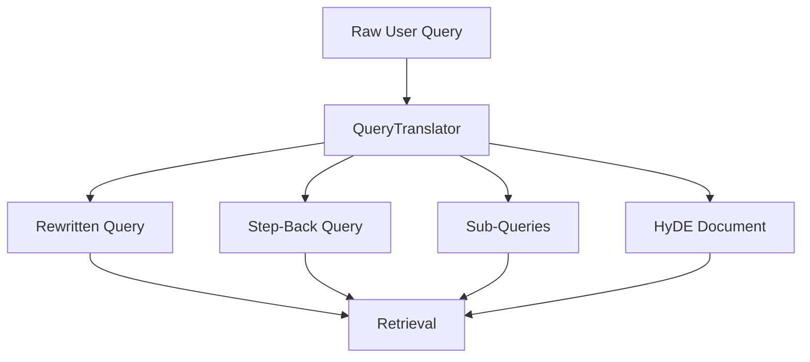
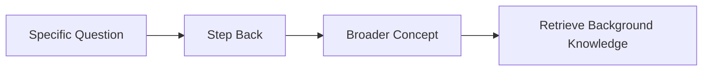
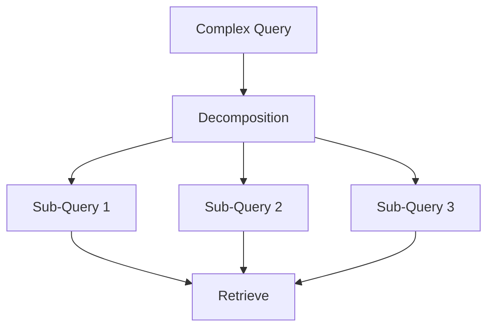
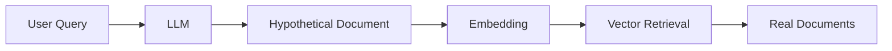
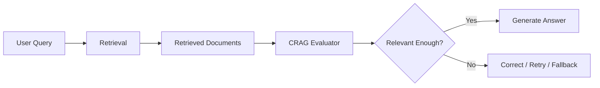
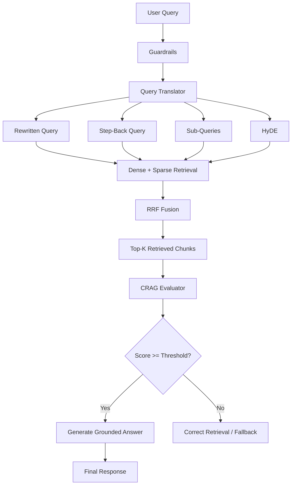
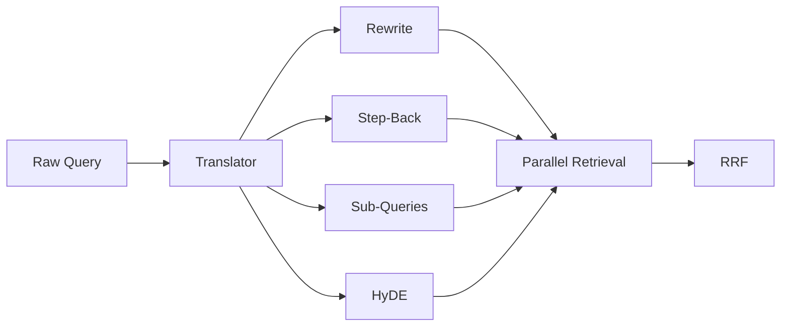

# Chapter 2 — Pre-Retrieval Query Transformations & Corrective RAG (CRAG)

## 1. Chapter Goal

The goal of this chapter is to build the **Pre-Retrieval Query Transformation subsystem** and the **Corrective RAG (CRAG) evaluator** inside `src/rag/`.

We will build:

* `src/rag/QueryTranslator.js`
* `src/rag/CRAG.js`

A basic RAG system often sends the user's original query directly to the retriever:

```text
User Query → Vector Search → Documents
```

This works for simple questions, but real-world queries are often:

* conversational,
* ambiguous,
* too broad,
* missing important domain keywords,
* composed of multiple questions,
* or difficult to match directly against stored documents.

To improve retrieval quality, we transform the original query into multiple retrieval representations.

This chapter implements four techniques:

1. **Query Rewriting**
2. **Step-Back Prompting**
3. **Sub-Query Decomposition**
4. **HyDE — Hypothetical Document Embeddings**

After retrieval, **Corrective RAG (CRAG)** evaluates whether the retrieved context is sufficiently relevant to answer the user's question.

---

## 2. Where This Fits in the RAG Pipeline

The previous chapter built:

* Document storage
* Dense retrieval
* Sparse retrieval
* Reciprocal Rank Fusion (RRF)
* Basic guardrails

This chapter adds intelligence **before and after retrieval**.



The important idea is:

> **Query transformation improves retrieval; CRAG verifies retrieval quality before generation.**

---

# 3. Expected Project Structure

After completing this chapter:

```text
rag+memory/
└── src/
    ├── config.js
    │
    ├── utils/
    │   ├── embeddings.js
    │   └── llm.js
    │
    └── rag/
        ├── DocumentStore.js
        ├── HybridRanker.js
        ├── Guardrails.js
        ├── QueryTranslator.js
        └── CRAG.js
```

---

# 4. Query Transformation

## 4.1 Why Transform the Query?

Consider this user question:

```text
"Hey, I was reading about vLLM yesterday. Can you explain how it handles the KV cache and why that makes inference faster?"
```

The raw query contains conversational information that may not be useful for retrieval.

A better retrieval representation could be:

```text
vLLM KV cache management inference performance PagedAttention
```

But rewriting is only one possible improvement.

Different transformations solve different retrieval problems.

| Technique       | Purpose                                                     |
| --------------- | ----------------------------------------------------------- |
| Query Rewriting | Make the query concise and retrieval-friendly               |
| Step-Back       | Retrieve broader conceptual knowledge                       |
| Sub-Queries     | Break complex questions into independent retrieval tasks    |
| HyDE            | Create hypothetical answer-like text for semantic retrieval |

---

# 5. QueryTranslator.js

## File Path

```text
src/rag/QueryTranslator.js
```

## Responsibility

`QueryTranslator` converts one raw user query into multiple optimized search representations.



---

## 5.1 Implementation

```javascript
import { generateJSON } from "../utils/llm.js";

/**
 * QueryTranslator.js
 *
 * Pre-retrieval query transformation engine.
 *
 * Techniques:
 * 1. Query Rewriting
 * 2. Step-Back Prompting
 * 3. Sub-Query Decomposition
 * 4. HyDE
 */
export class QueryTranslator {
  /**
   * Translate one user query into multiple
   * retrieval-friendly representations.
   */
  async translateQuery(rawQuery) {
    if (typeof rawQuery !== "string" || !rawQuery.trim()) {
      throw new Error("rawQuery must be a non-empty string");
    }

    const systemPrompt = `
You are an expert Query Translator LLM for a production RAG system.

Given a user query, return a JSON object with exactly these fields:

{
  "rewritten": "A clean, concise, keyword-rich search query.",
  "stepBack": "A broader conceptual or background question.",
  "subQueries": [
    "A focused sub-question.",
    "Another focused sub-question."
  ],
  "hydeDocument": "A hypothetical paragraph that could answer the query."
}

Rules:
- Keep rewritten concise and retrieval-friendly.
- Step-back should focus on the broader concept.
- Produce 2 distinct sub-queries when possible.
- HyDE should resemble a relevant knowledge-base passage.
`;

    const userPrompt = `User Query: "${rawQuery.trim()}"`;

    try {
      const translated = await generateJSON(
        systemPrompt,
        userPrompt
      );

      return {
        original: rawQuery,

        rewritten:
          typeof translated?.rewritten === "string" &&
          translated.rewritten.trim()
            ? translated.rewritten.trim()
            : rawQuery,

        stepBack:
          typeof translated?.stepBack === "string" &&
          translated.stepBack.trim()
            ? translated.stepBack.trim()
            : rawQuery,

        subQueries:
          Array.isArray(translated?.subQueries) &&
          translated.subQueries.length > 0
            ? translated.subQueries.filter(
                (query) =>
                  typeof query === "string" && query.trim()
              )
            : [rawQuery],

        hydeDocument:
          typeof translated?.hydeDocument === "string" &&
          translated.hydeDocument.trim()
            ? translated.hydeDocument.trim()
            : rawQuery,
      };
    } catch (err) {
      console.warn(
        `[QueryTranslator Warning] Translation failed: ${err.message}`
      );

      return {
        original: rawQuery,
        rewritten: rawQuery,
        stepBack: rawQuery,
        subQueries: [rawQuery],
        hydeDocument: rawQuery,
      };
    }
  }
}
```

---

# 6. Understanding the QueryTranslator

The implementation has four important stages.

## 6.1 Input Validation

```javascript
if (typeof rawQuery !== "string" || !rawQuery.trim()) {
  throw new Error("rawQuery must be a non-empty string");
}
```

The translator expects a real user query.

Without validation, values such as:

```javascript
null
undefined
{}
""
```

could reach the LLM prompt and cause unexpected behavior.

---

# 7. Query Rewriting

Query rewriting converts conversational language into a cleaner retrieval query.

### Example

Original:

```text
"Can you tell me why vLLM is faster when serving lots of users?"
```

Rewritten:

```text
vLLM high concurrency inference performance
```

The rewritten version contains stronger retrieval keywords.

### Purpose

Query rewriting is particularly useful when the user:

* uses unnecessary conversational language,
* uses pronouns,
* asks vague questions,
* uses incomplete terminology,
* or describes a concept indirectly.

---

# 8. Step-Back Prompting

Step-back querying moves from a specific question toward a broader concept.

Suppose the user asks:

```text
Why does PagedAttention improve vLLM memory efficiency?
```

A step-back query could be:

```text
How does memory management work during large language model inference?
```

This gives the retriever an opportunity to find foundational documents that may not mention the exact wording of the original question.



### When Step-Back Helps

It is useful when answering a question requires understanding:

* background concepts,
* underlying architecture,
* definitions,
* system design principles,
* or related foundational knowledge.

---

# 9. Sub-Query Decomposition

Some questions actually contain multiple questions.

For example:

```text
How does vLLM manage KV cache, how does PagedAttention work,
and why does this improve throughput?
```

Instead of searching this entire question as one unit, we can split it:

```text
1. How does vLLM manage KV cache?

2. How does PagedAttention manage KV cache memory?

3. Why does PagedAttention improve inference throughput?
```



### Why This Helps

Different parts of a complex question may correspond to completely different documents.

Sub-query decomposition allows the retriever to search for each aspect independently.

---

# 10. HyDE — Hypothetical Document Generation

HyDE stands for:

**Hypothetical Document Embeddings**

Instead of embedding only the user's question, the system first asks the LLM to generate a hypothetical answer or knowledge-base passage.

For example:

### User Query

```text
How does vLLM use PagedAttention?
```

### HyDE Document

```text
vLLM uses PagedAttention to manage the KV cache as
non-contiguous memory blocks, allowing more efficient
memory utilization during large-scale language model
inference.
```

The hypothetical document can then be embedded and used for semantic retrieval.



The key idea is that a hypothetical answer can sometimes be **semantically closer to the knowledge-base documents** than the original question.

> HyDE generates a hypothetical passage for retrieval; it does not mean the hypothetical passage should automatically be treated as factual evidence.

---

# 11. Corrective RAG — CRAG

Query transformation improves retrieval, but retrieval can still fail.

For example:

```text
User Query
     ↓
Retrieval
     ↓
Irrelevant Documents
```

If the LLM receives those documents and blindly generates an answer, the system may produce an unsupported response.

CRAG introduces an evaluation step:



CRAG asks:

> **Are the retrieved documents relevant and sufficient to answer the user's question?**

---

# 12. CRAG.js

## File Path

```text
src/rag/CRAG.js
```

## Responsibility

`CRAG` evaluates retrieved chunks and produces:

* a numerical score,
* a sufficiency decision,
* reasoning explaining the evaluation.

---

## 12.1 Implementation

```javascript
import { generateJSON } from "../utils/llm.js";

/**
 * CRAG.js
 *
 * Corrective RAG evaluator.
 *
 * Evaluates whether retrieved document chunks
 * contain sufficient relevant information for
 * answering the user's query.
 */
export class CRAG {
  /**
   * Evaluate retrieved context against the query.
   *
   * @param {string} query
   * @param {Array} retrievedChunks
   * @param {number} threshold
   */
  async evaluateContext(
    query,
    retrievedChunks,
    threshold = 6.0
  ) {
    if (typeof query !== "string" || !query.trim()) {
      throw new Error("query must be a non-empty string");
    }

    if (!Number.isFinite(threshold) || threshold < 0 || threshold > 10) {
      throw new Error("threshold must be between 0 and 10");
    }

    if (
      !Array.isArray(retrievedChunks) ||
      retrievedChunks.length === 0
    ) {
      return {
        score: 0,
        isSufficient: false,
        reasoning: "No documents retrieved.",
      };
    }

    const contextText = retrievedChunks
      .map(
        (chunk) =>
          `- ${chunk.title || "Untitled"}: ${
            chunk.content || ""
          }`
      )
      .join("\n");

    const systemPrompt = `
You are a CRAG Evaluator for an Advanced RAG system.

Evaluate whether the retrieved context is relevant and
sufficient to answer the user's query.

Return JSON:

{
  "score": number between 0 and 10,
  "reasoning": "concise explanation"
}

Scoring guidance:
0-2   = completely irrelevant
3-4   = mostly irrelevant
5-6   = partially useful
7-8   = relevant and mostly sufficient
9-10  = highly relevant and sufficient
`;

    const userPrompt = `
User Query:
"${query}"

Retrieved Context:
${contextText}
`;

    try {
      const evalResult = await generateJSON(
        systemPrompt,
        userPrompt
      );

      let score =
        typeof evalResult?.score === "number"
          ? evalResult.score
          : 0;

      // Keep score within the expected range.
      score = Math.max(0, Math.min(10, score));

      return {
        score,
        isSufficient: score >= threshold,
        reasoning:
          typeof evalResult?.reasoning === "string"
            ? evalResult.reasoning
            : "No reasoning provided.",
      };
    } catch (err) {
      console.warn(
        `[CRAG Warning] Evaluation failed: ${err.message}`
      );

      return {
        score: 0,
        isSufficient: false,
        reasoning:
          "CRAG evaluation failed; retrieval should be treated as insufficient.",
      };
    }
  }
}
```

---

# 13. Understanding CRAG Evaluation

## 13.1 Empty Retrieval

If nothing was retrieved:

```javascript
if (
  !Array.isArray(retrievedChunks) ||
  retrievedChunks.length === 0
)
```

the system immediately returns:

```javascript
{
  score: 0,
  isSufficient: false,
  reasoning: "No documents retrieved."
}
```

This prevents the system from treating an empty context as valid evidence.

---

# 14. CRAG Score

The evaluator produces a score between:

```text
0 → 10
```

A simple interpretation:

| Score | Interpretation                 |
| ----: | ------------------------------ |
|   0–2 | Completely irrelevant          |
|   3–4 | Mostly irrelevant              |
|   5–6 | Partially useful               |
|   7–8 | Relevant / mostly sufficient   |
|  9–10 | Highly relevant and sufficient |

The actual acceptance threshold comes from the caller or configuration.

For example:

```javascript
threshold = 6.0
```

means:

```text
score >= 6.0 → sufficient
score < 6.0  → insufficient
```

If you want a stricter system, you can configure:

```text
CRAG_THRESHOLD=6.5
```

or:

```text
CRAG_THRESHOLD=7.0
```

The important point is to keep the threshold **configurable rather than hard-coded in multiple files**.

---

# 15. Why CRAG Should Not Blindly "Pass" on Errors

A common implementation pattern is:

```javascript
catch {
  return {
    score: 7.5,
    isSufficient: true
  };
}
```

This is dangerous in a production RAG system.

If the evaluator fails because:

* the API is unavailable,
* the model times out,
* the response is malformed,
* authentication fails,

the system would incorrectly assume that the retrieved context is good.

This creates a **fail-open retrieval path**.

The implementation in this chapter instead treats evaluation failure as:

```text
Evaluation Failure
       ↓
score = 0
       ↓
isSufficient = false
```

This is a safer default when CRAG is intended as a grounding gate.

---

# 16. Complete Retrieval + CRAG Flow

After Chapters 1 and 2, the conceptual pipeline becomes:



This creates a more robust retrieval architecture:

```text
Transform → Retrieve → Fuse → Evaluate → Generate
```

---

# 17. Verification & Testing

## 17.1 Verify QueryTranslator

Use the following command:

```bash
node --input-type=module -e "
import { QueryTranslator } from './src/rag/QueryTranslator.js';

const translator = new QueryTranslator();

const result = await translator.translateQuery(
  'How does vLLM handle KV cache?'
);

console.log('Original:', result.original);
console.log('Rewritten:', result.rewritten);
console.log('Step Back:', result.stepBack);
console.log('Sub Queries:', result.subQueries);
console.log('HyDE:', result.hydeDocument);
"
```

Using `--input-type=module` makes the one-off command explicitly run as an ES module.

---

## 17.2 Expected Structure

With the offline/mock LLM from Chapter 0, the exact text may vary depending on the mock response implementation.

The important thing is that the result has this structure:

```text
Original: How does vLLM handle KV cache?
Rewritten: ...
Step Back: ...
Sub Queries: [...]
HyDE: ...
```

The exact generated wording should **not** be treated as a fixed expected output.

---

# 18. Verify CRAG

Create a small test using a retrieved chunk:

```bash
node --input-type=module -e "
import { CRAG } from './src/rag/CRAG.js';

const crag = new CRAG();

const chunks = [
  {
    title: 'vLLM Engine',
    content:
      'vLLM uses PagedAttention to efficiently manage KV cache memory during LLM inference.'
  }
];

const result = await crag.evaluateContext(
  'How does vLLM manage KV cache?',
  chunks,
  6.0
);

console.log('CRAG Score:', result.score);
console.log('Sufficient:', result.isSufficient);
console.log('Reasoning:', result.reasoning);
"
```

Expected output should have the following shape:

```text
CRAG Score: <number between 0 and 10>
Sufficient: <true or false>
Reasoning: <evaluation explanation>
```

Because the evaluator is LLM-based, the exact score should not be hard-coded into your tests.

---

# 19. Common Mistakes

## Mistake 1 — Treating HyDE as Ground Truth

HyDE produces a hypothetical document.

It is only a **retrieval aid**.

Do not directly cite the generated HyDE text as evidence.

```text
HyDE
 ↓
Embedding
 ↓
Search
 ↓
Real Documents
 ↓
Evidence
```

---

## Mistake 2 — Hard-Coding Different CRAG Thresholds

Avoid having:

```text
Query pipeline → 6.5
CRAG.js        → 6.0
config.js      → 6.0
```

This creates inconsistent behavior.

Prefer one configuration source:

```javascript
config.rag.cragThreshold
```

Then pass that value into CRAG.

---

## Mistake 3 — Assuming Query Transformation Always Improves Retrieval

More queries do not automatically mean better retrieval.

Generating too many:

* increases latency,
* increases embedding/search cost,
* may retrieve noisy documents,
* makes RRF harder to interpret.

Start with the four representations in this chapter, then measure whether each one actually improves retrieval quality.

---

## Mistake 4 — Treating CRAG as a Perfect Truth Detector

CRAG is itself an LLM-based evaluator.

It can make mistakes.

Therefore:

```text
CRAG Score ≠ Ground Truth
```

It should be treated as a **quality-control signal**, not an absolute proof that an answer is correct.

---

## Mistake 5 — Using Evaluation Failure as a Successful Retrieval

Avoid:

```javascript
catch {
  return {
    score: 8,
    isSufficient: true
  };
}
```

If evaluation fails, the safer default is to make the system aware that grounding could not be verified.

---

# 20. Production Considerations

The implementation in this chapter is intentionally lightweight, but a production system should consider the following.

### 20.1 Cost

Four transformations can require additional LLM calls or processing.

A production system may selectively enable transformations depending on query complexity.

For example:

```text
Simple Query
    ↓
Rewrite only

Complex Query
    ↓
Rewrite + Sub-Queries + Step-Back

Semantic / Difficult Query
    ↓
Rewrite + HyDE + Step-Back
```

---

### 20.2 Latency

Query transformation adds latency before retrieval.

Possible optimization:



Independent retrieval operations can potentially execute concurrently.

---

### 20.3 Query Limits

Sub-query generation should have limits.

For example:

```text
Maximum sub-queries = 3–5
```

Otherwise a single user question can trigger a large number of retrieval operations.

---

### 20.4 Prompt Injection

Query transformation sends user-controlled content to an LLM.

Therefore, the guardrails from Chapter 1 should remain before the transformation stage:

```text
Raw Query
    ↓
Guardrails
    ↓
QueryTranslator
```

Do not assume that query rewriting itself provides security.

---

# 21. Chapter Summary

In this chapter, we added two important components to the RAG architecture.

### QueryTranslator

Transforms:

```text
One Raw Query
```

into:

```text
Rewritten Query
Step-Back Query
Sub-Queries
HyDE Document
```

This improves the chances of finding relevant information during retrieval.

### CRAG

Evaluates:

```text
Retrieved Documents
```

and produces:

```text
Score
Sufficiency Decision
Reasoning
```

The complete retrieval strategy is now:

```text
User Query
    ↓
Guardrails
    ↓
Query Transformation
    ↓
Multiple Retrieval Representations
    ↓
Dense + Sparse Search
    ↓
RRF Fusion
    ↓
CRAG Evaluation
    ↓
Grounded Generation
```

---

# 22. Chapter Checklist

Before moving forward, verify that you understand:

* [ ] Why raw queries can produce poor retrieval
* [ ] What query rewriting does
* [ ] What Step-Back prompting does
* [ ] Why complex queries can be decomposed
* [ ] What HyDE is
* [ ] Why HyDE should not be treated as evidence
* [ ] What CRAG evaluates
* [ ] How the CRAG score works
* [ ] Why the threshold should be configurable
* [ ] Why CRAG failures should not automatically pass
* [ ] How query transformation connects with RRF
* [ ] How CRAG fits before answer generation

---

# 23. Next Chapter

With the RAG retrieval pipeline now capable of:

* document indexing,
* dense retrieval,
* sparse retrieval,
* RRF fusion,
* query transformation,
* HyDE,
* and CRAG evaluation,

the next major component is **Agent Memory**.

### Chapter 3 — Agent Memory Framework

We will build:

```text
Short-Term Memory
        +
Long-Term Memory
        +
Memory Retrieval
        +
Memory Injection
```

This will allow the agent to remember relevant information across turns instead of treating every user message as an isolated request.

