Your Chapter 3 is a good foundation. I’d make a few important corrections before treating it as the polished version:

* `storeFact()` in the verification code does not exist; the class exposes `addFact()`.
* The verification should use `--input-type=module` for a reliable one-off ESM command.
* STM should validate `maxTurns`, `sessionId`, and message content.
* `limit || maxTurns` treats `0` as the default; explicit validation is cleaner.
* LTM `hitCount` currently starts at `1` when a fact is created, even though it has not necessarily been retrieved yet. I’d define this clearly as an initial creation/access score or start at `0`.
* `addFact()` duplicate detection is exact-text based, not semantic deduplication.
* LTM currently has episodic storage but no episodic retrieval method yet.
* Memory eviction should eventually consider `hitCount`, recency, and perhaps similarity—not just explicit IDs.
* As with Chapter 0/1, embedding dimensions must remain consistent.

Here is the polished chapter in the same documentation style.

# Chapter 3 — Agent Memory Architecture: STM Buffer & LTM Vector Store

## 1. Chapter Goal

The goal of this chapter is to build the **Agent Memory subsystem** inside `src/memory/`.

We will implement two complementary memory systems:

1. **Short-Term Memory (STM)** — maintains recent conversation turns within the current session.
2. **Long-Term Memory (LTM)** — stores persistent user facts and experiences that can be retrieved semantically across conversations.

A stateless LLM API generally treats every request independently:

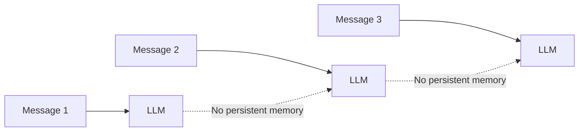

An intelligent agent needs a memory layer that can preserve useful information.

We therefore separate memory into two levels:

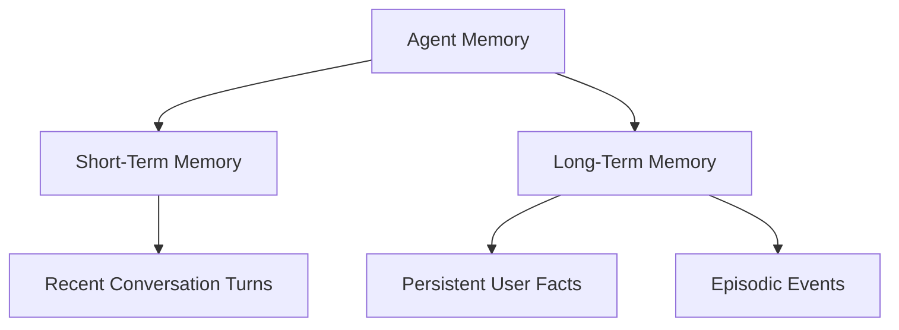

### Short-Term Memory

STM answers:

> **What have we been talking about recently?**

Examples:

```text
User: What is RAG?
Assistant: RAG combines retrieval with generation.

User: What about embeddings?
Assistant: Embeddings convert text into vectors.
```

The second question depends on the previous turn.

STM keeps this recent context available.

---

### Long-Term Memory

LTM answers:

> **What useful information do we know about this user or their previous experiences?**

Examples:

```text
User prefers TypeScript.
User is building a RAG application.
User prefers React Native.
User is interested in GenAI.
```

These facts can remain useful long after the current conversation ends.

---

## 🎯 Expected Outcome

After this chapter, the agent will have:

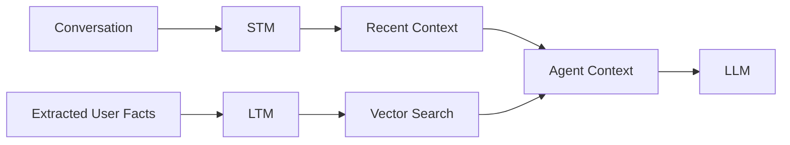

The system can therefore combine:

```text
Recent conversation
        +
Relevant long-term memories
        ↓
     Agent Context
```

---

# 2. Project Structure

After completing this chapter:

```text id="6qj9te"
rag+memory/
└── src/
    ├── config.js
    │
    ├── utils/
    │   ├── embeddings.js
    │   └── llm.js
    │
    ├── rag/
    │   ├── DocumentStore.js
    │   ├── HybridRanker.js
    │   ├── Guardrails.js
    │   ├── QueryTranslator.js
    │   └── CRAG.js
    │
    └── memory/
        ├── ShortTermMemory.js
        └── LongTermMemory.js
```

---

# 3. Short-Term Memory

## File Path

```text id="2gq8hp"
src/memory/ShortTermMemory.js
```

## Responsibility

`ShortTermMemory` maintains the most recent messages for each conversation session.

The implementation uses a **sliding window**.

For example, with:

```javascript id="w6l3pk"
maxTurns = 3
```

the memory behaves like:

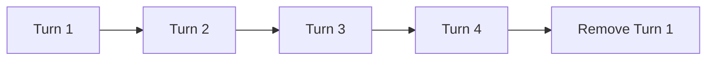

The buffer always keeps the latest N messages.

---

# 4. Why Sliding Window Memory?

Sending the entire conversation history to an LLM has several problems:

* increasing token usage,
* increasing latency,
* increasing cost,
* unnecessary historical context,
* larger prompt size.

Instead of keeping everything in STM:

```text id="m9x3cz"
Turn 1
Turn 2
Turn 3
Turn 4
Turn 5
Turn 6
...
Turn 100
```

we keep only the most recent window:

```text id="b6s4nf"
Turn 95
Turn 96
Turn 97
Turn 98
Turn 99
Turn 100
```

Longer-term information should eventually be promoted to LTM.

---

# 5. ShortTermMemory.js Implementation

```javascript id="q7c2mv"
export class ShortTermMemory {
  constructor(maxTurns = 6) {
    if (!Number.isInteger(maxTurns) || maxTurns <= 0) {
      throw new Error("maxTurns must be a positive integer");
    }

    this.maxTurns = maxTurns;

    // sessionId -> Array of messages
    this.sessions = new Map();
  }

  /**
   * Add a message to a session's short-term memory.
   */
  async addMessage(sessionId, role, content) {
    if (!sessionId) {
      throw new Error("sessionId is required");
    }

    if (!role) {
      throw new Error("role is required");
    }

    if (typeof content !== "string" || !content.trim()) {
      throw new Error("content must be a non-empty string");
    }

    if (!this.sessions.has(sessionId)) {
      this.sessions.set(sessionId, []);
    }

    const history = this.sessions.get(sessionId);

    history.push({
      role,
      content,
      timestamp: new Date().toISOString(),
    });

    // Keep only the most recent messages.
    if (history.length > this.maxTurns) {
      this.sessions.set(
        sessionId,
        history.slice(-this.maxTurns)
      );
    }
  }

  /**
   * Retrieve recent conversation history.
   */
  async getRecentWindow(sessionId, limit = null) {
    const history = this.sessions.get(sessionId) || [];

    const fetchLimit =
      limit === null
        ? this.maxTurns
        : Math.max(0, Math.min(limit, this.maxTurns));

    return history.slice(-fetchLimit);
  }

  /**
   * Remove all messages for a session.
   */
  async clearSession(sessionId) {
    this.sessions.delete(sessionId);
  }
}
```

---

# 6. Understanding STM

## 6.1 Session Map

The constructor creates:

```javascript id="v8n3pa"
this.sessions = new Map();
```

The map associates each session with its conversation history.

Conceptually:

```text id="c9h5yp"
sessions
│
├── session-001
│   ├── user message
│   ├── assistant message
│   └── user message
│
└── session-002
    ├── user message
    └── assistant message
```

This allows multiple conversations to exist independently.

---

# 7. Adding a Message

When a message arrives:

```javascript id="k3q8zx"
await stm.addMessage(
  "session-001",
  "user",
  "What is RAG?"
);
```

the message becomes:

```javascript id="w0d6mb"
{
  role: "user",
  content: "What is RAG?",
  timestamp: "..."
}
```

The timestamp allows the system to know when the message was created.

---

# 8. Sliding Window Enforcement

Suppose:

```javascript id="f1y9rx"
const stm = new ShortTermMemory(3);
```

and we add five messages:

```text id="8n5qkg"
Message 1
Message 2
Message 3
Message 4
Message 5
```

STM keeps:

```text id="b7v4dj"
Message 3
Message 4
Message 5
```

This happens through:

```javascript id="g5e1sw"
history.slice(-this.maxTurns)
```

The negative index means:

> Take the last `maxTurns` messages.

---

# 9. Retrieving Recent Context

```javascript id="x2p8qa"
const history = await stm.getRecentWindow(
  "session-001"
);
```

returns the recent messages for that session.

You can also request a smaller window:

```javascript id="a7m2fd"
const history = await stm.getRecentWindow(
  "session-001",
  3
);
```

This allows the agent to control how much conversational context is injected into the LLM prompt.

---

# 10. Long-Term Memory

## File Path

```text id="z9c2wk"
src/memory/LongTermMemory.js
```

Long-Term Memory stores information that should survive beyond the immediate conversation.

We will maintain two categories:

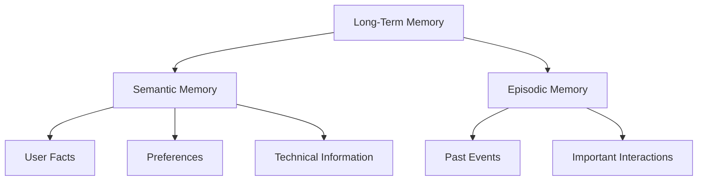

### Semantic Memory

Stores facts such as:

```text
User prefers Python.
User is learning React Native.
User is building a RAG system.
```

### Episodic Memory

Stores events or experiences:

```text
User completed the RAG project.
User asked about deploying Qdrant.
User created a React Native application.
```

Semantic memory is about **what is known**.

Episodic memory is about **what happened**.

---

# 11. Why Vector Search?

A traditional database can search exact values:

```text
WHERE fact = "User prefers Python"
```

But an agent needs semantic retrieval.

Suppose LTM contains:

```text
User prefers Python for data science.
```

and the current query is:

```text
Which programming language does the user prefer for ML work?
```

The wording is different, but the meaning is similar.

Vector embeddings allow us to compare the semantic representation of both texts.

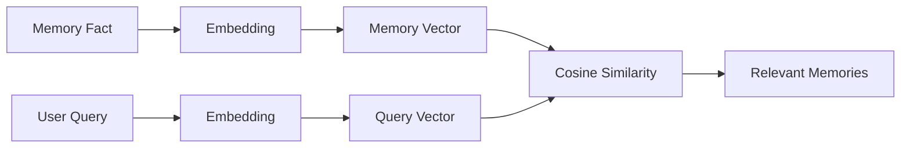

---

# 12. LongTermMemory.js Implementation

```javascript id="p6y2kr"
import {
  getEmbedding,
  cosineSimilarity,
} from "../utils/embeddings.js";

/**
 * LongTermMemory.js
 *
 * Stores:
 * - Semantic user facts
 * - Episodic interaction events
 *
 * Semantic memories are searchable using vector similarity.
 */
export class LongTermMemory {
  constructor() {
    this.semanticMemory = [];

    this.episodicMemory = [];
  }

  /**
   * Store a semantic fact in long-term memory.
   */
  async addFact(
    userId,
    factText,
    category = "general"
  ) {
    if (!userId) {
      throw new Error("userId is required");
    }

    if (
      typeof factText !== "string" ||
      !factText.trim()
    ) {
      throw new Error(
        "factText must be a non-empty string"
      );
    }

    const normalizedFact = factText.trim();

    // Prevent exact duplicate facts for the same user.
    const existing = this.semanticMemory.find(
      (item) =>
        item.userId === userId &&
        item.fact.toLowerCase() ===
          normalizedFact.toLowerCase()
    );

    if (existing) {
      existing.hitCount += 1;
      existing.lastAccessedAt =
        new Date().toISOString();

      return existing;
    }

    const vector = await getEmbedding(normalizedFact);

    const now = new Date().toISOString();

    const newRecord = {
      id: `fact_${Date.now()}_${Math.random()
        .toString(36)
        .substring(2, 6)}`,

      userId,

      fact: normalizedFact,

      category,

      vector,

      createdAt: now,

      hitCount: 1,

      lastAccessedAt: now,
    };

    this.semanticMemory.push(newRecord);

    return newRecord;
  }

  /**
   * Store an episodic event.
   */
  async addEpisodicEvent(userId, eventText) {
    if (!userId) {
      throw new Error("userId is required");
    }

    if (
      typeof eventText !== "string" ||
      !eventText.trim()
    ) {
      throw new Error(
        "eventText must be a non-empty string"
      );
    }

    const normalizedEvent = eventText.trim();

    const vector = await getEmbedding(normalizedEvent);

    const eventRecord = {
      id: `ep_${Date.now()}_${Math.random()
        .toString(36)
        .substring(2, 6)}`,

      userId,

      event: normalizedEvent,

      timestamp: new Date().toISOString(),

      vector,
    };

    this.episodicMemory.push(eventRecord);

    return eventRecord;
  }

  /**
   * Search semantic memories relevant to a query.
   */
  async searchRelevantFacts(
    userId,
    query,
    topK = 3
  ) {
    if (!userId) {
      throw new Error("userId is required");
    }

    if (
      typeof query !== "string" ||
      !query.trim()
    ) {
      throw new Error(
        "query must be a non-empty string"
      );
    }

    if (!Number.isInteger(topK) || topK <= 0) {
      throw new Error(
        "topK must be a positive integer"
      );
    }

    const userFacts = this.semanticMemory.filter(
      (fact) => fact.userId === userId
    );

    if (userFacts.length === 0) {
      return [];
    }

    const queryVector = await getEmbedding(query);

    const scored = userFacts.map((item) => {
      const similarity = cosineSimilarity(
        queryVector,
        item.vector
      );

      return {
        ...item,
        score: similarity,
      };
    });

    scored.sort(
      (a, b) => b.score - a.score
    );

    const results = scored.slice(0, topK);

    // Update memory access statistics.
    const now = new Date().toISOString();

    results.forEach((result) => {
      const original = this.semanticMemory.find(
        (fact) => fact.id === result.id
      );

      if (original) {
        original.hitCount += 1;
        original.lastAccessedAt = now;
      }
    });

    return results;
  }

  /**
   * Remove semantic memories by ID.
   */
  evictFacts(factIds) {
    if (!Array.isArray(factIds)) {
      throw new Error("factIds must be an array");
    }

    const initialCount =
      this.semanticMemory.length;

    this.semanticMemory =
      this.semanticMemory.filter(
        (fact) => !factIds.includes(fact.id)
      );

    return (
      initialCount -
      this.semanticMemory.length
    );
  }
}
```

---

# 13. Understanding Semantic Memory

Each semantic memory record looks conceptually like:

```javascript id="j3q9cx"
{
  id: "fact_...",
  userId: "user-123",
  fact: "User prefers Python",
  category: "preference",
  vector: [...],
  createdAt: "...",
  hitCount: 3,
  lastAccessedAt: "..."
}
```

The important fields are:

| Field            | Purpose                    |
| ---------------- | -------------------------- |
| `id`             | Unique memory identifier   |
| `userId`         | Owner of the memory        |
| `fact`           | Human-readable memory      |
| `category`       | Memory classification      |
| `vector`         | Semantic embedding         |
| `createdAt`      | Creation timestamp         |
| `hitCount`       | Number of memory accesses  |
| `lastAccessedAt` | Most recent retrieval time |

---

# 14. Memory Categories

The `category` field allows memories to be classified.

Examples:

```text id="c5n7ya"
preference
fact
personal
technical
general
```

For example:

```javascript id="r2j6vb"
await ltm.addFact(
  "user-1",
  "User prefers TypeScript",
  "preference"
);
```

Another:

```javascript id="h8q4md"
await ltm.addFact(
  "user-1",
  "User is building a RAG application",
  "technical"
);
```

Categories become useful later when the memory system needs to:

* filter memories,
* prioritize certain memory types,
* apply different decay policies,
* or control what information is injected into the prompt.

---

# 15. Duplicate Fact Detection

Before creating a new memory, the implementation checks whether the same user already has the exact fact:

```javascript id="q4x8ks"
item.userId === userId &&
item.fact.toLowerCase() ===
  normalizedFact.toLowerCase()
```

This prevents simple duplicates such as:

```text
User prefers Python.
user prefers python.
USER PREFERS PYTHON.
```

from creating multiple records.

However, this is **exact-text deduplication**, not semantic deduplication.

These two facts are still considered different:

```text
User prefers Python.
User likes using Python for programming.
```

A future memory layer can use embedding similarity or an LLM-based memory consolidation step to identify semantically equivalent memories.

---

# 16. Episodic Memory

The second LTM collection is:

```javascript id="x9v3fz"
this.episodicMemory = [];
```

It stores events rather than persistent facts.

For example:

```javascript id="m6q2ka"
await ltm.addEpisodicEvent(
  "user-1",
  "User completed the RAG project."
);
```

The record contains:

```text id="k8d1zr"
id
userId
event
timestamp
vector
```

The vector is stored now so that a future chapter can implement semantic retrieval over episodic events as well.

---

# 17. Semantic LTM Search

When the agent receives:

```text id="u3y7cn"
"What programming language does the user prefer?"
```

the memory system:

1. Converts the query into an embedding.
2. Finds memories belonging to the user.
3. Calculates cosine similarity.
4. Sorts memories by similarity.
5. Returns the top K.
6. Updates access statistics.

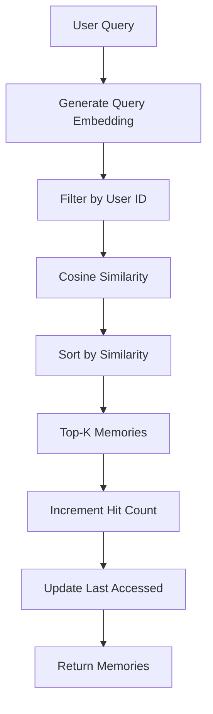

---

# 18. Hit Count Tracking

Every retrieved memory gets:

```javascript id="p8s5mv"
original.hitCount += 1;
```

and:

```javascript id="w2n9kd"
original.lastAccessedAt =
  new Date().toISOString();
```

This creates two useful memory signals:

### Hit Count

How often has this memory been retrieved?

```text id="r6q3ta"
Python preference → 25 hits
React Native preference → 12 hits
Old project detail → 1 hit
```

### Last Accessed

When was this memory last useful?

```text id="z4m7bx"
Python preference → recently accessed
Old project detail → accessed 8 months ago
```

Together, these metrics can later support memory decay and eviction.

---

# 19. Memory Decay Concept

Memory should not necessarily remain equally important forever.

A future eviction policy could combine:

```text id="e8x4ws"
Importance
   +
Hit Count
   +
Recency
   +
Semantic Relevance
```

Conceptually:

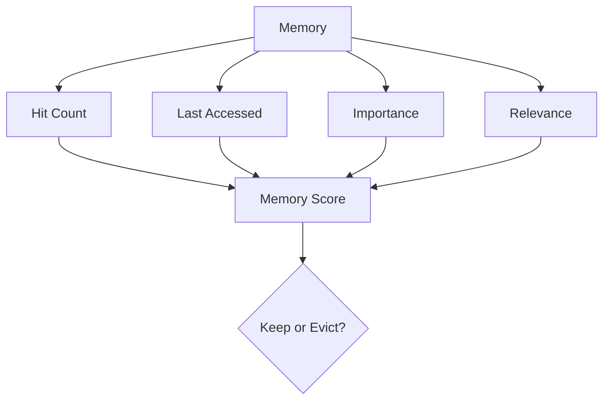

For example, a memory with:

```text
high hit count
+
recent access
+
high importance
```

should generally be retained.

A memory with:

```text
low hit count
+
very old access
+
low importance
```

could eventually be removed.

The current chapter only tracks the required metrics; the actual decay policy will be implemented later.

---

# 20. STM vs LTM

The two systems solve different problems.

| Feature      | STM                    | LTM                    |
| ------------ | ---------------------- | ---------------------- |
| Scope        | Current session        | Persistent user memory |
| Data         | Conversation messages  | Facts/events           |
| Retrieval    | Recent window          | Semantic similarity    |
| Storage      | In-memory buffer       | Vector-backed memory   |
| Main goal    | Conversation coherence | Personalization        |
| Typical size | Small                  | Potentially large      |
| Eviction     | Sliding window         | Decay / eviction       |

A useful mental model is:

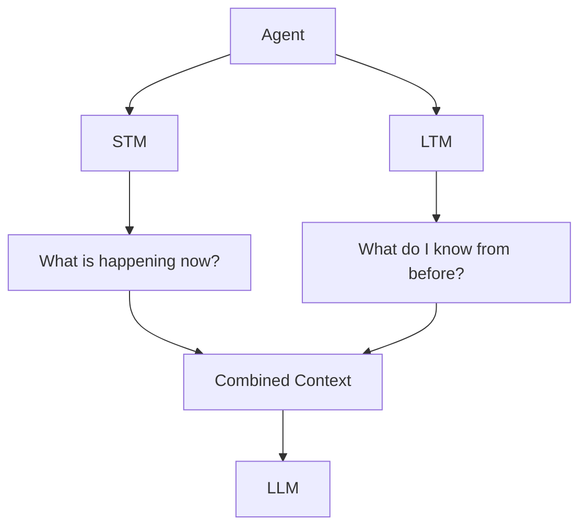

---

# 21. Important Implementation Detail: Embedding Dimensions

LTM relies on:

```javascript id="s4j8qm"
getEmbedding()
```

for both facts and queries.

Therefore, the vector dimensions must always match.

For example:

```text id="b9x2vf"
Fact Vector      → 1536 dimensions
Query Vector     → 1536 dimensions
```

must be consistent.

A mismatch such as:

```text id="m1q7cz"
Fact Vector      → 1536
Query Vector     → 16
```

will make similarity calculations invalid or meaningless.

This is especially important because Chapter 0 contains an offline mock embedding fallback.

For a production deployment, configure a consistent embedding model/dimension across:

* document embeddings,
* query embeddings,
* semantic memories,
* episodic memories.

---

# 22. Verification & Testing

## 22.1 Test Short-Term Memory

Run:

```bash id="v7n3px"
node --input-type=module -e "
import { ShortTermMemory } from './src/memory/ShortTermMemory.js';

const stm = new ShortTermMemory(2);

await stm.addMessage('s1', 'user', 'Hello');
await stm.addMessage('s1', 'assistant', 'Hi!');
await stm.addMessage('s1', 'user', 'What is RAG?');

const history = await stm.getRecentWindow('s1');

console.log('STM Messages:', history.length);
console.log('Latest Message:', history.at(-1).content);
"
```

Expected output:

```text id="e5w8rc"
STM Messages: 2
Latest Message: What is RAG?
```

The first message should have been removed because the window size is `2`.

---

# 23. Test Long-Term Memory

Run:

```bash id="k2f7mz"
node --input-type=module -e "
import { LongTermMemory } from './src/memory/LongTermMemory.js';

const ltm = new LongTermMemory();

await ltm.addFact(
  'u1',
  'User prefers Python for data science',
  'preference'
);

const results = await ltm.searchRelevantFacts(
  'u1',
  'Which programming language does the user prefer?',
  3
);

console.log(
  'Retrieved LTM Fact:',
  results[0]?.fact
);

console.log(
  'Similarity Score:',
  results[0]?.score
);
"
```

Expected output should have this general shape:

```text id="u6q4kn"
Retrieved LTM Fact: User prefers Python for data science
Similarity Score: <number>
```

The exact similarity score depends on the embedding provider and model.

---

# 24. Testing Memory Isolation

Long-term memory must not leak between users.

For example:

```javascript id="n8k3yr"
await ltm.addFact(
  "user-a",
  "User prefers Python",
  "preference"
);

await ltm.addFact(
  "user-b",
  "User prefers JavaScript",
  "preference"
);
```

A search for:

```javascript id="x5r1vp"
await ltm.searchRelevantFacts(
  "user-a",
  "preferred programming language"
);
```

must never return `user-b`'s memory.

The implementation enforces this through:

```javascript id="p3v7ka"
this.semanticMemory.filter(
  (fact) => fact.userId === userId
);
```

This user-level isolation is a critical property of a production memory system.

---

# 25. Common Mistakes

## Mistake 1 — Using LTM for Every Message

Do not store every conversation message as a permanent fact.

For example, this usually does not belong in LTM:

```text
"Okay"
"Thanks"
"Tell me more"
"Yes"
```

LTM should contain information that is useful beyond the immediate conversation.

---

## Mistake 2 — Keeping the Entire Conversation in STM

A sliding window exists specifically to limit context size.

Without a limit:

```text id="y6v2qm"
Session
 ↓
1000 messages
 ↓
Huge prompt
 ↓
Higher cost + latency
```

Use STM for recent context and LTM for persistent information.

---

## Mistake 3 — Treating Hit Count as Importance

A frequently retrieved memory is not automatically an important memory.

For example:

```text
"User asked about Python yesterday."
```

could be retrieved frequently but may not be an important permanent preference.

Hit count should therefore be combined with:

* recency,
* memory type,
* importance,
* semantic relevance.

---

## Mistake 4 — Assuming Exact Duplicate Detection Is Enough

These may represent the same underlying fact:

```text
User prefers Python.
User likes Python for programming.
```

Simple string comparison cannot detect this.

Semantic deduplication will be handled in a later memory-processing stage.

---

## Mistake 5 — Forgetting User Isolation

Never perform LTM retrieval across all users without filtering by `userId`.

Incorrect:

```text id="v4s8nh"
All memories → similarity search
```

Correct:

```text id="p7m2kc"
User ID
   ↓
User's memories
   ↓
Similarity search
   ↓
Relevant memories
```

---

# 26. Production Considerations

The current implementation uses JavaScript arrays:

```javascript id="h3q7wm"
this.semanticMemory = [];
this.episodicMemory = [];
```

This is useful for learning and local development.

However, it is not suitable for a large production memory system.

A production architecture would typically move these memories into a persistent database/vector store.

For example:

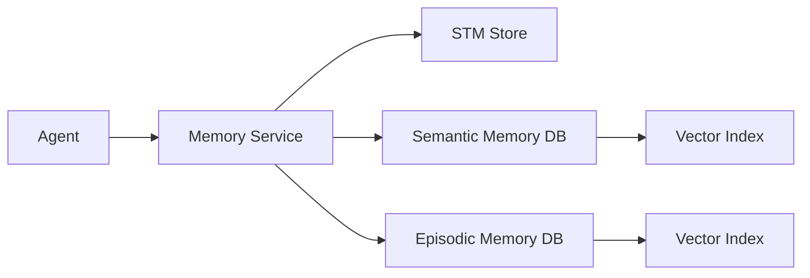

Potential technologies include:

```text
PostgreSQL + pgvector
Qdrant
Elasticsearch / OpenSearch
MongoDB Vector Search
Other vector databases
```

The in-memory implementation in this chapter intentionally keeps the architecture simple so the memory concepts are easy to understand.

---

# 27. Memory Lifecycle

The complete memory lifecycle will eventually look like:

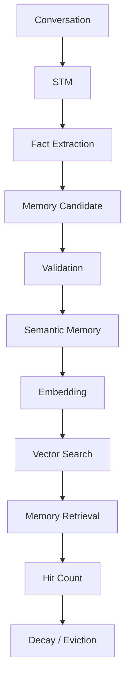

This chapter implements the core storage and retrieval pieces.

The **Fact Extraction** and **Memory Reflection** stages will be added in the next chapter.

---

# 28. Chapter Summary

In this chapter, we built the first version of the Agent Memory Framework.

### Short-Term Memory

STM maintains recent conversation context using a sliding window:

```text id="z8v4hx"
Session
   ↓
Recent N Messages
   ↓
LLM Context
```

### Long-Term Memory

LTM stores persistent information:

```text id="t3n9kc"
Facts
Events
   ↓
Embeddings
   ↓
Semantic Retrieval
```

### Memory Access Tracking

Retrieved facts also track:

```text id="r4x6qp"
hitCount
lastAccessedAt
```

These metrics provide the foundation for future memory decay and eviction.

The architecture now looks like:

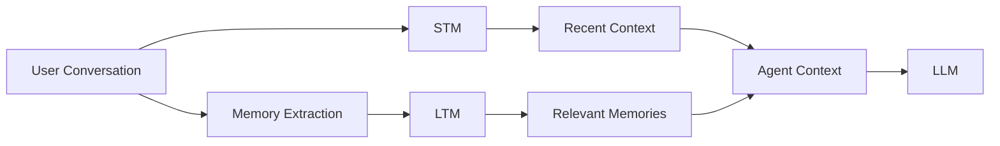

The agent can now answer using both:

> **What is happening now?**

and:

> **What do I already know?**

---

# 29. Chapter Checklist

Before moving to the next chapter, verify that you understand:

* [ ] What Short-Term Memory is
* [ ] Why STM uses a sliding window
* [ ] How sessions are isolated
* [ ] How messages are added and retrieved
* [ ] What Long-Term Memory is
* [ ] Difference between semantic and episodic memory
* [ ] Why memories need embeddings
* [ ] How cosine similarity retrieves relevant memories
* [ ] Why LTM must filter by `userId`
* [ ] What `hitCount` represents
* [ ] What `lastAccessedAt` represents
* [ ] Why hit count alone is not enough for memory importance
* [ ] Why embedding dimensions must remain consistent
* [ ] Why in-memory arrays are suitable for learning but not production-scale persistence

---

# 30. Next Chapter

The next step is to make the memory system intelligent enough to decide **what is worth remembering**.

### Chapter 4 — Fact Extraction Engine & Offline Memory Reflection

We will build:

```text id="a2m7xf"
Conversation
      ↓
Fact Extraction
      ↓
Memory Candidates
      ↓
Validation / Deduplication
      ↓
Long-Term Memory
```

We will also introduce **Memory Reflection / Dreaming**, where the agent periodically analyzes stored memories to discover:

* recurring preferences,
* important patterns,
* memory consolidation opportunities,
* redundant memories,
* and potentially useful higher-level insights.

This version also corrects the original verification bug (`storeFact` → `addFact`) and keeps the implementation consistent with the architecture established in Chapters 0–2.
