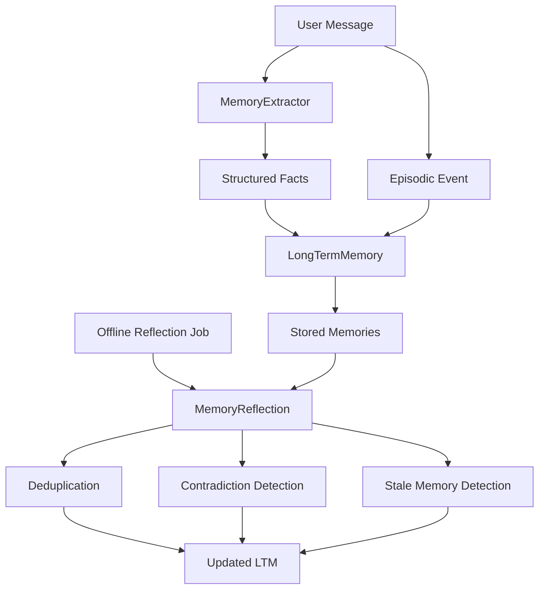
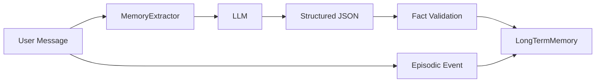
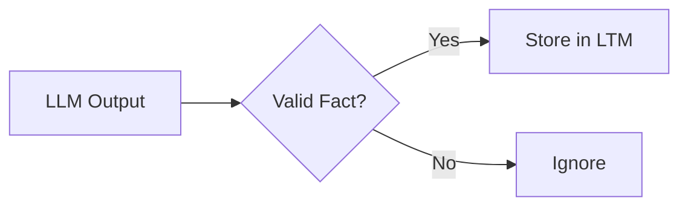
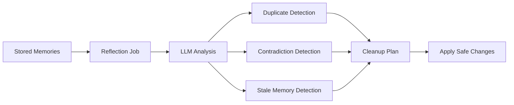
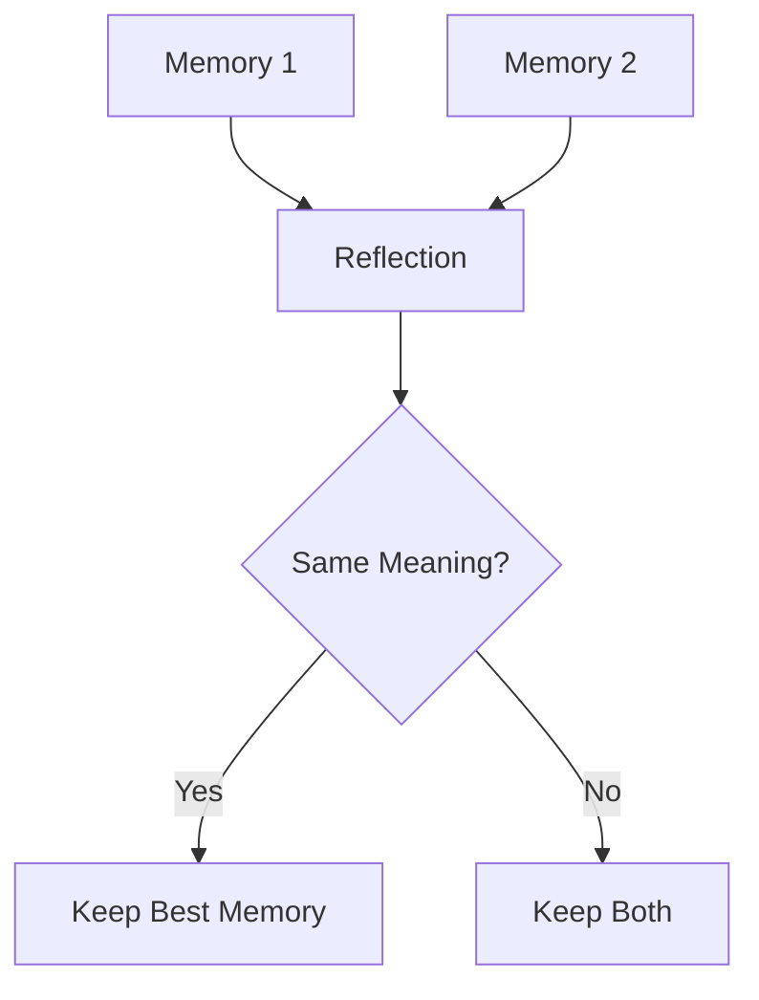
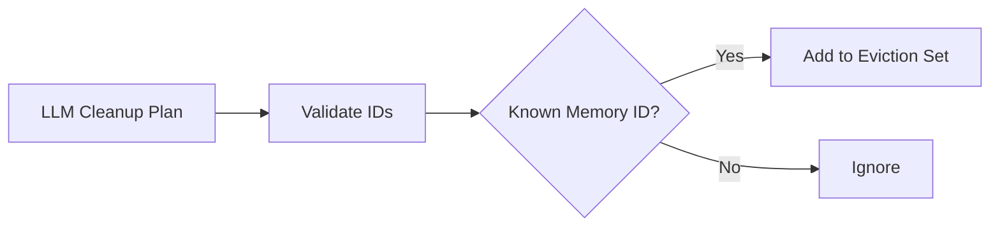
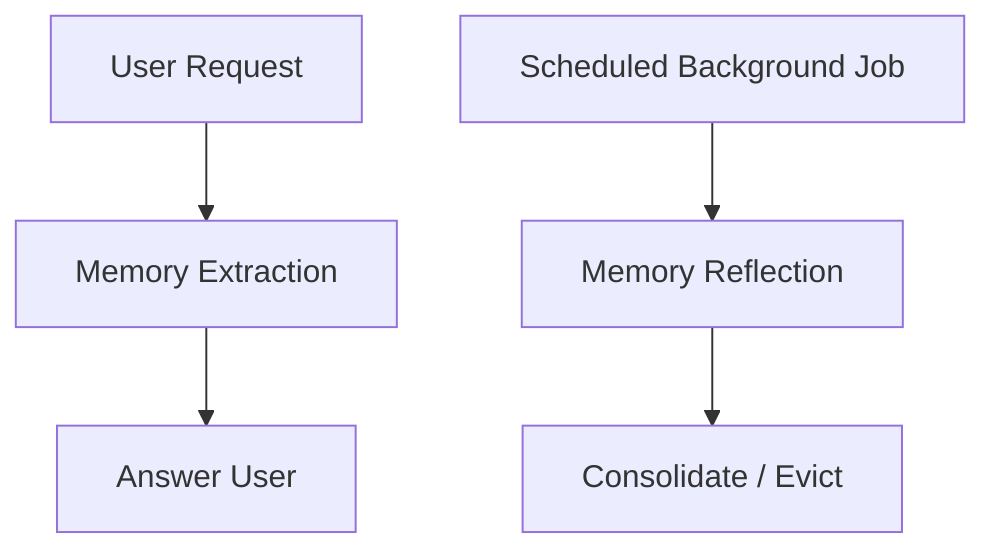
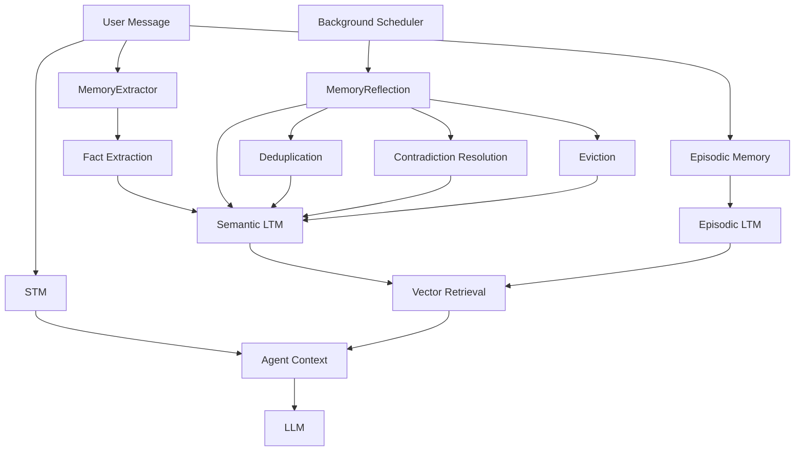
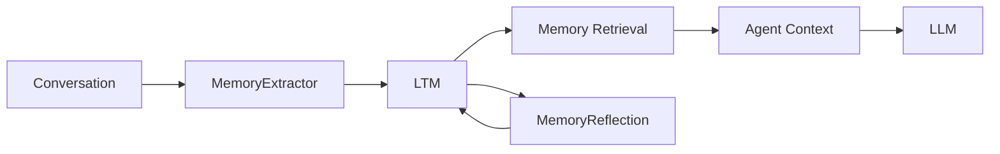

# Chapter 4 — Fact Extraction Engine & Offline Memory Reflection

## 1. Chapter Goal

The goal of this chapter is to make the Agent Memory system **automatically discover and maintain useful memories**.

In Chapter 3, we manually stored facts using:

```javascript
await ltm.addFact(
  "user-1",
  "User prefers Python",
  "preference"
);
```

Manual memory creation does not scale.

An intelligent agent should be able to inspect user messages and determine whether they contain information worth remembering.

This chapter introduces two components:

1. **MemoryExtractor** — extracts persistent facts and preferences from user messages.
2. **MemoryReflection** — periodically reviews stored memories and removes redundant, contradictory, or stale entries.

---

## 🎯 Expected Outcome

The complete memory lifecycle becomes:



The system therefore supports:

```text
Conversation
    ↓
Automatic Memory Extraction
    ↓
Long-Term Memory
    ↓
Offline Reflection
    ↓
Consolidated Memory
```

---

# 2. Memory Extraction Architecture

The extractor sits between the conversation layer and Long-Term Memory.



For example, the user says:

```text
"I am a backend developer and I love PostgreSQL."
```

The LLM may extract:

```json
{
  "extractedFacts": [
    {
      "fact": "User is a backend developer",
      "category": "professional"
    },
    {
      "fact": "User prefers PostgreSQL",
      "category": "preference"
    }
  ]
}
```

The application then stores these facts in LTM.

---

# 3. MemoryExtractor.js

## File Path

```text id="j7v3cx"
src/memory/MemoryExtractor.js
```

## Responsibility

`MemoryExtractor` performs three tasks:

1. Analyze a user message.
2. Extract persistent facts.
3. Store those facts and the original interaction in LTM.

---

## 3.1 Implementation

```javascript id="m4q8zk"
import { generateJSON } from "../utils/llm.js";

/**
 * MemoryExtractor.js
 *
 * LLM-driven memory extraction engine.
 *
 * Extracts persistent:
 * - facts
 * - preferences
 * - personal attributes
 * - technical/professional information
 */
export class MemoryExtractor {
  constructor(ltmStore) {
    if (!ltmStore) {
      throw new Error("ltmStore is required");
    }

    this.ltmStore = ltmStore;
  }

  /**
   * Extract persistent facts from a user message
   * and save them into Long-Term Memory.
   */
  async extractAndStore(userId, userQuery) {
    if (!userId) {
      throw new Error("userId is required");
    }

    if (
      typeof userQuery !== "string" ||
      !userQuery.trim()
    ) {
      throw new Error(
        "userQuery must be a non-empty string"
      );
    }

    const systemPrompt = `
You are an AI Memory Extraction Engine.

Analyze the user's message and extract only information
that is likely to remain useful beyond the current turn.

Extract:
- persistent personal facts
- preferences
- professional information
- technical interests
- long-term goals
- stable user attributes

Do NOT extract:
- temporary conversational statements
- greetings
- questions that do not reveal user information
- assistant-generated information

Return JSON:

{
  "extractedFacts": [
    {
      "fact": "User is a backend developer",
      "category": "professional"
    }
  ]
}

If no persistent information is present, return:

{
  "extractedFacts": []
}
`;

    const userPrompt = `
User Message:
"${userQuery.trim()}"
`;

    try {
      const result = await generateJSON(
        systemPrompt,
        userPrompt
      );

      const extractedFacts =
        Array.isArray(result?.extractedFacts)
          ? result.extractedFacts
          : [];

      const savedRecords = [];

      for (const item of extractedFacts) {
        if (
          !item ||
          typeof item.fact !== "string" ||
          !item.fact.trim()
        ) {
          continue;
        }

        const category =
          typeof item.category === "string" &&
          item.category.trim()
            ? item.category.trim()
            : "general";

        const record =
          await this.ltmStore.addFact(
            userId,
            item.fact.trim(),
            category
          );

        savedRecords.push(record);
      }

      // Store the original interaction as an episodic memory.
      await this.ltmStore.addEpisodicEvent(
        userId,
        userQuery.trim()
      );

      return savedRecords;
    } catch (err) {
      console.warn(
        `[MemoryExtractor Warning] Extraction failed: ${err.message}`
      );

      return [];
    }
  }
}
```

---

# 4. Understanding Memory Extraction

## 4.1 Why Use an LLM?

Rules and regular expressions can identify simple patterns, but user memory is semantic.

Consider:

```text
"I've recently switched to PostgreSQL because
I find it easier to work with."
```

A simple keyword extractor might find:

```text
PostgreSQL
```

but an LLM can infer:

```text
User prefers PostgreSQL.
```

That distinction is important for memory systems.

---

# 5. What Should Be Remembered?

Not every message should become a permanent memory.

### Good Memory

```text
"I am a backend developer."
```

```text
"I prefer TypeScript."
```

```text
"I'm currently building a RAG application."
```

```text
"My long-term goal is to build a SaaS company."
```

### Poor Memory

```text
"Hello!"
```

```text
"Thanks."
```

```text
"Can you explain this?"
```

```text
"Okay, I understand."
```

The extractor prompt therefore asks the LLM to focus on **persistent information**.

---

# 6. Fact Validation

The LLM is not trusted blindly.

The application checks:

```javascript id="x8k2mz"
typeof item.fact === "string"
```

and:

```javascript id="q5v9br"
item.fact.trim()
```

Only valid facts are passed to:

```javascript id="f6m3ty"
ltmStore.addFact(...)
```

This creates a basic validation boundary:



For production systems, stronger schema validation should eventually be added.

---

# 7. Episodic Memory During Extraction

The extractor also stores the original user message:

```javascript id="k9r4md"
await this.ltmStore.addEpisodicEvent(
  userId,
  userQuery.trim()
);
```

This is different from extracting facts.

For example:

```text
User Message:
"I've started learning Kubernetes."
```

could produce:

### Semantic Memory

```text
User is learning Kubernetes.
```

### Episodic Memory

```text
User said: "I've started learning Kubernetes."
```

The first describes **what is known**.

The second describes **what happened**.

---

# 8. Memory Reflection

Automatic extraction creates another problem.

Over time, LTM might contain:

```text
User prefers Python.
User likes Python.
User usually chooses Python.
User switched from JavaScript to Python.
User prefers JavaScript.
```

Some memories may:

* duplicate each other,
* contradict each other,
* become outdated,
* or no longer be useful.

This is where **Memory Reflection** enters the architecture.

---

# 9. Memory Dreaming

Memory Reflection is designed as an **offline/background process**.

Instead of running after every message:

```text
Every User Message
       ↓
Reflection
       ↓
LLM
```

we periodically run:



This process can be thought of as **memory dreaming**.

The agent is not responding to the user during this process.

It is maintaining its own memory.

---

# 10. MemoryReflection.js

## File Path

```text id="f8c3qa"
src/memory/MemoryReflection.js
```

## Responsibility

`MemoryReflection`:

* loads a user's semantic memories,
* asks an LLM to identify relationships,
* creates a cleanup plan,
* removes selected memories,
* reports what happened.

---

# 11. Implementation

```javascript id="u5n8kx"
import { generateJSON } from "../utils/llm.js";

/**
 * MemoryReflection.js
 *
 * Offline memory consolidation / "dreaming" engine.
 *
 * Detects:
 * - duplicate memories
 * - contradictory memories
 * - outdated memories
 *
 * The current implementation applies cleanup primarily
 * through safe eviction of selected memory IDs.
 */
export class MemoryReflection {
  constructor(ltmStore) {
    if (!ltmStore) {
      throw new Error("ltmStore is required");
    }

    this.ltmStore = ltmStore;
  }

  /**
   * Run a reflection pass for one user.
   */
  async runReflectionPass(userId) {
    if (!userId) {
      throw new Error("userId is required");
    }

    const userFacts =
      this.ltmStore.semanticMemory.filter(
        (fact) => fact.userId === userId
      );

    if (userFacts.length < 2) {
      return {
        mergedCount: 0,
        evictedCount: 0,
        status:
          "Skipped - insufficient facts for reflection",
      };
    }

    const factsFormatted = userFacts
      .map(
        (fact) =>
          `ID: ${fact.id} | ` +
          `Fact: "${fact.fact}" | ` +
          `Category: ${fact.category} | ` +
          `Created: ${fact.createdAt} | ` +
          `Last Accessed: ${fact.lastAccessedAt} | ` +
          `Hits: ${fact.hitCount}`
      )
      .join("\n");

    const systemPrompt = `
You are a Memory Reflection Engine for an AI agent.

Inspect the user's semantic memory list.

Identify:
1. Duplicate or near-duplicate memories.
2. Contradictory memories where a newer fact should replace an older one.
3. Clearly outdated or low-value memories.

Return JSON:

{
  "contradictionsResolved": [
    {
      "keepId": "fact_1",
      "removeId": "fact_2",
      "reason": "The newer memory supersedes the older one."
    }
  ],
  "evictIds": [
    "fact_3"
  ]
}

Important:
- Only use IDs that actually appear in the provided memory list.
- Do not invent IDs.
- Prefer removing redundant or outdated memories rather than
  making unsupported changes.
`;

    const userPrompt = `
Semantic Memory List:

${factsFormatted}
`;

    try {
      const plan = await generateJSON(
        systemPrompt,
        userPrompt
      );

      const validIds = new Set(
        userFacts.map((fact) => fact.id)
      );

      const evictSet = new Set();

      if (Array.isArray(plan?.evictIds)) {
        for (const id of plan.evictIds) {
          if (validIds.has(id)) {
            evictSet.add(id);
          }
        }
      }

      let resolvedCount = 0;

      if (
        Array.isArray(
          plan?.contradictionsResolved
        )
      ) {
        for (const resolution of
          plan.contradictionsResolved) {
          const removeId =
            resolution?.removeId;

          if (
            removeId &&
            validIds.has(removeId)
          ) {
            evictSet.add(removeId);
            resolvedCount++;
          }
        }
      }

      const evictedCount =
        this.ltmStore.evictFacts(
          Array.from(evictSet)
        );

      return {
        mergedCount: resolvedCount,
        evictedCount,
        status: "Completed successfully",
      };
    } catch (err) {
      console.warn(
        `[MemoryReflection Warning] Reflection pass failed: ${err.message}`
      );

      return {
        mergedCount: 0,
        evictedCount: 0,
        status: `Failed: ${err.message}`,
      };
    }
  }
}
```

---

# 12. Understanding Reflection

## 12.1 Load User Memories

The reflection process starts by selecting only the current user's semantic memories:

```javascript id="e2c7mw"
this.ltmStore.semanticMemory.filter(
  (fact) => fact.userId === userId
);
```

This is critical for memory isolation.

A reflection job for:

```text
user-A
```

must never modify:

```text
user-B
```

memories.

---

# 13. Why Include Hit Count and Timestamps?

The reflection engine receives:

```text id="q8v5cn"
Created
Last Accessed
Hit Count
```

These values give the LLM useful signals.

For example:

```text
ID: fact_1
Fact: "User prefers Python"
Created: 2026-01-01
Last Accessed: 2026-08-30
Hits: 25
```

versus:

```text
ID: fact_2
Fact: "User likes an old framework"
Created: 2024-01-01
Last Accessed: 2024-03-01
Hits: 1
```

The second memory may be a stronger eviction candidate.

However, the current implementation still lets the LLM decide which IDs to remove. A production system should combine LLM reasoning with deterministic retention rules.

---

# 14. Contradiction Resolution

Suppose memory contains:

```text
fact_1 → User lives in Tokyo.
fact_2 → User lives in London.
```

The reflection model might determine:

```json
{
  "keepId": "fact_2",
  "removeId": "fact_1",
  "reason": "The newer memory supersedes the older location."
}
```

The system then adds:

```text
fact_1
```

to the eviction set.

Important:

> The current implementation does not actually merge the two fact records. It resolves the conflict by retaining one record and evicting another.

Therefore, `mergedCount` is better understood as **resolved relationships**, not literal database merges.

---

# 15. Duplicate Memory Detection

Suppose the memory store contains:

```text
fact_1 → User prefers Python.
fact_2 → User likes Python for development.
```

A semantic reflection model may determine these represent essentially the same preference.

It can select one for removal.



The current implementation performs the **eviction** portion.

A future consolidation engine could go further by generating a new canonical memory:

```text
User prefers Python for software development.
```

and replacing both old records with that consolidated memory.

---

# 16. Safe ID Validation

The LLM returns memory IDs.

Those IDs are treated as untrusted model output.

The implementation therefore creates:

```javascript id="g4x8vs"
const validIds = new Set(
  userFacts.map((fact) => fact.id)
);
```

Only IDs that actually exist in the current user's memory collection are accepted.

This prevents a malformed model response from accidentally targeting arbitrary IDs.



---

# 17. Memory Eviction

After the reflection plan has been validated:

```javascript id="j2r6pw"
this.ltmStore.evictFacts(
  Array.from(evictSet)
);
```

removes the selected records.

The process is therefore:

```text
Analyze
   ↓
Generate Cleanup Plan
   ↓
Validate IDs
   ↓
Build Eviction Set
   ↓
Evict Memories
```

---

# 18. Memory Dreaming as a Background Job

Reflection should normally not block a user's request.

Instead of:

```text
User Request
    ↓
Extract Memory
    ↓
Reflect Entire Memory Store
    ↓
Answer User
```

prefer:



This keeps the interactive path fast.

Chapter 0 already contains a `dream` script concept, which can later be connected to this reflection engine.

---

# 19. Verification & Testing

## 19.1 Test Memory Extraction

Use:

```bash id="c6r2mz"
node --input-type=module -e "
import { LongTermMemory } from './src/memory/LongTermMemory.js';
import { MemoryExtractor } from './src/memory/MemoryExtractor.js';

const ltm = new LongTermMemory();
const extractor = new MemoryExtractor(ltm);

const result = await extractor.extractAndStore(
  'u1',
  'I am a backend developer and I love PostgreSQL.'
);

console.log('Extracted Facts Count:', result.length);
console.log('Semantic Memories:', ltm.semanticMemory.length);
console.log('Episodic Memories:', ltm.episodicMemory.length);
"
```

Expected output has the following shape:

```text id="n3y7qp"
Extracted Facts Count: <0 or more>
Semantic Memories: <number>
Episodic Memories: 1
```

Because extraction depends on the configured LLM/mock implementation, the exact number of extracted facts should **not** be hard-coded as a deterministic test unless the LLM is mocked.

---

# 20. Test Memory Reflection

You can create two memories and then run a reflection pass:

```bash id="r8x4kw"
node --input-type=module -e "
import { LongTermMemory } from './src/memory/LongTermMemory.js';
import { MemoryReflection } from './src/memory/MemoryReflection.js';

const ltm = new LongTermMemory();
const reflection = new MemoryReflection(ltm);

await ltm.addFact(
  'u1',
  'User prefers Python',
  'preference'
);

await ltm.addFact(
  'u1',
  'User likes Python for development',
  'preference'
);

console.log(
  'Before Reflection:',
  ltm.semanticMemory.length
);

const result =
  await reflection.runReflectionPass('u1');

console.log(
  'Reflection Result:',
  result
);

console.log(
  'After Reflection:',
  ltm.semanticMemory.length
);
"
```

The exact number of evictions depends on the LLM's reflection plan.

The important thing is that the reflection process returns:

```text
mergedCount
evictedCount
status
```

---

# 21. Testing User Isolation

Reflection must also respect user boundaries.

For example:

```javascript id="f3m8qa"
await ltm.addFact(
  "user-a",
  "User prefers Python",
  "preference"
);

await ltm.addFact(
  "user-b",
  "User prefers JavaScript",
  "preference"
);
```

Running:

```javascript id="s5q9wd"
await reflection.runReflectionPass("user-a");
```

must only inspect and modify `user-a` memories.

This is enforced by:

```javascript id="n7x2kc"
fact.userId === userId
```

---

# 22. Common Mistakes

## Mistake 1 — Saving Every Message as a Semantic Fact

Do not convert:

```text
"Hello"
"Thanks"
"Okay"
```

into permanent user facts.

Semantic memory should represent durable information.

---

## Mistake 2 — Trusting LLM Output Without Validation

LLMs can generate:

* malformed JSON,
* nonexistent IDs,
* invalid categories,
* duplicate facts,
* unsupported assumptions.

Always validate model-generated memory operations before mutating storage.

---

## Mistake 3 — Calling Reflection on Every Request

Reflection can be expensive.

Avoid:

```text
Every request
    ↓
LLM reflection
```

Prefer:

```text
Requests
   ↓
Memory extraction
   ↓
Periodic background reflection
```

---

## Mistake 4 — Calling Every Removed Memory "Merged"

If:

```text
Fact A
Fact B
```

are simply reduced to:

```text
Fact A
```

then the system performed **deduplication/eviction**, not a true merge.

A real merge would create or update a canonical memory.

---

## Mistake 5 — Letting the LLM Directly Delete Records

Never blindly execute:

```javascript id="h2r8vy"
evictFacts(plan.evictIds);
```

without validating the IDs.

Model output should be treated as a proposed action, not as trusted database instructions.

---

# 23. Production Considerations

## 23.1 Memory Importance

A production memory system should eventually store an explicit importance value:

```text
importance: 0–1
```

Then retention can consider:

```text
Importance
+
Hit Count
+
Recency
+
Semantic Relevance
```

---

## 23.2 Contradiction Handling

Simply deleting the older fact is not always correct.

For example:

```text
User lives in London.
```

followed months later by:

```text
User is visiting Tokyo.
```

These are not necessarily contradictory.

A production system should distinguish:

```text
Contradiction
```

from:

```text
Temporary event
```

This is one reason memory extraction and reflection should remain separate.

---

## 23.3 Memory Consolidation

A mature memory system can evolve from:

```text
Fact A
Fact B
Fact C
```

into:

```text
Canonical Memory
```

For example:

```text
User prefers TypeScript for backend projects
and uses Node.js regularly.
```

This reduces memory fragmentation.

---

## 23.4 Background Scheduling

Reflection should eventually run through a background job system.

Conceptually:


This can later be connected to a queue system such as BullMQ or another background-job infrastructure.

---

# 24. Complete Memory Architecture

After this chapter, the memory system looks like:



The agent now has a complete basic memory lifecycle:

```text
Observe
  ↓
Extract
  ↓
Store
  ↓
Retrieve
  ↓
Reflect
  ↓
Consolidate
```

---

# 25. Chapter Summary

This chapter transformed the memory layer from a passive database into an **active memory system**.

### MemoryExtractor

Automatically analyzes user messages and extracts persistent information.

```text
User Message
     ↓
LLM Extraction
     ↓
Structured Facts
     ↓
LTM
```

### MemoryReflection

Periodically analyzes existing memories and identifies:

* duplicates,
* contradictions,
* stale memories,
* low-value memories.

```text
LTM
 ↓
Reflection
 ↓
Cleanup Plan
 ↓
Validated Eviction
```

Together:



The memory subsystem can now **learn from conversations, retrieve relevant information, and maintain itself over time**.

---

# 26. Chapter Checklist

Before moving forward, verify that you understand:

* [ ] Why automatic fact extraction is necessary
* [ ] What MemoryExtractor does
* [ ] What makes a good long-term memory
* [ ] Difference between semantic and episodic memory
* [ ] Why LLM output must be validated
* [ ] What Memory Reflection / Dreaming means
* [ ] Why reflection should run offline
* [ ] How duplicate memories can be detected
* [ ] How contradictory memories can be resolved
* [ ] Why model-generated IDs must be validated
* [ ] Why eviction is different from true memory merging
* [ ] Why reflection should not run on every request
* [ ] How hit count and timestamps support memory maintenance
* [ ] Why user-level memory isolation is critical

---

# 27. Next Chapter

The core RAG and Memory components are now available.

The next step is to connect everything into a single intelligent agent.

### Chapter 5 — RAGMemoryAgent Orchestrator

We will build the master orchestration layer:

```text
User Query
    ↓
Guardrails
    ↓
Memory Extraction
    ↓
STM Retrieval
    ↓
LTM Retrieval
    ↓
Query Transformation
    ↓
RAG Retrieval
    ↓
RRF
    ↓
CRAG
    ↓
Context Assembly
    ↓
LLM Generation
    ↓
Final Response
```

This will turn the individual modules from Chapters 1–4 into a **single RAG + Memory Agent pipeline**.

