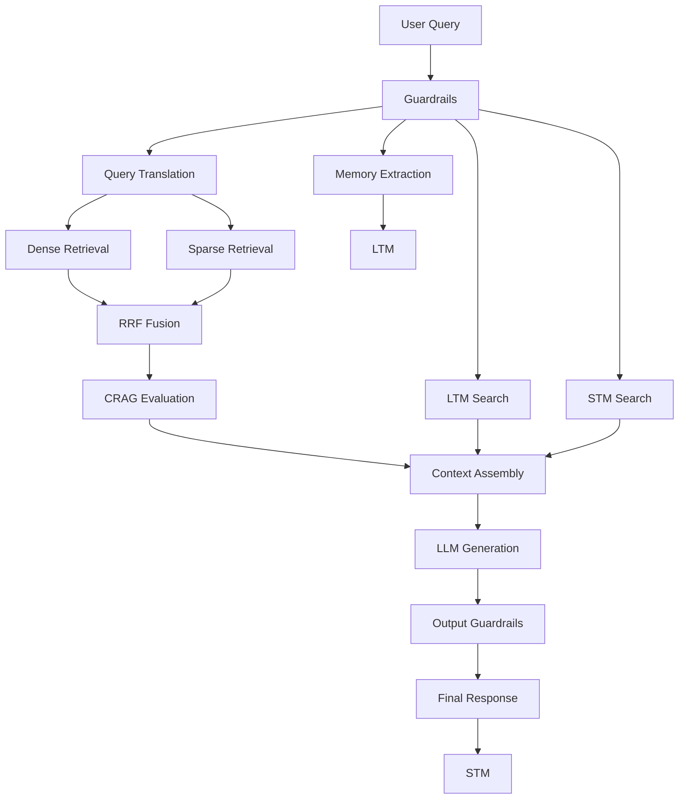
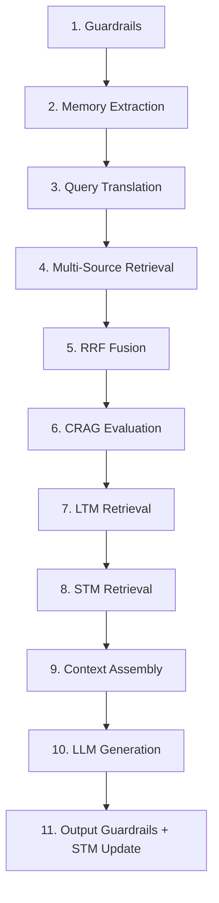
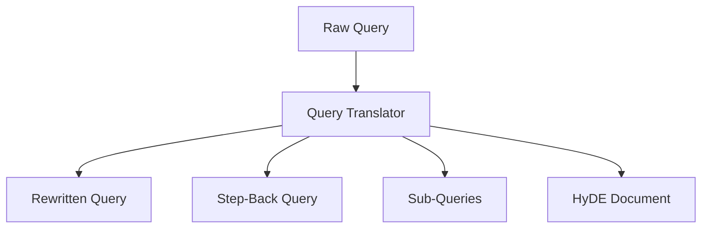
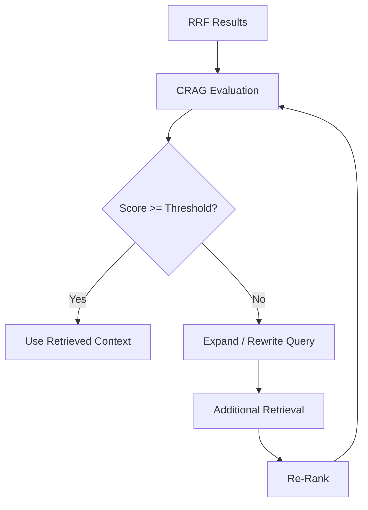
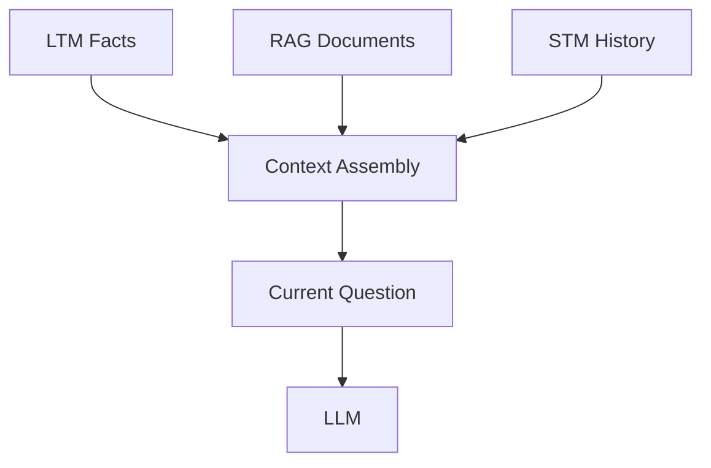
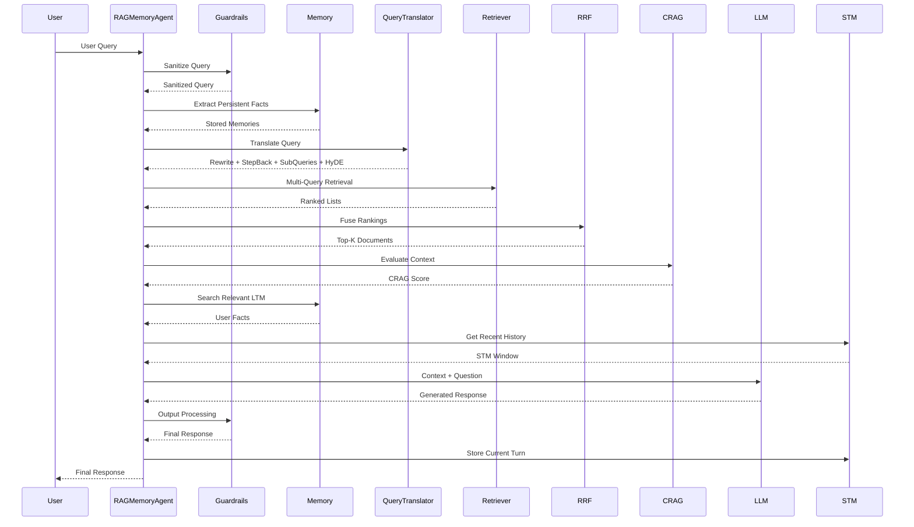
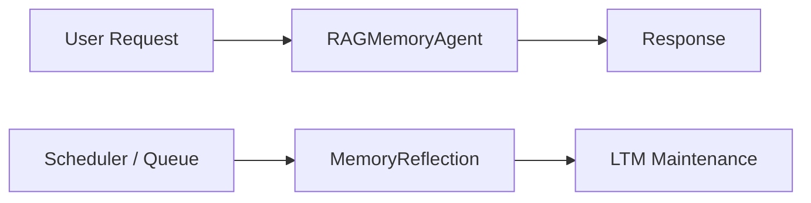
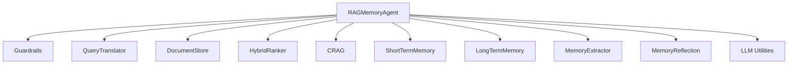
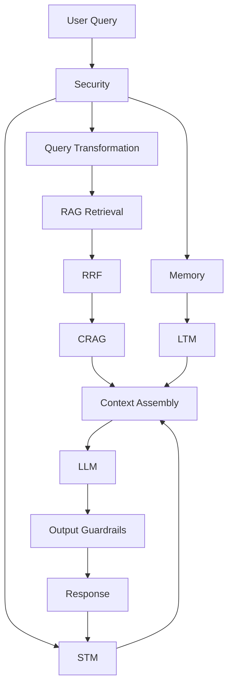

# Chapter 5 — Master Orchestrator Agent & 11-Step Pipeline

## 1. Chapter Goal

The goal of this chapter is to build the central orchestration layer of the RAG + Memory Framework:

```text
src/agent/RAGMemoryAgent.js
```

Up to this point, the system has been built as independent subsystems:

* **Guardrails** — PII masking and injection detection
* **QueryTranslator** — query rewriting, Step-Back, Sub-Queries, and HyDE
* **DocumentStore** — dense and sparse retrieval
* **HybridRanker** — Reciprocal Rank Fusion (RRF)
* **CRAG** — retrieval quality evaluation
* **ShortTermMemory** — recent conversation context
* **LongTermMemory** — persistent semantic and episodic memory
* **MemoryExtractor** — automatic fact extraction
* **MemoryReflection** — offline memory maintenance
* **LLM utilities** — embeddings and response generation

The `RAGMemoryAgent` connects these components into one end-to-end execution pipeline.

---

## 🎯 Expected Outcome

A user should be able to send a single query and have the agent automatically:

```text
User Query
    ↓
Security
    ↓
Memory
    ↓
Query Transformation
    ↓
Knowledge Retrieval
    ↓
RRF
    ↓
CRAG Evaluation
    ↓
Memory Retrieval
    ↓
Conversation Context
    ↓
LLM Generation
    ↓
Final Response
```

The result is a response that is both:

**Grounded in retrieved knowledge** and **personalized using relevant user memory**.

---

# 2. System Architecture

The master agent coordinates two major information sources:

### Knowledge

The RAG pipeline retrieves information from the application's knowledge base.

### Memory

The memory pipeline retrieves information about the current user and conversation.

These streams are eventually combined into the LLM context.



---

# 3. File Path

Create:

```text
rag+memory/
└── src/
    └── agent/
        └── RAGMemoryAgent.js
```

The directory structure now becomes:

```text
src/
├── agent/
│   └── RAGMemoryAgent.js
│
├── memory/
│   ├── ShortTermMemory.js
│   ├── LongTermMemory.js
│   ├── MemoryExtractor.js
│   └── MemoryReflection.js
│
├── rag/
│   ├── DocumentStore.js
│   ├── HybridRanker.js
│   ├── Guardrails.js
│   ├── QueryTranslator.js
│   └── CRAG.js
│
├── utils/
│   ├── embeddings.js
│   └── llm.js
│
└── config.js
```

---

# 4. RAGMemoryAgent Implementation

## File

```text
src/agent/RAGMemoryAgent.js
```

## Complete Implementation

```javascript id="p4n7cx"
import { Guardrails } from "../rag/Guardrails.js";
import { QueryTranslator } from "../rag/QueryTranslator.js";
import { DocumentStore } from "../rag/DocumentStore.js";
import { HybridRanker } from "../rag/HybridRanker.js";
import { CRAG } from "../rag/CRAG.js";

import { ShortTermMemory } from "../memory/ShortTermMemory.js";
import { LongTermMemory } from "../memory/LongTermMemory.js";
import { MemoryExtractor } from "../memory/MemoryExtractor.js";
import { MemoryReflection } from "../memory/MemoryReflection.js";

import { getEmbedding } from "../utils/embeddings.js";
import { callLLM } from "../utils/llm.js";
import { config } from "../config.js";

export class RAGMemoryAgent {
  constructor() {
    this.queryTranslator = new QueryTranslator();

    this.docStore = new DocumentStore();

    this.cragEvaluator = new CRAG();

    this.stm = new ShortTermMemory(
      config.memory.stmMaxTurns
    );

    this.ltm = new LongTermMemory();

    this.memoryExtractor =
      new MemoryExtractor(this.ltm);

    this.memoryReflection =
      new MemoryReflection(this.ltm);
  }

  /**
   * Seed the in-memory knowledge base
   * with example technical documents.
   */
  async seedKnowledgeBase() {
    await this.docStore.addDocument(
      "doc_vllm",
      "vLLM High Performance Inference Engine",
      "vLLM is a high-throughput and memory-efficient LLM serving engine developed at UC Berkeley. It utilizes PagedAttention to eliminate KV cache fragmentation by allocating memory in non-contiguous virtual blocks similar to standard operating system page tables. Key optimizations include continuous batching, chunked prefill, prefix caching, and disaggregated prefill/decode architecture."
    );

    await this.docStore.addDocument(
      "doc_agent_memory",
      "Agent Application-Level Memory Architectures",
      "Stateless LLM APIs require application-level memory management. Short-Term Memory (STM) uses sliding window buffers to persist recent turns. Long-Term Memory (LTM) maintains Semantic Memory (structured user facts and preferences) and Episodic Memory (interaction logs). Fact extraction engines extract attributes using LLM calls. Memory dreaming and reflection background jobs deduplicate facts and evict stale records based on memory usage signals."
    );

    await this.docStore.addDocument(
      "doc_adv_rag",
      "Advanced RAG Production System Architecture",
      "Advanced RAG upgrades naive RAG by introducing Input Guardrails with PII masking, Query Translation including Query Rewriting, Step-Back Prompting, Sub-Queries, and HyDE, Reciprocal Rank Fusion (RRF), Cross-Encoder Re-Ranking, and Corrective RAG (CRAG) self-evaluation. CRAG verifies retrieval quality and can trigger additional retrieval or query expansion when confidence is below a configured threshold."
    );
  }

  /**
   * Execute the complete RAG + Memory pipeline.
   */
  async handleQuery(
    userId,
    sessionId,
    rawUserQuery
  ) {
    if (!userId) {
      throw new Error("userId is required");
    }

    if (!sessionId) {
      throw new Error("sessionId is required");
    }

    if (
      typeof rawUserQuery !== "string" ||
      !rawUserQuery.trim()
    ) {
      throw new Error(
        "rawUserQuery must be a non-empty string"
      );
    }

    console.log(
      "\n================================================================="
    );

    console.log(
      `👤 User Query: "${rawUserQuery}" ` +
      `[UserId: ${userId} | Session: ${sessionId}]`
    );

    console.log(
      "================================================================="
    );

    // -------------------------------------------------------------
    // 1. Security & Guardrails
    // -------------------------------------------------------------

    const guardrails = new Guardrails();

    const {
      sanitizedQuery,
      maskedCount,
      isSuspicious,
    } = guardrails.processInput(rawUserQuery);

    if (maskedCount > 0) {
      console.log(
        `🛡️ [Guardrails] Masked ${maskedCount} PII token(s)`
      );
    }

    if (isSuspicious) {
      console.warn(
        "⚠️ [Guardrails] Suspicious prompt-injection pattern detected."
      );
    }

    // -------------------------------------------------------------
    // 2. Memory Extraction
    // -------------------------------------------------------------

    const extracted =
      await this.memoryExtractor.extractAndStore(
        userId,
        rawUserQuery
      );

    if (extracted.length > 0) {
      console.log(
        `🧠 [LTM Fact Extraction] ` +
        `Extracted ${extracted.length} fact(s)`
      );

      extracted.forEach((fact) => {
        console.log(
          `   - [${fact.category}] ${fact.fact}`
        );
      });
    }

    // -------------------------------------------------------------
    // 3. Pre-Retrieval Query Translation
    // -------------------------------------------------------------

    console.log(
      "🔍 [Query Translation] Translating query..."
    );

    const translations =
      await this.queryTranslator.translateQuery(
        sanitizedQuery
      );

    console.log(
      `   ├─ Rewritten: "${translations.rewritten}"`
    );

    console.log(
      `   ├─ Step-Back: "${translations.stepBack}"`
    );

    console.log(
      `   ├─ Sub-Queries: ${translations.subQueries.join(
        " | "
      )}`
    );

    console.log(
      `   └─ HyDE Generated: ${
        Boolean(translations.hydeDocument)
      }`
    );

    // -------------------------------------------------------------
    // 4. Multi-Source Knowledge Retrieval
    // -------------------------------------------------------------

    console.log(
      "📚 [Knowledge RAG] Performing multi-query retrieval..."
    );

    const searchStreams = [];

    const originalVector =
      await getEmbedding(sanitizedQuery);

    const rewriteVector =
      await getEmbedding(
        translations.rewritten
      );

    const hydeVector =
      await getEmbedding(
        translations.hydeDocument
      );

    // Original query
    searchStreams.push(
      await this.docStore.searchDense(
        originalVector,
        4
      )
    );

    // Rewritten query
    searchStreams.push(
      await this.docStore.searchDense(
        rewriteVector,
        4
      )
    );

    // HyDE document
    searchStreams.push(
      await this.docStore.searchDense(
        hydeVector,
        4
      )
    );

    // Original sparse retrieval
    searchStreams.push(
      await this.docStore.searchSparse(
        sanitizedQuery,
        4
      )
    );

    // Sub-query retrieval
    for (const subQuery of
      translations.subQueries) {
      const subQueryVector =
        await getEmbedding(subQuery);

      searchStreams.push(
        await this.docStore.searchDense(
          subQueryVector,
          4
        )
      );
    }

    // -------------------------------------------------------------
    // 5. Reciprocal Rank Fusion
    // -------------------------------------------------------------

    const fusedKnowledgeDocs =
      HybridRanker.fuseRRF(
        searchStreams,
        config.rag.rrfK,
        config.rag.topK
      );

    console.log(
      `   └─ RRF returned ${fusedKnowledgeDocs.length} document chunk(s).`
    );

    // -------------------------------------------------------------
    // 6. Corrective RAG Evaluation
    // -------------------------------------------------------------

    const cragEval =
      await this.cragEvaluator.evaluateContext(
        sanitizedQuery,
        fusedKnowledgeDocs,
        config.rag.cragThreshold
      );

    console.log(
      `⚖️ [CRAG] Score: ${cragEval.score}/10 | ` +
      `Sufficient: ${cragEval.isSufficient}`
    );

    // -------------------------------------------------------------
    // 7. Long-Term Memory Retrieval
    // -------------------------------------------------------------

    const ltmRelevantFacts =
      await this.ltm.searchRelevantFacts(
        userId,
        sanitizedQuery,
        config.memory.ltmTopK
      );

    console.log(
      `🧠 [LTM] Retrieved ${ltmRelevantFacts.length} fact(s).`
    );

    // -------------------------------------------------------------
    // 8. Short-Term Memory Retrieval
    // -------------------------------------------------------------

    const stmHistory =
      await this.stm.getRecentWindow(
        sessionId,
        config.memory.stmMaxTurns
      );

    console.log(
      `⏳ [STM] Retrieved ${stmHistory.length} recent message(s).`
    );

    // -------------------------------------------------------------
    // 9. Context Assembly
    // -------------------------------------------------------------

    const systemPrompt = `
You are an advanced AI assistant equipped with:

1. Retrieval-Augmented Generation (RAG)
2. Long-Term User Memory
3. Short-Term Conversation Memory

Answer the user's question accurately.

Use retrieved knowledge documents as the primary
source for factual technical information.

Use long-term memory only when it is relevant to
the current question.

Use recent conversation history to maintain
conversation continuity.

Do not invent information that is not supported
by the available context.
`;

    let contextPayload =
      "=== USER LONG-TERM MEMORY ===\n";

    if (ltmRelevantFacts.length > 0) {
      for (const fact of ltmRelevantFacts) {
        contextPayload +=
          `- ${fact.fact}\n`;
      }
    } else {
      contextPayload +=
        "(No relevant user facts found)\n";
    }

    contextPayload +=
      "\n=== RETRIEVED KNOWLEDGE ===\n";

    for (
      const [index, document]
      of fusedKnowledgeDocs.entries()
    ) {
      contextPayload +=
        `[Document ${index + 1}]\n` +
        `Title: ${document.title}\n` +
        `Content: ${document.content}\n\n`;
    }

    contextPayload +=
      "\n=== RECENT CONVERSATION ===\n";

    for (const turn of stmHistory) {
      contextPayload +=
        `${turn.role.toUpperCase()}: ` +
        `${turn.content}\n`;
    }

    contextPayload +=
      `\n=== CURRENT QUESTION ===\n` +
      sanitizedQuery;

    // -------------------------------------------------------------
    // 10. LLM Generation
    // -------------------------------------------------------------

    console.log(
      "🤖 [LLM] Generating final response..."
    );

    const rawResponse =
      await callLLM(
        systemPrompt,
        contextPayload,
        0.3
      );

    // -------------------------------------------------------------
    // 11. Output Guardrails & STM Update
    // -------------------------------------------------------------

    const finalResponse =
      guardrails.processOutput(
        rawResponse
      );

    await this.stm.addMessage(
      sessionId,
      "user",
      rawUserQuery
    );

    await this.stm.addMessage(
      sessionId,
      "assistant",
      finalResponse
    );

    console.log(
      "💾 [STM] Conversation state updated."
    );

    return {
      query: rawUserQuery,
      response: finalResponse,

      cragScore: cragEval.score,

      ltmFactsUsed:
        ltmRelevantFacts.map(
          (fact) => fact.fact
        ),

      knowledgeDocsUsed:
        fusedKnowledgeDocs.map(
          (document) => document.title
        ),
    };
  }
}
```

---

# 5. Understanding the 11-Step Pipeline

The agent executes the following sequence:



Each stage has a specific responsibility.

---

# 6. Step 1 — Security & Guardrails

The first step processes the raw user query.

```javascript id="v8d4wm"
const {
  sanitizedQuery,
  maskedCount,
  isSuspicious
} = guardrails.processInput(rawUserQuery);
```

For example:

```text
My email is user@example.com.
Explain how RAG works.
```

may become:

```text
My email is [PII_EMAIL_1].
Explain how RAG works.
```

The sensitive value is not unnecessarily passed through the retrieval pipeline.

### Important

`isSuspicious` currently only detects known patterns.

It does **not automatically block the request**.

A production system may decide to:

```text
Suspicious
    ↓
Block
OR
Require additional validation
OR
Continue with restricted processing
```

---

# 7. Step 2 — Memory Extraction

The raw user message is passed to:

```javascript id="w3r9ax"
this.memoryExtractor.extractAndStore(
  userId,
  rawUserQuery
);
```

This allows the agent to learn from the interaction.

For example:

```text
"I've been learning Kubernetes recently."
```

may become:

```text
User is learning Kubernetes.
```

and get stored in LTM.

The original interaction is also recorded as episodic memory.

---

# 8. Step 3 — Query Translation

The sanitized query is transformed into multiple representations:

```text
Original Query
       ↓
QueryTranslator
       ├── Rewritten Query
       ├── Step-Back Query
       ├── Sub-Queries
       └── HyDE Document
```

These representations improve retrieval coverage.



---

# 9. Step 4 — Multi-Source Knowledge Retrieval

The agent performs several retrieval operations.

### Dense Retrieval

The query is converted into an embedding:

```javascript id="g3n7yx"
const originalVector =
  await getEmbedding(sanitizedQuery);
```

The vector is then compared against document embeddings.

### Rewritten Query

The rewritten query gets its own embedding.

### HyDE

The hypothetical answer generated by HyDE is embedded and searched against the knowledge base.

### Sparse Retrieval

The original query is also searched using keyword matching.

### Sub-Queries

Each sub-query creates another dense retrieval stream.

The result is multiple ranked lists:

```text
Dense(original)
Dense(rewritten)
Dense(HyDE)
Sparse(original)
Dense(sub-query-1)
Dense(sub-query-2)
...
```

---

# 10. Step 5 — Reciprocal Rank Fusion

The individual search streams are combined using RRF.

```javascript id="k4z7mc"
const fusedKnowledgeDocs =
  HybridRanker.fuseRRF(
    searchStreams,
    config.rag.rrfK,
    config.rag.topK
  );
```

RRF does not directly compare embedding scores with keyword scores.

Instead, it combines their **rank positions**.

```text
Search Stream A:
Document X → Rank 1

Search Stream B:
Document X → Rank 2

Search Stream C:
Document X → Rank 4

                  ↓

            RRF Fusion

                  ↓

          High Final Rank
```

This allows different retrieval strategies to contribute to the final result.

---

# 11. Step 6 — Corrective RAG

The fused knowledge is evaluated using CRAG.

```javascript id="n9x2cw"
const cragEval =
  await this.cragEvaluator.evaluateContext(
    sanitizedQuery,
    fusedKnowledgeDocs,
    config.rag.cragThreshold
  );
```

The evaluator produces:

```text
Score
Sufficient / Insufficient
Reasoning
```

For example:

```text
Score: 8.4 / 10
Sufficient: true
```

The configured threshold controls the decision:

```text
Score >= threshold
        ↓
   Sufficient

Score < threshold
        ↓
  Insufficient
```

### Important Architecture Limitation

The current implementation **evaluates CRAG but does not perform corrective retrieval when the score is low**.

A complete CRAG loop could later become:



That enhancement can be added in a future production version.

---

# 12. Step 7 — Long-Term Memory Retrieval

The agent searches the current user's semantic memory:

```javascript id="q6m3vt"
const ltmRelevantFacts =
  await this.ltm.searchRelevantFacts(
    userId,
    sanitizedQuery,
    config.memory.ltmTopK
  );
```

This is user-specific.

For example, if the user previously stored:

```text
User is a backend developer.
User prefers TypeScript.
User is learning RAG.
```

and asks:

```text
How should I structure this backend?
```

the relevant facts can be supplied to the LLM.

---

# 13. Step 8 — Short-Term Memory Retrieval

The agent retrieves recent conversation history:

```javascript id="v5r8qm"
const stmHistory =
  await this.stm.getRecentWindow(
    sessionId,
    config.memory.stmMaxTurns
  );
```

STM provides immediate conversational continuity.

For example:

```text
USER: What is RAG?
ASSISTANT: RAG combines retrieval and generation.
USER: What about hybrid retrieval?
```

The final question can be interpreted in context.

Without STM, `"What about hybrid retrieval?"` may be ambiguous.

---

# 14. Step 9 — Context Assembly

The agent now has three important sources:

```text
LTM
+
RAG Knowledge
+
STM
```

They are assembled into a single context payload.



The context is organized into explicit sections:

```text
=== USER LONG-TERM MEMORY ===

=== RETRIEVED KNOWLEDGE ===

=== RECENT CONVERSATION ===

=== CURRENT QUESTION ===
```

This makes the context easier for the model to interpret.

---

# 15. Step 10 — LLM Generation

The assembled context is sent to the LLM:

```javascript id="p9m5tx"
const rawResponse =
  await callLLM(
    systemPrompt,
    contextPayload,
    0.3
  );
```

The model is instructed to:

* use retrieved knowledge for factual grounding,
* use LTM when relevant,
* use STM for conversational continuity,
* avoid unsupported claims.

This is the final generation stage.

---

# 16. Step 11 — Output Guardrails & STM Update

The response passes through the output guardrail:

```javascript id="b6q2nv"
const finalResponse =
  guardrails.processOutput(rawResponse);
```

Then the conversation is added to STM:

```javascript id="f7x4mc"
await this.stm.addMessage(
  sessionId,
  "user",
  rawUserQuery
);

await this.stm.addMessage(
  sessionId,
  "assistant",
  finalResponse
);
```

This means the next request can access the current exchange.

---

# 17. Important Ordering Detail

Memory extraction happens **before** the current STM update.

Therefore, the current user message is not yet available through STM during the current response generation.

This is intentional:

```text
Current Query
    ↓
Retrieve Previous STM
    ↓
Generate Response
    ↓
Save Current Turn to STM
```

That means STM represents **previous conversation context**, while the current question is supplied separately.

This avoids accidentally duplicating the current question in the conversation history.

---

# 18. Knowledge Base Seeding

The agent includes a simple development helper:

```javascript id="h5k8qw"
await agent.seedKnowledgeBase();
```

It adds three example documents:

```text
1. vLLM High Performance Inference Engine
2. Agent Application-Level Memory Architectures
3. Advanced RAG Production System Architecture
```

The seeded knowledge covers the concepts used throughout this project.

---

# 19. Why Seeding Is Useful

The current `DocumentStore` is an in-memory store.

Therefore, when the Node.js process restarts:

```text
Process Stops
    ↓
Memory Lost
```

The seed method provides a convenient way to recreate the development knowledge base.

In production, this should be replaced with persistent storage such as:

```text
Document Database
       +
Vector Database
       +
Metadata Store
```

---

# 20. End-to-End Request Flow

The complete request lifecycle is:



---

# 21. Verification & Testing

## 21.1 Verify Agent Instantiation

Start with:

```bash id="e4r9cw"
node --input-type=module -e "
import { RAGMemoryAgent } from './src/agent/RAGMemoryAgent.js';

const agent = new RAGMemoryAgent();

console.log(
  'Agent Created:',
  Boolean(agent)
);

console.log(
  'Components:',
  Object.keys(agent)
);
"
```

You should see the agent and its major subsystems.

---

# 22. Verify Knowledge Base Seeding

Run:

```bash id="w6q3kp"
node --input-type=module -e "
import { RAGMemoryAgent } from './src/agent/RAGMemoryAgent.js';

const agent = new RAGMemoryAgent();

await agent.seedKnowledgeBase();

console.log(
  'Seeded Chunks Count:',
  agent.docStore.chunks.length
);
"
```

With the current default chunking configuration and the supplied seed documents, **the number of chunks is not guaranteed to be exactly 3**.

Each document is passed through `DocumentStore.addDocument()`, which may split longer content into multiple chunks.

Therefore, the correct verification is:

```text
Seeded Chunks Count: <number greater than 0>
```

rather than assuming:

```text
Seeded Chunks Count: 3
```

---

# 23. Verify an End-to-End Query

After seeding the knowledge base:

```bash id="p8w4mx"
node --input-type=module -e "
import { RAGMemoryAgent } from './src/agent/RAGMemoryAgent.js';

const agent = new RAGMemoryAgent();

await agent.seedKnowledgeBase();

const result = await agent.handleQuery(
  'user-1',
  'session-1',
  'How does vLLM use PagedAttention?'
);

console.log('\\n=== FINAL RESULT ===');
console.log('Response:', result.response);
console.log('CRAG Score:', result.cragScore);
console.log('LTM Facts:', result.ltmFactsUsed);
console.log('Knowledge Docs:', result.knowledgeDocsUsed);
"
```

The exact generated response depends on the configured LLM or offline mock implementation.

You should primarily verify that:

```text
Agent initializes
↓
Knowledge is seeded
↓
Query is processed
↓
Retrieval occurs
↓
CRAG returns a score
↓
LLM generates a response
↓
STM is updated
```

---

# 24. One Important Configuration Detail

Chapter 0 defines:

```javascript id="j5n8ry"
cragThreshold: parseFloat(
  process.env.CRAG_THRESHOLD || "6.0"
)
```

Therefore, the orchestrator should use:

```javascript id="r6c4wp"
config.rag.cragThreshold
```

as the source of truth.

Do not document the threshold as `6.5` unless the environment configuration has actually been changed to:

```text
CRAG_THRESHOLD=6.5
```

The current default is:

```text
6.0 / 10
```

---

# 25. Current CRAG vs Full Corrective RAG

At this stage, the system implements:

```text
Retrieve
   ↓
Evaluate
   ↓
Generate
```

It does **not yet implement**:

```text
Retrieve
   ↓
Evaluate
   ↓
Low Score?
   ↓
Query Expansion
   ↓
Retrieve Again
   ↓
Re-Evaluate
```

Therefore, the current component is best described as a **CRAG evaluation layer**, while a future version can implement the complete corrective loop.

---

# 26. Production Considerations

The current orchestrator is intentionally educational and in-memory.

Several improvements are expected before production.

### Persistent Knowledge Storage

Replace:

```text
DocumentStore → JavaScript Array
```

with:

```text
Document Store
      +
Vector Database
```

For example, the project can later integrate a vector database such as Qdrant.

---

### Persistent Memory

Currently:

```text
LongTermMemory → JavaScript Array
ShortTermMemory → JavaScript Map
```

All data disappears when the process stops.

A production implementation should use persistent storage.

---

### Background Reflection

`MemoryReflection` should run independently from the request path.



---

### Parallel Retrieval

The current implementation executes several embedding and retrieval operations sequentially.

For production workloads, independent operations can often be executed concurrently using `Promise.all()`.

For example:

```javascript id="q8n4vz"
const [
  originalVector,
  rewriteVector,
  hydeVector
] = await Promise.all([
  getEmbedding(sanitizedQuery),
  getEmbedding(translations.rewritten),
  getEmbedding(translations.hydeDocument),
]);
```

This can reduce latency.

---

### Request-Scoped Guardrail State

Creating:

```javascript id="s2k7mf"
const guardrails = new Guardrails();
```

inside each request is useful because the PII token mapping remains request-scoped.

Avoid sharing a mutable `Guardrails` instance between concurrent requests unless its implementation is redesigned for isolation.

---

# 27. Architectural Insight

The most important idea in this chapter is that the agent itself should remain relatively thin.

The `RAGMemoryAgent` should primarily **orchestrate**.

It should not contain the detailed implementation of:

* vector similarity,
* keyword retrieval,
* memory extraction,
* query transformation,
* PII detection,
* RRF,
* CRAG evaluation.

Those responsibilities belong to specialized components.



This separation makes the system easier to:

* test,
* replace,
* scale,
* debug,
* extend.

---

# 28. Chapter Summary

Chapter 5 connects the components developed throughout the previous chapters.

The final pipeline is:

```text
1.  Guardrails
2.  Memory Extraction
3.  Query Translation
4.  Multi-Source Retrieval
5.  RRF Fusion
6.  CRAG Evaluation
7.  LTM Retrieval
8.  STM Retrieval
9.  Context Assembly
10. LLM Generation
11. Output Guardrails + STM Update
```

The architecture can be summarized as:



The individual modules are now connected into one operational agent.

---

# 29. Chapter Checklist

Before moving forward, verify that you understand:

* [ ] Why an orchestrator is necessary
* [ ] The responsibility of `RAGMemoryAgent`
* [ ] The complete 11-step pipeline
* [ ] Why guardrails run before retrieval
* [ ] How memory extraction fits into the request lifecycle
* [ ] How multiple query representations improve retrieval
* [ ] How dense and sparse retrieval streams are created
* [ ] How RRF combines ranked results
* [ ] What CRAG evaluates
* [ ] The difference between CRAG evaluation and a full corrective loop
* [ ] How LTM personalizes responses
* [ ] How STM maintains conversational continuity
* [ ] How context assembly combines RAG + LTM + STM
* [ ] Why current conversation history is updated after generation
* [ ] Why the knowledge base is seeded during development
* [ ] Why an in-memory architecture is not production persistence
* [ ] Why orchestration logic should remain separate from subsystem logic

---

# 30. Next Chapter

The complete RAG + Memory Agent is now operational.

The next step is to make the system easier to use and demonstrate.

## Chapter 6 — Interactive CLI Demonstration Suite

We will build an interactive CLI that allows you to:

```text
Start Agent
    ↓
Seed Knowledge
    ↓
Enter User ID
    ↓
Enter Session ID
    ↓
Ask Questions
    ↓
Observe RAG Retrieval
    ↓
Observe LTM Memory
    ↓
Observe STM Context
    ↓
Observe CRAG Scores
    ↓
Receive Final Answer
```

This will provide a practical way to observe the entire **RAG + Memory pipeline in action**.

