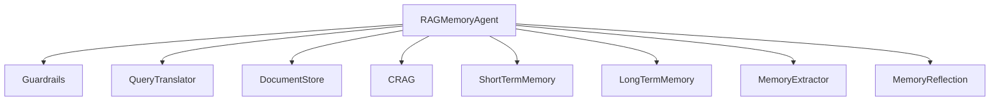
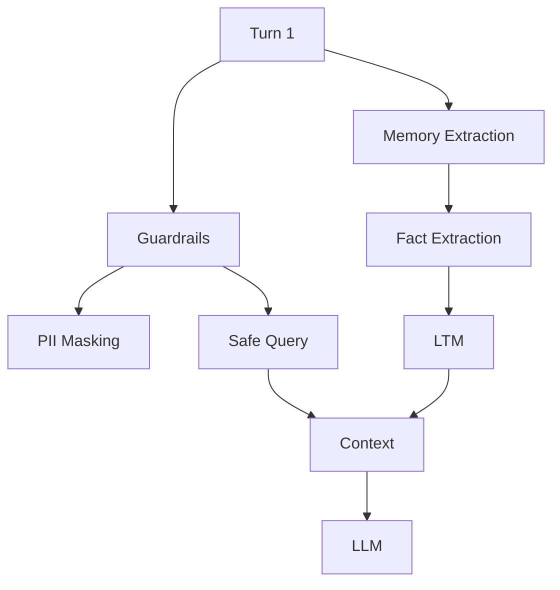
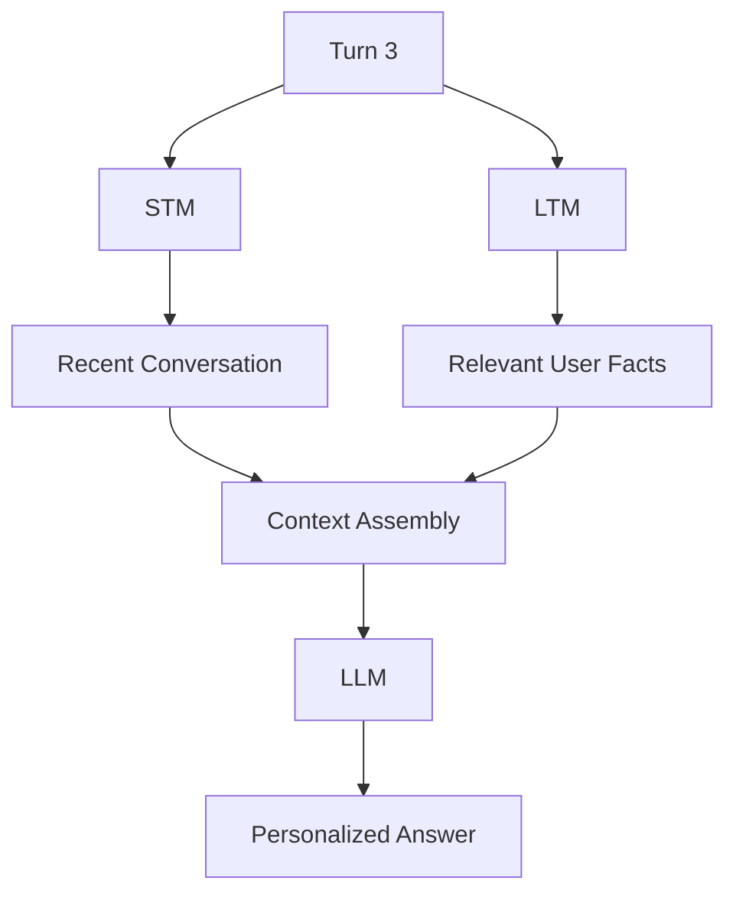
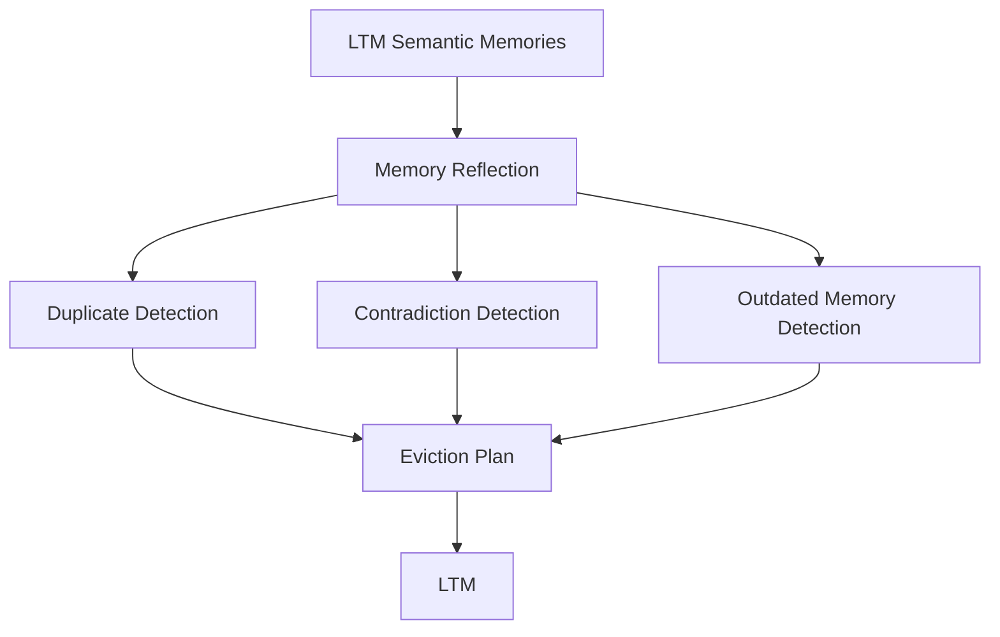
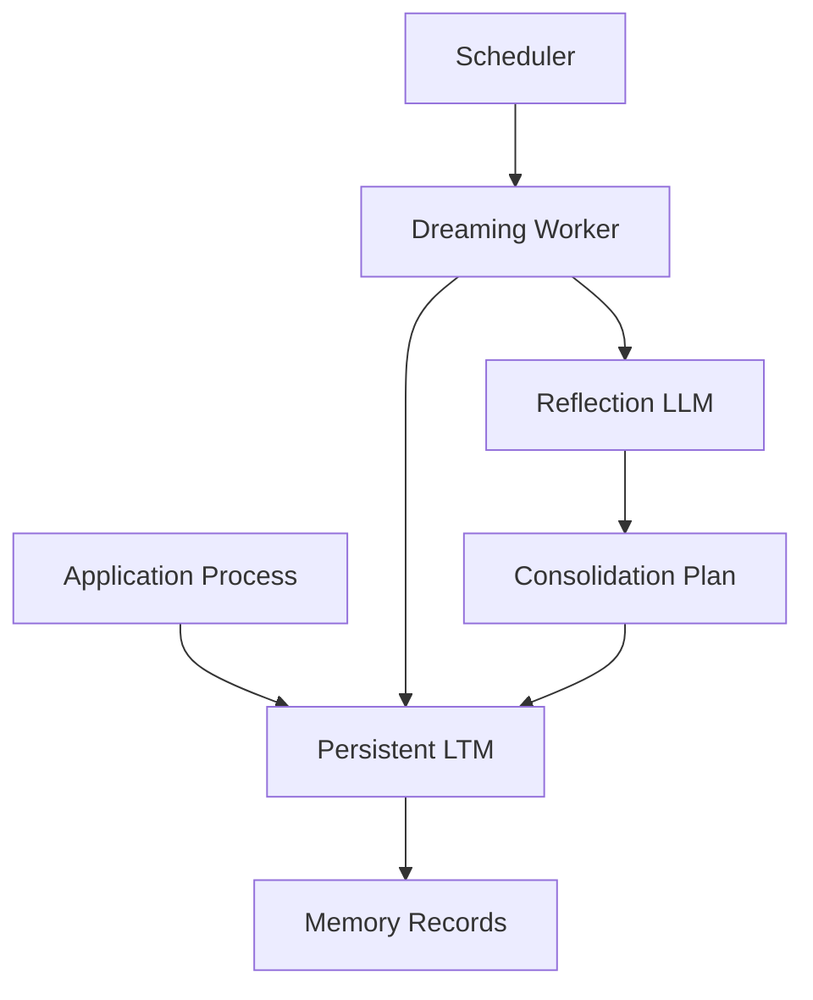
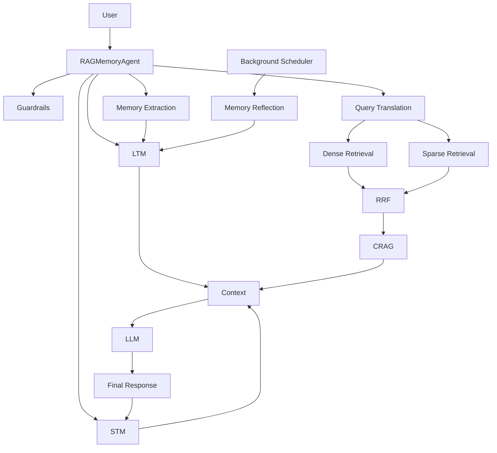
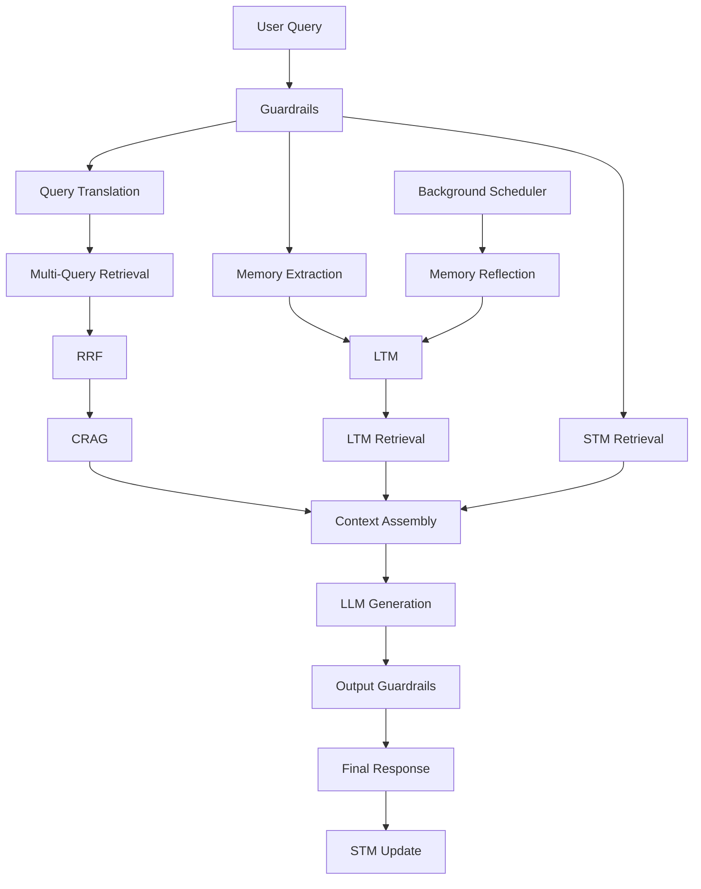

This chapter is a good fit as the final verification chapter. I would make a few corrections before using it: the scenario descriptions should match the actual code, `npm run dream` only instantiates `MemoryReflection` and does **not** execute a reflection pass, and the example output is not deterministic because LLM extraction/CRAG results can vary.

# Chapter 6 — CLI Demonstration Suite & Verification Workflows

## 1. Chapter Goal

The goal of this chapter is to create the main CLI entry point for the RAG + Memory Framework and verify that the components developed throughout the previous chapters work together as an end-to-end system.

We will create:

```text
index.js
```

The CLI will initialize the `RAGMemoryAgent`, seed the knowledge base, execute multiple conversational turns, inspect memory behavior, and finally run the Memory Reflection process.

In this chapter, we:

* Build the main `index.js` entry point.
* Seed the development knowledge base.
* Execute a four-turn RAG + Memory demonstration.
* Observe PII masking and memory extraction.
* Test technical knowledge retrieval.
* Test conversational continuity through STM.
* Test user-specific retrieval through LTM.
* Run the Memory Reflection process.
* Inspect the resulting semantic memory state.

---

## 🎯 Expected Outcome

Running:

```bash
npm start
```

should execute the complete demonstration:

```text
Application Start
      ↓
Create RAGMemoryAgent
      ↓
Seed Knowledge Base
      ↓
Turn 1 — User Profile + PII
      ↓
Turn 2 — Technical RAG Query
      ↓
Turn 3 — Memory + Conversation Query
      ↓
Turn 4 — Updated User Information
      ↓
Memory Reflection
      ↓
Inspect LTM
      ↓
Demonstration Complete
```

---

# 2. CLI Entry Point

The project root should contain:

```text
rag+memory/
├── index.js
├── package.json
└── src/
```

The `index.js` file acts as the application's entry point.

---

# 3. Implementation of `index.js`

## File Path

```text
rag+memory/index.js
```

## Complete Implementation

```javascript
import { RAGMemoryAgent } from "./src/agent/RAGMemoryAgent.js";

async function runDemo() {
  console.log(
    "=========================================================="
  );

  console.log(
    "🚀 STARTING ADVANCED RAG + AGENT MEMORY DEMONSTRATION"
  );

  console.log(
    "==========================================================\n"
  );

  // ---------------------------------------------------------
  // 1. Initialize Agent
  // ---------------------------------------------------------

  const agent = new RAGMemoryAgent();

  // ---------------------------------------------------------
  // 2. Seed Knowledge Base
  // ---------------------------------------------------------

  console.log(
    "📦 Seeding Knowledge Base with technical documents..."
  );

  await agent.seedKnowledgeBase();

  console.log(
    `✅ Knowledge base ready. ` +
    `Chunks: ${agent.docStore.chunks.length}\n`
  );

  // ---------------------------------------------------------
  // Shared User and Session
  // ---------------------------------------------------------

  const userId = "user_demo_001";
  const sessionId = "session_demo_001";

  // ---------------------------------------------------------
  // TURN 1
  // User introduction + PII + professional information
  // ---------------------------------------------------------

  console.log(
    "\n==================== TURN 1 ===================="
  );

  const result1 = await agent.handleQuery(
    userId,
    sessionId,
    "Hi, my name is Alex and my email is alex.dev@example.com. I am a senior GenAI engineer working on vLLM inference."
  );

  console.log(
    `\n💬 Assistant:\n${result1.response}`
  );

  // ---------------------------------------------------------
  // TURN 2
  // Technical question requiring RAG
  // ---------------------------------------------------------

  console.log(
    "\n==================== TURN 2 ===================="
  );

  const result2 = await agent.handleQuery(
    userId,
    sessionId,
    "How does vLLM handle KV cache fragmentation compared to standard operating system memory management?"
  );

  console.log(
    `\n💬 Assistant:\n${result2.response}`
  );

  console.log(
    `\n📊 CRAG Score: ${result2.cragScore}`
  );

  // ---------------------------------------------------------
  // TURN 3
  // STM + LTM contextual query
  // ---------------------------------------------------------

  console.log(
    "\n==================== TURN 3 ===================="
  );

  const result3 = await agent.handleQuery(
    userId,
    sessionId,
    "Can you summarize what technology stack and tools I am working on based on our conversation?"
  );

  console.log(
    `\n💬 Assistant:\n${result3.response}`
  );

  console.log(
    "\n🧠 LTM Facts Used:"
  );

  console.dir(
    result3.ltmFactsUsed,
    { depth: null }
  );

  // ---------------------------------------------------------
  // TURN 4
  // Updated user information
  // ---------------------------------------------------------

  console.log(
    "\n==================== TURN 4 ===================="
  );

  const result4 = await agent.handleQuery(
    userId,
    sessionId,
    "I have now moved from Tokyo to London and I focus primarily on agent memory dreaming architectures."
  );

  console.log(
    `\n💬 Assistant:\n${result4.response}`
  );

  // ---------------------------------------------------------
  // MEMORY REFLECTION
  // ---------------------------------------------------------

  console.log(
    "\n=========================================================="
  );

  console.log(
    "🌙 RUNNING MEMORY DREAMING & REFLECTION"
  );

  console.log(
    "=========================================================="
  );

  const reflectionResult =
    await agent.memoryReflection.runReflectionPass(
      userId
    );

  console.log(
    "\n✨ Reflection Summary:"
  );

  console.dir(
    reflectionResult,
    { depth: null }
  );

  // ---------------------------------------------------------
  // Inspect Semantic Memory
  // ---------------------------------------------------------

  console.log(
    "\n=========================================================="
  );

  console.log(
    "📊 CURRENT LONG-TERM SEMANTIC MEMORY"
  );

  console.log(
    "=========================================================="
  );

  const semanticMemory =
    agent.ltm.semanticMemory
      .filter(
        (fact) => fact.userId === userId
      )
      .map((fact) => ({
        id: fact.id,
        fact: fact.fact,
        category: fact.category,
        hitCount: fact.hitCount,
        createdAt: fact.createdAt,
        lastAccessedAt: fact.lastAccessedAt,
      }));

  console.dir(
    semanticMemory,
    { depth: null }
  );

  // ---------------------------------------------------------
  // Final Summary
  // ---------------------------------------------------------

  console.log(
    "\n=========================================================="
  );

  console.log(
    "✅ DEMONSTRATION COMPLETE"
  );

  console.log(
    "=========================================================="
  );
}

runDemo().catch((error) => {
  console.error(
    "\n❌ Execution Error:",
    error
  );

  process.exitCode = 1;
});
```

---

# 4. Understanding the CLI

The CLI is intentionally simple.

It does not implement any RAG or memory logic itself.

Instead, it creates the agent:

```javascript
const agent = new RAGMemoryAgent();
```

and delegates the actual work to:

```text
RAGMemoryAgent
```

This preserves the separation between:

```text
CLI
  ↓
Orchestrator
  ↓
Specialized Components
```

---

# 5. Step 1 — Agent Initialization

The first operation is:

```javascript
const agent = new RAGMemoryAgent();
```

The constructor initializes the complete system:



At this point, the components exist, but the knowledge base is still empty.

---

# 6. Step 2 — Knowledge Base Seeding

The CLI calls:

```javascript
await agent.seedKnowledgeBase();
```

This adds the example technical documents from Chapter 5.

The documents cover:

```text
vLLM
Agent Memory
Advanced RAG
```

Because `DocumentStore` uses chunking, the final number of chunks depends on the configured chunk size and the document lengths.

Therefore, do not assume:

```text
Chunks: 3
```

The CLI instead prints the actual count:

```text
Chunks: <actual number>
```

---

# 7. Step 3 — Shared User and Session

The demonstration uses:

```javascript
const userId = "user_demo_001";
const sessionId = "session_demo_001";
```

The same identifiers are reused across all four turns.

This is important.

### `userId`

Identifies the user whose long-term memory should be accessed.

### `sessionId`

Identifies the current conversation.

Therefore:

```text
userId
   ↓
LTM isolation

sessionId
   ↓
STM isolation
```

---

# 8. Turn 1 — User Profile + PII

The first message contains both personal information and technical information:

```text
Hi, my name is Alex and my email is alex.dev@example.com.
I am a senior GenAI engineer working on vLLM inference.
```

This tests several components simultaneously.



The email may be converted internally into a PII placeholder.

The memory extractor can also identify persistent information such as the user's professional role or technical interests.

The exact extracted facts depend on the configured LLM or mock implementation.

---

# 9. Turn 2 — Technical RAG Query

The second query focuses on vLLM:

```text
How does vLLM handle KV cache fragmentation compared to standard operating system memory management?
```

This is primarily a knowledge retrieval test.

The pipeline performs:

```text
Query
  ↓
Query Translation
  ↓
Multiple Retrieval Streams
  ↓
RRF
  ↓
CRAG
  ↓
Context Assembly
  ↓
LLM
```

The expected knowledge source is the seeded vLLM document.

The returned result also exposes the CRAG score:

```javascript
result2.cragScore
```

This is useful for observing retrieval quality during development.

---

# 10. Turn 3 — STM + LTM Context

The third query asks:

```text
Can you summarize what technology stack and tools I am working on based on our conversation?
```

This tests contextual personalization.

The agent can combine:

```text
Previous Conversation
        +
Stored User Facts
        +
Current Question
```

The information comes from two memory layers.

### STM

Recent conversation messages.

### LTM

Persistent semantic facts associated with the user.



The CLI prints the LTM facts used:

```javascript
console.dir(result3.ltmFactsUsed);
```

This makes it easier to verify whether memory retrieval is actually contributing to the response.

---

# 11. Turn 4 — Updated User Information

The fourth message introduces updated information:

```text
I have now moved from Tokyo to London and I focus primarily on agent memory dreaming architectures.
```

This is designed to create a potential memory update or contradiction scenario.

The MemoryExtractor may store facts such as:

```text
User moved from Tokyo to London.
User focuses on agent memory dreaming architectures.
```

The later Memory Reflection pass can inspect the user's accumulated semantic memories for:

* duplicates,
* contradictions,
* outdated information,
* low-value memories.

---

# 12. Memory Reflection

After the conversational turns, the CLI executes:

```javascript
const reflectionResult =
  await agent.memoryReflection.runReflectionPass(
    userId
  );
```

This is the project's "Memory Dreaming" stage.

The reflection engine examines the user's semantic memory.



The reflection result contains information such as:

```text
mergedCount
evictedCount
status
```

Remember that the current implementation primarily **resolves memory relationships by removing records**. It does not yet construct a new canonical merged memory.

---

# 13. Inspecting Long-Term Memory

The CLI finally prints the semantic memory associated with the current user.

Instead of printing the entire internal object—including embedding vectors—it selects useful fields:

```javascript
const semanticMemory =
  agent.ltm.semanticMemory
    .filter(
      (fact) => fact.userId === userId
    )
    .map((fact) => ({
      id: fact.id,
      fact: fact.fact,
      category: fact.category,
      hitCount: fact.hitCount,
      createdAt: fact.createdAt,
      lastAccessedAt: fact.lastAccessedAt,
    }));
```

This is preferable to:

```javascript
console.dir(agent.ltm.semanticMemory);
```

because the latter may expose large embedding arrays.

---

# 14. Running the Demonstration

Start the application with:

```bash
npm start
```

The `package.json` script from Chapter 0 maps this command to:

```bash
node index.js
```

The application should then execute all four turns automatically.

---

# 15. Expected Output

Do not expect an identical output every time when a real LLM is configured.

LLM-generated:

* extracted facts,
* query transformations,
* CRAG scores,
* final responses,
* reflection decisions

may vary.

A representative output structure is:

```text
==========================================================
🚀 STARTING ADVANCED RAG + AGENT MEMORY DEMONSTRATION
==========================================================

📦 Seeding Knowledge Base with technical documents...
✅ Knowledge base ready. Chunks: <number>

==================== TURN 1 ====================

🛡️ [Guardrails] Masked 1 PII token(s)

🧠 [LTM Fact Extraction] Extracted <N> fact(s)

💬 Assistant:
<generated response>

==================== TURN 2 ====================

📚 [Knowledge RAG] Performing multi-query retrieval...
⚖️ [CRAG] Score: <score>/10

💬 Assistant:
<generated response>

==================== TURN 3 ====================

🧠 [LTM] Retrieved <N> fact(s)
⏳ [STM] Retrieved <N> recent message(s)

💬 Assistant:
<generated response>

==================== TURN 4 ====================

🧠 [LTM Fact Extraction] Extracted <N> fact(s)

💬 Assistant:
<generated response>

==========================================================
🌙 RUNNING MEMORY DREAMING & REFLECTION
==========================================================

✨ Reflection Summary:
{
  ...
}

==========================================================
📊 CURRENT LONG-TERM SEMANTIC MEMORY
==========================================================

[
  ...
]

==========================================================
✅ DEMONSTRATION COMPLETE
==========================================================
```

The exact numbers and generated text are implementation- and model-dependent.

---

# 16. Testing the Background Dreaming Command

The project originally defines this script:

```json
"scripts": {
  "dream": "node -e \"import { MemoryReflection } from './src/memory/MemoryReflection.js'; console.log('Running Memory Dreaming offline background job...');\""
}
```

Therefore:

```bash
npm run dream
```

currently **does not execute `runReflectionPass()`**.

It only imports the class and prints a message.

This distinction is important.

---

# 17. Making `npm run dream` Execute a Real Reflection Job

If you want `npm run dream` to actually perform Memory Reflection, create a dedicated script.

For example:

```text
scripts/
└── dream.js
```

Implementation:

```javascript
import { LongTermMemory } from "../src/memory/LongTermMemory.js";
import { MemoryReflection } from "../src/memory/MemoryReflection.js";

async function runDreamingJob() {
  console.log(
    "🌙 Running Memory Dreaming background job..."
  );

  const ltm = new LongTermMemory();

  const reflection =
    new MemoryReflection(ltm);

  console.log(
    "ℹ️ No persistent memory store is configured."
  );

  console.log(
    "ℹ️ Reflection requires memories to already exist."
  );

  console.log(
    "🌙 Dreaming job finished."
  );
}

runDreamingJob().catch((error) => {
  console.error(
    "❌ Dreaming job failed:",
    error
  );

  process.exitCode = 1;
});
```

Then change the package script to:

```json
{
  "scripts": {
    "start": "node index.js",
    "dev": "node --watch index.js",
    "dream": "node scripts/dream.js"
  }
}
```

However, there is an architectural limitation.

Because the current `LongTermMemory` is an in-memory JavaScript store, a new process cannot access the memories created by `npm start`.

Therefore:

```text
npm start
   ↓
LTM exists in Process A
   ↓
Process exits
   ↓
LTM disappears

npm run dream
   ↓
New Process B
   ↓
New empty LTM
```

A true independent background dreaming worker requires **persistent memory storage**.

---

# 18. Production Memory Dreaming Architecture

In production, the architecture should look more like:



Possible production infrastructure includes:

```text
Application
   ↓
Database / Vector Store
   ↓
Memory Records

Scheduler
   ↓
Background Worker
   ↓
Memory Reflection
   ↓
Database Update
```

This allows the dreaming process to run independently of the application process.

---

# 19. Verification Matrix

The CLI demonstration covers several major subsystems.

| Scenario         | Components Tested                           |
| ---------------- | ------------------------------------------- |
| Turn 1           | Guardrails + Memory Extraction + LTM        |
| Turn 2           | Query Translation + RAG + RRF + CRAG        |
| Turn 3           | STM + LTM + Context Assembly                |
| Turn 4           | Memory Extraction + Potential Contradiction |
| Reflection       | MemoryReflection + LTM Maintenance          |
| Final Inspection | Semantic Memory State                       |

This gives us a simple integration test for the framework.

---

# 20. What We Have Built

At the end of Chapter 6, the architecture contains:



The framework now has a complete development-time execution path from:

```text
User Query
```

to:

```text
Personalized + Grounded Response
```

---

# 21. Important Limitations of the Current Demo

This demonstration is intentionally lightweight.

It is not yet a production deployment.

### 1. In-Memory Storage

STM, LTM, and the document store are process-local.

Restarting Node.js loses their state.

### 2. No Independent Worker

The current `npm run dream` command does not have access to the application's previous in-memory LTM.

### 3. CRAG Is Evaluation-Only

The current implementation evaluates retrieval quality but does not yet automatically perform a second retrieval cycle when the score is low.

### 4. LLM Output Is Non-Deterministic

Real LLM responses and extraction results can vary.

### 5. Sequential Retrieval

Several embedding and retrieval operations are executed sequentially. Production implementations can parallelize independent operations.

### 6. Memory Reflection Is Not True Consolidation

The current reflection implementation primarily removes redundant or outdated records. A more advanced system could create canonical consolidated memories.

### 7. PII Restoration Requires Care

The current guardrail can restore masked values in the final output. Production systems should carefully decide whether sensitive information should ever be restored.

---

# 22. Chapter Summary

Chapter 6 provides the development-time demonstration layer for the entire RAG + Memory Framework.

The CLI demonstrates:

```text
                    ┌──────────────┐
                    │   User       │
                    └──────┬───────┘
                           ↓
                  ┌─────────────────┐
                  │ RAGMemoryAgent  │
                  └────────┬────────┘
                           ↓
          ┌────────────────────────────────┐
          │       11-Step Pipeline         │
          └────────────────┬───────────────┘
                           ↓
                ┌────────────────────┐
                │ Grounded Response  │
                │ + User Memory      │
                └────────────────────┘
                           ↓
                  Memory Reflection
```

The project now demonstrates:

* Input guardrails
* PII masking
* Memory extraction
* Long-term semantic memory
* Short-term conversation memory
* Query rewriting
* Step-Back prompting
* Sub-query decomposition
* HyDE
* Dense retrieval
* Sparse retrieval
* Reciprocal Rank Fusion
* CRAG evaluation
* Context assembly
* LLM generation
* Memory reflection

---

# 23. Final Verification Checklist

Before considering the framework ready for the next stage, verify:

* [ ] `npm start` launches successfully.
* [ ] `RAGMemoryAgent` initializes correctly.
* [ ] Knowledge documents are seeded.
* [ ] The actual chunk count is displayed.
* [ ] PII is detected and masked.
* [ ] User facts can be extracted.
* [ ] Dense retrieval works.
* [ ] Sparse retrieval works.
* [ ] RRF produces fused results.
* [ ] CRAG returns an evaluation.
* [ ] LTM retrieves user-specific facts.
* [ ] STM maintains recent conversation history.
* [ ] Context assembly combines RAG + LTM + STM.
* [ ] LLM generation completes.
* [ ] Current conversation turns are stored in STM.
* [ ] Memory Reflection executes.
* [ ] Semantic memory can be inspected.
* [ ] Errors are surfaced correctly.

---

# 24. Final Architecture

The complete development architecture is:



The framework has now progressed from individual utilities and retrieval components to a complete orchestrated RAG + Memory application.

The next natural stage is to move from a **demo-oriented in-memory architecture** toward a **production architecture** with persistent vector storage, asynchronous jobs, observability, caching, stronger security, true corrective retrieval, and scalable memory management.

One correction is especially important: **`npm run dream` in your current `package.json` does not actually perform dreaming**—it only imports `MemoryReflection` and prints a message. Also, because LTM is currently in memory, a separate `npm run dream` process cannot reflect over the memories created by `npm start`. This chapter now makes that limitation explicit rather than claiming the background job is already production-grade.
