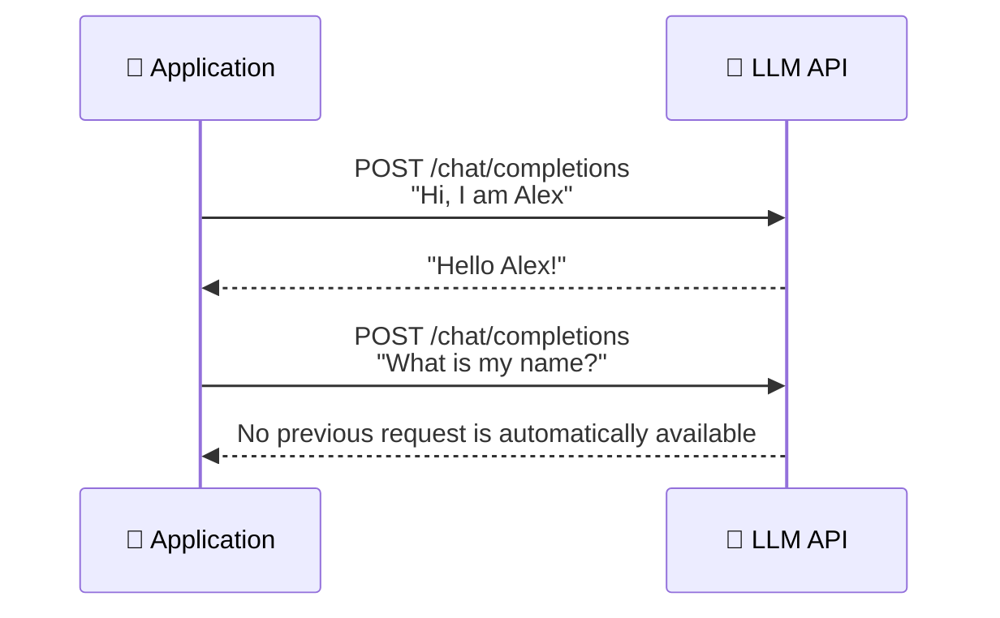
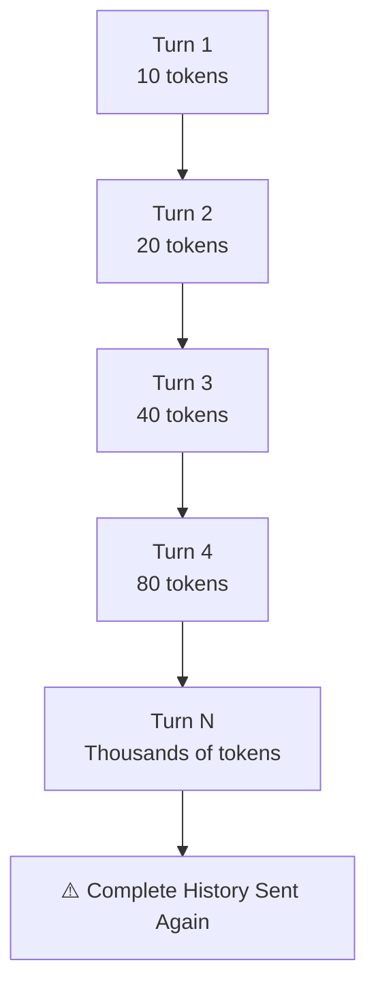
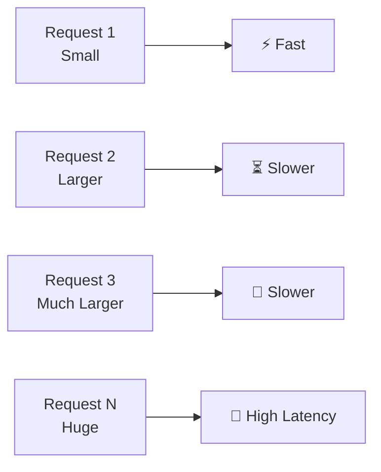
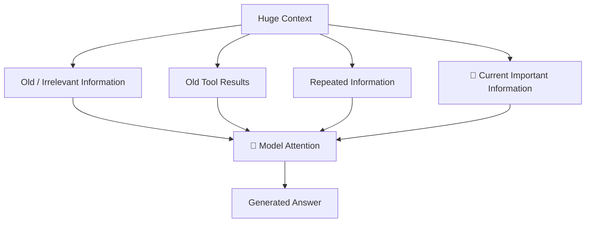

# 01 — Application-Level Memory & Context Limitations

> **Core Concept:** LLM APIs are generally **stateless**. The model does not automatically remember previous API requests. If an application needs conversation memory, the application must **store, manage, and selectively send context** with each request.

---

## 1. Stateless LLM API

A typical LLM interaction looks like this:



The important point is:

```text
Request 1 ──→ LLM
              ↓
           Response

Request 2 ──→ LLM
              ↓
        Does not automatically
        contain Request 1
```

The application is responsible for maintaining the conversation state.

---

# 2. Naive Application-Level Memory

The simplest solution is to keep every message in an array.

```javascript
const messages = [];

async function chatTurn(userQuery) {
  // 1. Store the user's message
  messages.push({
    role: "user",
    content: userQuery,
  });

  // 2. Send the complete conversation to the LLM
  const response = await callLLM(messages);

  // 3. Store the assistant's response
  messages.push({
    role: "assistant",
    content: response,
  });

  return response;
}
```

### What happens internally?

Suppose the conversation is:

```text
User:    Hi, I am Alex.
Assistant: Hello Alex!

User:    I am learning React Native.
Assistant: That's great!

User:    What is my name?
```

The third request may contain:

```javascript
[
  {
    role: "user",
    content: "Hi, I am Alex.",
  },
  {
    role: "assistant",
    content: "Hello Alex!",
  },
  {
    role: "user",
    content: "I am learning React Native.",
  },
  {
    role: "assistant",
    content: "That's great!",
  },
  {
    role: "user",
    content: "What is my name?",
  },
];
```

The LLM can answer correctly because the application **re-sent the previous conversation**.

---

# 3. The Problem With This Approach

The problem is not that the code doesn't work.

It **does work**.

The problem is that the amount of data sent to the LLM keeps increasing.



Every new request potentially contains everything that came before it.

This creates several production problems.

---

# 4. Context Window Exhaustion

Every LLM has a maximum amount of context it can process.

For example:

```text
System Instructions
        +
Conversation History
        +
Retrieved Documents
        +
Tool Results
        +
Current User Query
        +
Expected Output
        ↓
Total Context
```

Eventually:

```text
Total Context > Model Context Window
```

The request can then fail, or the application has to remove some information.

### Why agents make this worse

An agent may have:

* Long conversations
* Tool calls
* Tool results
* Retrieved documents
* System instructions
* Previous reasoning/state
* Multiple tasks

So context can grow much faster than in a simple chatbot.

---

# 5. Network Bandwidth & Latency

Consider a conversation containing **20,000 tokens**.

If the user sends one more message, the application may need to transmit:

```text
20,000 previous tokens
+
new user message
```

Even though most of those 20,000 tokens have not changed.

With repeated requests, this creates unnecessary:

```text
Application
    ↓
Large HTTP Payload
    ↓
LLM Server
    ↓
Processing
    ↓
Response
```

As history grows:



This matters especially for real-time applications where users expect low response latency.

---

# 6. Increasing Token Costs

LLM APIs commonly charge based on tokens processed.

If the application repeatedly sends old messages, those tokens may be processed again.

Conceptually:

```text
Request 1:
10 new tokens

Request 2:
10 old + 10 new = 20 tokens

Request 3:
20 old + 10 new = 30 tokens

Request 4:
30 old + 10 new = 40 tokens
```

The input grows even though each user message remains small.

A simplified total-input calculation is:

$$
\text{Total Input Tokens}
=========================

\sum_{t=1}^{N}
\left(
\text{System Tokens}
+
\text{History Tokens}_t
+
\text{Current Query Tokens}
\right)
$$

So the application should avoid sending information that is no longer necessary.

---

# 7. Attention Degradation

More context does not automatically mean better answers.

A large conversation can contain:

```text
Old questions
Old answers
Tool outputs
Temporary instructions
Irrelevant discussions
Repeated information
Current task
```

The model now has to identify what actually matters.

Conceptually:



This can contribute to attention dilution and "lost in the middle" behavior, where important information surrounded by large amounts of context may be harder for the model to use reliably.

---

# 8. The Real Production Problem

The naive implementation effectively does this:

```javascript
async function chatTurn(userQuery) {
  messages.push({
    role: "user",
    content: userQuery,
  });

  const response = await callLLM(messages);

  messages.push({
    role: "assistant",
    content: response,
  });

  return response;
}
```

The problem is:

```text
             Complete History
                    ↓
User Query → Application → LLM
                    ↑
             Complete History
                    ↑
              Every Request
```

The application is treating **all previous information as equally important**.

Production memory systems solve this by deciding:

> **What should be kept, what should be removed, and what should be retrieved only when needed?**

This leads to techniques such as:

```text
                    Application Memory
                           │
          ┌────────────────┼────────────────┐
          ↓                ↓                ↓
   Short-Term Memory  Long-Term Memory   Retrieval
          │                │                │
     Recent turns      Stored facts      Relevant context
          │                │                │
          └────────────────┼────────────────┘
                           ↓
                     Context Builder
                           ↓
                          LLM
```

The next step is therefore **Short-Term Memory (STM)**, where instead of sending the entire conversation, the application keeps only the most relevant recent interactions.
