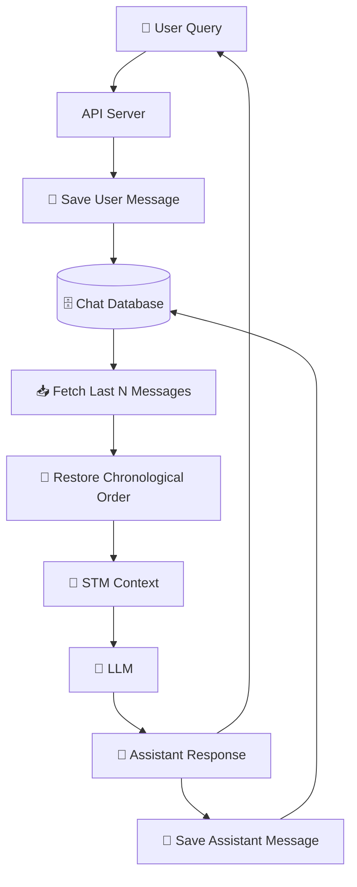
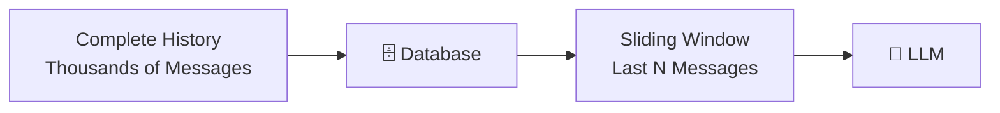

# 02 — Short-Term Memory (STM) & Sliding Windows

> **Core Concept:** Short-Term Memory (STM) keeps only the **recent conversational context** needed for the current interaction instead of sending the entire conversation history to the LLM.

---

## 1. Basic STM Implementation

A simple STM can be implemented using an array.

```javascript
const messages = [];

function addMessage(role, content) {
  messages.push({
    role,
    content,
  });
}
```

As the conversation continues, the array grows:

```text
Turn 1
Turn 2
Turn 3
Turn 4
...
Turn 20
```

But we don't want to send all 20 turns to the LLM.

So we introduce a **window size**.

```javascript
const WINDOW_SIZE = 4;

function getRecentMessages() {
  return messages.slice(-WINDOW_SIZE);
}
```

If the history is:

```text
Turn 1  Turn 2  Turn 3  Turn 4  Turn 5  Turn 6
```

and:

```javascript
WINDOW_SIZE = 4;
```

then:

```text
Turn 1  Turn 2
   ❌      ❌

Turn 3  Turn 4  Turn 5  Turn 6
  ✅      ✅      ✅      ✅
```

Only the latest four messages are sent to the LLM.

---

# 2. Complete Basic STM Flow

A basic implementation can look like this:

```javascript
const messages = [];
const WINDOW_SIZE = 10;

async function chat(userQuery) {
  // 1. Store the new user message
  messages.push({
    role: "user",
    content: userQuery,
  });

  // 2. Get only recent messages
  const recentMessages = messages.slice(-WINDOW_SIZE);

  // 3. Send the sliding window to the LLM
  const response = await callLLM(recentMessages);

  // 4. Store the assistant response
  messages.push({
    role: "assistant",
    content: response,
  });

  return response;
}
```

The important line is:

```javascript
messages.slice(-WINDOW_SIZE);
```

`slice(-10)` means:

> Start from the last 10 elements.

Therefore, older messages remain in storage but are not included in the current LLM request.

---

# 3. Why Keep Old Messages?

A common mistake is thinking that messages outside the window should be deleted.

Usually, they should **not** be deleted.

Instead:

```text
                 Database
                    │
        ┌───────────┴───────────┐
        ↓                       ↓
Complete History          Current STM
        │                       │
All previous messages     Last N messages
        │                       │
        │                       ↓
        │                      LLM
        │
        ↓
Potential future
LTM processing
```

The database acts as the **source of truth**, while STM is only the context currently selected for the LLM.

---

# 4. Persisting STM in a Database

For a production application, keeping the array only in memory is not enough.

If the server restarts:

```javascript
const messages = [];
```

everything stored in that array disappears.

Instead, messages can be persisted in a database.

For example:

```sql
CREATE TABLE chat_messages (
    message_id TEXT PRIMARY KEY,
    session_id TEXT NOT NULL,
    role TEXT NOT NULL,
    content TEXT NOT NULL,
    created_at TIMESTAMP NOT NULL
);
```

Each conversation message belongs to a session:

```text
session_id
    │
    ├── message 1
    ├── message 2
    ├── message 3
    ├── message 4
    └── ...
```

This allows the application to reconstruct STM whenever a new request arrives.

---

# 5. Fetching the Recent Messages

The application can query the database for the newest messages:

```sql
SELECT
    role,
    content
FROM chat_messages
WHERE session_id = 'user_session_101'
ORDER BY created_at DESC
LIMIT 20;
```

This gives the most recent 20 messages.

However, there is an important detail.

Because `DESC` returns newest messages first:

```text
20
19
18
17
...
1
```

the application normally reverses them before sending them to the LLM:

```javascript
const rows = await db.query(`
  SELECT role, content
  FROM chat_messages
  WHERE session_id = $1
  ORDER BY created_at DESC
  LIMIT $2
`, [sessionId, WINDOW_SIZE]);

const recentMessages = rows.reverse();
```

Now the LLM receives them in normal chronological order:

```text
17 → 18 → 19 → 20
```

---

# 6. Message Data Structure

A stored message can look like:

```json
{
  "message_id": "msg_9921",
  "session_id": "user_session_101",
  "role": "user",
  "content": "I prefer vegetarian food.",
  "created_at": "2026-08-24T18:20:00Z"
}
```

The important fields are:

### `message_id`

Uniquely identifies the message.

```text
msg_9921
```

### `session_id`

Identifies the conversation.

```text
user_session_101
```

This prevents messages from different conversations from being mixed together.

### `role`

Identifies who produced the message.

```text
"user"
"assistant"
"system"
"tool"
```

### `content`

Contains the actual message.

### `created_at`

Allows messages to be ordered chronologically.

---

# 7. Production STM Request Flow

A typical request now becomes:



The important separation is:

```text
Database = Complete Conversation History

STM = Recent Context Selected From That History
```

---

# 8. Sliding Window Behavior

Suppose:

```javascript
const WINDOW_SIZE = 4;
```

The database contains:

```text
Turn 1
Turn 2
Turn 3
Turn 4
Turn 5
Turn 6
Turn 7
Turn 8
```

The current STM contains:

```text
Turn 5
Turn 6
Turn 7
Turn 8
```

After Turn 9 arrives:

```text
Turn 1  Turn 2  Turn 3  Turn 4
        ❌ Outside STM

Turn 5  Turn 6  Turn 7  Turn 8  Turn 9
                ↓
             Window moves
```

The new STM becomes:

```text
Turn 6
Turn 7
Turn 8
Turn 9
```

This is why it is called a **sliding window**.

---

# 9. STM Solves the Context-Growth Problem

Without STM:

```text
Request 1 → 10 tokens
Request 2 → 20 tokens
Request 3 → 30 tokens
Request 4 → 40 tokens
...
Request N → Huge context
```

With STM:

```text
Request 1 → ≤ N messages
Request 2 → ≤ N messages
Request 3 → ≤ N messages
Request 4 → ≤ N messages
...
Request N → ≤ N messages
```

So the prompt size becomes much more predictable.



---

# 10. The Fundamental Limitation: Information Amnesia

STM solves context growth, but creates another problem.

Consider:

```text
Turn 1:
"My name is Sarah and I am allergic to nuts."

Turn 2
...
Turn 10
...
Turn 20
...
Turn 30:
"Recommend a dessert for my dinner party."
```

If the STM window only contains Turns 21–30:

```text
Turn 1
❌ Outside STM

Turn 21 → Turn 30
✅ Inside STM
```

The LLM no longer receives:

```text
"I am allergic to nuts."
```

So it may recommend:

```text
🥧 Pecan Pie
```

even though that is unsafe for the user's stated preference.

The issue is not that the database lost the information.

The information still exists:

```text
Database
   │
   ├── Turn 1 ← Important fact
   ├── Turn 2
   ├── ...
   └── Turn 30 ← Current conversation
```

The problem is that **STM does not retrieve Turn 1**.

---

# 11. STM vs Complete History

| Approach       | Context                           | Cost          | Old Information         |
| -------------- | --------------------------------- | ------------- | ----------------------- |
| Full History   | Everything                        | 🔴 High       | ✅ Available             |
| Sliding Window | Last N turns                      | 🟢 Controlled | ❌ Usually unavailable   |
| STM + LTM      | Recent + relevant old information | 🟢 Controlled | ✅ Selectively available |

The production solution is therefore not simply:

```text
"Keep more messages."
```

Instead, it is:

```text
Recent Conversation
        +
Relevant Long-Term Memories
        ↓
Context Builder
        ↓
LLM
```

---

# 12. Transition to Long-Term Memory

STM answers:

> **"What were we just talking about?"**

Long-Term Memory answers:

> **"What important information should I remember about this user or previous interactions?"**

For example:

```text
STM
├── Last 10 conversation messages
│
LTM
├── User prefers vegetarian food
├── User works with React Native
├── User prefers concise answers
└── Important previous events
```

The final context can then be assembled as:

```javascript
const context = [
  ...shortTermMemory,
  ...relevantLongTermMemories,
  {
    role: "user",
    content: userQuery,
  },
];

const response = await callLLM(context);
```

This leads to the next layer of an agent memory system:

**Long-Term Memory (LTM)** — storing important facts, events, and knowledge outside the short-term conversation window and retrieving them when they become relevant.
