# 📚 Week 04 — Day 07 Complete Master Notes

# 🧠 Agent Memory Systems + ⚡ High-Performance LLM Inference with vLLM

> These notes combine **all Day 07 topics into one complete document**: Application-Level Memory, Short-Term Memory, Long-Term Memory, RAG-based memory, Memory Dreaming, production memory architecture, `mem0`, GPU mechanics, inference engines, Prefill/Decode, and vLLM/PagedAttention.
>
> The goal is to understand **how conversational memory is built at the application level** and **how LLM inference is optimized at the GPU/server level**.

---

# 📑 Table of Contents

1. [Day 07 Big Picture](#1-day-07-big-picture)
2. [Application-Level Memory](#2-application-level-memory)
3. [Why Naive Chat History Fails](#3-why-naive-chat-history-fails)
4. [Short-Term Memory](#4-short-term-memory)
5. [Sliding Window Implementation](#5-sliding-window-implementation)
6. [Long-Term Memory](#6-long-term-memory)
7. [Memory Taxonomy](#7-memory-taxonomy)
8. [Fact Extraction](#8-fact-extraction)
9. [LTM + RAG](#9-ltm--rag)
10. [Complete Agent Memory Architecture](#10-complete-agent-memory-architecture)
11. [Memory Eviction](#11-memory-eviction)
12. [Memory Dreaming / Reflection](#12-memory-dreaming--reflection)
13. [Production Memory Optimization](#13-production-memory-optimization)
14. [`mem0` Memory Framework](#14-mem0-memory-framework)
15. [LLM Hardware Mechanics](#15-llm-hardware-mechanics)
16. [Training vs Inference](#16-training-vs-inference)
17. [Why Inference Is Memory-Bandwidth Bound](#17-why-inference-is-memory-bandwidth-bound)
18. [What Is an LLM Inference Engine?](#18-what-is-an-llm-inference-engine)
19. [Prefill Phase](#19-prefill-phase)
20. [Decode Phase](#20-decode-phase)
21. [Prefill vs Decode](#21-prefill-vs-decode)
22. [Disaggregated Prefill and Decode](#22-disaggregated-prefill-and-decode)
23. [vLLM](#23-vllm)
24. [PagedAttention](#24-pagedattention)
25. [Continuous Batching](#25-continuous-batching)
26. [Chunked Prefill](#26-chunked-prefill)
27. [Prefix Caching](#27-prefix-caching)
28. [Quantization](#28-quantization)
29. [MoE Optimization](#29-moe-optimization)
30. [vLLM Request Lifecycle](#30-vllm-request-lifecycle)
31. [Memory System vs Inference System](#31-memory-system-vs-inference-system)
32. [Complete End-to-End Architecture](#32-complete-end-to-end-architecture)
33. [Sample Code Mapping](#33-sample-code-mapping)
34. [Key Takeaways](#34-key-takeaways)

---

# 1. Day 07 Big Picture

Day 07 covers two different but connected problems:

### Problem 1 — How does an AI agent remember?

LLM APIs are generally stateless. The application must build memory around the model.

```text
User
 │
 ▼
Application
 │
 ├── Short-Term Memory
 │
 ├── Long-Term Memory
 │
 ├── Memory Retrieval
 │
 └── Memory Cleanup
 │
 ▼
LLM
```

### Problem 2 — How do we serve LLMs efficiently?

Running an LLM locally or in production requires efficient GPU utilization.

```text
User Requests
      │
      ▼
Inference Server
      │
      ├── Request Scheduling
      ├── Prefill
      ├── KV Cache Management
      ├── Decode
      └── Batching
      │
      ▼
GPU
```

The first half is primarily about **application architecture**.

The second half is primarily about **GPU/inference architecture**.

---

# 2. Application-Level Memory

## 2.1 LLM APIs Are Stateless

Consider a normal LLM API request:

```javascript
const response = await callLLM([
  {
    role: "user",
    content: "Hi, my name is Alex."
  }
]);
```

The model responds:

```text
Hello Alex!
```

Now imagine sending another request:

```javascript
const response = await callLLM([
  {
    role: "user",
    content: "What is my name?"
  }
]);
```

The second request does not automatically contain the previous conversation.

The application therefore needs to maintain state.

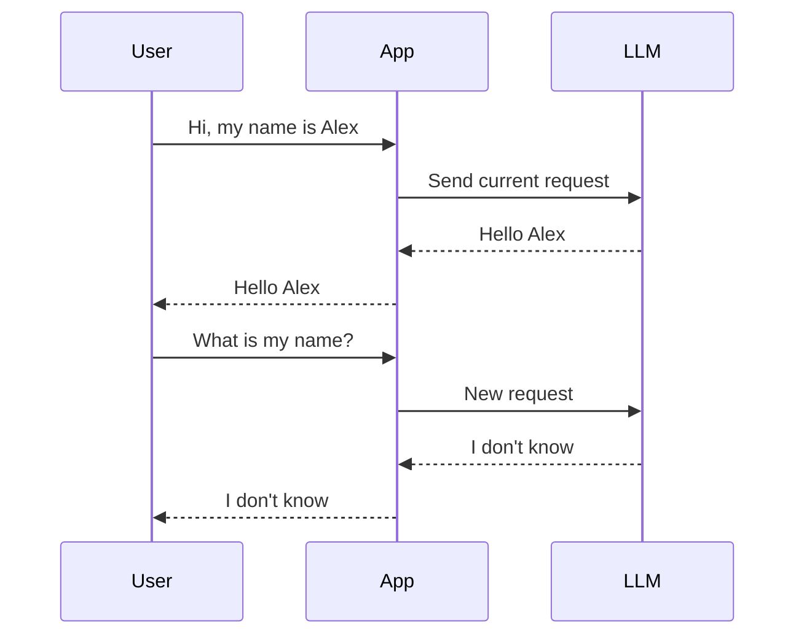

Therefore:

> **The application owns the conversation memory, not the stateless API request itself.**

---

# 3. Why Naive Chat History Fails

The simplest memory implementation is:

```javascript
const messages = [];

async function chatTurn(userQuery) {
  messages.push({
    role: "user",
    content: userQuery
  });

  const response = await callLLM(messages);

  messages.push({
    role: "assistant",
    content: response
  });

  return response;
}
```

Initially this works well.

But the array keeps growing:

```text
Request 1
  └── 2 messages

Request 10
  └── 20 messages

Request 100
  └── 200 messages

Request 1000
  └── 2000 messages
```

Eventually:

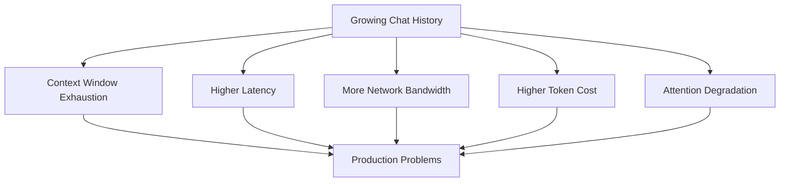

## 3.1 Context Window

Every model has a maximum context capacity.

If the application sends too much history:

```text
System Prompt
+
Old Messages
+
Recent Messages
+
Tools
+
Current Query
```

the total context can eventually exceed the model's supported limit.

---

## 3.2 Network Overhead

The application repeatedly sends old messages that have not changed.

```text
Request 1:
10 KB

Request 100:
500 KB

Request 1000:
5 MB
```

The same historical information may be transmitted again and again.

---

## 3.3 Token Cost

If the provider charges for input tokens, repeatedly sending old messages increases cost.

Conceptually:

```text
Total Input Cost
=
Σ Input Tokens Per Request × Price Per Token
```

---

## 3.4 Attention Degradation

More context does not automatically mean better reasoning.

Old irrelevant information can compete with the current instruction.

Therefore the application needs a strategy for deciding:

> **What information should be sent to the model right now?**

This leads to **Short-Term Memory and Long-Term Memory**.

---

# 4. Short-Term Memory

Short-Term Memory (STM) stores the most recent conversation.

For example:

```text
Full Conversation

Turn 1
Turn 2
Turn 3
Turn 4
Turn 5
Turn 6
Turn 7
Turn 8
Turn 9
Turn 10

        ↓

STM Window = Last 4 Turns

Turn 7
Turn 8
Turn 9
Turn 10
```

The database can still contain the complete history.

STM only determines what gets placed into the current LLM context.

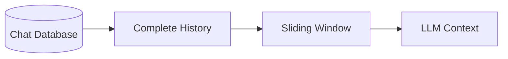

---

# 5. Sliding Window Implementation

A simple JavaScript implementation:

```javascript
const messages = [];

function addMessage(message) {
  messages.push(message);
}

function getRecentMessages(limit = 10) {
  return messages.slice(-limit);
}
```

Usage:

```javascript
addMessage({
  role: "user",
  content: "Hello"
});

addMessage({
  role: "assistant",
  content: "Hi!"
});

const recentMessages = getRecentMessages(10);
```

Only the latest messages are sent:

```javascript
await callLLM(recentMessages);
```

---

## 5.1 Database-Based STM

A production application should usually persist messages.

Example:

```sql
SELECT role, content
FROM chat_messages
WHERE session_id = 'user_session_101'
ORDER BY created_at DESC
LIMIT 20;
```

Example record:

```json
{
  "message_id": "msg_9921",
  "session_id": "user_session_101",
  "role": "user",
  "content": "I prefer vegetarian food.",
  "created_at": "2026-08-24T18:20:00Z"
}
```

The database contains the history, while the sliding window controls the context.

---

## 5.2 Problem With STM

STM deliberately forgets old conversation from the active prompt.

Example:

```text
Turn 1:
"My name is Sarah and I am allergic to nuts."

...

Turn 30:
"Recommend a dessert."
```

If Turn 1 is outside the STM window, the agent may not know about the allergy.

Therefore:

```text
STM
 ↓
Recent conversation

LTM
 ↓
Important persistent information
```

---

# 6. Long-Term Memory

Long-Term Memory stores information that should remain useful across conversations.

Examples:

```text
User's name
User preferences
User's profession
Dietary preferences
Important past decisions
Recurring behavior
Long-term relationships
```

Instead of remembering everything, the system extracts useful information.

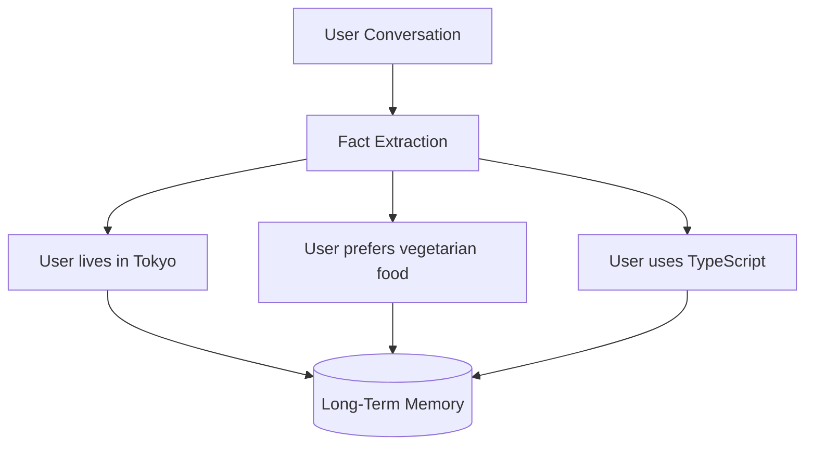

---

# 7. Memory Taxonomy

Long-Term Memory can be divided into different types.

| Type                  | Stores                         | Example                      |
| --------------------- | ------------------------------ | ---------------------------- |
| **Semantic Memory**   | Facts                          | User lives in Tokyo          |
| **Episodic Memory**   | Events                         | User visited Tokyo last year |
| **Graph Memory**      | Relationships                  | Alice works with Bob         |
| **Procedural Memory** | Repeated behavior/instructions | User prefers concise answers |

---

## 7.1 Semantic Memory

Stores relatively stable facts.

```json
{
  "userId": "user_123",
  "fact": "User prefers vegetarian food"
}
```

---

## 7.2 Episodic Memory

Stores experiences or events.

```json
{
  "event": "User planned a Tokyo trip",
  "timestamp": "2026-07-10"
}
```

---

## 7.3 Graph Memory

Useful when relationships are important.

```text
Alice
  │
  ├── works_with ──> Bob
  │
  └── manages ──> Project X
```

Graph databases such as Neo4j can represent these relationships.

---

# 8. Fact Extraction

The application can send conversations to a fact extraction process.

Input:

```text
"I just moved to Tokyo and I follow a gluten-free diet."
```

The extractor identifies:

```text
Fact 1:
User lives in Tokyo.

Fact 2:
User follows a gluten-free diet.
```

A simplified implementation might look like:

```javascript
async function extractFacts(conversation) {
  const prompt = `
Extract important long-term user facts.

Conversation:
${conversation}

Return structured facts.
`;

  return await callLLM(prompt);
}
```

The extracted facts can then be stored.

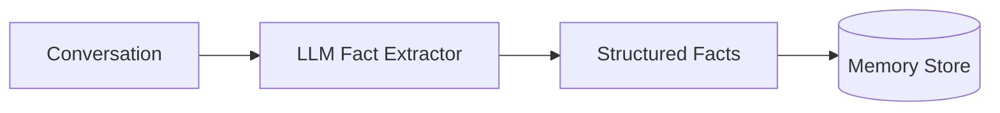

---

# 9. LTM + RAG

Storing thousands of memories directly inside every prompt would recreate the context problem.

Instead, retrieve only memories relevant to the current query.

```text
User Query
     │
     ▼
Create Query Embedding
     │
     ▼
Search Memory Vector DB
     │
     ▼
Top-K Relevant Memories
     │
     ▼
Build LLM Context
```

Conceptually:

```text
Retrieved Memories
=
TopK(
  Similarity(
    Embedding(Query),
    Memory Embeddings
  )
)
```

Example:

```text
Query:
"What should I order for dinner?"

Retrieved memories:

1. User follows a gluten-free diet.
2. User prefers vegetarian food.

Ignore unrelated memories:

- User uses TypeScript.
- User visited Tokyo.
- User likes photography.
```

---

# 10. Complete Agent Memory Architecture

The final prompt can combine multiple sources.

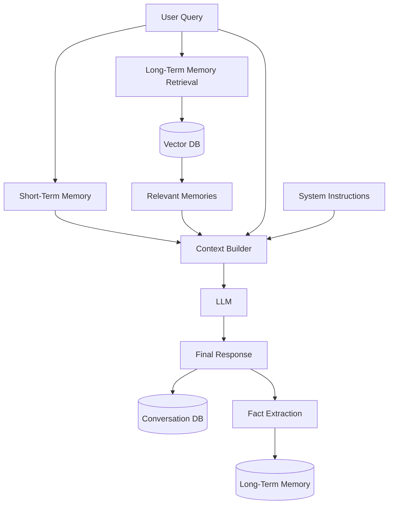

The resulting context is approximately:

```text
SYSTEM INSTRUCTIONS

+
RELEVANT LONG-TERM MEMORIES

+
RECENT CONVERSATION

+
CURRENT USER QUERY
```

This is much more scalable than sending the entire conversation.

---

# 11. Memory Eviction

Long-Term Memory can also become messy.

Over time:

```text
Memory 1:
User lives in New York.

Memory 2:
User lives in New York.

Memory 3:
User moved to Tokyo.

Memory 4:
User likes C++.

Memory 5:
User likes C++.

Memory 6:
User liked C++ five years ago.
```

Three common problems appear:

### Duplicate Memories

```text
User likes C++
User likes C++
User likes C++
```

### Contradictory Memories

```text
User lives in New York.
User lives in Tokyo.
```

### Stale Memories

```text
Old address
Old job
Old preference
```

A memory system therefore needs maintenance.

---

# 12. Memory Dreaming / Reflection

Memory Dreaming is an offline process that reviews stored memories and improves the memory store.

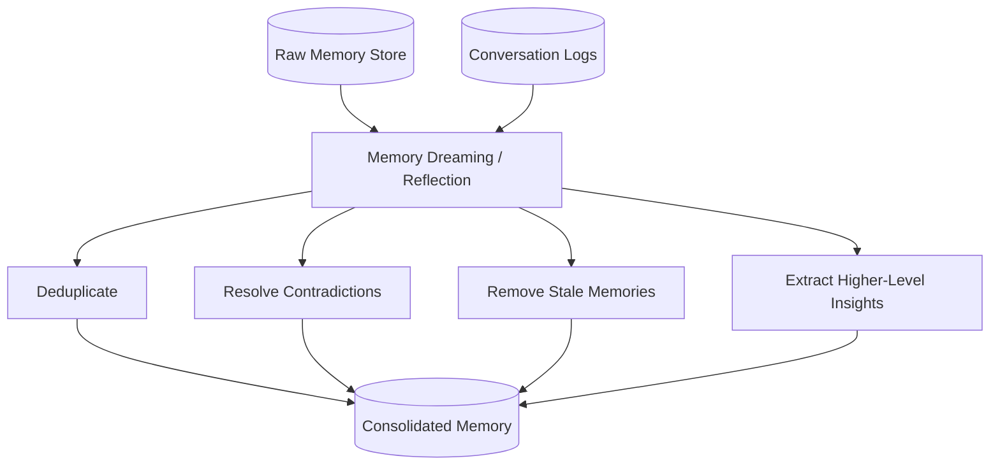

---

## 12.1 Deduplication

These:

```text
User likes TypeScript.
User likes TypeScript.
User likes TypeScript.
```

can become:

```text
User likes TypeScript.
```

---

## 12.2 Contradiction Resolution

Suppose:

```text
2025:
User lives in New York.

2026:
User moved to Tokyo.
```

The system can retain:

```text
Current location:
Tokyo
```

while preserving the original interaction logs.

---

## 12.3 Immutable Input Logs

A good architecture separates:

```text
Raw Logs
    ↓
Immutable historical record

Consolidated Memory
    ↓
Derived / replaceable state
```

The raw history should not be rewritten simply because the memory representation changes.

---

# 13. Production Memory Optimization

Memory introduces additional network calls.

A naive architecture might look like:

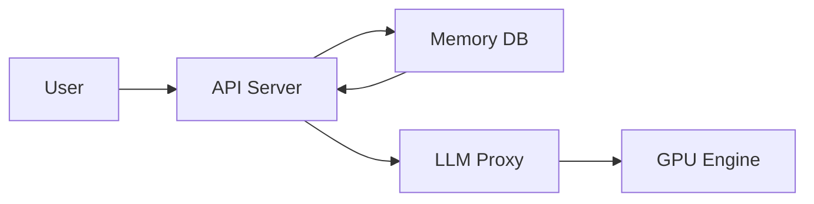

Every additional network hop can increase latency.

---

## 13.1 Eager Loading

Frequently used memories can be loaded before they're needed.

For example:

```text
User Authentication
       ↓
Load frequently-used profile facts
       ↓
Redis Cache
       ↓
Future requests
```

Instead of querying the database every time:

```javascript
const memory = await redis.get(`user:${userId}:memory`);
```

---

## 13.2 Hit-Score Tracking

A memory can have:

```text
Frequency = How often it is retrieved
Recency   = How recently it was used
```

A simple conceptual score:

```text
Hit Score = α × Frequency + β × Recency
```

Low-value memories can eventually be considered for eviction.

---

## 13.3 Agentic Memory Retrieval

Simple retrieval:

```text
Query
 ↓
Top-K memories
```

Complex retrieval:

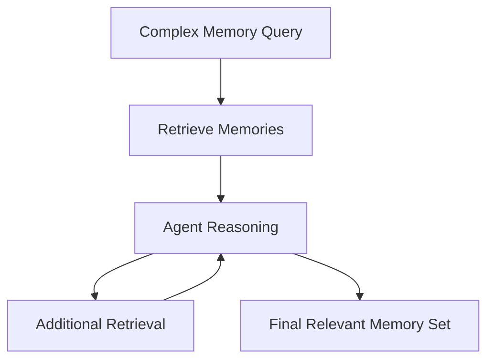

This is useful when the question requires multiple pieces of memory.

---

# 14. `mem0` Memory Framework

`mem0` provides a managed memory layer for AI applications.

Conceptually:

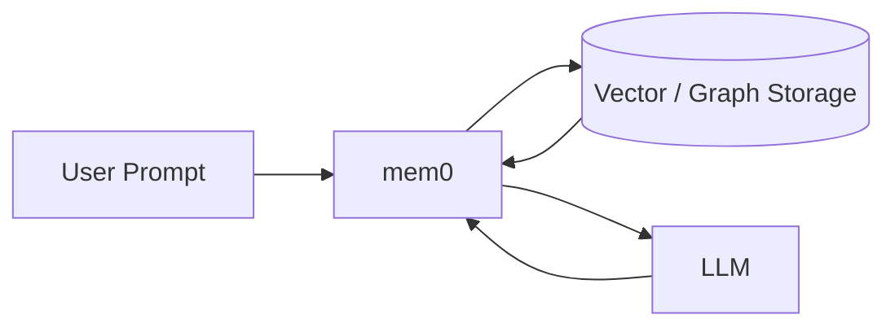

The memory layer can handle operations such as:

```text
Conversation
     ↓
Extract useful information
     ↓
Create/update memory
     ↓
Store memory
     ↓
Retrieve relevant memory later
     ↓
Provide memory to LLM
```

Common architectural layers include:

```text
User Memory
Session Memory
Agent Memory
```

It can also integrate with vector and graph storage systems.

---

# 15. LLM Hardware Mechanics

Now we move from **application memory** to **LLM inference infrastructure**.

An LLM requires large amounts of computational and memory resources.

Modern GPUs contain:

```text
GPU
├── Compute Cores
├── SRAM / Cache
└── HBM / VRAM
```

### HBM / VRAM

Stores large model weights and runtime data.

### SRAM / On-chip Memory

Very fast but much smaller.

### Compute Units

Perform mathematical operations such as matrix multiplication.

---

# 16. Training vs Inference

Training and inference behave differently.

| Dimension          | Training                             | Inference                  |
| ------------------ | ------------------------------------ | -------------------------- |
| Weights            | Updated                              | Mostly read-only           |
| Workload           | Large batches                        | Dynamic requests           |
| Main goal          | Optimize model                       | Generate responses         |
| Typical bottleneck | Compute                              | Often memory bandwidth     |
| Duration           | Training jobs                        | Continuous serving         |
| KV Cache           | Training has activations/state needs | Critical during generation |

---

## Training

During training:

```text
Input
 ↓
Forward Pass
 ↓
Prediction
 ↓
Loss
 ↓
Backpropagation
 ↓
Gradients
 ↓
Update Weights
```

This requires enormous computation.

---

## Inference

During inference:

```text
Prompt
 ↓
Model
 ↓
Generated Token
 ↓
Generated Token
 ↓
Generated Token
```

The weights are generally not updated.

---

# 17. Why Inference Is Memory-Bandwidth Bound

For every generated token, the GPU must access model weights and runtime state.

A simplified view:

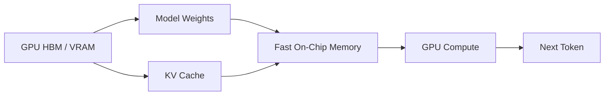

If the compute units finish their work faster than data can be supplied, the GPU spends time waiting for memory movement.

Therefore inference performance depends heavily on:

```text
Memory bandwidth
+
KV cache efficiency
+
Batching
+
Scheduling
+
Kernel efficiency
```

---

# 18. What Is an LLM Inference Engine?

An inference engine is the serving system responsible for efficiently running models for many requests.

It handles things such as:

```text
Request Management
      ↓
Scheduling
      ↓
Batching
      ↓
KV Cache
      ↓
GPU Execution
      ↓
Token Streaming
```

You can think of it conceptually as:

> **Infrastructure between the API requests and the GPU model execution.**

Instead of every application directly managing GPU execution:

```text
Application
     ↓
Inference Engine
     ↓
GPU
```

---

# 19. Prefill Phase

When a new request arrives:

```text
"Explain React Native navigation"
```

the entire input prompt must first be processed.

This is the **Prefill phase**.

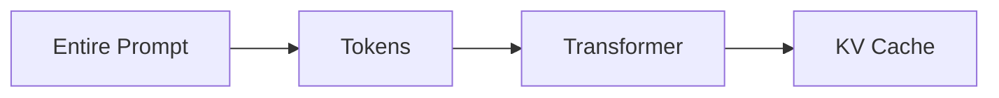

Prefill processes many input tokens in parallel.

For example:

```text
Input:

Token1
Token2
Token3
Token4
...
Token1000
```

The model processes the prompt and constructs the required attention state.

---

# 20. Decode Phase

After prefill, the model begins generating output.

Suppose the response starts:

```text
React Native
```

The model generates one token at a time:

```text
Token 1
   ↓
Token 2
   ↓
Token 3
   ↓
Token 4
   ↓
...
```

This is the **Decode phase**.

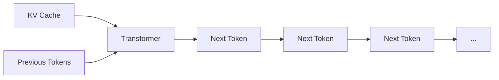

Decode is sequential and therefore has very different performance characteristics from prefill.

---

# 21. Prefill vs Decode

| Property     | Prefill                                   | Decode                     |
| ------------ | ----------------------------------------- | -------------------------- |
| Input        | Entire prompt                             | Previous generated tokens  |
| Processing   | Highly parallel                           | Sequential                 |
| Main concern | Compute throughput                        | Memory bandwidth / latency |
| Output       | Initial KV state + first generation state | Next token                 |
| Work pattern | Large computation                         | Repeated small steps       |

A simplified request:

```text
Prompt
  │
  ▼
PREFILL
  │
  ▼
KV Cache
  │
  ▼
DECODE
  │
  ├── Token 1
  ├── Token 2
  ├── Token 3
  └── ...
```

---

# 22. Disaggregated Prefill and Decode

At large scale, prefill and decode can be separated.

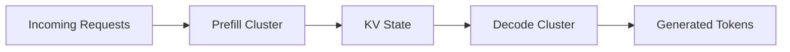

Why?

Because the two workloads have different resource requirements.

```text
Prefill:
High computation / throughput

Decode:
High memory bandwidth / low latency
```

Separate infrastructure can therefore optimize each workload independently.

---

# 23. vLLM

**vLLM** is a high-performance LLM inference and serving engine.

Its major goal is to improve:

```text
GPU utilization
+
Throughput
+
Memory efficiency
+
Request scheduling
```

A simplified architecture:

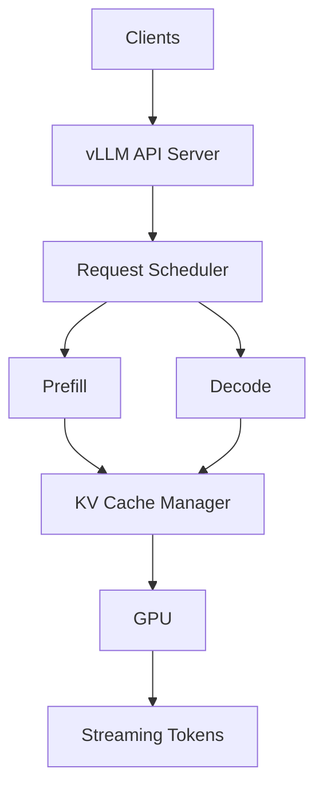

A major idea behind vLLM is efficient management of the **KV cache**.

---

# 24. PagedAttention

## 24.1 The KV Cache Problem

During generation, each request maintains a KV cache.

Imagine multiple requests:

```text
Request A → KV Cache
Request B → KV Cache
Request C → KV Cache
Request D → KV Cache
```

If memory is allocated inefficiently, free space can become fragmented.

```text
GPU Memory

[ A ][ A ][     ][ B ][ B ][    ][ C ][     ][ D ]
          ↑
      Fragmentation
```

This can result in wasted GPU memory.

---

## 24.2 PagedAttention

PagedAttention applies an idea similar to virtual memory.

Instead of requiring each sequence to occupy one large contiguous memory region:

```text
Sequence
    ↓
Logical Blocks
    ↓
Physical KV Blocks
```

Conceptually:

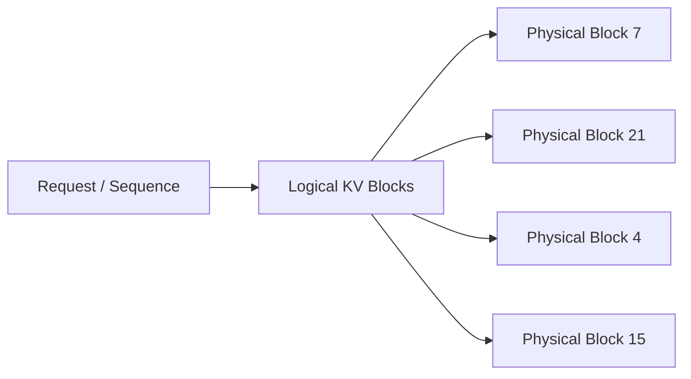

The logical sequence does not need to be physically contiguous.

This makes KV memory management more flexible and reduces waste.

---

# 25. Continuous Batching

Traditional batching might wait for a group of requests:

```text
Request A ─┐
Request B ─┼──> Batch ──> GPU
Request C ─┘
```

But requests don't all finish at the same time.

Continuous batching dynamically adds and removes requests while the system is running.

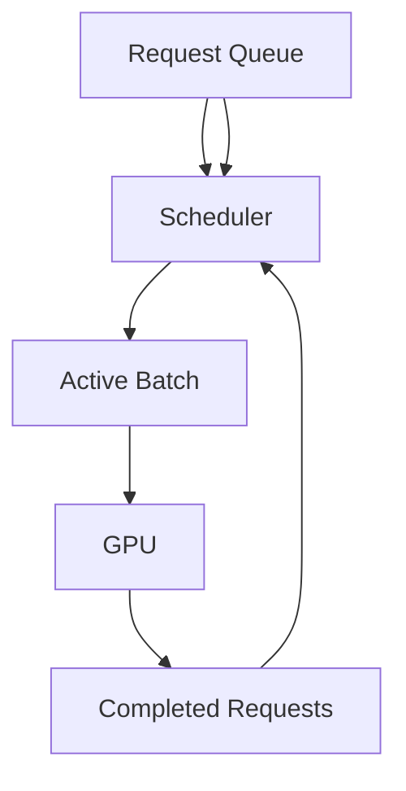

When one request finishes:

```text
Request A → finished
Request B → still generating
Request C → still generating
Request D → new request enters
```

The scheduler can keep the GPU busy.

---

# 26. Chunked Prefill

A very large prompt can consume substantial GPU resources.

Instead of processing the entire prompt at once:

```text
Huge Prompt
     ↓
Chunk 1
Chunk 2
Chunk 3
Chunk 4
```

the system can process prefill in chunks.

Conceptually:

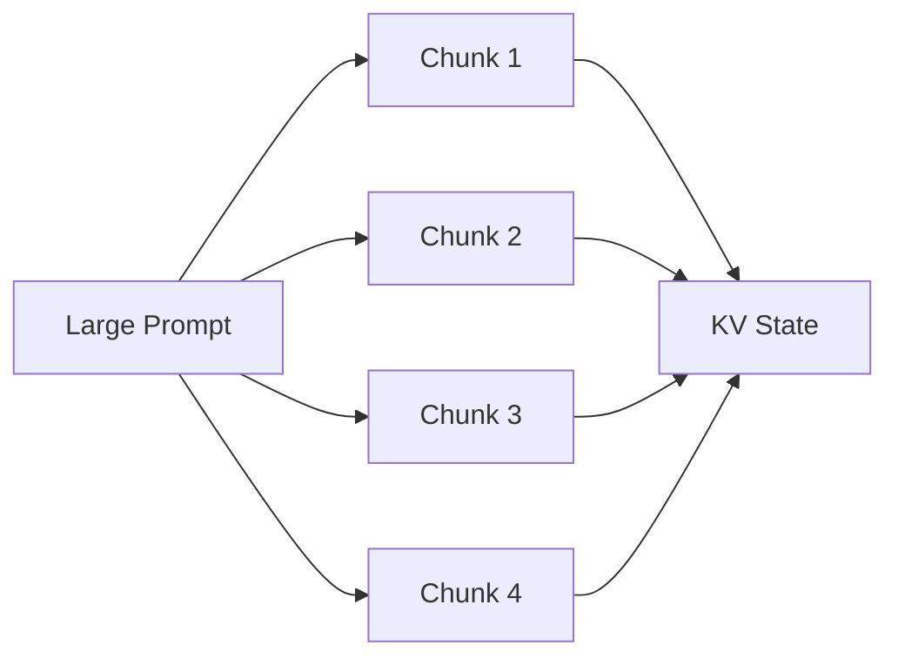

This allows better scheduling between long prompts and active generation workloads.

---

# 27. Prefix Caching

Many requests share the same beginning.

For example:

```text
System Prompt
+
Company Instructions
+
Tool Definitions
+
User Query
```

The first three components may remain identical across requests.

Instead of recomputing the same prefix repeatedly, prefix caching can reuse previously computed state.

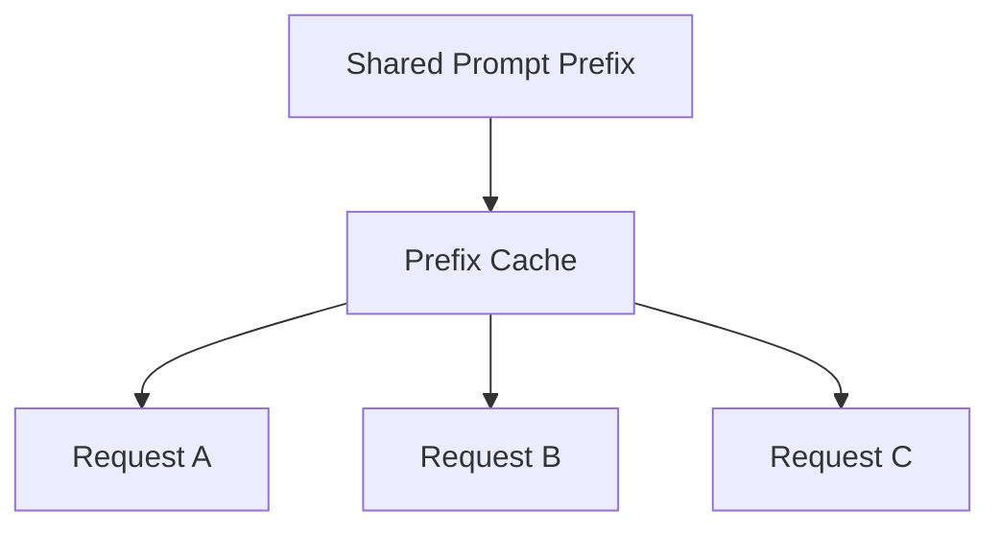

This can reduce repeated prefill work.

---

# 28. Quantization

Model weights normally use formats such as:

```text
FP32
FP16
BF16
```

Quantization represents weights using fewer bits.

For example:

```text
16-bit weights
      ↓
8-bit representation
```

or even lower precision depending on the method.

The goal is:

```text
Less Memory
     +
Lower Memory Bandwidth
     +
Potentially Higher Throughput
```

with an acceptable quality trade-off.

---

# 29. MoE Optimization

Mixture-of-Experts models contain multiple expert networks.

Instead of activating every expert for every token:

```text
Token
  ↓
Router
  ├── Expert 1
  ├── Expert 2
  ├── Expert 3
  └── Expert 4
```

only selected experts may process a particular token.

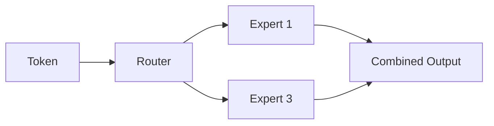

Efficient inference engines need specialized kernels and scheduling to take advantage of this architecture.

---

# 30. vLLM Request Lifecycle

A simplified vLLM request lifecycle looks like:

```mermaid
sequenceDiagram
    participant Client
    participant API as vLLM API
    participant Scheduler
    participant GPU

    Client->>API: Send prompt
    API->>Scheduler: Add request

    Scheduler->>GPU: Prefill prompt
    GPU-->>Scheduler: KV Cache created

    loop Token Generation
        Scheduler->>GPU: Decode next token
        GPU-->>Scheduler: Generated token
    end

    Scheduler-->>API: Stream tokens
    API-->>Client: Final response
```

The important components are:

```text
Request
   ↓
Scheduler
   ↓
Prefill
   ↓
KV Cache
   ↓
Decode
   ↓
Continuous Batching
   ↓
Streaming
```

---

# 31. Memory System vs Inference System

These are two completely different types of memory.

## Agent Memory

Concerned with:

```text
What should the agent remember?
```

Examples:

```text
User preferences
Past events
Facts
Relationships
```

## Model Runtime Memory

Concerned with:

```text
How can the GPU efficiently execute the model?
```

Examples:

```text
Model weights
KV cache
GPU memory
PagedAttention
Prefix cache
```

Compare:

| Agent Memory         | GPU Runtime Memory  |
| -------------------- | ------------------- |
| User facts           | Model weights       |
| Conversation history | KV cache            |
| Vector DB            | HBM/VRAM            |
| Memory retrieval     | GPU scheduling      |
| Memory eviction      | KV cache management |
| RAG                  | PagedAttention      |
| Dreaming             | Memory optimization |

---

# 32. Complete End-to-End Architecture

Putting everything together:

```mermaid
flowchart TD

    USER["👤 User"]

    USER --> API["Application API"]

    API --> STM["Short-Term Memory"]
    API --> RET["Long-Term Memory Retrieval"]

    STM --> DB1[("Conversation DB")]

    RET --> VDB[("Vector / Graph Memory")]
    VDB --> MEM["Relevant Memories"]

    STM --> CONTEXT["Context Builder"]
    MEM --> CONTEXT

    API --> CONTEXT

    CONTEXT --> LLMAPI["LLM Inference API"]

    LLMAPI --> ENGINE["Inference Engine / vLLM"]

    ENGINE --> SCHED["Scheduler"]

    SCHED --> PREFILL["Prefill"]
    PREFILL --> KV["KV Cache"]

    KV --> DECODE["Decode"]

    DECODE --> GPU["GPU / HBM"]

    GPU --> ENGINE
    ENGINE --> RESPONSE["Generated Response"]

    RESPONSE --> API
    API --> USER

    RESPONSE --> EXTRACT["Fact Extraction"]

    EXTRACT --> MEMORYSTORE[("Long-Term Memory")]

    MEMORYSTORE --> DREAM["🌙 Background Dreaming"]

    DREAM --> CLEAN["Consolidated Memory"]

    CLEAN --> VDB
```

This gives the complete picture:

```text
                AGENT MEMORY
                     │
                     ▼
User → Application → Context Builder
                     │
          ┌──────────┴──────────┐
          ▼                     ▼
         STM                   LTM
          │                     │
    Recent Messages       Relevant Facts
          │                     │
          └──────────┬──────────┘
                     ▼
                  LLM API
                     │
                     ▼
              INFERENCE ENGINE
                     │
              ┌──────┴──────┐
              ▼             ▼
           Prefill        Decode
              │             │
              └──────┬──────┘
                     ▼
                    GPU
```

---

# 33. Sample Code Mapping

The Day 07 sample implementations map directly to the concepts above.

```text
week04/
└── learning/
    └── day07/
        └── code/
            └── sample-code/
                │
                ├── 01_short_term_memory.js
                │
                ├── 02_long_term_memory_rag.js
                │
                ├── 03_memory_dreaming_reflection.js
                │
                └── 04_vllm_inference_client.js
```

---

## `01_short_term_memory.js`

Demonstrates:

```text
Conversation
     ↓
Message Storage
     ↓
Sliding Window
     ↓
Recent Context
```

Main concept:

> Keep recent messages while preventing unlimited prompt growth.

---

## `02_long_term_memory_rag.js`

Demonstrates:

```text
Conversation
     ↓
Fact Extraction
     ↓
Embedding
     ↓
Vector Store
     ↓
Query
     ↓
Relevant Memory Retrieval
     ↓
LLM Context
```

Main concept:

> Store persistent information separately and retrieve only what is relevant.

---

## `03_memory_dreaming_reflection.js`

Demonstrates:

```text
Raw Memories
     ↓
Reflection
     ├── Deduplication
     ├── Contradiction Resolution
     ├── Stale Memory Detection
     └── Consolidation
     ↓
Clean Memory Store
```

Main concept:

> Memory should be maintained rather than continuously appended forever.

---

## `04_vllm_inference_client.js`

Demonstrates application-side communication with a vLLM server.

Conceptually:

```javascript
const response = await fetch(
  "http://localhost:8000/v1/chat/completions",
  {
    method: "POST",
    headers: {
      "Content-Type": "application/json"
    },
    body: JSON.stringify({
      model: "your-model",
      messages: [
        {
          role: "user",
          content: "Explain vLLM."
        }
      ]
    })
  }
);
```

The application doesn't manually implement:

```text
PagedAttention
KV Cache
Continuous Batching
GPU Scheduling
```

The inference server handles those responsibilities.

---

# 34. Key Takeaways

## 🧠 Agent Memory

### 1. LLMs are generally stateless between requests

The application must provide the required context.

### 2. Sending the entire history is not scalable

It causes:

```text
Context Growth
Latency
Bandwidth
Cost
Attention Problems
```

### 3. STM solves recent-context management

```text
STM = Recent Conversation
```

### 4. LTM stores persistent information

```text
LTM = Important Long-Term Information
```

### 5. RAG retrieves only relevant memories

```text
Query
 ↓
Memory Search
 ↓
Relevant Memories
 ↓
LLM
```

### 6. Memory needs maintenance

Without cleanup:

```text
Duplicates
+
Contradictions
+
Stale Facts
```

### 7. Dreaming performs offline consolidation

```text
Raw Memory
 ↓
Reflection
 ↓
Clean Memory
```

### 8. Production systems optimize memory latency

Important techniques include:

```text
Caching
Pre-fetching
Hit-score tracking
Efficient retrieval
Background consolidation
```

---

# ⚡ LLM Inference

### 9. Training and inference have different bottlenecks

```text
Training
→ Primarily compute-heavy

Inference
→ Often strongly memory-bandwidth sensitive
```

### 10. Inference has two major phases

```text
Prompt
 ↓
Prefill
 ↓
KV Cache
 ↓
Decode
 ↓
Tokens
```

### 11. KV Cache is critical

It avoids recomputing attention state for previously processed tokens during generation.

### 12. vLLM optimizes LLM serving

Important technologies include:

```text
PagedAttention
Continuous Batching
Chunked Prefill
Prefix Caching
Quantization
Efficient Kernels
```

### 13. PagedAttention improves KV cache utilization

Instead of requiring large contiguous memory allocations:

```text
Logical KV Blocks
       ↓
Physical GPU Blocks
```

This helps reduce memory fragmentation and improves serving efficiency.

### 14. Continuous batching keeps the GPU busy

Requests can enter and leave the active batch dynamically.

### 15. Prefix caching avoids repeated computation

Shared prompt prefixes can be reused instead of recomputed.

---

# 🎯 The Entire Day 07 in One Mental Model

```mermaid
flowchart TD

    USER["👤 User"]

    USER --> APP["AI Application"]

    APP --> MEMORY["🧠 Agent Memory System"]

    MEMORY --> STM["Short-Term Memory"]
    MEMORY --> LTM["Long-Term Memory"]

    STM --> RECENT["Recent Conversation"]
    LTM --> RETRIEVE["Relevant Persistent Memories"]

    RECENT --> CONTEXT["Context Builder"]
    RETRIEVE --> CONTEXT

    APP --> CONTEXT

    CONTEXT --> INFERENCE["⚡ LLM Inference Engine"]

    INFERENCE --> PREFILL["Prefill"]
    PREFILL --> KV["KV Cache"]

    KV --> DECODE["Decode"]
    DECODE --> GPU["GPU / HBM"]

    GPU --> RESPONSE["Generated Tokens"]

    RESPONSE --> APP
    APP --> USER

    RESPONSE --> FACTS["Fact Extraction"]

    FACTS --> LTM

    LTM --> DREAM["🌙 Memory Dreaming"]

    DREAM --> LTM

    subgraph "Application-Level Memory"
        STM
        LTM
        DREAM
    end

    subgraph "LLM Serving Infrastructure"
        INFERENCE
        PREFILL
        KV
        DECODE
        GPU
    end
```

## 🧩 Final Mental Model

```text
                     AI AGENT
                        │
          ┌─────────────┴─────────────┐
          │                           │
     🧠 MEMORY                    ⚡ INFERENCE
          │                           │
     ┌────┴────┐                 ┌────┴────┐
     │         │                 │         │
    STM       LTM             Prefill    Decode
     │         │                 │         │
 Recent    RAG / Graph          KV Cache  Tokens
 Context   Memories                │
     │         │                   │
     └────┬────┘                   │
          │                         │
          └──────────┬──────────────┘
                     ▼
                    LLM
                     │
                     ▼
                  Response
```

**In short:**

> **Agent Memory decides what information the LLM should remember and retrieve. Inference infrastructure decides how efficiently the LLM can process that information and generate tokens.**
