# 📚 Week 04 — Day 07 Complete Master Notes

# 🧠 Agent Memory Systems + ⚡ High-Performance LLM Inference with vLLM

> **Goal:** Understand how to build memory-enabled AI agents and how LLM inference engines such as **vLLM** efficiently serve models on GPUs.

This single document combines the **main class + extra class** topics into one complete learning guide, including concepts, architecture, implementation patterns, code examples, and Mermaid diagrams.

---

# 📑 Table of Contents

### 🧠 Part A — Agent Memory

1. [Application-Level Memory](#1-application-level-memory)
2. [Why Naive Chat History Fails](#2-why-naive-chat-history-fails)
3. [Short-Term Memory (STM)](#3-short-term-memory-stm)
4. [Sliding Window Implementation](#4-sliding-window-implementation)
5. [Long-Term Memory (LTM)](#5-long-term-memory-ltm)
6. [Memory Taxonomy](#6-memory-taxonomy)
7. [Fact Extraction](#7-fact-extraction)
8. [Vector RAG for Memory](#8-vector-rag-for-memory)
9. [STM + LTM Context Assembly](#9-stm--ltm-context-assembly)
10. [Memory Eviction](#10-memory-eviction)
11. [Memory Dreaming / Reflection](#11-memory-dreaming--reflection)
12. [Memory Hit Scores](#12-memory-hit-scores)
13. [Production Memory Architecture](#13-production-memory-architecture)
14. [mem0](#14-mem0)

### ⚡ Part B — LLM Inference

15. [GPU Hardware and LLMs](#15-gpu-hardware-and-llms)
16. [Training vs Inference](#16-training-vs-inference)
17. [What is an Inference Engine?](#17-what-is-an-inference-engine)
18. [Prefill Phase](#18-prefill-phase)
19. [Decode Phase](#19-decode-phase)
20. [KV Cache](#20-kv-cache)
21. [Disaggregated Prefill and Decode](#21-disaggregated-prefill-and-decode)
22. [What is vLLM?](#22-what-is-vllm)
23. [PagedAttention](#23-pagedattention)
24. [Continuous Batching](#24-continuous-batching)
25. [Chunked Prefill](#25-chunked-prefill)
26. [Prefix Caching](#26-prefix-caching)
27. [Quantization](#27-quantization)
28. [MoE Optimization](#28-moe-optimization)
29. [vLLM Client Example](#29-vllm-client-example)
30. [Complete Production Architecture](#30-complete-production-architecture)
31. [Important Takeaways](#31-important-takeaways)

---

# PART A — 🧠 AGENT MEMORY SYSTEMS

# 1. Application-Level Memory

The first thing to understand is that an LLM API is generally **stateless**.

Suppose the user says:

```text
User: Hi, my name is Aminul.
```

The model responds:

```text
Assistant: Nice to meet you, Aminul!
```

Later the user asks:

```text
User: What is my name?
```

The model cannot inherently know that the previous request happened unless the application provides the relevant conversation context again.

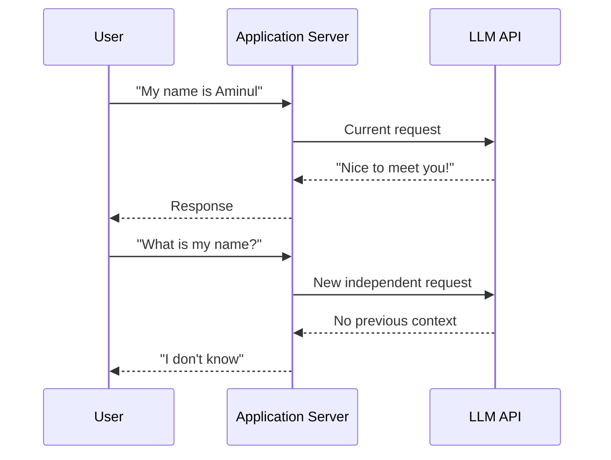

Therefore:

> **The application must implement memory.**

A simplified architecture is:

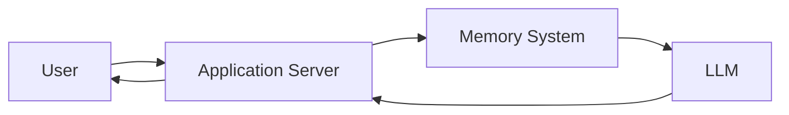

---

# 2. Why Naive Chat History Fails

The simplest implementation is to store every message in an array.

```javascript
const messages = [];

async function chatTurn(userQuery) {
  messages.push({
    role: "user",
    content: userQuery,
  });

  const response = await callLLM(messages);

  messages.push({
    role: "assistant",
    content: response,
  });

  return response;
}
```

Initially this works well.

```text
Turn 1
User: Hello

Turn 2
User: My name is Aminul

Turn 3
User: I am learning GenAI
```

The next request receives:

```text
Hello
My name is Aminul
I am learning GenAI
New user question...
```

But the history keeps growing.

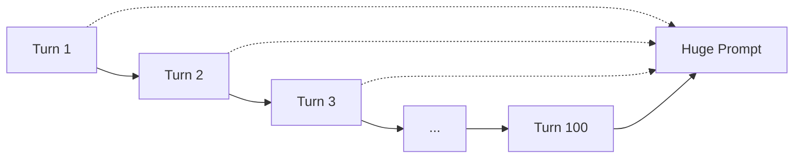

This creates four major problems.

### 2.1 Context Limit

Eventually:

```text
Conversation tokens > Model context window
```

The request can fail or earlier information may need to be removed.

### 2.2 Network Overhead

The same old messages are repeatedly transmitted.

```text
Request 1 → 1,000 tokens
Request 2 → 2,000 tokens
Request 3 → 3,000 tokens
...
Request 100 → huge payload
```

### 2.3 Cost

If the provider charges for input tokens, repeatedly sending old history increases cost.

Conceptually:

```text
Total Input Cost
=
Σ(Input Tokens × Price Per Token)
```

### 2.4 Attention Degradation

More context does not automatically mean better answers.

The model has to process:

```text
Old irrelevant conversations
        +
Recent conversation
        +
System instructions
        +
Tools
        +
Current question
```

Therefore, production systems need **memory management** rather than simply storing everything in the prompt.

---

# 3. Short-Term Memory (STM)

**Short-Term Memory** stores the most recent conversation context.

Instead of sending 500 messages, we might send only the last 10–20 messages.

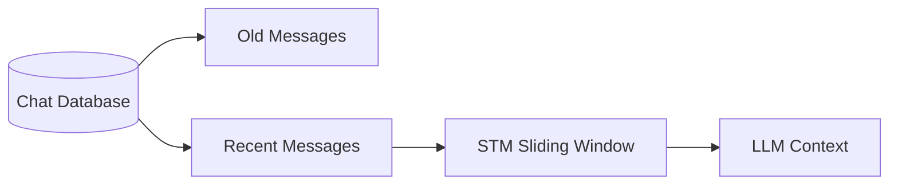

For example:

```text
Database:

Turn 1
Turn 2
Turn 3
...
Turn 17
Turn 18
Turn 19
Turn 20
```

If:

```text
N = 4
```

STM contains:

```text
Turn 17
Turn 18
Turn 19
Turn 20
```

---

# 4. Sliding Window Implementation

A basic JavaScript implementation:

```javascript
class ShortTermMemory {
  constructor(maxMessages = 10) {
    this.maxMessages = maxMessages;
    this.messages = [];
  }

  addMessage(role, content) {
    this.messages.push({
      role,
      content,
    });

    if (this.messages.length > this.maxMessages) {
      this.messages.shift();
    }
  }

  getMessages() {
    return this.messages;
  }
}
```

Usage:

```javascript
const memory = new ShortTermMemory(4);

memory.addMessage("user", "Hello");
memory.addMessage("assistant", "Hi!");
memory.addMessage("user", "My name is Aminul");
memory.addMessage("assistant", "Nice to meet you");

console.log(memory.getMessages());
```

When a fifth message arrives:

```javascript
memory.addMessage("user", "I am learning GenAI");
```

The oldest message is removed.

```text
Before:

[1] Hello
[2] Hi!
[3] My name is Aminul
[4] Nice to meet you

After:

[2] Hi!
[3] My name is Aminul
[4] Nice to meet you
[5] I am learning GenAI
```

---

## Database Persistence

In production, STM should not live only in application memory.

A database can store:

```sql
CREATE TABLE chat_messages (
    message_id TEXT PRIMARY KEY,
    session_id TEXT,
    role TEXT,
    content TEXT,
    created_at TIMESTAMP
);
```

Then retrieve the latest messages:

```sql
SELECT role, content
FROM chat_messages
WHERE session_id = 'session_101'
ORDER BY created_at DESC
LIMIT 20;
```

The application reverses the result if chronological order is required.

```javascript
const messages = rows.reverse();
```

---

# 5. The Problem with STM

STM solves context growth but creates **memory amnesia**.

Imagine:

```text
Turn 1:
"My name is Sarah and I am allergic to nuts."

...

Turn 30:
"Recommend a dessert."
```

If Turn 1 is outside the STM window, the agent might not know about the allergy.

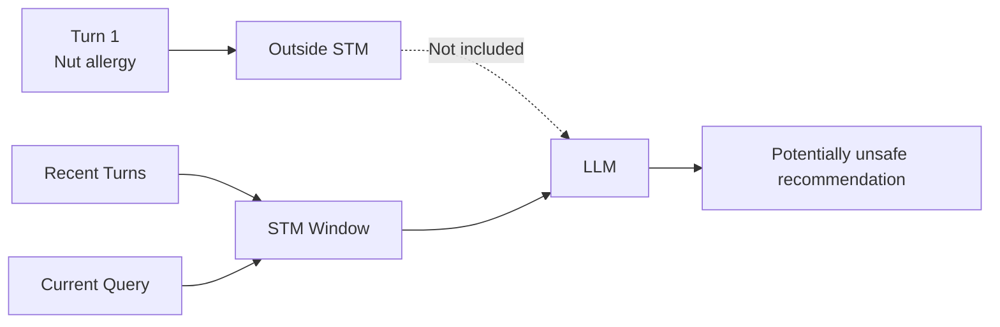

This creates the need for:

# Long-Term Memory

---

# 6. Long-Term Memory (LTM)

Long-Term Memory stores information that should survive beyond the current conversation window.

Examples:

```text
User's name
User preferences
User's technical interests
Past important decisions
Important events
Relationships between entities
```

Instead of storing everything directly in the prompt, we retrieve only relevant memories.

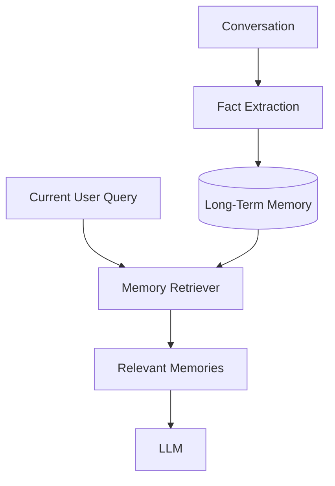

---

# 7. Fact Extraction

Not every sentence should become permanent memory.

For example:

```text
User:
"Today I am drinking coffee."
```

This probably should not become a permanent user fact.

But:

```text
"I am vegetarian."
```

is potentially useful long-term information.

An LLM-based extractor can transform conversations into structured facts.

```javascript
const extractionPrompt = `
Extract only useful long-term user facts
from the following conversation.

Conversation:
${conversation}

Return JSON.
`;
```

Possible result:

```json
{
  "facts": [
    {
      "text": "User follows a vegetarian diet.",
      "type": "preference"
    },
    {
      "text": "User is learning GenAI.",
      "type": "interest"
    }
  ]
}
```

Those facts can then be stored.

---

# 8. Memory Taxonomy

Long-term memory can be divided into different types.

| Type     | Stores            | Example                    |
| -------- | ----------------- | -------------------------- |
| Semantic | Facts/preferences | User prefers TypeScript    |
| Episodic | Events            | User attended a conference |
| Graph    | Relationships     | Alice manages Project X    |

---

## Semantic Memory

Stores stable facts.

```json
{
  "user_id": "user_101",
  "fact": "User prefers TypeScript",
  "category": "preference"
}
```

---

## Episodic Memory

Stores events.

```json
{
  "user_id": "user_101",
  "event": "Started learning GenAI",
  "timestamp": "2026-08-20"
}
```

---

## Graph Memory

Useful when relationships become important.

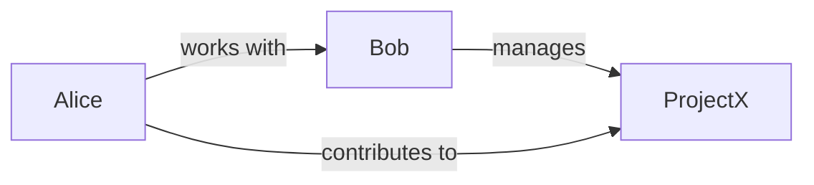

A graph database such as Neo4j can represent these relationships naturally.

---

# 9. Vector RAG for Memory

A major problem is that a user may have thousands of memories.

We should not send all of them to the LLM.

Instead:

```text
Current Query
      ↓
Embedding
      ↓
Vector Search
      ↓
Top-K Relevant Memories
      ↓
LLM
```

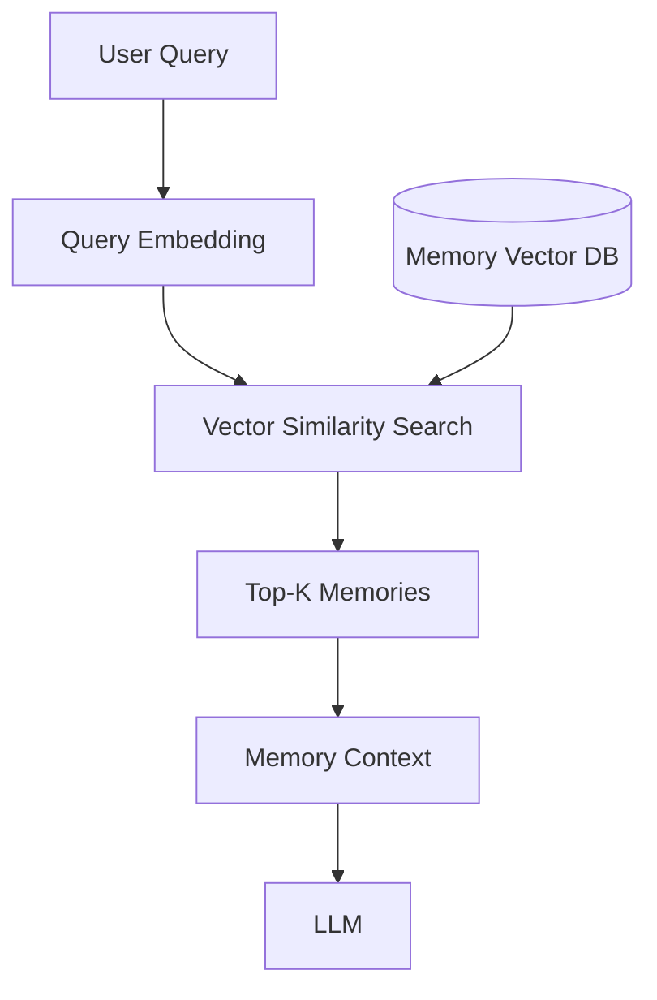

Conceptually:

```text
similarity(query, memory)
```

can be based on cosine similarity:

```text
cosine(A, B) =
(A · B) / (||A|| × ||B||)
```

The system selects the highest-scoring memories.

---

# 10. STM + LTM Context Assembly

The final prompt can combine:

```text
System Instructions
+
Relevant Long-Term Memories
+
Recent STM Messages
+
Current Query
```

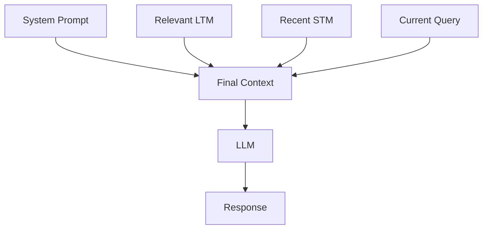

Example:

```text
SYSTEM:
You are a helpful personal assistant.

LONG-TERM MEMORY:
- User follows a vegetarian diet.
- User lives in Tokyo.

RECENT CONVERSATION:
- User: I am going out for dinner.

CURRENT QUERY:
- What should I order?
```

The LLM now has enough relevant context without receiving the entire historical conversation.

---

# 11. Memory Eviction

Over time, memory stores become messy.

Typical problems:

```text
Duplicate memories
Contradictory memories
Old memories
Irrelevant memories
Low-value memories
```

Example:

```text
Memory 1:
User lives in New York.

Memory 2:
User lives in New York.

Memory 3:
User moved to Tokyo.

Memory 4:
User lived in London in 2019.
```

Without cleanup, retrieval becomes noisy.

---

# 12. Memory Hit Scores

A useful production strategy is tracking how often memories are actually used.

For example:

```javascript
{
  text: "User prefers TypeScript",
  hitCount: 14,
  lastAccessed: "2026-08-24T10:00:00Z"
}
```

We can conceptually calculate a score from:

```text
Frequency + Recency
```

For example:

```text
HitScore = α × Frequency + β × Recency
```

High-score memories:

```text
Frequently used
Recently accessed
```

Low-score memories:

```text
Rarely used
Very old
```

Low-value memories can become candidates for eviction.

---

# 13. Memory Dreaming / Reflection

Instead of cleaning memory during every user request, a background process can periodically consolidate it.

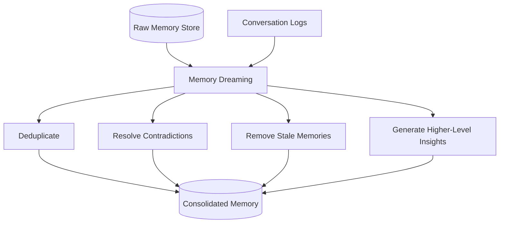

The key idea is:

> **User requests stay fast while expensive memory maintenance happens asynchronously.**

---

## Example

Suppose the database contains:

```text
1. User lives in NYC
2. User lives in NYC
3. User moved to San Francisco
4. User moved to San Francisco
```

Dreaming can consolidate:

```text
User currently lives in San Francisco.
```

---

## Important Principle: Immutable Raw Logs

Do not destroy the original interaction history.

Instead:

```text
Raw Logs
   ↓
Reflection
   ↓
Candidate Consolidated Memory
```

This provides an audit trail and allows the system to rebuild memory if needed.

---

# 14. Production Memory Architecture

A complete memory system can look like this:

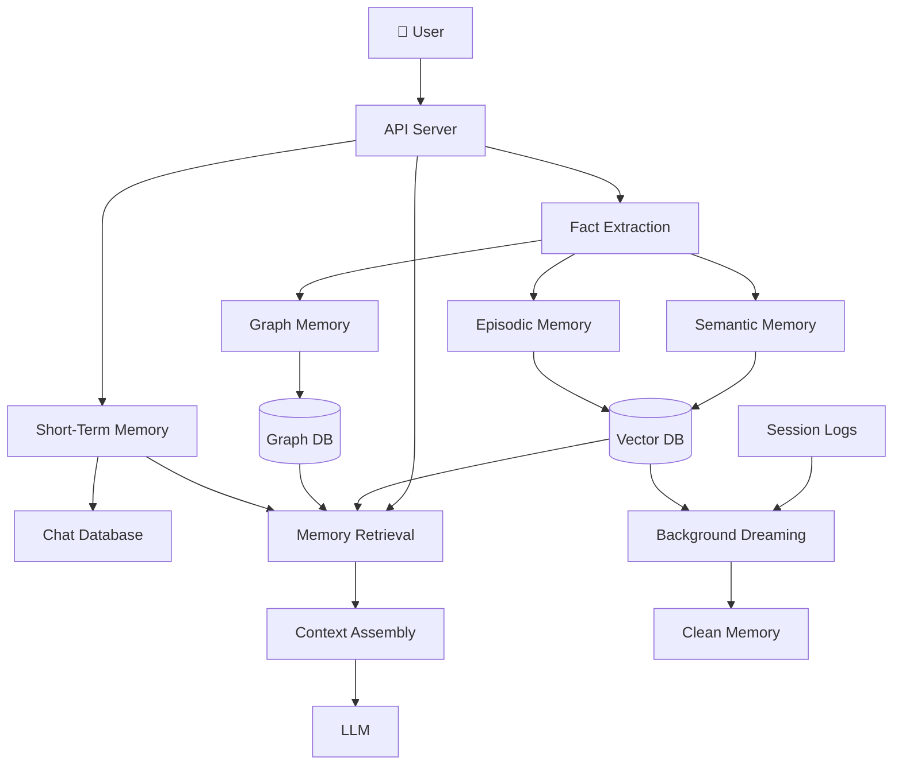

---

# 15. mem0

**mem0** is a managed memory layer designed to simplify memory management for AI agents.

Instead of implementing every memory operation manually, an application can use a memory framework.

Conceptually:

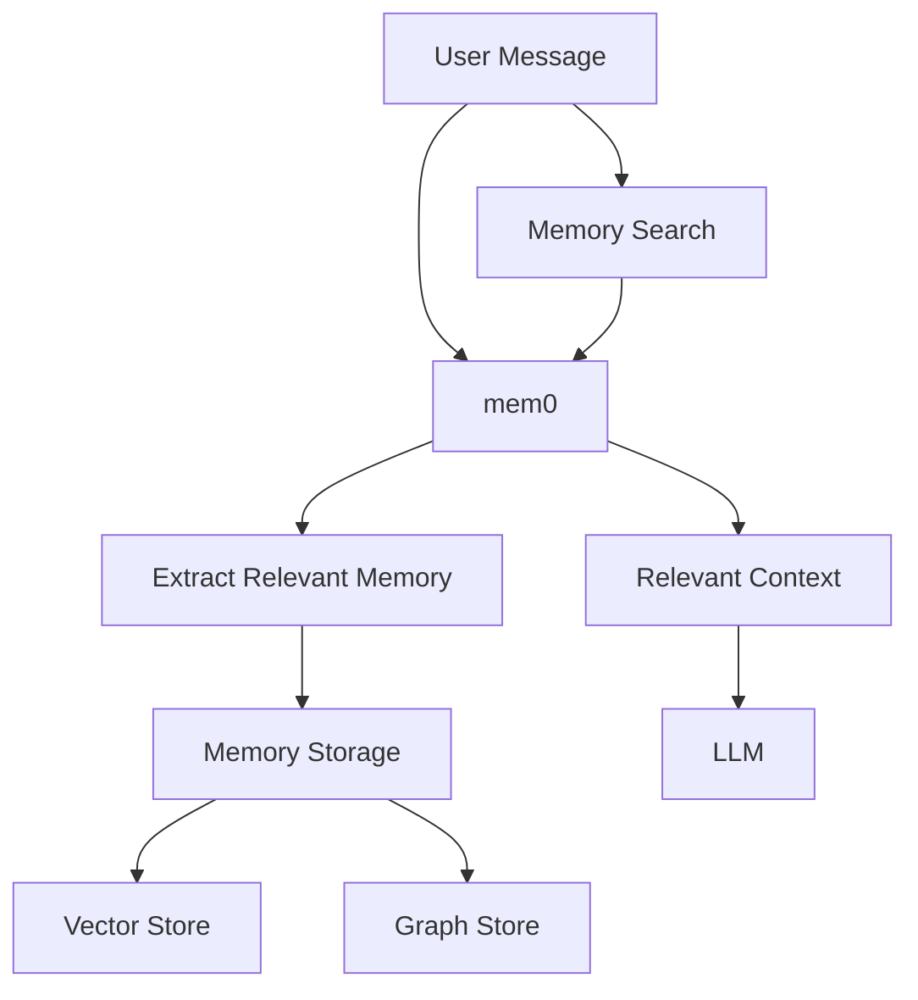

Typical capabilities include:

* Memory extraction
* Memory search
* Memory updates
* User-level memories
* Session-level memories
* Vector database integration
* Graph-based memory integration

The important idea is:

> **mem0 provides an abstraction layer around agent memory management.**

---

# PART B — ⚡ HIGH-PERFORMANCE LLM INFERENCE

# 16. GPU Hardware and LLMs

LLMs require enormous amounts of computation and memory.

Two important GPU resources are:

```text
GPU Compute
GPU Memory / VRAM
```

Modern accelerators also use **High Bandwidth Memory (HBM)**.

A simplified view:

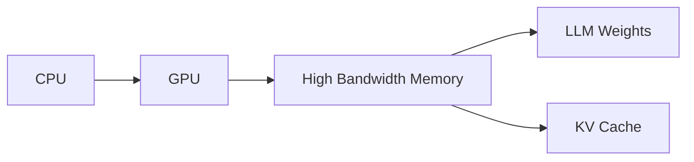

The model weights and runtime data must fit into GPU memory or be managed across devices.

---

# 17. Training vs Inference

Training and inference use GPUs differently.

## Training

Training requires:

```text
Forward Pass
+
Loss Calculation
+
Backward Pass
+
Gradient Updates
```

It is extremely compute-intensive.

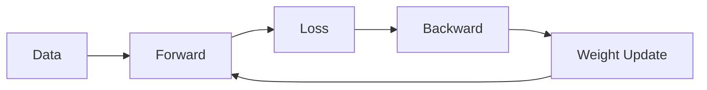

---

## Inference

Inference uses an already-trained model.

```text
Prompt
 ↓
Model
 ↓
Generated Tokens
```

There is no gradient update.

For LLM serving, **memory bandwidth and efficient GPU utilization** become extremely important.

---

# 18. What is an Inference Engine?

An inference engine is the software layer responsible for efficiently running model inference.

Think of it as:

```text
Web Server
      ↓
Inference Engine
      ↓
GPU
      ↓
LLM
```

The inference engine manages:

* Requests
* Scheduling
* Batching
* GPU memory
* KV cache
* Token generation
* Parallel execution

Examples include:

```text
vLLM
TensorRT-LLM
Hugging Face TGI
SGLang
```

---

# 19. Prefill Phase

When a request arrives:

```text
"Explain React Native navigation"
```

the prompt is converted into tokens.

During **prefill**, the model processes the prompt.

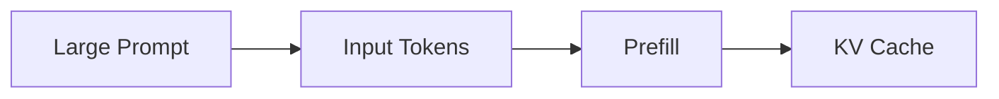

The important characteristic:

> Prompt tokens can be processed largely in parallel.

Therefore prefill is often highly compute-intensive.

---

# 20. Decode Phase

After processing the prompt, the model generates output one token at a time.

Example:

```text
The
The best
The best approach
The best approach is
...
```

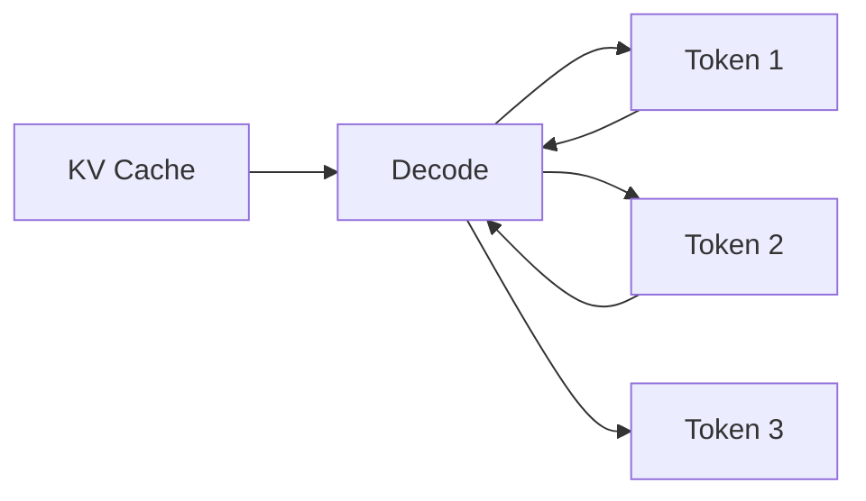

Unlike prefill, generation is autoregressive.

Each generated token depends on the previous output.

---

# 21. Prefill vs Decode

| Property           | Prefill        | Decode           |
| ------------------ | -------------- | ---------------- |
| Input              | Prompt         | Previous tokens  |
| Processing         | Parallel       | Sequential       |
| Main work          | Process prompt | Generate tokens  |
| Typical bottleneck | Compute        | Memory bandwidth |
| Output             | KV cache       | New token        |

A request therefore looks like:

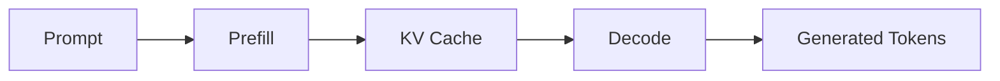

---

# 22. KV Cache

Transformer attention repeatedly needs information from previous tokens.

Instead of recalculating everything for every generated token, inference engines store **Key/Value tensors**.

This is called the:

> **KV Cache**

Conceptually:

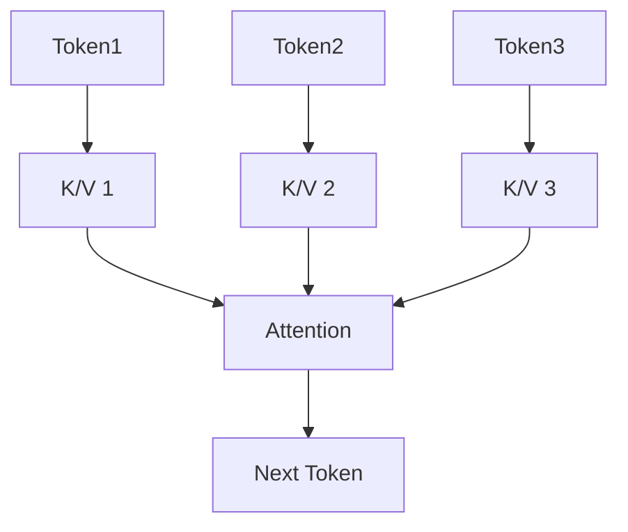

The KV cache can consume a significant amount of GPU memory during large-scale serving.

Efficient KV-cache management is therefore one of the biggest inference-engine challenges.

---

# 23. Disaggregated Prefill and Decode

Large inference deployments can separate the two phases.

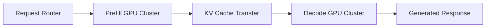

Why?

Because:

```text
Prefill → compute-heavy
Decode → memory-bandwidth-heavy
```

Different workloads can therefore be optimized independently.

---

# 24. What is vLLM?

**vLLM** is an open-source high-performance LLM inference and serving engine.

Its major goal is:

> Efficiently serve many concurrent LLM requests while maximizing GPU utilization and managing KV cache efficiently.

Important vLLM ideas include:

* PagedAttention
* Continuous batching
* Chunked prefill
* Prefix caching
* Quantization
* Efficient model execution
* Optimized kernels

---

# 25. PagedAttention

One of vLLM's key ideas is **PagedAttention**.

Traditional KV-cache allocation can lead to memory fragmentation.

Imagine memory:

```text
GPU Memory

[Request A][unused][Request B][unused][Request C]
```

The memory becomes difficult to utilize efficiently.

PagedAttention applies a concept similar to virtual memory paging.

Instead of requiring one large contiguous block:

```text
Request → Large contiguous KV cache
```

the KV cache can be divided into blocks/pages.

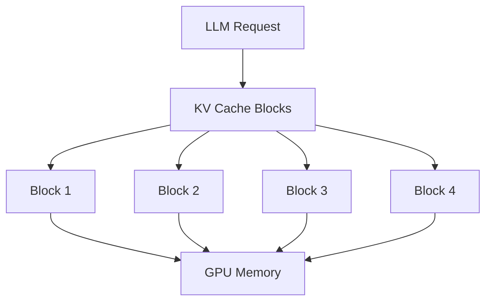

This allows the system to use GPU memory more efficiently.

---

# 26. Continuous Batching

Traditional batching might wait for several requests:

```text
Request A ──┐
Request B ──┼── Batch
Request C ──┘
```

But LLM requests have different generation lengths.

One request may finish quickly while another continues.

Continuous batching dynamically schedules active requests.

```mermaid
flowchart TD
    A["Request A"] --> Scheduler
    B["Request B"] --> Scheduler
    C["Request C"] --> Scheduler
    D["Request D"] --> Scheduler

    Scheduler["Continuous Batch Scheduler"] --> GPU["GPU"]

    GPU --> A
    GPU --> B
    GPU --> C
```

When one request finishes:

```text
Finished request
      ↓
Removed

New request
      ↓
Added
```

The GPU stays busy.

---

# 27. Chunked Prefill

Very large prompts can monopolize the GPU during prefill.

Instead of processing an enormous prompt in one operation:

```text
10,000 tokens
──────────────
ONE HUGE PREFILL
```

it can be split into smaller pieces:

```text
2,000
+
2,000
+
2,000
+
2,000
+
2,000
```

This helps the scheduler interleave prompt processing with token generation.

```mermaid
flowchart LR
    Prompt["Large Prompt"] --> C1["Chunk 1"]
    C1 --> C2["Chunk 2"]
    C2 --> C3["Chunk 3"]
    C3 --> C4["Chunk 4"]
    C4 --> Decode["Decode"]
```

---

# 28. Prefix Caching

Many requests share the same beginning.

For example:

```text
System Prompt
+
Developer Instructions
+
Tool Definitions
+
User Query
```

The first parts may be identical across thousands of requests.

Instead of recomputing them every time, the inference engine can reuse cached computation.

```mermaid
flowchart TD
    Prefix["Common Prefix"] --> Cache["Prefix Cache"]

    Cache --> R1["Request 1"]
    Cache --> R2["Request 2"]
    Cache --> R3["Request 3"]

    R1 --> Decode
    R2 --> Decode
    R3 --> Decode
```

This can reduce repeated prefill work.

---

# 29. Quantization

LLM weights can consume enormous amounts of memory.

For example:

```text
FP32 → 32 bits
FP16 → 16 bits
INT8 → 8 bits
INT4 → 4 bits
```

Lower precision can reduce memory requirements.

```text
Higher precision
     ↓
More memory
     ↓
Potentially higher accuracy

Lower precision
     ↓
Less memory
     ↓
Potentially faster / cheaper inference
```

The trade-off is between:

```text
Memory
Speed
Quality
```

---

# 30. Mixture-of-Experts (MoE)

Some modern LLMs use a **Mixture-of-Experts** architecture.

Instead of activating every parameter for every token:

```text
Token
  ↓
Router
  ↓
Selected Experts
```

```mermaid
flowchart TD
    Token["Input Token"] --> Router["Expert Router"]

    Router --> E1["Expert 1"]
    Router --> E2["Expert 2"]
    Router --> E3["Expert 3"]
    Router --> E4["Expert 4"]

    E1 --> Output
    E3 --> Output

    Output["Combined Output"]
```

Only selected experts process a token.

This can provide a large total parameter count while reducing active computation per token.

Inference engines need specialized kernels and scheduling strategies to serve these models efficiently.

---

# 31. vLLM Client Example

If vLLM exposes an OpenAI-compatible API, a client can interact with it similarly to a normal LLM API.

Example:

```javascript
const response = await fetch(
  "http://localhost:8000/v1/chat/completions",
  {
    method: "POST",

    headers: {
      "Content-Type": "application/json",
    },

    body: JSON.stringify({
      model: "your-model",
      messages: [
        {
          role: "user",
          content: "Explain PagedAttention.",
        },
      ],
      temperature: 0.7,
    }),
  }
);

const data = await response.json();

console.log(
  data.choices[0].message.content
);
```

The application does not need to manually implement:

```text
GPU scheduling
KV-cache allocation
Batch scheduling
Token generation
```

The inference engine handles these operations.

---

# 32. Complete Agent + Memory + vLLM Architecture

Now combine everything.

```mermaid
flowchart TD
    User["👤 User"] --> API["API Server"]

    API --> STM["Short-Term Memory"]
    STM --> ChatDB[("Chat Database")]

    API --> Query["Current Query"]

    Query --> MemorySearch["Memory Retrieval"]

    LTM[("Long-Term Memory")] --> MemorySearch

    MemorySearch --> Relevant["Relevant Memories"]

    STM --> Context["Context Assembly"]
    Relevant --> Context
    Query --> Context

    Context --> Router["LLM Router"]

    Router --> Inference["vLLM Inference Server"]

    Inference --> Scheduler["Request Scheduler"]
    Scheduler --> Prefill["Prefill"]
    Prefill --> KV["Paged KV Cache"]
    KV --> Decode["Decode"]

    Decode --> Response["LLM Response"]

    Response --> API
    API --> User

    ChatDB --> Dream["Background Memory Dreaming"]
    LTM --> Dream

    Dream --> Clean["Consolidated Memory"]
    Clean --> LTM
```

---

# 33. End-to-End Request Flow

A production request can therefore follow this path:

```text
1. User sends query
        ↓
2. API receives request
        ↓
3. Load recent STM
        ↓
4. Search relevant LTM
        ↓
5. Assemble minimal context
        ↓
6. Send request to inference engine
        ↓
7. vLLM schedules request
        ↓
8. Prefill prompt
        ↓
9. Store/use KV cache
        ↓
10. Decode output tokens
        ↓
11. Return response
        ↓
12. Store conversation
        ↓
13. Extract useful long-term memories
        ↓
14. Background Dreaming cleans memory later
```

```mermaid
sequenceDiagram
    actor User
    participant API as API Server
    participant STM as STM
    participant LTM as LTM
    participant vLLM as vLLM
    participant GPU as GPU
    participant Dream as Dreaming

    User->>API: Send Query

    API->>STM: Get recent messages
    STM-->>API: Recent context

    API->>LTM: Search relevant memories
    LTM-->>API: Top-K memories

    API->>vLLM: Send assembled prompt

    vLLM->>GPU: Prefill
    GPU-->>vLLM: KV Cache

    vLLM->>GPU: Decode tokens
    GPU-->>vLLM: Generated response

    vLLM-->>API: Response
    API-->>User: Final answer

    API->>LTM: Store extracted memories

    Note over Dream,LTM: Runs asynchronously
    Dream->>LTM: Deduplicate / consolidate / evict
```

---

# 34. Memory vs Inference: Two Different Optimization Problems

It is important not to mix these concepts.

## Memory System Optimizes:

```text
What information should the agent remember?
What information should be retrieved?
What should be forgotten?
How much context should be sent?
```

## Inference Engine Optimizes:

```text
How can the model process requests efficiently?
How should GPU memory be allocated?
How should requests be batched?
How should KV cache be managed?
How can tokens be generated faster?
```

Together:

```mermaid
flowchart LR
    User --> Memory["🧠 Memory Layer"]
    Memory --> Context["Minimal Context"]
    Context --> Inference["⚡ Inference Engine"]
    Inference --> GPU["GPU"]
    GPU --> Answer["Response"]
```

---

# 35. Key Production Design Principles

### 🧠 Memory

**Don't send everything.**

Retrieve only relevant information.

```text
All History
    ↓
Memory Retrieval
    ↓
Relevant Context
```

### 🧠 STM

Use recent conversation for immediate continuity.

```text
Recent N messages
```

### 🧠 LTM

Store durable information separately.

```text
Facts
Events
Relationships
```

### 🧠 Reflection

Perform expensive cleanup asynchronously.

```text
Raw Memory
    ↓
Dreaming
    ↓
Clean Memory
```

### ⚡ Inference

Use efficient scheduling and memory management.

```text
Requests
    ↓
Scheduler
    ↓
Batching
    ↓
GPU
```

### ⚡ vLLM

Important optimization concepts:

```text
PagedAttention
Continuous Batching
Chunked Prefill
Prefix Caching
Quantization
Efficient KV Cache
```

---

# 36. Final Mental Model

The easiest way to remember the entire Day 07 lesson is:

```mermaid
flowchart TD
    User["👤 User"]

    User --> Conversation["Conversation"]

    Conversation --> STM["STM<br/>Recent Context"]

    Conversation --> Extract["Memory Extraction"]

    Extract --> LTM["LTM<br/>Persistent Knowledge"]

    LTM --> Retrieval["Relevant Memory Retrieval"]

    STM --> Context["Minimal Context"]
    Retrieval --> Context
    User --> Context

    Context --> Engine["Inference Engine"]

    Engine --> Prefill["Prefill"]
    Prefill --> KV["KV Cache"]
    KV --> Decode["Decode"]

    Decode --> Response["Response"]

    Conversation --> Logs["Immutable Logs"]

    Logs --> Dream["🌙 Memory Dreaming"]
    LTM --> Dream
    Dream --> LTM
```

### The entire system can be summarized as:

> **STM remembers what is happening now.**
> **LTM remembers what matters over time.**
> **Retrieval decides what the LLM needs to know.**
> **Dreaming keeps memory clean.**
> **The inference engine decides how efficiently the LLM runs.**
> **vLLM optimizes serving through scheduling, KV-cache management, batching, and GPU-efficient execution.**

---

# 🧪 Sample Code Files

The concepts above map directly to the Day 07 sample implementations:

```text
week04/
└── learning/
    └── day07/
        ├── notes/
        │   ├── 01-application-level-memory-and-context-limits.md
        │   ├── 02-short-term-memory-and-sliding-windows.md
        │   ├── 03-long-term-memory-taxonomy-and-rag.md
        │   ├── 04-memory-eviction-and-dreaming-reflection.md
        │   ├── 05-agent-memory-system-design-and-mem0.md
        │   │
        │   └── extra/
        │       ├── 01-llm-hardware-training-vs-inference.md
        │       ├── 02-inference-engines-prefill-vs-decode.md
        │       └── 03-vllm-architecture-and-paged-attention.md
        │
        └── code/
            └── sample-code/
                ├── 01_short_term_memory.js
                ├── 02_long_term_memory_rag.js
                ├── 03_memory_dreaming_reflection.js
                └── 04_vllm_inference_client.js
```

### Recommended learning order

```text
01 Short-Term Memory
        ↓
02 Long-Term Memory + RAG
        ↓
03 Memory Dreaming
        ↓
04 Production Memory Design
        ↓
05 GPU + Inference Fundamentals
        ↓
06 Prefill / Decode
        ↓
07 KV Cache
        ↓
08 vLLM
        ↓
09 PagedAttention
        ↓
10 Continuous Batching + Caching
```

This gives you the complete **Week 04 Day 07 picture—from application-level agent memory all the way down to GPU-level LLM inference optimization.**
