# 🧠 Day 07 — Memory in AI Agents

> **Goal:** Understand how AI Agents remember conversations, user preferences, past experiences, and important information — and how production systems manage that memory efficiently.

---

# 1. 🧩 What Is Memory in an AI Agent?

An LLM by itself is **stateless**.

It receives:

```text
Input → LLM → Output
```

The LLM does not automatically remember what happened in previous API calls.

Therefore:

> **Memory is an application-level system built around the LLM.**

The application is responsible for:

* Storing information
* Deciding what to remember
* Retrieving relevant memories
* Updating old memories
* Removing unnecessary memories
* Providing the right memory to the LLM

### Basic Architecture

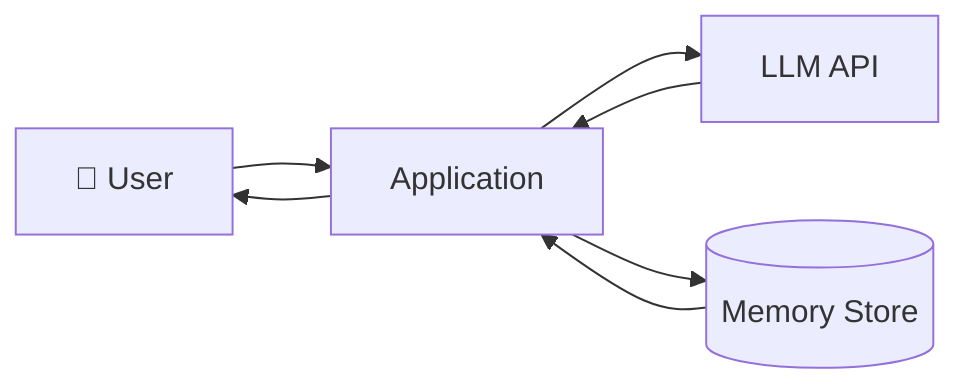

The important idea:

```text
LLM = Reasoning
Memory = External State
Application = Connects Everything
```

---

# 2. 🤖 LLMs Are Stateless

Suppose the user says:

```text
User: My name is Aminul.
AI: Nice to meet you, Aminul!
```

Later:

```text
User: What is my name?
```

If the previous conversation is not provided again, the LLM may not know.

Why?

Because every API request is independent.

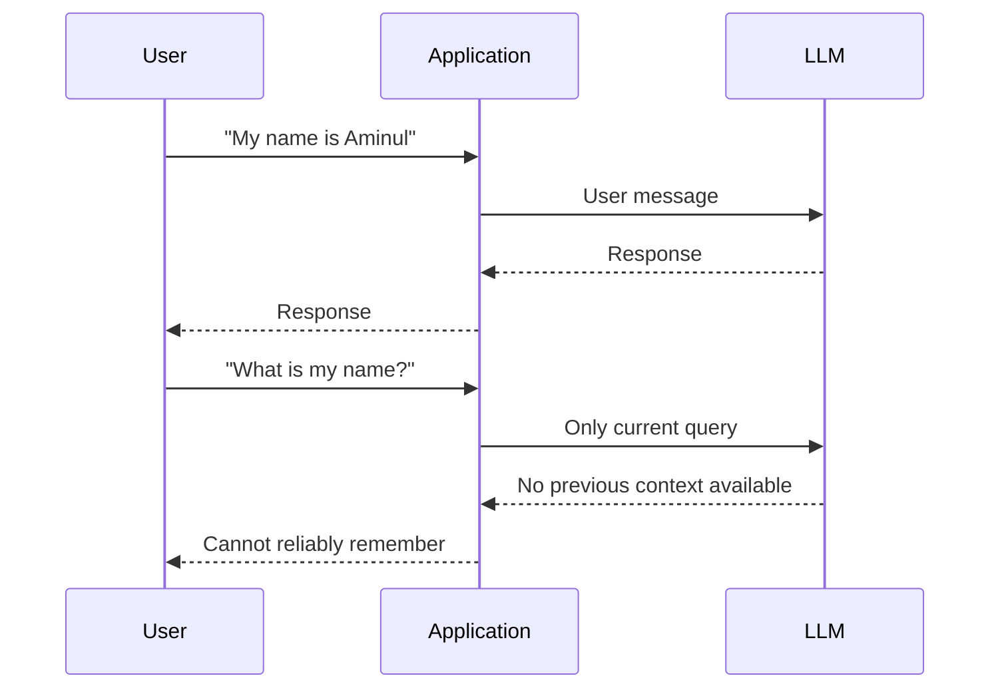

So the application must provide memory.

---

# 3. 💬 The Simplest Memory — Conversation History

The first solution is to keep all messages.

```python
messages = []

messages.append(user_message)
messages.append(llm_response)

response = llm(messages)
```

Now every request contains previous messages.

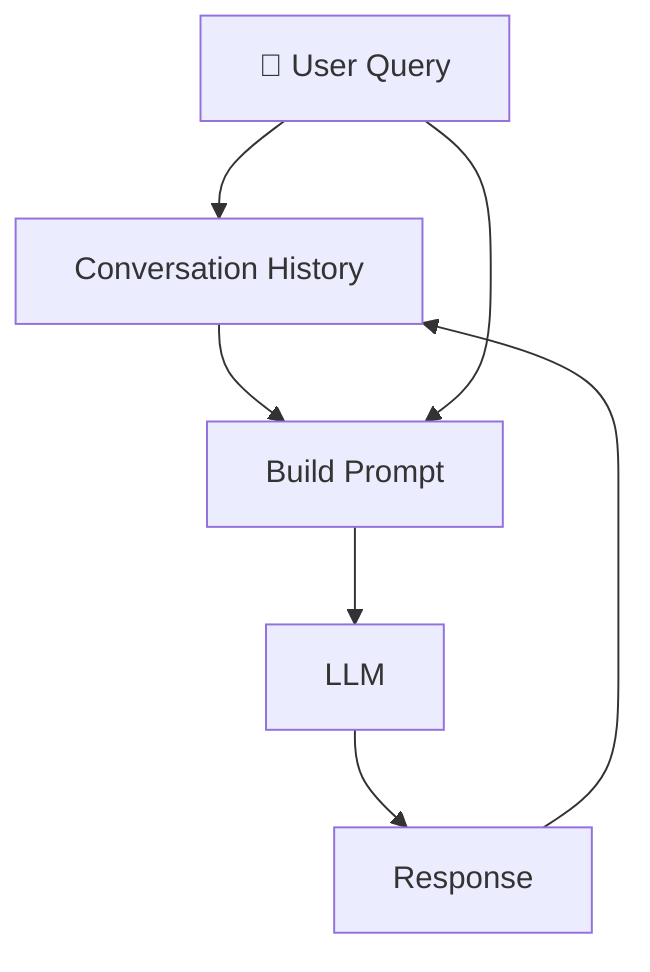

Conceptually:

```text
LLM Input = Previous Messages + Current Query
```

This gives the LLM conversational context.

But it introduces another problem.

---

# 4. 🚨 Context Window Problem

A conversation can become very large.

```text
Message 1
Message 2
Message 3
...
Message 10,000
```

Sending everything to the LLM every time is not a good production strategy.

### Problems

### 💰 1. Cost

More tokens → Higher cost.

### ⏱️ 2. Latency

More tokens → More processing → Slower response.

### 🧠 3. Context Noise

Most old messages may not be relevant.

### 📦 4. Context Limit

Every model has a maximum context capacity.

### 🎯 5. Context Dilution

Important information can get buried inside irrelevant information.

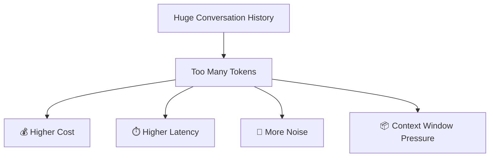

So instead of remembering **everything**, we need to decide **what should be remembered**.

---

# 5. 🧠 Short-Term Memory — STM

Short-Term Memory represents the **current/recent conversation**.

A common implementation is storing messages in a database.

```text
Messages Table

------------------------------------------------
id | user_id | role | message | timestamp
------------------------------------------------
1  | 101     | user | Hello   | ...
2  | 101     | AI   | Hi      | ...
3  | 101     | user | ...     | ...
------------------------------------------------
```

When the user sends a new query:

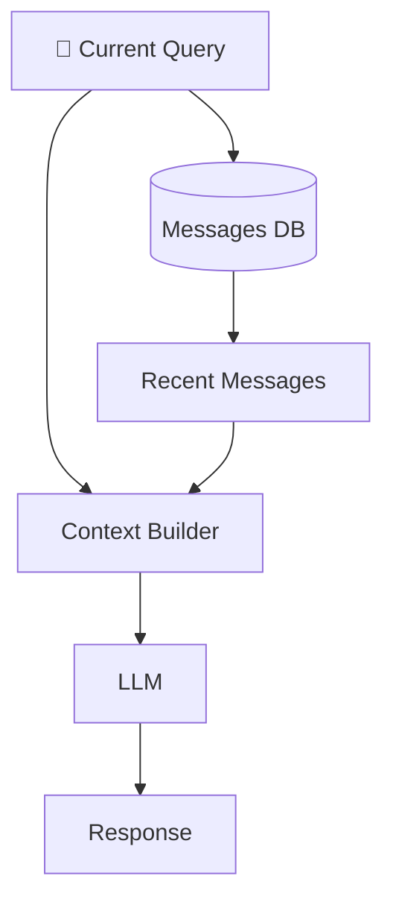

For example:

```sql
SELECT *
FROM messages
WHERE user_id = ?
ORDER BY timestamp DESC
LIMIT 20;
```

Now:

```text
LLM Context =
Last 20 Messages + Current Query
```

---

# 6. 🪟 Sliding Window Memory

One simple STM strategy is **Sliding Window Memory**.

Suppose we only keep the last 5 messages.

Initially:

```text
M1 M2 M3 M4 M5
```

New message arrives:

```text
M2 M3 M4 M5 M6
```

Another message:

```text
M3 M4 M5 M6 M7
```

The window keeps moving.

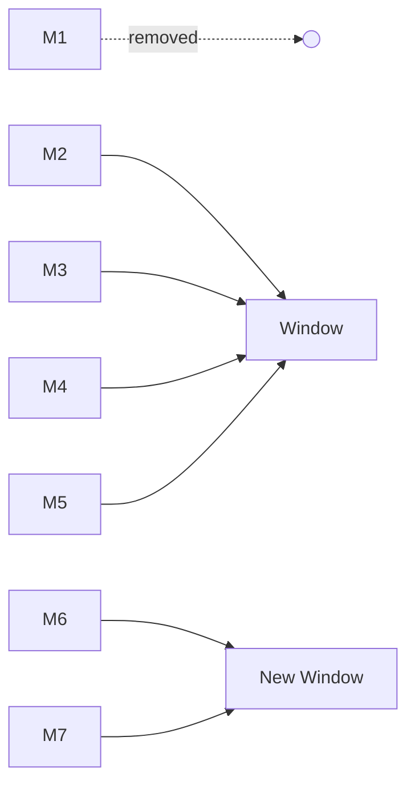

### Advantage

* Simple
* Fast
* Cheap
* Easy to implement

### Problem

Important old information disappears.

Example:

```text
User:
"My name is Aminul and I prefer TypeScript."

50 messages later...

User:
"What programming language do I prefer?"
```

The information may no longer exist inside STM.

This creates the need for **Long-Term Memory**.

---

# 7. 🗄️ Long-Term Memory — LTM

Long-Term Memory stores information that should survive beyond the current conversation.

Examples:

```text
Name
Preferences
Interests
Important decisions
User profile
Past experiences
Long-term goals
```

The architecture becomes:

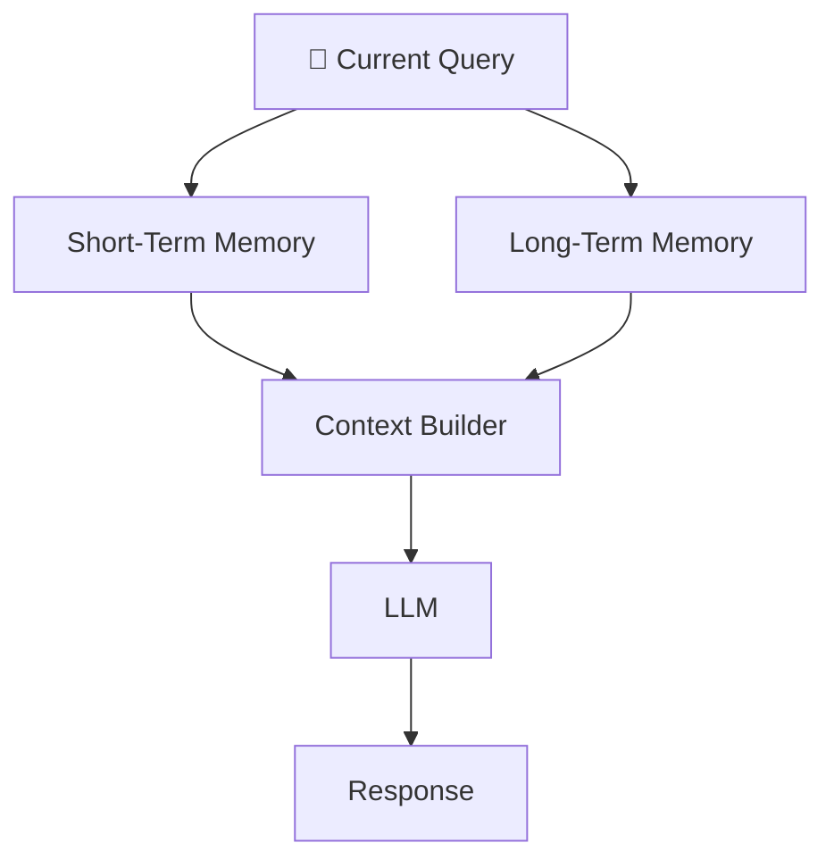

The LLM receives:

```text
STM + Relevant LTM + Current Query
```

---

# 8. ✍️ How Is Long-Term Memory Created?

Not every user message should become permanent memory.

For example:

```text
User: Hey
```

Probably no useful memory.

But:

```text
User:
"My name is Aminul and I prefer TypeScript."
```

This contains useful information.

A memory extraction process can identify:

```text
Name → Aminul
Preference → TypeScript
```

### Memory Write Pipeline

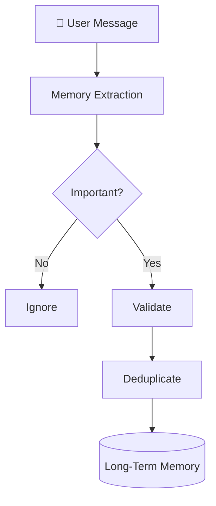

This is called **Memory Extraction**.

---

# 9. 🧠 Memory Is Not Just Chat History

This is a very important distinction.

### Conversation History

```text
"What did the user say?"
```

### Memory

```text
"What information from the conversation
should the agent remember?"
```

Example:

```text
Conversation:

User:
"I'm currently learning React Native.
I usually use TypeScript."

Memory:

User is learning React Native.
User prefers TypeScript.
```

Memory is therefore a **compressed and useful representation of previous interactions**.

---

# 10. 📚 Long-Term Memory Growth Problem

Over time:

```text
Memory 1
Memory 2
Memory 3
...
Memory 100,000
```

We cannot send every memory to the LLM.

Bad architecture:

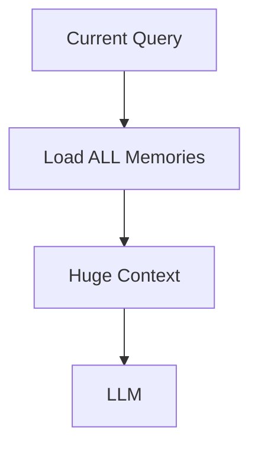

Problems:

```text
❌ Too many tokens
❌ High cost
❌ High latency
❌ Irrelevant information
❌ Context pollution
```

So we need **Memory Retrieval**.

---

# 11. 🔎 Memory Retrieval

Instead of loading everything:

```text
Query
 ↓
Search Memory
 ↓
Relevant Memories
 ↓
LLM
```

This is very similar to RAG.

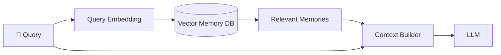

The core idea:

> **Retrieve only the memories that are relevant to the current task.**

---

# 12. 🔥 Memory Retrieval Is Similar to RAG

Traditional RAG:

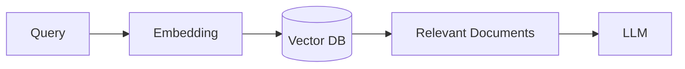

Memory Retrieval:

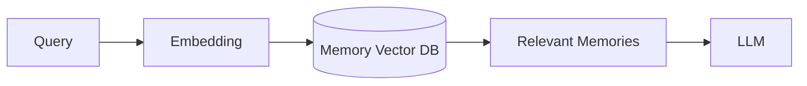

The difference is the data being retrieved.

```text
RAG:
Documents

Memory:
Past user information + experiences
```

A useful mental model:

> **Long-Term Memory can be treated as RAG over the agent's past.**

---

# 13. 🔢 Semantic Search

Suppose the memory store contains:

```text
Memory 1:
User is learning React Native.

Memory 2:
User likes football.

Memory 3:
User prefers TypeScript.

Memory 4:
User is interested in GenAI.
```

Current query:

```text
"What technologies am I currently learning?"
```

A semantic search can retrieve:

```text
User is learning React Native.
User prefers TypeScript.
User is interested in GenAI.
```

instead of loading every memory.

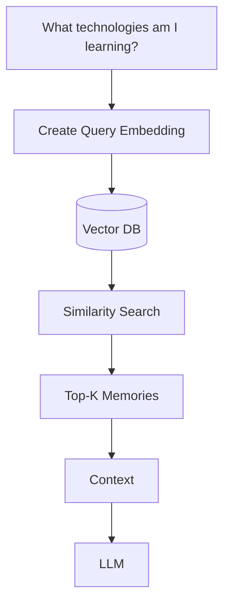

---

# 14. 🧩 Types of Long-Term Memory

A useful classification is:

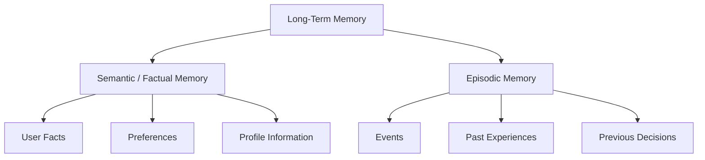

---

# 15. 📌 Semantic / Factual Memory

Semantic memory stores relatively stable facts.

Examples:

```text
Name: Aminul

Preferred language: TypeScript

Interested in: GenAI

Learning: React Native
```

Think:

> **"What is true about the user?"**

Example:

```text
User prefers TypeScript.
```

---

# 16. 🕒 Episodic Memory

Episodic memory stores events and experiences.

Example:

```text
On August 20:
User discussed building a notification
collector using React Native.
```

Think:

> **"What happened before?"**

Examples:

```text
Past conversation
Past task
Past decision
Past project
Important event
```

### Semantic vs Episodic

| Memory   | Question       | Example                                |
| -------- | -------------- | -------------------------------------- |
| Semantic | What is true?  | User prefers TypeScript                |
| Episodic | What happened? | User discussed a RAG project yesterday |

---

# 17. ⏳ Temporal Memory

Episodic memories become more powerful when we consider time.

Instead of only:

```text
Semantic Similarity
```

we can use:

```text
Semantic Similarity
+
Time
```

For example:

```text
"Show me what I worked on recently."
```

The system can prioritize recent memories.

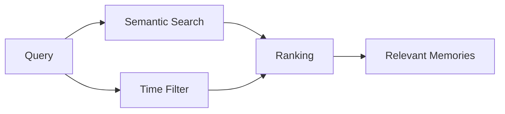

---

# 18. 📝 Append-Only Event Memory

Some episodic memory systems can behave like an event log.

```text
Event 1
Event 2
Event 3
Event 4
Event 5
```

New events are appended rather than modifying historical events.

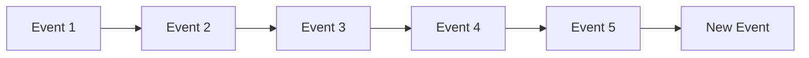

This is useful when the **history itself matters**.

---

# 19. 🧹 Memory Consolidation

Over time memory can become messy.

For example:

```text
User prefers JavaScript.
User prefers TypeScript.
User prefers TypeScript.
User used JavaScript in an old project.
```

Problems:

```text
Duplicate
Contradiction
Stale information
Low-value memories
```

We need **Memory Consolidation**.

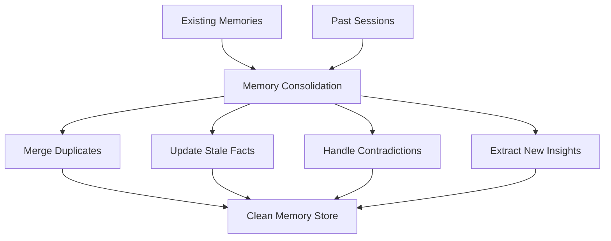

The important distinction:

```text
Memory Writing
    ↓
Create memories

Memory Consolidation
    ↓
Improve existing memories
```

---

# 20. 🌙 "Dreaming" / Memory Reflection

Some advanced memory systems use a reflection or "dreaming" process.

Conceptually:

```text
Past Sessions
+
Existing Memories
        ↓
Reflection / Consolidation
        ↓
Better Memory Store
```

The goal is to:

* Merge duplicates
* Remove stale information
* Resolve contradictions
* Discover patterns
* Create higher-level insights

Think of it as:

> **The agent periodically reviewing its memories instead of blindly accumulating everything forever.**

---

# 21. 🗑️ Memory Eviction

Memory storage can grow indefinitely.

Therefore:

> **Not every memory should live forever.**

We need an **eviction policy**.

Possible signals:

```text
Recency
Importance
Frequency
Relevance
Confidence
Access frequency
Expiration
```

Conceptually:

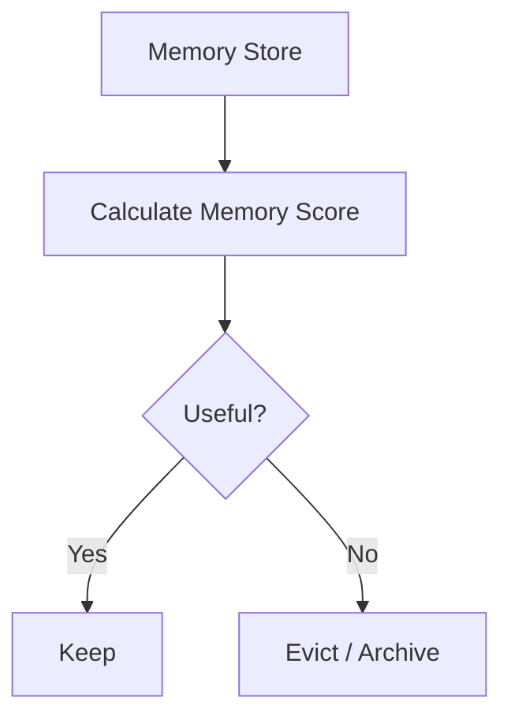

A conceptual score:

```text
Memory Score =
Importance
+ Relevance
+ Recency
+ Frequency
+ Confidence
```

---

# 22. 🔄 Complete Memory Lifecycle

Now combine everything.

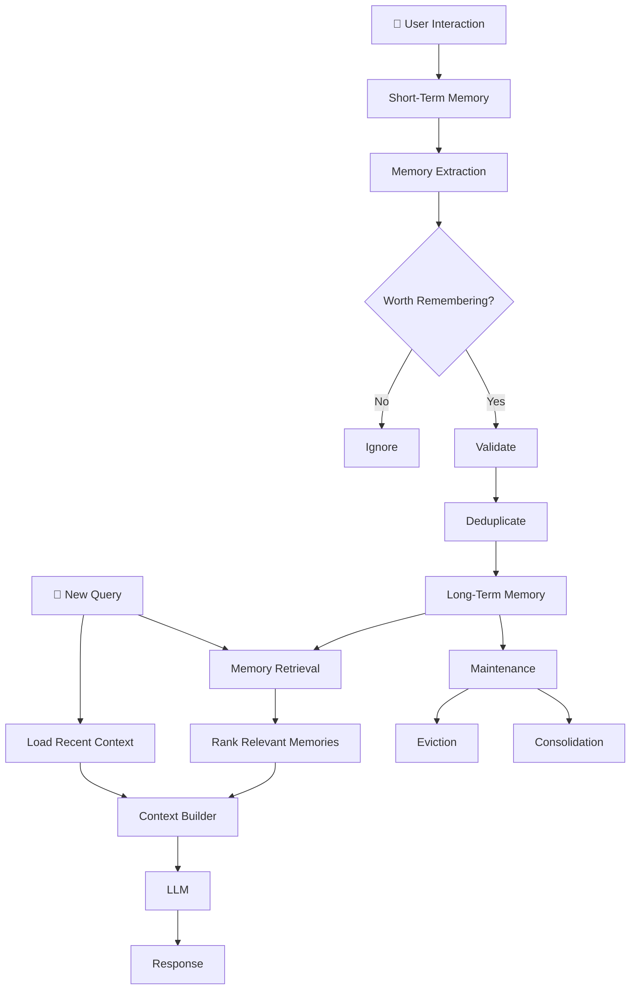

This is the basic architecture of an intelligent memory system.

---

# 23. 🕸️ Graph Database for Memory

Vector databases are excellent for semantic similarity.

But sometimes memory is about **relationships**.

Example:

```text
Aminul
  │
  ├── learning → GenAI
  │
  ├── uses → TypeScript
  │
  ├── builds → RAG Application
  │
  └── uses → React Native
```

This is naturally represented as a graph.

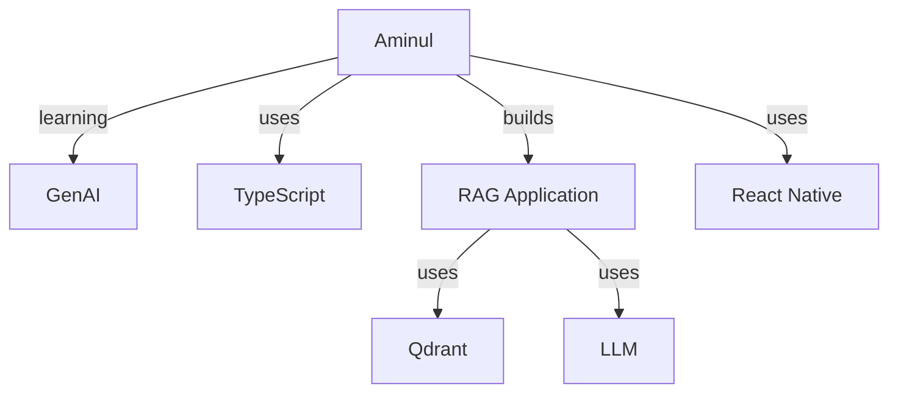

A graph database such as **Neo4j** can store these entities and relationships.

---

# 24. 🔀 Vector Search vs Graph Search

### Vector Search

Best for:

```text
"What memories are similar to this query?"
```

### Graph Search

Best for:

```text
"What is connected to this entity?"
```

Comparison:

|                        | Vector DB | Graph DB |
| ---------------------- | --------- | -------- |
| Semantic similarity    | ⭐⭐⭐⭐⭐     | ⭐⭐       |
| Relationship traversal | ⭐⭐        | ⭐⭐⭐⭐⭐    |
| Unstructured memory    | ⭐⭐⭐⭐⭐     | ⭐⭐⭐      |
| Entity relationships   | ⭐⭐⭐       | ⭐⭐⭐⭐⭐    |
| Similarity retrieval   | ⭐⭐⭐⭐⭐     | ⭐⭐       |

Advanced systems can combine both:

```mermaid
flowchart TD
    Q[Query]

    Q --> V[Vector Search]
    Q --> G[Graph Search]

    V --> F[Memory Fusion]
    G --> F

    F --> R[Rank Results]
    R --> L[LLM]
```

---

# 25. ⚡ Production Problem — Latency

A naive memory system might do:

```text
API Server
    ↓
Load STM
    ↓
Search Vector DB
    ↓
Search Graph DB
    ↓
Rank Memories
    ↓
Build Prompt
    ↓
LLM
```

Every step adds latency.

```mermaid
flowchart LR
    A[API] --> S[STM]
    S --> V[Vector Search]
    V --> G[Graph Search]
    G --> R[Ranking]
    R --> L[LLM]
```

So production memory design must optimize three things:

```text
🎯 Accuracy
⚡ Latency
💰 Cost
```

---

# 26. 🚀 Eager Loading

Some memories are frequently needed.

Instead of searching for them every time:

```text
Request
 ↓
Search Memory
```

we can preload them.

```mermaid
flowchart TD
    S[Session Start] --> L[Load Important Memories]
    L --> C[(Cache)]

    Q[User Query] --> C
    C --> M[Fast Memory Access]
    M --> LLM[LLM]
```

This is called **Eager Loading**.

---

# 27. ⚡ Caching & Prefetching

Frequently accessed memories can be cached.

```text
Request
   ↓
Cache?
 ├── YES → Return Memory Quickly
 └── NO → Search Memory DB
```

```mermaid
flowchart TD
    Q[Query] --> C{Cache Hit?}

    C -->|Yes| M[Cached Memory]
    C -->|No| DB[(Vector / Memory DB)]

    DB --> S[Search]
    S --> M

    M --> L[LLM]
```

This reduces repeated database work.

---

# 28. 🔎 Simple Search vs Agentic Search

### Simple Search

```mermaid
flowchart LR
    Q[Query] --> S[Memory Search]
    S --> R[Top-K Memories]
    R --> L[LLM]
```

Fast and predictable.

### Agentic Search

The agent decides what to search and whether another search is needed.

```mermaid
flowchart TD
    Q[Query] --> A[Memory Agent]
    A --> S1[Search Memory]
    S1 --> E{Enough Information?}

    E -->|No| S2[Search Again]
    S2 --> E

    E -->|Yes| C[Build Context]
    C --> L[LLM]
```

### Trade-off

```text
Simple Search
    ↓
Fast + Cheap

Agentic Search
    ↓
Potentially Better Recall
but
More Latency + More Cost
```

Use agentic search when the extra reasoning is worth it.

---

# 29. 📊 Memory Ranking

A memory should not be selected only because it is semantically similar.

A production system can consider multiple signals:

```text
Semantic Relevance
+
Importance
+
Recency
+
Frequency
+
Confidence
```

Conceptually:

```mermaid
flowchart TD
    M[Candidate Memories]

    M --> R[Relevance Score]
    M --> I[Importance Score]
    M --> T[Recency Score]
    M --> F[Frequency Score]
    M --> C[Confidence Score]

    R --> S[Final Memory Score]
    I --> S
    T --> S
    F --> S
    C --> S

    S --> K[Top-K Memories]
```

This gives the memory system better control over what enters the LLM context.

---

# 30. ✍️ Memory Write Pipeline vs Read Pipeline

This distinction is extremely important.

## Memory Write

```mermaid
flowchart LR
    U[User Message] --> E[Extract]
    E --> V[Validate]
    V --> D[Deduplicate]
    D --> S[Store]
```

Question:

> **What should we remember?**

---

## Memory Read

```mermaid
flowchart LR
    Q[Query] --> S[Search]
    S --> R[Rank]
    R --> F[Filter]
    F --> C[Context]
    C --> L[LLM]
```

Question:

> **What should we remember right now?**

---

# 31. 🧹 Memory Management

Memory management handles the lifecycle of stored memories.

```mermaid
flowchart TD
    M[Long-Term Memory]

    M --> U[Update]
    M --> D[Deduplicate]
    M --> C[Consolidate]
    M --> E[Evict]
    M --> A[Archive]

    U --> M
    D --> M
    C --> M
```

So an intelligent memory system has three major operations:

```text
WRITE
  ↓
What should I remember?

READ
  ↓
What do I need right now?

MANAGE
  ↓
What should I keep, update, merge, or remove?
```

---

# 32. 🏗️ Production Memory Architecture

A more complete production architecture:

```mermaid
flowchart TD

    U[👤 User] --> API[API Gateway]
    API --> APP[Agent Application]

    APP --> MM[🧠 Memory Manager]

    MM --> STM[(Short-Term Memory)]
    MM --> CACHE[(Memory Cache)]

    MM --> RET[Memory Retrieval]

    RET --> VDB[(Vector Database)]
    RET --> GDB[(Graph Database)]

    VDB --> R[Relevant Memories]
    GDB --> R

    R --> RANK[Memory Ranking]
    STM --> CTX[Context Builder]
    RANK --> CTX

    CTX --> LLM[🤖 LLM]

    LLM --> RESP[Response]
    RESP --> U

    LLM --> WRITE[Memory Extraction]

    WRITE --> VALIDATE[Validate]
    VALIDATE --> DEDUP[Deduplicate]
    DEDUP --> STORE[Store / Update LTM]

    STORE --> VDB
    STORE --> GDB

    STORE --> MAINT[Memory Maintenance]
    MAINT --> CONS[Consolidation]
    MAINT --> EVICT[Eviction]
```

---

# 33. 🔄 Complete Request Lifecycle

When a user sends a request:

```mermaid
sequenceDiagram
    participant U as User
    participant A as Agent
    participant M as Memory Manager
    participant S as STM
    participant V as Vector DB
    participant G as Graph DB
    participant L as LLM

    U->>A: User Query

    A->>M: Request Memory

    M->>S: Load Recent Messages
    S-->>M: STM

    M->>V: Semantic Search
    V-->>M: Relevant Memories

    M->>G: Relationship Search
    G-->>M: Related Entities

    M->>M: Rank + Filter

    M-->>A: Relevant Context

    A->>L: STM + LTM + Query

    L-->>A: Response

    A-->>U: Response

    A->>M: Extract New Memory
    M->>V: Store / Update
```

---

# 34. 🧠 Memory + RAG

Memory and RAG are closely related but not identical.

### RAG

```text
External Knowledge
      ↓
Retrieve Documents
      ↓
LLM
```

### Agent Memory

```text
Past User Information
      ↓
Retrieve Memories
      ↓
LLM
```

### Combined System

```mermaid
flowchart TD
    Q[User Query]

    Q --> MEM[Memory Retrieval]
    Q --> RAG[RAG Retrieval]

    MEM --> MC[Memory Context]
    RAG --> DC[Document Context]

    MC --> C[Context Builder]
    DC --> C

    Q --> C

    C --> L[LLM]
```

Now the agent can use:

```text
Who the user is
+
What happened before
+
External knowledge
+
Current task
```

---

# 35. 🧠 Memory Stack

A useful way to visualize the entire system:

```text
┌──────────────────────────────────────┐
│              AI AGENT                │
├──────────────────────────────────────┤
│          Context Builder             │
├──────────────────────────────────────┤
│         Memory Retrieval             │
├──────────────────────────────────────┤
│                                      │
│  STM       Semantic      Episodic    │
│            Memory       Memory       │
│                                      │
├──────────────────────────────────────┤
│      Vector DB + Graph DB            │
├──────────────────────────────────────┤
│     Memory Management Layer          │
│  Extract • Update • Dedup • Evict    │
└──────────────────────────────────────┘
```

---

# 36. 🧩 Where Does Mem0 Fit?

Frameworks such as **Mem0** provide an abstraction over many memory-related operations.

Instead of manually implementing:

```text
Memory Extraction
      ↓
Memory Storage
      ↓
Memory Retrieval
      ↓
Memory Update
      ↓
Memory Management
```

a memory framework can provide APIs and infrastructure around these operations.

Conceptually:

```mermaid
flowchart TD
    A[AI Agent] --> M[Memory Layer]

    M --> E[Memory Extraction]
    M --> R[Memory Retrieval]
    M --> U[Memory Update]
    M --> D[Memory Management]

    E --> DB[(Memory Store)]
    R --> DB
    U --> DB
    D --> DB
```

The important thing is:

> **Don't learn Mem0 only as an SDK. Understand the memory architecture that the SDK is helping you implement.**

---

# 37. 🎯 The Big Production Problem

Building memory is not simply:

```text
Store everything
+
Search everything
```

A production memory system needs to answer four questions:

### 1️⃣ What should I remember?

**Memory Extraction**

### 2️⃣ Where should I store it?

**Memory Storage**

### 3️⃣ What should I retrieve?

**Memory Retrieval**

### 4️⃣ What should I forget or update?

**Memory Management**

```mermaid
flowchart LR
    W[✍️ WRITE<br/>What to remember?]
    S[💾 STORE<br/>Where to store?]
    R[🔎 READ<br/>What to retrieve?]
    M[🧹 MANAGE<br/>What to keep?]

    W --> S
    S --> R
    R --> M
    M --> W
```

---

# 38. ⚡ Production Optimization Checklist

A production memory system should consider:

```text
✓ Short-term memory
✓ Long-term memory
✓ Semantic memory
✓ Episodic memory
✓ Semantic retrieval
✓ Temporal retrieval
✓ Memory ranking
✓ Deduplication
✓ Memory updates
✓ Memory consolidation
✓ Memory eviction
✓ Caching
✓ Prefetching
✓ Eager loading
✓ Async memory writes
✓ Vector search
✓ Graph search when needed
✓ Privacy and access control
✓ User-level memory isolation
✓ Latency
✓ Token cost
✓ Retrieval quality
```

---

# 39. 🧠 Final Mental Model

The complete journey is:

```mermaid
flowchart TD
    LLM[🤖 Stateless LLM]

    LLM --> H[Conversation History]
    H --> STM[Short-Term Memory]

    STM --> LTM[Long-Term Memory]

    LTM --> SEM[Semantic / Facts]
    LTM --> EPI[Episodic / Events]

    SEM --> RET[Memory Retrieval]
    EPI --> RET

    RET --> V[Vector Search]
    RET --> G[Graph Search]
    RET --> T[Temporal Search]

    V --> R[Rank + Filter]
    G --> R
    T --> R

    R --> C[Context Construction]

    STM --> C
    C --> LLM2[🤖 LLM]

    LLM2 --> X[Memory Extraction]
    X --> M[Memory Management]

    M --> D[Deduplication]
    M --> CO[Consolidation]
    M --> E[Eviction]
    M --> U[Update]

    U --> LTM
```

---

# 🔥 40. One Diagram to Remember

If you remember only **one architecture**, remember this:

```mermaid
flowchart TD

    U[👤 USER] --> Q[Current Query]

    Q --> STM[🧠 SHORT-TERM MEMORY<br/>Recent Conversation]

    Q --> RET[🔎 MEMORY RETRIEVAL]

    LTM[(🗄️ LONG-TERM MEMORY)]

    LTM --> RET

    RET --> V[Vector Search]
    RET --> G[Graph Search]
    RET --> T[Temporal Search]

    V --> R[🎯 Rank + Filter]
    G --> R
    T --> R

    STM --> C[📦 CONTEXT BUILDER]
    R --> C
    Q --> C

    C --> LLM[🤖 LLM]

    LLM --> RESP[💬 RESPONSE]

    LLM --> EX[🧠 MEMORY EXTRACTION]

    EX --> D[Deduplicate]
    D --> UP[Update / Store]
    UP --> LTM

    LTM --> MAINT[🧹 Memory Maintenance]

    MAINT --> CON[Consolidation]
    MAINT --> EVI[Eviction]
    MAINT --> ARC[Archive]
```

---

# 📝 Quick Revision

### What is an LLM?

```text
Stateless reasoning engine
```

### What is Memory?

```text
External state maintained around the LLM
```

### STM?

```text
Recent conversation
```

### LTM?

```text
Important information that survives across sessions
```

### Semantic Memory?

```text
Facts / preferences / user profile
```

### Episodic Memory?

```text
Events / experiences / past interactions
```

### Memory Retrieval?

```text
Find only the memories relevant to the current query
```

### Vector DB?

```text
Semantic similarity search
```

### Graph DB?

```text
Relationship-based retrieval
```

### Memory Consolidation?

```text
Merge duplicates + clean stale information + derive insights
```

### Memory Eviction?

```text
Remove or archive low-value memories
```

### Caching?

```text
Keep frequently used memories close for faster retrieval
```

### Agentic Search?

```text
Agent decides what and how many times to search
```

### Mem0?

```text
A memory layer/framework that helps implement memory for AI applications and agents
```

---

# 🚀 Final Takeaway

The most important concept from this class is:

> **An AI Agent does not need to remember everything. It needs to retrieve the right information at the right time.**

A production-quality memory system therefore follows:

```text
        ┌──────────────┐
        │   User Query │
        └──────┬───────┘
               ↓
        ┌──────────────┐
        │ Load STM     │
        └──────┬───────┘
               ↓
        ┌──────────────┐
        │ Retrieve LTM │
        └──────┬───────┘
               ↓
        ┌──────────────┐
        │ Rank/Filter  │
        └──────┬───────┘
               ↓
        ┌──────────────┐
        │ Build Context│
        └──────┬───────┘
               ↓
        ┌──────────────┐
        │     LLM      │
        └──────┬───────┘
               ↓
        ┌──────────────┐
        │    Answer    │
        └──────┬───────┘
               ↓
        ┌──────────────┐
        │Extract Memory│
        └──────┬───────┘
               ↓
        ┌──────────────┐
        │Update / Store│
        └──────────────┘
```

### ⭐ Golden Rule

**Memory is not about storing more.
Memory is about retrieving better.**

And the production optimization target is:

```text
🎯 Right Memory
     +
🧠 Right Context
     +
⚡ Low Latency
     +
💰 Low Cost
     =
🤖 Better AI Agent
```
