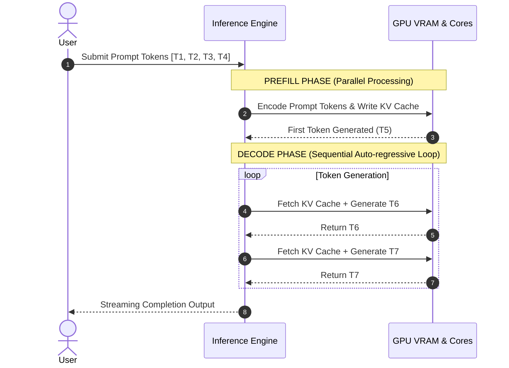

# 02 — Inference Engines: Prefill vs Decode Phases

> **Core Concept:** An **Inference Engine** acts as the high-performance reverse proxy for LLMs (the "Nginx of LLMs"), managing request queues, dynamic batching, and KV cache memory.

---

## 1. Role of an Inference Engine

Serving raw open-weight LLMs without an inference engine leads to underutilized GPU capacity.

```text
Traditional Web:  User Requests  ──> [ Nginx Web Server ]  ──> [ Backend App ]
LLM Infrastructure: User Requests ──> [ Inference Engine ] ──> [ GPU VRAM / Cores ]
```

An inference engine provides:
* Request queuing & priority management.
* Dynamic iteration-level batching.
* KV cache memory allocation.
* CUDA graph optimizations.

---

## 2. The Two Execution Phases of LLM Generation

Text generation in auto-regressive LLMs consists of two distinct computational stages:



### Phase 1: Prefill Phase (Prompt Encoding)
* Processes all prompt tokens simultaneously in parallel.
* Heavy compute and bandwidth usage.
* Computes attention Key-Value (KV) matrices and writes them to VRAM.

### Phase 2: Decode Phase (Token Generation)
* Generates output tokens auto-regressively **one token at a time**.
* Memory bandwidth bound: Must load past KV cache from VRAM for each output token.

---

## 3. Disaggregated Prefill & Decode

To prevent compute-heavy Prefill operations from starving time-sensitive Decode operations, modern clusters separate hardware nodes into dedicated **Prefill Nodes** and **Decode Nodes**.
