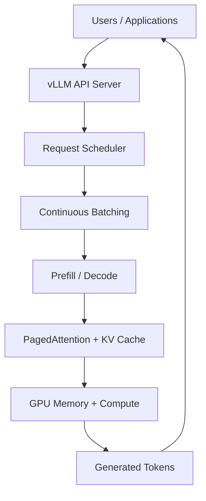
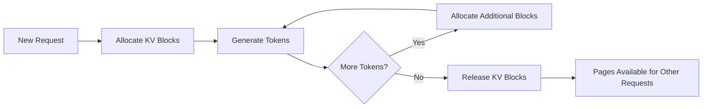
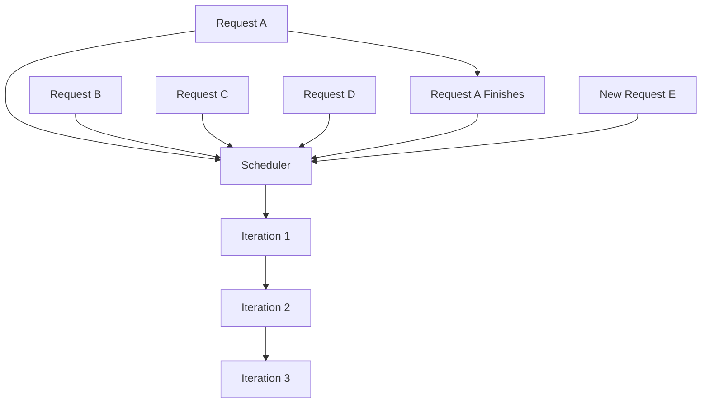
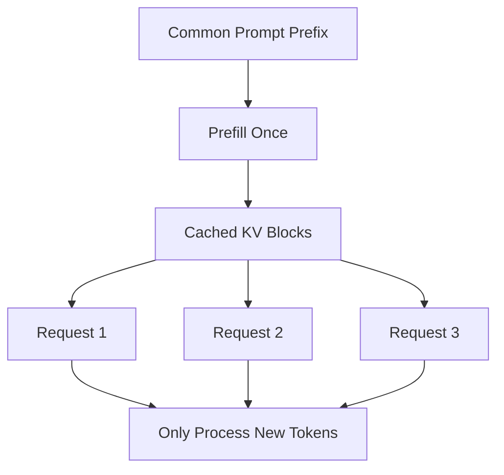
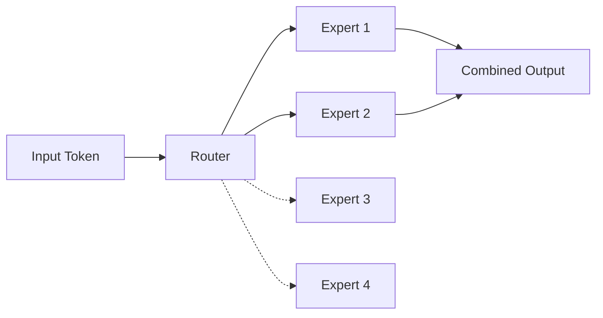
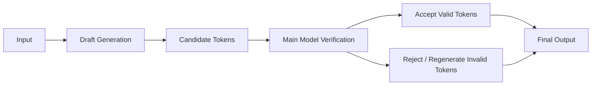
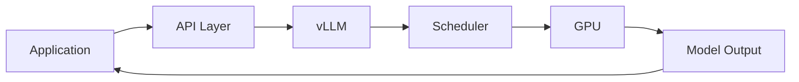
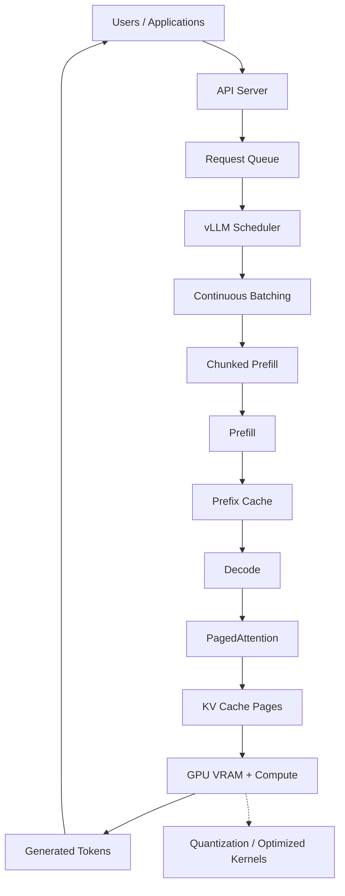
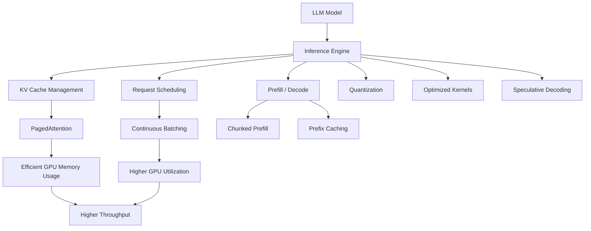

# 03 — vLLM Architecture & PagedAttention Deep Dive

> **Core Concept:** vLLM is a high-throughput LLM inference engine designed to maximize GPU utilization by efficiently managing **KV cache memory, request scheduling, batching, and token generation**.

---

## 1. What is vLLM?

**vLLM** is an open-source LLM serving engine designed for efficiently serving open-weight models.

Instead of directly running a model for every request independently, vLLM manages the entire inference process:



The major optimization areas are:

* **PagedAttention**
* **Continuous Batching**
* **Chunked Prefill**
* **Prefix Caching**
* **Quantization**
* **Optimized GPU Kernels**
* **Speculative Decoding**

---

# 2. Why KV Cache Management Matters

During autoregressive generation, the model repeatedly needs previously computed attention information.

This information is stored in the **KV Cache**.

For example:

```text
Prompt
  │
  ▼
Token 1 ──┐
Token 2 ──┤
Token 3 ──┤──> KV Cache
Token 4 ──┘
             │
             ▼
          Generate
             │
             ▼
           Token 5
             │
             ▼
      Update KV Cache
             │
             ▼
           Token 6
```

As requests become longer and the number of concurrent users increases, KV cache can consume a significant amount of GPU memory.

Therefore, efficient KV-cache management is one of the most important parts of an inference engine.

---

# 3. Traditional KV Cache Allocation Problem

A naive inference server may reserve a large contiguous memory region for each request based on the maximum expected sequence length.

For example:

```text
Request A
┌────────────────────────────────────────────┐
│ Used │ Used │ Used │       Unused          │
└────────────────────────────────────────────┘

Request B
┌────────────────────────────────────────────┐
│ Used │ Used │             Unused            │
└────────────────────────────────────────────┘
```

The actual sequence might be much shorter than the reserved capacity.

This creates memory fragmentation and inefficient GPU-memory utilization.

---

# 4. PagedAttention

vLLM's **PagedAttention** applies the idea of virtual memory paging to KV-cache management.

Instead of requiring one large contiguous memory region, the KV cache is divided into smaller blocks/pages.

```text
Logical KV Cache

┌─────────┬─────────┬─────────┐
│ Block 0 │ Block 1 │ Block 2 │
└────┬────┴────┬────┴────┬────┘
     │         │         │
     ▼         ▼         ▼

Physical GPU Memory

┌────────┐ ┌────────┐ ┌────────┐
│ Page 12│ │ Page 03│ │ Page 88│
└────────┘ └────────┘ └────────┘
```

The logical sequence does not need to occupy one contiguous region of physical GPU memory.

A mapping mechanism connects:

```text
Logical KV Blocks
       ↓
Physical GPU Pages
```

---

# 5. Dynamic KV-Cache Allocation

Pages can be allocated as the sequence grows.



This allows GPU memory to be shared more efficiently between active requests.

---

# 6. Why PagedAttention Helps

Instead of reserving large contiguous memory regions:

```text
Request → Large Fixed Allocation
```

vLLM can use:

```text
Request
   │
   ├── Block 0 → Physical Page
   ├── Block 1 → Physical Page
   ├── Block 2 → Physical Page
   └── Block 3 → Physical Page
```

This reduces wasted memory and allows more concurrent sequences to fit into available GPU memory.

The provided notes describe this as reducing KV-cache memory waste to **below ~4% in the cited setup** and enabling significantly larger batch sizes.

---

# 7. Continuous Batching

Traditional batching might work like this:

```text
Batch 1
 ├── Request A
 ├── Request B
 └── Request C

Wait until all finish
        ↓
Batch 2
```

The problem is that requests can have very different generation lengths.

If Request A finishes early:

```text
A → Finished
B → Still generating
C → Still generating
```

GPU capacity associated with A may not be used efficiently.

---

## Continuous Batching

vLLM dynamically schedules requests at the token-iteration level.



When one request finishes, another request can enter the running batch.

This keeps GPU resources busy.

---

# 8. Chunked Prefill

Prefill can involve a very large prompt.

For example:

```text
Large Prompt
─────────────────────────────────────────────
1 2 3 4 5 6 7 8 9 10 ... 10000 tokens
─────────────────────────────────────────────
```

If the entire prompt is processed at once, it can consume substantial compute and scheduling resources.

With **chunked prefill**, the prompt can be divided into smaller pieces:

```text
Large Prompt

┌──────────┐
│ Chunk 1  │
└──────────┘
     ↓
┌──────────┐
│ Chunk 2  │
└──────────┘
     ↓
┌──────────┐
│ Chunk 3  │
└──────────┘
     ↓
   ...
```

This allows the scheduler to better balance prompt processing with token generation from other requests.

Conceptually:

```text
Large Prefill
      +
Decode Requests
      ↓
Scheduler
      ↓
Better GPU utilization
```

---

# 9. Prefix Caching

Many LLM applications repeatedly use the same beginning of a prompt.

For example:

```text
System Prompt
     +
Agent Instructions
     +
Tools
     +
User Query
```

The first parts may remain identical across requests.

Without caching:

```text
Request 1 → Prefill System Prompt
Request 2 → Prefill System Prompt
Request 3 → Prefill System Prompt
Request 4 → Prefill System Prompt
```

With prefix caching:



The already-computed KV blocks can be reused when the prompt prefix matches.

This can reduce repeated prefill work for workloads with highly shared prefixes.

---

# 10. Quantization

Model weights normally use numerical formats such as FP16 or BF16.

Quantization represents weights using lower-precision formats.

Examples from the provided notes include:

```text
FP8
INT8
INT4
AWQ
GPTQ
GGUF
NVFP4
TorchAO
```

Conceptually:

```text
Higher Precision
      │
      ▼
More Memory
      │
      ▼
Lower Precision
      │
      ▼
Less Memory
```

The goal is to reduce memory requirements and potentially improve inference efficiency while maintaining acceptable model quality.

---

# 11. Optimized GPU Kernels

vLLM can take advantage of optimized GPU computation libraries and kernels.

Examples mentioned in the notes:

* **FlashAttention**
* **FlashInfer**
* **Triton**
* **CUTLASS**

These optimize operations involved in transformer inference and GPU execution.

---

# 12. Mixture-of-Experts Support

vLLM can serve models using **Mixture-of-Experts (MoE)** architectures.

Examples from the notes include:

```text
DeepSeek-V3
Mixtral
```

Instead of activating every expert for every token, an MoE model routes each token to selected experts.

Conceptually:



Efficient kernels and scheduling are important for serving these architectures effectively.

---

# 13. Speculative Decoding

The provided vLLM architecture also includes **speculative decoding**.

The basic idea is to use a faster process/model to propose tokens and then have the main model verify them.



This can reduce the effective generation latency when the proposed tokens are frequently accepted.

The notes mention approaches such as:

* EAGLE
* n-gram
* DFlash

---

# 14. Supported Model Architectures

The provided notes describe vLLM as supporting several classes of models, including:

### Decoder-only LLMs

Examples:

```text
Llama
Qwen
```

### Mixture-of-Experts

Examples:

```text
DeepSeek-V3
Mixtral
```

### Multi-Modal Models

Models capable of working with combinations such as:

```text
Text
+
Images
+
Other modalities
```

---

# 15. API Compatibility

vLLM can expose model serving through APIs compatible with common application interfaces.

The provided notes mention:

```text
OpenAI-compatible REST API
Anthropic Messages API
gRPC
```

This makes it easier for an existing application to communicate with a self-hosted model.

Conceptually:



---

# 16. Complete vLLM Architecture

Putting the major components together:



---

# 17. How the Components Work Together

A typical request flows roughly like this:

```text
1. User sends request
        ↓
2. vLLM receives request
        ↓
3. Scheduler places request into execution
        ↓
4. Shared prefix may be retrieved from cache
        ↓
5. Prompt enters Prefill
        ↓
6. KV cache is created
        ↓
7. Decode starts
        ↓
8. PagedAttention manages KV blocks
        ↓
9. Continuous batching combines active requests
        ↓
10. More KV blocks are allocated as needed
        ↓
11. Tokens are generated
        ↓
12. Finished request releases its KV blocks
        ↓
13. GPU memory becomes available for other requests
```

---

# 18. The Main Problems vLLM Solves

| Problem                          | vLLM Technique                                   |
| -------------------------------- | ------------------------------------------------ |
| KV-cache fragmentation           | **PagedAttention**                               |
| GPU idle time between batches    | **Continuous Batching**                          |
| Large prompt blocking generation | **Chunked Prefill**                              |
| Repeated system prompts          | **Prefix Caching**                               |
| Large model memory requirements  | **Quantization**                                 |
| Expensive GPU operations         | **Optimized Kernels**                            |
| Slow autoregressive generation   | **Speculative Decoding**                         |
| Many concurrent users            | **Dynamic Scheduling + Efficient KV Management** |

---

# 19. Big Picture: From GPU to vLLM

The overall relationship is:



---

# 🧩 Key Takeaways

### **vLLM**

A high-throughput inference engine for serving LLMs efficiently.

### **PagedAttention**

Manages KV cache using page-based memory allocation instead of requiring large contiguous memory regions.

### **Continuous Batching**

Dynamically adds and removes requests while generation is running.

### **Chunked Prefill**

Breaks large prompt processing into manageable chunks so generation requests can be scheduled more effectively.

### **Prefix Caching**

Reuses KV cache for identical prompt prefixes.

### **Quantization**

Reduces model memory requirements using lower-precision representations.

### **Optimized Kernels**

Improve GPU execution efficiency for transformer operations.

### **Speculative Decoding**

Uses proposed tokens to accelerate autoregressive generation.

**The overall objective is simple:**

> **Use GPU memory efficiently → keep the GPU busy → serve more requests → increase throughput and reduce latency.**
