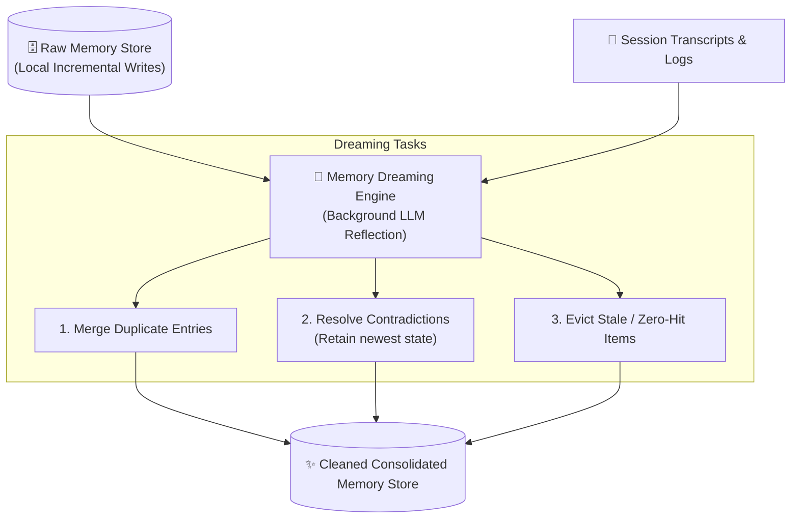

# 🎯 Week 04 — Day 07 Interview Questions & Deep Dive Answers

# Topic: Agent Application-Level Memory Systems & High-Performance LLM Inference (vLLM)

> **Target Audience:** Principal AI Engineers, Agent System Architects, and LLM Infrastructure Performance Engineers.

---

## 📑 Table of Contents

1. [Category 1 — Application-Level Memory & Context Limitations](#1-category-1--application-level-memory--context-limitations)
2. [Category 2 — Long-Term Memory (LTM) & RAG Integration](#2-category-2--long-term-memory-ltm--rag-integration)
3. [Category 3 — Memory Maintenance, Eviction & Dreaming](#3-category-3--memory-maintenance-eviction--dreaming)
4. [Category 4 — LLM Hardware & Inference Engines (vLLM)](#4-category-4--llm-hardware--inference-engines-vllm)
5. [Category 5 — Practical Node.js & Memory Code Implementations](#5-category-5--practical-nodejs--memory-code-implementations)

---

# 1. Category 1 — Application-Level Memory & Context Limitations

## Q1: Why are LLMs stateless HTTP APIs, and why does naive chat history appending fail in production?

### 💡 Answer:
LLM providers serve models over stateless REST APIs (`POST /chat/completions`). Every request is evaluated in complete isolation; the LLM holds zero internal memory of past HTTP requests.

### 💥 Production Failures of Naive History Appending:
1. **Context Window Exhaustion:** Multi-turn dialog eventually overflows token bounds.
2. **Network Bandwidth & Latency Spikes:** Transmitting megabytes of static past tokens on every user click introduces payload bloat.
3. **Escalating Financial Costs:** API providers bill per token. Re-sending unchanged historical tokens on every turn leads to exponential cost growth.
4. **Attention Degradation:** Large context windows suffer from "lost in the middle" attention degradation where the model misses instructions buried in long histories.

---

## Q2: What is Short-Term Memory (STM) and what is its fundamental flaw when used alone?

### 💡 Answer:
* **Short-Term Memory (STM):** Maintains immediate conversational context using a sliding window buffer of the latest $N$ messages (e.g., last 10–20 turns) stored in a database (PostgreSQL/Redis).
* **Fundamental Flaw:** Information Amnesia. Once a persistent fact (e.g. user dietary restrictions, name, or account preferences mentioned in Turn 1) slides out of the $N$-message window, the agent forgets it entirely.

---

# 2. Category 2 — Long-Term Memory (LTM) & RAG Integration

## Q3: Compare Semantic Memory (Facts), Episodic Memory (Events), and Graph Memory (Neo4j).

### 💡 Answer:

| Memory Type | Definition | Storage Structure | Use Case |
| :--- | :--- | :--- | :--- |
| **Semantic Memory (Facts)** | Key user profile traits, preferences, and facts. | Key-Value pairs with Vector Embeddings. | Storing user name, dietary restrictions, preferred programming language. |
| **Episodic Memory (Events)** | Sequential time-series log of past user activities and experiences. | Append-only event log with timestamp metadata + Vector index. | Recalling past project decisions, order history, multi-session workflows. |
| **Graph Memory (Knowledge Graph)** | Structured entity-relationship graphs. | Graph Database (e.g. **Neo4j**). | Multi-hop reasoning ("Sarah works with Bob who manages Project X"). |

---

## Q4: How does Fact Extraction work during user interactions, and how is LTM integrated via Vector RAG?

### 💡 Answer:
1. **Fact Extraction:** An async background LLM prompt analyzes incoming user queries to extract persistent user traits (*"User lives in Tokyo"*, *"User follows vegan diet"*).
2. **Indexing:** Extracted facts are embedded and stored in a Vector DB (Qdrant).
3. **Vector RAG Integration:** When a new query arrives, the system queries the Vector DB for facts semantically relevant to the new prompt, injecting only top-$K$ relevant facts alongside STM sliding window messages:

$$\text{Final Context Payload} = \text{System Prompt} + \text{Retrieved LTM Facts} + \text{STM Sliding Window} + \text{Query}$$

---

# 3. Category 3 — Memory Maintenance, Eviction & Dreaming

## Q5: What is the "Magic Problem" of Eviction Policies in Long-Term Memory stores?

### 💡 Answer:
As agents continuously append memories across sessions, memory stores suffer from **data degradation**:
* **Duplicates:** Storing "User likes JS" multiple times wastes vector index capacity.
* **Contradictions:** Fact 1 ("User lives in NYC") conflicts with Fact 2 ("User moved to SF").
* **Stale Items:** Old addresses, temporary preferences, or single-use query facts pollute vector search.

An **Eviction Policy** determines when to update, replace, or prune memory items to keep context high-precision.

---

## Q6: What is Memory "Dreaming" (Anthropic Claude Reflection Architecture)?

### 💡 Answer:
**Memory Dreaming** is an offline background reflection process inspired by Claude's research preview feature:



> **Immutability Principle:** The raw memory store and interaction logs are **never modified**. Dreaming reads raw logs and produces a clean, reorganized candidate store.

---

# 4. Category 4 — LLM Hardware & Inference Engines (vLLM)

## Q7: Why is LLM Inference memory-bandwidth bound while Training is compute-bound?

### 💡 Answer:
* **Training Phase (Compute-Bound):** Backpropagation matrix math processes large static batches in parallel. Compute throughput (TFLOPS) is the bottleneck.
* **Inference Phase (Memory-Bandwidth Bound):** Output tokens are generated auto-regressively **one token at a time**. For *every single token*, the GPU must move billions of weight parameters and Key-Value (KV) attention caches from High Bandwidth Memory (HBM/VRAM) to local SRAM execution registers.

---

## Q8: Compare Prefill Phase vs Decode Phase in LLM Generation.

### 💡 Answer:
* **Prefill Phase (Prompt Processing):** Processes all incoming prompt tokens simultaneously in parallel. Computes Key and Value attention matrices and writes them to VRAM. (Compute-heavy).
* **Decode Phase (Token Generation):** Generates output tokens auto-regressively one by one. Requires fetching past KV cache for each generated token. (Memory Bandwidth-bound).

---

## Q9: What is vLLM, and how does PagedAttention eliminate KV cache memory fragmentation?

### 💡 Answer:
**vLLM** is an open-source, high-throughput LLM serving engine developed at UC Berkeley.

### 🧠 PagedAttention Breakdown:
Traditional LLM serving pre-allocates contiguous VRAM for KV caches based on maximum sequence lengths, wasting **60%–80% of VRAM**.

**PagedAttention** applies virtual memory paging from Operating Systems:
* KV caches are partitioned into small, fixed-size physical memory pages.
* Pages are allocated dynamically on-demand non-contiguously.
* Eliminates internal fragmentation, reducing memory waste to **< 4%** and enabling **2x–4x larger batch sizes**.

---

## Q10: What are Continuous Batching, Chunked Prefill, and Prefix Caching in vLLM?

### 💡 Answer:
1. **Continuous Batching:** Schedules requests dynamically at the token iteration level rather than waiting for whole batches to finish generation.
2. **Chunked Prefill:** Blends long prompt prefill chunks into decode iterations to stabilize GPU latency.
3. **Prefix Caching:** Caches prefilled KV blocks for system prompts or multi-turn agent instructions. When new requests arrive with identical prompt prefixes, vLLM skips the Prefill phase entirely.

---

# 5. Category 5 — Practical Node.js & Memory Code Implementations

## Q11: Write a Node.js implementation of a Short-Term Memory sliding window store.

### 💡 Answer:

```javascript
export class ShortTermMemoryStore {
  constructor(maxMessages = 5) {
    this.maxMessages = maxMessages;
    this.sessions = new Map();
  }

  async addMessage(sessionId, role, content) {
    if (!this.sessions.has(sessionId)) {
      this.sessions.set(sessionId, []);
    }
    this.sessions.get(sessionId).push({ role, content, timestamp: new Date().toISOString() });
  }

  async getRecentContext(sessionId) {
    const history = this.sessions.get(sessionId) || [];
    return history.slice(-this.maxMessages);
  }
}
```

---

## Q12: Write a Node.js implementation of an offline Memory Dreaming process.

### 💡 Answer:

```javascript
export class MemoryDreamer {
  static dreamAndConsolidate(rawFacts) {
    console.log(`🌙 Starting Memory Dreaming Session...`);
    const consolidatedMap = new Map();

    for (const item of rawFacts) {
      const key = item.category || item.fact.toLowerCase().split(" ")[0];

      if (!consolidatedMap.has(key)) {
        consolidatedMap.set(key, item);
      } else {
        const existing = consolidatedMap.get(key);
        // Overwrite stale facts with newest timestamp
        if (new Date(item.createdAt) > new Date(existing.createdAt)) {
          consolidatedMap.set(key, item);
        }
      }
    }

    return Array.from(consolidatedMap.values());
  }
}

// Execution Demo
const rawMemory = [
  { id: "1", category: "location", fact: "User lives in NYC", createdAt: "2026-01-01T10:00:00Z" },
  { id: "2", category: "location", fact: "User moved to SF", createdAt: "2026-02-15T12:00:00Z" }
];
console.log("Cleaned Store:", MemoryDreamer.dreamAndConsolidate(rawMemory));
```
