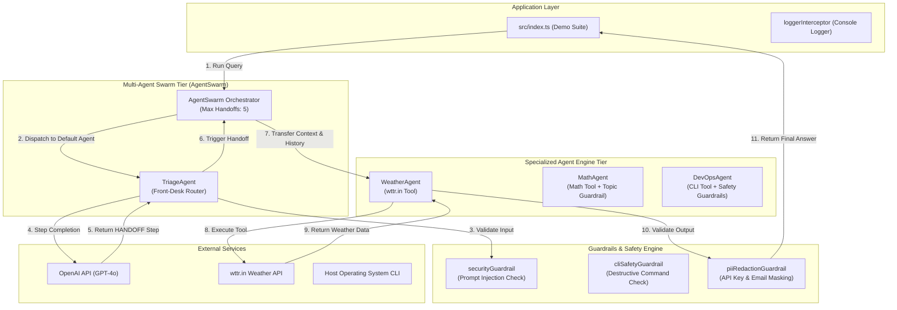
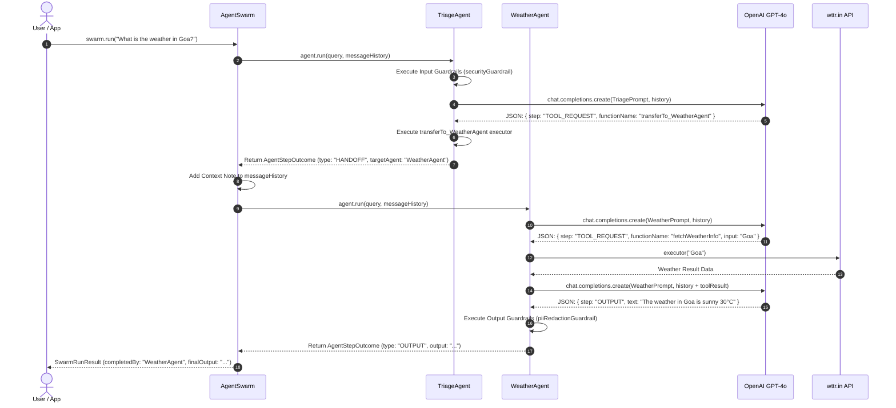

# Advanced Agent SDK Master Index — Multi-Agent, Guardrails & Handoff Framework

Welcome to the **Advanced Agent SDK Guide**! This guide takes TypeScript developers step-by-step through building an enterprise-grade, extensible **Multi-Agent AI Framework** from scratch.

Built on top of **Node.js**, **TypeScript (NodeNext ESM)**, **OpenAI GPT-4o**, and **dotenv**, this framework introduces advanced agentic capabilities including per-agent input/output guardrails (security, PII redaction, topic enforcement, CLI safety), real-time logging interceptors, dynamic JSON step parsing with regex fallbacks, offline simulation modes, and an **AgentSwarm Orchestrator** enabling multi-agent handoffs between specialized agents.

---

## 📁 Project Folder Structure Map

All source code for this framework is located inside `week04/learning/day08/code/agent-sdk-advanced/`:

```text
agent-sdk-advanced/
├── package.json                   # NPM dependencies & scripts ("type": "module")
├── tsconfig.json                  # TypeScript compiler settings (NodeNext ESM)
├── implementation guide/          # Step-by-step implementation chapters & documentation
│   ├── README.md                  # Master index & architecture overview (this file)
│   ├── chapter-00-overview-setup.md
│   ├── chapter-01-harness-prompt.md
│   ├── chapter-02-builder-pattern.md
│   ├── chapter-03-guardrails-interceptors.md
│   ├── chapter-04-agent-engine.md
│   ├── chapter-05-multiagent-swarm.md
│   └── chapter-06-tools-demo.md
└── src/
    ├── index.ts                   # SDK entry point, exports & multi-demo application
    ├── types.ts                   # Domain types, interfaces & step contracts
    ├── config.ts                  # Extended Harness prompt & step pipeline spec
    ├── builder.ts                 # Fluent AgentBuilder with guardrails & tools
    ├── agent.ts                   # Core Agent engine runtime & execution loop
    ├── swarm.ts                   # AgentSwarm multi-agent orchestrator
    ├── guardrails/                # Per-Agent Input/Output Guardrails
    │   ├── securityGuardrail.ts   # Prompt injection & jailbreak prevention
    │   ├── cliSafetyGuardrail.ts  # Dangerous CLI command detection (e.g. rm -rf)
    │   ├── topicGuardrail.ts      # Domain topic boundary enforcement
    │   ├── piiRedactionGuardrail.ts # API key, email & credit card masking
    │   └── contentSafetyGuardrail.ts # Harassment & profanity filter
    ├── interceptors/
    │   └── loggerInterceptor.ts   # Colored console logger interceptor
    └── tools/                     # Modular Tool Library
        ├── weatherTool.ts         # wttr.in weather API
        ├── mathTool.ts            # JS evaluation math engine
        ├── searchTool.ts          # Simulated web search engine
        ├── cliTool.ts             # Host OS child process execution
        └── handoffTool.ts         # Agent control transfer tool
```

---

## 🏗 System Architecture & Swarm Ecosystem

The framework operates at two distinct architectural levels: **Single Agent Runtime** (with local guardrails & tools) and **Swarm Orchestrator** (managing multi-agent routing & handoffs).



---

## 🔄 Multi-Agent Handoff Sequence Flow

When a user query is dispatched to `swarm.run(query)`, the Swarm delegates to the active agent, evaluates guardrails, processes step completions, and routes handoffs seamlessly across specialized agents.



---

## 🧠 Extended ReAct & Handoff State Machine

The cognitive pipeline adds the `HANDOFF` step state to standard ReAct steps:

```text
    ┌───────────┐
    │  INITIAL  │  Analyze user intent
    └─────┬─────┘
          │
          ▼
    ┌───────────┐
    │   THINK   │  Decompose problem & plan strategy
    └─────┬─────┘
          │
          ├───────────────────────┬───────────────────────┐
          ▼                       ▼                       ▼
    ┌──────────────┐       ┌─────────────┐         ┌───────────┐
    │ TOOL_REQUEST │       │   HANDOFF   │         │  OUTPUT   │
    └──────┬───────┘       └──────┬──────┘         └─────┬─────┘
           │                      │                      │
           ▼                      ▼                      ▼
    Execute ITool           Switch Agent in          Run Output
     Executor               Swarm Registry          Guardrails
           │                      │                      │
           └──────────────────────┴──────────────────────┘
```

---

## 📚 Master Chapter Reference Table

| Chapter | Focus Area | Guide File | Key Topics Covered |
| :--- | :--- | :--- | :--- |
| **Ch 0** | **Overview & Setup** | [Chapter 00 Guide](chapter-00-overview-setup.md) | Node.js ESM setup, `package.json`, `tsconfig.json`, domain contracts (`src/types.ts`). |
| **Ch 1** | **Extended Harness** | [Chapter 01 Guide](chapter-01-harness-prompt.md) | Extended ReAct pipeline with `HANDOFF` step (`src/config.ts`), JSON output schema rules. |
| **Ch 2** | **Fluent Builder** | [Chapter 02 Guide](chapter-02-builder-pattern.md) | `AgentBuilder` class (`src/builder.ts`), method chaining for guardrails, tools, models & keys. |
| **Ch 3** | **Guardrails & Logging**| [Chapter 03 Guide](chapter-03-guardrails-interceptors.md) | Per-Agent Input/Output Guardrails (`security`, `cliSafety`, `topic`, `piiRedaction`), colored logger. |
| **Ch 4** | **Core Agent Engine** | [Chapter 04 Guide](chapter-04-agent-engine.md) | `Agent` class runtime (`src/agent.ts`), input guardrails, JSON regex fallback, handoffs, offline simulation. |
| **Ch 5** | **Swarm & Handoffs** | [Chapter 05 Guide](chapter-05-multiagent-swarm.md) | `AgentSwarm` orchestrator (`src/swarm.ts`), handoff tools (`handoffTool.ts`), multi-agent context transfer. |
| **Ch 6** | **Tools & Multi-Demo** | [Chapter 06 Guide](chapter-06-tools-demo.md) | Tool suite (`cli`, `math`, `search`, `weather`), 3 full interactive demos in `src/index.ts`. |

---

## ⚡ Quick Start Sequence

### 1. Install Dependencies
Navigate to the project directory and install dependencies:

```bash
cd week04/learning/day08/code/agent-sdk-advanced
npm install
```

### 2. Configure Environment Variables (Optional)
Create a `.env` file or export your OpenAI API Key:

```bash
export OPENAI_API_KEY="your-openai-api-key-here"
```

> **Note**: If `OPENAI_API_KEY` is omitted, the framework automatically uses built-in **Offline Simulation Mode** to execute multi-agent workflows without throwing runtime crashes.

### 3. Build & Run the Demonstration Suite

```bash
npm run dev
```
