# Chapter 0 — Overview, Environment & Domain Types

## 1. Chapter Goal

The goal of this chapter is to set up the **Node.js + TypeScript (NodeNext ESM)** environment and establish the foundational domain data contracts (`src/types.ts`) for the **Advanced Agent SDK**.

Unlike standard single-purpose SDKs, an advanced agent framework requires strict type safety across multi-agent handoffs, guardrail validations, custom tool executors, event interceptors, and structured step outcomes.

In this chapter, we:
* Configure `package.json` with ESM module execution (`"type": "module"`)
* Configure `tsconfig.json` with strict type-checking and NodeNext module resolution
* Define comprehensive TypeScript domain interfaces in `src/types.ts`
* Verify setup compilation

---

### 🎯 Expected Outcome

By the end of this chapter, `src/types.ts` will export all data interfaces required for single agents, guardrails, tools, and multi-agent swarm orchestrators.

```text
agent-sdk-advanced/
├── package.json
├── tsconfig.json
└── src/
    └── types.ts        # Primary Type Contracts & Interfaces
```

---

## 2. Project Setup & Package Configuration

Navigate to the project root directory:

```bash
cd week04/learning/day08/code/agent-sdk-advanced
```

### `package.json`

```json
{
  "name": "agent-sdk-advanced",
  "version": "1.0.0",
  "description": "Advanced Agent SDK featuring multiple tools, multi-agent orchestrator, per-agent guardrails, and seamless handoffs.",
  "main": "dist/index.js",
  "type": "module",
  "scripts": {
    "build": "tsc",
    "start": "node dist/index.js",
    "dev": "tsc && node dist/index.js"
  },
  "keywords": [
    "agent-sdk",
    "multi-agent",
    "guardrails",
    "handoff",
    "openai",
    "typescript"
  ],
  "dependencies": {
    "axios": "^1.7.9",
    "dotenv": "^16.4.7",
    "openai": "^4.86.0"
  },
  "devDependencies": {
    "@types/node": "^22.13.0",
    "typescript": "^5.7.3"
  }
}
```

---

## 3. Domain Type Definitions (`src/types.ts`)

### File Path

```text
agent-sdk-advanced/src/types.ts
```

### Code

```typescript
export type MessageRole = "user" | "assistant" | "developer" | "system";

export interface IMessage {
  role: MessageRole;
  content: string;
  name?: string;
  timestamp?: number;
}

export interface ITool {
  name: string;
  description: string;
  doc?: string;
  executor: (input: string) => Promise<string> | string;
}

export type Interceptor = (message: IMessage, agentName?: string) => void;

export type PipelineStep =
  | "INITIAL"
  | "THINK"
  | "TOOL_REQUEST"
  | "ANALYSE"
  | "HANDOFF"
  | "OUTPUT";

export interface LLMStepResponse {
  step: PipelineStep;
  text?: string;
  functionName?: string;
  input?: string;
  targetAgent?: string;
  reason?: string;
}

export interface GuardrailResult {
  passed: boolean;
  reason?: string;
  modifiedContent?: string;
}

export interface IInputGuardrail {
  name: string;
  validate: (input: string, agentName: string) => Promise<GuardrailResult> | GuardrailResult;
}

export interface IOutputGuardrail {
  name: string;
  validate: (output: string, agentName: string) => Promise<GuardrailResult> | GuardrailResult;
}

export interface HandoffPayload {
  targetAgent: string;
  reason: string;
  context?: string;
}

export interface AgentStepOutcome {
  type: "OUTPUT" | "HANDOFF";
  output?: string;
  handoffPayload?: HandoffPayload;
  history: IMessage[];
}

export interface SwarmRunResult {
  completedBy: string;
  finalOutput: string;
  messageHistory: IMessage[];
  handoffLogs: Array<{ from: string; to: string; reason: string }>;
}
```

---

## 4. Deep Dive into Interface Roles

```mermaid
classDiagram
    class IMessage {
        +role: MessageRole
        +content: string
        +name?: string
        +timestamp?: number
    }

    class ITool {
        +name: string
        +description: string
        +doc?: string
        +executor(input: string) Promise~string~ | string
    }

    class IInputGuardrail {
        +name: string
        +validate(input: string, agentName: string) GuardrailResult
    }

    class IOutputGuardrail {
        +name: string
        +validate(output: string, agentName: string) GuardrailResult
    }

    class AgentStepOutcome {
        +type: "OUTPUT" | "HANDOFF"
        +output?: string
        +handoffPayload?: HandoffPayload
        +history: IMessage[]
    }

    class SwarmRunResult {
        +completedBy: string
        +finalOutput: string
        +messageHistory: IMessage[]
        +handoffLogs: Array
    }
```



1. **`PipelineStep`**: Extends the standard ReAct pipeline with `"HANDOFF"`, allowing explicit inter-agent routing.
2. **`GuardrailResult`**: Controls validation decisions. If `passed: false`, execution halts with `reason`. If `passed: true` and `modifiedContent` is provided, output text is sanitized (e.g. PII redacted).
3. **`AgentStepOutcome`**: Return contract from an individual `Agent.run()`. Signals to the Swarm orchestrator whether to deliver final output or switch active agent.

---

## 5. TypeScript Compiler Settings (`tsconfig.json`)

```json
{
  "compilerOptions": {
    "target": "ES2022",
    "module": "NodeNext",
    "moduleResolution": "NodeNext",
    "rootDir": "./src",
    "outDir": "./dist",
    "esModuleInterop": true,
    "forceConsistentCasingInFileNames": true,
    "strict": true,
    "skipLibCheck": true
  },
  "include": ["src/**/*"]
}
```

---

## 6. Verification & Setup Validation

To verify project compilation and type safety:

```bash
npm run build
```

### Expected Output

```text
> agent-sdk-advanced@1.0.0 build
> tsc
```

With `src/types.ts` and compilation validated, move to **Chapter 1** to implement the extended System Harness Prompt.
