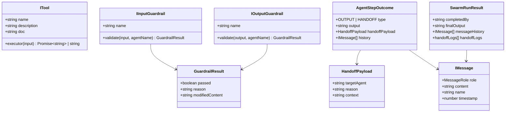

# Chapter 0 — Overview, Environment & Domain Types

## 1. Chapter Overview

Before building an Advanced Agent SDK, we need a solid foundation.

Our SDK will eventually support:

* 🤖 Multiple AI agents
* 🔄 Agent-to-agent handoffs
* 🛡️ Input and output guardrails
* 🧰 Custom tools
* 🔌 Interceptors for observing agent activity
* 🧠 Structured LLM reasoning steps
* 📜 Conversation and execution history
* 🐝 Multi-agent swarm orchestration

To make all of these features work together safely, we first need to define the **data structures and contracts** that the rest of the SDK will use.

In this chapter, we will set up:

1. A Node.js + TypeScript project
2. ES Module support using NodeNext
3. Strict TypeScript checking
4. The main domain types in `src/types.ts`
5. The TypeScript compilation process

---

## 2. What Are Domain Types?

Before looking at the code, let's understand what **domain types** mean.

Imagine we are building a restaurant application.

We might define:

```ts
interface User {
  name: string;
  email: string;
}
```

This tells the application:

> "Whenever we talk about a User, it must have a name and an email."

Our Agent SDK needs the same kind of contracts.

For example:

```ts
interface IMessage {
  role: MessageRole;
  content: string;
}
```

This tells the SDK:

> "An agent message must have a role and some content."

These types become the **common language** shared by different parts of the SDK.

---

## 3. Chapter Goal

The main goal of this chapter is to create the foundational type system for our Advanced Agent SDK.

By the end of this chapter, we will have types representing:

| Type               | Purpose                                          |
| ------------------ | ------------------------------------------------ |
| `MessageRole`      | Defines who produced a message                   |
| `IMessage`         | Represents a conversation message                |
| `ITool`            | Represents an executable agent tool              |
| `Interceptor`      | Allows us to observe messages                    |
| `PipelineStep`     | Represents stages of agent execution             |
| `LLMStepResponse`  | Represents a structured LLM step                 |
| `GuardrailResult`  | Represents validation results                    |
| `IInputGuardrail`  | Validates agent input                            |
| `IOutputGuardrail` | Validates agent output                           |
| `HandoffPayload`   | Contains information for agent handoffs          |
| `AgentStepOutcome` | Describes how an agent execution ended           |
| `SwarmRunResult`   | Represents the final result of a multi-agent run |

These contracts will be used by the agent, tool, guardrail, and swarm implementations in later chapters.

---

# 4. Project Structure

Our initial project will look like this:

```text
agent-sdk-advanced/
├── package.json
├── tsconfig.json
└── src/
    └── types.ts
```

### What does each file do?

### `package.json`

Contains project metadata, dependencies, and npm scripts.

### `tsconfig.json`

Controls how TypeScript compiles our code.

### `src/types.ts`

Contains the shared TypeScript types and interfaces used throughout the SDK.

Think of `types.ts` as the **contract layer** of our SDK.

---

# 5. Project Setup

Navigate to the project directory:

```bash
cd week04/learning/day08/code/agent-sdk-advanced
```

If the project has not been initialized yet, initialize a Node.js project:

```bash
npm init -y
```

We can then configure `package.json`.

---

# 6. `package.json`

### File

```text
agent-sdk-advanced/package.json
```

### Code

```json
{
  "name": "agent-sdk-advanced",
  "version": "1.0.0",
  "description": "Advanced Agent SDK featuring multiple tools, multi-agent orchestrator, per-agent guardrails, and seamless handoffs.",
  "main": "dist/index.js",
  "type": "module",
  "scripts": {
    "build": "tsc",
    "start": "node dist/index.js",
    "dev": "tsc && node dist/index.js"
  },
  "keywords": [
    "agent-sdk",
    "multi-agent",
    "guardrails",
    "handoff",
    "openai",
    "typescript"
  ],
  "dependencies": {
    "axios": "^1.7.9",
    "dotenv": "^16.4.7",
    "openai": "^4.86.0"
  },
  "devDependencies": {
    "@types/node": "^22.13.0",
    "typescript": "^5.7.3"
  }
}
```

---

## 7. Understanding `package.json`

Let's understand this file block by block.

### 7.1 Project Name

```json
"name": "agent-sdk-advanced"
```

This is the name of our Node.js project.

We are building an SDK, so we call it:

```text
agent-sdk-advanced
```

---

### 7.2 Version

```json
"version": "1.0.0"
```

This represents the current version of the project.

The common convention is:

```text
MAJOR.MINOR.PATCH
```

For example:

```text
1.0.0
1.1.0
2.0.0
```

We start with:

```text
1.0.0
```

---

### 7.3 Description

```json
"description": "Advanced Agent SDK featuring multiple tools, multi-agent orchestrator, per-agent guardrails, and seamless handoffs."
```

This is a short description of what the project does.

It is useful when the package is published or shared with other developers.

---

### 7.4 Main Entry Point

```json
"main": "dist/index.js"
```

This tells Node.js where the compiled application entry point is located.

Our TypeScript source code will live inside:

```text
src/
```

After compilation, TypeScript will generate JavaScript inside:

```text
dist/
```

So eventually we may have:

```text
src/index.ts
      ↓
dist/index.js
```

Therefore:

```json
"main": "dist/index.js"
```

points to the compiled JavaScript entry point.

---

### 7.5 ESM Configuration

```json
"type": "module"
```

This is an important setting.

It tells Node.js that our project uses **ES Modules (ESM)**.

This allows us to write modern imports such as:

```ts
import OpenAI from "openai";
```

instead of the older CommonJS style:

```js
const OpenAI = require("openai");
```

Our project will use:

```text
Node.js
+
TypeScript
+
ES Modules
+
NodeNext
```

This combination gives us modern JavaScript module behavior while still allowing TypeScript to understand Node.js module rules.

---

# 8. NPM Scripts

The `scripts` section defines commands that we can run using npm.

```json
"scripts": {
  "build": "tsc",
  "start": "node dist/index.js",
  "dev": "tsc && node dist/index.js"
}
```

Let's understand each command.

---

## 8.1 `build`

```json
"build": "tsc"
```

Running:

```bash
npm run build
```

executes:

```bash
tsc
```

`tsc` is the TypeScript compiler.

It converts:

```text
TypeScript
    ↓
JavaScript
```

For example:

```text
src/index.ts
       ↓
dist/index.js
```

---

## 8.2 `start`

```json
"start": "node dist/index.js"
```

This runs the compiled JavaScript application.

We first build the project:

```bash
npm run build
```

Then:

```bash
npm start
```

Node.js executes:

```text
dist/index.js
```

---

## 8.3 `dev`

```json
"dev": "tsc && node dist/index.js"
```

The `&&` means:

> Run the second command only if the first command succeeds.

So:

```bash
npm run dev
```

does:

```text
TypeScript compilation
        ↓
If successful
        ↓
Run compiled JavaScript
```

Equivalent to:

```bash
tsc && node dist/index.js
```

---

# 9. Dependencies

Our project uses three main runtime dependencies:

```json
"dependencies": {
  "axios": "^1.7.9",
  "dotenv": "^16.4.7",
  "openai": "^4.86.0"
}
```

### `openai`

Used to communicate with OpenAI models.

Our agents will eventually use it to:

* send prompts
* receive model responses
* process tool requests
* perform agent reasoning

### `axios`

A popular HTTP client for making API requests.

We may use it when our tools need to communicate with external APIs.

For example:

```text
Agent
  ↓
Tool
  ↓
Axios
  ↓
External API
```

### `dotenv`

Loads environment variables from a `.env` file.

For example:

```env
OPENAI_API_KEY=your-key
```

Our application can then access the key through:

```ts
process.env.OPENAI_API_KEY
```

---

# 10. Development Dependencies

```json
"devDependencies": {
  "@types/node": "^22.13.0",
  "typescript": "^5.7.3"
}
```

These packages are mainly required during development.

### TypeScript

```json
"typescript": "^5.7.3"
```

Provides the TypeScript compiler.

### `@types/node`

```json
"@types/node": "^22.13.0"
```

Provides TypeScript definitions for Node.js APIs.

For example:

```ts
process.env
```

comes from Node.js.

Without appropriate Node.js type definitions, TypeScript may not understand many Node-specific APIs.

---

# 11. Installing Dependencies

Run:

```bash
npm install
```

This installs the runtime dependencies.

Then make sure the development dependencies are installed as well:

```bash
npm install -D typescript @types/node
```

---

# 12. Domain Type Definitions

Now we can create the most important file of this chapter:

```text
src/types.ts
```

This file contains the contracts that the rest of our SDK will follow.

---

# 13. `src/types.ts`

### File Path

```text
agent-sdk-advanced/src/types.ts
```

### Complete Code

```typescript
export type MessageRole =
  | "user"
  | "assistant"
  | "developer"
  | "system";

export interface IMessage {
  role: MessageRole;
  content: string;
  name?: string;
  timestamp?: number;
}

export interface ITool {
  name: string;
  description: string;
  doc?: string;
  executor: (input: string) => Promise<string> | string;
}

export type Interceptor = (
  message: IMessage,
  agentName?: string
) => void;

export type PipelineStep =
  | "INITIAL"
  | "THINK"
  | "TOOL_REQUEST"
  | "ANALYSE"
  | "HANDOFF"
  | "OUTPUT";

export interface LLMStepResponse {
  step: PipelineStep;
  text?: string;
  functionName?: string;
  input?: string;
  targetAgent?: string;
  reason?: string;
}

export interface GuardrailResult {
  passed: boolean;
  reason?: string;
  modifiedContent?: string;
}

export interface IInputGuardrail {
  name: string;
  validate: (
    input: string,
    agentName: string
  ) => Promise<GuardrailResult> | GuardrailResult;
}

export interface IOutputGuardrail {
  name: string;
  validate: (
    output: string,
    agentName: string
  ) => Promise<GuardrailResult> | GuardrailResult;
}

export interface HandoffPayload {
  targetAgent: string;
  reason: string;
  context?: string;
}

export interface AgentStepOutcome {
  type: "OUTPUT" | "HANDOFF";
  output?: string;
  handoffPayload?: HandoffPayload;
  history: IMessage[];
}

export interface SwarmRunResult {
  completedBy: string;
  finalOutput: string;
  messageHistory: IMessage[];
  handoffLogs: Array<{
    from: string;
    to: string;
    reason: string;
  }>;
}
```

Now let's understand this file **block by block**.

---

# 14. `MessageRole`

```typescript
export type MessageRole =
  | "user"
  | "assistant"
  | "developer"
  | "system";
```

This creates a TypeScript **union type**.

It means `MessageRole` can only contain one of these four values:

```text
"user"
"assistant"
"developer"
"system"
```

For example:

```ts
const role: MessageRole = "user";
```

Valid.

But:

```ts
const role: MessageRole = "admin";
```

Invalid.

TypeScript will report an error because `"admin"` is not part of `MessageRole`.

### Why is this useful?

AI conversations contain different types of messages.

For example:

```text
User:
"What's the weather?"

Assistant:
"Let me check."

System:
"You are a helpful assistant."
```

Instead of using a generic `string`, we restrict the value to known roles.

---

# 15. `IMessage`

```typescript
export interface IMessage {
  role: MessageRole;
  content: string;
  name?: string;
  timestamp?: number;
}
```

`IMessage` represents **one message in a conversation**.

For example:

```ts
const message: IMessage = {
  role: "user",
  content: "What is TypeScript?"
};
```

---

## 15.1 `role`

```ts
role: MessageRole;
```

Defines who produced the message.

Because it uses `MessageRole`, only these values are allowed:

```text
user
assistant
developer
system
```

---

## 15.2 `content`

```ts
content: string;
```

Contains the actual message text.

Example:

```ts
content: "Explain TypeScript"
```

---

## 15.3 Optional `name`

```ts
name?: string;
```

The `?` means this property is optional.

Both are valid:

```ts
{
  role: "user",
  content: "Hello"
}
```

and:

```ts
{
  role: "user",
  content: "Hello",
  name: "Aminul"
}
```

---

## 15.4 Optional `timestamp`

```ts
timestamp?: number;
```

Can store the time when the message was created.

For example:

```ts
{
  role: "user",
  content: "Hello",
  timestamp: Date.now()
}
```

---

# 16. `ITool`

```typescript
export interface ITool {
  name: string;
  description: string;
  doc?: string;
  executor: (input: string) => Promise<string> | string;
}
```

This interface represents a **tool that an agent can use**.

Think about an AI agent that needs to perform an action.

For example:

```text
Agent
  ↓
Calculator Tool
  ↓
Calculate 25 × 4
  ↓
100
```

The agent decides when a tool is required, while the tool's `executor` performs the actual operation.

---

## 16.1 Tool Name

```ts
name: string;
```

Identifies the tool.

Example:

```ts
name: "calculator"
```

---

## 16.2 Tool Description

```ts
description: string;
```

Explains what the tool does.

Example:

```ts
description: "Performs mathematical calculations"
```

This information can later be provided to the LLM so it knows when the tool should be used.

---

## 16.3 Optional Documentation

```ts
doc?: string;
```

Additional documentation about the tool.

It is optional because not every tool needs extra documentation.

---

## 16.4 Tool Executor

```ts
executor: (input: string) => Promise<string> | string;
```

This is the most important part of `ITool`.

It describes a function.

The function:

```text
receives → string
returns → string OR Promise<string>
```

For example:

```ts
executor: (input) => {
  return `You entered: ${input}`;
}
```

It can also be asynchronous:

```ts
executor: async (input) => {
  // API request
  return "API result";
}
```

Why support both?

Because some tools are simple and synchronous:

```text
Calculator
String formatter
Basic parser
```

while others may require asynchronous operations:

```text
Database
HTTP API
File system
External service
```

---

# 17. `Interceptor`

```typescript
export type Interceptor = (
  message: IMessage,
  agentName?: string
) => void;
```

An interceptor allows us to **observe what is happening inside the agent system**.

For example:

```text
Agent generates message
        ↓
Interceptor sees message
        ↓
Logger stores it
        ↓
Agent continues
```

The interceptor receives:

```ts
message: IMessage
```

and optionally:

```ts
agentName?: string
```

It returns:

```ts
void
```

because its job is observation rather than producing a result.

A simple example might eventually look like:

```ts
const logger: Interceptor = (message, agentName) => {
  console.log(agentName, message.content);
};
```

---

# 18. `PipelineStep`

```typescript
export type PipelineStep =
  | "INITIAL"
  | "THINK"
  | "TOOL_REQUEST"
  | "ANALYSE"
  | "HANDOFF"
  | "OUTPUT";
```

This represents the different stages an agent can go through.

A simplified pipeline looks like:

```text
INITIAL
   ↓
THINK
   ↓
ANALYSE
   ↓
 ┌───────────────┐
 │               │
Tool required?   No
 │               │
 ↓               ↓
TOOL_REQUEST    OUTPUT
 │
 ↓
ANALYSE
```

In a multi-agent system, another possibility is:

```text
ANALYSE
   ↓
HANDOFF
   ↓
Another Agent
```

---

## Why `HANDOFF` is important

A normal single-agent system might only need:

```text
THINK → TOOL → OUTPUT
```

But our Advanced Agent SDK supports multiple agents.

For example:

```text
User
 ↓
Support Agent
 ↓
Technical Agent
 ↓
Billing Agent
```

The `HANDOFF` step tells the orchestrator:

> "This agent should stop processing and another agent should continue."

---

# 19. `LLMStepResponse`

```typescript
export interface LLMStepResponse {
  step: PipelineStep;
  text?: string;
  functionName?: string;
  input?: string;
  targetAgent?: string;
  reason?: string;
}
```

This interface represents a **structured response from the LLM**.

Instead of treating every model response as just plain text, we represent the agent's next action explicitly.

For example:

```ts
{
  step: "TOOL_REQUEST",
  functionName: "calculator",
  input: "25 * 4"
}
```

Or:

```ts
{
  step: "HANDOFF",
  targetAgent: "billing-agent",
  reason: "The user is asking about a billing issue."
}
```

---

## Properties

### `step`

```ts
step: PipelineStep;
```

Required.

Tells us what stage/action the LLM selected.

---

### `text`

```ts
text?: string;
```

Optional text generated by the model.

---

### `functionName`

```ts
functionName?: string;
```

Contains the tool/function name when the model requests a tool.

Example:

```text
calculator
weather
search
```

---

### `input`

```ts
input?: string;
```

Contains the input sent to the tool.

Example:

```text
25 * 4
```

---

### `targetAgent`

```ts
targetAgent?: string;
```

Used when the current agent wants to hand the task to another agent.

Example:

```text
billing-agent
```

---

### `reason`

```ts
reason?: string;
```

Explains why an action happened.

For a handoff:

```text
"The user is asking about an invoice."
```

---

# 20. `GuardrailResult`

```typescript
export interface GuardrailResult {
  passed: boolean;
  reason?: string;
  modifiedContent?: string;
}
```

A guardrail is a safety or validation layer.

It checks content before or after an agent processes it.

For example:

```text
User Input
    ↓
Input Guardrail
    ↓
Allowed?
    ↓
Agent
```

And:

```text
Agent Output
    ↓
Output Guardrail
    ↓
Safe?
    ↓
User
```

---

## 20.1 `passed`

```ts
passed: boolean;
```

This tells us whether validation succeeded.

Example:

```ts
{
  passed: true
}
```

means:

> The content passed validation.

While:

```ts
{
  passed: false
}
```

means:

> The content failed validation.

---

## 20.2 `reason`

```ts
reason?: string;
```

Optional explanation for the validation result.

Example:

```ts
{
  passed: false,
  reason: "Input contains prohibited content."
}
```

---

## 20.3 `modifiedContent`

```ts
modifiedContent?: string;
```

Allows a guardrail to modify content instead of simply rejecting it.

For example:

```text
Original:
"My phone number is 9876543210"

After guardrail:
"My phone number is [REDACTED]"
```

This is useful for things such as:

* PII redaction
* Content filtering
* Formatting
* Sanitization

---

# 21. `IInputGuardrail`

```typescript
export interface IInputGuardrail {
  name: string;
  validate: (
    input: string,
    agentName: string
  ) => Promise<GuardrailResult> | GuardrailResult;
}
```

This represents a guardrail that validates **user input before the agent processes it**.

The flow is:

```text
User Input
    ↓
Input Guardrail
    ↓
Agent
```

---

## `name`

```ts
name: string;
```

The name of the guardrail.

Example:

```ts
name: "prompt-safety"
```

---

## `validate`

```ts
validate: (
  input: string,
  agentName: string
) => Promise<GuardrailResult> | GuardrailResult;
```

This function performs the actual validation.

It receives:

```text
input
agentName
```

and returns:

```text
GuardrailResult
```

It can be synchronous:

```ts
validate: (input, agentName) => {
  return {
    passed: true
  };
}
```

or asynchronous:

```ts
validate: async (input, agentName) => {
  // Call external moderation API
  return {
    passed: true
  };
}
```

---

# 22. `IOutputGuardrail`

```typescript
export interface IOutputGuardrail {
  name: string;
  validate: (
    output: string,
    agentName: string
  ) => Promise<GuardrailResult> | GuardrailResult;
}
```

This is similar to `IInputGuardrail`, but it checks the **agent's output**.

The flow becomes:

```text
User
 ↓
Agent
 ↓
Generated Output
 ↓
Output Guardrail
 ↓
User
```

Why do we need both?

Because validating only user input is not enough.

An agent may receive safe input but still produce an unsafe or unwanted response.

Therefore:

```text
Input Guardrail
+
Output Guardrail
```

provides protection on both sides of the agent.

---

# 23. `HandoffPayload`

```typescript
export interface HandoffPayload {
  targetAgent: string;
  reason: string;
  context?: string;
}
```

This interface contains information required when one agent transfers work to another agent.

For example:

```text
Support Agent
      ↓
Technical Agent
```

The handoff could contain:

```ts
{
  targetAgent: "technical-agent",
  reason: "The issue requires technical troubleshooting.",
  context: "User cannot connect their account."
}
```

---

## `targetAgent`

```ts
targetAgent: string;
```

The agent that should receive the task.

---

## `reason`

```ts
reason: string;
```

Why the handoff is happening.

---

## `context`

```ts
context?: string;
```

Optional information that should be passed to the next agent.

This prevents the next agent from starting completely from scratch.

---

# 24. `AgentStepOutcome`

```typescript
export interface AgentStepOutcome {
  type: "OUTPUT" | "HANDOFF";
  output?: string;
  handoffPayload?: HandoffPayload;
  history: IMessage[];
}
```

This represents the result of **one agent execution**.

An agent can finish in two main ways:

```text
OUTPUT
```

or:

```text
HANDOFF
```

---

## Case 1 — Agent produces final output

```ts
{
  type: "OUTPUT",
  output: "Your account has been successfully updated.",
  history: [...]
}
```

The agent is finished.

---

## Case 2 — Agent performs a handoff

```ts
{
  type: "HANDOFF",
  handoffPayload: {
    targetAgent: "billing-agent",
    reason: "This is a billing question."
  },
  history: [...]
}
```

The current agent is not finishing the request.

Instead, it tells the orchestrator:

> "Send this task to another agent."

---

## `history`

```ts
history: IMessage[];
```

Contains the messages generated during the agent's execution.

This is important because the next agent may need the previous conversation context.

---

# 25. `SwarmRunResult`

```typescript
export interface SwarmRunResult {
  completedBy: string;
  finalOutput: string;
  messageHistory: IMessage[];
  handoffLogs: Array<{
    from: string;
    to: string;
    reason: string;
  }>;
}
```

This represents the **final result of the entire multi-agent swarm execution**.

Imagine:

```text
User
 ↓
Agent A
 ↓
Agent B
 ↓
Agent C
 ↓
Final Answer
```

The orchestrator needs to return information about the complete execution.

---

## `completedBy`

```ts
completedBy: string;
```

The name of the agent that ultimately produced the final answer.

Example:

```text
technical-agent
```

---

## `finalOutput`

```ts
finalOutput: string;
```

The final answer returned to the user.

---

## `messageHistory`

```ts
messageHistory: IMessage[];
```

Contains the complete message history of the swarm execution.

This can help with:

* debugging
* observability
* logging
* tracing
* future context

---

## `handoffLogs`

```ts
handoffLogs: Array<{
  from: string;
  to: string;
  reason: string;
}>;
```

Stores every agent-to-agent handoff.

For example:

```ts
[
  {
    from: "support-agent",
    to: "technical-agent",
    reason: "Technical troubleshooting is required."
  },
  {
    from: "technical-agent",
    to: "billing-agent",
    reason: "The issue is related to billing."
  }
]
```

This gives us a trace of how the task moved through the swarm.

---

# 26. How the Types Connect

The types we created are not isolated.

They form a larger architecture:

```text
                         ┌──────────────┐
                         │   IMessage   │
                         └──────┬───────┘
                                │
                    ┌───────────┴───────────┐
                    │                       │
              Interceptor              History
                    │                       │
                    ▼                       ▼

User Input
    │
    ▼
┌────────────────────┐
│ Input Guardrail     │
└─────────┬──────────┘
          │
          ▼
      ┌─────────┐
      │  Agent  │
      └────┬────┘
           │
           ▼
   ┌────────────────┐
   │ LLMStepResponse│
   └───────┬────────┘
           │
      ┌────┴───────────┐
      │                │
      ▼                ▼
   Tool Request     Handoff
      │                │
      ▼                ▼
   ITool          HandoffPayload
      │                │
      └───────┬────────┘
              │
              ▼
      AgentStepOutcome
              │
       ┌──────┴───────┐
       │              │
       ▼              ▼
     OUTPUT        HANDOFF
                      │
                      ▼
                 Another Agent
                      │
                      ▼
              SwarmRunResult
```

This is the basic foundation of our Advanced Agent SDK.

---

# 27. Type Relationships at a Glance

| Type               | Connected To                                        | Main Responsibility          |
| ------------------ | --------------------------------------------------- | ---------------------------- |
| `MessageRole`      | `IMessage`                                          | Defines message sender       |
| `IMessage`         | `Interceptor`, `AgentStepOutcome`, `SwarmRunResult` | Represents messages          |
| `ITool`            | `LLMStepResponse`                                   | Executes agent tools         |
| `Interceptor`      | `IMessage`                                          | Observes execution           |
| `PipelineStep`     | `LLMStepResponse`                                   | Defines execution stages     |
| `LLMStepResponse`  | Agent                                               | Describes LLM decisions      |
| `GuardrailResult`  | Input/Output guardrails                             | Validation result            |
| `IInputGuardrail`  | `GuardrailResult`                                   | Validates user input         |
| `IOutputGuardrail` | `GuardrailResult`                                   | Validates agent output       |
| `HandoffPayload`   | `AgentStepOutcome`                                  | Describes agent handoff      |
| `AgentStepOutcome` | Swarm                                               | Describes one agent's result |
| `SwarmRunResult`   | Swarm orchestrator                                  | Describes complete execution |

---

# 28. Architecture Diagram



---

# 29. Important Concepts to Remember

### 29.1 `PipelineStep`

```ts
type PipelineStep =
  | "INITIAL"
  | "THINK"
  | "TOOL_REQUEST"
  | "ANALYSE"
  | "HANDOFF"
  | "OUTPUT";
```

This defines the possible stages of agent execution.

The important addition compared with a simple single-agent pipeline is:

```text
HANDOFF
```

This allows agents to explicitly route work to another agent.

---

### 29.2 `GuardrailResult`

```ts
interface GuardrailResult {
  passed: boolean;
  reason?: string;
  modifiedContent?: string;
}
```

This gives guardrails three possibilities:

```text
PASS
 ↓
Continue
```

or:

```text
FAIL
 ↓
Stop execution
```

or:

```text
MODIFY
 ↓
Sanitize content
 ↓
Continue
```

For example, sensitive information could be replaced before the content continues through the system.

---

### 29.3 `AgentStepOutcome`

```ts
interface AgentStepOutcome {
  type: "OUTPUT" | "HANDOFF";
  ...
}
```

This is the contract between an individual agent and the swarm orchestrator.

The agent essentially says:

```text
"I am finished."
```

or:

```text
"I need another agent to continue."
```

The orchestrator can then decide what to do next.

---

# 30. TypeScript Compiler Configuration

Now that our domain types are ready, we need to configure TypeScript.

Create:

```text
tsconfig.json
```

### Code

```json
{
  "compilerOptions": {
    "target": "ES2022",
    "module": "NodeNext",
    "moduleResolution": "NodeNext",
    "lib": ["ES2022"],
    "outDir": "./dist",
    "rootDir": "./src",
    "strict": true,
    "esModuleInterop": true,
    "skipLibCheck": true,
    "forceConsistentCasingInFileNames": true,
    "declaration": true
  },
  "include": ["src/**/*"]
}
```

---

# 31. Understanding `tsconfig.json`

Let's understand the configuration one property at a time.

---

## `target`

```json
"target": "ES2022"
```

Defines the JavaScript version TypeScript should generate.

We choose:

```text
ES2022
```

because modern Node.js versions support modern JavaScript features.

Conceptually:

```text
TypeScript
    ↓
ES2022 JavaScript
```

---

## `module`

```json
"module": "NodeNext"
```

Tells TypeScript to follow Node.js's modern module behavior.

This works together with:

```json
"type": "module"
```

from `package.json`.

Together they tell our project:

> Use modern ESM-style modules and Node.js module resolution rules.

---

## `moduleResolution`

```json
"moduleResolution": "NodeNext"
```

Controls how TypeScript finds imported modules.

For example:

```ts
import { Agent } from "./agent.js";
```

TypeScript needs to understand how Node.js will resolve that import.

`NodeNext` makes TypeScript follow Node.js's modern ESM/CommonJS rules.

---

## `lib`

```json
"lib": ["ES2022"]
```

Specifies which standard JavaScript APIs TypeScript should know about.

For example:

```ts
Promise
Map
Set
Array
```

and other modern JavaScript APIs.

---

## `outDir`

```json
"outDir": "./dist"
```

Specifies where compiled JavaScript files should be placed.

For example:

```text
src/index.ts
      ↓
dist/index.js
```

---

## `rootDir`

```json
"rootDir": "./src"
```

Tells TypeScript where our source code starts.

Our source files live inside:

```text
src/
```

---

## `strict`

```json
"strict": true
```

This is one of the most important settings.

It enables TypeScript's strict type-checking features.

For example, TypeScript can catch mistakes like:

```ts
const age: number = "twenty";
```

This prevents many runtime bugs before our application even runs.

For an SDK, strict typing is especially important because many different components depend on the same contracts.

---

## `esModuleInterop`

```json
"esModuleInterop": true
```

Improves compatibility between CommonJS and ES Module packages.

This makes importing some existing Node.js packages easier.

---

## `skipLibCheck`

```json
"skipLibCheck": true
```

Tells TypeScript not to fully type-check declaration files from dependencies.

This can make compilation faster and prevent unrelated dependency type errors from blocking our own code.

---

## `forceConsistentCasingInFileNames`

```json
"forceConsistentCasingInFileNames": true
```

Ensures file names are referenced with consistent capitalization.

For example, these could cause problems on case-sensitive systems:

```text
Agent.ts
agent.ts
```

This setting helps prevent such issues.

---

## `declaration`

```json
"declaration": true
```

Generates TypeScript declaration files:

```text
.d.ts
```

For example:

```text
src/types.ts
      ↓
dist/types.js
dist/types.d.ts
```

This is especially useful because we are building an **SDK**.

Other developers can use the generated `.d.ts` files to understand the types exposed by our package.

---

# 32. Compilation Flow

Our complete TypeScript flow now looks like:

```text
src/
├── types.ts
└── index.ts

        │
        │ npm run build
        ▼

TypeScript Compiler
        │
        ▼

dist/
├── types.js
├── types.d.ts
├── index.js
└── index.d.ts
```

The exact generated files will depend on which source files exist.

---

# 33. Verify the Project

Run:

```bash
npm run build
```

The command executes:

```bash
tsc
```

If everything is configured correctly, TypeScript should compile the project without errors.

Expected output:

```text
> agent-sdk-advanced@1.0.0 build
> tsc
```

If there are no errors after this output, the compilation was successful.

---

# 34. What If TypeScript Shows an Error?

Do not immediately assume the code is wrong.

Check:

### 1. Is TypeScript installed?

```bash
npm install -D typescript
```

### 2. Is `tsconfig.json` in the project root?

It should be:

```text
agent-sdk-advanced/
├── package.json
├── tsconfig.json
└── src/
```

### 3. Is `types.ts` inside `src`?

Correct:

```text
src/types.ts
```

### 4. Did you run the command from the project root?

Run:

```bash
pwd
```

and make sure you are inside:

```text
agent-sdk-advanced
```

---

# 35. Final Project Structure

After completing this chapter:

```text
agent-sdk-advanced/
│
├── package.json
├── tsconfig.json
│
├── node_modules/
│
└── src/
    └── types.ts
```

After compilation, you should also have:

```text
dist/
```

containing the generated JavaScript and declaration files.

---

# 36. Complete Architecture So Far

At this point, we have not created the actual Agent yet.

Instead, we have created the **contracts that the Agent will follow**.

The architecture is beginning to look like:

```text
                    Advanced Agent SDK
                           │
              ┌────────────┴────────────┐
              │                         │
           Agent                      Swarm
              │                         │
       ┌──────┼──────┐                  │
       │      │      │                  │
    Tools  Guards  LLM             Handoffs
       │      │      │                  │
       └──────┼──────┘                  │
              │                         │
              └──────────┬──────────────┘
                         │
                      Types
                         │
                    src/types.ts
```

`src/types.ts` therefore acts as the **shared contract layer** between the different components.

---

# 37. Chapter Summary

In this chapter, we created the foundation of our Advanced Agent SDK.

### We configured:

* Node.js
* TypeScript
* ES Modules
* NodeNext module resolution
* Strict type checking
* TypeScript declaration generation

### We created:

```text
src/types.ts
```

with contracts for:

* Messages
* Tools
* Interceptors
* Pipeline steps
* LLM responses
* Input guardrails
* Output guardrails
* Handoffs
* Agent execution outcomes
* Swarm execution results

### The most important idea

The types are not just syntax.

They define **how different components of our SDK communicate with each other**.

For example:

```text
LLM
 ↓
LLMStepResponse
 ↓
Agent
 ↓
AgentStepOutcome
 ↓
Swarm
 ↓
SwarmRunResult
```

And when an agent needs another agent:

```text
Agent
 ↓
HandoffPayload
 ↓
Swarm Orchestrator
 ↓
Another Agent
```

This gives us a predictable and type-safe architecture before we start implementing the actual agent logic.

---

# 38. Chapter 0 Checklist

Before moving to the next chapter, make sure:

* [ ] `package.json` is configured
* [ ] `"type": "module"` is present
* [ ] TypeScript is installed
* [ ] `tsconfig.json` is configured
* [ ] `src/types.ts` exists
* [ ] `MessageRole` is defined
* [ ] `IMessage` is defined
* [ ] `ITool` is defined
* [ ] Guardrail types are defined
* [ ] Handoff types are defined
* [ ] Swarm result types are defined
* [ ] `npm run build` completes successfully

---

## Next Chapter

With the environment and domain contracts ready, we can move to:

**Chapter 1 — Extended System Harness Prompt**