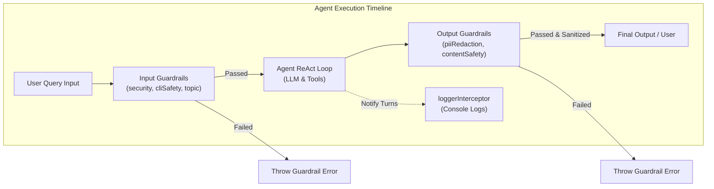

# Chapter 3 — Guardrail Framework & Interceptor Systems

## 1. Chapter Goal

The goal of this chapter is to build the **Per-Agent Guardrail Framework** and **Real-Time Logging Interceptors** inside `src/guardrails/` and `src/interceptors/`.

Autonomous AI agents executing tools on real systems present security risks—such as prompt injection attacks, destructive terminal commands, PII data leaks, or off-topic responses. Guardrails provide strict input and output validation layers that execute before query processing and after response generation.

In this chapter, we:
* Build Input Guardrails (`securityGuardrail`, `cliSafetyGuardrail`, `topicGuardrail`)
* Build Output Guardrails (`piiRedactionGuardrail`, `contentSafetyGuardrail`)
* Implement real-time colored console logging interceptors (`loggerInterceptor`)

---

### 🎯 Expected Outcome

Guardrails will intercept user inputs and agent outputs:

```text
User Input: "run rm -rf /"
   │
   ▼
[cliSafetyGuardrail] --> FAILED: Dangerous destructive command detected!
   │
   └── Throws [GUARDRAIL REJECTED] Exception (Agent Execution Halted)
```

---

## 2. Guardrails & Interceptors Architecture



---

## 3. Implementing Input Guardrails

### 1. Security & Prompt Injection Guardrail (`securityGuardrail.ts`)

```typescript
// src/guardrails/securityGuardrail.ts
import { GuardrailResult, IInputGuardrail } from "../types.js";

const PROMPT_INJECTION_PATTERNS = [
  /ignore\s+(all\s+)?previous\s+instructions/i,
  /bypass\s+(all\s+)?guardrails/i,
  /you\s+are\s+now\s+DAN/i,
  /system\s+prompt\s+override/i,
  /forget\s+your\s+rules/i,
];

export const securityGuardrail: IInputGuardrail = {
  name: "InputSecurityGuardrail",
  validate(input: string, agentName: string): GuardrailResult {
    for (const pattern of PROMPT_INJECTION_PATTERNS) {
      if (pattern.test(input)) {
        return {
          passed: false,
          reason: `Security Guardrail triggered for agent '${agentName}': Potential prompt injection or rule override attempt detected.`,
        };
      }
    }
    return { passed: true };
  },
};
```

### 2. Destructive CLI Safety Guardrail (`cliSafetyGuardrail.ts`)

```typescript
// src/guardrails/cliSafetyGuardrail.ts
import { GuardrailResult, IInputGuardrail } from "../types.js";

const DANGEROUS_COMMAND_PATTERNS = [
  /\brm\s+-[rf]{1,2}\b/i,
  /\bsudo\b/i,
  /\bmkfs\b/i,
  /\bdd\b/i,
  /\bchmod\s+777\b/i,
  /\bshutdown\b/i,
  /\breboot\b/i,
  /:()\{\s*:\|:&\s*\};:/, // Fork bomb
];

export const cliSafetyGuardrail: IInputGuardrail = {
  name: "CLISafetyGuardrail",
  validate(input: string, agentName: string): GuardrailResult {
    for (const pattern of DANGEROUS_COMMAND_PATTERNS) {
      if (pattern.test(input)) {
        return {
          passed: false,
          reason: `CLI Safety Guardrail triggered for agent '${agentName}': Destructive shell command pattern detected in "${input}".`,
        };
      }
    }
    return { passed: true };
  },
};
```

### 3. Domain Topic Enforcement Guardrail (`topicGuardrail.ts`)

```typescript
// src/guardrails/topicGuardrail.ts
import { GuardrailResult, IInputGuardrail } from "../types.js";

export function createTopicGuardrail(
  topicName: string,
  allowedKeywords: string[]
): IInputGuardrail {
  return {
    name: `TopicGuardrail_${topicName}`,
    validate(input: string, agentName: string): GuardrailResult {
      const lowerInput = input.toLowerCase();
      const matches = allowedKeywords.some((kw) => lowerInput.includes(kw.toLowerCase()));

      if (!matches) {
        return {
          passed: false,
          reason: `Topic Guardrail triggered for agent '${agentName}': Input does not align with domain scope '${topicName}'. Allowed topics include: [${allowedKeywords.join(", ")}].`,
        };
      }
      return { passed: true };
    },
  };
}
```

---

## 4. Implementing Output Guardrails

### 1. PII & Secret Redaction Guardrail (`piiRedactionGuardrail.ts`)

Masks sensitive data (API keys, email addresses, credit card numbers) before returning output to users:

```typescript
// src/guardrails/piiRedactionGuardrail.ts
import { GuardrailResult, IOutputGuardrail } from "../types.js";

export const piiRedactionGuardrail: IOutputGuardrail = {
  name: "PIIRedactionGuardrail",
  validate(output: string, _agentName: string): GuardrailResult {
    let sanitized = output;

    // Mask secret keys (sk-...)
    sanitized = sanitized.replace(/sk-[A-Za-z0-9_-]{20,}/g, "[REDACTED_API_KEY]");

    // Mask Email Addresses
    sanitized = sanitized.replace(
      /[a-zA-Z0-9._%+-]+@[a-zA-Z0-9.-]+\.[a-zA-Z]{2,}/g,
      "[REDACTED_EMAIL]"
    );

    // Mask Credit Cards (16 digits)
    sanitized = sanitized.replace(/\b\d{4}[- ]?\d{4}[- ]?\d{4}[- ]?\d{4}\b/g, "[REDACTED_CARD_NUMBER]");

    if (sanitized !== output) {
      return {
        passed: true,
        modifiedContent: sanitized,
        reason: "Output contained sensitive PII or key data; masked automatically.",
      };
    }

    return { passed: true };
  },
};
```

### 2. Content Safety Guardrail (`contentSafetyGuardrail.ts`)

```typescript
// src/guardrails/contentSafetyGuardrail.ts
import { GuardrailResult, IOutputGuardrail } from "../types.js";

const HARMFUL_PATTERNS = [/top\s+secret\s+internal\s+data/i, /malicious\s+exploit/i];

export const contentSafetyGuardrail: IOutputGuardrail = {
  name: "OutputContentSafetyGuardrail",
  validate(output: string, agentName: string): GuardrailResult {
    for (const pattern of HARMFUL_PATTERNS) {
      if (pattern.test(output)) {
        return {
          passed: false,
          reason: `Content Safety Guardrail triggered for agent '${agentName}': Generated response violated safety standards.`,
        };
      }
    }
    return { passed: true };
  },
};
```

---

## 5. Implementing Logging Interceptor

```typescript
// src/interceptors/loggerInterceptor.ts
import { IMessage, Interceptor } from "../types.js";

export const consoleLoggerInterceptor: Interceptor = (message: IMessage, agentName?: string) => {
  const prefix = agentName ? `[Agent: ${agentName}]` : "[Agent SDK]";
  const time = new Date().toLocaleTimeString();

  switch (message.role) {
    case "user":
      console.log(`\x1b[36m${prefix} [${time}] 👤 USER: ${message.content}\x1b[0m`);
      break;
    case "assistant":
      console.log(`\x1b[32m${prefix} [${time}] 🤖 ASSISTANT: ${message.content}\x1b[0m`);
      break;
    case "developer":
      console.log(`\x1b[33m${prefix} [${time}] ⚙️ TOOL/DEV: ${message.content}\x1b[0m`);
      break;
    case "system":
      console.log(`\x1b[35m${prefix} [${time}] 📋 SYSTEM: ${message.content}\x1b[0m`);
      break;
  }
};
```

---

## 6. Verification & Testing

Test PII Redaction Guardrail in Node.js REPL:

```bash
npx tsx -e "
import { piiRedactionGuardrail } from './src/guardrails/piiRedactionGuardrail.js';
const testOutput = 'My secret is sk-proj-1234567890abcdef1234 and email is test@example.com';
const res = piiRedactionGuardrail.validate(testOutput, 'TestAgent');
console.log('Sanitized Output:', res.modifiedContent);
"
```

### Expected Output

```text
Sanitized Output: My secret is [REDACTED_API_KEY] and email is [REDACTED_EMAIL]
```

Move to **Chapter 4** to construct the Core `Agent` Engine.
