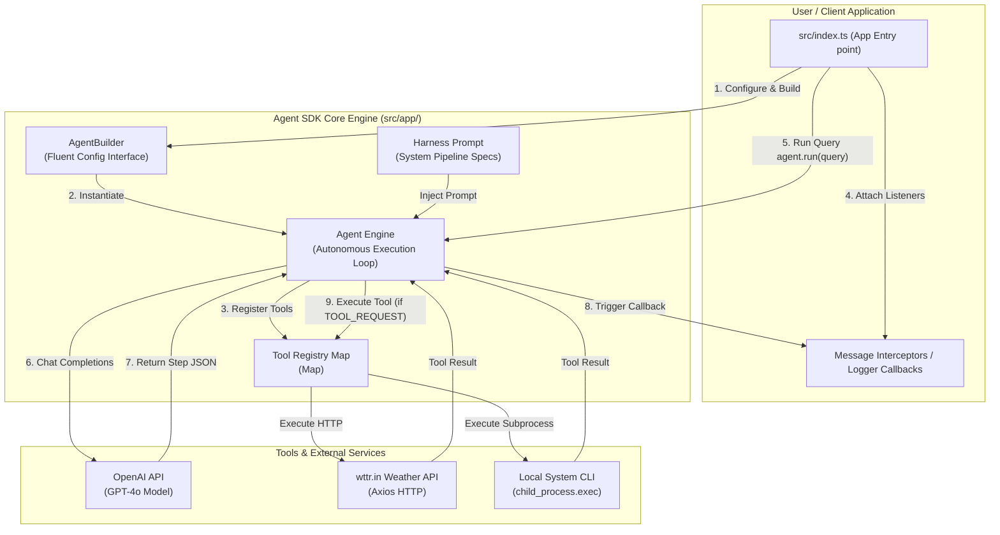
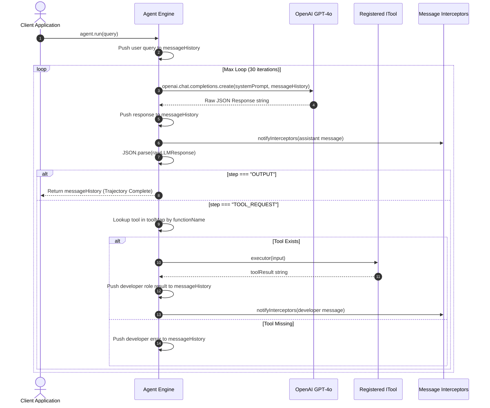

# Agent SDK Master Index — Autonomous ReAct Agent Framework

Welcome to the **Agent SDK Guide**! This guide takes TypeScript developers step-by-step through building a custom, lightweight, extensible **Autonomous AI Agent Framework** from scratch. 

Built on top of **Node.js**, **TypeScript (NodeNext ESM)**, and the **OpenAI API**, this SDK implements an explicit multi-step reasoning pipeline (**ReAct pattern**: Reasoning + Acting) with dynamic JSON parsing, tool calling capabilities, event interceptors, and a fluent Builder design pattern.

---

## 📁 Project Folder Structure Map

All code for this framework is located inside `week04/learning/day08/code/agent-sdk-sir/`:

```text
agent-sdk-sir/
├── package.json                   # NPM dependencies & project metadata ("type": "module")
├── tsconfig.json                  # TypeScript compiler configuration (NodeNext ESM)
├── implementation guide/          # Step-by-step implementation chapters & documentation
│   ├── README.md                  # Master index & architecture overview (this file)
│   ├── chapter-00-overview-setup.md
│   ├── chapter-01-harness-prompt.md
│   ├── chapter-02-types-builder.md
│   ├── chapter-03-agent-core-loop.md
│   └── chapter-04-tools-execution.md
└── src/
    ├── index.ts                   # Main application entry point & sample tool definitions
    └── app/
        ├── agent.ts               # Core Agent engine, AgentBuilder & interface contracts
        └── config.ts              # Harness system prompt & step pipeline specification
```

---

## 🏗 System Architecture & Service Ecosystem

The framework operates as an autonomous loop driven by an LLM (OpenAI GPT-4o) acting as the reasoning kernel. The core SDK manages state transitions, parses structured step instructions, invokes external tool executors, and logs message trajectories via event interceptors.



---

## 🔄 ReAct Execution Loop & Message Flow

When a user submits a prompt to `agent.run(query)`, the Agent executes an autonomous loop (up to `MAX_LOOP = 30` iterations) until it produces an `OUTPUT` step or encounters a stopping condition.



---

## 🧠 Step Pipeline State Machine

The agent follows an explicit 5-step cognitive pipeline governed by the `HARNESS_PROMPT`:

```text
    ┌───────────┐
    │  INITIAL  │  Analyze user goal and state intention
    └─────┬─────┘
          │
          ▼
    ┌───────────┐
    │   THINK   │  Decompose problem into sub-problems
    └─────┬─────┘
          │
          ▼
    ┌───────────┐
    │  ANALYSE  │  Evaluate reasoning or tool results
    └─────┬─────┘
          │
          ├─────────────────────────┐
          ▼                         ▼
    ┌──────────────┐         ┌───────────┐
    │ TOOL_REQUEST │         │  OUTPUT   │  Final Answer to User (Exit Loop)
    └──────┬───────┘         └───────────┘
           │                       ▲
           └───────────────────────┘
```

---

## 📚 Master Chapter Reference Table

| Chapter | Focus Area | Guide File | Key Topics Covered |
| :--- | :--- | :--- | :--- |
| **Ch 0** | **Overview & Setup** | [Chapter 00 Guide](chapter-00-overview-setup.md) | Node.js ESM setup, `package.json`, `tsconfig.json` NodeNext resolution, TypeScript configuration, directory structure. |
| **Ch 1** | **Harness Prompt** | [Chapter 01 Guide](chapter-01-harness-prompt.md) | System prompt engineering, ReAct step pipeline specification (`INITIAL`, `THINK`, `TOOL_REQUEST`, `ANALYSE`, `OUTPUT`), JSON output rules. |
| **Ch 2** | **Types & Builder** | [Chapter 02 Guide](chapter-02-types-builder.md) | Interfaces (`IMessage`, `ITool`, `Interceptor`), fluent Builder pattern implementation (`AgentBuilder`), method chaining logic. |
| **Ch 3** | **Agent Core Engine** | [Chapter 03 Guide](chapter-03-agent-core-loop.md) | `Agent` class implementation, dynamic prompt assembly, event interceptors, OpenAI API integration, autonomous loop, tool lookup & error handling. |
| **Ch 4** | **Tools & Execution** | [Chapter 04 Guide](chapter-04-tools-execution.md) | Building custom tools (`weatherTool` with Axios, `cliAccessTool` with `child_process.exec`), wiring up `src/index.ts`, logging, end-to-end execution. |

---

## ⚡ Quick Start Sequence

### 1. Install Dependencies
Navigate to the project folder and install the required npm packages:

```bash
cd week04/learning/day08/code/agent-sdk-sir
npm install
```

### 2. Configure Environment Variable
Set your OpenAI API key in your environment:

```bash
export OPENAI_API_KEY="your-openai-api-key-here"
```

### 3. Run the Agent SDK Demo
Execute the main entry point using `tsx` (or Node.js ESM):

```bash
npx tsx src/index.ts
```
